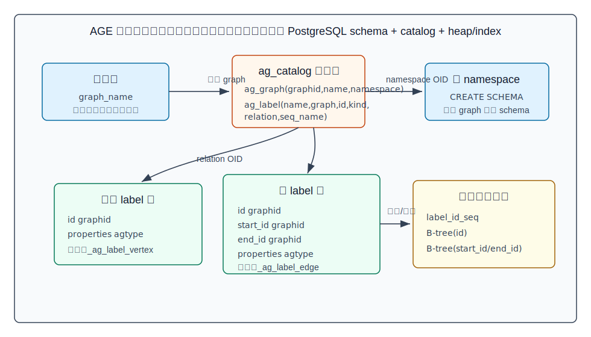
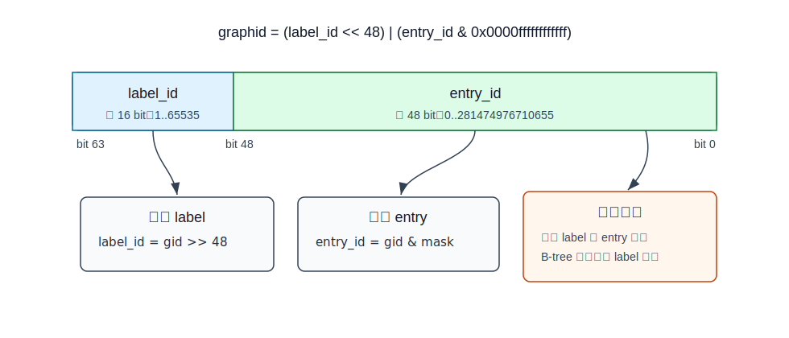
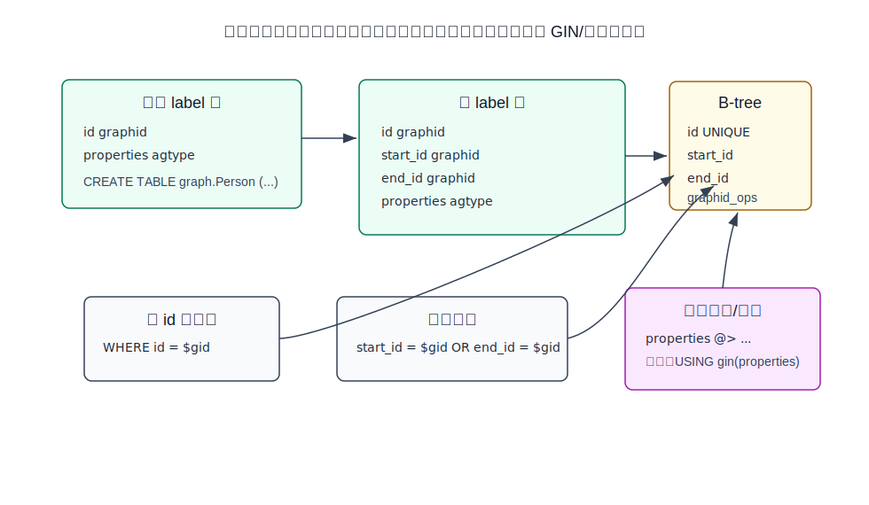
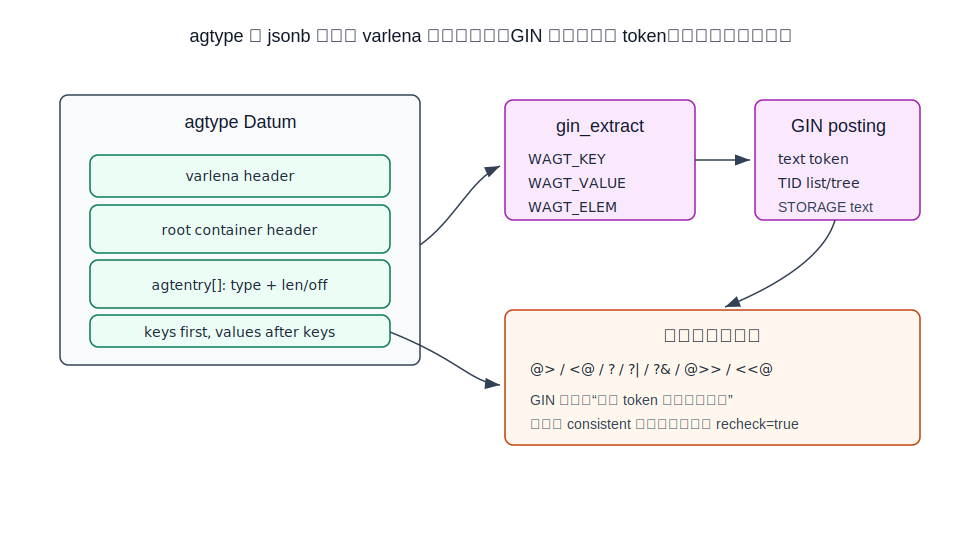
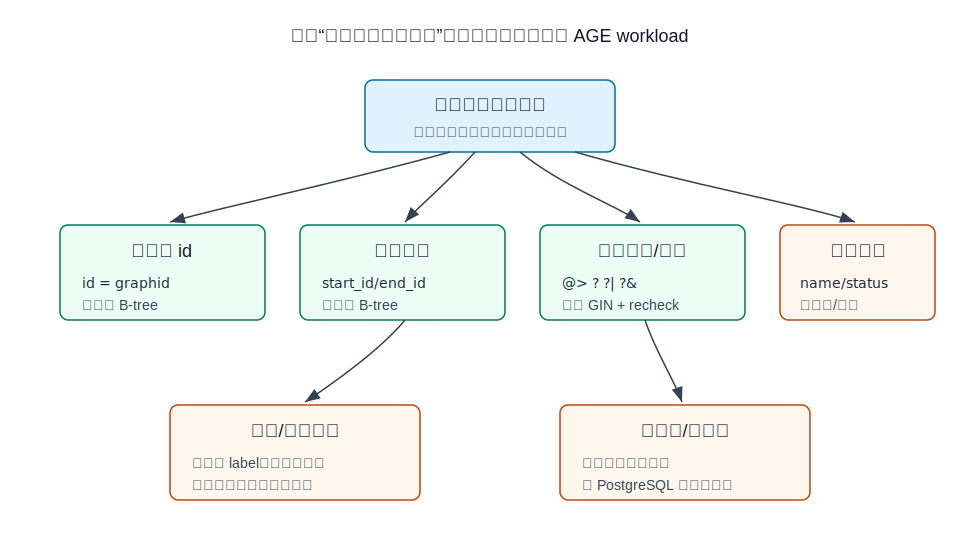

## 数据库筑基课 - AGE 图式数据存储结构与索引结构
                                                                                            
### 作者                                                                
digoal                                                                
                                                                       
### 日期                                                                     
2026-05-24                                                      
                                                                    
### 标签                                                                  
PostgreSQL , Apache AGE , AgensGraph , 图数据库 , 多模型数据库 , 表存储 , 索引结构 , agtype , GIN , 数据库筑基课      
                                                                                           
----                                                                    

## 背景
  

  
本节属于“表存储、数据类型与索引结构”的交叉基础能力。课程大纲链接未在输入资料中提供，因此本文直接从工程问题切入：业务想用图模型表达“人、设备、账号、交易、权限、知识实体之间的关系”，但团队又不想把事务、权限、备份、SQL 生态、扩展生态、运维体系全部迁移到一个新的图数据库里。

Apache AGE 的路线是关系-图混合：图逻辑上是 property graph，查询入口支持 Cypher；物理上仍落在 PostgreSQL 的 schema、heap table、sequence、B-tree、GIN、catalog、MVCC 和 WAL 体系里。这个设计的好处是接入成本低，和 PostgreSQL 能力复用度高；代价是图遍历并没有变成原生图存储引擎的邻接表内存跳转，多跳路径、属性过滤、统计信息和索引选择都要受 PostgreSQL 表结构和优化器能力约束。

本文以当前本地源码 `age` 仓库为准，重点解释四件事：

- AGE 如何把 graph、label、vertex、edge 映射成 PostgreSQL 对象。
- `graphid` 为什么是 8 字节，以及它如何影响索引排序和定位。
- `agtype` 如何存储属性，GIN 索引能解决什么，不能解决什么。
- DBA 和开发者应该怎样给 AGE 图数据建索引、验证计划、规避误用。

## 一、它解决什么问题？

AGE 解决的是“在 PostgreSQL 内部承载属性图”的问题，而不是“把 PostgreSQL 改造成原生图存储引擎”。

传统做法有三类：

- **纯关系模型：** 建 `vertex`、`edge`、`vertex_property`、`edge_property` 表，查询用 SQL join 和递归 CTE。优点是透明、可控；缺点是业务开发要手写大量图语义。
- **独立图数据库：** 使用 Neo4j、JanusGraph、TigerGraph 等。优点是图模型和遍历能力完整；缺点是多一套事务、备份、权限、运维和数据同步。
- **关系-图混合：** 在关系数据库里增加图类型、图 catalog、图查询语言和索引支持。AGE 属于这一路线，它继承 AgensGraph 的思路，但作为 PostgreSQL extension 落地。

AGE 的核心改写是：把“图对象管理”转化为“PostgreSQL 对象管理”。创建 graph 时创建 schema 和 catalog 行；创建 label 时创建物理表和 sequence；插入顶点/边时插入 heap tuple 并维护索引；属性用 `agtype` 保存；包含和键存在查询复用 GIN。

这条路线牺牲的东西也很明确：图的邻接关系不是专门的 compressed adjacency list，label 不是图引擎内部的轻量 tag，而是 PostgreSQL relation；属性过滤不是自动魔法，需要合适的 GIN、表达式索引或字段拆分。

## 二、它是什么？

AGE 的存储结构可以分成五层。

| 层次 | AGE 对象 | PostgreSQL 承载对象 | 作用 |
|---|---|---|---|
| 图元数据 | graph | `ag_catalog.ag_graph` | 记录 graph OID、名称、namespace |
| 标签元数据 | label | `ag_catalog.ag_label` | 记录 label 名称、所属 graph、类型、物理表、序列 |
| 命名空间 | graph namespace | PostgreSQL schema | 每个 graph 一个 schema |
| 图实体 | vertex/edge label | PostgreSQL heap table | 每个 label 一张物理表，可继承默认 label 父表 |
| 属性与 ID | `agtype` / `graphid` | varlena 类型 / 8 字节值类型 | 保存属性对象、实体 ID、边端点 ID |

AGE 官方文档说明：创建 graph 后，会在该 graph 的 namespace 下创建 `_ag_label_vertex` 和 `_ag_label_edge` 两张表，它们是后续顶点/边 label 的父表。源码也印证了这一点：`create_graph` 写入 `ag_graph` 后，会创建默认 vertex/edge label；`create_label` 再为每个新 label 建 sequence、物理表和 catalog 记录。



图 1 说明：AGE 的 graph 是 catalog 里的元数据，也是一个 PostgreSQL schema。每个 label 对应 schema 下的 relation，`ag_label.relation` 保存物理表 OID，`ag_label.seq_name` 保存生成 `graphid` 的 sequence 名称。图查询语言看到的是 label，存储层看到的是普通 PostgreSQL 表和索引。

## 三、核心原理

### 1. Catalog：`ag_graph` 和 `ag_label` 是图对象的根

扩展 SQL 在 `sql/age_main.sql` 中创建两张核心 catalog 表：

```sql
CREATE TABLE ag_graph (
    graphid oid NOT NULL,
    name name NOT NULL,
    namespace regnamespace NOT NULL
);

CREATE TABLE ag_label (
    name name NOT NULL,
    graph oid NOT NULL,
    id label_id,
    kind label_kind,
    relation regclass NOT NULL,
    seq_name name NOT NULL,
    CONSTRAINT fk_graph_oid FOREIGN KEY(graph) REFERENCES ag_graph(graphid)
);
```

其中 `label_id` 是 `1..65535` 的 domain，`label_kind` 只能是 `'v'` 或 `'e'`。这意味着 AGE 把 label 编号作为存储格式的一部分，而不是只把 label 名称存在属性里。

当前源码还为 catalog 建了这些索引：

| 索引 | 类型 | 用途 |
|---|---|---|
| `ag_graph_graphid_index` | B-tree unique | graph OID 唯一定位 |
| `ag_graph_name_index` | B-tree unique | graph 名称唯一 |
| `ag_graph_namespace_index` | B-tree unique | namespace 唯一 |
| `ag_label_name_graph_index` | B-tree unique | 同一 graph 下 label 名称唯一 |
| `ag_label_graph_oid_index` | B-tree unique | 同一 graph 下 label id 唯一，也支持按 graph 枚举 label |
| `ag_label_relation_index` | B-tree unique | 从 relation OID 反查 label |
| `ag_label_seq_name_graph_index` | B-tree unique | 同一 graph 下 sequence 名称唯一 |

注意这里有一个和输入摘要略有差异的地方：当前本地源码中 `ag_label_graph_oid_index`、`ag_label_relation_index`、`ag_label_seq_name_graph_index` 都是 `UNIQUE`。本文以本地源码为准。

### 2. Label 物理表：每个 label 一张 heap table

源码 `src/backend/commands/label_commands.c` 中的 `create_label()` 做了四步：

1. 从 graph cache 找到 graph OID 和 namespace。
2. 为 label 创建 sequence。
3. 为 label 创建物理表。
4. 把 label 写入 `ag_label`。

顶点 label 表的核心列是：

```sql
id graphid DEFAULT ag_catalog._graphid(...)
properties agtype NOT NULL DEFAULT ag_catalog.agtype_build_map()
```

边 label 表的核心列是：

```sql
id graphid PRIMARY KEY DEFAULT ag_catalog._graphid(...)
start_id graphid NOT NULL
end_id graphid NOT NULL
properties agtype NOT NULL DEFAULT ag_catalog.agtype_build_map()
```

源码中还明确使用 PostgreSQL inheritance：如果 label 有父 label，创建表时不再重复列定义，而是通过 `CreateStmt.inhRelations = parents` 继承父表列结构。AGE 回归测试里的安全性注释也提醒了这个后果：查询父 label 可能通过 PostgreSQL 继承读到子 label 行。

这就是论文里“通过 PostgreSQL Table Inheritance 实现 graph object management”这类方案的落点：label 层次不是单独维护一套图 schema 树，而是复用 PostgreSQL 继承。

### 3. `graphid`：64 位值里塞进 label 与局部序号

`graphid` 在源码里是 `typedef int64 graphid`，SQL 类型定义为 `INTERNALLENGTH = 8`、`PASSEDBYVALUE`、`STORAGE = plain`。它不是 UUID，也不是全局 sequence 直接生成的 bigint，而是：

```c
graphid = ((uint64)label_id << 48) | (entry_id & 0x0000ffffffffffff)
```

其中：

- 高 16 bit：`label_id`，范围 `1..65535`。
- 低 48 bit：`entry_id`，范围 `0..281474976710655`。
- `get_graphid_label_id(gid)` 通过右移 48 bit 提取 label。
- `get_graphid_entry_id(gid)` 通过 mask 提取 entry。



图 2 说明：AGE 用 label 维度切分实体 ID 空间。这样做的好处是一个 `graphid` 同时携带“属于哪个 label”和“该 label 内第几个 entry”；代价是 label 上限被固定在 16 bit，且 B-tree 排序会先受高位 label_id 影响，同一 label 的实体天然聚在一个区间。

`graphid` 的比较和索引支持也直接复用这个 64 位整数语义。`age_main.sql` 定义了 `=, <>, <, >, <=, >=`，并创建默认 B-tree operator class `graphid_ops`；`age_agtype.sql` 还定义了 hash operator class `graphid_ops_hash`，hash 函数把 64 位值高低部分异或后返回 32 位整数。

### 4. 默认索引：实体身份和边端点是内置访问路径

创建 label 表后，AGE 会生成索引。这里要区分默认 label 父表和普通子 label：

- 默认顶点 label 父表和普通顶点 label：在 `id` 上创建 unique B-tree，使用 `graphid_ops`。
- 默认边 label 父表：列定义里包含 `id graphid PRIMARY KEY`。
- 普通边 label：继承默认边父表列结构，当前 `create_table_for_label()` 显式在 `start_id` 和 `end_id` 上分别创建非唯一 B-tree，使用 `graphid_ops`；源码没有在这个路径里额外为子 edge label 的 `id` 调用 `create_index_on_column()`。

源码里的 `create_index_on_column()` 明确设置：

```c
index_stmt->accessMethod = "btree";
index_col->opclass = list_make1(makeString("graphid_ops"));
```

这三个索引对应三类最基础的图访问：

- 已知 `graphid`，定位顶点或边。
- 已知顶点，找 `start_id = vertex_id` 的出边。
- 已知顶点，找 `end_id = vertex_id` 的入边。



图 3 说明：默认 B-tree 索引只解决“实体身份”和“边端点”问题。属性查询不是自动建索引；如果 workload 经常做 `properties @> ...` 或键存在查询，需要另建 GIN 或表达式索引。如果某个属性是强约束、高频过滤字段，拆成关系列往往比把所有东西塞进 `agtype` 更稳。

AGE 的执行层也在使用这些索引。例如 `entity_exists()` 会优先找 id 上可用的 B-tree index，没有时才 fallback 到 heap scan；删除顶点时，代码会查找边表 `start_id` 和 `end_id` 上的 B-tree index，用于处理连接边。

### 5. `agtype`：JSON-like 属性，但有 AGE 自己的顶点/边/路径类型

`agtype` 是 AGE 的通用图值类型。它的外观像 JSON-like 结构，但内部不是简单文本 JSON：

- 顶层是 PostgreSQL varlena datum。
- root 是 `agtype_container`。
- container header 记录 array/object/scalar/binary 标志和元素数量。
- 每个子项有 `agtentry`，低 28 bit 记录长度或 offset，中间 bit 记录类型，高 bit 表示是否为 offset。
- object 的 keys 先存，values 后存，key 按排序顺序排列，以改善 key 查找的局部性。
- `AGTV_VERTEX`、`AGTV_EDGE`、`AGTV_PATH` 是 AGE 扩展出来的图值类型。

源码里还为 vertex/edge 定义了固定字段位置：vertex 的字段顺序是 `id, label, properties`；edge 的字段顺序是 `id, label, end_id, start_id, properties`。这让 AGE 在处理顶点/边值时可以直接访问字段，而不是每次都做一般对象查找。

### 6. GIN：属性 token 过滤，不是结构精确证明

`sql/agtype_gin.sql` 定义了默认 GIN operator class `gin_agtype_ops`：

| 策略 | 操作符 | 语义 |
|---|---|---|
| 7 | `@>` | 左包含右 |
| 8 | `<@` | 左被右包含 |
| 9 | `?` | 键存在 |
| 10 | `?|` | 任一键存在 |
| 11 | `?&` | 所有键存在 |
| 12 | `@>>` | 路径包含类操作 |
| 13 | `<<@` | 路径被包含类操作 |

GIN support function 会遍历 `agtype`，把 key、value、部分 array element 抽成 text token。源码 `gin_consistent_agtype()` 的注释很关键：GIN 不保存完整 item 结构，只知道查询抽取出来的 token 是否出现在某个 indexed item 里；对于包含和存在类判断，通常必须设置 `recheck = true`，由 heap tuple 上的原始 `agtype` 再做一次精确判断。



图 4 说明：GIN 索引能快速排除“不可能匹配”的 tuple，但不能对复杂结构匹配给出完全证明。它的工程价值是降低候选集；它的工程成本是额外写放大、索引体积和 heap recheck。对于低选择性属性，GIN 命中大量行时不一定比顺序扫描更好。

### 7. Cypher 到 PostgreSQL 执行：图语义最终要落到关系访问

AGE 支持 Cypher，但执行不是绕过 PostgreSQL。创建、更新、删除实体时，执行器会构造 tuple slot，调用 `table_tuple_insert()`、`ExecInsertIndexTuples()`、`table_tuple_update()` 等 PostgreSQL executor 路径。查询计划也要依赖 relation、attribute、operator class、统计信息和可用索引。

这和“Translating Cypher to SQL inside Relational Database Engines”“Cost-Based Query Optimization for Relational-Graph Hybrid Systems”这类论文问题是一致的：图 pattern 最终要被拆成表扫描、索引扫描、连接、过滤和投影。关键挑战不是语法翻译本身，而是：

- label 选择性是否准确。
- `start_id/end_id` 过滤能否尽早发生。
- 属性过滤在 GIN、表达式索引、顺序扫描之间怎么选。
- 多跳扩展是否造成路径组合爆炸。
- PostgreSQL 统计信息是否能描述 `agtype` 内部属性分布。

## 四、横向对比

| 维度 | Apache AGE | AgensGraph 类内核扩展 | 纯关系建模 | 原生图数据库 |
|---|---|---|---|---|
| 部署形态 | PostgreSQL extension | PostgreSQL 派生/深度集成版本 | 普通 PostgreSQL schema | 独立数据库 |
| 图对象管理 | `ag_graph/ag_label` + schema/table | 内核内图 catalog | 用户自建表 | 原生 graph catalog |
| 顶点/边存储 | 每 label 一张 heap table | 关系-图混合存储 | 用户定义 vertex/edge 表 | 专用邻接/边存储 |
| 属性存储 | `agtype` | 类似 graph value 类型 | JSONB/EAV/列 | property store |
| 默认索引 | graphid B-tree、边端点 B-tree | 依实现而定 | 用户自建 | 通常有邻接索引 |
| 属性索引 | 可用 GIN/表达式索引 | 依实现而定 | JSONB GIN/表达式索引 | 属性索引 |
| 事务/MVCC | 完全复用 PostgreSQL | 通常复用 PostgreSQL | 完全复用 PostgreSQL | 各系统自有 |
| 多跳遍历 | 受 PostgreSQL 执行模型约束 | 可能更深度优化 | 手写递归/连接 | 通常更强 |
| 运维成本 | 低，跟随 PostgreSQL | 中，依发行版 | 低 | 高，需要新系统 |
| 适合场景 | PostgreSQL 生态内的中等规模图查询、多模型融合 | 深度图 SQL/Cypher 混合 | 结构固定、SQL 团队强 | 大规模深度遍历、图算法 |

这张表的关键不是谁“绝对更快”。AGE 的价值在于把图能力嵌入 PostgreSQL 生态；它的边界也在这里：当 workload 的主要矛盾变成深度遍历、路径枚举、图算法和全图分析时，heap table + B-tree 的通用路径不一定是最合适的物理模型。

## 五、效果如何？

不要把 AGE 理解成“装了 extension，图查询就天然快”。它的效果取决于访问路径是否能被 PostgreSQL 高效执行。

**收益：**

- 事务、权限、备份、WAL、MVCC、SQL、扩展生态都复用 PostgreSQL。
- graph、label、properties 可以和普通关系表一起查询、管理和迁移。
- `graphid` 是 8 字节 pass-by-value 类型，适合 B-tree 等值、排序和 join key。
- `start_id/end_id` 默认有 B-tree，常见一跳邻接查询有基础索引路径。
- `agtype` 可以用 GIN 做属性包含和键存在过滤。

**代价：**

- 每个 label 一张物理表，label 过多会带来 relation、catalog、统计信息、DDL 和 plan 管理成本。
- 边查询本质是按 `start_id/end_id` 扫边表，不是原生图引擎的邻接链表跳转。
- `agtype` 的灵活性会削弱列统计、约束和类型检查。
- GIN 索引需要 recheck，写入、更新和 VACUUM 成本不可忽略。
- 多跳路径可能快速放大中间结果，必须控制 label、方向、深度和过滤条件。

## 六、实操 DEMO

下面示例用于验证存储对象和索引结构。本文没有在本机启动 PostgreSQL + AGE 实例执行，因此不提供伪造输出；SQL 语法按 AGE README 和源码对象名编写，读者可在安装 AGE 的 PostgreSQL 环境中运行。

```sql
LOAD 'age';
SET search_path = ag_catalog, "$user", public;

SELECT create_graph('age_foundation');
SELECT create_vlabel('age_foundation', 'Person');
SELECT create_elabel('age_foundation', 'Knows');

SELECT *
FROM cypher('age_foundation', $$
  CREATE (:Person {name: 'Alice', city: 'Hangzhou'}),
         (:Person {name: 'Bob', city: 'Shanghai'})
$$) AS (v agtype);

SELECT *
FROM cypher('age_foundation', $$
  MATCH (a:Person), (b:Person)
  WHERE a.name = 'Alice' AND b.name = 'Bob'
  CREATE (a)-[:Knows {since: 2026}]->(b)
$$) AS (e agtype);
```

查看 AGE catalog：

```sql
SELECT graphid, name, namespace
FROM ag_catalog.ag_graph
WHERE name = 'age_foundation';

SELECT name, graph, id, kind, relation, seq_name
FROM ag_catalog.ag_label
WHERE graph = (
  SELECT graphid FROM ag_catalog.ag_graph WHERE name = 'age_foundation'
)
ORDER BY id;
```

查看 label 物理表和索引：

```sql
SELECT
  n.nspname AS schema_name,
  c.relname AS table_name,
  a.attnum,
  a.attname,
  format_type(a.atttypid, a.atttypmod) AS data_type
FROM pg_class c
JOIN pg_namespace n ON n.oid = c.relnamespace
JOIN pg_attribute a ON a.attrelid = c.oid
WHERE n.nspname = 'age_foundation'
  AND c.relkind = 'r'
  AND a.attnum > 0
  AND NOT a.attisdropped
ORDER BY c.relname, a.attnum;

SELECT
  tablename,
  indexname,
  indexdef
FROM pg_indexes
WHERE schemaname = 'age_foundation'
ORDER BY tablename, indexname;
```

为高频属性查询补 GIN 索引：

```sql
CREATE INDEX person_properties_gin_idx
ON age_foundation."Person"
USING gin (properties);

EXPLAIN (ANALYZE, BUFFERS)
SELECT *
FROM age_foundation."Person"
WHERE properties @> '{"city": "Hangzhou"}'::agtype;
```

为高频标量属性补表达式索引时，要先确认表达式与查询语句完全匹配。示例仅表达方向，具体函数和类型转换应以实际 AGE 版本验证：

```sql
CREATE INDEX person_city_expr_idx
ON age_foundation."Person" ((properties ->> '"city"'));
```

验证时不要只看是否走索引，还要看：

- `Rows Removed by Filter` 是否很大。
- GIN `Recheck Cond` 是否导致大量 heap recheck。
- `Buffers` 是否真的下降。
- label 表数量和单表行数是否让统计信息稳定。
- 写入 TPS 和索引大小是否还能接受。

## 七、最佳实践



图 5 说明：AGE 的索引设计要从访问路径反推，而不是从“属性很多”反推。默认索引适合身份定位和一跳邻接；GIN 适合包含和键存在的候选集缩小；高频标量属性最好考虑表达式索引或拆列；多跳路径要优先控制搜索空间。

**面向数据库架构师：**

- 把 graph 当成 PostgreSQL schema 级对象规划。graph 数量、label 数量、权限边界、备份恢复、迁移策略要提前定。
- 不要把所有实体都塞进一个大 label，也不要把每个业务细分都建成独立 label。前者让过滤依赖属性，后者让 relation 膨胀。label 应该对应稳定、查询路径明显不同的实体/关系类型。
- 对强约束字段、强统计字段、强 join 字段，优先考虑关系列或旁路关系表。`agtype` 适合灵活属性，不适合替代所有 schema 设计。

**面向 DBA：**

- 定期检查 `ag_catalog.ag_label`、`pg_class`、`pg_indexes`，确认 label 表和索引数量没有失控。
- 对大 label 表执行 `ANALYZE`，尤其是批量导入后。没有统计信息，优化器很难选择正确 join 和 scan 路径。
- 监控 GIN 索引体积、pending list、VACUUM 压力和 recheck 比例。GIN 是读优化，不是免费午餐。
- 删除大量顶点/边后关注表和索引膨胀。AGE 走 PostgreSQL heap/MVCC 路径，空间回收仍依赖 VACUUM、REINDEX、CLUSTER 或重写。

**面向业务开发者：**

- 查询图之前先限定 label、方向和深度。例如优先写 `MATCH (a:Person)-[:Knows]->(b:Person)`，少写无界的 `MATCH (a)-[r]->(b)`。
- 属性查询不要默认相信 `n.name = 'Alice'` 一定有索引。确认它最终落到哪张 label 表、哪个属性表达式、哪个 operator。
- 高频路径要保留可观测 SQL：用 `EXPLAIN`、catalog 查询和 `pg_stat_user_indexes` 证明索引有价值。
- 对多跳查询设置业务上限。没有深度上限、没有 label 约束、没有方向约束的路径匹配，很容易把关系引擎拖入组合爆炸。

## 八、适合与不适合场景

适合：

- 已经以 PostgreSQL 为核心系统，希望补充图查询能力。
- 图数据规模中等，主要是一跳、两跳关系查询，且能通过 label、方向、属性过滤收窄候选集。
- 需要 SQL + Cypher 混合分析，比如关系主数据、JSON 属性、向量检索、时序数据和图关系共存在 PostgreSQL。
- 团队希望复用 PostgreSQL 权限、事务、备份、审计、扩展生态。

不适合：

- 深度路径遍历、全图算法、实时推荐图、超大规模动态图分析是主 workload。
- label 和属性极度动态，导致 relation 数量、索引数量和统计信息无法管理。
- 每次查询都需要在 `agtype` 深层属性上做复杂过滤，却不愿拆列或设计表达式索引。
- 需要图引擎级别的邻接压缩、路径缓存、分布式图计算或专用 traversal optimizer。

## 九、常见坑

1. **把 AGE 当成黑盒图数据库。** 它的底层是 PostgreSQL 表和索引。性能问题要回到 relation、index、stats、EXPLAIN 上定位。
2. **label 设计过细。** label 每增加一个，就多一张表、一个 sequence、catalog 行和索引集合。过细会带来元数据和计划管理成本。
3. **label 设计过粗。** 所有实体放一张大表会让查询严重依赖 `properties` 过滤，统计信息和索引选择变差。
4. **以为 `agtype` GIN 是精确匹配。** GIN 主要做 token 过滤，复杂结构通常需要 heap recheck。
5. **忽略 `start_id/end_id` 的方向。** 有向边查询应该尽量明确方向，避免两边都扫。
6. **把灵活属性当强 schema。** 如果字段要做约束、join、排序、范围查询和高频过滤，应该考虑关系化。
7. **批量导入后不 `ANALYZE`。** 优化器没有统计信息，就很难合理估算 label 表和属性过滤选择性。
8. **只看单条查询延迟，不看写入放大。** 每个新增 GIN/表达式索引都会增加写入和维护成本。

## 十、扩展问题

1. 如果 AGE 要支持更强的多跳 cost model，统计信息应该记录在 label 级、edge 级，还是 `(start_label, edge_label, end_label)` 级？
2. `graphid` 的高 16 bit 是 label id。这个设计对跨 label 排序、范围扫描和分区有什么影响？
3. 如果一个属性从低频过滤变成核心业务字段，什么时候应该从 `agtype` 迁移成普通列？
4. PostgreSQL inheritance 能表达 label 层次，但它的权限、统计、约束和查询继承语义会带来哪些运维风险？
5. GIN 对 `agtype` 设置 recheck 的原因是什么？能否设计一个更结构化的 opclass 减少 recheck？

## 十一、扩展阅读

- Apache AGE 官方文档：Graphs，说明 graph、vertex、edge、properties 以及创建 graph 后的默认 label 表。<https://age.apache.org/age-manual/master/intro/graphs.html>
- Apache AGE GitHub README，说明 AGE 是 PostgreSQL extension，支持 Cypher、Hybrid Querying、Property Indexes，并给出基础 Cypher 示例。<https://github.com/apache/age>
- Apache AGE DeepWiki：项目结构、核心类型 `agtype/graphid`、GIN 支持的架构概览。<https://deepwiki.com/apache/age/>
- PostgreSQL 官方文档：Table Inheritance，用于理解 AGE label 父子表语义。<https://www.postgresql.org/docs/10/ddl-inherit.html>
- 本地源码：`age/sql/age_main.sql`，`ag_graph/ag_label`、`graphid` 类型、B-tree opclass。
- 本地源码：`age/sql/agtype_gin.sql`，`gin_agtype_ops` 操作符类。
- 本地源码：`age/src/include/utils/graphid.h` 与 `age/src/backend/utils/adt/graphid.c`，`graphid` 位布局、比较和 hash 函数。
- 本地源码：`age/src/backend/commands/label_commands.c`，label 表、sequence、默认索引和 inheritance 创建流程。
- 本地源码：`age/src/include/utils/agtype.h` 与 `age/src/backend/utils/adt/agtype_util.c`，`agtype` 二进制布局。
- 本地源码：`age/src/backend/utils/adt/agtype_gin.c`，GIN token 提取、consistent 和 recheck 行为。
- Jiaheng Lu, Irena Holubova, *Multi-model Databases: A New Journey to Handle the Variety of Data*，用于理解多模型数据库的背景和挑战。<https://www.cs.purdue.edu/homes/csjgwang/CloudNativeDB/MultiModelCSUR19.pdf>
- 输入中给出的论文题目：*AgensGraph: A Practical Relational-Graph Hybrid Database OS*、*Implementation of Graph Object Management via PostgreSQL Table Inheritance*、*Translating Cypher to SQL inside Relational Database Engines*、*Cost-Based Query Optimization for Relational-Graph Hybrid Systems*。本次未在本地获得这些论文全文，因此本文没有引用其具体实验结论；实现细节以 Apache AGE 源码和官方文档为准。
  
## 附录  
  
1、问 gemini  
```  
postgresql age图插件相关的论文.
```  
  
2、克隆代码  
```  
git clone --depth 1 https://github.com/apache/age
```  
  
3、启用 codex, 使用 [数据库筑基课 skill](../skills/README.md).  
````
文章标题: 
  数据库筑基课 - AGE 图式数据存储结构与索引结构
项目源码(已克隆到当前项目如下目录中):  
  age
论文: 
  AgensGraph: A Practical Relational-Graph Hybrid Database OS
  Multi-Model Databases: A Survey
  Implementation of Graph Object Management via PostgreSQL Table Inheritance
  Translating Cypher to SQL inside Relational Database Engines
  Cost-Based Query Optimization for Relational-Graph Hybrid Systems
项目 deepwiki reponame:  
  apache/age
项目参考信息: 
```
  Catalog 表

  ┌──────────┬────────────────────────────────────────────────────────────────────────┐
  │    表    │                                  用途                                  │
  ├──────────┼────────────────────────────────────────────────────────────────────────┤
  │ ag_graph │ 管理图，存储 graphid(oid)、图名、namespace                             │
  ├──────────┼────────────────────────────────────────────────────────────────────────┤
  │ ag_label │ 管理标签，存储标签名、所属图、kind(v/e)、关联的物理表 relation、序列名 │
  └──────────┴────────────────────────────────────────────────────────────────────────┘

  顶点/边物理表
  
  每创建一个 label，就会在图的 namespace 下创建一张物理表：
  - 顶点表：id(graphid PK), properties(agtype)
  - 边表：id(graphid PK), start_id, end_id, properties

  graphid 组成

  48-bit entry_id + 16-bit label_id  →  8字节 int64
  
  通过位操作从 graphid 中提取 label_id 和 entry_id。

  agtype

  自定义二进制格式存储 JSON-like 结构，支持 GIN 索引做包含查询（@>、<@、? 等）。

  ---
  AGE 索引结构

  Catalog 索引（ag_graph / ag_label）

  ┌───────────────────────────┬───────────────┬─────────────────────┐
  │           索引            │     类型      │        用途         │
  ├───────────────────────────┼───────────────┼─────────────────────┤
  │ ag_graph_graphid_index    │ B-tree UNIQUE │ graphid 主键        │
  ├───────────────────────────┼───────────────┼─────────────────────┤
  │ ag_graph_name_index       │ B-tree UNIQUE │ 图名唯一            │
  ├───────────────────────────┼───────────────┼─────────────────────┤
  │ ag_graph_namespace_index  │ B-tree UNIQUE │ namespace 唯一      │
  ├───────────────────────────┼───────────────┼─────────────────────┤
  │ ag_label_name_graph_index │ B-tree UNIQUE │ (name, graph) 唯一  │
  ├───────────────────────────┼───────────────┼─────────────────────┤
  │ ag_label_relation_index   │ B-tree        │ relation 反查 label │
  ├───────────────────────────┼───────────────┼─────────────────────┤
  │ ag_label_graph_oid_index  │ B-tree        │ 按图查所有 label    │
  └───────────────────────────┴───────────────┴─────────────────────┘

  graphid 索引

  - B-tree：graphid_ops 操作类（B-tree 比较函数 + 排序）
  - Hash：graphid_ops_hash 操作类（hash 比较）

  在顶点/边表上：
  - 顶点表：id 建立 unique B-tree 主键索引（使用 graphid_ops）
  - 边表：start_id 和 end_id 各建 B-tree 索引（使用 graphid_ops）

  GIN 索引
  
  agtype 支持 GIN 索引（gin_agtype_ops），支持操作符：
  - @> / <@（包含）
  - ? / ?& / ?|（键存在）
  - @>> / <<@（路径包含）
```
````
  
  
#### [PostgreSQL 解决方案集合](../201706/20170601_02.md "40cff096e9ed7122c512b35d8561d9c8")
  
  
#### [德哥 / digoal's Github - 公益是一辈子的事.](https://github.com/digoal/blog/blob/master/README.md "22709685feb7cab07d30f30387f0a9ae")
  
  
#### [About 德哥](https://github.com/digoal/blog/blob/master/me/readme.md "a37735981e7704886ffd590565582dd0")
  
  

  
