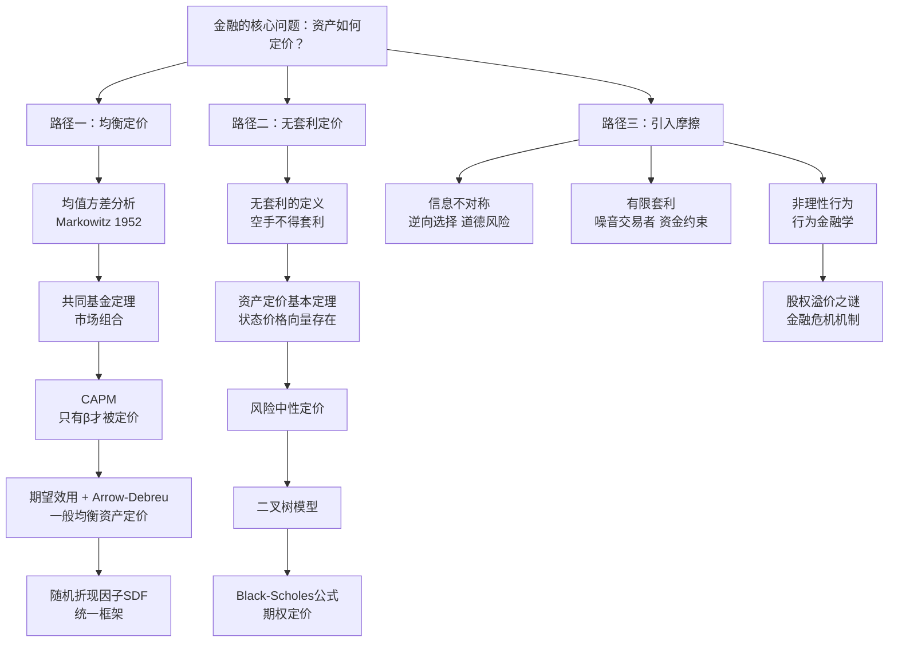

## 《金融经济学二十五讲》读书笔记
  
### 作者  
digoal  
  
### 日期  
2026-05-24  
  
### 标签  
读书笔记 , 金融经济学二十五讲   
  
----  
  
## 背景  
   
---
书名: 《金融经济学二十五讲》   
作者: 徐高   
出版年份: 2018   
出版社: 中国人民大学出版社   
笔记日期: 2025-05-25   
豆瓣链接: https://book.douban.com/subject/30296163/   
标签: [金融经济学, 资产定价, 金融理论, 教材, 北大讲义]   
---

   

> **一句话**：一部把西方金融理论的骨架讲清楚、把中国金融的血肉填进去的本土精品教材。   
> **适合谁读**：有微积分基础的本科生、想系统补课的金融从业者、考研备考者   
> **阅读难度**：⭐⭐⭐☆☆（数学不恐惧，但需要耐心）   
> **推荐指数**：⭐⭐⭐⭐☆   

---

## 一、时代坐标：这本书从哪里来？

2018年，中国金融市场正在经历一个复杂的历史节点。一方面，股市经历了2015年的杠杆崩盘余震未消；另一方面，以P2P为代表的金融创新野蛮生长、监管套利盛行。与此同时，高校金融教育长期面临一个尴尬：要么用美国教材（Brealey、Cochrane、Hull），理论精密却与中国现实脱节；要么用本土教材，叙述浮浅，把金融学讲成了金融工具的堆砌目录。

徐高在这个空当里切入。他是北京大学经济学博士，先后在世界银行、瑞银、光大证券任职，是典型的"学术修炼 + 市场浸泡"复合型经济学家。这本书源于他在北京大学国家发展研究院数年的授课讲稿——用他自己的话说，是"在反复打磨讲义的过程中，才渐渐找到了讲清楚这门课的方法"。

他要解决的核心问题是：**怎样用本科生能接受的数学，把现代金融理论的思想内核讲明白，同时不让中国的金融现实消失在黑板上？**

```
时间轴（金融经济学理论演进）

1952 ──── Markowitz 均值方差 ──── 现代投资组合理论奠基
1964 ──── Sharpe/Lintner CAPM ─── 均衡资产定价的第一个大厦
1972 ──── Black-Scholes 期权 ────── 无套利定价的革命
1976 ──── Ross APT ──────────────  套利定价理论
2001 ──── Cochrane《Asset Pricing》── 随机折现因子统一框架
2018 ──── 徐高《金融经济学二十五讲》── 中文语境下的系统整合
```

---

## 二、核心命题：作者在说什么？

全书二十五讲按逻辑分为五部分，贯穿三条主线：**均衡定价 → 无套利定价 → 金融摩擦**。这不只是章节划分，而是现代金融学思想演进的真实路径。

### 命题一：价格是"风险的价格"，而非"资产的价格"

徐高反复强调，金融经济学的核心不是预测价格，而是理解**风险如何被定价**。从均值方差分析到CAPM，再到随机折现因子（SDF），本质上都在回答同一个问题：投资者为了承担某种风险，要求多少额外收益补偿？

CAPM的精髓用一行公式就能表达：

```
E(Ri) - Rf = βi × [E(Rm) - Rf]

其中 βi = Cov(Ri, Rm) / Var(Rm)
```

这个公式的哲学含义是：一个资产真正有价值的风险，不是它自身的波动（方差），而是它与整个市场共同波动的程度（协方差）。可以通过分散化消除的风险，不应该获得额外回报。**只有系统性风险才值钱。**

### 命题二：无套利是比均衡更强的约束

全书第三部分（第13-19讲）讲的是"无套利定价"，这是一个思想上的跃升。均衡定价需要假设所有人的效用函数、市场出清；而无套利定价只需要一个假设：**市场上不存在"空手套白狼"的机会**——不花钱却能在某种状态下获得正收益。

这个假设几乎无可置疑，却能推导出强大的结论：资产定价基本定理告诉我们，只要无套利成立，就必然存在一组"状态价格"（阿罗-德布鲁证券的价格），可以用来给所有资产定价。Black-Scholes期权定价公式本质上是这一思想的具体应用：用无套利约束 + 二叉树（或连续时间布朗运动），推导出期权应有的唯一价格。

### 命题三：金融摩擦才是解释现实的关键

前两部分（均衡定价、无套利定价）建立在完美市场假设上。但现实的金融世界充满摩擦：信息不对称、道德风险、有限套利、投资者非理性。第四部分（第20-24讲）引入这些摩擦，正是全书思想上最富张力的地方。

信息不对称导致逆向选择（好车主和坏车主难以区分，好资产和坏资产难以区分）；道德风险让委托-代理关系充满博弈；有限套利则解释了为什么"错误定价"可以持续存在而不被纠正——因为套利者自己也有资金约束和风险承受边界。

这三块拼在一起，才勾勒出一个"有血有肉"的金融市场图景。

---

## 三、论证地图：作者怎么说服你的？



**论证方式评价**：徐高特别擅长"先讲故事，再给公式"。他几乎在每个核心概念前都会先用日常语言解释直觉，再引入数学表达。这种编排不是为了降低严谨性，而是让读者在推导时不会迷失——"我知道这个公式在说什么，现在只是把它写严格"。

书中穿插的"中国案例专栏"是一大亮点。327国债事件、中国A股的"政策市"特征、影子银行的信息不对称机制——这些案例让抽象理论突然照进现实，是同类教材里少见的。

---

## 四、前提假设与边界：什么情况下这不成立？

### 假设一：投资者是理性的效用最大化者

整个均衡定价体系（包括CAPM）都建立在理性人假设上。但行为金融学的大量实验表明，真实投资者系统性地高估小概率事件、对损失过度敏感（损失厌恶）、存在锚定效应。当市场中非理性投资者的比例足够大，且套利者受到资金约束时，"错误定价"可以持续相当长时间——这正是本书第四部分的主题，但作为前提批判，书中着墨不多。

### 假设二：市场是完备的（或近似完备的）

Arrow-Debreu状态价格体系要求市场完备，即每一种状态下的权利都有对应的资产可以交易。现实中大量风险无法对冲（如人力资本风险、流动性风险、部分尾部风险），这意味着理论框架的适用边界需要谨慎评估。

### 假设三：无套利条件在任何时间段内均成立

2008年金融危机期间出现了大量无套利关系的"暂时失效"——理论上等价的资产之间出现了持续的价差，因为套利者自身流动性枯竭、被迫平仓。本书对极端市场条件下的分析较为简略，这是理解危机机制时需要补充的视角。

**适用边界总结**：本书的理论框架最适用于"正常市场、理性参与者为主、市场相对完备"的场景。极端情境下的价格行为，需要结合第四部分的摩擦理论，乃至更专门的危机经济学文献。

---

## 五、思想谱系：这本书在哪个传统里？

```
西方主流资产定价理论谱系

Markowitz(1952) → Sharpe/Lintner(1964) CAPM
                ↘
                 Merton(1973) ICAPM → C-CAPM
                                    ↓
Ross(1976) APT → Cochrane(2001) SDF统一框架
                                    ↓
                          徐高(2018)：中文语境整合 + 中国案例
```

徐高的选择明显受到Cochrane《Asset Pricing》的影响——用随机折现因子作为统一语言，把均值方差、CAPM、C-CAPM、无套利定价全部纳入同一框架，避免了多套语言体系并列带来的混乱感。

与国内同类教材（如张圣平、郑振龙的衍生品教材，朱世武的金融工程教材）相比，徐高的特色在于：**更注重思想史的贯通，而不只是工具的罗列**。他愿意告诉你"这个定理是怎么被发现的，当时的问题意识是什么"，而不只是给你一堆公式。

与此同时，由于作者本人有丰富的宏观分析和市场研究经历，本书在金融摩擦部分对中国制度背景的解读，是许多纯学术教材所缺乏的。

---

## 六、我学到了什么？

读完这本书，我觉得收获最大的不是某个具体公式，而是三个思维转变。

**第一，理解了"定价"和"预测"的区别。** 大多数人进入金融学是为了"知道明天股价涨还是跌"。但这本书从第一讲就在说：金融经济学的核心是给风险定价，而不是预测价格。两者不是一回事——你可以在不知道明天涨跌的情况下，正确评估一个期权值多少钱。这个区分，帮我扫除了很多学习上的迷雾。

**第二，理解了"无套利"的力量。** 无套利思想是现代金融工程的基石，但它的美妙在于：它不需要你对"未来会发生什么"有任何主观判断，只需要用当下市场上已经存在的资产互相约束，就能推导出新资产的价格。这是一种极为克制、极为优雅的推理方式。

**第三，理解了摩擦的必要性。** 完美市场的理论是一把锋利的刻刀，雕刻出了金融学最干净的骨架。但骨架不是真实的人。金融摩擦——信息不对称、资金约束、非理性——才是把金融市场从教科书带回现实世界的那双手。两者缺一不可。

---

## 七、举一反三：这个框架还能用在哪？

**用无套利思想做决策**：在商业决策中，如果一种方案能在所有场景下都不弱于另一种方案，且在某些场景下更好，那么放弃前者就是"套利机会被浪费"。这个逻辑可以用来识别组织中的冗余流程和次优决策。

**用随机折现因子理解保险**：保险的本质是一种Arrow证券——你在状态"坏"时获得赔偿，在状态"好"时支付保费。理解了这一点，就能更清晰地分析保险产品的合理定价与消费者行为。

**用信息不对称分析招聘**：逆向选择理论（Akerlof的"柠檬市场"）不只适用于二手车市场，同样适用于劳动力市场——当雇主无法区分候选人质量时，优秀的人反而可能离场，这解释了为什么很多公司的招聘机制会产生"劣币驱逐良币"的现象。

---

## 八、批判与反思

**中国案例还不够深**：专栏性质的中国案例是本书的亮点，但篇幅有限，点到为止。比如提到"影子银行"的信息不对称，却没有深入分析2013-2018年中国理财市场刚性兑付的经济学机制。这部分的中国化深度，与作者《宏观经济学二十五讲》相比仍有差距。

**第25讲有些虎头蛇尾**：作者把第25讲单独设为方法论反思，讨论金融理论的边界和局限，用意深远。但实际内容相对浅短，更像是一篇随笔，与前24讲的严密论证风格落差较大。如果扩充为真正的"元理论"讨论，会更有价值。

**行为金融学的部分较弱**：书中第四部分虽然引入了非理性，但行为金融学本身是一个庞大的领域——前景理论、心理账户、过度自信、羊群效应——这些只是被简略提及。对于想深入理解市场异象的读者，还需要配合Thaler、Shiller等人的著作补充阅读。

**时代局限**：2018年出版的教材，对于近年来崛起的加密资产、算法交易、ESG定价等新议题没有涉及，这是客观的时代限制，不是缺陷，但读者需要自行补课。

---

## 九、金句与记忆点

1. **"金融是跨时间的价值交换，而不只是货币的流动。"**
   — 开篇对金融本质的定义，简短但精准，让人重新认识金融的边界。

2. **"风险可以通过分散化消除的部分，不应该获得风险溢价。"**
   — CAPM的哲学精髓。只有系统性风险值钱，这是一个深刻的公平观。

3. **"无套利不是说没有人在套利，而是说套利机会在均衡中趋于消失。"**
   — 纠正了对无套利假设的常见误解，区分了静态与动态视角。

4. **"状态价格的存在，意味着市场在给每一种未来状态'定价'。"**
   — Arrow-Debreu体系的直觉解读，把抽象数学变成可感知的经济图像。

5. **"期望效用理论告诉我们，投资者的选择可以用期望来刻画——但前提是效用函数正确。"**
   — 暗示了理论的假设边界，是很好的批判性思维训练。

6. **"信息不对称不只是让价格不公平，它会让市场根本不存在。"**
   — 逆向选择的极端后果，是理解金融监管必要性的理论基础。

7. **"有限套利说明，知道正确价格和能够从中获利，是两件不同的事。"**
   — 对"聪明资金"局限性的清醒认识，也是很多量化策略失败的根因。

---

## 十、延伸阅读

**入门衔接**：
- 徐高《宏观经济学二十五讲：中国视角》（中国人民大学出版社，2019）
  — 与本书构成姊妹篇，宏观视角与微观金融相互补充，同一作者风格一致，建议配套阅读。

**深化理论**：
- John Cochrane《Asset Pricing》（Princeton UP，2001）
  — 本书的重要思想来源，随机折现因子框架的集大成之作，数学要求更高，适合研究生阶段进阶。

- Robert Shiller《非理性繁荣》（中信出版社）
  — 行为金融学与资产泡沫研究的经典，弥补本书行为金融部分的不足，可读性极强。

**金融摩擦与危机**：
- Andrei Shleifer《并非有效的市场：行为金融学导论》
  — 系统介绍有限套利与市场异象，是本书第四部分最好的延伸读本。

- 明斯基《稳定不稳定的经济》（清华大学出版社）
  — 用"金融不稳定假说"解释经济周期与金融危机，与本书金融摩擦部分形成对话。

---

*笔记写于 2025-05-25 | 基于公开资料、豆瓣评论与深度思考整理 | 金融理论参考标准教材体系*
  
  
#### [PostgreSQL 解决方案集合](../201706/20170601_02.md "40cff096e9ed7122c512b35d8561d9c8")
  
  
#### [德哥 / digoal's Github - 公益是一辈子的事.](https://github.com/digoal/blog/blob/master/README.md "22709685feb7cab07d30f30387f0a9ae")
  
  
#### [About 德哥](https://github.com/digoal/blog/blob/master/me/readme.md "a37735981e7704886ffd590565582dd0")
  
  

  
