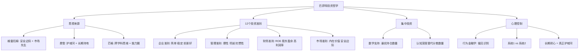

## 《巴菲特之道》读书笔记
  
### 作者  
digoal  
  
### 日期  
2026-05-24  
  
### 标签  
读书笔记 , 巴菲特之道   
  
----  
  
## 背景  
   
---
书名: 《巴菲特之道（原书第3版）》   
作者: 罗伯特·哈格斯特朗（Robert G. Hagstrom）   
译者: 杨天南   
出版年份: 2020   
笔记日期: 2025-05-25   
豆瓣链接: https://book.douban.com/subject/35300401/   
出版社: 机械工业出版社   
ISBN: 9787111668800   
标签: [价值投资, 巴菲特, 投资哲学, 集中投资, 行为金融学]   
---

   

> **一句话**：这不是一本教你选股的书，而是一本教你像企业主而非赌徒那样思考的书。   
> **适合谁读**：对股票投资感兴趣、但还没找到属于自己投资框架的人；以及已经"会选股"、却总是拿不住的人。   
> **阅读难度**：⭐⭐☆☆☆（概念清晰，无需金融背景）   
> **推荐指数**：⭐⭐⭐⭐⭐   

---

## 一、时代坐标：这本书从哪里来？

1994年，一个名叫罗伯特·哈格斯特朗的年轻基金经理写了一本书，试图回答一个他自己也困惑已久的问题：沃伦·巴菲特到底在用什么方法赚钱？

那一年，巴菲特还未成为今天这个被全世界顶礼膜拜的"奥马哈先知"。美国金融界的主流信仰，是刚刚大行其道的有效市场假说（EMH）——它告诉所有人：市场价格反映了一切信息，没有人能持续跑赢市场。学界把这个理论讲得头头是道，华尔街的量化模型越来越精密，CAPM、Beta值成了最时髦的词汇。

就在这个背景下，哈格斯特朗写了一本书，直接说：你们都错了。有一个人持续60年跑赢市场，他的方法简单到任何人都能学会。

第1版一经面世，销售超过120万册。这个数字本身就说明了问题——太多普通投资者在学术理论和华尔街套路里找不到答案，他们需要一个能讲清楚"巴菲特为什么赢"的人。

第3版（2013年英文版，2020年中文版）的出现，是因为世界又变了。互联网让信息极度民主化，每个人都能实时获取所有公司的财务数据，但投机盛行、追涨杀跌反而更严重。哈格斯特朗意识到：信息泛滥不是问题，思维框架的缺失才是。他在第3版里加入了行为金融学、投资心理学等新内容，试图回答一个更根本的问题：**为什么人们知道正确的方法，却仍然做错误的事？**

```
时间轴：从格雷厄姆到巴菲特再到你

1934  格雷厄姆出版《证券分析》，奠定价值投资基础
  ↓
1956  巴菲特开设合伙企业，开始实践格雷厄姆方法
  ↓
1965  接手伯克希尔-哈撒韦，逐步融入费雪"护城河"思维
  ↓
1972  以高溢价买入喜诗糖果，正式完成格雷厄姆→芒格的蜕变
  ↓
1994  《巴菲特之道》第1版面世，首次系统梳理"巴菲特方法"
  ↓
2013  第3版新增心理学、集中投资数学，回答"知道但做不到"难题
  ↓
2020  中文第3版，译者杨天南亲历：这本书改变了他的命运
```

---

## 二、核心命题：作者在说什么？

哈格斯特朗的核心论断只有一个，但它的每个分支都在颠覆常识。

### 观点一：买股票就是买企业，没有其他逻辑

这句话听起来像废话，但真正理解它的人少之又少。

巴菲特从不把股票看作一张可以交易的纸，他把每一笔购买都视为对企业所有权的获取。这意味着他在买入之前，需要真正理解这门生意：它靠什么赚钱？为什么客户不会跑掉？五年后、十年后这家公司还会更赚钱吗？

这个立场带来了极其不同的行为模式。当市场暴跌，大多数人看到的是"股价下跌了"，巴菲特看到的是"我持有的可口可乐公司的股票打折了"。前者恐惧，后者贪婪——不是因为气质不同，而是因为思维框架根本不一样。

哈格斯特朗将这套逻辑提炼为12个投资准则（见第三章详解），分成四类：企业、管理、财务、市场。这12条准则的本质，是强迫投资者**先研究企业，再看价格**，而不是反过来。

### 观点二：集中投资，而非分散风险

这是本书最反直觉、也最有力的观点之一。

现代投资组合理论告诉我们：分散投资可以降低风险。但巴菲特的实践却是相反的——他把大量资金集中在少数几只他真正了解的股票上。伯克希尔历史上，前五大持仓经常占到总持仓的70%以上。

哈格斯特朗用数学解释了这为什么是理性的：如果你能找到10家你真正理解、且价格合理的好企业，把钱全押在这10家上，比把钱分散在100家"差不多的"公司上，长期收益要高得多——前提是你真的了解这10家企业，而不是只是"感觉不错"。

关键不在于持仓数量，而在于认知深度。分散投资的本质，是**用数量弥补认知不足**。而巴菲特的方法，是**用认知深度替代数量**。

### 观点三：投资最大的敌人是自己，不是市场

第3版新增的心理学部分，是我认为全书最有价值的升级。

哈格斯特朗引入了行为金融学的研究成果：人类大脑天生不适合做投资决策。我们有损失厌恶（亏损的痛苦是同等盈利快感的两倍）、从众本能（别人都在买，我也要买）、短视偏差（更关注今天的涨跌，而非五年后的价值）。

这解释了一个经典悖论：为什么很多人知道"价值投资"的道理，却仍然追涨杀跌？因为**知道和做到之间，隔着的不是知识，而是神经反射**。巴菲特真正罕见的地方，不是他的选股能力，而是他在市场恐慌时能保持情绪稳定的能力——用本书的话说，这才是"五西格玛事件"，是几乎不可能存在于普通人身上的统计学奇迹。

---

## 三、论证地图：作者怎么说服你的？



哈格斯特朗的论证策略是**案例驱动**。全书核心章节（第4章）用9个真实案例——华盛顿邮报、可口可乐、盖可保险、美国运通、IBM等——逐一展示巴菲特如何用12个准则做决策。这不是马后炮，作者在每个案例里都重现了巴菲特买入时的信息环境，让读者看到：在那个时点，普通人看到的是危机，巴菲特看到的是折扣。

以可口可乐为例（1988年买入）：当时可口可乐刚刚经历了"新可乐"大失败，股价低迷，市场情绪悲观。但巴菲特看到的是：一个全球无可替代的品牌、极高的资本回报率、以及一个正在全球化扩张的巨大增量市场。他买入可口可乐，持有至今从未卖出。

数字上，伯克希尔在1965-2022年的复合年化回报率约为19.8%，是同期标普500指数（9.9%）的两倍。这不是运气，是可以被解释的系统性优势。

---

## 四、论证地图：12个准则速查

| 类别 | 准则 | 核心问题 |
|------|------|---------|
| **企业准则** | 简单易懂 | 我能看懂它怎么赚钱吗？ |
| | 经营历史稳定 | 它过去是否一贯盈利？ |
| | 长期前景良好 | 它有护城河吗？ |
| **管理准则** | 管理层理性 | 他们会为股东配置资本，而非为自我膨胀？ |
| | 管理层坦诚 | 他们如实汇报好消息和坏消息？ |
| | 抗拒惯性驱使 | 他们会拒绝"因为别人都这么做"的决策？ |
| **财务准则** | 重视ROE而非EPS | 真实回报率如何？ |
| | 计算股东盈余 | 自由现金流真正是多少？ |
| | 高利润率 | 它的盈利质量高吗？ |
| | 留存收益创造市值 | 每留1块钱，能创造超过1块的价值？ |
| **市场准则** | 确定内在价值 | 这家企业值多少钱？ |
| | 以折扣价买入 | 我是在打折买，还是在溢价买？ |

---

## 五、前提假设与边界：什么情况下这不成立？

这本书的逻辑非常严密，但它建立在几个隐含假设上，值得审视。

**假设一：好企业的好生意可以持续**

巴菲特最著名的投资逻辑依赖于"护城河"——竞争优势的持久性。但技术变革时代，护城河可以在几年内崩溃。柯达有护城河，诺基亚有护城河，百视达有护城河——它们都消失了。巴菲特本人长期回避科技股，正是因为他无法评估这类企业的长期护城河。这个方法在消费品、金融、公用事业等慢变行业表现优秀，但在科技、生物等快变领域，12个准则的第三条（长期前景良好）往往难以判断。

**假设二：投资者能够真正做到理性**

书中说，只要理解了心理偏见，你就能更好地控制它。但现实是，知道偏见存在和能克服它，是两件截然不同的事。大多数人在市场暴跌20%时，依然会感到恐惧、依然想卖出——不是因为无知，而是因为进化出来的神经系统就是这样工作的。这本书给出的方法更像是"知其然"，真正的"做到"需要多年实践和自我修炼。

**假设三：时间足够长**

集中投资、长期持有的策略，需要极长的时间维度才能发挥优势。如果你有10年以上的资金可以不动，这个方法非常有力。但如果你的资金需要3年内用于买房，或者你的投资组合会被迫在市场低谷时赎回，"长期主义"就成了一句空话。适用范围：**长期闲置资金 + 心理稳定 + 选择慢变行业**。

---

## 六、思想谱系：这本书在哪个传统里？

《巴菲特之道》本质上是一部"思想综合"的作品，它的价值不只在于介绍巴菲特，更在于梳理了20世纪价值投资的整个知识谱系。

```
思想传承脉络

本杰明·格雷厄姆（1894-1976）
│  核心贡献：内在价值、安全边际、市场先生
│  局限：偏爱"烟蒂股"，过度关注账面价值
↓
菲利普·费雪（1907-2004）
│  核心贡献：定性分析、护城河、长期持有
│  与格雷厄姆的互补：从"便宜"到"好且便宜"
↓
查理·芒格（1924-2023）
│  核心贡献：跨学科思维、能力圈、逆向思考
│  对巴菲特的影响："用合理的价格买好企业"
↓
沃伦·巴菲特（1930-）
│  综合：格雷厄姆的估值纪律 + 费雪的定性眼光 + 芒格的思维框架
│  独创：集中投资、极端耐心、保险浮存金杠杆
↓
《巴菲特之道》
   将上述思想解码为普通人可操作的12个准则
```

这本书对后世的影响是深远的。它是2000年代以后中国价值投资浪潮的重要启蒙读物之一，译者杨天南本人正是受其影响走上投资之路，并最终达到财务自由。

---

## 七、我学到了什么？

读这本书，最震撼我的不是12个准则本身——它们说起来都不复杂——而是巴菲特**整套思维框架的内在一致性**。

**第一个收获：思维框架决定信息处理方式。**

同样的市场信息，在不同框架下得出完全相反的结论。"股市下跌了"这条信息，对交易者来说是信号，对投机者来说是恐惧，对巴菲特来说是打折购物的机会。框架才是核心变量，而不是信息本身。这让我重新审视自己：我是在用什么框架理解市场？

**第二个收获："买企业"不只适用于股票投资。**

书里提到，评估一家企业的管理层是否理性、是否坦诚、能否抗拒惯性——这套方法同样可以用来评估你的老板、你要加入的公司、你要合作的伙伴。投资眼光的本质，是对人和组织的洞察力，而不仅仅是财务技能。

**第三个收获：耐心是一种可以训练的能力，不只是天赋。**

巴菲特曾说，投资最重要的不是智商，而是气质。这本书的第三版用行为金融学解释了这一点：气质不是与生俱来的，而是对自身心理偏见的持续觉察和纠正。这是一种技能，不是基因。这个认知让我觉得，价值投资并非只属于天才，它是可以通过刻意练习习得的。

---

## 八、举一反三：这个框架还能用在哪？

巴菲特的12个准则表面上是股票选择标准，但其底层逻辑——**在不确定性中寻找高确定性的价值**——有更广泛的迁移价值。

**择业与跳槽**：一家公司的"护城河"是什么？它的竞争优势能持续吗？管理层是否理性分配资源？这些问题，同样适用于评估你下一份工作的雇主。

**创业项目选择**：你要做的产品，是否"简单易懂"（你自己真的理解它吗）？是否有"持续稳定的需求历史"？是否有"长期前景"而不只是短期风口？"企业准则"三条，直接套用即可。

**个人时间投资**：我们每天"投资"时间在各种事情上。用巴菲特的眼光看：这件事值得我长期持有吗？它的"回报率"如何？我的能力圈在哪里？把时间当资本来管理，会带来截然不同的选择标准。

---

## 九、批判与反思

这本书有一个明显的结构问题：它对巴菲特的成功有**归因合理化**的倾向。

哈格斯特朗把巴菲特的每个成功案例都解释得头头是道，但他没有充分讨论巴菲特的失败案例和他的运气成分。事实上，巴菲特也投资过科斯科飞机配件（大亏）、德克斯特鞋业（彻底失败）、IBM（承认判断失误）。这些案例在书中只是轻描淡写。

此外，巴菲特的成功有一个很难复制的条件：**保险浮存金**。伯克希尔的核心商业模式是用低成本的保险浮存金作为"免费杠杆"来购买优质资产。普通个人投资者没有这个工具，所以把巴菲特的收益率直接当作"用他的方法能赚到的钱"，是一种误导。

还有一个时代局限：书中许多经典案例来自1970-1990年代，那是一个信息严重不对称的年代。今天，巴菲特的12个准则已被全球几百万投资者奉为圭臬，当"好企业"被所有人追捧时，"安全边际"还存在吗？

最后，第3版加入的心理学章节虽然深刻，但流于描述，缺乏可操作的方法论。"你要克服损失厌恶"——好的，但怎么做？书中没有给出具体答案。

---

## 十、金句与记忆点

> **"投资成功并不是靠你懂多少，而是认清自己不懂多少。"**
> 解析：能力圈的本质是边界意识，而非能力大小。知道自己不懂某个行业，主动回避它，本身就是一种竞争优势。

> **"市场是一台投票机，短期内；是一台称重机，长期来看。"**（格雷厄姆语）
> 解析：短期价格是情绪投票，长期价格是价值称重。巴菲特赚的是称重机的钱，不是投票机的钱。

> **"如果你不愿意持有一只股票十年，就不要持有它十分钟。"**
> 解析：这句话的本质是迫使你做深度研究——只有真正了解一家企业，你才能有持有十年的信心。

> **"我们宁愿买一家优秀企业的股票，也不要以极低的价格买一家普通企业。"**
> 解析：这是巴菲特从格雷厄姆"烟蒂投资"进化到费雪"品质投资"的标志性转变。

> **"集中投资极大地简化了投资组合管理的任务。"**
> 解析：少即是多——当你只需要跟踪10家公司而不是100家，你的认知深度和决策质量都会提升。

> **"理性：这是区分普通投资者和伟大投资者的重要分野。"**
> 解析：所有人都知道要理性，但在市场极度贪婪或恐惧时，能真正保持理性的人极少。这是巴菲特最难被复制的地方。

---

## 十一、延伸阅读

**《聪明的投资者》本杰明·格雷厄姆**
价值投资的圣经，读懂"市场先生"的比喻，你就掌握了巴菲特思想的底层操作系统。《巴菲特之道》是注释，这本才是原典。

**《穷查理宝典》查理·芒格**
芒格的跨学科思维是理解巴菲特决策为何如此与众不同的关键。书很厚，但每一章都可以单独读，值得反复翻阅。

**《巴菲特致股东的信》沃伦·巴菲特**
这是一手资料。与其读别人解读巴菲特，不如直接读巴菲特怎么解读自己。他的写作风格幽默、直白，比大多数投资教材好读得多。

**《非理性繁荣》罗伯特·席勒**
如果《巴菲特之道》告诉你"正确的方法"，席勒这本书会告诉你"市场为什么长期处于非理性状态"。两本合读，形成完整的认知闭环。

**《巴菲特的投资组合》罗伯特·哈格斯特朗**
同一作者的姐妹篇，专门深入讲集中投资的数学逻辑，是《巴菲特之道》里第5章的完整展开版，数字控必读。

---

## 附：思想谱系图

```
         价值投资思想树
         
格雷厄姆(1934)
  "以低于内在价值的价格买资产"
       │
       ├──────────────────┐
       │                  │
  巴菲特(早期)         菲利普·费雪(1958)
  烟蒂股风格           "伟大企业长期持有"
       │                  │
       └────────┬─────────┘
                │
           芒格的影响
           "用好价格买好企业"
                │
           巴菲特(成熟期)
           企业主思维 + 护城河 + 集中持仓
                │
         《巴菲特之道》(1994→2013)
         解码为12准则 + 心理学补丁
                │
         普通投资者的实践框架
```

---

*笔记写于 2025-05-25 | 基于公开资料与深度思考整理*
*本笔记所有观点均为分析与学习目的，不构成投资建议*
  
  
#### [PostgreSQL 解决方案集合](../201706/20170601_02.md "40cff096e9ed7122c512b35d8561d9c8")
  
  
#### [德哥 / digoal's Github - 公益是一辈子的事.](https://github.com/digoal/blog/blob/master/README.md "22709685feb7cab07d30f30387f0a9ae")
  
  
#### [About 德哥](https://github.com/digoal/blog/blob/master/me/readme.md "a37735981e7704886ffd590565582dd0")
  
  

  
