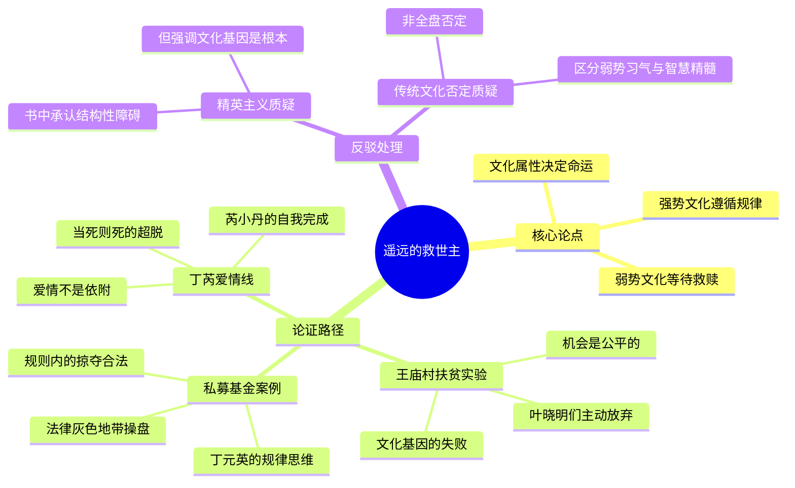

## 《遥远的救世主》读书笔记
  
### 作者  
digoal  
  
### 日期  
2026-05-24  
  
### 标签  
读书笔记 , 遥远的救世主   
  
----  
  
## 背景  
   
---
书名: 《遥远的救世主》   
作者: 豆豆（原名李雪）   
出版年份: 2005   
笔记日期: 2026-05-25   
出版社: 作家出版社   
豆瓣评分: 8.6   
改编剧集: 《天道》（2006，豆瓣9.2）   
标签: [中国当代小说, 商战, 文化哲学, 佛道, 人性]   
---

   

> **一句话**：这不是一部商战小说，而是一次对"谁来救你"这个问题的彻底拷问——答案让人不舒服，但无从逃避。   
> **适合谁读**：在人生岔路口徘徊的人；对中国传统文化又爱又困惑的人；想搞清楚"为什么努力了还是穷"的人。   
> **阅读难度**：⭐⭐⭐⭐☆（对话密度极高，需要反复咀嚼）   
> **推荐指数**：⭐⭐⭐⭐⭐   

---

## 一、时代坐标：这本书从哪里来？

2005年，中国正处在一个奇特的历史节点。

改革开放二十多年后，市场经济的外壳已经建立，但内核仍是传统人情社会的逻辑——靠关系、靠背景、靠"贵人相助"。那是一个"股市"刚开始走入普通百姓视野、私募基金游走在法律灰色地带的年代；是一个贫富分化快速加剧、农村劳动力大规模流向城市的年代；也是一个"先富带后富"的口号已经说了二十年、但王庙村们依然原地踏步的年代。

豆豆，原名李雪，1970年生，高中学历，石油行业工人出身。她最重要的精神滋养，来自一位出走欧洲的好友李红英——后者带回了西方的规则意识、契约精神，以及对东西方文化的比较视野。这本书，某种程度上是豆豆用十年时间消化这场对话的产物。

书写于1995年至2003年之间，出版于2005年。彼时，"扶贫""共同富裕"还不是主流话题，丁元英设计的"王庙村扶贫实验"在当时显得超前而孤僻。然而，二十年后再读，这本书的预见性令人震惊——它几乎精准描述了中国社会在市场经济深化过程中必然要面对的文化困境。

```
时间轴：

1990s 中国 ──────────────────────────────── 2005年
  │                                              │
市场经济起步                              《遥远的救世主》出版
私募灰色地带                           ↓
贫富分化加剧                     改编为电视剧《天道》(2006)
传统文化与商业逻辑碰撞          豆瓣9.2分，多次遭遇删减
                                        ↓
                              2020年代重新走红
                           成为"觉醒圈"必读书目
```

---

## 二、核心命题：作者在说什么？

这本书表面是爱情+商战，骨子里是一场文化解剖。豆豆借丁元英之口，提出了三个相互缠绕的核心命题：

### 命题一：文化属性决定命运，不以意志为转移

丁元英有一段话，是全书的纲领：

> "透视社会依次有三个层面：技术、制度和文化。小到一个人，大到一个国家一个民族，任何一种命运归根到底都是那种文化属性的产物。强势文化造就强者，弱势文化造就弱者，这是规律，也可以理解为天道，不以人的意志为转移。"

所谓"强势文化"，不是强硬、霸道，而是**遵循客观规律，在规则之内竞争**。弱势文化则相反——依赖强者的道德期望，期待被拯救，习惯于"等、靠、要"。

书名"遥远的救世主"，是一个反讽：**那个你一直在等待的救世主，永远不会来。** 或者说，一旦你开始等，你就已经输了。

### 命题二："杀富济贫"救不了穷人——扶贫是一场文化实验

丁元英设计"格律诗扶贫计划"，让王庙村的农民进入音响行业，以低于市场价格的方式打入高端市场，逼迫乐圣公司降价，最终赢得官司。表面上看，这是一次漂亮的商战。但丁元英自己清楚：

**这个计划的本质，不是让村民脱贫，而是检验他们能不能穿越弱势文化的局限。**

结果是残酷的：叶晓明等人在胜利前夕因恐惧而退出，放弃了到手的果实。贫穷不是因为没有机会，而是因为面对机会时，弱势文化基因里的恐惧、投机与依赖压垮了他们。

### 命题三：神即道，道法自然，如来——最高的精神是承认规律

丁元英在五台山与高僧的对话，是全书的精神高峰。他说的"如来"，不是宗教意义上的神，而是"如其本来"——事物本来的样子。最高的智慧，是看清规律、接受规律，并在规律之内找到自己的位置，而不是靠期盼"神迹"来破格获取。

这三个命题合在一起，指向同一个结论：**这个世界没有救世主，也不需要。真正的解放，是认识规律后的自我解放。**

---

## 三、论证地图：作者怎么说服你的？



豆豆的论证方式是**以戏剧代替说理**。她不写论文，而是设计了一个个精密的情境：

王庙村扶贫线，是文化属性论点的最佳实验——同等的机会和资源，弱势文化基因的人主动放弃，强势文化基因的人（欧阳雪、芮小丹）却能承接。这个设计在逻辑上颇为有力，但也因此引发了争议：这究竟是文化基因的差异，还是结构性贫困带来的风险厌恶？

---

## 四、前提假设与边界：什么情况下这不成立？

这本书建立在三个关键假设之上，值得认真追问：

**假设一：文化基因是命运的第一决定因素**

这是丁元英的核心立场，也是全书最大的武断之处。现实世界中，阶层固化、教育资源不均、资本集中等结构性因素，往往比文化基因更有决定性。一个农村孩子之所以难以突破阶层，更多时候不是因为他"等、靠、要"，而是因为他能动用的资源根本不在一个量级。

**假设二：规律是可以被个体认知并运用的**

丁元英能看清规律，因为他有清华+柏林的教育背景，有在德国金融机构工作的经历。他的"认识规律"，本身就是特权的产物。把他的路径推广为普世方法，本质上是一种幸存者偏差。

**假设三：自我救赎是可能的，而且是唯一正当的路径**

这个假设忽略了社会连带的价值——工会、集体行动、制度改革，这些"非个人"的路径，在书中几乎是缺席的。丁元英的世界里，只有个体觉醒，没有集体组织。

这些局限，不否定这本书的价值，但它确实意味着：**把《遥远的救世主》当成人生手册、按图索骥，是一种误读。它更适合作为思想的激发剂，而不是行动的操作手册。**

---

## 五、思想谱系：这本书在哪个传统里？

《遥远的救世主》的思想资源，是一个奇特的混合体：

**道家/佛家的底色**：丁元英的核心世界观——天道、如来、自然——来自道家的"无为"和佛家的因缘法。"强势文化"的根，其实在老子"上善若水""道法自然"里。

**西方规则意识的影响**：契约精神、法律边界内的竞争、对人情关系的拒绝，是丁元英身上的"西方基因"，也是豆豆通过好友李红英感受到的文化冲击。

**马克思政治经济学的影子**：书中对剩余价值、资本逻辑的理解，有马克思的痕迹——丁元英知道资本是怎么运作的，所以他能在规则之内利用它。

从文学谱系看，它更接近"思想小说"（Roman à thèse）的传统——服务于论点的人物与情节。这使它不那么像文学，更像一本用故事包装的哲学随笔。这既是它的魅力所在，也是它在文学性上的短板。

```
影响脉络（简）：

道德经（老子）──┐
金刚经（佛陀）──┤──→ 丁元英的世界观 ──→ 《遥远的救世主》
西方规则意识   ──┘                              │
马克思经济学  ─────────────────────────────────┘
```

---

## 六、我学到了什么？

第一次读这本书，很容易被丁元英的"通透"震撼，产生一种"我悟了"的幻觉。但沉淀之后，我认为这本书真正的价值，不在于提供答案，而在于**把问题问得足够尖锐**。

**最重要的收获之一：区分"等待"和"行动"。**

弱势文化最隐蔽的表现，不是明显的"靠关系"，而是更微妙的心理——等待一个完美的时机，等待贵人指路，等待环境改变。豆豆说的"救世主"，很多时候不是真的在等某个人，而是在等一个允许自己行动的外部授权。认识到这一点，比任何鸡汤都有用。

**最重要的收获之二：接受"规律冷漠"的现实。**

丁元英最让人不舒服的地方，是他的冷酷——明明可以帮忙，却选择旁观。但这背后有一个真实的洞见：在结构性的规律面前，个体的"好心"往往只是延缓痛苦，而非解决问题。帮人，要帮在文化根子上，而不是帮在一时的困难上。

**最重要的收获之三：警惕把这本书变成新的"救世主"。**

这是一个悖论：很多人读完《遥远的救世主》，开始崇拜丁元英，开始照搬"强势文化"话语，这本身就是弱势文化心态的另一种变体——把丁元英当成了新的救世主。豆豆写这本书，是要打碎救世主的幻觉，而不是提供新的偶像。

---

## 七、举一反三：这个框架还能用在哪？

**职场选择**：面对一个机会时，问自己的第一反应是"这事能做吗"还是"风险太大怎么办"——前者是强势文化思维，后者往往是弱势文化的第一反应。不是说冒险一定对，而是你的出发点，决定了你能看到的选项。

**理解"内卷"**：为什么内卷难以打破？因为内卷是一种集体弱势文化的产物——没有人敢第一个走出去，所有人都在等别人先动。丁元英式的破局，往往是从系统外切入，而不是在存量中争夺。

**扶贫与公益**：王庙村实验是一个严肃的警告。"授人以鱼"式的帮助，如果接收方没有内在的文化转变，往往适得其反——产生依赖，甚至仇恨。真正的帮助，要从认知和文化层面介入，这既更难，也更慢。

---

## 八、批判与反思

豆豆写出了一个"看透一切"的男主角，但这个男主角身上，有几处她自己也许没意识到的盲点：

**丁元英的通透，建立在稀有资源之上。** 清华+柏林+德国私募经历——这套配置在2000年代的中国，凤毛麟角。以此配置的视角来判断普通人的"弱势文化"，公平性存疑。

**芮小丹之死，是作者逻辑的胜利，却是人物情感的失败。** 她的死被处理得过于"完美"——主动、从容、不拖累任何人。这固然展示了强势文化的极致，但也让人物失去了真实人类应有的挣扎与犹豫。死亡因此变成了一种美学宣言，而非真实的生命体验。

**书中的女性人物，虽然被设定为"强者"，却都是在服务丁元英的思想表达。** 芮小丹的终极行动，是为丁元英求一个"神话"作为礼物。这个设定，令人忍不住质疑：在豆豆的世界里，女性的"强"，最终是不是仍然附属于某个男性叙事？

这些批评，不应该遮蔽这本书的价值。但一本真正好的书，值得被真正认真地批评。

---

## 九、金句与记忆点

1. **"强势文化造就强者，弱势文化造就弱者，这是规律，不以人的意志为转移。"**
   → 这不是励志鸡汤，而是冷酷的社会学观察。它要说的不是"你要更努力"，而是"你的思维方式本身才是牢笼"。

2. **"传统观念的死结，就在一个靠字上。靠什么都行，就是别靠自己。"**
   → 中国传统文化里，"靠"是一种美德（孝亲、重情），但一旦成为习惯性思维，就变成了枷锁。

3. **"神即道，道法自然，如来。"**
   → 全书最有禅意的一句话。神不在庙里，在规律里；最高的境界，是活得像规律本身的样子。

4. **"你是一块玉，但我不是匠人。"**
   → 丁元英对芮小丹说的话。拒绝的背后，是对自己局限性的清醒认识——真正的强者，知道自己不能给什么。

5. **"井蛙不可以语海，夏虫不可以语冰。"**
   → 这句出自庄子的话，在书中有了新的语境——认知层次不同的人，对话本身就是一种徒劳。这既是洞见，也是傲慢的种子。

6. **"杀富济贫，救不了穷人。"**
   → 最反直觉的命题，也最值得反复思考。穷的不是口袋，是认知。改变贫穷，要改变认知，而不只是转移资源。

7. **"当死则死，来去自如。"**
   → 芮小丹的人生哲学。不执着于生，不恐惧于死，活在当下，把每个选择做到极致。

---

## 十、延伸阅读

1. **《天幕红尘》——豆豆**
   同一思想体系的延续，主角叶子农更极端地践行"道法自然"，故事背景转向欧洲，对比视野更宽阔。

2. **《乌合之众》——古斯塔夫·勒庞**
   理解"弱势文化"的社会心理根源，群体心理如何让个体丧失独立判断。与《救世主》的文化属性论互为补充。

3. **《人类简史》——尤瓦尔·赫拉利**
   从更宏观的视角看文化如何塑造人类命运。"弱势文化"的历史根源，赫拉利给出了人类学层面的解释。

4. **《活着》——余华**
   同样是中国当代文化的切片，但余华选择展示而非解释，留给读者更多空间。与豆豆的"说透"形成对比，两者互读，耐人寻味。

5. **《道德经》——老子**
   不需要全读，但第八章（上善若水）、第十六章（归根复命）、第二十五章（道法自然）是理解丁元英世界观的直接来源。

---

## 附：一张图读懂这本书

```
"遥远的救世主"的反讽结构：

  你期待的那个救世主
         ↓
  [丁元英]？  [菩萨]？  [国家]？  [贵人]？
         ↓         ↓         ↓         ↓
  这些都是           这就是           弱势文化
  弱势文化           救世主的          的幻觉
  的投射             各种面孔
  
  真正的答案：
  
  认识规律 → 在规律内行动 → 完成自我
  （强势文化的路径，孤独但有效）
  
  书的最终指向不是"你要变成丁元英"
  而是：你得先看清楚，自己在等待什么。
```

---

*笔记写于 2026-05-25 | 基于豆瓣、知乎、财新等公开资料与深度思考整理*
*推荐搭配：阅读本笔记后，找一个安静的下午，读原著第五章（五台山对话）和第十章（王庙村官司结局），那是两个最密集的思想爆发点。*
  
  
#### [PostgreSQL 解决方案集合](../201706/20170601_02.md "40cff096e9ed7122c512b35d8561d9c8")
  
  
#### [德哥 / digoal's Github - 公益是一辈子的事.](https://github.com/digoal/blog/blob/master/README.md "22709685feb7cab07d30f30387f0a9ae")
  
  
#### [About 德哥](https://github.com/digoal/blog/blob/master/me/readme.md "a37735981e7704886ffd590565582dd0")
  
  

  
