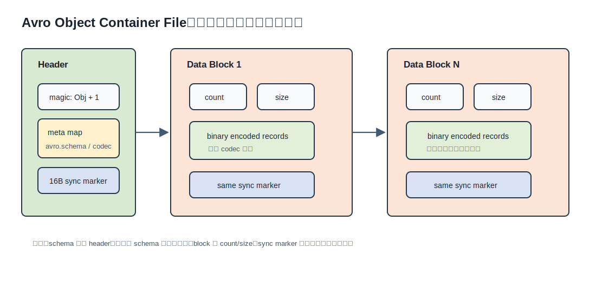
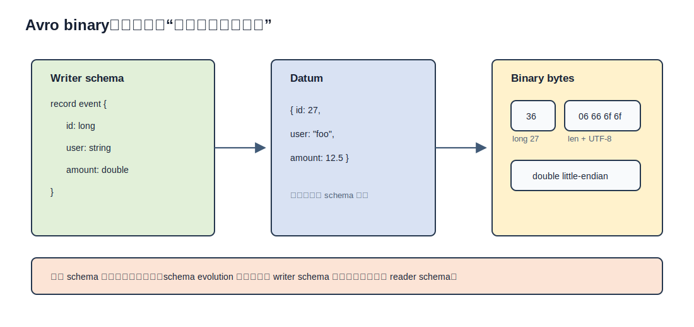
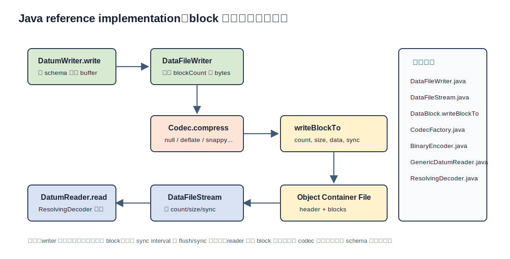
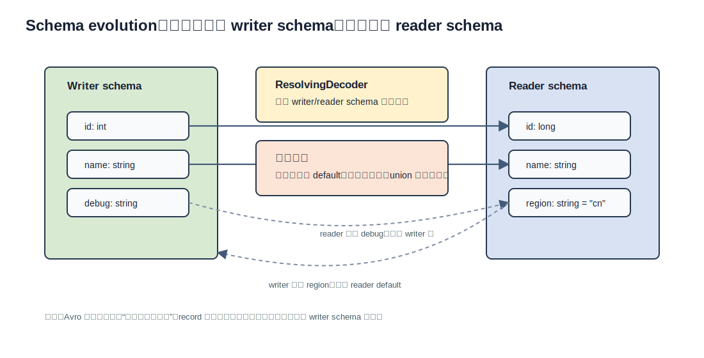
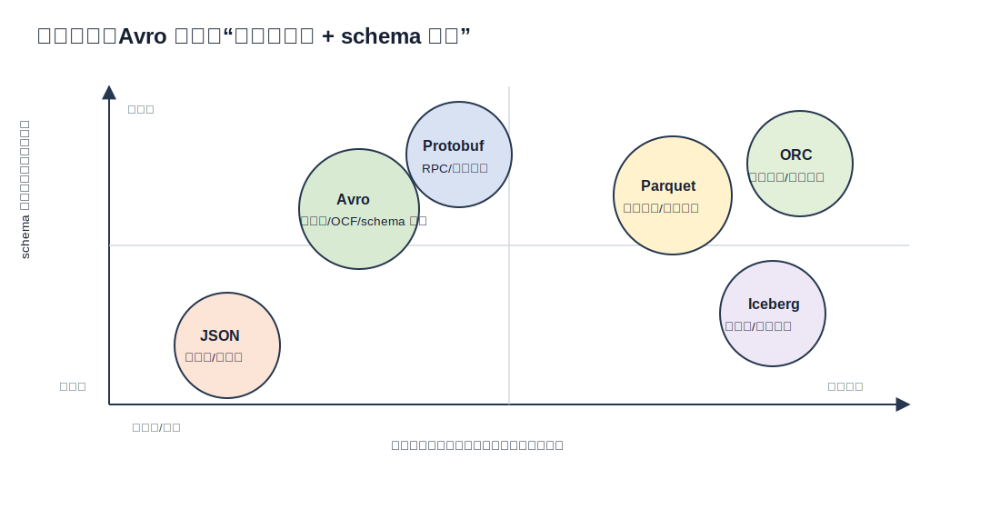

## 数据库筑基课 - Apache Avro 存储结构
                                                                                            
### 作者                                                                
digoal                                                                
                                                                       
### 日期                                                                     
2026-05-25                                                      
                                                                    
### 标签                                                                  
PostgreSQL , PolarDB , DuckDB , 应用开发者 , 数据库筑基课 , 表存储 , 序列化 , 数据湖 , Avro      
                                                                                           
----                                                                    

## 背景
  
  

本节属于“表存储 / 数据交换格式 / 数据湖文件格式”的交叉基础能力。数据库筑基课大纲链接未在输入资料中提供，因此本文从一个常见工程痛点切入：业务系统、消息队列、湖仓和离线计算之间都在传记录，但这些记录到底应该用 JSON、Avro、Protobuf、Parquet 还是 ORC？

如果只是“让人看懂”，JSON 足够简单；如果是服务间 RPC，Protobuf/gRPC 往往更自然；如果是 OLAP 大宽表扫描，Parquet/ORC 的列式布局更适合。Avro 的位置不同：它把 **schema-first 的行式二进制编码**、**对象容器文件**、**跨语言互通** 和 **schema evolution** 放在一起，特别适合 Kafka/Flink/Spark/Hadoop 这类持续写入、批流衔接、需要长期演进数据契约的场景。

官方规范说明 Avro 二进制数据不包含字段名和类型信息，读取必须依赖写入时 schema；对象容器文件会把 schema 放进文件 header，并把记录按 block 组织起来。这个设计解释了 Avro 的核心取舍：它牺牲了 JSON 的自解释字节流，换来更紧凑的编码、更稳定的数据契约和更清晰的兼容演进边界。

## 一、它解决什么问题？

数据库和数据平台里的“存储结构”不只是一张表怎么落盘，还包括数据离开数据库以后，如何继续被正确、低成本、可演进地读取。传统做法有三个常见问题：

- **JSON 太松：** 字段名重复写入，数值类型不够明确，schema 演进通常靠应用约定，坏数据容易进入链路深处才暴露。
- **纯二进制太硬：** 自定义协议可以很快，但跨语言、调试、兼容、长期维护都容易变成隐性成本。
- **列式文件不适合所有阶段：** Parquet/ORC 适合分析扫描，但事件流、行级交换、RPC 和小批量 append 通常不是它们的强项。

Avro 把问题转化为：**先把记录结构定义为 JSON schema，再用 schema 指导二进制编码；当需要文件持久化时，把 writer schema、codec 和 block 边界一起写入对象容器文件。**

代价也很明确：Avro 不是天然适合任意字段投影的列式格式；二进制 payload 离开 schema 不能正确解释；schema 注册、兼容策略和治理流程必须成为数据平台的一部分。



图 1 说明：Avro Object Container File 由 header 和一组 data block 构成。header 保存 magic、metadata 和 16 字节 sync marker；metadata 中 `avro.schema` 是必需项，`avro.codec` 用来声明 block 压缩方式。每个 block 再写入 count、size、data 和同一个 sync marker。

## 二、它是什么？

Apache Avro 可以从三个层次理解：

1. **逻辑层：schema。** schema 用 JSON 表达，支持 primitive、record、enum、array、map、union、fixed，以及 logical type。字段默认值主要服务于读取旧数据时的 schema resolution，不代表写入时可以省略字段。
2. **编码层：binary encoding。** 记录字段按 schema 声明顺序深度优先写入；字段名、类型名、分隔符都不进入二进制 payload。
3. **文件层：Object Container File，简称 OCF。** OCF 是 Avro 的自描述文件格式，适合把一批同 schema 的对象写成可切分、可压缩、可追加读取的文件。

所以，Avro 不是“压缩版 JSON”。它的 schema 是 JSON，数据编码不是 JSON；它的 OCF 是行式 block 文件，不是列式存储；它解决的是记录序列化、批流衔接和 schema 演进，不是替代数据库事务存储。

本地源码也印证了这个分层：

- `avro/doc/content/en/docs/1.12.0/Specification/_index.md` 是权威规范副本。
- `avro/lang/java/avro/src/main/java/org/apache/avro/file/DataFileConstants.java` 定义 `MAGIC`、`SYNC_SIZE`、默认 `SYNC_INTERVAL`、`avro.schema`、`avro.codec` 和 codec 名称。
- `avro/lang/java/avro/src/main/java/org/apache/avro/file/DataFileWriter.java` 写 header、缓存记录、按 block 压缩和写 sync。
- `avro/lang/java/avro/src/main/java/org/apache/avro/file/DataFileStream.java` 读 header、解析 metadata、读 block count/size、校验 sync marker、解压 block。
- `avro/lang/java/avro/src/main/java/org/apache/avro/io/BinaryEncoder.java` 和 `BinaryDecoder.java` 实现基础二进制读写。
- `avro/lang/java/avro/src/main/java/org/apache/avro/generic/GenericDatumReader.java` 通过 `ResolvingDecoder` 处理 writer schema 到 reader schema 的读取。

## 三、核心原理

### 1. 二进制编码：字节里不写字段名

Avro binary encoding 的第一性原理很简单：schema 已经知道字段顺序和类型，字节流就不用重复写这些信息。以规范中的 record 例子为基础，`{"a": 27, "b": "foo"}` 如果 schema 声明字段顺序为 `a: long, b: string`，二进制就是 long 27 加 string `foo` 的串接。



图 2 说明：写入端按照 writer schema 把字段值依次编码。读者不能从字节流本身看出字段名、类型和边界，必须拿 writer schema 来解释；这也是 Avro 文件要保存 `avro.schema` 的根本原因。

几个关键编码规则：

- `null` 写 0 字节，`boolean` 写 1 字节。
- `int` 和 `long` 使用变长 zig-zag 编码，小整数占用更少字节。
- `float` 和 `double` 按 IEEE 754 bit 表示后用 little-endian 写入。
- `bytes` 和 `string` 都先写长度，再写原始字节；string 字节为 UTF-8。
- `record` 按字段声明顺序串接；`enum` 写 symbol 的零基序号；`union` 先写分支序号，再写分支值。
- `array` 和 `map` 使用 block 表示，负 count 后可跟 block size，允许跳过整段集合内容。

这个设计对数据库人的启发是：Avro 的“行式”不等于简单粗糙。它在行内用 schema 消除了字段名重复，用变长整数降低常见小整数成本，用集合 block 支持跳过。但它仍然不是列式：如果你只查宽记录中的 2 个字段，通用 Avro OCF 不能像 Parquet 一样只读取这 2 列的 page。

### 2. OCF：header 自描述，block 负责切分和压缩

Avro 单条二进制记录本身不带 schema。为了把一批记录写成可长期保存的文件，OCF 在文件头写入：

- magic：`Obj` 加版本字节 `1`。
- metadata map：至少包含 `avro.schema`，可包含 `avro.codec`。
- sync marker：16 字节随机值。

之后的每个 data block 写入：

- `count`：本 block 内对象数量。
- `size`：codec 处理后的 data 字节数。
- `data`：一批按 schema 编码后的记录，可能已压缩。
- `sync`：与 header 相同的 16 字节 sync marker。

Java 实现里，`DataFileConstants` 定义 `SYNC_SIZE = 16` 和 `DEFAULT_SYNC_INTERVAL = 4000 * SYNC_SIZE`，即默认约 64KB 未压缩数据触发一个 block。`DataFileWriter.append()` 先把记录写入内存 buffer，`writeIfBlockFull()` 判断是否达到 sync interval；`writeBlock()` 构造 `DataBlock`，调用 `compressUsing(codec)`，最后由 `DataBlock.writeBlockTo()` 写 `numEntries`、`blockSize`、data 和 sync。

读取路径相反。`DataFileStream.initialize()` 读取 magic、metadata 和 sync；`hasNextBlock()` 读取 block count/size；`nextRawBlock()` 读取 data 和 sync，并校验 block sync 是否等于 header sync。不匹配时，Java 实现会报错，提示可能是数据损坏、截断或错误拼接。



图 3 说明：block 是 Avro OCF 的主要物理边界。写入端在 block 边界压缩和落盘；读取端在 block 边界解压和校验。`sync()` 还能强制结束当前 block，返回后续可用于 seek 的位置。

### 3. codec：压缩的是 block，不是每条记录

规范要求实现必须支持 `null` 和 `deflate`；可选 codec 包括 `bzip2`、`snappy`、`xz`、`zstandard`。本地 Java `CodecFactory` 默认注册了 `null`、`deflate`、`bzip2`、`xz`、`zstandard`、`snappy`。

这个粒度很重要：Avro 不是每条记录单独压缩，而是把一个 block 内的二进制记录合在一起压缩。这样做有三个结果：

- 压缩比通常比单条记录压缩更好，因为 block 内有更多重复模式。
- 读取一条记录时，通常要先解压所在 block。
- block 大小会影响压缩比、延迟、内存峰值、切分粒度和故障恢复边界。

从数据库视角看，它很像行存储里的 page/block 选择：block 太小，metadata 和 sync 开销高，压缩收益低；block 太大，随机读取和失败重试成本高，MapReduce/Spark 这类并行切分也变粗。

### 4. schema resolution：兼容性靠规则，不靠猜

Avro 的 schema evolution 不是“新老字段名差不多就能读”。规范定义了明确的 writer schema 与 reader schema 匹配规则：

- record 字段按名称匹配，字段顺序可以不同。
- writer 有、reader 没有的字段会被忽略。
- reader 有、writer 没有的字段，必须有 default，否则报错。
- 类型可以在规定范围内提升，例如 `int` 到 `long/float/double`，`long` 到 `float/double`。
- union 需要找到匹配分支；找不到就是错误。
- `doc` 不参与 schema resolution。



图 4 说明：读取旧文件时，reader schema 不是直接“按自己的字段顺序读字节”。正确过程是先用 writer schema 解释字节边界，再按规则映射到 reader schema。Java `GenericDatumReader` 会缓存 writer/reader schema 对应的 `ResolvingDecoder`，避免每条记录重复构建解析计划。

这就是 Avro 对数据平台治理的要求：schema evolution 必须被显式验证。新增字段要给 default；删除字段要确认下游不再读取；类型变更只能走允许的提升路径；union 分支顺序变化要特别谨慎。

## 四、横向对比

| 维度 | Avro OCF | JSON / NDJSON | Protobuf | Parquet | ORC | Iceberg |
|---|---|---|---|---|---|---|
| 主要目标 | 行式二进制记录、文件自描述、schema 演进 | 人可读、弱契约交换 | 服务间消息/RPC 契约 | 列式分析文件 | 列式分析文件，统计索引强 | 表格式元数据层 |
| schema | JSON schema，通常随文件或注册中心管理 | 可无 schema，也可外置 JSON Schema | `.proto` 文件 | 文件 schema + 列元数据 | 文件 schema + stripe/column 统计 | 管理表 schema、快照、分区、manifest |
| 存储布局 | record 按行进入 block | 文本行或 JSON 对象 | 消息二进制 | 按列/chunk/page | 按 stripe/列/stream | 不直接替代底层文件格式 |
| 字段投影 | 一般要读 block 并按行解码 | 成本高，需解析文本 | 视实现和消息结构 | 强，适合只读少数列 | 强，适合分析扫描 | 依赖底层 Parquet/ORC/Avro |
| 写入流 | 适合事件流、小批量和 append | 简单但体积大 | 适合 RPC/消息 | 更偏批量落湖 | 更偏批量落湖 | 管理批流写入的表提交 |
| schema 演进 | 规范化 resolution 规则 | 多靠应用约定 | 字段编号和兼容规则 | 支持演进但分析文件语义更复杂 | 支持演进但生态偏 Hadoop/Hive | 强调表级演进和快照 |
| 适合场景 | Kafka/Flink/Spark 事件、Hadoop OCF、跨语言批流交换 | 日志、调试、外部 API、小数据 | 微服务 RPC、强接口契约 | 数据湖 OLAP、宽表列裁剪 | Hive/大数据仓库分析 | 湖仓表管理、ACID 快照、分区演进 |
| 不适合场景 | 大宽表高选择性列扫描、无 schema 治理团队 | 高吞吐长期存储、严格类型 | ad hoc 数据湖文件交换 | 高频行级事件交换 | 轻量事件交换 | 单条消息序列化 |



图 5 说明：Avro 的工程位置更靠近“强 schema 的行事件和交换文件”，Parquet/ORC 更靠近“分析扫描文件”，Iceberg 是表格式元数据层，不是同一层面的二进制编码。论文《Mastering Big Data Formats》也把 Avro 描述为更适合 streaming data 和 real-time pipelines 的 row-based format，而 Parquet/ORC 更适合 columnar analytics。

## 五、效果如何？

不要把 Avro 的效果只理解成“压缩率”。它的收益分几层：

1. **编码体积：** 相比 JSON，Avro binary 不重复写字段名，整数用变长 zig-zag，常见行事件通常更小。
2. **解析成本：** 读取时不用做通用 JSON token 解析，而是按 schema 走确定路径。
3. **契约治理：** writer schema、reader schema、canonical form、fingerprint 和 schema resolution 把兼容问题提前到 schema 管理阶段。
4. **文件切分：** OCF 的 block size、object count 和 sync marker 支持提取、跳过、切分和损坏检测。
5. **跨语言：** Avro 仓库提供多语言实现，本地 `CLAUDE.md` 也明确数据文件格式由各语言实现，以支持跨语言互通。

但代价同样具体：

- **列裁剪弱于列式格式。** OCF 中 block data 是一批完整记录，不是按列分 page。
- **schema 是硬依赖。** 没有 writer schema，二进制 payload 很难安全解读。
- **block 级读取有延迟放大。** 只取少量记录时，也可能需要解压整个 block。
- **压缩与并行切分要平衡。** 大 block 压缩率更好，小 block 延迟和切分更好。
- **schema 演进不是随意改字段。** 缺 default、类型不匹配、union 分支不兼容都会变成读时错误。

Viotti 和 Kinderkhedia 的两篇 JSON-compatible binary serialization 论文有一个值得借鉴的提醒：比较序列化格式时，要区分 schema-driven 和 schema-less，也要把数据形状、冗余度、压缩、可复现实验条件放进评价模型。也就是说，不应只拿一个“Avro 比 JSON 快多少”的孤立数字做架构决策。

## 六、实操 DEMO

下面用本地 Apache Avro Python 源码做了最小 OCF 写读实验。由于源码目录未经过安装，直接 `PYTHONPATH=avro/lang/py` 导入会缺少打包阶段生成的 `VERSION.txt`；我在 `/private/tmp/avro-demo` 复制了 Python 包并补入 `avro/share/VERSION.txt` 后执行，不改动项目源码。

示例代码：

```python
import io
import json

import avro.schema
from avro.datafile import DataFileWriter, DataFileReader, SYNC_SIZE
from avro.io import DatumWriter, DatumReader

schema = avro.schema.parse(json.dumps({
    "type": "record",
    "name": "event",
    "fields": [
        {"name": "id", "type": "long"},
        {"name": "user", "type": "string"},
        {"name": "amount", "type": "double"}
    ]
}))

buf = io.BytesIO()
writer = DataFileWriter(buf, DatumWriter(), schema, codec="null")
for row in [
    {"id": 1, "user": "alice", "amount": 12.5},
    {"id": 2, "user": "bob", "amount": 7.0},
]:
    writer.append(row)
writer.flush()

raw = buf.getvalue()
print("bytes", len(raw))
print("magic_hex", raw[:4].hex())
print("magic_ascii", raw[:3].decode(), raw[3])
print("sync_size", SYNC_SIZE)

buf.seek(0)
reader = DataFileReader(buf, DatumReader())
print("codec", reader.codec)
print("schema_name", avro.schema.parse(reader.schema).name)
print("records", list(reader))
```

实际输出：

```text
bytes 251
magic_hex 4f626a01
magic_ascii Obj 1
sync_size 16
codec null
schema_name event
records [{'id': 1, 'user': 'alice', 'amount': 12.5}, {'id': 2, 'user': 'bob', 'amount': 7.0}]
```

这个实验验证了四件事：

- 文件以 `Obj` 加版本字节 `1` 开头，十六进制是 `4f626a01`。
- sync marker 大小是 16 字节。
- codec metadata 能被读回，这里是 `null`。
- reader 能从文件 header 读出 writer schema，并正确解码两条记录。

如果要进一步观察 block count/size，可以在 Python `DataFileReader._read_block_header()` 或 Java `DataFileStream.hasNextBlock()` 位置加断点；如果要比较 codec，可以把 `codec="null"` 改为 `deflate`，但需要注意压缩收益取决于数据量和重复度，两条小记录不会代表真实效果。

## 七、最佳实践

**数据库架构师：** 把 Avro 放在数据契约层看，而不是只看成文件压缩格式。业务事件、CDC、实时计算中间层、跨语言数据交换适合 Avro；面向 BI 的宽表明细和聚合扫描，优先评估 Parquet/ORC；湖仓表级快照、分区演进和 ACID 提交，应该评估 Iceberg/Delta/Hudi 这类表格式。

**DBA / 数据平台工程师：** 重点治理 schema lifecycle。建立 schema registry 或等价流程，强制兼容检查；新增字段给 default；禁止无评审地改 union 分支、字段类型和字段语义；为 OCF 选择合理 sync interval 和 codec，并把 block 大小、压缩比、读取延迟、任务切分数作为观测指标。

**业务开发者：** 不要把 Avro 当动态 JSON 用。字段名、类型、默认值、nullable 写法都属于接口契约。常见 nullable 字段应显式写成 union，例如 `["null", "string"]`，并注意 default 必须匹配 union 的第一个可用分支。写入前做 schema 校验，读取时保留 writer schema 信息。

**数据湖使用者：** Avro 很适合作为 landing zone 或 streaming bronze 层的行事件格式；进入大规模 ad hoc 分析层后，通常要转换成 Parquet/ORC，并由 Iceberg/Delta/Hudi 管理表元数据、快照、分区和演进。

## 八、适合与不适合场景

适合：

- Kafka、Pulsar、Flink、Spark Streaming 中的结构化事件。
- 需要长期 schema evolution 的日志、CDC、业务事实流。
- Hadoop / Spark 可以按文件切分读取的批量行式数据。
- 多语言系统之间共享同一数据契约。
- 写入频繁、读取模式还不固定的原始明细层。

不适合：

- 大宽表 OLAP，只读少数列且高度依赖列裁剪、统计跳过和向量化扫描。
- 没有 schema 治理流程、字段经常随意变动的团队。
- 需要人直接阅读和手工编辑的配置或调试文件。
- 单条低延迟 RPC 已经全面使用 gRPC/Protobuf 的服务边界。
- 需要表级事务、快照隔离、分区演进和元数据管理的湖仓表；这些应交给 Iceberg/Delta/Hudi 等表格式。

## 九、常见坑

1. **只保存 Avro binary，不保存 writer schema。** 这是最严重的问题。binary payload 不带字段名和类型，离开 writer schema 就不能可靠读取。
2. **把 default 当成写入时可选。** Avro 规范里的字段 default 主要用于读取缺失字段；写入时字段仍要按 writer schema 编码。
3. **随意调整 union。** union 写入的是分支序号和值，读写 schema 分支匹配失败会直接报错。nullable 字段的分支顺序和 default 要统一规范。
4. **以为 Avro 自动适合分析查询。** Avro OCF 是行式 block 文件，扫描全字段或事件流很自然；宽表列裁剪不是强项。
5. **block 设置只看压缩比。** sync interval 影响压缩、内存、读取延迟、split 粒度和失败恢复。吞吐型批处理和低延迟读取的最佳点不同。
6. **忽略 codec 兼容。** 规范要求 `null` 和 `deflate`，其他 codec 是可选能力。跨语言、跨平台传输前，要确认消费者实现支持相同 codec。
7. **把 schema evolution 当代码重构。** 字段改名、类型变化、枚举删除、默认值变化都可能影响历史数据读取，必须先跑兼容验证。
8. **把 Iceberg 和 Avro 当同层替代。** Iceberg 是表格式和元数据层，可以管理 Avro/Parquet/ORC 等数据文件；Avro 是序列化和文件格式。

## 十、扩展问题

1. 如果一条业务事件会在 Kafka 中保留 30 天、在湖仓中保留 3 年，writer schema 应该放在消息里、注册中心里，还是 Avro OCF 文件头里？不同方案的故障边界是什么？
2. 为什么 Avro record 字段“读取时按名称匹配”，但 binary encoding 又说“按字段声明顺序写入”？这两个说法是否矛盾？
3. 对同一批订单明细，Avro、Parquet、ORC 的 block/page/stripe 粒度分别如何影响压缩比、列裁剪和任务切分？
4. 如果需要把 PostgreSQL CDC 写入 Kafka，再落到 Iceberg 表，Avro schema evolution 和 Iceberg schema evolution 应该如何分工？
5. 如果一个字段从 `int` 改为 `string`，Avro 规范为什么不允许自动兼容？这背后保护的是什么？

## 十一、扩展阅读

- Apache Avro 1.12.0 Specification：<https://avro.apache.org/docs/1.12.0/specification/>
- Apache Avro GitHub 仓库：<https://github.com/apache/avro>
- 本地源码：`avro/doc/content/en/docs/1.12.0/Specification/_index.md`
- 本地源码：`avro/lang/java/avro/src/main/java/org/apache/avro/file/DataFileConstants.java`
- 本地源码：`avro/lang/java/avro/src/main/java/org/apache/avro/file/DataFileWriter.java`
- 本地源码：`avro/lang/java/avro/src/main/java/org/apache/avro/file/DataFileStream.java`
- 本地源码：`avro/lang/java/avro/src/main/java/org/apache/avro/file/CodecFactory.java`
- 本地源码：`avro/lang/java/avro/src/main/java/org/apache/avro/io/BinaryEncoder.java`
- 本地源码：`avro/lang/java/avro/src/main/java/org/apache/avro/io/BinaryDecoder.java`
- 本地源码：`avro/lang/java/avro/src/main/java/org/apache/avro/generic/GenericDatumReader.java`
- 本地源码：`avro/lang/java/avro/src/main/java/org/apache/avro/io/ResolvingDecoder.java`
- DeepWiki：`apache/avro`，用于梳理多语言实现与对象容器文件结构，关键结论已回到本地规范和源码核对。
- Juan Cruz Viotti, Mital Kinderkhedia, “A Survey of JSON-compatible Binary Serialization Specifications”：<https://arxiv.org/abs/2201.02089>
- Juan Cruz Viotti, Mital Kinderkhedia, “A Benchmark of JSON-compatible Binary Serialization Specifications”：<https://arxiv.org/abs/2201.03051>
- Srinivasa Rao Nelluri, Flavia Ann Albert Saldanha, “Mastering Big Data Formats: ORC, Parquet, Avro, Iceberg, and the Strategy of Selection”：<https://ijcttjournal.org/archives/ijctt-v73i1p105>
- Thuy Nguyen, “Benchmarking performance of data serialization and RPC frameworks in microservices architecture: gRPC vs. Apache Thrift vs. Apache Avro”：<https://aaltodoc.aalto.fi/items/2716a79a-42a4-4aa6-bb06-6753f61bafdb>
  
## 附录  
  
1、问 gemini  
```  
Apache Avro 相关的论文
```  
  
1、克隆代码  
```  
git clone --depth 1 https://github.com/apache/avro
```  
  
2、启用 codex, 使用 [数据库筑基课 skill](../skills/README.md).  
````
文章标题: 
  数据库筑基课 - Apache Avro 存储结构
项目源码(已克隆到当前项目如下目录中):  
  avro
论文: 
  A Survey of JSON-compatible Binary Serialization Specifications
  A Benchmark of JSON-compatible Binary Serialization Specifications
  Mastering Big Data Formats: ORC, Parquet, Avro, Iceberg, and the Strategy of Selection
  Benchmarking Performance of Data Serialization and RPC Frameworks in Microservices Architecture: gRPC vs. Apache Thrift vs. Apache Avro
项目 deepwiki reponame:  
  apache/avro
项目参考信息: 
  avro/CLAUDE.md
````
   
  
#### [PostgreSQL 解决方案集合](../201706/20170601_02.md "40cff096e9ed7122c512b35d8561d9c8")
  
  
#### [德哥 / digoal's Github - 公益是一辈子的事.](https://github.com/digoal/blog/blob/master/README.md "22709685feb7cab07d30f30387f0a9ae")
  
  
#### [About 德哥](https://github.com/digoal/blog/blob/master/me/readme.md "a37735981e7704886ffd590565582dd0")
  
  

  
