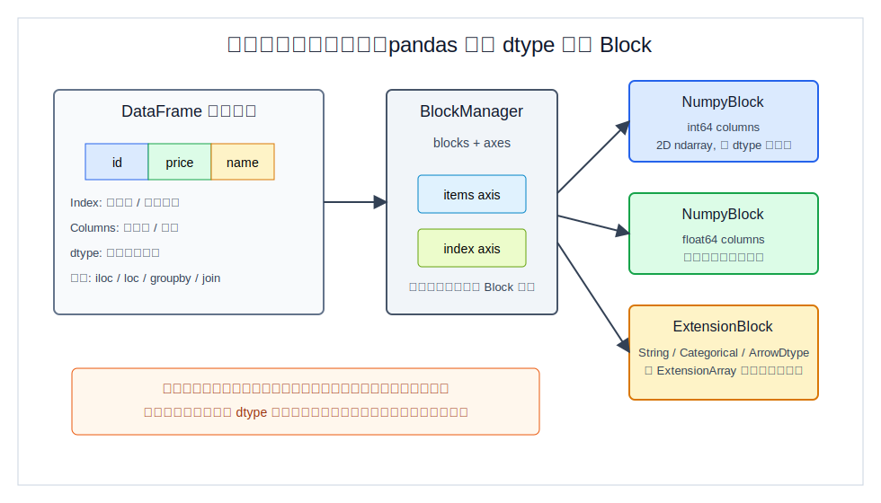
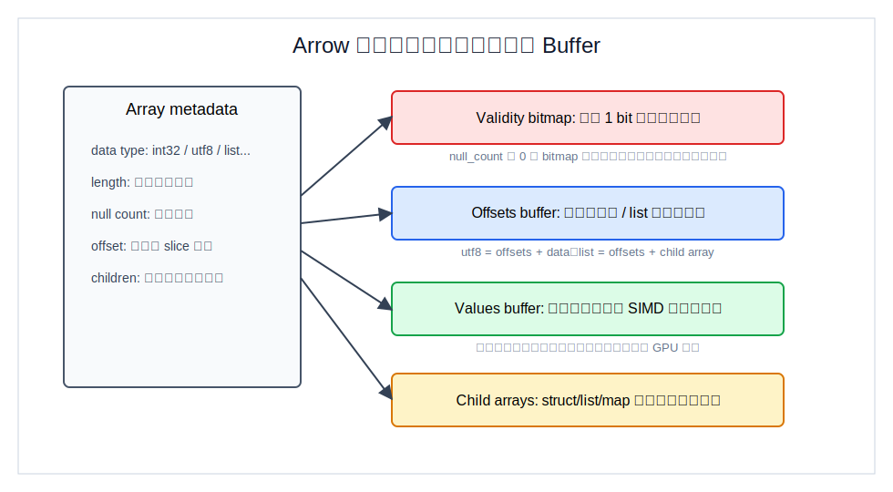
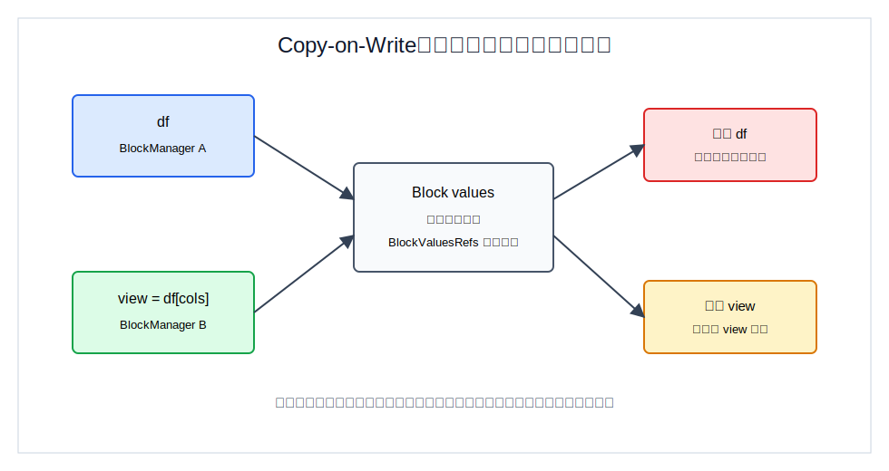
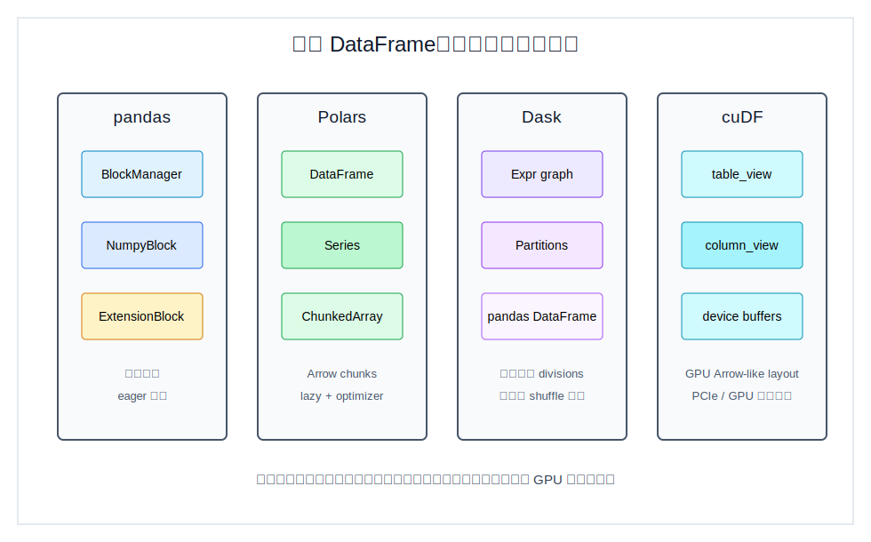

## 数据库筑基课 - pandas dataframe 数据存储结构
                                                                                            
### 作者                                                                
digoal                                                                
                                                                       
### 日期                                                                     
2026-05-25                                                      
                                                                    
### 标签                                                                  
应用开发者 , 数据库筑基课 , 表存储 , DataFrame , pandas , Arrow , Polars , Dask , cuDF      
                                                                                           
----                                                                    

## 背景
  
  


本节属于“表存储 / 执行数据结构 / 分析型内存布局”的基础能力。数据库筑基课大纲链接未在输入资料中提供，因此本文从一个常见工程痛点切入：同样是一张二维表，为什么 pandas 在一些列计算上很快，在大宽表、字符串、超内存、GPU 或跨语言交换时又会突然变慢？

答案不是“pandas 慢”这么简单，而是 **DataFrame 的逻辑模型和物理模型不是一回事**。

逻辑上，DataFrame 是带行标签、列标签、列类型和大量表格操作的二维对象。物理上，pandas 默认由 `BlockManager` 管理多个同质 `Block`；每个 `Block` 再指向 NumPy 数组或 ExtensionArray。Polars 把表组织为 `DataFrame -> Series -> ChunkedArray -> Arrow chunks`。Dask 不直接改变单个 pandas 分区的内存结构，而是把大表切成很多 pandas DataFrame 分区，再用表达式图和调度器执行。cuDF 则把表组织成 GPU 上的 `table_view -> column_view -> device buffers/null mask/children`。

这件事对数据库人很重要：DataFrame 看起来像关系表，但它往往兼有关系代数、矩阵代数、电子表格、Python 对象和交互式探索的语义。Petersohn 等人在《Towards Scalable Dataframe Systems》中指出，DataFrame 不仅要处理 flexible schema、ordering、行列对称、data/metadata fluidity，还经常被用户一步一步交互式物化检查。这些特点解释了为什么传统数据库的优化器、页式行存和列存经验不能直接套用。

说明：用户给出的论文题名包含 “Towards a Formal Semantic Framework for DataFrames”。我未检索到完全同题名公开论文；本文采用最接近且包含 DataFrame 形式化数据模型与代数讨论的《Towards Scalable Dataframe Systems》作为语义框架参考，并在扩展阅读中明确列出。

## 一、它解决什么问题？

pandas DataFrame 最初要解决的是统计计算和金融建模里的异构、有标签、时间序列友好的数据处理问题。Wes McKinney 在 2010 年 SciPy 论文《Data Structures for Statistical Computing in Python》中强调，统计数据常以二维观察值和字段名出现，pandas 要提供比普通 NumPy 数组更适合数据清洗、对齐、join、groupby 和 panel data 的结构。

这带来三个设计压力：

1. **列类型异构。** 一张表里可以同时有 `int64`、`float64`、`datetime64`、字符串、分类、nullable integer、Arrow-backed string。单个二维 NumPy ndarray 放不下这些语义。
2. **标签是语义，不是装饰。** 行 Index、列名、MultiIndex、对齐、`loc`、`join` 都依赖标签。数据库里主键和列名是 schema 的一部分；pandas 里标签也参与计算路径。
3. **交互式 eager 执行。** 用户经常每做一步就看 `head()`、改一列、再 groupby。它不像 SQL 一样先攒完整查询计划再交给优化器。

pandas 的核心转化是：**逻辑上保留用户熟悉的二维表，物理上按 dtype 把列组织成若干 Block，尽量把同质列交给 NumPy 或 ExtensionArray 做向量化。**

代价也随之出现：跨行访问不是天然局部；对象字符串会退化到 Python object 指针；频繁插列可能导致碎片和重新组织；大于内存的数据需要外部分区系统；复杂链式操作在 eager 模型下容易产生中间结果和内存峰值。



图 1 说明：pandas 的逻辑表面是二维表，但物理层不是逐行记录数组。`BlockManager` 保存 axes 和 blocks；`Block` 是同质 dtype 的存储单元。这样列式计算、同 dtype 批量操作更自然，但行级混合类型访问和频繁结构变更会付出代价。

## 二、它是什么？

可以把 pandas DataFrame 拆成四层：

1. **NDFrame 语义层。** DataFrame/Series 继承通用索引、对齐、拷贝、算子派发逻辑。
2. **Manager 层。** pandas 3.0.1 本地安装包里，`pandas/core/internals/managers.py` 的 `BlockManager` 注释为 “holds 2D blocks”，初始化参数是 `blocks` 和 `axes`。
3. **Block 层。** `pandas/core/internals/blocks.py` 定义 `Block` 是 “homogeneous dtype” 的 n 维单元，`values` 可以是 `np.ndarray` 或 `ExtensionArray`，`refs` 用于 Copy-on-Write 引用跟踪。
4. **数组层。** 常见数值列落在 NumPy ndarray；字符串、nullable、categorical、Arrow-backed 类型等走 ExtensionArray。pandas 3.0 文档说明 `ArrowExtensionArray` 由 `pyarrow.ChunkedArray` 支撑，但该 API 仍标注为 experimental。

本地实测环境是 pandas 3.0.1。下面这个最小实验可以看到 DataFrame 的 manager 和 blocks：

```python
import pandas as pd

df = pd.DataFrame({
    "i": [1, 2],
    "f": [1.5, 2.5],
    "s": ["a", "b"],
})

print(pd.__version__)
print(type(df._mgr).__name__)
print([
    (type(b).__name__, str(b.dtype), b.shape, b.mgr_locs.as_array.tolist())
    for b in df._mgr.blocks
])
print(df.memory_usage(deep=True).to_dict())
```

本地实际输出：

```text
3.0.1
BlockManager
[('NumpyBlock', 'int64', (1, 2), [0]), ('NumpyBlock', 'float64', (1, 2), [1]), ('ExtensionBlock', 'str', (1, 2), [2])]
{'Index': 132, 'i': 16, 'f': 16, 's': 100}
```

这个输出不要理解成所有 pandas 表都会正好三个 block。它只说明一个事实：**DataFrame 的物理存储按列 dtype 和数组实现组织，而不是按业务行连续存放。**

## 三、核心原理

### 1. BlockManager：二维语义下的同质块

`BlockManager` 保存两类东西：axes 和 blocks。axes 让 DataFrame 维持行列标签、顺序和对齐语义；blocks 负责真实数据数组。`BlockManager._verify_integrity()` 会校验 block shape 和 manager shape，确保每个 block 的行数与 DataFrame 一致，所有 block 的列位置合起来覆盖 items。

`Block` 的关键点是 homogeneous dtype。数值列如果 dtype 相同，理论上可以被合并到同一个 2D NumPy block；ExtensionArray 通常不参与普通 NumPy block 合并。`blocks.py` 中 `_can_consolidate` 对 extension dtype 返回 false，说明 ExtensionBlock 与普通 NumPyBlock 的整理规则不同。

这类似数据库列存里的 row group + column chunk，但 pandas 的 block 不是磁盘格式，也不是稳定外部 ABI。它是内部执行数据结构：目标是把同类型列交给底层数组高效处理，同时保留 pandas 丰富的标签和 dtype 语义。

### 2. ExtensionArray：修补 NumPy 类型系统的缝

NumPy ndarray 对纯数值连续数组非常强，但对数据库常见的 nullable integer、nullable boolean、字符串、分类、时区时间、稀疏列并不天然完整。pandas 用 ExtensionArray 扩展数组层。

这解释了为什么 pandas 的“空值”比 SQL NULL 更复杂：

- `float64` 可以用 `NaN`，但整数列不能天然表示 `NaN`。
- nullable integer 需要值数组加 mask，或者交给 ExtensionArray 表示。
- Arrow-backed 类型天然有 validity bitmap，和数据库列存的 null bitmap 更接近。
- Python object 字符串列保存的是对象引用，深度内存、CPU cache 和矢量化都不理想。

### 3. Arrow：把列变成跨语言共享的 buffer 协议

Apache Arrow 的列式内存规范把数组描述为 metadata + buffers：data type、length、null count、可选 dictionary、children，以及 validity bitmap、offsets buffer、values buffer 等。官方规范强调它是 language-agnostic 的内存结构，面向顺序扫描、常数时间随机访问、SIMD/vectorization-friendly，以及无需 pointer swizzling 的 zero-copy shared memory。



图 2 说明：Arrow 的关键不是“列式”这个口号，而是把一列拆成可解释的连续 buffer。定长数值列通常是 validity bitmap + values buffer；字符串列通常是 validity bitmap + offsets + data；嵌套列通过 child arrays 递归表达。pandas、Polars、cuDF 都在不同程度上向这个布局靠近。

Arrow 与 pandas 的关系可以这样理解：

- Arrow Table 与 pandas DataFrame 都是等长命名列集合，但 Arrow 支持嵌套列，pandas flat columns 的转换并不总是无损。
- Arrow Array 总是 nullable；pandas 传统 NumPy dtype 对 null 的表达不统一。
- `RangeIndex` 转 Arrow 时可以只存在 schema metadata，普通 Index 通常会变成物理列。
- pandas 的 ArrowExtensionArray 可以用 `pyarrow.ChunkedArray` 存储，但 pandas 仍保留自身 Index、BlockManager、ExtensionBlock 和 Copy-on-Write 语义。

### 4. Copy-on-Write：共享读，写时隔离

pandas 3.0 文档说明 Copy-on-Write 用于简化索引 API，并尽量避免不必要复制。内部引用跟踪发生在 Block 级别：`BlockValuesRefs` 追踪哪些 block 的 values 共享同一底层数据；当写入前发现仍被其他对象共享时，触发复制。



图 3 说明：切片、选择、浅拷贝可以先共享底层 values，从而降低读路径成本。但用户第一次写共享数据时，pandas 必须复制相关 block 来维护“派生对象表现得像副本”的语义。DBA 读这个机制时，可以把它类比为“快照读省空间，第一次写产生复制放大”，但 pandas 不是 MVCC 数据库，没有事务隔离和版本清理协议。

### 5. DataFrame 语义比关系表更宽

《Towards Scalable Dataframe Systems》把 pandas 作为参考，指出 DataFrame API 包含关系操作、线性代数操作、电子表格式操作和 Python UDF。论文还指出 pandas eager 语义会让每个 operator 完整执行后再执行下一个，优化和重排空间有限；而用户经常检查中间结果，这又推动了中间结果物化。

这解释了为什么 DataFrame 系统的存储结构不能只问“行存还是列存”：

- `df["a"] + df["b"]` 是列式向量计算。
- `df.iloc[i]` 是跨列行访问。
- `df.T` 会把行列角色互换。
- `groupby.apply(lambda x: ...)` 可能掉进 Python UDF。
- `merge`、`join`、`set_index` 又接近数据库执行算子。

## 四、横向对比

| 维度 | pandas | Polars | Dask DataFrame | cuDF |
|---|---|---|---|---|
| 主要目标 | 单机、交互式、API 覆盖广 | Rust/Arrow-native、高性能查询引擎 | 扩展 pandas 到分区并行 / 超内存 | GPU DataFrame 和 pandas/Polars 加速 |
| 物理主体 | `BlockManager` + `Block` + ndarray/ExtensionArray | `DataFrame` + `Series` + `ChunkedArray<T>` + Arrow chunks | 表达式图 + 多个 pandas 分区 + divisions | `table_view` + `column_view` + device buffers |
| 列式程度 | 按 dtype 分块，非纯 Arrow-native | Arrow chunked columnar | 每个分区通常是 pandas 结构 | Arrow physical layout 风格的 GPU 列 |
| 执行模型 | eager 为主，CoW 降低部分复制 | eager/lazy，lazy 可优化 | lazy graph，`compute()` 触发调度 | GPU kernel 执行，部分 pandas API 可 fallback |
| 空值表示 | NumPy NaN、mask、ExtensionArray、ArrowDtype 多套机制 | Arrow validity/null_count | 继承分区内 pandas 语义 | null mask，固定宽度 null 值不可读 |
| 扩展边界 | 单机内存和 Python 对象成本 | CPU 多线程、Arrow 互通 | 调度、分区、shuffle、元数据推断 | GPU 内存、host/device 传输、GPU 支持算子 |
| 适合场景 | 中小数据、复杂清洗、生态兼容 | 列式扫描、表达式优化、Parquet/Arrow 工作流 | 超过单机内存或需要集群调度的 pandas 类任务 | 大规模 GPU 可并行 DataFrame 算子 |
| 不适合场景 | 超大数据、频繁 Python object/UDF、大量中间结果 | 极端 pandas 兼容需求、复杂 Python UDF | 小数据低延迟任务、重 shuffle 小分区过多 | 小数据、GPU 不可用、频繁 CPU/GPU 往返 |



图 4 说明：四个系统都叫 DataFrame，但“物理边界”不同。pandas 的边界是 block；Polars 的边界是 Arrow chunk；Dask 的边界是 partition 和 graph task；cuDF 的边界是 GPU device buffer。调优时不要只比较 API 名称，要看数据在哪、谁拥有 buffer、什么时候物化、是否跨设备或跨分区。

本地源码和 DeepWiki 信息能相互印证：

- Polars `crates/polars-core/src/frame/dataframe.rs` 中 `DataFrame` 保存 `height`、`Vec<Column>` 和 cached schema；`series/mod.rs` 中 `Series` 是 `Arc<dyn SeriesTrait>`；`chunked_array/mod.rs` 中 `ChunkedArray<T>` 保存 `field`、`Vec<ArrayRef>`、`length`、`null_count`。DeepWiki 对 Polars 的回答同样概括为 `DataFrame -> Series -> ChunkedArray<T> -> Arrow ArrayRef chunks`。
- Dask 官方设计文档说明 Dask DataFrame 内部被拆成很多 partition，每个 partition 是一个 pandas DataFrame，并沿 index 垂直切分；本地 `dask/dataframe/dask_expr/_collection.py` 中 `divisions` 文档说明它是 `npartitions + 1` 个分区边界，能加速 `loc`、`merge` 和 `groupby`。
- cuDF 本地 `cpp/include/cudf/table/table_view.hpp` 说明 `table_view` 是等长 `column_view` 集合，且非拥有；`column_view.hpp` 说明 column view 的 data 和 bitmask 通常遵循 Arrow Physical Memory Layout，非拥有，并用 offset 支持 zero-copy slicing；`column.hpp` 的 `contents` 包含 data device buffer、null mask device buffer 和 child columns。

## 五、效果如何？

pandas 这种结构的收益很明确：

1. **列操作快。** 同 dtype block 或 ExtensionArray 能批量执行向量化操作。
2. **标签语义强。** Index 和 columns 让对齐、join、reindex、时间序列处理变得自然。
3. **生态兼容强。** NumPy、SciPy、Matplotlib、sklearn、statsmodels、Jupyter 都围绕 pandas 形成了事实标准。
4. **Copy-on-Write 减少读路径复制。** 派生对象可先共享 block values，写时再复制。
5. **ExtensionArray 留出未来通道。** Arrow-backed、nullable、string、categorical 等可以逐步改善传统 NumPy dtype 的短板。

代价也同样具体：

- **对象列非常贵。** Python object 字符串不是连续字符列，内存和 CPU cache 代价都高。
- **行式访问不友好。** 一行跨多个 blocks/arrays，和数据库行存的局部性不同。
- **中间结果可能放大内存。** eager 链式操作如果没有手动规划，会反复物化。
- **结构修改可能导致碎片。** 插列、改 dtype、反复 concat/assign 都可能改变 block 组织。
- **超内存不靠 pandas 本体解决。** 需要 Dask、Polars streaming、DuckDB、数据库或湖仓文件格式来接管。
- **Arrow 不是自动加速按钮。** Arrow-backed 类型能改善 null、字符串和互通，但 pandas 仍有自己的 API 语义、manager、索引和 fallback 路径。

数据库视角下，可以把 pandas 看成“单机交互式分析执行器”，而不是持久化表存储引擎。它没有 buffer pool、WAL、MVCC vacuum、统计信息驱动的全局优化器，也不负责事务一致性。它最强的地方是“读进来、探索、转换、喂给模型或图表”；不是“长期管理高并发业务数据”。

## 六、实操 DEMO

下面的实验只依赖本机已安装的 pandas 3.0.1，已执行。它展示三件事：manager 类型、block 分布、深度内存估算。

```python
import pandas as pd

df = pd.DataFrame({
    "id": [1, 2, 3],
    "qty": [10, 20, 30],
    "price": [9.9, 19.5, 7.2],
    "sku": ["a-001", "b-002", "c-003"],
})

print("pandas", pd.__version__)
print("manager", type(df._mgr).__name__)

for block in df._mgr.blocks:
    print(
        type(block).__name__,
        "dtype=" + str(block.dtype),
        "shape=" + str(block.shape),
        "cols=" + str([df.columns[i] for i in block.mgr_locs.as_array]),
    )

print(df.memory_usage(deep=True))
```

预期观察点：

- `id` 和 `qty` 都是 `int64`，可能进入同一个 `NumpyBlock`。
- `price` 是 `float64`，通常是另一个 `NumpyBlock`。
- `sku` 是 pandas 3.0 的 string dtype，通常是 `ExtensionBlock`。
- `memory_usage(deep=True)` 对字符串列会比浅层估计更接近真实成本。

如果本机安装了 `pyarrow`，还可以验证 Arrow-backed pandas 列：

```python
import pandas as pd

df = pd.DataFrame({"a": [1, 2, None], "b": ["x", "yy", None]})
df = df.convert_dtypes(dtype_backend="pyarrow")
print(df.dtypes)
for col in df.columns:
    arr = df[col].array
    print(col, type(arr).__name__, arr._pa_array.type, arr._pa_array.num_chunks)
```

本环境未安装 `pyarrow`，所以上面第二段没有执行；它用于说明验证方法，不给出伪造输出。

## 七、最佳实践

面向数据库架构师：

- 把 pandas 定位为内存分析层，不要让它承担数据库长期存储、并发事务和数据治理职责。
- 数据超过内存、需要谓词下推、列裁剪、并行 scan 时，优先考虑 Parquet + DuckDB/Polars/Dask/数据库，而不是把全量数据读成 pandas。
- 需要跨语言或跨系统交换时，优先使用 Arrow/Parquet 作为物理边界，减少 pandas object 列在系统间来回转换。

面向 DBA：

- 排查 pandas 作业内存时，先看 dtype 和 object/string 列，再看中间结果和是否有不必要的 `copy()`、`concat()`、`apply()`。
- 类似数据库页/块诊断，pandas 要看 `_mgr.blocks`、`memory_usage(deep=True)`、列 dtype 和是否触发 Copy-on-Write。
- 如果上游数据库能完成过滤、聚合、join，就不要把原始大表全拉到 pandas 再处理。

面向业务开发者：

- 少用逐行 `iterrows()` 和 Python lambda；优先用列向量表达式、`groupby.agg`、`merge`、`where`、`assign`。
- 字符串多、空值多时，主动评估 `string`、categorical、Arrow-backed dtype 的内存和兼容性。
- 多次追加行不要循环 `concat`；先收集批次再一次性构造 DataFrame，或使用数据库/Arrow/Parquet 作为中间层。
- 当数据开始超出单机内存时，不要只加机器内存；先判断是可以下推到 SQL，还是需要 Dask/Polars streaming，还是适合 GPU/cuDF。

## 八、适合与不适合场景

适合：

- 中小规模数据清洗、探索性分析、模型特征准备。
- 强依赖 pandas 生态的统计、绘图、Notebook 工作流。
- 需要复杂标签对齐、时间序列、宽 API 覆盖和快速试错的任务。
- 从数据库或文件取出较小结果集后做最后一公里加工。

不适合：

- 长期存储、事务更新、高并发服务端查询。
- 数据远大于内存，还需要多次 join/groupby/shuffle。
- 大量 Python object 字符串、嵌套数据和逐行 UDF。
- 需要稳定跨语言零拷贝 ABI 的核心数据层。
- GPU 上已经有成熟 cuDF/Polars GPU 算子，却反复在 CPU pandas 和 GPU 之间搬运。

## 九、常见坑

1. **把 DataFrame 当行存表。** `df.iloc[i]` 很方便，但跨列混合类型访问可能穿过多个 block 或 ExtensionArray。
2. **忽略 object/string 深度内存。** `memory_usage()` 默认不一定反映 Python 对象占用，排查时用 `deep=True`。
3. **以为 Arrow-backed 就一定零拷贝。** pandas 与 Arrow 类型系统不完全一致，Index、null、timezone、nested type 都可能触发转换。
4. **滥用 `apply(axis=1)`。** 这通常把列式计算退化为 Python 行循环。
5. **链式中间结果过多。** eager 模型会物化中间 DataFrame；大作业应拆分、下推、分区或改用 lazy 引擎。
6. **Dask 分区太碎。** Dask 能扩展 pandas，但不是免费并行；分区过多会增加调度开销，重 shuffle 会非常贵。
7. **GPU 往返搬运。** cuDF 快在数据和算子都留在 GPU；如果每一步都转 pandas，PCIe 和序列化会吃掉收益。
8. **依赖 `_mgr` 写业务逻辑。** `_mgr` 是 pandas 内部结构，可用于诊断和学习，不应作为稳定业务 API。

## 十、扩展问题

1. 如果把 pandas BlockManager 类比成数据库列存，它缺少哪些数据库执行器和存储引擎组件？
2. 为什么 `RangeIndex` 转 Arrow 可以 metadata-only，而普通 Index 往往需要物理列？
3. Polars 的 `ChunkedArray` 为什么适合 append 和 zero-copy slice，但在某些算子前又需要 rechunk？
4. Dask 的 divisions 为什么能加速 `loc`、`merge`、`groupby`？未知 divisions 的代价是什么？
5. cuDF 的 null mask 和 Arrow validity bitmap 很像，但 GPU 上读取 null 固定宽度值为什么仍然危险？
6. 对同一份 Parquet 数据，什么时候应该选 pandas、Polars、DuckDB、Dask、cuDF 或直接 SQL？

## 十一、扩展阅读

- Wes McKinney, [Data Structures for Statistical Computing in Python](https://pdfs.semanticscholar.org/ef4e/f7f38bb907e5d7b4df3e6ff1db269d4970f5.pdf), SciPy 2010.
- Apache Arrow, [Arrow Columnar Format](https://arrow.apache.org/docs/format/Columnar.html).
- Apache Arrow, [Pandas Integration](https://arrow.apache.org/docs/python/pandas.html).
- ODBMS.org, [Apache Arrow: A cross-language development platform for in-memory data](https://www.odbms.org/2018/05/apache-arrow-a-cross-language-development-platform-for-in-memory-data/).
- Devin Petersohn et al., [Towards Scalable Dataframe Systems](https://www.vldb.org/pvldb/vol13/p2033-petersohn.pdf), PVLDB 2020.
- pandas docs, [Copy on write](https://pandas.pydata.org/docs/development/copy_on_write.html).
- pandas docs, [Arrays, scalars, and data types](https://pandas.pydata.org/docs/reference/arrays.html).
- Dask docs, [DataFrame Design](https://docs.dask.org/en/latest/dataframe-design.html).
- Polars DeepWiki, [pola-rs/polars](https://deepwiki.com/pola-rs/polars).
- 用户提供的 DeepWiki repo 名称：`pola-rs/polars`、`dask/dask`、`rapidsai/cudf`。
- 本地源码参考：`polars/CLAUDE.md`、`dask/CLAUDE.md`、`cudf/CLAUDE.md`。
- 本地 Polars 源码：`polars/crates/polars-core/src/frame/dataframe.rs`、`polars/crates/polars-core/src/series/mod.rs`、`polars/crates/polars-core/src/chunked_array/mod.rs`。
- 本地 Dask 源码：`dask/dask/dataframe/dask_expr/_collection.py`、`dask/dask/dataframe/dask_expr/_expr.py`。
- 本地 cuDF 源码：`cudf/cpp/include/cudf/table/table_view.hpp`、`cudf/cpp/include/cudf/column/column_view.hpp`、`cudf/cpp/include/cudf/column/column.hpp`。
- 本机 pandas 3.0.1 源码：`/Library/Frameworks/Python.framework/Versions/3.13/lib/python3.13/site-packages/pandas/core/internals/managers.py`、`/Library/Frameworks/Python.framework/Versions/3.13/lib/python3.13/site-packages/pandas/core/internals/blocks.py`、`/Library/Frameworks/Python.framework/Versions/3.13/lib/python3.13/site-packages/pandas/core/arrays/arrow/array.py`。
  
## 附录  
  
1、问 gemini  
```  
pandas dataframe 数据结构相关的论文、开源项目.
```  
  
2、克隆代码  
```  
git clone --depth 1 https://github.com/pola-rs/polars
git clone --depth 1 https://github.com/dask/dask
git clone --depth 1 https://github.com/rapidsai/cudf
```  
  
3、启用 codex, 使用 [数据库筑基课 skill](../skills/README.md).  
````
文章标题: 
  数据库筑基课 - pandas dataframe 数据存储结构
项目源码(已克隆到当前项目如下目录中):  
  polars
  dask
  cudf
论文: 
  Data Structures for Statistical Computing in Python
  Apache Arrow: A Cross-Language Development Platform for In-Memory Data
  Towards a Formal Semantic Framework for DataFrames
项目 deepwiki reponame:  
  pola-rs/polars
  dask/dask
  rapidsai/cudf
项目参考信息: 
  polars/CLAUDE.md
  dask/CLAUDE.md
  cudf/CLAUDE.md
````
  
  
#### [PostgreSQL 解决方案集合](../201706/20170601_02.md "40cff096e9ed7122c512b35d8561d9c8")
  
  
#### [德哥 / digoal's Github - 公益是一辈子的事.](https://github.com/digoal/blog/blob/master/README.md "22709685feb7cab07d30f30387f0a9ae")
  
  
#### [About 德哥](https://github.com/digoal/blog/blob/master/me/readme.md "a37735981e7704886ffd590565582dd0")
  
  

  
