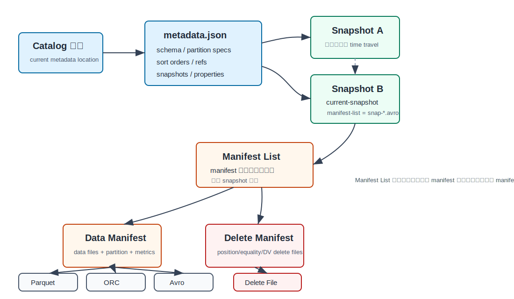
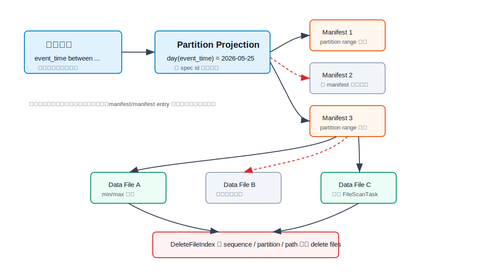
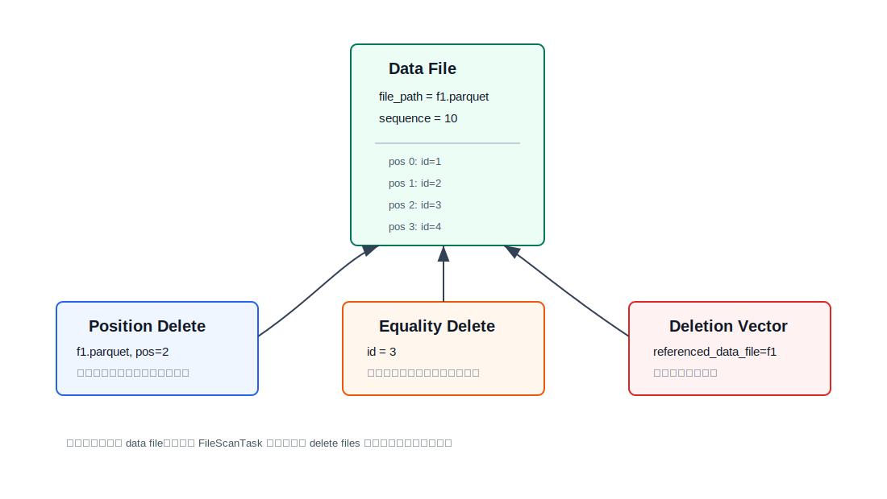
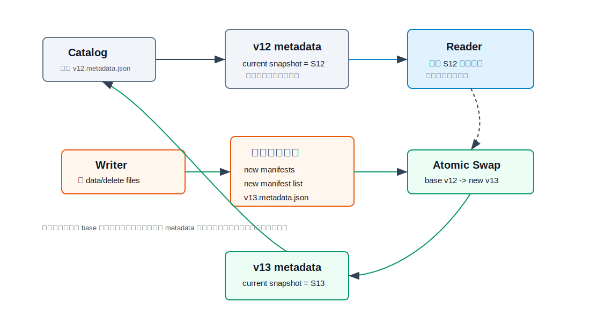
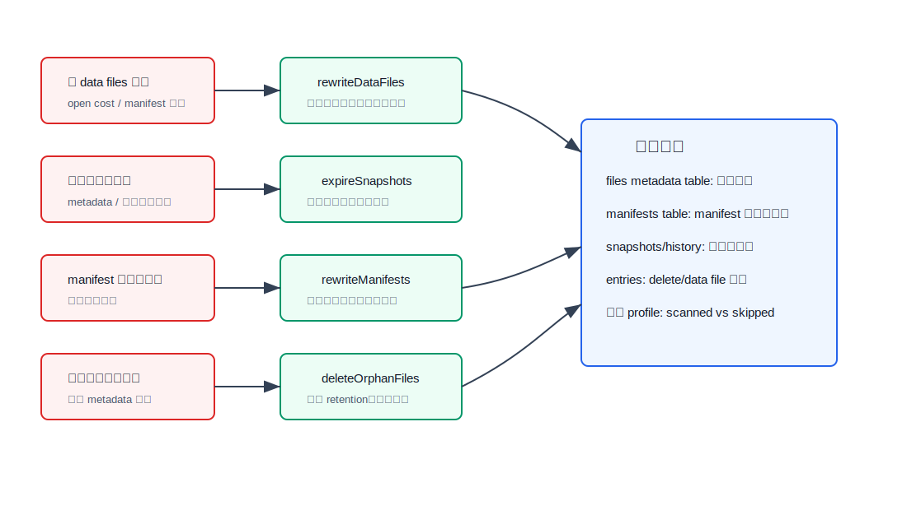

## 数据库筑基课 - iceberg 数据存储结构
                                                                                            
### 作者                                                                
digoal                                                                
                                                                       
### 日期                                                                     
2026-05-25                                                      
                                                                    
### 标签                                                                  
应用开发者 , 数据库筑基课 , 表存储 , 数据湖 , Lakehouse , Apache Iceberg      
                                                                                           
----                                                                    

## 背景
  

  
本节属于“表存储 / 数据湖表格式 / 分析型存储结构”的基础能力。课程大纲链接未在输入资料中提供，因此本文直接从工程问题切入：同样把数据文件放在 S3、OSS、HDFS 或本地对象存储上，为什么“目录 + Parquet”很快会变成不可控资产，而 Iceberg 能把这些文件组织成一张支持快照、演进、行级删除和多引擎互操作的表？

传统数据湖的问题不是 Parquet 不好。Parquet 是优秀的列式文件格式，但它只回答“一个文件内部如何编码列、row group、page 和统计信息”。真正的表还要回答：哪些文件属于当前版本？并发写入如何不互相覆盖？分区规则变了旧数据怎么办？删除一行是否必须重写整批文件？查询如何在千万级文件里先跳过绝大多数文件？

Iceberg 的答案是：**数据文件不可变，表状态由一棵可版本化的元数据树表达；读写都围绕 snapshot 做，提交只原子替换表元数据指针。** 这让数据湖从“文件集合”变成“带事务语义和物理布局知识的表格式”。

## 一、它解决什么问题？

Iceberg 解决的是开放数据湖里最难被目录约定解决的四类问题。

第一，**表状态不能靠目录推断**。Hive 风格目录分区把物理布局暴露给用户，查询必须知道 `dt=...` 这样的分区列，写入端也必须正确生成目录。分区规则一变，旧目录和新目录共存，查询、迁移、权限和清理都会复杂化。

第二，**并发和版本不能靠“最后写入 wins”**。分析任务、流式任务、回填任务可能同时写表。如果没有快照和原子提交，读者会看到半成品，写者也可能覆盖彼此新增的文件。

第三，**优化器不能扫描全量文件清单**。对象存储上 list 目录很贵，千万级文件更不能逐个打开读 footer。查询规划需要一层更轻的索引，先利用分区摘要、min/max、null count、文件大小等统计跳过不相关文件。

第四，**数据演进不能每次都重写全表**。schema、partition spec、sort order、delete 方式都会变化。如果每次演进都迁移一张新表，成本和风险都太高。

Iceberg 把这些问题转化为：维护一套不可变的 metadata/data 文件，以及一个可被 catalog 原子替换的当前 metadata 指针。代价也很明确：你获得 ACID-like 表语义和多引擎互操作，但必须维护 metadata tree、小文件、snapshot 保留、delete files、manifest 布局和 catalog 一致性。

## 二、它是什么？

Iceberg 不是文件格式，而是 **open table format**。它通常把实际行数据写在 Parquet、ORC 或 Avro 文件里，再用自己的表元数据定义“哪些文件在当前表版本里有效、这些文件有什么统计信息、如何裁剪和合并读取”。

可以把它分成几个层次：

| 层次 | 典型文件/对象 | 作用 |
|---|---|---|
| Catalog 指针 | Hive Metastore、REST Catalog、JDBC、Nessie 等 | 保存当前表 metadata 文件位置，提供原子提交边界 |
| Table metadata | `*.metadata.json` | 保存 schema、partition specs、sort orders、snapshots、refs、properties |
| Snapshot | metadata JSON 中的 snapshot 条目 | 表在某个时间点的完整文件集合入口 |
| Manifest list | `snap-*.avro` | 一个 snapshot 对应一份，列出 manifest 文件及其摘要 |
| Manifest | Avro 或 v4+ Parquet manifest | 列出 data/delete files，每条包含 partition、metrics、sequence 等 |
| Data/Delete files | Parquet、ORC、Avro、Puffin DV 等 | 保存真实数据或行级删除信息 |

本地源码与规范的分工也清晰：`format/spec.md` 是表格式规范；`core/src/main/java/org/apache/iceberg/TableMetadata.java` 表示 metadata JSON 的内存模型；`SnapshotProducer.java` 负责生成 snapshot、manifest list 并提交；`ManifestGroup.java` 负责扫描规划；`DeleteFileIndex.java` 负责把 delete files 关联到 data file。



图 1 说明：Iceberg 不靠目录枚举判断当前表内容。读者从 catalog 拿到当前 metadata，再沿 snapshot、manifest list、manifest 找到 data/delete files。旧 snapshot 和旧 manifest 可以继续被 time travel 使用，直到维护任务确认它们不再被引用。

## 三、核心原理

### 1. 表状态：metadata JSON 是逻辑入口

Iceberg 表的当前状态由 catalog 指向一个 metadata JSON 文件。官方规范说明，metadata 文件跟踪 schema、partitioning config、自定义属性和 snapshots；表状态变化会创建新 metadata 文件，并通过原子替换旧 metadata 指针提交。源码中 `TableMetadata` 也把格式版本、schema、partition spec、sort order、sequence、row lineage 等作为核心状态管理。

一个重要细节是：schema 和 partition spec 都用 ID 管理，而不是只靠名字和位置。`TableMetadata.newTableMetadata` 创建新表时会重新分配列 ID，并用新 schema 重建 partition spec。这样做的原因是数据库演进里最怕“名字复用”和“位置变化”导致旧数据被错误解释。Iceberg 用 field id、spec id、schema id 把长期演进的语义锚住。

### 2. Snapshot：读的是一个稳定版本

Snapshot 是表在某个时间点的完整状态。一个 snapshot 保存 snapshot id、parent snapshot id、sequence number、timestamp、operation、summary，以及 manifest list 位置。读者加载表 metadata 后，默认使用当前 snapshot；time travel 则指定旧 snapshot 或时间点。

这解决了数据湖最核心的可见性问题：读者不需要锁住写者，也不会看到写者中途产生的文件。只要读者拿到的是旧 metadata，它就沿旧 snapshot 规划；写者提交成功后，新读者才会看到新 metadata。

### 3. Manifest list 和 manifest：metadata tree 是轻量索引

Manifest list 是每个 snapshot 的规划入口，记录 manifest 文件路径、partition spec id、content 类型、sequence number、文件计数、分区摘要等。Manifest 再记录每个 data/delete file 的路径、格式、partition tuple、record count、file size、列级统计、split offsets、sequence number 等。

官方维护文档直接把这棵 metadata tree 称为表数据上的索引：manifest list 和 manifest 用于加速查询规划、裁剪不必要的数据文件。这里的“索引”不是 B+Tree，而是面向对象存储和批量扫描的多级稀疏索引。

`ManifestGroup.entries` 的源码路径体现了这个思路：先把查询谓词通过 partition spec 投影成 manifest-level evaluator，过滤掉不可能命中的 manifests；再打开命中的 manifest，使用 row filter、partition filter、file-level metrics 过滤 entries；最后生成 `FileScanTask`。如果有 delete manifests，还会先构建 `DeleteFileIndex`，为每个 data file 找到需要应用的 delete files。



图 2 说明：用户查询仍然写业务列谓词，例如 `event_time between ...`，Iceberg 根据当前和历史 partition specs 推导隐藏分区谓词。裁剪顺序是 manifest 级、manifest entry/data file 级、最后才到数据文件内部的 Parquet/ORC row group/page 裁剪。

### 4. 隐藏分区：逻辑查询不绑定物理目录

Iceberg 官方文档强调 hidden partitioning：分区值由 Iceberg 根据业务列和 transform 生成，消费者不需要知道表当前按 `day(event_time)`、`bucket(id, 16)` 还是其他方式布局。分区规则可以演进；旧数据保留旧 spec，新数据用新 spec，查询规划时按 spec id 分别推导过滤条件。

这就是“物理数据独立性”的一部分：SQL 绑定业务字段，不绑定目录名。`WHERE event_time >= ...` 能被投影到旧的 month spec，也能被投影到新的 day/hour spec。代价是规划器必须同时理解多个 partition spec，manifest 也必须按 spec 保存对应的 partition struct。

### 5. 行级删除：不可变 data file 上的删除补丁

Iceberg v2 引入 row-level deletes，因为分析型湖文件通常是不可变文件，不能像数据库 heap page 那样原地改一行。Iceberg 使用 delete files 表达删除：

- **Position delete**：记录 data file path 和 row position，精准删除某个文件中的某一行。
- **Equality delete**：记录一组列值，例如 `id = 3`，读取时对匹配列值做过滤。
- **Deletion vector**：v3+ 可用，通常用 Puffin 文件里的位图描述某个 data file 中哪些行被删除。

源码 `DeleteFileIndex` 按 sequence number、partition、path 组织 delete files。对一个 data file 规划扫描时，`forDataFile` 会查找全局 equality deletes、分区 equality deletes、position deletes、path deletes 和 DV。sequence number 很关键：delete file 只能应用到它之后或相应范围内的旧 data file，不能错误删除未来写入的新行。



图 3 说明：Iceberg 的行级删除优先保持 data file 不变，把删除语义记录在 delete file 中。写入成本下降，但读取必须合并 data file 和 delete files；如果 delete files 长期累积，读放大会升高，需要 compaction 或 rewrite 把补丁合并回数据文件。

### 6. 提交隔离：原子替换 metadata 指针

Iceberg 的提交路径可以简化为四步：

1. 写者基于当前 metadata 规划变更，生成新的 data/delete files 和 manifests。
2. 写者生成新的 manifest list，并构造新的 snapshot。
3. 写者基于旧 metadata 构造新 metadata。
4. catalog 执行 compare-and-swap：如果当前 metadata 仍是写者的 base，就替换成新 metadata；否则失败并重试。

`SnapshotProducer.apply` 会写 manifest list，并返回 `BaseSnapshot`；`commit` 中使用重试和指数退避，只在 `taskOps.commit(base, updated.withUUID())` 成功后，新 snapshot 才成为可见状态。失败时，未提交的 manifest list 和 manifests 需要清理。



图 4 说明：读者固定旧 metadata，不被并发写入影响；写者所有物理文件先写好，再尝试原子替换 catalog 指针。这个模式适合对象存储，因为对象存储不擅长小粒度原地修改，但擅长写新对象和读取不可变对象。

## 四、横向对比

| 维度 | Iceberg | Hive 目录分区 + Parquet | Delta Lake | Hudi | Snowflake 微分区 |
|---|---|---|---|---|---|
| 主要目标 | 开放表格式，多引擎互操作，snapshot 表语义 | 简单目录约定和文件扫描 | 事务日志驱动的湖表 | 写入/更新友好的湖表，含索引/服务能力 | 云数仓内建存储和优化 |
| 表状态来源 | metadata JSON + snapshot + manifests | 目录和 metastore 分区 | `_delta_log` JSON/Parquet log | timeline + file groups | Snowflake 管理的 metadata |
| 分区演进 | 支持 hidden partition 和 spec evolution | 通常困难，查询绑定目录列 | 支持一定演进能力 | 支持，依赖 Hudi 模型 | 自动微分区，用户可配置 clustering |
| 文件裁剪 | manifest list、manifest、file metrics、底层文件统计 | 目录分区 + 文件格式统计 | log + file stats + data skipping | timeline/index/file stats | micro-partition metadata |
| 行级删除 | position/equality delete，v3 DV | 通常重写文件或外部约定 | deletion vectors / rewrite | MOR/COW 多种路径 | 内部微分区维护 |
| 事务边界 | catalog metadata 指针原子替换 | 弱，依赖引擎约定 | 事务日志提交 | timeline commit | 专有服务托管 |
| 优点 | 格式开放、读写解耦、演进强 | 简单、生态广 | Spark 生态强，日志直观 | 流式更新能力强 | 自动优化深，用户负担低 |
| 代价 | metadata 和维护策略必须治理 | 演进、并发、清理困难 | 协议和实现绑定度较高 | 模型复杂，读写路径多 | 专有系统，物理控制权低 |

Snowflake pruning 论文和官方文档值得作为参照：Snowflake 利用 micro-partition 的 min/max、distinct、重叠深度等 metadata 做细粒度裁剪，论文还讨论了 filter、LIMIT、join、top-k 等更广义的 pruning。Iceberg 的 manifest/file metrics 和 Snowflake micro-partition metadata 在目标上相似，都是“先用元数据少读数据”。差别在于 Iceberg 把这套结构开放给多引擎，优化深度取决于各引擎实现和表维护质量；Snowflake 把存储、统计、优化器和执行器收在同一个托管系统里，能做更强的闭环优化，但互操作边界不同。

## 五、效果如何？

Iceberg 的收益主要来自四个方向。

第一，**规划成本从扫描目录变成读 metadata tree**。规范强调 Iceberg 以 O(1) 远程调用规划文件，而不是让远程调用数量随分区或文件数量增长。严格说，规划仍然要读命中的 manifest 和 manifest entries；这里的 O(1) 指不需要全表目录枚举和中心 metastore 瓶颈。

第二，**读放大取决于裁剪质量**。如果 partition spec、sort order、写入顺序和查询谓词一致，manifest 和 file metrics 能大量跳过数据。如果数据乱序写入、manifest 与查询维度错位、min/max 重叠严重，Iceberg 只能退化为读更多 manifest 和 data files。

第三，**写放大通常低于重写全表，但会换来后续维护成本**。append 是新增 files + manifest；delete/update 可以先写 delete files，避免立刻重写大 data file。但 delete files、小文件和碎片会在读取时偿还。

第四，**演进成本从“迁移全表”变成“metadata 多版本共存”**。schema、partition spec、sort order 可以演进，旧文件不必立刻重写。但规划和执行必须携带多版本语义，运维也必须知道哪些旧 snapshot、旧 metadata、旧 manifests 还能删。

用户给出的《Efficient Incremental Data Modeling in Apache Iceberg-Based Analytical Pipelines》报告了分区、snapshot retention、compaction 对扫描缩减、metadata/data 比例和响应时间的影响。本文不复用其具体数值作为通用性能承诺，因为这类结果依赖模拟假设、数据分布、文件大小和引擎实现；更可迁移的结论是：Iceberg 的效果来自 **分区、快照保留、文件大小、manifest 布局、delete file 合并** 共同治理，而不是单个开关。

## 六、实操 DEMO

以下示例用于验证 Iceberg 存储结构，不依赖本文执行结果。本文没有在本地启动 Spark/Trino/Flink，也没有执行这些 SQL；请在已有 Iceberg catalog 的 Spark SQL 环境中运行。

### 1. 创建表并写入几批数据

```sql
CREATE TABLE prod.db.events (
  id BIGINT,
  event_time TIMESTAMP,
  user_id BIGINT,
  amount DECIMAL(18, 2),
  status STRING
)
USING iceberg
PARTITIONED BY (days(event_time));

INSERT INTO prod.db.events VALUES
  (1, TIMESTAMP '2026-05-25 10:00:00', 101, 12.30, 'new'),
  (2, TIMESTAMP '2026-05-25 11:00:00', 102, 88.00, 'new');

INSERT INTO prod.db.events VALUES
  (3, TIMESTAMP '2026-05-26 09:00:00', 103, 19.90, 'paid');
```

### 2. 查看 snapshot 链

```sql
SELECT committed_at, snapshot_id, parent_id, operation, manifest_list, summary
FROM prod.db.events.snapshots
ORDER BY committed_at;
```

你应该关注：每次写入是否产生新 snapshot；`operation` 是 append、overwrite、delete 还是 replace；`manifest_list` 是否指向 `metadata/snap-*.avro`。

### 3. 查看 manifests 和 files

```sql
SELECT content, path, partition_spec_id,
       added_data_files_count, existing_data_files_count, deleted_data_files_count,
       partition_summaries
FROM prod.db.events.manifests;

SELECT content, file_path, file_format, record_count, file_size_in_bytes,
       readable_metrics
FROM prod.db.events.files;
```

你应该关注：manifest 是否按 partition spec 分组；文件级 `readable_metrics` 是否有查询列的 lower/upper bounds；小文件数量是否开始膨胀。

### 4. 查看 manifest entries

```sql
SELECT status, snapshot_id, sequence_number, file_sequence_number,
       data_file.file_path, data_file.record_count, readable_metrics
FROM prod.db.events.entries;
```

`entries` 是理解 Iceberg 存储结构最直接的 metadata table。它把 manifest entry 的状态、sequence 和 data file struct 展开给你看。遇到更新、删除、compaction 后，可以通过这里判断哪些文件是新增、已有或逻辑删除。

### 5. 分区演进验证

```sql
ALTER TABLE prod.db.events ADD PARTITION FIELD bucket(16, user_id);

INSERT INTO prod.db.events VALUES
  (4, TIMESTAMP '2026-05-26 10:00:00', 104, 28.00, 'paid');

SELECT path, partition_spec_id, partition_summaries
FROM prod.db.events.manifests
ORDER BY partition_spec_id, path;
```

预期现象：旧数据仍保留旧 partition spec，新数据使用新 spec。查询仍写 `event_time`、`user_id` 业务列谓词，而不是手写隐藏分区列。

## 七、最佳实践

对数据库架构师：

- 把 Iceberg 当成“开放表存储协议”，不是“更好的 Parquet 目录”。设计时先明确 catalog、对象存储、一致性、权限、清理策略和多引擎版本矩阵。
- 分区字段从高频过滤维度出发，优先考虑时间、租户、业务域等稳定谓词。避免高基数 identity 分区直接制造小文件和 manifest 膨胀。
- 对写入顺序和查询顺序建立契约。Iceberg 的裁剪质量依赖文件统计和 manifest 分组；乱序写入会让 min/max 重叠，降低跳过率。
- 让维护任务成为架构的一部分：snapshot expiration、small file compaction、manifest rewrite、orphan file cleanup、delete file 合并都要有周期和告警。

对 DBA / 数据平台运维：

- 周期查看 metadata tables：`snapshots`、`history`、`manifests`、`files`、`entries`。不要只看对象存储目录大小。
- 控制 snapshot 保留窗口。窗口太短会伤害 time travel、rollback 和长查询；窗口太长会造成 metadata 和旧数据引用堆积。
- 小文件治理要看 workload。流式写入通常需要更积极的 compaction；批量写入可以通过目标文件大小和分布式 writer 参数先减少碎片。
- `deleteOrphanFiles` 要保守设置 retention。官方维护文档提醒，过短 retention 可能把仍在写入中的文件误判为孤儿文件并破坏表。
- manifest rewrite 不是装饰性优化。写入维度和读取过滤维度不一致时，manifest 这个“metadata index”也会失效，需要按读路径重组。

对业务开发者：

- SQL 里写业务谓词，不要依赖物理目录名。让 Iceberg 的 hidden partitioning 做谓词投影。
- 不要把频繁小事务更新直接等同于数据库 OLTP。Iceberg 支持行级删除和 merge，但它的底层仍是不可变分析文件，delete file 堆积会反噬读取。
- 对 SLA 关键查询，记录 scanned files、skipped files、scanned bytes、manifest count、data/delete file 比例。只说“用了 Iceberg”不能保证快。
- 更新 schema 时理解 field id 语义。避免在多个引擎间用不兼容的 schema 演进方式绕过 Iceberg API。



图 5 说明：Iceberg 的存储结构不是一次设计后永远免维护。metadata tree、小文件、snapshot、delete files 都是把“立即重写全表”的成本转成“后续治理”的成本。

## 八、适合与不适合场景

适合：

- PB 级或长期增长的分析型事实表，数据主要 append，偶尔 merge/delete/update。
- 多引擎共用一份数据，例如 Spark 写入，Trino/Presto/DuckDB/Snowflake/Databricks 读取或互操作。
- 需要 time travel、rollback、增量读取、审计和跨版本调试的湖仓表。
- 分区规则会随着数据规模演进的业务，例如从 day 到 hour，从单时间维度到时间 + bucket。
- 对象存储为主、计算存储分离、希望避免目录 list 和 metastore 分区爆炸的环境。

不适合：

- 高频单行 OLTP 更新、强二级索引、低延迟点查为主的业务。
- 数据量很小、文件数量有限、单引擎脚本即可完成的临时数据集。
- 没有 catalog 治理、没有维护任务、没有文件大小控制的“只想换个表格式”项目。
- 强依赖某一专有数仓自动优化能力，并且不需要开放文件级互操作的场景。
- 所有查询都是全表扫描且没有 selective predicate 的场景。Iceberg 仍能提供事务和演进，但裁剪收益有限。

## 九、常见坑

1. **把 Iceberg 当目录格式。** 直接手动移动、删除、改名 data files 会破坏 metadata 引用。应该通过 Iceberg API 或引擎命令提交变更。
2. **只压缩 data files，不管 manifests。** 小文件合并后，如果 manifest 与查询路径错位，规划仍可能慢。
3. **delete files 长期不合并。** Equality delete 写入方便，但读取时可能需要和大量 data files 合并过滤，尤其在 merge-heavy 表上明显。
4. **snapshot 保留策略拍脑袋。** 过短影响 rollback/time travel/长查询，过长增加 metadata 和存储成本。
5. **跨引擎版本不一致。** 某些 v2/v3/v4 特性、delete vector、branch/tag、类型支持在不同引擎中的成熟度不同，要按最弱读写方设计。
6. **高基数分区制造碎片。** 分区不是越细越好。过细分区会带来大量小文件和 manifests，查询可能还没读数据就耗在规划上。
7. **忽略对象存储一致性和路径规范。** orphan cleanup 根据路径字符串判断引用，路径 authority、scheme、大小写或挂载方式不一致都可能造成误判。
8. **迷信格式本身带来性能。** Iceberg 提供结构和 metadata，性能取决于文件大小、排序、统计完整度、引擎裁剪实现和维护动作。

## 十、扩展问题

1. 为什么 Iceberg 把 snapshot 的 manifest list 独立成文件，而不是把所有 manifest 路径直接塞进 metadata JSON？
2. 如果一个表同时有 month、day、bucket 三代 partition spec，查询 `WHERE event_time BETWEEN ... AND user_id = ...` 应该如何分别裁剪？
3. Equality delete 和 position delete 分别把成本放在写入端还是读取端？什么情况下应该把 equality delete rewrite 成 position delete 或合并回 data file？
4. Snowflake micro-partition pruning 与 Iceberg manifest/file metrics pruning 的共同点和边界分别是什么？
5. 如果对象存储里出现了 data file，但任何 snapshot 都引用不到它，它一定安全吗？为什么 orphan cleanup 要设置保守 retention？
6. Iceberg v4 支持 relative locations 和 Parquet manifests，这对表迁移和 metadata 规划成本意味着什么？

## 十一、扩展阅读

- Apache Iceberg 官方规范：[Iceberg Table Spec](https://iceberg.apache.org/spec/)
- Apache Iceberg 官方文档：[Partitioning](https://iceberg.apache.org/docs/latest/partitioning/)、[Evolution](https://iceberg.apache.org/docs/1.8.0/docs/evolution/)、[Maintenance](https://iceberg.apache.org/docs/nightly/maintenance/)、[Spark Queries / Metadata Tables](https://iceberg.apache.org/docs/latest/spark-queries/)
- 本地源码：`iceberg/format/spec.md`、`iceberg/core/src/main/java/org/apache/iceberg/TableMetadata.java`、`SnapshotProducer.java`、`ManifestGroup.java`、`DeleteFileIndex.java`、`iceberg/api/src/main/java/org/apache/iceberg/ContentFile.java`
- DeepWiki：[apache/iceberg](https://deepwiki.com/apache/iceberg) 的 “Apache Iceberg Overview” 与 “Core Table Format”
- Pascal Ginter, Viktor Leis, [Active Data Lakes: Regaining Physical Data Independence Without Losing Interoperability](https://www.vldb.org/pvldb/vol19/p1372-ginter.pdf), PVLDB 2026
- Muhammad Hassan Shafiq, Zheying Zhang, Kostas Stefanidis, [Enhancing Data Interoperability in Multi-Platform Lakehouses with Apache Iceberg](https://homepages.tuni.fi/konstantinos.stefanidis/docs/MADEISD2025.pdf), ADBIS 2025
- Andreas Zimmerer 等，[Pruning in Snowflake: Working Smarter, Not Harder](https://arxiv.org/abs/2504.11540), SIGMOD 2025
- Snowflake 文档：[Micro-partitions & Data Clustering](https://docs.snowflake.com/en/user-guide/tables-clustering-micropartitions)
- Guruprasad Raghothama Rao, [Efficient Incremental Data Modeling in Apache Iceberg-Based Analytical Pipelines](https://www.ijisae.org/index.php/IJISAE/article/view/8171), IJISAE 2026
  
## 附录  
  
1、问 gemini  
```  
apache iceberg 数据存储结构相关的论文、开源项目.
```  
  
2、克隆代码  
```  
git clone --depth 1 https://github.com/apache/iceberg
```  
  
3、启用 codex, 使用 [数据库筑基课 skill](../skills/README.md).  
````
文章标题: 
  数据库筑基课 - iceberg 数据存储结构
项目源码(已克隆到当前项目如下目录中):  
  iceberg
论文: 
  Active Data Lakes: Regaining Physical Data Independence Without Losing Interoperability
  Enhancing Data Interoperability in Multi-Platform Lakehouses with Apache Iceberg
  Pruning in Snowflake: Working Smarter, Not Harder
  Efficient Incremental Data Modeling in Apache Iceberg-Based Analytical Pipelines: Partitioning and Snapshot Optimization Strategies
项目 deepwiki reponame:  
  apache/iceberg
项目参考信息: 
  iceberg/CLAUDE.md
````
  
  
#### [PostgreSQL 解决方案集合](../201706/20170601_02.md "40cff096e9ed7122c512b35d8561d9c8")
  
  
#### [德哥 / digoal's Github - 公益是一辈子的事.](https://github.com/digoal/blog/blob/master/README.md "22709685feb7cab07d30f30387f0a9ae")
  
  
#### [About 德哥](https://github.com/digoal/blog/blob/master/me/readme.md "a37735981e7704886ffd590565582dd0")
  
  

  
