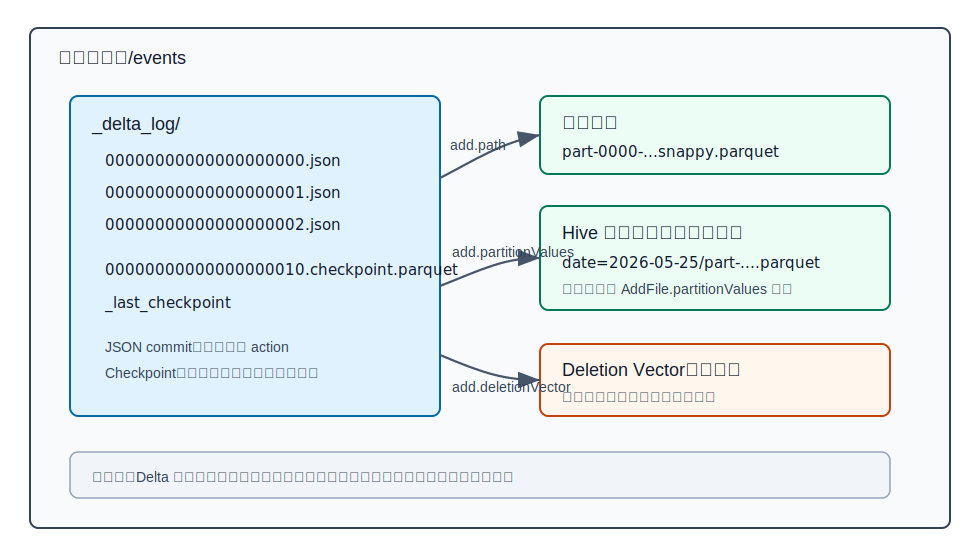
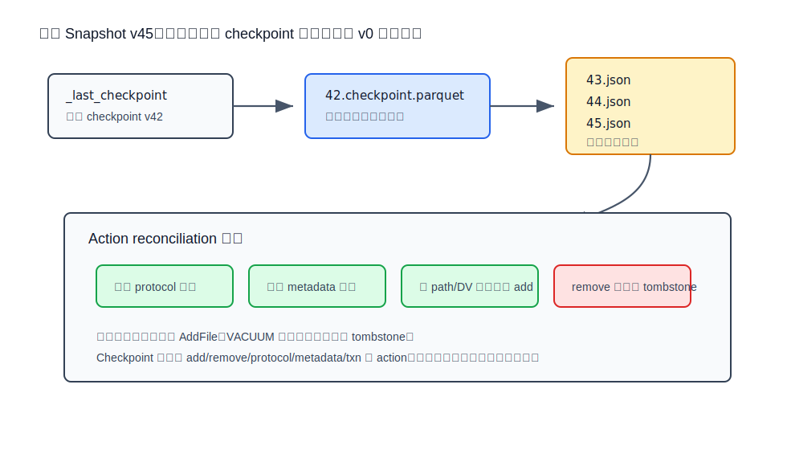
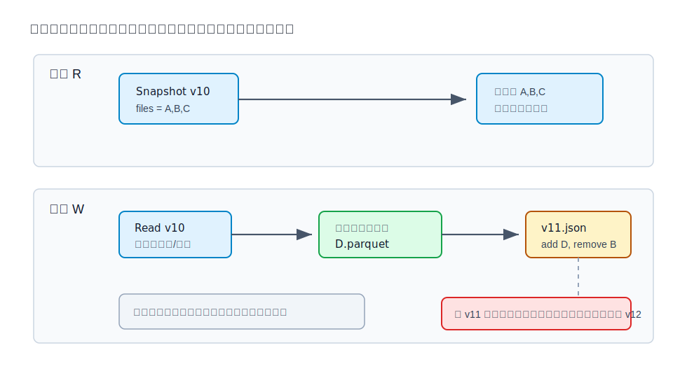
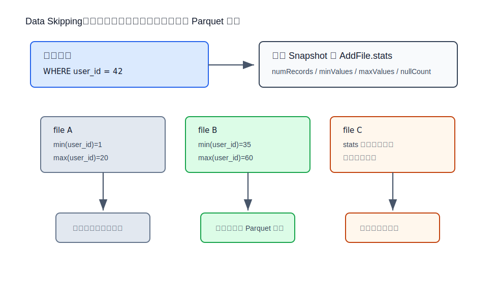
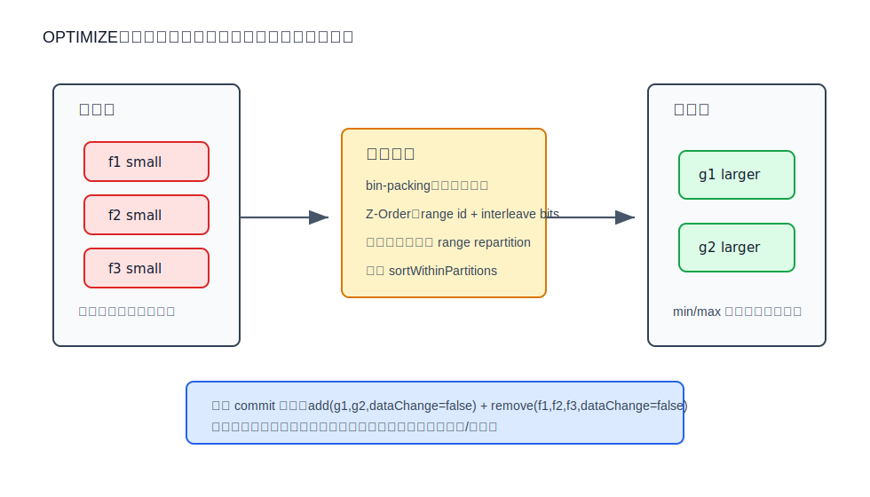

## 数据库筑基课 - delta lake 数据存储结构
                                                                                            
### 作者                                                                
digoal                                                                
                                                                       
### 日期                                                                     
2026-05-25                                                      
                                                                    
### 标签                                                                  
应用开发者 , 数据库筑基课 , 表存储 , 数据湖 , Lakehouse , Delta Lake       
                                                                                           
----                                                                    

## 背景
    
本节属于“表存储 / 数据湖表格式 / 分析型存储结构”的基础能力。课程大纲链接未在输入资料中提供，因此本文直接从工程问题切入：为什么同样是把 Parquet 文件放在 S3、OSS、ADLS、GCS、HDFS 或本地文件系统上，普通“目录 + 文件”只能算数据湖，而 Delta Lake 能把它组织成支持 ACID、快照、时间旅行、并发写入和文件级跳过的表？

Delta Lake 的论文把问题说得很直接：云对象存储便宜、容量大、存算分离，但它本质更接近 key-value object store；目录 listing 贵，跨对象原子更新弱，元数据一致性和性能都不是传统数据库文件系统那套假设。Lakehouse 论文进一步指出，两层架构“数据湖 + 数仓”会引入 ETL 复制、数据陈旧、可靠性和治理成本。Delta Lake 的设计目标就是在开放文件格式上补一个事务和元数据层，让数据湖表更像数据库表，但仍保留对象存储和 Parquet 的开放性。

一句话概括：**Delta Lake 不重新发明一个私有存储引擎，而是在不可变 Parquet 文件之上，用 `_delta_log` 事务日志定义“当前表版本到底由哪些文件组成”。**

## 一、它解决什么问题？

普通 Parquet 数据湖常见的坏味道有四类。

第一，**表状态靠目录推断，不可靠也不便宜**。一个表可能有百万到十亿级对象。查询前如果先递归 `LIST` 目录，再逐个读 Parquet footer 找 min/max，规划阶段就可能比真正扫描还慢。Delta Lake 论文强调，云对象存储上的元数据操作和小对象访问延迟会放大这个问题。

第二，**多文件更新不是原子的**。一次 overwrite、merge、delete 往往需要新增一批文件、删除一批旧文件。如果任务中途失败，纯目录模型很容易留下半成品。读者也可能在写者更新到一半时看到混合状态。

第三，**并发写入缺少清晰冲突边界**。流式写入、批量回填、手工修数、OPTIMIZE 可能同时发生。没有事务日志时，系统很难判断两个写者是否只是追加不同文件，还是修改了同一批业务数据。

第四，**维护动作会被误认为业务变化**。小文件压缩和 Z-Order 重排只是改变布局，不应该让下游流式读者认为表里多了一批新业务记录。Delta 的 `dataChange=false` 就是为这类动作提供语义标记。

Delta Lake 把这些问题转化为一个数据库老问题：**如何维护一条可串行化的表版本历史，并让读者在任何时刻只读取某一个一致快照。** 代价也很明确：你得到 ACID-like 表语义，但必须维护事务日志、checkpoint、统计信息、小文件、tombstone、VACUUM 保留期和协议兼容性。

## 二、它是什么？

Delta Lake 是 open table format / storage framework，不是 Parquet 的替代品。它通常仍把真实行列数据写成 Parquet 文件；Delta 自己定义的是表根目录下的事务日志协议、动作模型、快照重放规则和维护语义。

一个 Delta 表主要由这些对象组成：

| 层次 | 典型文件或结构 | 作用 |
|---|---|---|
| 表根目录 | `/table` | Delta 表的物理边界，包含数据文件和 `_delta_log` |
| 数据文件 | `*.parquet` | 保存真实列式数据；可位于根目录或分区目录 |
| 事务日志 | `_delta_log/00000000000000000010.json` | 一个版本一个 JSON commit，记录原子动作集合 |
| Checkpoint | `_delta_log/00000000000000000010.checkpoint.parquet` | 某版本完整表状态，避免从 0 号日志重放 |
| Last checkpoint | `_delta_log/_last_checkpoint` | 指向近端 checkpoint，减少日志目录 listing |
| Deletion vector | 可选 DV 文件或内联 DV | 标记某个数据文件中哪些行被逻辑删除 |
| 协议和元数据 | `protocol`、`metaData` action | 定义读写版本、表特性、schema、分区列、配置 |
| 文件动作 | `add`、`remove` action | 定义当前表新增和删除哪些逻辑文件 |

本地源码和规范的映射也很清楚：

- `delta/PROTOCOL.md` 定义事务日志协议、文件类型、AddFile/RemoveFile schema、checkpoint 和重放规则。
- `delta/spark/src/main/scala/org/apache/spark/sql/delta/DeltaLog.scala` 是 Spark 侧查询和修改日志的入口。
- `delta/spark/src/main/scala/org/apache/spark/sql/delta/Snapshot.scala` 表示不可变快照，并管理 checkpoint/delta files 的 action replay。
- `delta/spark/src/main/scala/org/apache/spark/sql/delta/OptimisticTransaction.scala` 管理乐观事务、读集合、冲突检测和提交重试。
- `delta/kernel/kernel-api/src/main/java/io/delta/kernel/internal/actions/AddFile.java` 和 `RemoveFile.java` 是 Kernel API 中 Add/Remove 动作的结构化表示。



图 1 说明：Delta 表的“当前状态”不等于目录里所有 Parquet 文件。哪些文件可见，要由 `_delta_log` 中的 `add` 和 `remove` 动作重放得到。没有被日志跟踪的文件，即使物理上在目录里，也不属于表的当前快照。

## 三、核心原理

### 1. 物理布局：数据文件不可变，日志定义可见性

Delta 的底层数据文件通常是 Parquet。Parquet 负责单文件内部的列式编码、row group、page、压缩和 footer 统计；Delta 负责跨文件层面的表语义：schema、分区、当前文件集合、事务版本、删除标记、统计信息和维护动作。

协议文档明确说，Delta transaction log 把 ACID 带到“大量文件组成的数据集合”上；事务使用 MVCC。写者不会原地修改旧 Parquet 文件，而是先写出新文件或旧文件的更新副本，再提交一个新日志版本，声明哪些文件新增、哪些文件逻辑移除。旧文件要等 VACUUM 保留期过后才物理删除，这样拿着旧快照的读者仍能完成查询。

这和传统数据库页式存储有本质区别：

- 数据库 heap/page 通常支持页内原地更新、undo/redo、buffer pool、WAL。
- Delta Lake 面向对象存储，不假设可以便宜地原地改一个 page；它更偏向 copy-on-write、append log、后台清理。
- Parquet 文件内部有压缩和编码，但 Delta 的事务边界是“日志版本”，不是 Parquet page。

### 2. Commit 文件：一个版本就是一个原子动作集合

Delta commit 文件放在 `_delta_log` 下，文件名是 20 位补零版本号，例如：

```text
_delta_log/00000000000000000000.json
_delta_log/00000000000000000001.json
_delta_log/00000000000000000002.json
```

每个 JSON commit 是 newline-delimited JSON，每一行是一个 action。常见 action 包括：

| Action | 作用 | 对表状态的影响 |
|---|---|---|
| `protocol` | 读写协议版本和表特性 | 最新值生效，不兼容客户端必须拒绝读写 |
| `metaData` | schema、分区列、配置、格式 | 最新值生效 |
| `add` | 新增一个逻辑文件 | 加入当前文件集合 |
| `remove` | 移除一个逻辑文件 | 从查询集合中移除，并作为 tombstone 保留 |
| `txn` | 应用级事务标识 | 支持幂等写入 |
| `commitInfo` | 操作来源和指标 | 用于审计和历史，不参与查询文件集合 |

一个最小化的 commit 形态如下，字段为了阅读做了删减：

```json
{"commitInfo":{"operation":"WRITE","readVersion":0,"isBlindAppend":true}}
{"protocol":{"minReaderVersion":1,"minWriterVersion":2}}
{"metaData":{"id":"...","format":{"provider":"parquet","options":{}},"schemaString":"...","partitionColumns":["event_date"],"configuration":{}}}
{"add":{"path":"event_date=2026-05-25/part-0000.snappy.parquet","partitionValues":{"event_date":"2026-05-25"},"size":841454,"modificationTime":1779680000000,"dataChange":true,"stats":"{\"numRecords\":1000,\"minValues\":{\"user_id\":1},\"maxValues\":{\"user_id\":999},\"nullCount\":{\"user_id\":0}}"}}
```

这段示例说明三个要点：数据文件路径、分区值和统计信息都在 `add` action 中；数据文件本身不携带“是否属于当前表版本”的最终语义；客户端必须按协议读取日志。

### 3. Snapshot：读者只看一个稳定版本

Delta 协议把某个版本的表状态称为 snapshot。Snapshot 包含协议、metadata、当前有效文件集合、未过期 tombstone 和应用事务集合。`Snapshot.scala` 的类注释也说明，它是某个 Delta 版本的不可变日志状态，并管理 checkpoint 或 delta files 中 action 的重放。

构造 snapshot 的基本逻辑是：

1. 找到目标版本之前最新的完整 checkpoint。
2. 读取 checkpoint 中已经消解过的表状态。
3. 读取 checkpoint 之后到目标版本之间的 JSON commit。
4. 按 action reconciliation 规则合并。
5. 得到当前可扫描的 `AddFile` 集合和未过期 `RemoveFile` tombstone。

重放规则很像“日志归并”：

- 最新 `protocol` 生效。
- 最新 `metaData` 生效。
- 同一个 appId 的最新 `txn` 生效。
- 对同一个逻辑文件，保留最新 `add` 或 `remove` 引用。
- 查询路径只返回当前有效 `add`；`remove` tombstone 主要服务 VACUUM 和并发旧读者。



图 2 说明：没有 checkpoint 时，读者可能要从 0 号日志重放到目标版本。checkpoint 把某版本完整状态保存成 Parquet，读者只需要从最近 checkpoint 加上后续少量 JSON commit 恢复状态。`_last_checkpoint` 不是表状态的唯一真相，它是加速定位近端 checkpoint 的指针。

### 4. MVCC 与乐观并发：先写数据，再抢下一个版本号

Delta 的写路径是典型 optimistic concurrency control。

1. 写者读取某个 snapshot，例如 v10。
2. 如果是 MERGE/UPDATE/DELETE/OPTIMIZE 这类依赖旧文件的操作，事务会记录读过的文件或谓词。
3. 写者先把新 Parquet 文件写到对象存储。
4. 写者尝试提交 `_delta_log/00000000000000000011.json`。
5. 如果这个版本号已经被其他写者创建，Delta 读取冲突版本，检查语义冲突，必要时换下一个版本重试。

`DeltaLog.scala` 的注释说明它内部使用乐观并发控制，并保证单次读看到一致快照。`OptimisticTransaction.scala` 要求事务中的读取必须通过 transaction 对象完成，否则并发冲突检测无法覆盖这些读。提交实现中，`doCommitRetryIteratively` 会在 `FileAlreadyExistsException` 或 retryable conflict 时进入冲突检查和重试；`writeCommitFile` 最终通过 commit coordinator 或文件系统 commit 写出目标版本日志。



图 3 说明：读者 R 拿到 v10 后，即使写者 W 正在写新文件或准备提交 v11，R 也继续读 v10 的文件集合。写者提交成功前，新文件只是物理对象，不属于任何可见 snapshot。若抢版本失败，写者必须检查中间 winning commits 是否和自己的读集合/写集合冲突。

### 5. AddFile / RemoveFile：Delta 表的“文件级 MVCC 元组”

如果把 Delta 类比成数据库，`AddFile` 和 `RemoveFile` 就像文件级 MVCC 记录。

`AddFile` 关键字段包括：

- `path`：数据文件相对表根目录的路径，或绝对路径。
- `partitionValues`：该逻辑文件对应的分区列值。
- `size`、`modificationTime`：文件大小和修改时间。
- `dataChange`：是否代表业务数据变化。OPTIMIZE 等纯布局变化通常置为 `false`。
- `stats`：文件级统计，例如 `numRecords`、min/max、null count。
- `deletionVector`：可选 DV 描述符。
- `baseRowId`、`defaultRowCommitVersion`：行跟踪相关字段。
- `clusteringProvider`：clustered table 相关字段。

`RemoveFile` 关键字段包括：

- `path`：被移除的逻辑文件路径。
- `deletionTimestamp`：删除时间。
- `dataChange`：是否代表业务数据变化。
- `extendedFileMetadata`、`partitionValues`、`size`、`stats`、`tags`：用于维护和审计的扩展信息。
- `deletionVector`：可选 DV 描述符。

协议文档强调，物理删除可以延迟；`remove` action 要作为 tombstone 保留到过期。默认 VACUUM 保留期是 7 天。这个保留期不是随便的清理参数，而是 MVCC 安全窗口：如果你把旧文件太早删掉，旧 snapshot、time travel 或慢查询就可能读不到它们。

### 6. Checkpoint：把日志状态物化成 Parquet

Checkpoint 也是存储结构的一部分，不是缓存小优化。协议要求 checkpoint 包含 protocol、metadata、当前仍有效的 add files、未过期 remove files、txn、domain metadata 等信息。它的作用是把历史 JSON commit 的重放结果物化，降低新读者构造 snapshot 的成本，并允许元数据清理删除更老的 JSON 日志。

Delta 支持 classic checkpoint、multi-part checkpoint 和 V2/UUID-named checkpoint 等形式。协议文档指出，multi-part checkpoint 因为不能原子创建、容易出现部分缺失或混合覆盖，已经不推荐；V2 checkpoint 可使用 sidecar files 改善可扩展性。

官方优化文档也说明，Delta 表会周期性地把事务日志增量 compact 成 Parquet checkpoint，便于读查询快速恢复当前状态。

### 7. Data skipping：AddFile.stats 是文件级稀疏索引

Delta 的 data skipping 不需要打开每个 Parquet footer。写入时，Delta 会把部分列的 `numRecords`、`minValues`、`maxValues`、`nullCount` 写进 `AddFile.stats`。查询时，`DataSkippingReader` 根据谓词构造“必须读取文件”的条件；如果某个文件的统计缺失或不可信，系统会保守保留该文件，避免漏读。

本地源码中有几个关键点：

- `StatisticsCollection` 生成 `numRecords`、min、max、null count 等统计结构。
- `DataSkippingReaderConf.DATA_SKIPPING_NUM_INDEXED_COLS_DEFAULT_VALUE` 默认统计前 32 个列。
- `DataSkippingReader` 对可跳过的数据类型有限制，数值、日期、时间戳、字符串等更适合 min/max。
- 对字符串等长值列收集统计有成本，官方文档建议通过 `delta.dataSkippingNumIndexedCols` 控制统计列范围。



图 4 说明：查询 `WHERE user_id = 42` 时，如果文件 A 的 `max(user_id)=20`，它不可能命中，可以跳过；文件 B 的范围覆盖 42，需要读取；文件 C 没有可用统计，也必须读取。Data skipping 是“保守少读”，不是布隆过滤器式概率判断。

### 8. OPTIMIZE、bin-packing 与 Z-Order：重写文件来改善布局

Delta 的表存储性能很大程度取决于文件大小和数据布局。

小文件太多会带来：

- 事务日志里 `AddFile` 数量膨胀。
- 查询规划和任务调度开销上升。
- 对象存储 GET/LIST 压力增加。
- Parquet row group 和压缩效果变差。

`OPTIMIZE` 的 bin-packing 会把多个小文件合成更大的文件。官方文档说明，bin-packing 用来把小文件 coalesce 成大文件以提升读取速度；它是幂等的，第二次对同样数据再执行通常没有效果。

Z-Order 则解决另一个问题：即使文件大小合适，如果业务谓词列在每个文件里都分布很散，min/max 范围高度重叠，data skipping 也跳不掉文件。Z-Order 把多列值通过空间填充曲线映射到一维排序键，使相近的多维值更可能落在同一批文件里。`MultiDimClustering.scala` 中，`ZOrderClustering` 会对列计算 range partition id，再 `interleave_bits` 生成聚簇表达式，并按该表达式 range repartition。

`OptimizeTableCommand.scala` 还体现了维护语义：OPTIMIZE 会读取候选文件，写出新文件，然后提交一组 `add` 和 `remove` action；旧文件的 `removeWithTimestamp(..., dataChange = false)` 表明这是布局变化，不是业务删除。



图 5 说明：bin-packing 主要减少文件数量；Z-Order 主要收紧常用谓词列的文件级 min/max。二者都通过“新增新文件 + 逻辑移除旧文件”的事务提交完成，而不是原地改旧 Parquet 文件。

## 四、横向对比

| 维度 | Delta Lake | 纯 Parquet/Hive 目录 | Apache Iceberg | Apache Hudi | 传统数据库页式存储 |
|---|---|---|---|---|---|
| 主要目标 | 在对象存储文件上提供 ACID 表语义和 Spark 生态优化 | 简单开放文件集合 | 多引擎开放表格式、manifest 元数据树 | 面向增量写入、索引和流式摄取 | 低延迟事务、页级更新、强一致 |
| 当前表状态 | `_delta_log` 重放得到 snapshot | 目录 listing + metastore 分区 | catalog 指向 metadata JSON，再到 snapshot/manifest | timeline + file groups | buffer/WAL/catalog 中的页和行版本 |
| 数据文件 | 主要是 Parquet | Parquet/ORC/CSV 等 | Parquet/ORC/Avro | Parquet + log files 等 | 数据页、索引页、WAL |
| 提交原子性 | 创建下一版本日志文件或 commit coordinator | 弱，依赖任务约定 | catalog metadata 指针 CAS | timeline commit | WAL + 锁/事务管理 |
| MVCC 粒度 | 文件级；DV 可做行级逻辑删除 | 基本没有标准 MVCC | snapshot + data/delete files | file group / record-level 语义 | 行/页版本 |
| 查询裁剪 | partition pruning + AddFile.stats data skipping + Parquet 裁剪 | 目录分区 + Parquet footer | manifest summary + file metrics + Parquet 裁剪 | timeline/index/file stats | 优化器、索引、统计、分区 |
| 更新/删除 | copy-on-write 或 deletion vectors | 通常重写文件 | delete files 或 rewrite | COW/MOR 多路径 | 原地更新或 MVCC 行版本 |
| 维护成本 | checkpoint、VACUUM、OPTIMIZE、stats、协议版本 | 小文件和目录治理靠外部约定 | manifest rewrite、expire snapshots、delete file compaction | compaction、cleaning、clustering、index | vacuum/checkpoint/reindex/autovacuum 等 |
| 适合 | 大规模分析、湖仓、批流一体、开放 Parquet 访问 | 只追加、低并发、简单离线交换 | 多引擎表格式治理和演进 | 高频 upsert/CDC 摄取 | OLTP、低延迟点查和强事务 |

这张表的重点不是“谁更先进”，而是边界不同。Delta Lake 的优势在于它把事务日志做得非常直接：一个表目录自描述，日志动作就是单表历史。Iceberg 的优势在于 manifest metadata tree 和 catalog abstraction 更强调多引擎和分区演进。Hudi 更强调写入服务、索引和增量摄取。传统数据库则完全不把对象存储当主要随机更新介质，它的页、锁、WAL、buffer pool 是另一套假设。

## 五、效果如何？

Delta Lake 的收益来自五个机制，不是一个神奇开关。

第一，**正确性收益**：读者只读一个 snapshot，写者通过下一版本 commit 建立原子可见性。只要底层存储满足 Delta 要求的 atomic visibility、mutual exclusion、consistent listing，或通过 LogStore/commit coordinator 补齐语义，就能避免“半写入表”。

第二，**元数据规划收益**：checkpoint 和 `_last_checkpoint` 降低 snapshot 构造成本。Delta Lake 论文提到，默认客户端会周期性 checkpoint，并用 `_last_checkpoint` 避免全量 listing 日志目录。协议文档则要求读者优先使用最新完整 checkpoint。

第三，**读取收益**：data skipping 可以在 Parquet 扫描前跳过不相关文件。效果取决于统计是否存在、谓词是否能转换、文件布局是否让 min/max 足够窄。数据随机散落时，统计范围重叠，收益会明显下降。

第四，**写入和维护收益**：append 是新增 Parquet + 新 commit；OPTIMIZE 可以把小文件合成大文件；Z-Order 可以改善多维谓词裁剪。代价是维护任务本身会消耗计算资源，并造成写放大。

第五，**时间旅行和审计收益**：日志保留了版本历史，可以按版本或时间读取旧 snapshot，也能查看 operation、metrics 和 commitInfo。代价是日志和旧文件不能无限保留，保留策略与 VACUUM 必须和业务回溯要求匹配。

需要避免两个误解：

- Delta 不是行存数据库。没有二级索引时，点查通常仍是文件级跳过 + Parquet 扫描，不应拿它替代 OLTP 主键查询。
- Delta 的 ACID 是单表事务日志语义。跨表事务、全局约束、复杂锁管理不是它的默认强项。

## 六、实操 DEMO

以下 DEMO 用来验证存储结构。本文没有在本机启动 Spark/Delta 环境，也没有执行这些 SQL 和命令；它们是可在已配置 Delta Lake Spark SQL 环境中运行的最小实验。

### 1. 创建一张 Delta 表并写入数据

```sql
DROP TABLE IF EXISTS delta_demo_events;

CREATE TABLE delta_demo_events (
  event_id BIGINT,
  user_id BIGINT,
  event_time TIMESTAMP,
  event_date DATE,
  amount DECIMAL(18, 2),
  status STRING
)
USING delta
PARTITIONED BY (event_date)
LOCATION '/tmp/delta_demo_events';

INSERT INTO delta_demo_events VALUES
  (1, 101, TIMESTAMP '2026-05-25 10:00:00', DATE '2026-05-25', 12.30, 'new'),
  (2, 102, TIMESTAMP '2026-05-25 10:05:00', DATE '2026-05-25', 88.00, 'paid');

INSERT INTO delta_demo_events VALUES
  (3, 101, TIMESTAMP '2026-05-26 09:00:00', DATE '2026-05-26', 19.90, 'paid');
```

验证点：

- `/tmp/delta_demo_events/_delta_log/` 下应出现连续版本 JSON。
- 分区目录 `event_date=2026-05-25/` 下有 Parquet 数据文件。
- 第 0 号 commit 通常包含 `protocol`、`metaData` 和初始 `add`。

### 2. 直接观察 commit JSON

```bash
ls -lah /tmp/delta_demo_events/_delta_log
sed -n '1,20p' /tmp/delta_demo_events/_delta_log/00000000000000000000.json
```

你应重点看这些字段：

- `metaData.format.provider` 是否是 `parquet`。
- `metaData.partitionColumns` 是否包含 `event_date`。
- `add.path` 是否指向真实 Parquet 文件。
- `add.partitionValues` 是否记录分区值。
- `add.stats` 是否有 `numRecords`、`minValues`、`maxValues`、`nullCount`。

### 3. 验证删除不是立刻物理删除

```sql
DELETE FROM delta_demo_events WHERE event_id = 2;

DESCRIBE HISTORY delta_demo_events;
SELECT * FROM delta_demo_events VERSION AS OF 0;
SELECT * FROM delta_demo_events;
```

验证点：

- 新版本 JSON 中会出现 `remove`，有些实现和表特性下也可能出现带 deletion vector 的 `add/remove`。
- 当前版本不再返回 `event_id = 2`。
- 旧版本仍可能通过 time travel 读取，前提是日志和旧数据文件未被 VACUUM 清理。

### 4. 验证 OPTIMIZE 是布局变化

```sql
OPTIMIZE delta_demo_events WHERE event_date = DATE '2026-05-25';
```

验证点：

- 新 commit 中通常有新的 `add` 和旧文件的 `remove`。
- 对纯压缩/布局优化，文件动作通常是 `dataChange=false`。
- 查询结果不应变化，但文件数量和文件大小分布可能变化。

### 5. 验证 Z-Order 与统计列的关系

```sql
OPTIMIZE delta_demo_events ZORDER BY (user_id);

SELECT *
FROM delta_demo_events
WHERE user_id = 101;
```

验证点：

- 如果 `user_id` 有统计信息，Z-Order 后文件级 min/max 更可能变窄，data skipping 才有效。
- 如果列没有收集 stats，官方文档明确说对其 Z-Order 基本是浪费，因为跳过依赖列级 min/max/count 等统计。

## 七、最佳实践

面向数据库架构师：

- 把 Delta 表当作“文件级 MVCC 表格式”，不是把对象存储伪装成 OLTP 数据库。
- 高并发写入表优先设计好分区边界、写入批次大小和冲突域。MERGE/DELETE/UPDATE 会记录读集合和谓词，和盲 append 的冲突概率不同。
- 明确 time travel SLA。业务要求回溯 30 天，就不能用 7 天 VACUUM 策略清掉必要旧文件。
- 在多引擎场景中，先确认协议版本和表特性兼容性。`protocol` 升级后，旧客户端可能只能失败退出。

面向 DBA / 数据平台运维：

- 监控 `_delta_log` 大小、checkpoint 生成、commit 频率、文件数量、平均文件大小、tombstone 数量和 VACUUM 运行情况。
- 不要手工删除 Delta 表目录中的 Parquet 文件或 `_delta_log` 文件。物理文件是否可删应交给 VACUUM 和协议规则。
- 为小文件严重的表安排 OPTIMIZE 或自动压缩；但要把维护任务的计算成本和写放大纳入调度窗口。
- 对常用过滤列确认 stats 覆盖。宽字符串、binary、variant 等列收集统计可能昂贵，应按查询模式取舍。

面向业务开发者：

- 写入 Delta 表要通过 Delta API/SQL，不要绕过事务日志直接往目录塞 Parquet。
- 查询谓词尽量使用分区列和有统计的高选择性列，避免把过滤逻辑包在难以下推或非确定性函数里。
- MERGE/UPDATE/DELETE 要控制匹配范围。无谓的全表条件会扩大冲突域，也会产生更多文件重写。
- 如果下游是流式读取，理解 `dataChange=false` 的含义，避免把 OPTIMIZE 产生的文件重排当作业务新增。

## 八、适合与不适合场景

适合：

- 大规模 append-heavy 分析表，例如日志、事件、交易流水、埋点、宽表。
- 需要批流统一、时间旅行、审计历史和一致快照的湖仓场景。
- 需要在对象存储上做多作业并发写入，但事务边界主要是单表的场景。
- 过滤列稳定、可通过分区和 data skipping 少读大量文件的分析 workload。
- 需要开放 Parquet 文件，同时希望避免纯目录湖的半写入、脏读和小文件失控。

不适合：

- 低延迟单行点查、高频短事务 OLTP。
- 复杂跨表事务和强外键约束场景。
- 毫秒级更新可见性、极高 QPS 主键写入场景。
- 不愿维护 checkpoint、VACUUM、OPTIMIZE、stats 和协议兼容性的简单文件交换场景。
- 查询条件高度随机、统计范围高度重叠、每次都接近全表扫描的小数据集；这时 Delta 的维护层可能比收益更重。

## 九、常见坑

1. **把 Delta 表目录当普通目录管理。**  
   手工删除 Parquet 或日志文件会破坏 snapshot。正确做法是使用 Delta 的 DELETE、VACUUM、OPTIMIZE 和表维护命令。

2. **VACUUM 保留期小于业务回溯窗口。**  
   VACUUM 删除的是旧 snapshot 可能还需要的物理文件。只要有 time travel、审计、慢查询或下游延迟消费，就要谨慎。

3. **小文件堆积后只怪查询引擎。**  
   小文件会同时拖慢日志重放、任务调度、对象存储访问和 Parquet 扫描。先看文件大小分布和 commit 模式。

4. **Z-Order 选错列。**  
   Z-Order 应用于常出现在谓词中、选择性高、且有统计信息的列。列越多，局部性收益通常越分散；官方文档也提醒多列 Z-Order 的效果会随列数增加下降。

5. **把 partition 当索引用。**  
   高基数分区会制造大量小目录和小文件。分区适合粗粒度裁剪和写入隔离，不适合照搬 OLTP 主键。

6. **忽视协议版本。**  
   Deletion vectors、column mapping、clustering、row tracking 等表特性可能提升协议要求。旧客户端读不了不是偶然，而是协议保护。

7. **只看当前 Parquet 文件，不看日志动作。**  
   当前目录中的旧文件、孤儿文件、被 remove 但未 VACUUM 的文件，都可能物理存在。表状态要从 snapshot 看。

## 十、扩展问题

1. Delta 的文件级 MVCC 和 PostgreSQL 的行级 MVCC，在读放大、写放大、清理成本上分别有什么不同？
2. 如果一个 Delta 表每天 10 万个小文件，checkpoint 能解决哪些问题，不能解决哪些问题？
3. Z-Order、Hive 分区、Liquid clustering 的共同目标都是少读文件，它们分别把代价放在写入、维护还是查询规划上？
4. Deletion vector 降低了删除写放大，但会怎样提高读取复杂度和统计维护难度？
5. 如果你要在 Delta、Iceberg、Hudi 中选择一种湖表格式，应该先问业务的哪些 workload 问题？

## 十一、扩展阅读

- Delta Lake 本地项目说明：[../delta/README.md](../delta/README.md)
- Delta 本地开发与架构提示：[../delta/CLAUDE.md](../delta/CLAUDE.md)
- Delta Transaction Log Protocol：[../delta/PROTOCOL.md](../delta/PROTOCOL.md)
- Spark 侧日志入口：[../delta/spark/src/main/scala/org/apache/spark/sql/delta/DeltaLog.scala](../delta/spark/src/main/scala/org/apache/spark/sql/delta/DeltaLog.scala)
- Snapshot 实现：[../delta/spark/src/main/scala/org/apache/spark/sql/delta/Snapshot.scala](../delta/spark/src/main/scala/org/apache/spark/sql/delta/Snapshot.scala)
- Optimistic transaction 实现：[../delta/spark/src/main/scala/org/apache/spark/sql/delta/OptimisticTransaction.scala](../delta/spark/src/main/scala/org/apache/spark/sql/delta/OptimisticTransaction.scala)
- AddFile / RemoveFile Kernel 实现：[../delta/kernel/kernel-api/src/main/java/io/delta/kernel/internal/actions/AddFile.java](../delta/kernel/kernel-api/src/main/java/io/delta/kernel/internal/actions/AddFile.java) ，[../delta/kernel/kernel-api/src/main/java/io/delta/kernel/internal/actions/RemoveFile.java](../delta/kernel/kernel-api/src/main/java/io/delta/kernel/internal/actions/RemoveFile.java)
- Data skipping 实现：[../delta/spark/src/main/scala/org/apache/spark/sql/delta/stats/DataSkippingReader.scala](../delta/spark/src/main/scala/org/apache/spark/sql/delta/stats/DataSkippingReader.scala) ，[../delta/spark/src/main/scala/org/apache/spark/sql/delta/stats/StatisticsCollection.scala](../delta/spark/src/main/scala/org/apache/spark/sql/delta/stats/StatisticsCollection.scala)
- OPTIMIZE 和 Z-Order 实现：[../delta/spark/src/main/scala/org/apache/spark/sql/delta/commands/OptimizeTableCommand.scala](../delta/spark/src/main/scala/org/apache/spark/sql/delta/commands/OptimizeTableCommand.scala) ，[../delta/spark/src/main/scala/org/apache/spark/sql/delta/skipping/MultiDimClustering.scala](../delta/spark/src/main/scala/org/apache/spark/sql/delta/skipping/MultiDimClustering.scala)
- DeepWiki：[`delta-io/delta`](https://deepwiki.com/delta-io/delta) ，用于快速定位架构主题；重要结论本文已回查协议和源码。
- 论文：Michael Armbrust et al., [Delta Lake: High-Performance ACID Table Storage over Cloud Object Stores](https://people.eecs.berkeley.edu/~matei/papers/2020/vldb_delta_lake.pdf), PVLDB 2020.
- 论文：Michael Armbrust et al., [Lakehouse: A New Generation of Open Platforms that Unify Data Warehousing and Advanced Analytics](https://www.databricks.com/sites/default/files/2020/12/cidr_lakehouse.pdf), CIDR 2021.
- 用户提供的参考标题：`Z-Ordering/Multi-dimensional Clustering for Efficient Analytics on Data Lakes`。输入中未包含本地 PDF 或 URL；本文关于 Z-Order 的机制以 Delta 官方优化文档和本地 `MultiDimClustering.scala`、`OptimizeTableCommand.scala` 源码为准。
- 官方文档：[Storage configuration](https://docs.delta.io/delta-storage/) ，说明 Delta ACID 对底层存储的 atomic visibility、mutual exclusion、consistent listing 要求。
- 官方文档：[Optimizations](https://docs.delta.io/optimizations-oss/) ，说明 compaction、data skipping、Z-Ordering、checkpointing 和 optimized write。
  
## 附录  
  
1、问 gemini  
```  
delta lake 数据存储结构相关的论文、开源项目.
```  
  
2、克隆代码  
```  
git clone --depth 1 https://github.com/delta-io/delta
```  
  
3、启用 codex, 使用 [数据库筑基课 skill](../skills/README.md).  
````
文章标题: 
  数据库筑基课 - delta lake 数据存储结构
项目源码(已克隆到当前项目如下目录中):  
  delta
论文: 
  Delta Lake: High-Performance ACID Table Storage over Cloud Object Stores
  Lakehouse: A New Generation of Open Platforms that Unify Data Warehousing and Advanced Analytics
  Z-Ordering/Multi-dimensional Clustering for Efficient Analytics on Data Lakes
项目 deepwiki reponame:  
  delta-io/delta
项目参考信息: 
  delta/CLAUDE.md
````
  
  
#### [PostgreSQL 解决方案集合](../201706/20170601_02.md "40cff096e9ed7122c512b35d8561d9c8")
  
  
#### [德哥 / digoal's Github - 公益是一辈子的事.](https://github.com/digoal/blog/blob/master/README.md "22709685feb7cab07d30f30387f0a9ae")
  
  
#### [About 德哥](https://github.com/digoal/blog/blob/master/me/readme.md "a37735981e7704886ffd590565582dd0")
  
  

  
