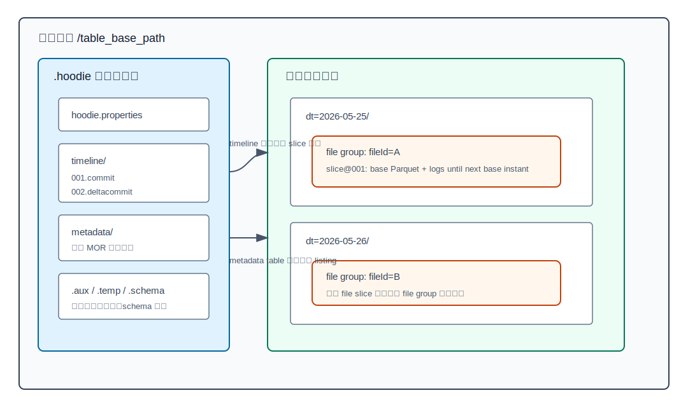
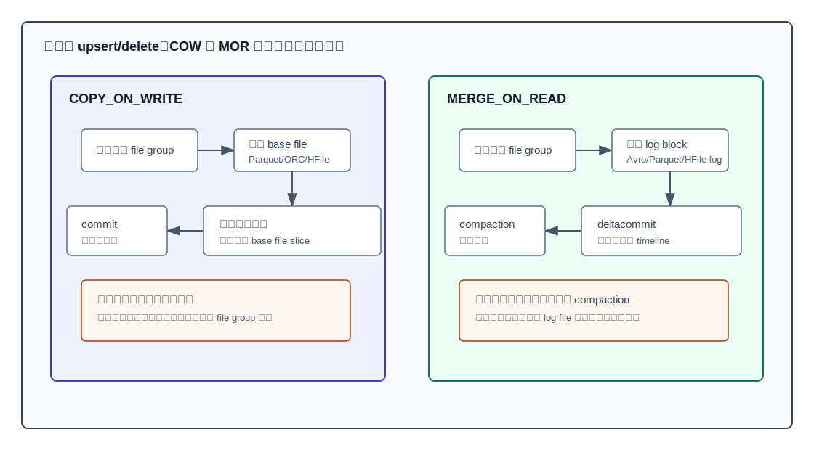
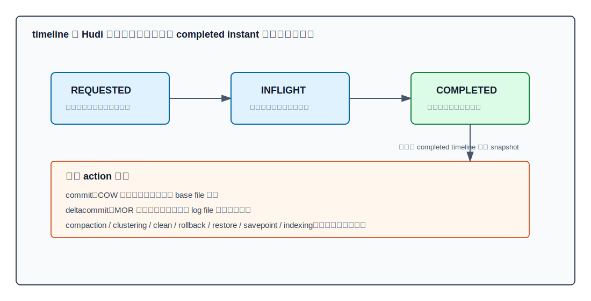
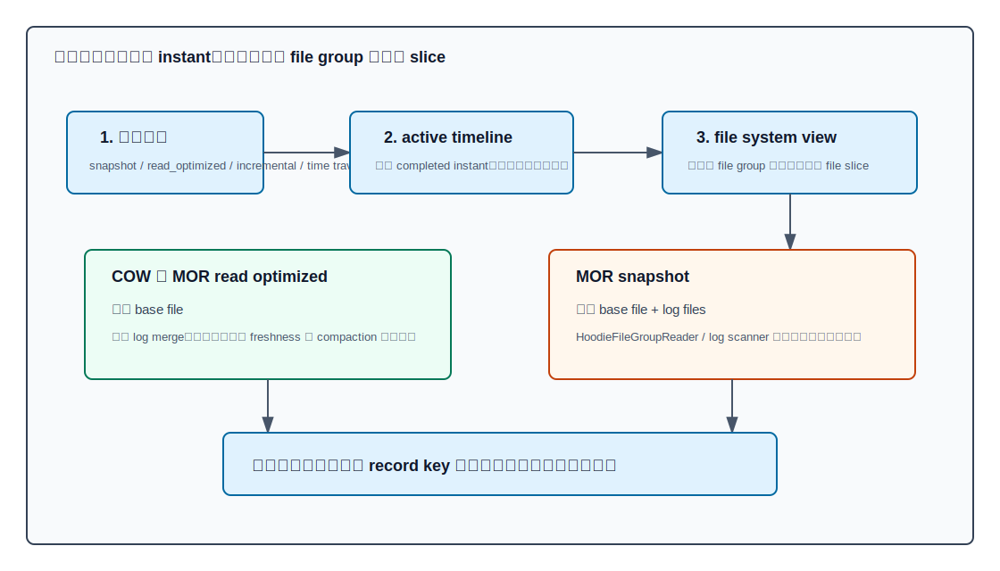
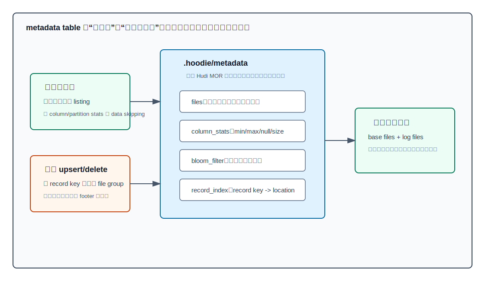

## 数据库筑基课 - apache hudi 数据存储结构
                                                                                            
### 作者                                                                
digoal                                                                
                                                                       
### 日期                                                                     
2026-05-25                                                      
                                                                    
### 标签                                                                  
应用开发者 , 数据库筑基课 , 表存储 , 数据湖 , Lakehouse , Apache Hudi       
                                                                                           
----                                                                    

## 背景
    


本节属于“表存储 / 数据湖表格式 / 分析型存储结构”的基础能力。课程大纲链接未在输入资料中提供，因此本文直接从工程问题切入：为什么同样是把 Parquet、ORC、Avro 或 HFile 放在 S3、OSS、ADLS、GCS、HDFS 这类存储上，普通“目录 + 文件”只能算数据湖，而 Apache Hudi 能把它组织成支持 upsert、delete、快照、增量读取、时间旅行、CDC、索引和表服务的湖表？

传统数据湖的问题不是 Parquet 不好。Parquet 回答的是“一个文件内部如何列式编码、压缩、存统计信息”。业务表还要回答另一组数据库问题：哪些文件属于当前版本？更新一条记录时如何找到它在哪个文件？写失败留下的半成品怎么回滚？读者如何不看到一半写入？小文件、旧版本、log 文件如何被后台维护？下游 ETL 如何只消费上次之后变化过的数据？

Hudi 的答案可以浓缩成一句话：**数据按 file group 和 file slice 组织，表状态由 `.hoodie` timeline 发布，更新先通过索引定位 record key 所在 file group，再选择 COW 重写 base file 或 MOR 追加 log file。**

这个设计和 Iceberg、Delta Lake 的出发点不同。Iceberg 更强调开放元数据树和多引擎读优化，Delta Lake 更强调事务日志定义当前文件集合；Hudi 的核心优势是面向高频 upsert/delete、CDC 和增量处理，把“记录级变更”作为一等公民。CIDR 2023 的 lakehouse 存储系统对比论文也把 Delta、Hudi、Iceberg 放在同一类：它们都在低成本数据湖存储之上补事务、索引和 DBMS 管理能力，但设计取舍不同。

## 一、它解决什么问题？

Hudi 首先解决的是可变数据进入数据湖的问题。

第一，**更新不能靠重写整张表或整片分区**。订单状态、风控特征、用户画像、库存、广告点击归因、CDC 入湖，都会出现迟到数据、修正数据和删除数据。如果每次只为几万条变更重写 TB 级分区，写放大、调度延迟和下游级联重算都会失控。Hudi 官方增量处理文章把它拆成两个原语：upsert/delete 和 incremental consumption。前者把变更合入湖表，后者让下游只读变化。

第二，**读写不能靠目录瞬时状态判断**。对象存储上的目录 listing 成本高，跨对象原子更新弱。写者可能先写出数据文件，再发布元数据；读者如果直接扫目录，会读到未提交文件、旧版本文件或被替换文件。Hudi 用 timeline 中的 completed instant 作为可见性边界，读者按 timeline 构造快照。

第三，**更新必须先定位记录在哪个 file group**。传统 Hive 分区表只知道分区目录，不知道 `order_id=123` 在哪个 Parquet 文件。Hudi 的索引把 record key 映射到 file group / file id，避免每次 upsert 都全表扫描。官方索引文档也明确说，Hudi 最基础的索引机制就是把 record key 关联到 file group/file id。

第四，**湖表需要内建维护机制**。MOR 的 log file 会增长，小文件会影响查询规划，旧 file slice 会占空间，列统计和文件列表如果每次从对象存储临时推导，会拖垮规划。Hudi 把 clean、compaction、clustering、indexing、rollback、restore 等都变成 timeline action，而不是让用户写一堆外部脚本拼凑。

代价也很清楚：Hudi 的模型比“目录 + Parquet”复杂得多。你必须理解 timeline、file group、file slice、索引、metadata table、compaction 和 cleaning，否则很容易把一个高频更新湖表运维成“很多文件但没人知道哪些该读”的对象存储目录。

## 二、它是什么？

Apache Hudi 是 open data lakehouse platform / table format。它不替代 Parquet、ORC、Avro、HFile，而是在这些文件格式之上定义表目录、timeline、file group、file slice、索引、读写语义和表服务。

一个 Hudi 表可以从四层理解：

| 层次 | 典型对象 | 作用 |
|---|---|---|
| 表根目录 | `/table_base_path` | Hudi 表的物理边界 |
| 元数据目录 | `.hoodie/` | 保存 `hoodie.properties`、timeline、metadata table、aux/temp/schema 等 |
| 数据分区 | `dt=2026-05-25/` | 按分区列组织的数据目录；非分区表也可以没有分区层 |
| file group | `partition + fileId` | Hudi 更新、索引、compaction、读合并的基本逻辑单元 |
| file slice | `baseInstantTime + base file + log files` | 同一个 file group 在某个 timeline instant 下的一个版本 |
| base file | Parquet、ORC、HFile、Avro | 保存完整记录，常见分析型表使用 Parquet |
| log file | `.log`，内部由 log block 构成 | 保存对 base file 的增量更新、插入、删除或命令块 |
| timeline instant | `commit`、`deltacommit`、`compaction` 等 | 发布表状态变化，提供快照隔离和恢复边界 |
| metadata table | `.hoodie/metadata` | 内部 Hudi MOR 表，存文件列表、列统计、Bloom、record index 等 |

源码中的核心映射如下：

- [`HoodieTableMetaClient`](../hudi/hudi-common/src/main/java/org/apache/hudi/common/table/HoodieTableMetaClient.java) 定义 `.hoodie`、metadata table、timeline path、table config 等表元数据入口。
- [`HoodieTimeline`](../hudi/hudi-common/src/main/java/org/apache/hudi/common/table/timeline/HoodieTimeline.java) 定义 `commit`、`deltacommit`、`clean`、`compaction`、`replacecommit`、`clustering`、`indexing` 等 action 与 instant 文件扩展名。
- [`HoodieTableType`](../hudi/hudi-common/src/main/java/org/apache/hudi/common/model/HoodieTableType.java) 明确当前支持 `COPY_ON_WRITE` 和 `MERGE_ON_READ`。
- [`HoodieFileGroup`](../hudi/hudi-common/src/main/java/org/apache/hudi/common/model/HoodieFileGroup.java) 表示一个 file group，内部维护按 commit time 倒序排列的 file slices。
- [`FileSlice`](../hudi/hudi-common/src/main/java/org/apache/hudi/common/model/FileSlice.java) 表示一个 base file 加 0 个或多个 log files。
- [`HoodieLogFile`](../hudi/hudi-common/src/main/java/org/apache/hudi/common/model/HoodieLogFile.java) 解析 log file 的 fileId、delta commit time、log version、write token 等字段。
- [`HoodieFileGroupReader`](../hudi/hudi-common/src/main/java/org/apache/hudi/common/table/read/HoodieFileGroupReader.java) 是跨引擎 file group 读取器，负责读取 base file 并在需要时合并 log。
- [`HoodieMergedLogRecordScanner`](../hudi/hudi-common/src/main/java/org/apache/hudi/common/table/log/HoodieMergedLogRecordScanner.java) 扫描 log block 并构造可与 base file 合并的记录视图。



图 1 说明：Hudi 表的“当前状态”不是目录里所有数据文件的集合，而是 `.hoodie` timeline 和 file system view 共同解释后的可见 file slice 集合。直接让外部引擎扫表目录，可能读到旧版本或未提交文件；正确读法是经由 Hudi 元数据层选择可见 slice。

## 三、核心原理

### 1. 存储布局：file group 是更新与读取的基本单元

官方 Storage Layouts 文档把 Hudi 的物理组织讲得很直接：表在 base path 下组织，分区内的文件被组织成 file groups，每个 file group 有多个 file slices，每个 slice 包含一个 base file 和一组 log files；所有 metadata、timeline、metadata table 都放在 `.hoodie` 目录。

源码也验证了这一点。`HoodieFileGroup` 的注释说它是一组 data/base files 和 log files，是所有操作的单元；`FileSlice` 的注释说，在一个 file group 内，slice 是某个 commit time 写出的 data file 与之后 log files 的组合。换句话说，Hudi 不是以“一个 Parquet 文件就是一个表版本”建模，而是以“一个 file group 的一串 slice”建模。

这带来三个工程结果：

1. record key 的定位目标不是某行的物理 offset，而是 file group / file id。
2. COW 更新会产生同一 file group 的新 base file slice。
3. MOR 更新会先追加到同一 file group 的 log file，之后由 compaction 生成新 base file slice。

Hudi 的 storage layout 因此更接近“对象存储上的 LSM/append + MVCC 混合模型”：base file 是压缩后的稳定层，log file 是增量层，timeline 是可见性层，compaction/cleaning 是维护层。

### 2. 两种表类型：COW 把代价放在写入，MOR 把代价摊到读取和 compaction

Hudi 表类型只有两个核心分支。

**COPY_ON_WRITE** 适合读重、更新相对少的 OLAP 表。更新或删除会重写包含目标记录的 base file，提交后新 base file slice 可见。读者只读 base file，不需要动态合并 log。因此读延迟低，写放大高。

**MERGE_ON_READ** 适合高频写入、CDC、准实时入湖。更新和删除先写入 log file，snapshot query 读时把 base file 和 log file 合并；read optimized query 只读最近 compaction 后的 base file，牺牲新鲜度换读取效率；compaction 后台把 log 合并回新的 base file。因此写延迟低，读放大和运维复杂度更高。

官方 Table & Query Types 文档把这个 tradeoff 量化为方向性结论：COW 写延迟更高、查询延迟更低；MOR 写延迟更低、查询延迟更高。文档还定义了 read amplification 与 write amplification：读放大是读入字节相对有效数据字节的放大，写放大是写入字节相对变更数据字节的放大。



图 2 说明：COW 和 MOR 不是“谁更高级”的关系，而是把同一个更新成本放在不同阶段。COW 在写入时同步偿还重写成本，读路径简单；MOR 在写入时先记账，读时或 compaction 时再偿还合并成本。

### 3. timeline：Hudi 表状态的事务日志

Hudi timeline 是所有表状态变化的源头。官方 Timeline 文档定义：写入、表服务、schema 变化都会记录成 timeline action；每个 action 有 requested instant、completed instant、state 和 type。有效 state 是 `REQUESTED`、`INFLIGHT`、`COMPLETED`。只有相关数据/元数据都完成后，action 才应该进入 completed。

源码 `HoodieTimeline` 中可以看到 action 常量：

- `COMMIT_ACTION = "commit"`：COW 表写入一批记录。
- `DELTA_COMMIT_ACTION = "deltacommit"`：MOR 表把一批变更写入 log。
- `COMPACTION_ACTION = "compaction"`：把 MOR log 合并入 base file。
- `CLEAN_ACTION = "clean"`：删除不再需要的旧 file slices。
- `REPLACE_COMMIT_ACTION = "replacecommit"`：替换 file groups，常见于 clustering。
- `CLUSTERING_ACTION = "clustering"`、`INDEXING_ACTION = "indexing"` 等：表服务动作。

这和 Delta Lake 的 `_delta_log` 有相似性：二者都用日志决定可见性。但 Hudi timeline 不是简单的 add/remove 文件清单，它同时承载写入动作、表服务动作、增量查询边界、恢复语义和不同表类型的状态转换。



图 3 说明：Hudi 的事务边界不是“文件已经写到对象存储”这个物理事实，而是 timeline 上 action 是否 completed。写者可以先产生数据文件或 log file，但普通读者按 completed timeline 构造快照，因此不会把未完成 action 当成表状态。

### 4. MVCC 与并发：读者固定快照，写者和表服务发布新版本

Hudi 使用 MVCC 提供读写隔离。官方 Concurrency Control 文档说明，Hudi 通过把 commit 原子发布到 timeline 来保证 atomic writes，并在 writer、reader、table services 之间提供 snapshot isolation；在多 writer 场景下还支持 OCC、NBCC 等并发模式。

对存储结构来说，关键不是记住所有并发模式，而是理解两个边界：

1. **读者边界**：读者根据目标 instant 选择可见 file slice。一个查询开始后，即使新写者正在产生文件，也只读自己快照内的 slice。
2. **维护边界**：compaction、clustering、cleaning 都是 timeline action。它们不会绕过事务层直接改变“当前表”的定义。

这也是为什么 Hudi 的 clean 不能当作普通对象存储删除任务来理解。clean 删除的是 timeline 和保留策略确认不再需要的旧文件版本。如果保留窗口过短，time travel、慢查询、增量消费或故障恢复都可能受影响。

### 5. log file 和 log block：MOR 的增量层

MOR 的 log file 不是随便追加 JSON。源码 `HoodieLogFile` 负责从文件名解析 fileId、delta commit time、log version、write token；`HoodieLogBlock` 抽象出 log block，并支持 data、delete、command、corrupt 等 block 类型。`HoodieMergedLogRecordScanner` 的注释说明，它会扫描多个 log files 的 blocks，构造合并后的记录集合，用于把 base columnar file 与 redo log 合并。

这让 MOR 能做到：

- 写入端把更新快速追加到 log block，降低同步重写成本。
- 读取端按 record key、ordering/preCombine 规则合并出最终记录。
- compaction 端周期性把 log 与 base file 合并成新 base file slice。

但 log 层也带来明显风险：log file 越多，snapshot query 读放大越高；log block 合并需要内存或 spillable map；compaction 延迟越久，read optimized query 与 snapshot query 的新鲜度差距越大。

### 6. file system view：从物理文件推导可见 slice

Hudi 读者不会直接递归目录后把所有文件都交给执行引擎。`HoodieTableFileSystemView` 在给定 visible active timeline 下构造 partition 到 file groups 的映射，并跟踪 pending compaction、pending log compaction、bootstrap base file、replace instant、pending clustering 等状态。

这层非常像数据库里的“可见性索引”：它把对象存储上的文件名、timeline 状态、pending table services 合起来，回答一个问题：**对目标查询来说，每个 file group 应该读哪个 file slice？**



图 4 说明：不同查询类型的差异主要发生在“选择哪些 instant、哪些 slice、是否合并 log”三个位置。COW 和 MOR read optimized 通常只读 base file；MOR snapshot 要合并 base file 与 log file；incremental query 则按 timeline 范围消费变化。

### 7. metadata table：把对象存储 listing 和统计读取变成内部索引查询

对象存储上最贵的动作之一是大量目录 listing 和打开文件 footer。Hudi metadata table 的目标就是把这些成本前置到写入维护阶段。官方 Table Metadata 文档列出两个核心动机：避免为读写 Hudi 表反复列出文件；暴露列统计以改进查询规划和 data skipping。

较新的 Metadata Table 文档还把 metadata table 定义成一个内部 Hudi MOR 表，包含多类索引分区：

- `files`：保存分区下文件列表、大小、活跃状态。
- `column_stats`：保存列的 min/max、null count、size 等统计，用于 data skipping。
- `partition_stats`：聚合分区级统计，用于快速跳过整个分区。
- `bloom_filter`：集中保存数据文件 Bloom filter，减少直接读 footer。
- `record_index`：保存 record key 到 location 的映射，服务 upsert/delete 定位。
- `secondary_index`、`expression_index`：用于更丰富的查询/写入定位场景。

Hudi RFC-8 对 record index 的设计更细：record index 是 metadata table 中的新 partition，用 HFile 存 key 到文件位置的映射；它的目标是提供接近外部 HBase index 的定位能力，同时不引入外部 HBase 集群。



图 5 说明：metadata table 的本质不是“缓存目录列表”，而是把 Hudi 的读写路径都索引化。读查询用 files/column_stats/partition_stats 缩小扫描范围；写入 upsert/delete 用 bloom/record index 找目标 file group；这些索引本身也要被 timeline 和表服务维护。

### 8. commit metadata：每次写入留下可审计的文件级统计

Hudi 的 commit metadata 记录了每个分区的 write stats。源码 [`HoodieCommitMetadata.avsc`](../hudi/hudi-common/src/main/avro/HoodieCommitMetadata.avsc) 中可以看到 `partitionToWriteStats`，每个 `HoodieWriteStat` 包含 `fileId`、`path`、`prevCommit`、`numWrites`、`numDeletes`、`numUpdateWrites`、`totalWriteBytes`、`totalLogRecords`、`totalLogFiles`、`fileSizeInBytes`、`baseFile`、`logFiles`、`minEventTime`、`maxEventTime` 等字段。

这解释了为什么 Hudi 的 timeline 既是可见性日志，也是运维观测入口。排查一个表变慢时，不只看数据文件数量，还要看每次 commit 写了哪些 file groups、log file 是否积累、compaction 是否追上、clean 是否回收、commit metadata 是否显示写入异常。

## 四、横向对比

| 维度 | Apache Hudi | Apache Iceberg | Delta Lake | Hive 目录 + Parquet |
|---|---|---|---|---|
| 核心抽象 | timeline + file group/file slice + 索引 | metadata JSON + snapshot + manifest tree | `_delta_log` action 重放 | 目录、分区、文件 |
| 主要强项 | 高频 upsert/delete、CDC、增量消费、表服务 | 多引擎互操作、隐藏分区、manifest 规划 | Spark/Databricks 生态、事务日志直观 | 简单、通用、低学习成本 |
| 更新路径 | COW 重写 base file；MOR 追加 log 后 compaction | data files + delete files / rewrite | add/remove files、DV 或 rewrite | 通常重写分区或靠外部约定 |
| 元数据组织 | `.hoodie` timeline + metadata table | catalog 指针 + metadata tree | `_delta_log` JSON/Parquet checkpoint | Metastore 分区 + 对象存储 listing |
| 索引定位 | record key -> file group，支持多种索引 | 主要面向扫描规划，行级删除通过 delete files | 文件级 stats / data skipping / DV | 分区裁剪 + 文件格式统计 |
| MOR/log 层 | 原生 MOR，log file 是核心设计 | 无 Hudi 式 file group log | 主要是文件级事务和可选 DV | 无 |
| 增量消费 | 一等公民：incremental query / CDC | 可通过 snapshot diff 等实现，语义依引擎 | Structured Streaming 等生态支持强 | 需要外部补充 |
| 运维复杂度 | 高，需要治理 compaction、clean、index、metadata table | 中，需要治理 manifest、delete files、snapshot 保留 | 中，需要治理 log/checkpoint/VACUUM | 表面简单，规模化后隐性复杂 |
| 最适合 | CDC 入湖、频繁更新、准实时数据湖、增量 ETL | 开放读多引擎、批量分析、长期演进 | Databricks/Spark 主导的数据湖仓 | 静态或低频追加数据 |

这张表的重点不是给出绝对排序，而是让架构选择回到 workload。Hudi 选择了“记录级变更友好”的复杂模型；Iceberg 选择了“开放元数据树和读规划友好”的模型；Delta 选择了“事务日志定义文件集合”的模型。CIDR 对比论文也指出，这些系统都承诺在数据湖存储上提供事务、索引和管理特性，但设计 tradeoff 不同。

## 五、效果如何？

Hudi 的效果来自四个方向。

第一，**降低更新写放大或把它转移到可控阶段**。COW 仍然会重写 base file，但索引让它只重写目标 file groups，而不是全表/全分区；MOR 则把同步重写变成追加 log，后续用 compaction 合并。

第二，**用 timeline 提供快照隔离和增量边界**。读者按 completed instant 构造快照，增量消费者按 begin/end instant 消费变化。这比“按分区时间扫目录”更接近数据库语义，因为 arrival time 和 event time 可以分开处理。

第三，**用 metadata table 降低规划成本**。大型对象存储表最怕在查询规划阶段做海量 listing 和 footer 读取。files、column_stats、partition_stats、bloom_filter、record_index 等索引把这部分成本改成 Hudi 内部元数据查询。

第四，**把表维护动作事务化**。compaction、clean、clustering、indexing 都通过 timeline 留痕，可以重试、回滚、观测，而不是靠孤立脚本直接改对象存储。

代价同样明确：

- COW 读简单，但频繁小更新会导致高写放大。
- MOR 写快，但 snapshot 读要合并 log；如果 compaction 落后，读延迟会升高。
- metadata table 和 record index 能加速，但它们本身也会消耗写入资源，并需要监控一致性和滞后。
- 多 writer 和异步表服务需要正确配置锁、并发模式、failed writes cleaning policy。
- Hudi 的概念多，排障门槛高于 Hive 目录表和很多 Iceberg 读多场景。

本文不引用论文或博客中的具体性能数字作为通用承诺。湖表性能强依赖数据分布、文件大小、分区、索引类型、引擎、对象存储、compaction 策略和查询谓词。更可靠的做法是用自己的 workload 验证写放大、读放大、metadata table 命中率、log file 积累和 compaction 延迟。

## 六、实操 DEMO

以下示例用于验证 Hudi 存储结构。本文没有在本地启动 Spark/Hudi，也没有执行这些 SQL；请在已配置 Hudi Spark bundle 和 `HoodieSparkSessionExtension` 的 Spark SQL 环境中运行。示例目标不是压测，而是观察 `.hoodie`、timeline、base file、log file 和 compaction 前后的变化。

### 1. 创建 MOR 表并写入数据

```sql
CREATE TABLE hudi_orders (
  order_id STRING,
  user_id STRING,
  amount DECIMAL(18, 2),
  status STRING,
  ts BIGINT,
  dt STRING
)
USING hudi
PARTITIONED BY (dt)
OPTIONS (
  type = 'mor',
  primaryKey = 'order_id',
  preCombineField = 'ts'
)
LOCATION 'file:///tmp/hudi_orders';

INSERT INTO hudi_orders VALUES
  ('o1', 'u1', 10.00, 'created', 1000, '2026-05-25'),
  ('o2', 'u2', 20.00, 'created', 1000, '2026-05-25');
```

验证点：

```bash
find /tmp/hudi_orders -maxdepth 4 -type f | sort
```

你应该关注：

- 表根目录下是否有 `.hoodie`。
- `.hoodie` 下是否有 `hoodie.properties` 和 timeline instant 文件。
- 分区目录下是否出现 base file。

### 2. 执行更新，观察 MOR log file

```sql
MERGE INTO hudi_orders t
USING (
  SELECT 'o1' AS order_id, 'u1' AS user_id, CAST(15.00 AS DECIMAL(18, 2)) AS amount,
         'paid' AS status, 2000 AS ts, '2026-05-25' AS dt
) s
ON t.order_id = s.order_id
WHEN MATCHED THEN UPDATE SET *
WHEN NOT MATCHED THEN INSERT *;
```

再次查看文件：

```bash
find /tmp/hudi_orders -maxdepth 4 -type f | sort
```

验证点：

- MOR 表在更新后可能出现 `.log` 文件。
- `.hoodie` timeline 中应出现新的 `deltacommit` 或相关 instant。
- snapshot query 应读到 `o1` 的最新状态；read optimized query 是否读到最新值取决于 compaction 是否已经把 log 合并进 base file。

### 3. 对比 snapshot 与 read optimized

```sql
SELECT order_id, amount, status, ts
FROM hudi_orders
WHERE order_id = 'o1';
```

如果使用 DataFrame 读取，可显式设置 query type：

```scala
val basePath = "file:///tmp/hudi_orders"

spark.read.format("hudi")
  .option("hoodie.datasource.query.type", "snapshot")
  .load(basePath)
  .where("order_id = 'o1'")
  .show(false)

spark.read.format("hudi")
  .option("hoodie.datasource.query.type", "read_optimized")
  .load(basePath)
  .where("order_id = 'o1'")
  .show(false)
```

验证点：snapshot query 代表最新 completed action 的表状态；read optimized query 只读 columnar base files，适合牺牲部分新鲜度换查询效率的场景。

### 4. 查询增量变化

```scala
val commits = spark.read.format("hudi")
  .load(basePath)
  .select("_hoodie_commit_time")
  .distinct()
  .orderBy("_hoodie_commit_time")
  .collect()
  .map(_.getString(0))

val beginInstant = commits.head

spark.read.format("hudi")
  .option("hoodie.datasource.query.type", "incremental")
  .option("hoodie.datasource.read.begin.instanttime", beginInstant)
  .load(basePath)
  .select("_hoodie_commit_time", "order_id", "amount", "status", "ts")
  .show(false)
```

验证点：增量 query 的边界来自 timeline instant，而不是业务分区 `dt`。这就是 Hudi 能处理迟到数据和跨分区修正的基础。

## 七、最佳实践

### 面向数据库架构师

1. 先按 workload 选表类型。读多、更新少、对查询延迟敏感，优先 COW；高频 upsert/delete、CDC 入湖、准实时新鲜度敏感，优先 MOR。
2. 把 record key 设计当成主键设计。Hudi 的 upsert/delete、索引和 file group 稳定性都依赖 record key。不要用不稳定字段当主键。
3. 分区字段不要只按查询写法设计，还要考虑更新分布。更新集中到少数热分区，会造成写入倾斜；更新跨大量旧分区，会挑战索引和 compaction。
4. 把 compaction、clean、clustering、metadata table、indexing 纳入架构，不要只把 Hudi 当成 Parquet writer。
5. 多引擎读写前先确认表版本、Hudi bundle 版本、Spark/Flink/Trino/Hive 支持矩阵和并发模式。

### 面向 DBA / 数据平台运维

1. 监控 timeline：commit/deltacommit 是否持续完成，是否有长期 inflight/requested instant。
2. 监控 MOR log 积累：每个 file group 的 log file 数量、log 总大小、compaction backlog、read optimized 滞后。
3. 监控 metadata table：files index 是否启用，column_stats/record_index 是否按预期维护，metadata table 自身是否 compaction。
4. 谨慎配置 clean 保留。保留过短会伤害慢查询、time travel、增量消费和故障恢复；保留过长会占空间并加重规划。
5. 多 writer 场景必须显式设计锁和 failed writes 清理策略。不要默认“对象存储最终会一致”。

### 面向业务开发者

1. 写入时提供 `primaryKey` 和 `preCombineField`，并明确相同 key 多条变更的胜出规则。
2. 不要把 Hudi 表目录当普通 Parquet 目录直接读，除非你非常确定只需要某些 base file，并且已经通过 Hudi 生成了合法可见文件清单。
3. 读新鲜数据用 snapshot query；读更快但允许滞后的数据用 read optimized query；做下游 ETL 优先考虑 incremental query。
4. 对 `MERGE INTO`、delete、CDC 类任务，先用小表观察 `.hoodie` 和文件变化，理解写入会影响哪些 file groups。
5. 业务 SLA 要同时写清“数据新鲜度”和“查询延迟”，否则 MOR 的 compaction 策略无法正确调参。

## 八、适合与不适合场景

适合 Hudi 的场景：

- MySQL/PostgreSQL/Oracle/NoSQL CDC 入湖，需要 upsert/delete 和准实时分析。
- 订单、交易、库存、画像、风控、广告等记录会持续修正的事实表。
- 下游 ETL 希望按 timeline 增量消费，而不是每天全表重算。
- 希望在数据湖上同时支持 snapshot、incremental、CDC、time travel、read optimized 查询。
- 能投入数据平台运维，愿意治理 compaction、clean、metadata table 和索引。

不适合或要谨慎的场景：

- 纯 append、低频查询、几乎没有更新的小表。普通 Parquet 或 Iceberg/Delta 可能更简单。
- 需要亚秒级 OLTP 点查/事务。Hudi 是数据湖表格式，不是替代关系数据库或 KV 存储。
- 团队不愿维护 timeline、compaction、clean 和索引，却选择 MOR 承载高频更新。
- 多引擎混用但版本治理能力弱。Hudi 的读写语义依赖客户端理解 timeline 和表版本。
- 查询主要是开放多引擎批量扫描，几乎没有 record-level 变更诉求。Iceberg 往往更自然。

## 九、常见坑

1. **直接扫 Hudi 表目录**：外部引擎如果不理解 Hudi timeline，可能读到旧 base file、未提交文件或重复版本。需要用 Hudi connector，或生成受 Hudi 元数据约束的 manifest。
2. **MOR compaction 落后**：写入看起来很快，但 snapshot 读不断合并 log，查询延迟升高。要用 compaction backlog、log file 数量和 read latency 一起判断。
3. **clean 保留过短**：为省空间过早删除旧 file slice，可能破坏慢查询、time travel 或增量消费。
4. **record key 不稳定**：主键规则变化、跨分区更新、重复 key 未处理，会造成重复、错误覆盖或索引膨胀。
5. **metadata table 被忽视**：启用 metadata table 后，它本身也要维护。文件列表、列统计、record index 不一致或滞后，会影响读写规划。
6. **只看分区，不看 file group**：Hudi 的更新冲突和 compaction 单元更贴近 file group。只按分区观察，容易漏掉热点 file group。
7. **把 read optimized 当最新视图**：MOR read optimized 只读 base files，新鲜度取决于 compaction；需要最新数据时用 snapshot。
8. **多 writer 未配锁和并发模式**：多作业同时写同一张表时，必须设计 concurrency mode 和 lock provider，否则失败恢复和冲突处理会不可控。
9. **过度小文件**：小文件会放大 metadata、planning 和执行开销。需要使用 file sizing、clustering 或合理批量写入。
10. **拿通用 benchmark 代替本地验证**：Hudi、Iceberg、Delta 的差异强依赖 workload。不要用别人的 append-only benchmark 判断自己的 CDC 表。

## 十、扩展问题

1. 如果一个业务表 95% 是 append，5% 是跨 90 天旧分区更新，你会选 COW 还是 MOR？索引和 compaction 怎么配？
2. Hudi 的 file group 与 LSM tree 的 level/run 有哪些相似和不同？
3. 如果下游只需要每日批量统计，是否有必要使用 incremental query？什么时候反而全量重算更简单？
4. metadata table 的 files index、column_stats、record_index 分别解决哪个成本？它们会带来哪些写入代价？
5. 同一个数据湖里，哪些表更适合 Hudi，哪些更适合 Iceberg，哪些更适合 Delta？判断标准应该是生态偏好，还是 workload？

## 十一、扩展阅读

- Apache Hudi 官方文档：[Storage Layouts](https://hudi.apache.org/docs/storage_layouts/)、[Table & Query Types](https://hudi.apache.org/docs/table_types/)、[Timeline](https://hudi.apache.org/docs/1.0.0/timeline/)、[Table Metadata](https://hudi.apache.org/docs/metadata/)、[Indexes](https://hudi.apache.org/docs/indexes/)、[Concurrency Control](https://hudi.apache.org/docs/concurrency_control/)、[Compaction](https://hudi.apache.org/docs/0.14.1/compaction/)。
- Apache Hudi 官方文章：[Incremental Processing on the Data Lake](https://hudi.incubator.apache.org/blog/2020/08/18/hudi-incremental-processing-on-data-lakes)。输入给出的 “Incremental Processing on Large-Scale Data Lakes using Apache Hudi” 未检索到完全同名公开 PDF；本文用这篇官方增量处理文章承接该主题。
- 论文：[Analyzing and Comparing Lakehouse Storage Systems](https://www.vldb.org/cidrdb/papers/2023/p92-jain.pdf)，CIDR 2023。
- 论文入口：[Operationalizing Lakehouse Table Formats: A Comparative Study of Iceberg, Delta, and Hudi Workloads](https://www.ijrpetm.com/index.php/IJRPETM/article/view/273)。
- 论文 PDF：[Modern Table Formats for Data Lakehouse Architectures: A Comprehensive Analysis of Apache Iceberg, Delta Lake, and Apache Hudi](https://www.ijcesen.com/index.php/ijcesen/article/download/4867/1804/11572)。
- 本地源码参考：[`hudi/README.md`](../hudi/README.md)、[`hudi/CLAUDE.md`](../hudi/CLAUDE.md)、[`HoodieTableMetaClient`](../hudi/hudi-common/src/main/java/org/apache/hudi/common/table/HoodieTableMetaClient.java)、[`HoodieTimeline`](../hudi/hudi-common/src/main/java/org/apache/hudi/common/table/timeline/HoodieTimeline.java)、[`HoodieFileGroup`](../hudi/hudi-common/src/main/java/org/apache/hudi/common/model/HoodieFileGroup.java)、[`FileSlice`](../hudi/hudi-common/src/main/java/org/apache/hudi/common/model/FileSlice.java)、[`HoodieLogFile`](../hudi/hudi-common/src/main/java/org/apache/hudi/common/model/HoodieLogFile.java)、[`HoodieFileGroupReader`](../hudi/hudi-common/src/main/java/org/apache/hudi/common/table/read/HoodieFileGroupReader.java)、[`HoodieMergedLogRecordScanner`](../hudi/hudi-common/src/main/java/org/apache/hudi/common/table/log/HoodieMergedLogRecordScanner.java)、[`HoodieCommitMetadata.avsc`](../hudi/hudi-common/src/main/avro/HoodieCommitMetadata.avsc)。
- 本地 RFC 参考：[`RFC-8 Metadata based Record Index`](../hudi/rfc/rfc-8/rfc-8.md)、[`RFC-56 Early Conflict Detection`](../hudi/rfc/rfc-56/rfc-56.md)、[`RFC-69 Hudi 1.x Storage Format`](../hudi/rfc/rfc-69/rfc-69.md)、[`RFC-93 Table Format Plugin`](../hudi/rfc/rfc-93/rfc-93.md)。
- DeepWiki：`apache/hudi` 的 Core Concepts and Architecture 页面用于确认模块边界；关键结论已回到本地源码和官方文档交叉验证。
  
## 附录  
  
1、问 gemini  
```  
apache hudi 数据存储结构相关的论文、开源项目.
```  
  
2、克隆代码  
```  
git clone --depth 1 https://github.com/apache/hudi
```  
  
3、启用 codex, 使用 [数据库筑基课 skill](../skills/README.md).  
````
文章标题: 
  数据库筑基课 - apache hudi 数据存储结构
项目源码(已克隆到当前项目如下目录中):  
  hudi
论文: 
  Incremental Processing on Large-Scale Data Lakes using Apache Hudi
  Operationalizing Lakehouse Table Formats: A Comparative Study of Iceberg, Delta, and Hudi Workloads
  Modern Table Formats for Data Lakehouse Architectures: A Comprehensive Analysis of Apache Iceberg, Delta Lake, and Apache Hudi
项目 deepwiki reponame:  
  apache/hudi
项目参考信息: 
  hudi/CLAUDE.md
````
  
  
#### [PostgreSQL 解决方案集合](../201706/20170601_02.md "40cff096e9ed7122c512b35d8561d9c8")
  
  
#### [德哥 / digoal's Github - 公益是一辈子的事.](https://github.com/digoal/blog/blob/master/README.md "22709685feb7cab07d30f30387f0a9ae")
  
  
#### [About 德哥](https://github.com/digoal/blog/blob/master/me/readme.md "a37735981e7704886ffd590565582dd0")
  
  

  
