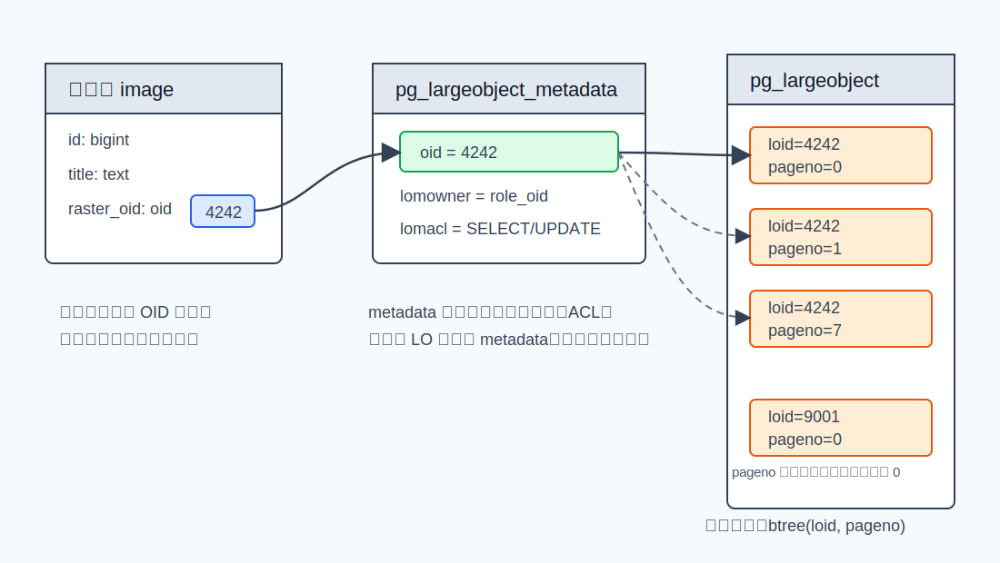
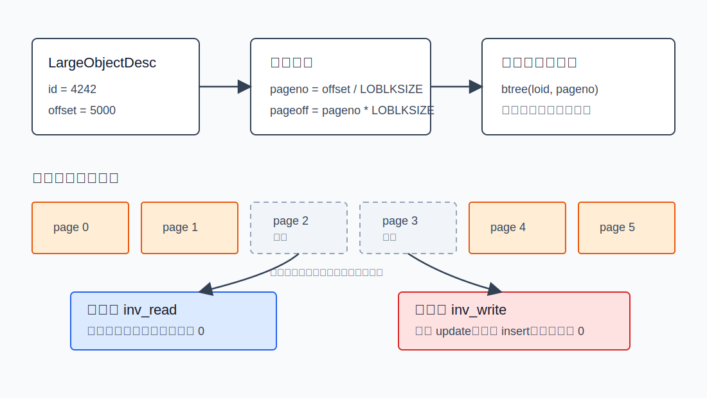
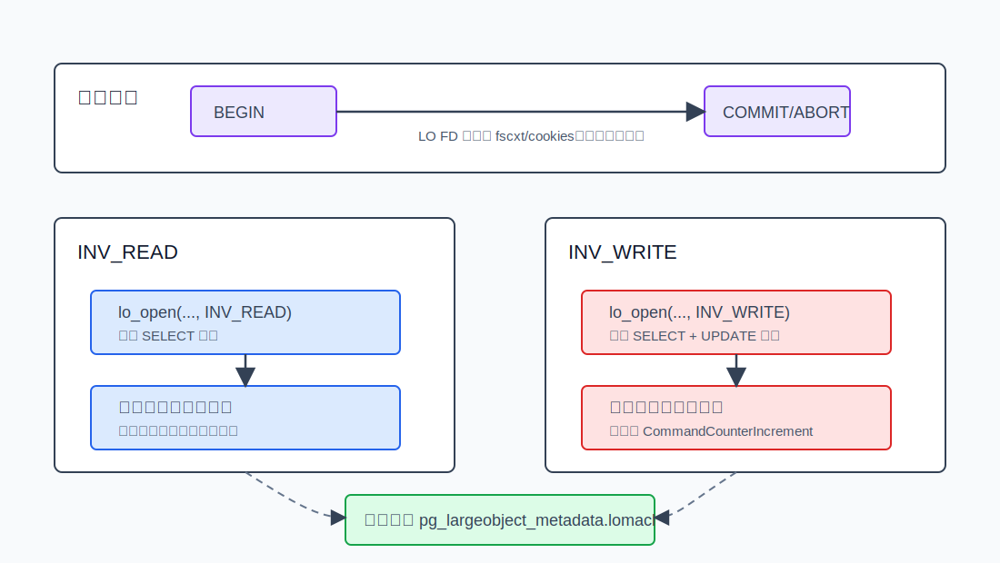
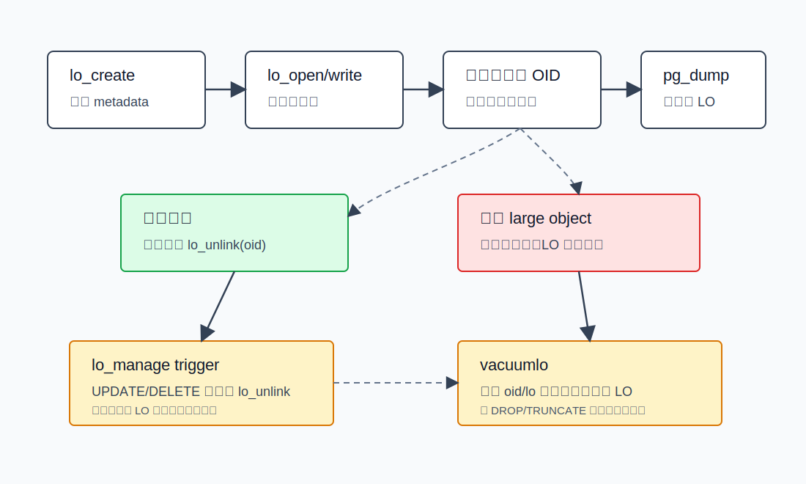
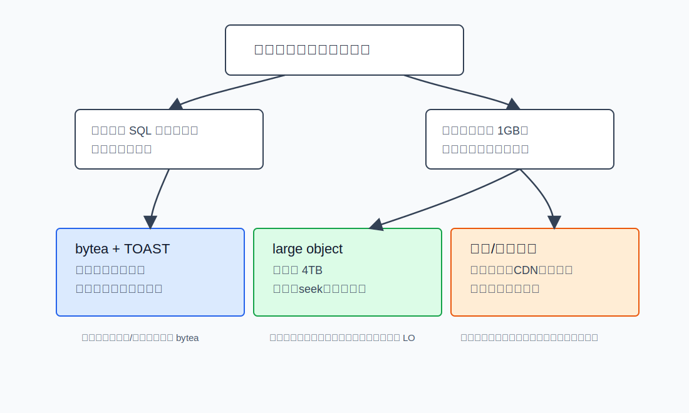

## 数据库筑基课 - PG large object 数据存储结构
                                                                                            
### 作者                                                                
digoal                                                                
                                                                       
### 日期                                                                     
2026-05-25                                                      
                                                                    
### 标签                                                                  
PostgreSQL , 应用开发者 , 数据库筑基课 , 表存储 , Large Object , TOAST , BLOB       
                                                                                           
----                                                                    

## 背景


本节属于“表存储 / 大对象存储 / 应用建模边界”的基础能力。数据库筑基课大纲链接未在输入资料中提供，因此本文从一个很常见的工程问题切入：图片、PDF、影像、合同附件、模型文件、音视频片段，到底应该放在 PostgreSQL 表里，放在 PostgreSQL large object 里，还是放在文件系统或对象存储里？

PostgreSQL 已经有 `bytea` 和 TOAST，为什么还保留 large object？官方文档给出的现代答案很克制：TOAST 让 large object facility 部分过时，但 large object 仍有两个剩余优势：可以到 4 TB 级别，而 TOAST 字段最多 1 GB；并且 large object 支持高效读取和更新部分内容，而多数 TOAST 字段操作会把整个值作为一个单位处理。

这篇文章不把 large object 当成“更大的 bytea”。正确理解是：**PostgreSQL large object 是一个由系统表承载、由 OID 标识、按小页切片、通过类文件 API 访问、受事务和权限控制的大值存储结构。** 它解决了“事务内流式/随机访问大值”的问题，也把“引用治理、孤儿对象、备份恢复、VACUUM 膨胀、权限和应用 API”这些成本交给了使用者。

资料说明：用户给出的论文题名中，`The Design of the POSTGRES Storage System`、`To Blob or Not to Blob: Large Object Storage in a Database or a File System?` 和 Berkeley 的 `Large Object Support in POSTGRES` 可定位到公开资料；`An Inversion Extensible Storage System` 与 `Managing Large Objects in Relational Databases: Storage and Retrieval Optimizations` 未定位到可核验的精确公开版本。本文只把无法核验的题名当作研究方向线索，不把它们作为结论依据。

## 一、它解决什么问题？

PostgreSQL 普通表行有页面边界，TOAST 能把大字段拆出去，但它的抽象仍然是“一个字段值”。如果业务只是保存一个几 MB 的 JSON、文本、图片缩略图，然后整体读写，`bytea`/`text` 加 TOAST 通常更简单。

large object 解决的是另一类问题：

- **值很大：** 需要超过 TOAST 字段 1 GB 上限，或者希望用一个稳定 OID 表示大值。
- **访问方式像文件：** 应用希望 `open/read/write/seek/truncate/close`，而不是每次把整个值取出再写回。
- **只改一段：** 例如从偏移量开始写一段二进制，或者只读取某个范围。
- **事务语义仍重要：** 大对象数据页仍在数据库系统表里，受 PostgreSQL MVCC、WAL、权限、备份恢复体系约束。

代价也直接：

- 业务表通常只保存 LO 的 OID。数据库不会因为业务行被删除就自动删除 large object。
- 所有 large object 数据集中进入 `pg_largeobject`，可能形成系统表膨胀和 autovacuum 压力。
- 访问 API 比 `bytea` 更重，客户端和服务端函数的语义有差异。
- 对象存储/CDN/文件系统在超大静态媒体分发上通常更合适。

## 二、它是什么？

PostgreSQL large object 有三层模型：

1. **逻辑层：** 一个 large object 由一个 OID 标识。业务表如果要引用它，通常保存这个 OID，或者使用 `contrib/lo` 提供的 `lo` domain。
2. **元数据层：** `pg_largeobject_metadata` 保存 large object 的 `oid`、`lomowner`、`lomacl`。
3. **数据层：** `pg_largeobject` 保存数据页。主键索引是 `btree(loid, pageno)`，每个 `(loid, pageno)` 行保存一个 `bytea data` 分片。

`LOBLKSIZE` 定义每个 LO 数据页最多保存多少字节。当前源码里它是 `BLCKSZ / 4`，典型 8 KB block 下是 2 KB。源码注释给出这个选择的几个动机：减少更新单个 page tuple 时的空间浪费；足够大以触发 tuple toaster 尝试内联压缩；保持 2 的幂，贴近客户端按 2 的幂分块写入的习惯。改变 `LOBLKSIZE` 需要 `initdb`。



图 1 说明：业务表并不直接嵌入 large object 内容，而是保存 OID。`pg_largeobject_metadata` 负责对象存在性、所有者和 ACL；`pg_largeobject` 按 `(loid, pageno)` 保存实际数据页。一个 LO 可以没有任何数据页，这表示大小为 0 的对象。

## 三、核心原理

### 1. 创建：先有 metadata，后有数据页

`lo_create()`/`lo_creat()` 最终进入服务端 `be_lo_create()`/`be_lo_creat()`，再调用 `inv_create()`。`inv_create()` 又调用 `LargeObjectCreate()`，在 `pg_largeobject_metadata` 插入一行。源码注释说得很清楚：创建一个新的 large object 时，先插入 metadata，不插入数据页，因此对象以 0 字节大小存在。

关键源码：

- `postgres/src/backend/libpq/be-fsstubs.c`
- `postgres/src/backend/storage/large_object/inv_api.c`
- `postgres/src/backend/catalog/pg_largeobject.c`

这意味着 large object 的“存在”不取决于 `pg_largeobject` 里是否已有数据页，而取决于 `pg_largeobject_metadata` 是否存在对应 OID。

### 2. 数据布局：小页分片 + B-tree 定位

`pg_largeobject` 的列非常少：

| 列 | 类型 | 含义 |
|---|---|---|
| `loid` | `oid` | large object 标识，引用 `pg_largeobject_metadata.oid` |
| `pageno` | `int4` | 对象内页号，从 0 开始 |
| `data` | `bytea` | 该页实际数据，长度不超过 `LOBLKSIZE` |

官方文档和源码都说明：每一行保存从 `pageno * LOBLKSIZE` 开始的一页数据。`pageno` 不要求连续，某些页可以缺失；页本身也可以短于 `LOBLKSIZE`，即使它不是最后一页。读取缺失区间时返回零字节，这一点和 Unix sparse file 的行为相似。

### 3. 读路径：从 offset 算页号，缺页补零

`inv_read()` 的核心步骤可以简化为：

```text
pageno = current_offset / LOBLKSIZE
通过 btree(loid, pageno) 从目标页开始顺序扫描
如果下一条 pageoff 大于当前 offset，说明中间有洞，向结果缓冲区填 0
如果当前页有数据，从页内偏移复制到调用者缓冲区
推进 LargeObjectDesc.offset
```

这个设计的效果是：随机读取不用扫描整个对象，只要从目标 `pageno` 开始通过索引向后取页；稀疏区不占真实数据页，但读语义完整。

### 4. 写路径：旧页 update，新页 insert，页内洞补零

`inv_write()` 也先根据 `offset` 算目标页号，再顺序扫描已有页：

- 如果目标 `(loid, pageno)` 已存在，就把旧 `data` 取出，必要时把页内空洞补零，然后用新数据覆盖对应片段，最后更新该系统表 tuple。
- 如果目标页不存在，就构造新 `pg_largeobject` tuple；如果写入不是从页首开始，页首到偏移量之间补零。
- 写入跨页时循环处理，每页最多写 `LOBLKSIZE` 字节。



图 2 说明：large object 的随机读写能力来自 `(loid, pageno)` 索引和固定逻辑页号。稀疏页不会提前物化；读到空洞时补零，写到空洞中间时只物化被写入覆盖的页和必要的页内零填充。

### 5. truncate：缩短要删尾页，扩展要制造逻辑结尾

`inv_truncate()` 处理两个方向：

- **缩短：** 找到截断点所在页，缩短页内 `data`，并删除其后的所有页。
- **扩展：** 如果截断点超过当前对象大小，且落在一个洞里，源码会插入一个新页来标记对象新的逻辑末尾；空白区域读出来仍然是零。

这解释了一个容易误解的点：large object 的大小不是简单地 `count(*) * LOBLKSIZE`。源码里的 `inv_getsize()` 是反向扫描该 `loid` 最后一页，计算 `last_pageno * LOBLKSIZE + last_page_len`。

### 6. 描述符、快照和事务边界

PostgreSQL large object API 模仿 Unix 文件接口，但 LO descriptor 不是操作系统 fd。服务端 `be-fsstubs.c` 用 `cookies` 数组保存 `LargeObjectDesc *`，每个元素就是一个 large object descriptor。文档明确要求：large object 操作必须在 SQL 事务块中执行，因为 descriptor 只在当前事务期间有效。

`LargeObjectDesc` 里最关键的字段是：

| 字段 | 作用 |
|---|---|
| `id` | large object OID |
| `snapshot` | 读写使用的快照 |
| `subid` | 打开 descriptor 的子事务 |
| `offset` | 当前 seek 指针 |
| `flags` | 是否以读/写模式打开 |

读写快照语义也有差异：

- 只用 `INV_READ` 打开时，descriptor 绑定打开时的活动快照，后续读取按这个快照看对象。
- 用 `INV_WRITE` 打开时，服务端历史上允许同时读取；读取会反映其他已提交事务和当前事务写入的内容，类似 ordinary SQL 在 `READ COMMITTED` 下的行为。
- 写入、truncate、create、unlink 都会阻止只读事务中的修改。



图 3 说明：large object descriptor 的生命周期和事务绑定。只读打开保存打开时快照；写打开走当前可见性并要求写权限。事务结束时，`AtEOXact_LargeObject()` 清理 descriptor、私有内存上下文和 relation 引用。

### 7. 权限：从 PostgreSQL 9.0 开始不再公开可读

现代 PostgreSQL 的 large object 权限保存在 `pg_largeobject_metadata.lomacl`。打开对象时检查权限：

- `SELECT` 权限用于读取。
- `UPDATE` 权限用于写入或 truncate。
- owner 或 superuser 才能删除、注释或改 owner。

源码 `pg_largeobject_aclmask_snapshot()` 会读取 `pg_largeobject_metadata`，按 ACL 判断权限。当前 master 源码还包含 `pg_read_all_data` 和 `pg_write_all_data` 角色对 large object 的读写授权逻辑；如果面向稳定版本部署，要以对应版本官方文档为准。

### 8. 删除和孤儿对象：OID 引用不是外键

`lo_unlink()` 最终调用 `inv_drop()`，通过 dependency 机制删除 large object，再在 `LargeObjectDrop()` 中删除 metadata 和所有数据页。

但业务表中的 OID 引用不是强引用。`DELETE FROM image WHERE id = ...` 只会删除业务行，不会自动 `lo_unlink(raster_oid)`。这就是 large object 最常见的工程坑：孤儿对象留在 `pg_largeobject_metadata` 和 `pg_largeobject` 里继续占空间。

PostgreSQL 提供两个辅助工具：

- `contrib/lo` 的 `lo_manage` trigger：在 `UPDATE`/`DELETE` 时对旧 OID 调用 `lo_unlink()`。它假设每个 large object 只有一个业务引用。
- `vacuumlo`：扫描数据库中所有 `oid` 或 `lo` 类型列，找出未被引用的 large object 并删除。它是兜底工具，不是替代建模设计。



图 4 说明：large object 的生命周期分成数据库对象生命周期和业务引用生命周期。创建、写入和删除 LO 都是数据库对象操作；业务表保存 OID 只是应用层引用。删除业务行如果没有触发器或显式 `lo_unlink()`，就会留下孤儿对象。

## 四、横向对比

| 维度 | `bytea` + TOAST | PostgreSQL large object | 文件系统 / 对象存储 |
|---|---|---|---|
| 主要目标 | 把大字段作为一列保存 | 事务内流式/随机访问大值 | 低成本保存和分发大文件 |
| 访问方式 | SQL 字段整体读写为主 | `open/read/write/seek/truncate` 类文件 API | 文件或 HTTP/object API |
| 大小上限 | 单字段最多约 1 GB | 典型上限约 4 TB | 取决于外部系统 |
| 局部读写 | 不擅长，多数操作按整体值 | 擅长，按 offset 和 pageno 访问 | 擅长，但事务语义在外部 |
| 事务一致性 | 跟随业务行 | 在数据库内受事务保护 | 需要应用设计补偿、幂等或 outbox |
| 引用治理 | 跟随行生命周期 | OID 不是外键，容易有孤儿对象 | URL/key 引用也需要治理 |
| 备份恢复 | 普通表数据 | `pg_dump` 默认包含数据 dump 时包含 LO，可用开关控制 | 数据库备份和对象备份通常分离 |
| 运维压力 | TOAST 表膨胀和 autovacuum | `pg_largeobject` 集中膨胀、vacuumlo、ACL | 外部权限、生命周期、跨系统一致性 |
| 适合场景 | 小到中等大字段，整体读写 | 超过 1 GB、需要流式或局部随机访问 | 超大静态媒体、CDN 分发、低成本归档 |
| 不适合场景 | 频繁局部改写超大值 | 简单字段、无人治理 OID 生命周期 | 必须和 SQL 事务强一致的内容 |

`To BLOB or Not To BLOB` 的经验结论是一个有用提醒，而不是 PostgreSQL 的绝对规则：小对象放数据库通常管理简单，大对象放文件系统通常更高效，中间区域取决于读写比例和覆盖更新频率。这篇论文基于 SQL Server 2005 与 NTFS 的测试，不应直接当成 PostgreSQL 的性能数字；但它提出的工程判断维度仍然成立：对象大小、读写比例、覆盖更新、碎片、备份恢复和运维复杂度。



图 5 说明：选择存储位置时不要只问“能不能存”。先问访问语义：是否跟随业务行整体读写，是否超过 1 GB，是否需要事务内 seek/局部读写，是否要走 CDN 和对象生命周期管理。large object 是中间方案，不是所有二进制文件的默认归宿。

## 五、效果如何？

large object 的收益来自固定页号和索引定位：

- **随机访问：** `pageno = offset / LOBLKSIZE`，通过 `btree(loid, pageno)` 找到目标页，适合按 offset 读写。
- **稀疏存储：** 未写过的页不占 `pg_largeobject` 行，读取时补零。
- **流式接口：** libpq 提供 `lo_read`/`lo_write`/`lo_lseek64`/`lo_tell64` 等接口，适合客户端分块传输。
- **事务保护：** 数据页在数据库内，随 PostgreSQL 的提交、回滚、WAL、备份恢复一起管理。

它的成本也来自同一套机制：

- **空间放大：** 每个 2 KB 左右的数据页都是一条系统表 tuple，有 tuple header、line pointer、索引项、WAL、visibility 信息等额外成本。
- **写放大：** 更新一个 LO page 是系统表 tuple update，会产生 MVCC 旧版本和 WAL；频繁覆盖写需要 autovacuum 回收。
- **集中热点：** 所有对象数据都在 `pg_largeobject`，大量对象会把系统表变成运维重点。
- **清理外包给应用：** OID 引用不是外键，业务删除不会自动释放 LO。

所以 large object 的性能优势不是“比文件系统快”，而是“在数据库事务边界内，提供比整值字段更适合局部访问的大对象接口”。

## 六、实操 DEMO

以下 SQL 来自 PostgreSQL 文档和回归测试语义整理。本环境没有启动 PostgreSQL 实例，因此示例未在本次任务中执行；语法以 PostgreSQL 当前 large object 文档和 `postgres/src/test/regress/sql/largeobject.sql` 为依据。

### 1. 创建、写入、读取片段、关闭

```sql
BEGIN;

CREATE TABLE image_store (
    id bigint GENERATED ALWAYS AS IDENTITY PRIMARY KEY,
    title text NOT NULL,
    raster_oid oid NOT NULL
);

WITH new_lo AS (
    SELECT lo_create(0) AS oid
)
INSERT INTO image_store(title, raster_oid)
SELECT 'demo', oid FROM new_lo;

WITH opened AS (
    SELECT lo_open(raster_oid, x'20000'::int | x'40000'::int) AS fd
    FROM image_store
    WHERE title = 'demo'
),
written AS (
    SELECT fd,
           lowrite(fd, decode('48656c6c6f20504f535447524553', 'hex')) AS bytes_written
    FROM opened
),
closed AS (
    SELECT bytes_written,
           lo_close(fd) AS close_result
    FROM written
)
SELECT bytes_written, close_result
FROM closed;

WITH opened AS (
    SELECT lo_open(raster_oid, x'40000'::int) AS fd
    FROM image_store
    WHERE title = 'demo'
),
pos AS (
    SELECT lo_lseek(fd, 6, 0) AS ignored_pos, fd
    FROM opened
),
read_part AS (
    SELECT fd,
           loread(fd, 8) AS fragment
    FROM pos
),
closed AS (
    SELECT fragment,
           lo_close(fd) AS close_result
    FROM read_part
)
SELECT fragment, close_result
FROM closed;

COMMIT;
```

说明：

- `x'40000'::int` 是回归测试里使用的 `INV_READ`。
- `x'20000'::int` 是回归测试里使用的 `INV_WRITE`。
- 实际应用用 libpq 时应包含 `libpq/libpq-fs.h`，直接使用 `INV_READ`/`INV_WRITE` 常量。

### 2. 查看物理页分布

```sql
SELECT loid,
       pageno,
       length(data) AS bytes_in_page
FROM pg_largeobject
WHERE loid = (SELECT raster_oid FROM image_store WHERE title = 'demo')
ORDER BY pageno;
```

这个查询是学习和诊断用的。应用程序不应该绕过 large object API 直接修改 `pg_largeobject`。

### 3. 删除业务行时同步删除 large object

显式做法：

```sql
BEGIN;

WITH victim AS (
    DELETE FROM image_store
    WHERE id = 1
    RETURNING raster_oid
)
SELECT lo_unlink(raster_oid)
FROM victim;

COMMIT;
```

如果使用 `contrib/lo`，可以让 trigger 帮忙删除旧引用，但必须确认每个 LO 只有一个业务引用：

```sql
CREATE EXTENSION lo;

CREATE TABLE image_with_lo (
    id bigint GENERATED ALWAYS AS IDENTITY PRIMARY KEY,
    title text NOT NULL,
    raster lo NOT NULL
);

CREATE TRIGGER image_with_lo_cleanup
BEFORE UPDATE OR DELETE ON image_with_lo
FOR EACH ROW EXECUTE FUNCTION lo_manage(raster);
```

### 4. 兜底清理孤儿对象

```bash
vacuumlo --dry-run --verbose mydb
vacuumlo --limit=1000 mydb
```

`vacuumlo` 会把所有 large object OID 放入临时表，再扫描数据库中 `oid` 或 `lo` 类型列，把仍被引用的 OID 去掉，剩下的就是孤儿对象。注意：它不会识别 domain over `oid` 这类自定义包装。

## 七、最佳实践

### 数据库架构师

- 默认用 `bytea`/`text` + TOAST 处理中小型字段，只有在超过 1 GB、必须流式/局部访问、或已有客户端 large object API 依赖时再选 LO。
- 业务表保存 LO OID 时，把“谁负责删除 LO”写进模型，不要留给事后巡检。
- 如果同一个 LO 可能被多行共享，不要使用 `lo_manage` 自动删除；需要引用计数表、唯一引用约束或应用层生命周期协议。
- 超大静态媒体优先考虑对象存储，只把 metadata、URL/key、hash、状态机和一致性补偿记录放在 PostgreSQL。

### DBA

- 监控 `pg_largeobject`、`pg_largeobject_metadata` 的大小、dead tuple、autovacuum、WAL 量和备份耗时。
- 备份时确认 `pg_dump` 策略是否包含 large objects；带 schema/table 过滤时，large object 属于非 schema 对象，需要理解 `--large-objects`/`--no-large-objects` 的影响。
- 定期用 `vacuumlo --dry-run` 评估孤儿对象风险，再安排低峰清理。
- 对高频覆盖写 LO 的库，关注 `pg_largeobject` 膨胀。必要时拆分业务、改为外部对象存储，或改写为追加式对象版本。

### 业务开发者

- 所有 large object descriptor 都放在事务里使用；不要把 fd 存到事务外复用。
- 客户端分块传输，不要一次性把超大对象读进应用内存。
- 使用 `lo_import`/`lo_export` 时区分客户端 libpq 函数和服务端 SQL 函数。服务端函数读写的是服务器文件系统，权限风险更高。
- 删除业务记录时同步 `lo_unlink()`，并给失败场景设计补偿任务。

## 八、适合与不适合场景

适合：

- 医学影像、工程图、模型文件等单对象可能超过 1 GB，且需要按 offset 读取片段。
- 应用已经用 libpq/JDBC/ODBC 的 large object 流式接口，迁移成本高。
- 需要把大对象写入和业务 metadata 变更放在同一个 PostgreSQL 事务里。
- 需要在数据库权限体系内控制对象读写，而不是独立对象存储 ACL。

不适合：

- Web 图片、视频、下载文件这类以 CDN 分发为主的静态媒体。
- 对象生命周期没人负责，只是“先把文件塞进数据库”。
- 频繁小范围覆盖写且对象数量巨大，导致 `pg_largeobject` 长期膨胀。
- 只需要保存几十 KB 到几十 MB 的字段，并且主要整体读写。此时 `bytea`/TOAST 通常更简单。

## 九、常见坑

- **把 OID 当外键。** `oid` 引用不会自动级联删除 LO。需要显式 `lo_unlink()`、`lo_manage` 或后台清理。
- **忘记事务。** LO descriptor 只在事务内有效。自动提交环境里拆开的 `lo_open`、`lo_read`、`lo_close` 很容易出错。
- **误用服务端 `lo_import`/`lo_export`。** SQL 函数读写服务器文件系统，和 libpq 客户端函数的文件位置不同。
- **忽略权限。** PostgreSQL 9.0 以后 LO 有 owner 和 ACL；读写分别需要 `SELECT`/`UPDATE`。
- **直接改系统表。** 可以查询 `pg_largeobject` 学习布局，但不应直接写它。
- **把 LO 当免费空间。** 每个 LO page 都是系统表 tuple，会产生索引、WAL、MVCC 和 vacuum 成本。
- **备份过滤误判。** 只 dump 某个 schema 或 table 时，large object 的包含规则需要单独确认。

## 十、扩展问题

1. 如果把 `LOBLKSIZE` 从 2 KB 改到更大，随机小写、顺序大写、TOAST 压缩、tuple update 空间浪费会分别怎么变化？为什么源码说改变它需要 `initdb`？
2. 为什么 `pg_largeobject` 使用 `(loid, pageno)` B-tree，而不是每个 LO 一张独立表？这对系统表膨胀、缓存局部性、备份恢复有什么影响？
3. `bytea` 的 TOAST 表也是分片存储，为什么它的应用语义仍然不是文件式随机访问？
4. 如果业务允许同一个文件被多行引用，应该如何设计引用计数或对象版本表，才能避免 `lo_manage` 误删？
5. 对象存储缺少数据库事务，如何用 outbox、状态机、幂等 key、对象 hash 和后台修复任务补齐一致性？

## 十一、扩展阅读

官方文档与源码：

- PostgreSQL 当前文档：[Large Objects - Introduction](https://www.postgresql.org/docs/current/lo-intro.html)
- PostgreSQL 当前文档：[Implementation Features](https://www.postgresql.org/docs/current/lo-implementation.html)
- PostgreSQL 当前文档：[pg_largeobject](https://www.postgresql.org/docs/current/catalog-pg-largeobject.html)
- PostgreSQL 当前文档：[lo - manage large objects](https://www.postgresql.org/docs/current/lo.html)
- PostgreSQL 当前文档：[vacuumlo](https://www.postgresql.org/docs/current/app-vacuumlo.html)
- 本地源码：`postgres/src/include/storage/large_object.h`
- 本地源码：`postgres/src/include/catalog/pg_largeobject.h`
- 本地源码：`postgres/src/include/catalog/pg_largeobject_metadata.h`
- 本地源码：`postgres/src/backend/storage/large_object/inv_api.c`
- 本地源码：`postgres/src/backend/catalog/pg_largeobject.c`
- 本地源码：`postgres/src/backend/libpq/be-fsstubs.c`
- 本地测试：`postgres/src/test/regress/sql/largeobject.sql`
- 本地参考：`postgres/CLAUDE.md`

论文与研究资料：

- Michael Stonebraker, `The Design of the POSTGRES Storage System`, VLDB 1987. <https://www.vldb.org/conf/1987/P289.PDF>
- Michael Stonebraker, Michael Olson, `Large Object Support in POSTGRES`, Berkeley. <https://dsf.berkeley.edu/papers/S2K-93-30.pdf>
- Russell Sears, Catharine van Ingen, Jim Gray, `To BLOB or Not To BLOB: Large Object Storage in a Database or a Filesystem?`, Microsoft Research, 2006. <https://www.microsoft.com/en-us/research/publication/to-blob-or-not-to-blob-large-object-storage-in-a-database-or-a-filesystem/>
- DeepWiki 查询：`postgres/postgres` large object storage structure. <https://deepwiki.com/search/explain-postgresql-large-objec_d4b86de1-bf5a-4a1f-a43c-9eaa8e2c9067>

源码版本：

- 本文核对的本地 PostgreSQL 源码提交：`01a80f062146af1b17b411c35cb8d992c487fa7c`，提交日期 `2026-05-23`。
  
## 附录  
  
1、问 gemini  
```  
PostgreSQL large object 数据存储结构相关的论文、开源项目.
```  
  
2、克隆代码  
```  
git clone --depth 1 https://github.com/postgres/postgres
```  
  
3、启用 codex, 使用 [数据库筑基课 skill](../skills/README.md).  
````
文章标题: 
  数据库筑基课 - PG large object 数据存储结构
项目源码(已克隆到当前项目如下目录中):  
  postgres
论文: 
  The Design of the POSTGRES Storage System
  An Inversion Extensible Storage System
  To Blob or Not to Blob: Large Object Storage in a Database or a File System?
  Managing Large Objects in Relational Databases: Storage and Retrieval Optimizations
项目 deepwiki reponame:  
  postgres/postgres
项目参考信息: 
  postgres/CLAUDE.md
````
  
  
#### [PostgreSQL 解决方案集合](../201706/20170601_02.md "40cff096e9ed7122c512b35d8561d9c8")
  
  
#### [德哥 / digoal's Github - 公益是一辈子的事.](https://github.com/digoal/blog/blob/master/README.md "22709685feb7cab07d30f30387f0a9ae")
  
  
#### [About 德哥](https://github.com/digoal/blog/blob/master/me/readme.md "a37735981e7704886ffd590565582dd0")
  
  

  
