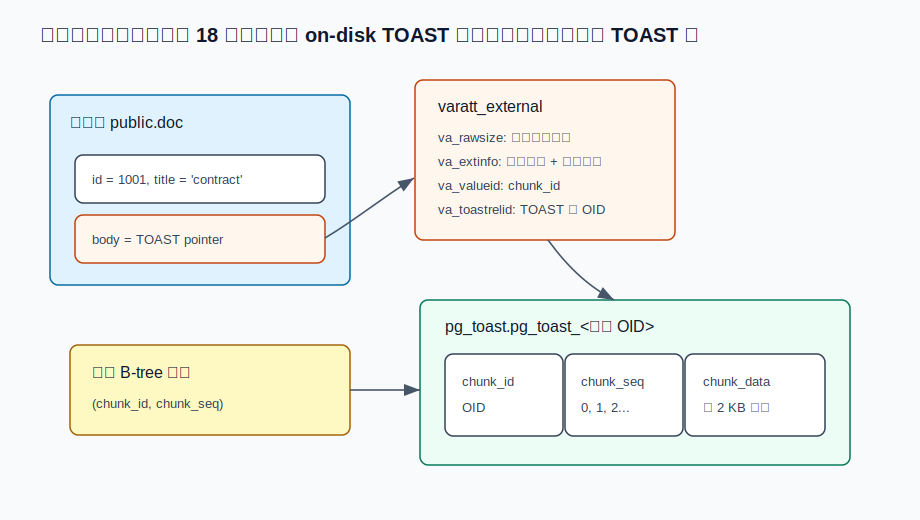
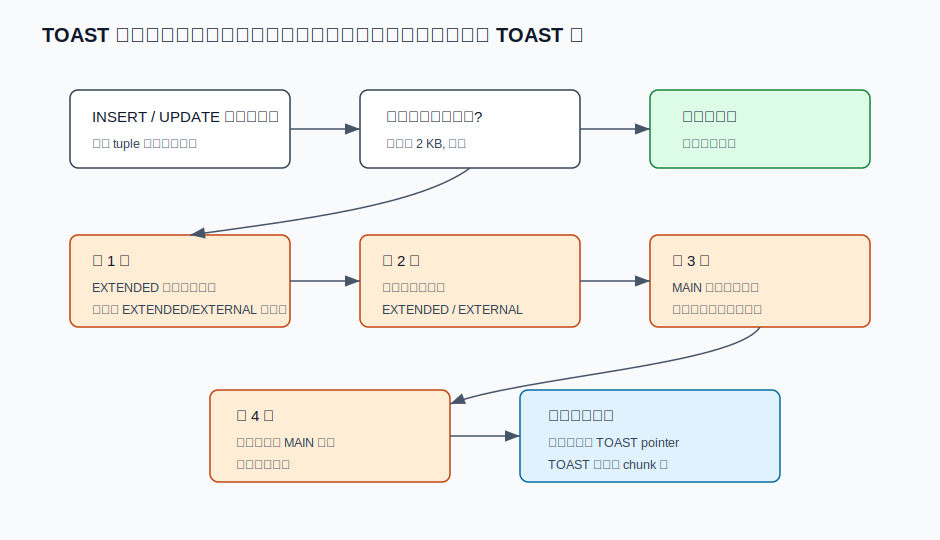
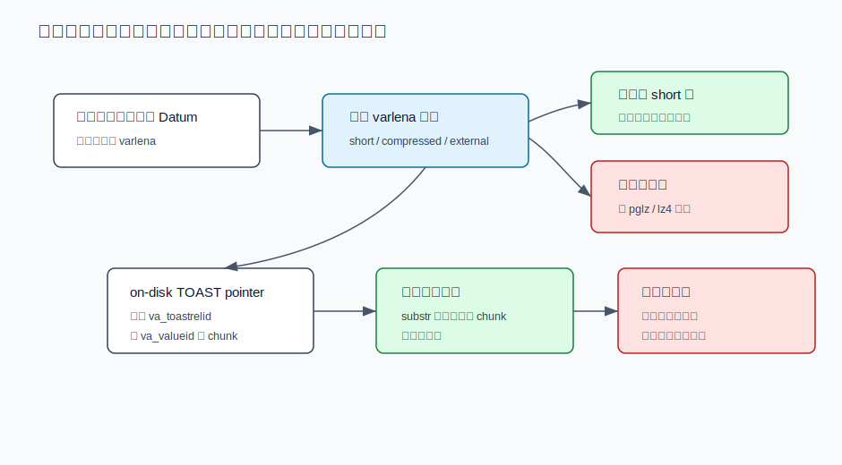
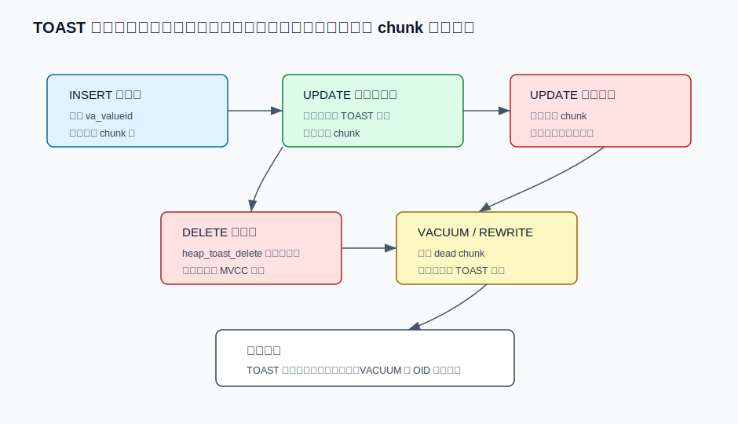
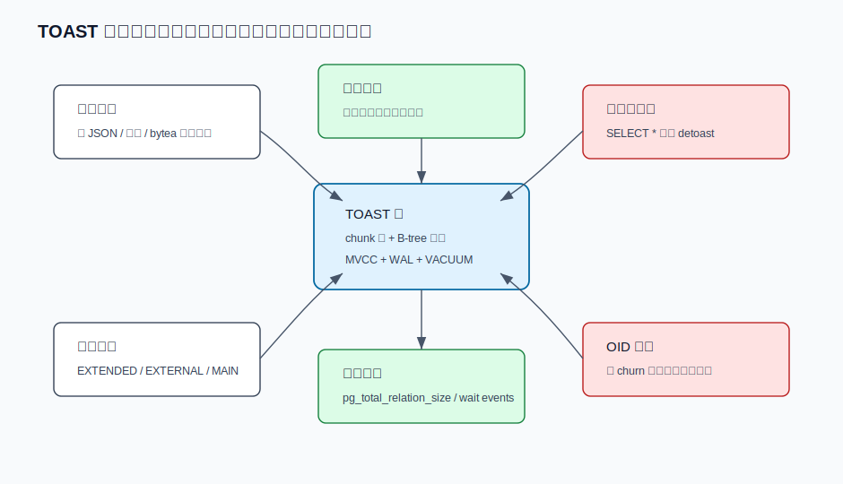

## 数据库筑基课 - PG TOAST 数据存储结构
                                                                                            
### 作者                                                                
digoal                                                                
                                                                       
### 日期                                                                     
2026-05-25                                                      
                                                                    
### 标签                                                                  
PostgreSQL , 应用开发者 , 数据库筑基课 , 表存储 , TOAST , varlena , 压缩 , 大字段   
                                                                                           
----                                                                    

## 背景


本节属于“表存储 / 大字段物理存储 / 运维边界”的基础能力。数据库筑基课大纲链接未在输入资料中提供，因此本文从一个最常见的工程问题切入：业务表里有 `text`、`jsonb`、`bytea`、数组、GIS 几何、文档正文、消息内容、模型输出等大字段，为什么 PostgreSQL 不允许一行自然跨多个 8 KB 页面，却仍然能保存远大于页面的大值？

答案就是 TOAST，The Oversized-Attribute Storage Technique。PostgreSQL 官方文档给出根因：PostgreSQL 使用固定页面大小，常见为 8 KB，并且不允许物理 tuple 跨多个页面；因此大字段不能直接无限放在主表行里。TOAST 把问题改写成：主表行尽量保持短小，大值先压缩，必要时切成小 chunk 存到该表关联的 TOAST 表里，主表只保存一个 on-disk TOAST 指针。

这篇文章不把 TOAST 讲成“自动压缩功能”。更准确的定义是：

**TOAST 是 PostgreSQL heap 表访问方法围绕 varlena 类型实现的一套大字段搬运机制：它用 varlena 头部编码、列级 storage 策略、独立 TOAST 表、chunk 唯一索引、压缩方法和 detoast 读路径，把“行不能跨页”转化为“主表行保存小指针，大值在表外按 chunk 管理”。**

资料说明：用户给出的三篇论文题名中，`Identifying and resolving performance issues caused by TOAST OID contention in Cloud Databases` 对应的公开材料可由 AWS RDS 文档核验；另外两个题名未在本次检索中定位到稳定的一手论文页或本地 PDF。本文把它们作为研究方向线索，关键结论以 PostgreSQL 官方文档、本地源码、DeepWiki 查询结果和 AWS / PostgreSQL Wiki 的可核验资料为准。

## 一、它解决什么问题？

PostgreSQL heap 页面有一个硬约束：一个物理 tuple 不能跨页面。没有 TOAST 时，业务一旦把一个大 JSON、长文本或二进制值塞进行，就会遇到两个问题：

- **物理边界问题：** 单行太宽，页面放不下。
- **缓存效率问题：** 如果每次扫描主表都拖着大字段，哪怕查询只需要小字段，也会浪费 buffer、CPU 和排序内存。
- **压缩时机问题：** 有些值适合压缩，有些已经压缩过的图片、视频、加密数据不适合再压缩。
- **读路径问题：** 有些查询只读 `id, status, created_at`，不应该把正文、附件、向量字段都搬进内存。

TOAST 的工程目标不是让所有大值都“免费”。它实际做了四个交换：

1. 用主表行里的小指针换掉大字段本体，让主表更紧凑。
2. 用压缩 CPU 换空间和 IO。
3. 用 TOAST 表 chunk IO 换主表扫描效率。
4. 用透明机制降低开发复杂度，但把表外 chunk 膨胀、VACUUM、OID 分配和读放大留给运维治理。

所以 TOAST 解决的是“数据库行存储如何承载大字段”的基础问题，不解决“所有文件都应该放数据库”“所有 JSON 都可以无限膨胀”“SELECT * 没代价”这些建模问题。
  
## 二、它是什么？

TOAST 有四层模型。

第一层是 **varlena 表示**。只有可变长类型才有 TOAST 的必要。PostgreSQL 的 `text`、`bytea`、`jsonb`、数组等类型属于这一类。源码 [postgres/src/include/varatt.h](../postgres/src/include/varatt.h) 定义了普通 4 字节长度头、短 varlena 1 字节头、内联压缩格式、on-disk 指针、indirect 指针和 expanded 指针。

第二层是 **列级策略**。`pg_attribute.attstorage` 控制列允许什么存储方式；`attcompression` 控制压缩方法。常见策略是：

| 策略 | 是否允许压缩 | 是否允许外置到 TOAST 表 | 典型含义 |
|---|---:|---:|---|
| `PLAIN` | 否 | 否 | 固定长度或禁止 TOAST 的列 |
| `EXTENDED` | 是 | 是 | 默认主力策略，先压缩，再外置 |
| `EXTERNAL` | 否 | 是 | 不压缩，利于大 `text`/`bytea` 的切片读取 |
| `MAIN` | 是 | 最后手段 | 尽量留在主表，实在放不下才外置 |

第三层是 **TOAST 表**。有 TOAST-able 列的 heap 表会关联一个 TOAST 表，其 OID 记录在 `pg_class.reltoastrelid`。源码 [postgres/src/backend/catalog/toasting.c](../postgres/src/backend/catalog/toasting.c) 创建的 TOAST 表只有 3 列：

| 列 | 类型 | 含义 |
|---|---|---|
| `chunk_id` | `oid` | 某个 TOASTed 值的唯一标识，对应指针里的 `va_valueid` |
| `chunk_seq` | `int4` | 该值内部的 chunk 序号，从 0 开始 |
| `chunk_data` | `bytea` | chunk 的实际字节 |

TOAST 表还有一个唯一 B-tree 索引：`(chunk_id, chunk_seq)`。这个索引既保证同一个值内部 chunk 序号唯一，也让 detoast 可以按 value id 和序号快速重组。

第四层是 **on-disk TOAST 指针**。源码里的 `varatt_external` 包含 4 个字段：

| 字段 | 作用 |
|---|---|
| `va_rawsize` | 原始未压缩 datum 的逻辑大小，包含 varlena 头 |
| `va_extinfo` | 外部存储大小，并用高位记录压缩方法 |
| `va_valueid` | 该值在 TOAST 表里的 `chunk_id` |
| `va_toastrelid` | 该值所在 TOAST 表的 OID |

官方文档说明，算上 varlena 指针头部，一个 on-disk TOAST 指针总大小为 18 字节。这就是“主表行仍能定位表外大值”的根。



图 1 说明：业务表不直接保存完整大字段，而是保存一个可解释的 varlena external 指针。这个指针给出 TOAST 表 OID、值 OID、原始大小、外部存储大小和压缩方法；TOAST 表再用 `(chunk_id, chunk_seq)` 找到所有 chunk。

## 三、核心原理

### 1. 为什么是 1 GB 上限？

PostgreSQL varlena 头部要拿出两个 bit 标记短头、压缩和外部指针等特殊形态。官方文档和 [postgres/src/include/varatt.h](../postgres/src/include/varatt.h) 都说明：这会让 TOAST-able 类型单个 datum 的逻辑大小上限变成 `2^30 - 1` 字节，也就是约 1 GB。

这不是 TOAST 表总大小上限。一个普通表可以有很多 TOASTed 值，TOAST 表本身也可以增长到很多 segment。1 GB 指的是单个 `text`、`bytea`、`jsonb` 等 varlena 值的逻辑上限。

### 2. 什么时候触发 TOAST？

源码 [postgres/src/include/access/heaptoast.h](../postgres/src/include/access/heaptoast.h) 定义了几个关键常量：

- `TOAST_TUPLES_PER_PAGE = 4`
- `TOAST_TUPLE_THRESHOLD`
- `TOAST_TUPLE_TARGET`
- `TOAST_MAX_CHUNK_SIZE`

默认 8 KB block 下，`TOAST_TUPLE_TARGET` 通常约 2 KB。官方文档也说，TOAST 管理代码只在待存储行宽超过阈值时触发，随后压缩或外置字段，直到行宽降到目标以下，或者已经没有收益。

这解释了一个常见误解：不是字段超过 2 KB 就一定外置。TOAST 判断的是整行是否过宽，且会先考虑压缩、列策略、目标行宽和是否真的需要外置。短值即使属于 `text`，也可能完全内联。

### 3. 插入和更新：四轮处理顺序

[postgres/src/backend/access/heap/heaptoast.c](../postgres/src/backend/access/heap/heaptoast.c) 的 `heap_toast_insert_or_update()` 是主流程。代码注释把策略写得很清楚：

1. 先找 `EXTENDED` 列尝试内联压缩；如果某个 `EXTENDED` 或 `EXTERNAL` 列本身仍非常大，立即外置。
2. 如果整行仍超过目标，继续把 `EXTENDED` 或 `EXTERNAL` 列外置。
3. 如果还放不下，再对 `MAIN` 列尝试内联压缩。
4. 最后仍放不下时，才把 `MAIN` 列外置，且使用更宽松的目标。

这个顺序体现了 storage 策略的真实语义：

- `EXTENDED` 是“允许压缩，也允许外置”，所以最灵活。
- `EXTERNAL` 是“允许外置，不压缩”，适合已压缩或需要高效切片的大值。
- `MAIN` 是“尽量留主表”，但不是绝不外置。
- `PLAIN` 是“别动我”，如果行最终仍放不下，插入或更新会失败。



图 2 说明：TOAST 不是一个简单阈值判断，而是一组带优先级的动作。它会根据列策略先压缩、再外置，目标是让主表行回到可接受大小，同时尽量尊重列级存储意图。

### 4. TOAST 表如何保存 chunk？

[postgres/src/backend/access/common/toast_internals.c](../postgres/src/backend/access/common/toast_internals.c) 的 `toast_save_datum()` 负责把一个 datum 保存到 TOAST 表。

关键步骤是：

1. 打开主表关联的 TOAST 表和它的索引。
2. 计算外部存储数据指针、外部大小、原始大小、压缩方法。
3. 为这个 TOASTed 值选择一个未被当前 TOAST 表使用的 OID，写入 `va_valueid`。
4. 按 `TOAST_MAX_CHUNK_SIZE` 循环切片。
5. 每片写一行 `(chunk_id, chunk_seq, chunk_data)`。
6. 为每行插入 TOAST 表索引。
7. 返回一个 on-disk TOAST pointer，替换主表 tuple 里的原始大值。

`TOAST_MAX_CHUNK_SIZE` 默认选择目标是：一个 TOAST chunk tuple 加上 `chunk_id`、`chunk_seq`、tuple header 等开销后，页面里大致能放 4 个 chunk tuple。默认 8 KB block 下，chunk 数据大小约 2 KB。

### 5. 压缩发生在哪里？

压缩由 `toast_compress_datum()` 完成。当前源码支持 `pglz` 和 `lz4` 两类 compression id。`default_toast_compression` 决定没有显式列设置时的默认方法；当前本地文档显示，如果编译支持 LZ4，则默认可为 `lz4`，否则为 `pglz`。具体生产版本需要以对应版本文档和编译选项为准。

压缩有两个边界：

- 压缩失败或收益太小，就不采用压缩结果。源码会检查压缩后是否真正比原始值节省足够空间。
- 已经压缩过的图片、视频、加密块、随机二进制通常收益有限，强行 `EXTENDED` 只会多消耗 CPU。此时 `EXTERNAL` 经常更合理。

### 6. 读取：detoast 不是免费的

大多 SQL 层用户感知不到 TOAST，因为类型函数、输出函数和执行器会在需要时 detoast。源码 [postgres/src/backend/access/common/detoast.c](../postgres/src/backend/access/common/detoast.c) 的读路径可以简化为：

```text
输入 Datum
  如果是普通内联值: 直接用
  如果是 short varlena: 必要时扩成 4 字节头格式
  如果是内联压缩值: 解压
  如果是 on-disk TOAST pointer:
    按 va_toastrelid 打开 TOAST 表
    按 va_valueid 和 chunk_seq 读取 chunk
    如果外部值被压缩: 读取压缩数据后解压
```

切片读取是理解 `EXTERNAL` 的关键。`detoast_attr_slice()` 对未压缩的外置值可以直接调用 `toast_fetch_datum_slice()`，按 offset 只取相关 chunk。对压缩外置值，情况复杂：如果要取前缀，`pglz` 可以估算需要读取多少压缩前缀，LZ4 路径通常需要取更多甚至完整压缩数据；之后仍要解压到目标切片。

这就是官方文档说 `EXTERNAL` 可以让非常大的 `text` / `bytea` 的 substring 更快，但代价是空间更大的原因。



图 3 说明：TOAST 读放大主要发生在“需要大字段内容”的那一刻。未压缩外置值适合切片读取；压缩值通常要先取压缩数据再解压。`SELECT id` 和 `SELECT *` 对宽表的成本可能完全不同。

### 7. 更新和删除：旧 chunk 怎么办？

TOAST 仍然在 PostgreSQL 的 MVCC 和 WAL 体系里。它不是外部对象存储。

官方文档说明，UPDATE 时如果外置字段没有变化，旧的 out-of-line 值通常会被保留和复用，因此这类 UPDATE 不需要重写 TOAST chunks。源码里 `toast_save_datum()` 对 table rewrite 场景也有复用旧 value id 的逻辑，避免把相同旧值复制出多份。

如果大字段发生变化，新行版本会引用新的 TOAST value；旧行版本及旧 TOAST chunks 需要等可见性条件满足后再被清理。DELETE 主表行时，[postgres/src/backend/access/heap/heaptoast.c](../postgres/src/backend/access/heap/heaptoast.c) 的 `heap_toast_delete()` 会进入 `toast_delete_external()`，再通过 [postgres/src/backend/access/common/toast_internals.c](../postgres/src/backend/access/common/toast_internals.c) 的 `toast_delete_datum()` 删除对应外置值 chunk。

注意这里的“删除”也受 MVCC 和事务回滚约束，不等于物理文件立刻变小。TOAST 表和 TOAST 索引一样需要 VACUUM、autovacuum、必要时表重写来治理膨胀。



图 4 说明：TOAST 值有独立的 chunk 生命周期。更新未改大字段时通常可以复用旧指针；更新大字段会产生新 chunk；删除和 VACUUM 才逐步回收旧 chunk。主表行、TOAST 表行和索引项共同构成一次写入的真实成本。

### 8. OID 争用：为什么云数据库会遇到慢 INSERT？

每个外置 TOASTed 值需要一个 `chunk_id` OID。源码 `toast_save_datum()` 在正常路径调用 `GetNewOidWithIndex()`，用 TOAST 表索引检查候选 OID 是否已经存在。

PostgreSQL Wiki 和 AWS RDS 文档指出一个运维边界：OID 是 32-bit 全局计数器，会回绕；如果某个 TOAST 表里已经使用了大量 OID，且存在长连续占用区间，系统在为新 TOAST value 找未使用 OID 时可能反复冲突。表现可能是 INSERT/UPDATE 大字段变慢，并出现 `OidGenLock`、`buffer_io` 等等待，或者日志中出现持续搜索未使用 OID 的信息。

这不是每个 TOAST 表都会遇到的问题。它通常需要几个条件叠加：

- 单表有极高数量的外置大字段值。
- 宽表有多个 TOASTed 列，导致每行可能消耗多个 value OID。
- 高 churn，频繁插入、更新、删除大字段。
- 长期缺乏分区、归档、冷热拆分或表重建。

解决方向不是“关闭 TOAST”，而是把单个 TOAST 表的生命周期和容量边界纳入设计：分区、拆表、归档历史、避免无意义的大字段更新，必要时迁移写入到新表。



图 5 说明：TOAST 是透明机制，但透明不等于没有成本。真正要治理的是数据模型、查询列选择、压缩策略、表膨胀、OID 分配和单表容量边界。

## 四、横向对比

| 维度 | PostgreSQL TOAST | PostgreSQL large object | Oracle LOB / SecureFiles | 外部对象存储 |
|---|---|---|---|---|
| 主要目标 | 让普通表列承载大 varlena 值 | 提供类文件 API 的数据库内大对象 | 面向 LOB 的专门存储与访问能力 | 低成本保存和分发大文件 |
| 应用接口 | 普通 SQL 列，透明 detoast | `lo_*` / large object 函数 | LOB 类型和专用 API | HTTP / SDK / 文件 key |
| 单值上限 | TOAST-able datum 约 1 GB | PostgreSQL LO 可到更大级别 | 取决于 Oracle 版本和 LOB 类型 | 取决于对象存储 |
| 局部读取 | 未压缩 EXTERNAL 对切片较友好 | 支持 seek/read/write | 通常支持 LOB 局部操作 | 支持 range read |
| 局部更新 | 不适合把字段当可原地修改文件 | 更适合随机写 | LOB 专门支持更强 | 需要应用自己保证一致性 |
| 事务一致性 | 跟随主表行 | 数据库内事务对象 | 数据库事务内 | 通常要应用补偿 |
| 存储成本 | 主表小，TOAST 表和索引增加 | 系统表集中管理 LO 页 | LOB segment / index / redo 成本 | 数据库外成本低，但一致性复杂 |
| 运维风险 | detoast 读放大、TOAST 膨胀、OID 争用 | 孤儿 LO、权限、vacuumlo | LOB segment 膨胀和参数复杂 | 跨系统权限、生命周期、备份一致性 |
| 适合场景 | 字段语义仍属于行的一部分 | 超大对象、流式或随机访问 | 强 LOB 需求的 Oracle 应用 | 静态媒体、归档、CDN 分发 |
| 不适合场景 | 频繁局部改写超大文件 | 简单列值、无人治理 OID 引用 | 小字段滥用 LOB | 必须和 SQL 行强事务一致 |

和 Oracle LOB 对比时要避免过度简化。PostgreSQL TOAST 是 heap 行存储的透明扩展，开发者仍然看到一个普通列；Oracle LOB 更像显式的大对象存储能力。和对象存储对比时也要抓住本质：对象存储通常更便宜、更适合分发，但它不在数据库事务里，引用一致性、删除、权限和备份恢复要应用自己设计。

## 五、效果如何？

TOAST 的收益主要来自三点。

第一，主表更小。官方文档给出的设计动机是：如果查询通常靠小 key 过滤，执行器大部分工作可以只处理主表行；大字段只有被选择或函数使用时才拉出来。主表更小意味着更多行能进入 shared buffers，排序、hash、join 中间数据也可能更小。

第二，压缩可以同时降低空间和 IO。`EXTENDED` 默认先压缩，适合长文本、重复结构 JSON、日志消息、可压缩 XML 等数据。

第三，外置 chunk 避免了行跨页设计带来的复杂性。PostgreSQL 保持 heap 页面和 tuple 边界简单，把大值管理放到独立 TOAST 表和索引里。

代价也要直接写清楚：

- 写入一个大字段可能变成多行 TOAST chunk 插入，加上 TOAST 索引写入和 WAL。
- 更新大字段会产生新 chunk，旧 chunk 等待清理，形成写放大和空间放大。
- 读取大字段需要 detoast，可能触发额外表和索引访问。
- 压缩值做切片读取不如未压缩外置值直接。
- `SELECT *`、宽 JSON 频繁解析、函数反复 detoast，会把透明机制变成性能陷阱。
- 单个 TOAST 表的 OID 分配和膨胀可能成为高 churn 大表的隐性瓶颈。

## 六、实操 DEMO

以下 SQL 是最小可验证脚本，用来观察 TOAST 表、chunk、压缩、切片读取和 `toast_tuple_target`。本次没有在本机启动 PostgreSQL 实例执行，因此不提供执行输出，避免伪造结果。

```sql
-- 1. 建一个包含大字段的表
DROP TABLE IF EXISTS toast_demo;
CREATE TABLE toast_demo (
  id bigint GENERATED ALWAYS AS IDENTITY PRIMARY KEY,
  note text,
  payload text
);

-- 2. 强制 payload 更容易外置且不压缩，方便观察 chunk
ALTER TABLE toast_demo ALTER COLUMN payload SET STORAGE EXTERNAL;

-- 3. 插入一个大值
INSERT INTO toast_demo(note, payload)
VALUES ('large text', repeat('0123456789', 2000));

-- 4. 找到主表对应的 TOAST 表
SELECT
  c.oid::regclass AS main_table,
  c.reltoastrelid::regclass AS toast_table,
  pg_relation_size(c.oid) AS main_bytes,
  pg_relation_size(c.reltoastrelid) AS toast_bytes,
  pg_total_relation_size(c.oid) AS total_bytes
FROM pg_class c
WHERE c.oid = 'toast_demo'::regclass;

-- psql 变量，供后续直接查询 TOAST 表
SELECT c.reltoastrelid::regclass AS toast_table
FROM pg_class c
WHERE c.oid = 'toast_demo'::regclass
\gset

-- 5. 查看该列是否有 on-disk TOAST chunk_id
SELECT
  id,
  pg_column_toast_chunk_id(payload) AS payload_chunk_id,
  pg_column_compression(payload) AS payload_compression
FROM toast_demo;

-- 6. 查询 TOAST chunk 数量
SELECT chunk_id, count(*) AS chunks, sum(length(chunk_data)) AS bytes
FROM :toast_table
GROUP BY chunk_id;

-- 7. 比较只读小列和读取大字段的计划
EXPLAIN (ANALYZE, BUFFERS)
SELECT id, note FROM toast_demo WHERE id = 1;

EXPLAIN (ANALYZE, BUFFERS)
SELECT id, length(payload) FROM toast_demo WHERE id = 1;

-- 8. 对未压缩 EXTERNAL 值做切片读取
EXPLAIN (ANALYZE, BUFFERS)
SELECT substr(payload, 5000, 50) FROM toast_demo WHERE id = 1;

-- 9. 调整 toast_tuple_target 只影响新 tuple
ALTER TABLE toast_demo SET (toast_tuple_target = 4096);
INSERT INTO toast_demo(note, payload)
VALUES ('after target change', repeat('abcdefghij', 2000));
```

验证重点不是某个固定数字，而是看这些现象：

- `pg_class.reltoastrelid` 是否指向一个 `pg_toast.pg_toast_*` 表。
- `pg_column_toast_chunk_id(payload)` 是否从 `NULL` 变为某个 OID。
- `pg_relation_size(reltoastrelid)` 是否随着大字段出现而增长。
- `SELECT id, note` 和 `SELECT length(payload)` 的 buffer 行为是否不同。
- `SET STORAGE EXTERNAL` 后 `pg_column_compression(payload)` 是否为空，且切片读取是否避免完整值解压。

## 七、最佳实践

### 面向数据库架构师

1. 不要把 TOAST 当无限列宽。单个 varlena 值约 1 GB 上限，单个 TOAST 表还会面对 OID、VACUUM、索引和膨胀边界。
2. 对宽字段做访问分层。经常过滤、排序、join 的列留在主表；很少读取的大字段可以保留在同表让 TOAST 接管，也可以拆到 1:1 扩展表，取决于查询路径和生命周期。
3. 高 churn 大字段表优先考虑分区。分区能把 TOAST 表拆成多个独立对象，降低单个 TOAST 表容量和 OID 分配压力。
4. 文件分发、图片视频、模型大文件、审计归档不应默认塞入 TOAST。需要事务一致的元数据可在 PostgreSQL，内容本体可放对象存储，用 outbox 或状态机保证跨系统一致性。

### 面向 DBA

1. 监控表总大小时使用 `pg_total_relation_size()`，因为它包含 TOAST 和索引；只看 `pg_relation_size()` 会低估宽表成本。
2. 定期识别 TOAST 大户：

```sql
SELECT
  n.nspname AS schema_name,
  c.relname AS table_name,
  c.reltoastrelid::regclass AS toast_table,
  pg_size_pretty(pg_relation_size(c.oid)) AS main_size,
  pg_size_pretty(pg_relation_size(c.reltoastrelid)) AS toast_size,
  pg_size_pretty(pg_total_relation_size(c.oid)) AS total_size
FROM pg_class c
JOIN pg_namespace n ON n.oid = c.relnamespace
WHERE c.relkind IN ('r', 'm')
  AND c.reltoastrelid <> 0
ORDER BY pg_relation_size(c.reltoastrelid) DESC
LIMIT 20;
```

3. 对 INSERT / UPDATE 大字段偶发慢，要检查是否只发生在触发 TOAST 的语句上，再结合等待事件、日志和 TOAST 表 chunk_id 数量判断是否存在 OID 分配压力。
4. 不要随意手工操作 `pg_toast` 表。TOAST 表是内部实现细节，应用层应该通过主表列、官方函数和维护命令观察。
5. `ALTER TABLE ... SET STORAGE` 和 `SET COMPRESSION` 只影响后续写入或更新，不会自动重写已有行。需要改造已有数据时，要设计可控的批量 UPDATE、重写或分区迁移。

### 面向业务开发者

1. 避免在宽表上写 `SELECT *`。只取需要的列，尤其避免列表页、分页接口、后台任务无意 detoast 大字段。
2. 不要频繁重写大 JSON。哪怕只改 JSON 里一个小属性，数据库也可能需要生成新的大字段值和新的 TOAST chunks。
3. 已压缩二进制数据可考虑 `SET STORAGE EXTERNAL`，减少无效压缩 CPU，并改善切片读取。
4. 对需要频繁局部写的超大对象，不要用 TOAST 字段模拟文件。考虑 PostgreSQL large object、外部对象存储，或重新建模为多行分片表。
5. 索引表达式和触发器里如果调用会 detoast 大字段的函数，要把成本算进写路径。

## 八、适合与不适合场景

适合 TOAST 的场景：

- 行语义上天然包含一个中等大小的大字段，例如文章正文、JSON 配置、消息内容、用户扩展属性。
- 大字段多数时候不参与过滤、排序和 join，只在详情页或后台处理时读取。
- 数据有较好压缩性，例如长文本、重复 JSON、日志、XML。
- 需要数据库事务一致性，且对象大小在单值上限以内。
- 更新大字段频率不高，或更新主要发生在非大字段列。

不适合 TOAST 的场景：

- 大文件、视频、图片原图、模型权重等需要 CDN 分发或对象生命周期治理的内容。
- 对大值做频繁局部随机写，希望像文件一样 seek/write。
- 单表高频插入和更新多个大字段，长期积累数十亿级 TOASTed value。
- 查询经常需要对大 JSON 做深层解析、表达式索引、全文转换，导致反复 detoast。
- 已压缩或随机数据却仍使用默认压缩策略，CPU 换不到空间。

## 九、常见坑

### 坑 1：只看主表大小，以为表很小

`pg_relation_size('t')` 只看主表 fork，不代表总成本。宽表要看：

```sql
SELECT
  pg_size_pretty(pg_relation_size('toast_demo')) AS main_size,
  pg_size_pretty(pg_total_relation_size('toast_demo')) AS total_size;
```

如果 `total_size` 远大于 `main_size`，差额往往来自 TOAST 表和索引。

### 坑 2：以为 `ALTER COLUMN SET STORAGE` 会立即改变旧数据

官方文档明确说，`ALTER TABLE ... SET STORAGE` 只是改变后续更新策略，不会立即改写表中已有值。要让旧值按新策略存储，需要更新这些行，或者通过重写表的方式迁移。

### 坑 3：压缩字段做 substring 仍然慢

未压缩外置值可以只取需要的 chunk。压缩值要先拿到足够的压缩数据并解压，`substr()` 不一定便宜。超大文本若主要做切片读取，`EXTERNAL` 可能比 `EXTENDED` 更合适。

### 坑 4：宽表列表页误用 `SELECT *`

列表页只需要标题、状态、时间，却把正文、附件、JSON 都选出来，等于主动触发 detoast 和网络传输。这个问题经常比 TOAST 本身更致命。

### 坑 5：大 JSON 小改也可能变成大写放大

JSON 是一个 varlena 值。即使业务只改一个字段，数据库最终也要保存新的 JSON 值。对高频局部修改的 JSON，应考虑拆字段、拆表或事件化建模。

### 坑 6：忽略 TOAST OID 压力

极高 churn 的宽表可能在 TOAST value OID 分配上变慢。AWS RDS 文档给出的识别方式包括：只有涉及 TOAST 的 INSERT/UPDATE 慢、等待事件异常、日志出现持续搜索未使用 OID。治理方向通常是清理、归档、写入新表、分区或分片。

## 十、扩展问题

1. 如果你的表有 5 个大 `jsonb` 列，每行可能消耗几个 TOAST value OID？这会怎样影响单表容量边界？
2. 为什么 `EXTERNAL` 可能让 `substr(text)` 更快，却让总存储空间变大？
3. 如果一个查询只过滤小字段，但最终输出大字段，TOAST 成本发生在计划的哪个阶段？
4. PostgreSQL TOAST 和 Oracle LOB 的设计哲学有什么区别？一个是透明列存储扩展，一个是显式大对象能力，这会怎样影响应用 API？
5. 如果把图片放对象存储，把元数据放 PostgreSQL，如何设计删除、重试和事务一致性？
6. 为什么分区不仅影响查询裁剪，也能影响 TOAST 表的 OID 和 VACUUM 边界？

## 十一、扩展阅读

- PostgreSQL 官方文档：[TOAST](https://www.postgresql.org/docs/current/storage-toast.html)
- PostgreSQL 官方文档：[ALTER TABLE ... SET STORAGE / SET COMPRESSION](https://www.postgresql.org/docs/current/sql-altertable.html)
- PostgreSQL 官方文档：[default_toast_compression](https://www.postgresql.org/docs/current/runtime-config-client.html#GUC-DEFAULT-TOAST-COMPRESSION)
- PostgreSQL Wiki：[TOAST](https://wiki.postgresql.org/wiki/TOAST)
- AWS RDS 文档：[Managing TOAST OID contention in Amazon RDS for PostgreSQL](https://docs.aws.amazon.com/AmazonRDS/latest/UserGuide/Appendix.PostgreSQL.CommonDBATasks.TOAST_OID.html)
- DeepWiki：`postgres/postgres` 查询，主题为 PostgreSQL TOAST storage architecture
- 本地源码：[postgres/src/include/varatt.h](../postgres/src/include/varatt.h)
- 本地源码：[postgres/src/include/access/heaptoast.h](../postgres/src/include/access/heaptoast.h)
- 本地源码：[postgres/src/backend/access/heap/heaptoast.c](../postgres/src/backend/access/heap/heaptoast.c)
- 本地源码：[postgres/src/backend/access/common/toast_internals.c](../postgres/src/backend/access/common/toast_internals.c)
- 本地源码：[postgres/src/backend/access/common/detoast.c](../postgres/src/backend/access/common/detoast.c)
- 本地源码：[postgres/src/backend/catalog/toasting.c](../postgres/src/backend/catalog/toasting.c)
- 本地测试：[postgres/src/test/regress/sql/strings.sql](../postgres/src/test/regress/sql/strings.sql)
- 本地测试：[postgres/src/test/regress/sql/vacuum.sql](../postgres/src/test/regress/sql/vacuum.sql)
- 本地测试：[postgres/src/test/regress/sql/misc_functions.sql](../postgres/src/test/regress/sql/misc_functions.sql)
  
## 附录  
  
1、问 gemini  
```  
PostgreSQL TOAST 数据存储结构相关的论文、开源项目.
```  
  
2、克隆代码  
```  
git clone --depth 1 https://github.com/postgres/postgres
```  
  
3、启用 codex, 使用 [数据库筑基课 skill](../skills/README.md).  
````
文章标题: 
  数据库筑基课 - PG TOAST 数据存储结构
项目源码(已克隆到当前项目如下目录中):  
  postgres
论文: 
  The Oversized-Attribute Storage Technique (TOAST) in PostgreSQL: A Comprehensive Technical Analysis
  Research and Comparative Analysis of Approaches to Data Storage Architecture, Hashing, Indexing, and data Compression in Oracle and PostgreSQL
  Identifying and resolving performance issues caused by TOAST OID contention in Cloud Databases
项目 deepwiki reponame:  
  postgres/postgres
项目参考信息: 
  postgres/CLAUDE.md
````
  
  
#### [PostgreSQL 解决方案集合](../201706/20170601_02.md "40cff096e9ed7122c512b35d8561d9c8")
  
  
#### [德哥 / digoal's Github - 公益是一辈子的事.](https://github.com/digoal/blog/blob/master/README.md "22709685feb7cab07d30f30387f0a9ae")
  
  
#### [About 德哥](https://github.com/digoal/blog/blob/master/me/readme.md "a37735981e7704886ffd590565582dd0")
  
  

  
