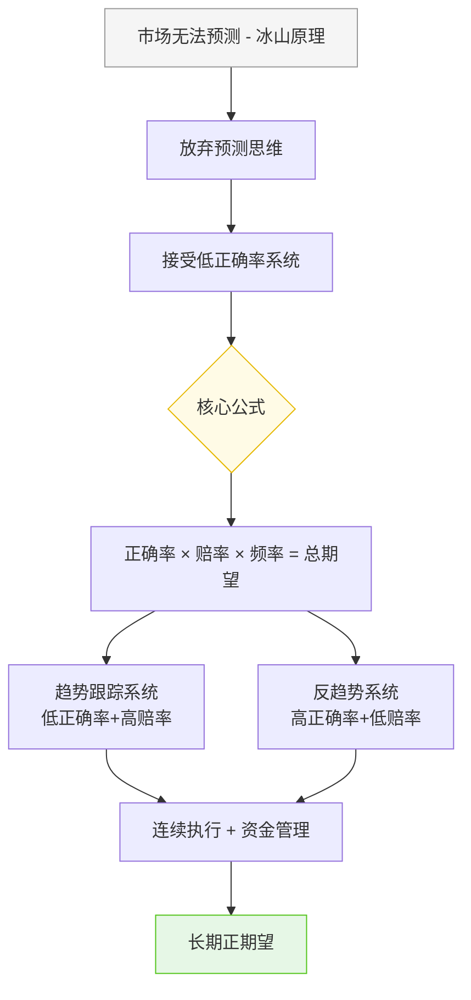

## 《走出幻觉·走向成熟》读书笔记
  
### 作者  
digoal  
  
### 日期  
2026-05-25  
  
### 标签  
读书笔记 , 走出幻觉·走向成熟   
  
----  
  
## 背景  
   
---
书名: 《走出幻觉·走向成熟》   
作者: 金融帝国   
出版年份: 2012   
笔记日期: 2026-05-25   
豆瓣链接: https://book.douban.com/subject/11525290/   
豆瓣评分: 8.4   
标签: [系统交易, 趋势跟踪, 交易哲学, A股, 量化思维]   
---

   

> **一句话**：一个被市场反复毒打的普通人，用十年亏损换来一套让自己与人性和解的交易哲学。   
> **适合谁读**：在股市中亏过钱、还没放弃的人；对技术分析和价值投资都半信半疑的人；想认真思考交易本质的人。   
> **阅读难度**：⭐⭐☆☆☆（文字亲切，逻辑清晰，无需金融专业背景）   
> **推荐指数**：⭐⭐⭐⭐☆   

---

## 一、时代坐标：这本书从哪里来？

2012年，中国A股市场正经历一段漫长的熊市，上证指数在2000点附近徘徊，无数股民在2007年的大牛市和2008年的断崖式下跌中先赚后亏。这是一个"全民炒股"神话破碎的年代——很多人从电视上学来一点技术分析，在论坛上跟着"股神"买入，最终以惨重亏损收场。

作者金融帝国，1982年生于天津，15岁（1997年）就涉足股市。这个时间节点很有意味——那正是中国股市波诡云谲、政策市色彩浓厚的年代。他并非金融科班出身，而是在反复亏损中自学，在一个叫"交易者之家"的论坛上写文章，积累了大量追随者，最终在2008年金融危机中赚到"第一桶金"。

这本书就是这段经历的结晶——不是成功学，而是一份"我曾经这样蠢、这样痛苦、这样走出来"的自白。它写给那些"以为自己不同寻常、却在市场面前撞得头破血流"的普通人。

```
时间轴：金融帝国的交易成长路
┌──────────────┬────────────────────────────────────────┐
│ 1997         │ 15岁，懵懂入市，开始亏损                │
│ 1997-2007    │ 十年摸索：研究基本面、技术面、各类大师  │
│ 2008         │ 金融危机中逆势赚到第一桶金               │
│ 2008-2012    │ 在"交易者之家"论坛分享交易哲学          │
│ 2012         │ 出版《走出幻觉·走向成熟》               │
└──────────────┴────────────────────────────────────────┘
```

---

## 二、核心命题：作者在说什么？

这本书的核心不是教你"怎么选股"，而是要打碎你所有关于市场的幻觉，然后在废墟上重建一套可以持续运行的交易体系。全书有三个相互递进的核心命题：

### 命题一：市场不可预测，但可以被系统性对待

作者用"冰山原理"来解释市场：任何人对市场的分析都是片面的，影响市场的因素无限多，我们只能看到冰山一角。这不是悲观，而是清醒——**既然预测不可靠，就不要赌预测，而要赌概率**。

作者对"大师"毫不留情：基本分析的祖师爷格雷厄姆晚年修正了自己的选股理论；波浪理论的信徒互相数浪数出不同结论；技术指标在不同市场环境下失灵……大师也逃不过市场。接受这一点，比任何技巧都重要。

### 命题二：正确率不是交易系统的核心，赔率才是

这是全书最反直觉、也最有价值的洞见。

大多数人追求"高胜率"——买进就涨，卖出就对。但作者指出，一个正确率只有30%的趋势跟踪系统，完全可以比正确率70%的频繁交易者赚更多钱。原因在于**赔率**：用三次小亏损（每次-3%）换一次大盈利（+30%），数学期望仍然为正。

这就是"超市原理"的核心——超市靠薄利多销，交易者靠少胜多，以小亏损换大利润。作者最精辟的一句话：**"在我看来，股民们大面积亏损的一个最主要原因就是正确率太高了！"** ——正因为频繁止盈、不敢持仓，才把大利润变成小零头。

### 命题三：交易的终点是系统，而非技巧

作者反复强调"道与术"的区分：绝大多数股民穷其一生在学"术"——各种形态、指标、消息——却从未真正想过"道"是什么。而"道"就是：**建立一套符合自己性格、有正期望值、且能长期执行的交易系统，然后不折不扣地执行它**。

系统的核心只有两条：亏损兑现（止损），盈利挂起（持仓）。简单到令人怀疑，难的是执行。

---

## 三、论证地图：作者怎么说服你的？



作者的论证方式有几个特点值得注意：

**大量使用类比**：书中发明了数十个"原理"——冰山原理、树形原理、钟摆效应、鸵鸟现象……这种打比方的方式非常适合自学交易者理解抽象概念，但也带来一个问题：比喻不是证明。这些类比形象生动，却缺乏系统的统计数据支撑。

**个人经历作为论据**：作者的核心证据是自己的交易历史，尤其是2008年金融危机中的成功。这是真实的，但单个样本的说服力有限——一次成功可能是系统有效，也可能是运气使然。

**批判性解构在前，建设性方案在后**：书的前半部分几乎是一场"破坏秀"——把基本分析、技术分析、各路大师逐一解构，直到读者产生"那到底该怎么办"的焦虑。然后在后半部分给出答案：系统交易。这个叙事节奏相当有效。

---

## 四、前提假设与边界：什么情况下这不成立？

这本书的核心逻辑建立在几个假设之上，值得审视：

**假设一：市场存在可持续的趋势**
趋势跟踪系统的前提是市场不是完全随机游走的，而是有一定的动量（涨的还会继续涨一段时间）。这在A股中大部分时候成立，但在极度震荡的市场（比如2015年后的反弹行情）中会频繁止损，系统效率大打折扣。

**假设二：交易者能够做到"不折不扣地执行"**
作者多次强调"一致性"，但恰恰在这里，系统化交易对普通人最难。人类大脑在面对账面亏损时会自动找理由"再等等"，面对账面盈利时会迫不及待止盈。理论上的正确率和现实中的执行效率之间存在巨大鸿沟。

**假设三：个人交易者与机构的信息不对称可以被系统规避**
2012年至今，A股机构化程度大幅提升，量化交易普及，很多曾经有效的趋势规律被套利磨平。书中的很多结论在2012年成立，在今天的市场环境中效果有所打折。

---

## 五、思想谱系：这本书在哪个传统里？

《走出幻觉》在国内的系统交易文献中承上启下。

它的思想来源清晰可见：作者大量引用和讨论了《通往金融王国的自由之路》（范·K·撒普）的框架，尤其是"期望值"和"系统交易"的概念。范·撒普在全书中几乎是隐形的精神导师。更往上追溯，则是海龟交易法则的趋势跟踪传统，以及随机游走假说对市场有效性的讨论。

```
思想谱系
《随机漫步的傻瓜》（塔勒布）── 市场不可预测性
         ↓
《通往金融王国的自由之路》（撒普）── 期望值 + 系统交易
         ↓
《海龟交易法则》── 趋势跟踪的实战化
         ↓
《走出幻觉·走向成熟》── 以上思想的中国化、普及化表达
```

这本书的价值在于：它把以上这些偏学术或偏专业的思想，用中国散户听得懂的语言重新讲述了一遍。这是它豆瓣8.4高分的真正原因——不是因为它有多少原创，而是因为它**让很多中国普通股民第一次真正听懂了"系统化交易"这回事**。

---

## 六、我学到了什么？

读这本书，最大的震动来自"对错悖论"这一节：**对错的评价不应该基于结果，而应该基于原因**。

这句话有多深刻？试想一下：你今天买了一只股票，没有任何理由，只是因为"感觉涨了很多应该继续涨"，结果它真的涨了10%。你做对了吗？按照结果看，对了。按照原因看，你的决策过程毫无依据，下一次同样的操作方式大概率会亏钱。

这让我重新思考"复盘"这件事的本质。大多数人的复盘是"这次赚钱了，我做了什么"或"这次亏钱了，我哪里错了"——**以结果倒推原因**。但这是系统性偏差。正确的复盘应该是：我的决策过程是否符合我预先设定的规则？如果符合，即使亏了，也是"正确"的；如果不符合，即使赚了，也是"错误"的。

第二个收获是对"幻觉"的重新认识。作者说的"幻觉"有两层：一是相信某个方法可以"预测"市场；二是相信通过努力钻研可以找到那个"圣杯"。这两种幻觉在股市中极为普遍，也极为致命。放弃寻找圣杯，转而接受一个"有正期望值的不完美系统"，这是交易成熟的标志。

第三个收获是"盈亏同源"。每一种系统都有它必须承受的成本——趋势跟踪的成本是频繁的小止损和震荡市的折磨；价值投资的成本是可能长达数年的等待和账面亏损。不存在没有成本的盈利方式。**当你想规避某种成本时，往往也在规避与之相生的盈利机会**。

---

## 七、举一反三：这个框架还能用在哪？

系统交易的思维框架远不止适用于股市：

**创业与商业决策**：一家公司不应该用"这个项目赚了多少"来评价决策质量，而应该看"当时的信息和流程是否合理"。用结果评价决策是管理层最常见的认知偏误，它会让团队陷入"赌博式决策"——成功了就推广，失败了就归咎于执行。

**个人职业选择**：每条职业路径都有自己的"正确率"和"赔率"。稳定工作正确率高，赔率低；创业正确率低，但成功的赔率极高。用期望值思维而非"成功概率"思维来做职业选择，会做出更理性的判断。

**学习策略**：大多数人学习追求"理解正确率"——每学一个知识点都要彻底搞懂才往前走。但某些领域（如编程、语言）更适合"先跑起来，允许高错误率，在迭代中修正"的趋势跟踪式学习。

---

## 八、批判与反思

这本书有两个值得商榷的地方：

**第一，过度解构，建设不足**。作者花了大量篇幅论证基本分析和技术分析的局限性，但对于"如何构建适合自己的交易系统"，书中的指导相当抽象。他说"交易系统必定是个性化的"，这是对的，但对一个初学者来说，这句话等于没说。读完这本书你知道该"破"什么，却不太清楚该"立"什么。

**第二，A股特殊性被低估**。A股的政策市特征、散户主导的市场结构、监管层对价格的干预，这些因素使得"趋势跟踪"在中国市场的有效性与成熟市场有所不同。2015年的杠杆牛市和熔断危机，2020年的疫情行情，都有大量"反趋势"的跳跃性变化，纯系统化交易者在这些节点会面临严峻考验。

此外，这本书出版于2012年，距今已超过十年。随着A股机构化程度提升、量化交易普及，书中描述的很多市场规律已有所变化。读者需要用"当时的市场背景"去理解书中的结论，而不是直接套用于今天的市场。

---

## 九、金句与记忆点

**1. "市场是一位狡诈的老师，而交易者是一位愚钝的学生。"**
→ 市场永远会在最意想不到的地方教训你——而且每次学费都很贵。

**2. "为了保护自己的信念，我们只能对一小部分真相视而不见。"**
→ 这是人类认知的基本弱点。每个相信自己系统的人，都在选择性忽略不利证据。

**3. "在我看来，股民们大面积亏损的一个最主要原因就是正确率太高了！"**
→ 频繁止盈是毒药——你把所有的大利润都限制在小盈利里，却让所有的小亏损变成大亏损。

**4. "只要你能够形成观点，那么市场就会打败你的观点。"**
→ 不是说不能有观点，而是不能把交易押注在"我的观点正确"上。

**5. "你只要知道市场如何发展会对大多数人最不利，就等于得到了预知未来的水晶球。"**
→ 市场的"反人性"特质——反常识才是常识。

**6. "做交易是找死，不做交易是等死。"**
→ 这句话的黑色幽默背后，是对交易之难的真诚警告。

**7. "对错的评价不应该基于结果，而应该基于原因。"**
→ 这是整本书最有价值的一句话，适用范围远超交易领域。

---

## 十、延伸阅读

**① 《通往金融王国的自由之路》（范·K·撒普）**
本书的精神来源之一。更系统地阐述了期望值理论和交易系统设计，适合读完本书后深入学习。

**② 《海龟交易法则》（柯蒂斯·费思）**
趋势跟踪交易法的经典案例，用真实的历史数据展示了系统化交易的可行性，是本书理论的最佳实战注脚。

**③ 《随机漫步的傻瓜》（纳西姆·塔勒布）**
从更深的哲学层面讨论随机性、概率与人类认知偏误。读完会对"幸运"和"能力"有全新的理解。

**④ 《非理性繁荣》（罗伯特·席勒）**
站在行为金融学角度解释市场泡沫与投资者心理，是本书"幻觉"主题的学术版延伸。

**⑤ 《股票作手回忆录》（埃德温·勒菲弗）**
经典交易叙事，百年前的股票作手杰西·利弗莫尔的故事，与本书的主题高度共鸣，两本书对照读，感触更深。

---

*笔记写于 2026-05-25 | 基于公开资料与深度思考整理*
  
  
#### [PostgreSQL 解决方案集合](../201706/20170601_02.md "40cff096e9ed7122c512b35d8561d9c8")
  
  
#### [德哥 / digoal's Github - 公益是一辈子的事.](https://github.com/digoal/blog/blob/master/README.md "22709685feb7cab07d30f30387f0a9ae")
  
  
#### [About 德哥](https://github.com/digoal/blog/blob/master/me/readme.md "a37735981e7704886ffd590565582dd0")
  
  

  
