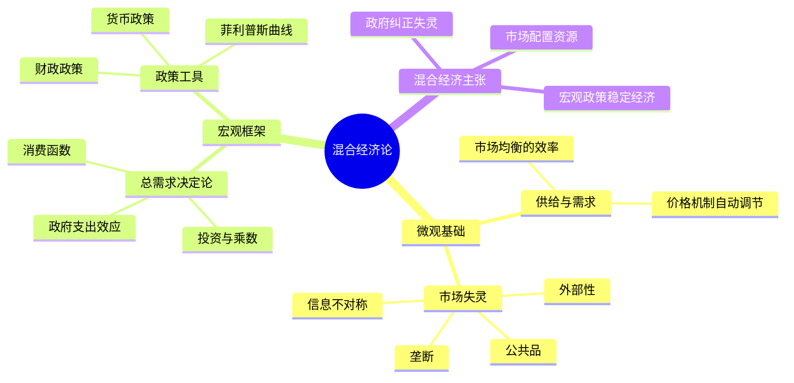
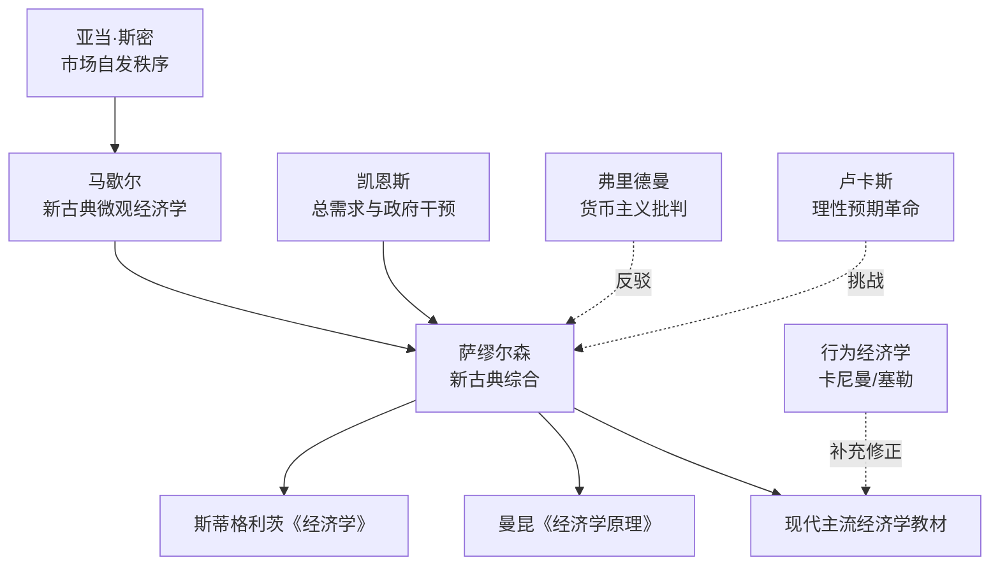

## 《经济学》读书笔记
  
### 作者  
digoal  
  
### 日期  
2026-05-25  
  
### 标签  
读书笔记 , 经济学   
  
----  
  
## 背景  
   
---
书名: 《经济学（第19版）》   
作者: 保罗·萨缪尔森 / 威廉·诺德豪斯   
译者: 萧琛   
出版年份: 2014（原版2010年）   
笔记日期: 2026-05-25   
豆瓣链接: https://book.douban.com/subject/25922243/   
丛书: 最后的宣言译丛   
标签: [经济学, 教科书, 宏观经济, 微观经济, 混合经济, 新古典综合]   
---

   
## ——一个折衷主义者的最后宣言

> **一句话**：这不只是一本教材，而是一位见证了大萧条、凯恩斯革命、冷战、金融危机的老人，对"人类能否驾驭经济"这一问题的毕生答复。   
>   
> **适合谁读**：经济学入门者、想建立系统性经济学框架的人、对"政府与市场"之争感兴趣的思考者   
>   
> **阅读难度**：⭐⭐⭐☆☆   
>   
> **推荐指数**：⭐⭐⭐⭐⭐   

---

## 一、时代坐标：这本书从哪里来？

1948年，一位33岁的麻省理工学院年轻教授出版了一本教材。彼时二战刚刚结束，美国经济在战时政府干预下异乎寻常地强劲，凯恩斯的《通论》出版才十二年，整个西方经济学界正在消化一场思想地震。

那个年代有一个迫切的问题悬在所有经济学家头顶：**大萧条还会回来吗？** 1929年的崩溃让自由放任主义颜面尽失，但苏联式的计划经济又令西方知识界不寒而栗。历史将萨缪尔森推到了那个节点——他既是最早系统掌握凯恩斯思想的美国经济学家之一，又深谙马歇尔以来的新古典传统。于是他做了一件后人看来影响深远的事：把这两套语言翻译成了同一本书。

```
        大萧条 (1929)
            ↓ 旧世界崩塌
        凯恩斯《通论》(1936)
            ↓ 新思想涌现，但晦涩难懂
        萨缪尔森《经济学》第1版 (1948)
            ↓ 为凯恩斯与马歇尔搭建桥梁
        新古典综合诞生
            ↓ 成为战后主流经济学语言
        第19版（2010）：大师绝笔，再度面对金融危机
```

第19版出版于2010年——2008年金融海啸刚刚过去，全球经济仍在震荡。此时的萨缪尔森已是95岁高龄，而且正是在这一版出版后不久，他便与世长辞（2009年12月去世，第19版实为他生前最后参与的版本）。因此这一版被出版方称为**"最后的宣言"**：在亲眼目睹了自大萧条以来最深重的一次金融危机之后，这位折衷主义的现代经济学之父，留下了他对混合经济的最终辩护。

---

## 二、核心命题：作者在说什么？

### 命题一：混合经济是人类迄今最优的经济制度安排

全书围绕一个核心概念展开——**混合经济（Mixed Economy）**。萨缪尔森的"混合"有双重含义：其一，市场机制与政府干预的混合；其二，竞争与垄断的混合。

他不相信纯粹的自由市场，因为历史证明市场会失灵（垄断、外部性、公共品、宏观不稳定）；他也不相信纯粹的计划经济，因为它窒息了效率与创新。他的立场是：**承认市场的基础性作用，同时相信政府的宏观调控能够熨平经济波动、纠正市场失灵**。这在1948年是革命性的，在2010年金融危机后，这个立场再度获得了历史的背书。

### 命题二：新古典综合——微观与宏观可以共存于一个体系

萨缪尔森做了经济学史上第三次伟大的综合（前两次分别是穆勒综合和马歇尔综合）：将**新古典微观经济学**（供需、效用、边际分析、均衡价格）与**凯恩斯宏观经济学**（总需求、乘数效应、财政与货币政策）整合在同一个教材框架下。

这个综合的逻辑是：微观经济学在充分就业的条件下描述资源配置；当经济偏离充分就业时，宏观政策负责把它拉回来。两套工具各司其职，互不矛盾。

### 命题三：经济学是可以科学化的，但不能失去人文关怀

萨缪尔森是将数学引入经济学的关键人物（他的《经济分析的基础》更是数理经济学的奠基之作），但在《经济学》教材里，他刻意保持了叙事的温度。他相信经济学应当服务于人的福祉，效率与公平同等重要。书中对分配问题、贫困问题、环境问题的持续关注，折射出他骨子里的社会民主主义立场。

---

## 三、论证地图：作者怎么说服你的？



**论证方式的三个特点：**

**① 案例驱动，贴近现实。** 萨缪尔森极少用纯抽象推演，而是大量援引真实历史事件（大萧条、二战经济、石油危机、通货膨胀）来说明理论。他的风格被评论者描述为"像一位朋友在和你聊天"，对教材来说极为罕见。

**② 图表先行，直觉优先。** 全书几乎每个重要概念都配有清晰的图形——供需曲线、IS-LM模型、菲利普斯曲线、总供给总需求图——让读者先建立直觉，再深化理解。

**③ 渐进式复杂度。** 从最基础的机会成本出发，逐步推进到货币政策、国际贸易、经济增长，层层递进，极少跳跃。

---

## 四、前提假设与边界：什么情况下这不成立？

萨缪尔森的体系建立在几个关键假设上，理解这些假设的局限，才能真正读懂这本书的价值边界。

**假设一：政府是理性、中立的调控者。**
新古典综合的核心逻辑是"政府能够有效矫正市场失灵"。但公共选择理论（布坎南）指出，政府本身也会失灵——官僚的自利、政治周期扭曲、信息不足，都会让调控事与愿违。萨缪尔森对政府失灵的讨论相对薄弱。

**假设二：微观与宏观可以简单二分。**
斯蒂格利茨等人批评新古典综合"人为割裂了微观基础与宏观分析"——宏观现象（失业、通货膨胀）究竟如何从微观主体的决策中涌现出来，萨缪尔森的体系给出的是一个"条件性答案"，而非统一的分析框架。这也是后来新凯恩斯主义和DSGE模型崛起的原因之一。

**假设三：经济主体行为基本理性。**
行为经济学（卡尼曼、塞勒）的兴起表明，人类决策系统性地偏离理性假设。第19版已经开始纳入行为经济学的部分内容，但整体框架仍以理性人为基础。

**适用边界：** 这本书最适合理解"战后福利国家资本主义"的运行逻辑，对于理解21世纪的平台经济、加密资产、全球化断裂等新议题，需要大量补充阅读。

---

## 五、思想谱系：这本书在哪个传统里？



萨缪尔森处于一个汇流点：他上承马歇尔的新古典传统，横向接纳凯恩斯的宏观革命，并用数学语言为两者搭建了共同的基础。他的影响是双向的——既塑造了此后所有经济学教材的基本框架（微观+宏观的二分结构），也激起了来自货币主义（弗里德曼）和理性预期学派（卢卡斯）的强烈反弹。

可以说，没有萨缪尔森，就没有今天经济学学科的基本面貌。那些反对他的人，也不得不在他建立的语言体系中进行反驳。

---

## 六、我学到了什么？

读这本书最大的收获，不是任何一个具体的经济学概念，而是一种**思考框架的建立方式**。

**收获一：稀缺性与机会成本是一切经济分析的起点。**
"天下没有免费的午餐"——这句话萨缪尔森几乎在每一版都重申。任何资源配置都意味着放弃某种替代用途。这个框架一旦建立，就会像一副眼镜，让你看什么都开始想"代价是什么"。

**收获二：价格机制是人类迄今发明的最复杂的信息处理系统。**
供需曲线背后，是无数个分散决策者在无意识中传递和整合信息。政府用行政价格替代市场价格时，失去的不只是"效率"，而是一个巨大的信息网络。这让我重新理解了为什么价格管制往往会带来意想不到的副作用。

**收获三：宏观经济学本质上是关于"协调失败"的学问。**
萨缪尔森让我理解，衰退不是因为资源消失了，而是因为需求与供给无法在某个时刻自动对接。政府干预的正当性，来自于市场在某些条件下确实无法自我修复——这不是意识形态问题，而是实证问题。

---

## 七、举一反三：这个框架还能用在哪？

萨缪尔森的"混合"思维，其实是一种普适的解决复杂系统问题的方式：**承认两种机制各有其功能边界，通过制度设计让它们互补而非互斥。**

**场景一：企业管理。** 市场机制 vs. 层级组织——科斯的交易成本理论告诉我们，企业的存在本身就是对市场机制的局部替代。什么时候内部化，什么时候外包，正是一种"混合"决策。

**场景二：公共政策设计。** 碳排放交易制度：给市场力量设定一个总量上限（政府划定边界），然后让价格机制在边界内自由运作。这是萨缪尔森混合经济逻辑在环境政策领域的完美应用。

**场景三：个人决策。** 当你在为某个选择纠结时，"机会成本"框架让你意识到问题不是"这个选项好不好"，而是"放弃了什么"。边际思维则提醒你：不要问"要不要做X"，而要问"再多做一点X值不值得"。

---

## 八、批判与反思

这本书的伟大毋庸置疑，但有几处值得保持清醒。

**第一，它的视角高度"美国中心"。** 萨缪尔森的经济学是在美国战后语境中生长的，其政策主张（财政刺激、自由贸易、布雷顿森林体系）高度依赖美国的特殊地位。将这套框架直接套用到发展中经济体，有时候会产生严重误导——这也是"华盛顿共识"后来遭到批评的根源。

**第二，它低估了金融的复杂性。** 尽管第19版已经纳入了对2008年金融危机的讨论，但萨缪尔森体系的整体框架对于金融市场的内生不稳定性（明斯基的"明斯基时刻"）理解不足。金融危机一再证明，市场并不总是自我修正的。

**第三，关于分配的讨论仍然不够。** 全书对效率的分析相当精致，但对分配不平等、财富集中的讨论相对浅薄。而21世纪的核心经济问题，恰恰已经从"如何做大蛋糕"转向"如何分配蛋糕"。皮凯蒂的《21世纪资本论》可以视为对萨缪尔森的重要补充和反驳。

**时代已经变了：** 萨缪尔森的体系建立在相对稳定的民族国家经济框架上，而今天的经济现实是资本高度流动、平台垄断、技术颠覆、气候危机相互交织——这些挑战要求全新的分析工具。

---

## 九、金句与记忆点

> **"天下没有免费的午餐。"**
> ——经济学第零定律。任何好处背后都有代价，只是有时候代价由别人承担，让你产生"免费"的错觉。

> **"经济学家就是那种牢牢抓住显而易见的东西，并且有意识地对它们进行痛苦而深奥的阐述的人。"**
> ——萨缪尔森在诺贝尔演讲中引用的笑话，却是对经济学本质的精准自嘲：把直觉变成逻辑，把常识变成科学。

> **"市场就是一台精妙的计算机，它不需要中央指挥，却能协调数百万人的决策。"**
> ——这句话的背面是：一旦价格信号被扭曲，这台计算机就会输出错误结果。

> **"在长期，我们都死了。"**（引自凯恩斯，萨缪尔森深度认同）
> ——这不是玩世不恭，而是对短期政策必要性的辩护：面对衰退，等待市场自我修复的代价，可能是数百万人的失业与苦难。

> **"混合经济的真谛不是折中，而是分工：市场做市场擅长的，政府做市场做不好的。"**
> ——这是萨缪尔森整本书的思想精华，也是他一生立场的总结。

> **"无论怎样夸大萨缪尔森《经济学》对全世界的影响都不过分。"**
> ——《经济学人》杂志，这也许是对一本教材最高的评价。

---

## 十、延伸阅读

**① 约翰·梅纳德·凯恩斯《就业、利息和货币通论》**
萨缪尔森的思想之源。读完《经济学》后再读《通论》，你会理解萨缪尔森做了多大的翻译和简化工作——以及他简化掉了什么。

**② 弥尔顿·弗里德曼《资本主义与自由》**
萨缪尔森最重要的对手。同样是经济学大师，政策立场几乎相反。两本书对读，才能真正理解"政府与市场"之争的深度。

**③ 托马斯·皮凯蒂《21世纪资本论》**
弥补萨缪尔森在分配问题上的不足。用大量历史数据说明资本积累如何导致不平等加剧——这是萨缪尔森的框架难以回答的问题。

**④ 达龙·阿西莫格鲁 & 詹姆斯·罗宾逊《国家为什么会失败》**
将经济学的视野扩展到制度层面。萨缪尔森的分析假设制度是既定的，这本书质问：制度本身从哪里来？为什么有些国家的制度天然有利于经济发展？

**⑤ 罗伯特·席勒《非理性繁荣》**
行为经济学对萨缪尔森理性人假设的挑战，以金融市场为切入点。读完后你会对"市场总是正确的"这个命题保持更多怀疑。

---

*笔记写于 2026-05-25 | 基于公开学术资料、书评及深度思考整理*
*本笔记为读书理解与思考，非原文复现*
  
  
#### [PostgreSQL 解决方案集合](../201706/20170601_02.md "40cff096e9ed7122c512b35d8561d9c8")
  
  
#### [德哥 / digoal's Github - 公益是一辈子的事.](https://github.com/digoal/blog/blob/master/README.md "22709685feb7cab07d30f30387f0a9ae")
  
  
#### [About 德哥](https://github.com/digoal/blog/blob/master/me/readme.md "a37735981e7704886ffd590565582dd0")
  
  

  
