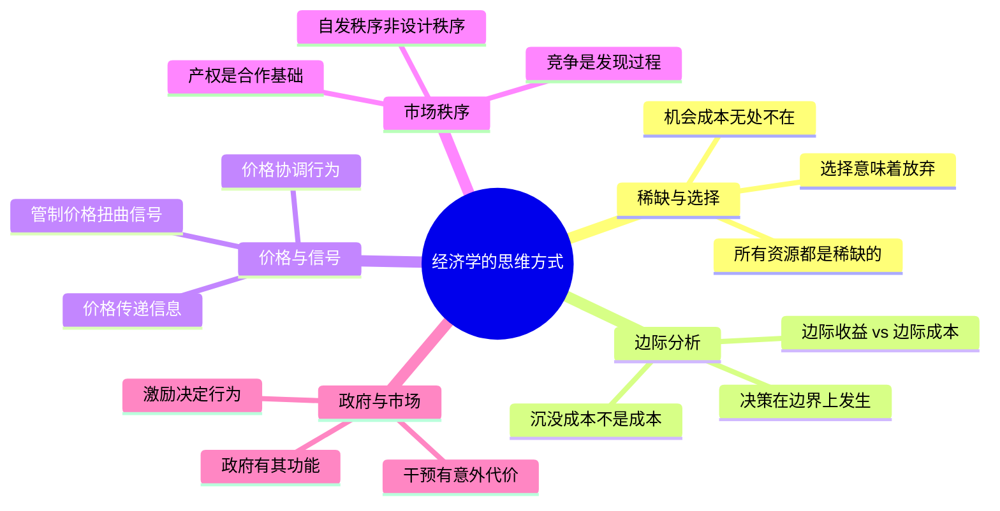

## 《经济学的思维方式》读书笔记
  
### 作者  
digoal  
  
### 日期  
2026-05-25  
  
### 标签  
读书笔记 , 经济学的思维方式   
  
----  
  
## 背景  
   
---
书名: 《经济学的思维方式》（第13版）   
作者: [美] 保罗·海恩 / 彼得·勃特克 / 大卫·普雷契特科   
译者: 鲁冬旭   
出版社: 浙江文艺出版社 / 果麦文化   
出版年份: 2023   
笔记日期: 2025-05-25   
豆瓣ISBN: 9787533970567   
豆瓣评分: 8.5+   
标签: [经济学入门, 思维方式, 市场机制, 奥地利学派, 通识教育]   
---

   

> **一句话**：经济学不是一套公式，而是一副看穿人类行为与社会秩序的眼镜。   
> **适合谁读**：对经济学感兴趣但被公式劝退的普通读者；想用系统框架理解日常决策的人；管理者、政策关注者、任何需要做选择的人（其实是所有人）。   
> **阅读难度**：⭐⭐☆☆☆（无公式，案例丰富，中等阅读量）   
> **推荐指数**：⭐⭐⭐⭐⭐   

---

## 一、时代坐标：这本书从哪里来？

1973年，美国华盛顿大学经济学教授保罗·海恩出版了这本书的第一版。彼时，主流经济学教育深陷数学化的泥潭——满是供需曲线、IS-LM模型和方程组，学生背完考试之后，依然不知道如何用经济学的眼光看报纸头条，更别说理解自己的日常选择。

海恩的叛逆在于：他认为经济学的价值不在于方程，而在于**一种思维方式**。他是芝加哥大学的伦理学与社会学博士，横跨人文与社科的训练让他对"经济学如何误导普通人"有深切的感受。他在华盛顿大学执教25年，据说亲手教过超过15,000名学生，始终坚持用真实生活案例来讲经济原理。

这本书在前苏联解体后的东欧异常畅销——海恩本人多次受邀前往俄罗斯、捷克、波兰、罗马尼亚等地演讲。在那些从计划经济向市场经济转型的社会，人们迫切需要理解"价格是什么""市场如何运作"，而这本书给出的不是政治宣言，而是逻辑清晰的思维工具。

海恩于2000年去世，后续版本由他的学生、乔治·梅森大学的彼得·勃特克（奥地利学派重要学者）与大卫·普雷契特科接手修订，书已更新至第13版，历经50余年仍长销不衰——在教科书领域，这本身就是一个奇迹。

```
1973          1980s-90s           2000           2008         2023
 ↓               ↓                 ↓              ↓             ↓
第1版          持续更新         海恩去世      勃特克接手     第13版中译
出版         在东欧广泛传播    第9版已出     大幅修订       浙江文艺
```

---

## 二、核心命题：作者在说什么？

### 观点一：所有社会现象都源于个体的边际选择

这是全书最底层的逻辑基石。海恩认为，经济学的出发点不是"社会"或"国家"，而是**个体在约束条件下的选择**。

关键在于"**边际**"二字。人们不是在做"要不要吃饭"这种非此即彼的决定，而是在做"再多吃一口值不值"的边际判断。经济学思维拒绝全有或全无，永远在问：**再多一点或再少一点，成本和收益各是什么？**

> 经济分析本质上就是边际分析。边际收益或边际成本就是额外的收益或成本。决策中唯一重要的成本是边际成本，即额外的成本——都是将来的事。

沉没成本不该影响决策，这在逻辑上是清晰的，但在现实中反其道行之是人类最普遍的认知错误之一。海恩用大量案例说明：过去花出去的钱，不能成为"继续"的理由。

### 观点二：价格是信息，不是剥削

这是这本书最有冲击力的观点之一，也最容易引发争议。

在日常语境里，人们常常把高价格理解为"商人贪婪""资本剥削"。但海恩提供了另一种视角：**价格是分散的、无法被中央汇总的信息的载体**。当某种物品价格上涨，它在说："这里有稀缺，请大家重新调整行为"——吸引新的供给进入，同时抑制部分需求，这是价格机制自动完成的"协调"。

没有价格信号，资源如何分配？只能靠权力——而权力的信息处理能力远不如价格机制高效，且容易腐败。这正是海恩不断援引苏联计划经济失败案例的原因：中央计划者没有足够的信息，也没有足够的激励去做出正确的配置决策。

### 观点三：市场是一个发现过程，而非静态均衡

受奥地利学派（尤其是哈耶克）影响，勃特克的加入使这本书更强调**市场作为动态过程**的一面：竞争不是完美信息下的最优均衡，而是企业家不断试错、发现机会、创造价值的过程。

这个观点有深刻的政策含义：如果市场是一个持续发现的过程，那么政府干预往往是在用静态的规则打断一个动态的演化——代价可能远大于人们通常认为的。

---

## 三、论证地图：作者怎么说服你的？



**海恩的论证风格极为独特**：他几乎从不用抽象定义开篇，而是先丢给你一个生活场景——堵车、摇号、医院排队、机票涨价……然后一步步抽丝剥茧，让读者自己"发现"经济学原理。

这种方法有点像苏格拉底：不是告诉你答案，而是让你意识到自己的直觉判断存在漏洞。书里有一句话很有代表性：

> 好的经济学理论不是一些现成的可以用于施政的结论。它不是教条，而是一种方法、一种智力工具、一种思维技巧，有助于拥有它的人得出正确的结论。

**论证的薄弱之处**：书中案例大量来自美国语境（美国的医疗、税收、工会、货币政策），部分章节的结论不能直接移植到其他制度背景。此外，海恩对市场机制的信任几乎达到信仰的程度，这使得他在讨论市场失灵（外部性、公共品、信息不对称）时，处理相对简略，有"急于辩护"之嫌。

---

## 四、前提假设与边界：什么情况下这不成立？

**假设一：人是理性的（或者说，是回应激励的）**

海恩并不假设人是完全理性的计算机，但他假设人会回应激励——价格上涨时人们会减少消费，惩罚增加时人们会改变行为。这个假设在统计意义上大体成立，但行为经济学的研究（卡尼曼、塞勒）已经证明，人类有系统性的认知偏差，会做出"非理性"的选择。

海恩的框架对个体预测力较弱，对群体趋势判断力较强。

**假设二：产权清晰，合同可执行**

全书反复强调产权是市场运作的基础。但在产权模糊（如中国农村土地）、合同执行成本极高（法治薄弱地区）、或产权本身有道德争议（如历史上被剥夺的财产）的情形下，海恩的分析框架会遇到严重的适用性问题。

**假设三：市场失灵是例外而非常态**

海恩倾向于把市场失灵（外部性、垄断、公共品）当作需要特别说明的例外情况，而把市场有效运作当作正常状态。但在某些行业（金融、医疗、平台经济），信息不对称和网络效应可能使"失灵"才是常态。这是书中分析最值得读者保持批判距离的部分。

---

## 五、思想谱系：这本书站在哪个传统里？

```
亚当·斯密（看不见的手）
      ↓
米尔顿·弗里德曼（芝加哥学派）
      ↓
阿尔门·阿尔钦（产权经济学）
      ↓
保罗·海恩《经济学的思维方式》（1973）
      ↑
弗里德里希·哈耶克（自发秩序、知识分散）
      ↑
路德维希·冯·米塞斯（人的行动，奥地利学派）
```

这本书是**芝加哥学派的清晰逻辑**与**奥地利学派的市场过程论**的融合产物。海恩本人更接近芝加哥学派的传统（强调价格信号、效率），但第9版之后勃特克的修订引入了更多奥地利学派色彩（动态市场、企业家精神）。

这使得这本书在意识形态上明显偏向**古典自由主义**：市场是解决稀缺问题的最优机制，政府干预的代价往往被低估。这既是它的思想力量来源，也是读者应保持独立判断的地方。

在中国，张维迎（北大光华）对它推崇备至，梁小民、熊秉元也有高度评价。诺贝尔经济学奖得主道格拉斯·诺斯专门为中文版作序——这足以说明它在专业经济学家眼中的分量。

---

## 六、我学到了什么？

读完这本书，有三个认知变化是真实发生在我身上的：

**第一，"免费"从来不是免费的。** 之前我觉得公费医疗、免费停车是政府给的好处。现在我知道，免费只是把成本藏起来了——藏在排队的时间里、税收里、拥堵里，或者藏在下一代人身上。用价格管制压住价格，短缺随之而来，这是铁律，不是意识形态。

**第二，动机不等于结果。** 这是海恩最锐利的洞见之一。一项政策的出发点再好，如果它扭曲了激励，就会产生相反的效果。最低工资法出发点是保护工人，但如果最低工资高于市场出清价格，结果可能是雇主减少招聘，伤害的恰恰是最脆弱的低技能工人。这不是在反对善意，而是提醒：**要对结果负责，而非只对动机负责**。

**第三，秩序可以无须设计。** 堵车、股票市场、语言演化、城市形态——这些复杂系统都是"自发秩序"的产物。没有人设计它们，但它们运作着。这个认知帮助我对"无序"有了更多宽容，也对"设计一切"的冲动有了更多警惕。

---

## 七、举一反三：这个框架还能用在哪？

**场景一：个人职业决策**
找工作时常听到"你要考虑热情"，但经济学思维会问：你选择这条职业路径的机会成本是什么？你放弃的那些路的回报是否被充分考虑了？热情重要，但沉没成本不应该绑架未来的决策——学了四年法律不喜欢，不代表必须继续从事法律工作。

**场景二：理解政策争论**
每次听到"要限制外卖平台抽成""要管制房租涨幅""要增加最低工资"，可以先问：这个政策改变了谁的激励？谁会因此受益，谁的行为会改变，短期效果和长期效果是否一致？这不是反对所有管制，而是追问**管制的真实代价**。

**场景三：公司资源分配**
企业内部资源也是稀缺的。边际分析告诉我们：不应该问"这个项目过去花了多少钱"，而应该问"再投入一元，边际回报是多少？比其他机会高吗？"把沉没成本从决策中清除，是很多组织做不到的事。

---

## 八、批判与反思

这本书有个根本性的张力：**它声称自己是价值中立的工具，但工具本身携带价值观。**

海恩反复说，经济学只分析效率，不做道德判断。但他每次讨论政府干预时，结论几乎毫无例外地指向"市场更优"。这不是中立，这是立场。芝加哥学派和奥地利学派的传统本身就有强烈的意识形态色彩，只是它们用足够精密的逻辑把这种色彩包裹起来，显得像是"科学结论"。

这本书的另一个盲点是**分配问题**。它对"效率"的关注远超"公平"，对市场如何创造财富讲得头头是道，对财富如何被分配却着墨不多。在贫富差距加剧、阶层固化的时代，单纯的效率框架是不够的。

此外，书中假设的人是孤立的理性个体，缺少对**社会关系、文化规范、历史路径**的充分考量——而这些因素对经济行为的影响，在东亚、非洲、拉美的语境里比在美国更为显著。

尽管如此，我仍然认为这本书是普通读者理解经济学的最好起点之一——不是因为它说的都对，恰恰是因为它足够清晰，让读者有足够的信息去质疑它。

---

## 九、金句与记忆点

1. **"经济学理论不是教条，而是一种方法、一种智力工具、一种思维技巧。"**
   ——这句话是对所有把经济学当圣经背的人的当头棒喝。工具只有用对地方才有价值。

2. **"不要把稀缺性和稀少性搞混。"**
   ——空气很多，但在潜水时极其稀缺。稀缺是需求与供给之间的关系，不是绝对数量。

3. **"在经济决策中，除了边际收益和边际成本，其他的都不重要。"**
   ——沉没成本论的最直白表达。过去的已经过去，决策只面向未来。

4. **"所有机会成本都是边际成本，所有边际成本也都是机会成本。"**
   ——两个概念是同一枚硬币的两面：一个看放弃了什么，一个看得到了什么。

5. **"贸易创造财富，而非只是转移财富。"**
   ——这打破了零和博弈的幻觉。自愿交易发生，是因为双方都认为自己在获益。

6. **"如果某物是稀缺的，就必须被分配——唯一的问题是用什么方式分配。"**
   ——摇号、排队、价格、权力，都是分配方式，各有其代价，没有免费的公平。

7. **"价格上涨是一个信号：请减少使用，或请增加供给。"**
   ——管制价格就是掐断信号，结果是短缺，而不是公平。

8. **"高峰期交通的主要特征是运动而不是堵车。"**
   ——对秩序的最好定义：不是没有摩擦，而是整体上仍在运转。

---

## 十、延伸阅读

1. **《经济解释》—— 张五常**
   同样是去数学化的经济学，但更强调产权、合约与制度，分析更深入，阅读难度也更高。适合读完本书后进阶。

2. **《价格理论》—— 米尔顿·弗里德曼**
   芝加哥学派的经典教材，与本书思路相近，但更偏向系统性的理论构建。

3. **《人的行动》—— 路德维希·冯·米塞斯**
   奥地利学派的奠基巨著，是勃特克思想的源头。砖头级体量，但值得有志于深入的读者挑战。

4. **《助推》—— 理查德·塞勒、卡斯·桑斯坦**
   行为经济学的代表作，可以视为本书的"挑战者"：如果人并不总是理性的，经济学思维框架需要怎样修正？

5. **《国富论》—— 亚当·斯密**
   一切的源头。读完海恩再回头读斯密，会发现斯密其实远比通常印象中更丰富、更复杂——他不只讲"看不见的手"。

---

*笔记写于 2025-05-25 | 基于公开资料、多方书评与深度思考整理*
*本书第13版中译由浙江文艺出版社/果麦文化于2023年出版，定价98元，508页*
  
  
#### [PostgreSQL 解决方案集合](../201706/20170601_02.md "40cff096e9ed7122c512b35d8561d9c8")
  
  
#### [德哥 / digoal's Github - 公益是一辈子的事.](https://github.com/digoal/blog/blob/master/README.md "22709685feb7cab07d30f30387f0a9ae")
  
  
#### [About 德哥](https://github.com/digoal/blog/blob/master/me/readme.md "a37735981e7704886ffd590565582dd0")
  
  

  
