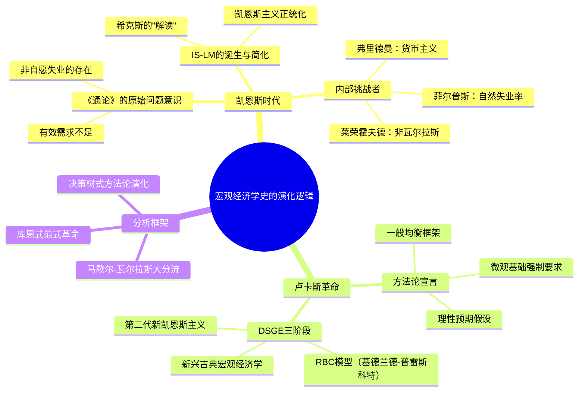

## 《宏观经济学史：从凯恩斯到卢卡斯及其后》读书笔记
  
### 作者  
digoal  
  
### 日期  
2026-05-25  
  
### 标签  
读书笔记 , 宏观经济学史：从凯恩斯到卢卡斯及其后   
  
----  
  
## 背景  
   
---
书名: 《宏观经济学史：从凯恩斯到卢卡斯及其后》   
作者: 米歇尔·德弗洛埃（Michel De Vroey）   
译者: 房誉 / 李雨纱 等   
出版年份: 2019（中文版）/ 2016（英文版）   
出版社: 北京大学出版社   
笔记日期: 2025-05-25   
豆瓣链接: https://book.douban.com/subject/34880471/   
标签: [宏观经济学, 经济思想史, DSGE, 凯恩斯, 卢卡斯, 方法论]   
---

   

> **一句话**：这是一部用方法论之眼重新丈量整个宏观经济学演化版图的智识旅程——从凯恩斯到卢卡斯，不只是历史，更是一场关于"经济学到底该怎么做"的持续辩论。   
>   
> **适合谁读**：经济学研究生、青年学者、对经济思想史感兴趣的读者；需要有基础的宏观经济学知识，IS-LM、DSGE这些词不会让你发慌   
>   
> **阅读难度**：⭐⭐⭐⭐☆（有相当分量的模型讨论，但作者努力做到了可读）   
>   
> **推荐指数**：⭐⭐⭐⭐⭐   

---

## 一、时代坐标：这本书从哪里来？

2008年金融危机之后，宏观经济学界陷入了一场少见的公开危机。主流的DSGE模型几乎没有预警到这场百年一遇的崩塌，批评者纷纷发难——这个学科究竟错在哪里？它的历史怎么走到了今天？

正是在这样的背景下，鲁汶天主教大学荣休教授米歇尔·德弗洛埃（Michel De Vroey）于2016年出版了这部英文著作。他是欧洲顶级的经济思想史学家，一生研究的正是凯恩斯与卢卡斯之间那个关键转型期。他的雄心不小：为过去八十年（1936年《通论》至今）的宏观经济学写一部有据可查、有立场判断的"正史"。

作者在前言中直白地说，这本书是为研究生和青年研究者而写的——在他们接受密集"技术训练"之外，提供一种"大图景"的补充。言下之意：我们把学生训练成了精密的模型机器，却没告诉他们这些模型从哪里来、为什么是这个样子，以及当年那些重要的岔路口，曾经有哪些路没有走。

```
时间轴：宏观经济学的两个大时代

1936          1950s-60s        1970s           1980s-2000s       2010s
  │               │               │                 │               │
  ▼               ▼               ▼                 ▼               ▼
《通论》        凯恩斯主义       卢卡斯革命        DSGE成熟期      危机与反思
出版          IS-LM统治       范式转换开始       RBC → 新凯恩斯   后金融危机
              新古典综合       货币主义冲击       主义大融合       论战重启
```

---

## 二、核心命题：作者在说什么？

这本书的分析有两个彼此交织的主轴，理解了它们，就理解了全书的灵魂。

### 命题一：宏观经济学史是两个大时代的更迭，而非平滑演进

德弗洛埃开门见山：现代宏观经济学的历史可以清晰地切割为两段。

**第一个时代（1940s—1970s）**：凯恩斯主义时代。以IS-LM模型为核心，关注有效需求、非自愿失业，相信政府干预可以稳定经济。这一时代的内部并非铁板一块，货币主义的弗里德曼、非瓦尔拉斯均衡的帕廷金和莱荣霍夫德，都在内部提出了挑战。

**第二个时代（1970s至今）**：DSGE（动态随机一般均衡）时代。以卢卡斯为革命旗手，要求宏观模型必须建立在微观行为者优化的基础上，理性预期成为标配，凯恩斯主义的"非均衡"叙事被宣判出局。基德兰德和普雷斯科特的RBC模型，以及后来的第二代新凯恩斯主义模型，都是这个时代的产物。

关键判断在这里：德弗洛埃认为，**卢卡斯革命是一次真正的库恩式科学革命**——不是修修补补，而是范式的彻底更换。它确立了新的方法论准则：模型必须动态、随机、基于一般均衡。这套新标准重新定义了什么叫"好的宏观经济学"。

### 命题二："马歇尔-瓦尔拉斯大分流"是理解这段历史的关键透镜

这是全书最具原创性的分析框架，也是德弗洛埃最想让读者带走的一把钥匙。

经济学中长期存在两种不同的建模传统：

- **马歇尔传统**：局部均衡，注重价格调整过程，允许市场出清失败，更贴近"真实世界"的不完美性。
- **瓦尔拉斯传统**：一般均衡，强调所有市场同时出清，经济系统总处于（某种意义上的）均衡状态，方法论上更严格、更封闭。

德弗洛埃认为，凯恩斯主义时代的危机，本质上是"用了马歇尔-凯恩斯的问题意识，却套上了瓦尔拉斯的数学外壳"造成的内在张力。而卢卡斯革命彻底站到了瓦尔拉斯一边——追求方法论的一致性与严格性，代价是放弃了很多现实相关性。

这个框架解释了很多"为什么"：为什么凯恩斯主义者总在为"非自愿失业"辩护而新古典派嗤之以鼻？为什么DSGE世界里"危机"如此难以内生？因为两边根本用的是不同的地图。

### 命题三：这不是一部歌功颂德的历史，德弗洛埃对卢卡斯有真实的遗憾

值得注意的是，作者本人是同情DSGE方法论严格性的——但他并不回避承认DSGE的局限。他在书中直言，卢卡斯革命在方法论上的胜利，是以现实解释力为代价换来的。那些被驱逐出主流的非瓦尔拉斯传统，并非毫无价值，只是在范式战争中输了而已。

正如卢卡斯本人为这本书写的推荐语所说："他（德弗洛埃）最终有勇气不掩饰自己的失望……"

---

## 三、论证地图：作者怎么说服你的？



德弗洛埃的论证方式很有特点：他不只是讲"发生了什么"，而是逐一拆解每个学派的内在逻辑，指出它的前提假设，然后评价它在自己的条件下是否自洽。他会引用大量经济学家的原文和访谈，让"当事人自己说话"。这种写法有一种编年史的厚度，又有侦探推理的锐度。

有几个论证节点格外值得注意：

第一，他花了很大篇幅论证"凯恩斯主义"对凯恩斯本人的背叛。凯恩斯在《通论》中其实并不认为非自愿失业来自工资刚性，但后来的IS-LM传统恰恰把工资刚性当成了核心支柱。这个历史性的"误读"是后来整个理论大厦的隐患。

第二，他对RBC模型的评述尤其精彩——既承认其方法论革命意义，也直说其现实解释力的根本缺陷（技术冲击驱动经济周期？这个假设让许多人难以接受）。他有勇气写一整章"我对RBC的评述"，以第一人称亮出自己的立场。

---

## 四、前提假设与边界：什么情况下这不成立？

**假设一：方法论的演化是理解宏观史的第一位视角。**

德弗洛埃的历史是一部"方法论史"而非"现实经济史"。他不怎么从1929年大萧条、1970年代滞涨这些经济事件出发，而是从"经济学家们怎么建模"出发。这个选择有其价值——但如果你相信经济理论更多是对历史现实的被动回应，你会觉得他遗漏了很多。

**假设二：DSGE方向是主流，必须被认真对待。**

他选择重点研究最终赢得学术市场的理论流派。那些在主流之外发展的传统（如后凯恩斯主义、制度经济学）被他明确排除在外。这是一种有意识的边界划定，但也意味着这本书讲的是"胜利者的历史"。

**假设三：范式革命是不可逆的。**

作者基本接受"卢卡斯革命宣告凯恩斯主义死亡"这一判断。但2008年金融危机后，许多人开始重新呼唤凯恩斯、重新审视DSGE的失灵。德弗洛埃写了中文版序言试图回应，但这个问题本身说明：历史还没有终结，范式的边界仍在震荡。

---

## 五、思想谱系：这本书站在哪个传统里？

德弗洛埃本人是经济思想史（History of Economic Thought）这一领域的学者，这个领域本身在当代主流经济学系科里是逐渐被边缘化的——这种背景给了他一种特殊的双重视角：他熟悉那些技术模型，但他不被任何一个阵营的胜负所左右。

```
思想影响谱系：

莱荣霍夫德（决策树方法论）
        │
        ▼
  德弗洛埃的分析框架
        ▲               ▲
        │               │
库恩（范式革命理论）   拉卡托斯（科学研究纲领）
```

他的分析工具综合了科学哲学的范式论（库恩）和研究纲领论（拉卡托斯），并深受莱荣霍夫德关于"决策树"方法论叙事的启发。在欧洲经济思想史学界，这本书与罗杰·巴克豪斯（Roger Backhouse）等人的工作并称，代表了这个领域最高水准的综合叙事。

对后来者的影响：这本书已经成为众多研究生课程的必读参考，尤其在"宏观经济学基础/方法论"类课程中，它提供的历史地图是独一无二的。

---

## 六、我学到了什么？

读完这本书，有三件事改变了我原来的想法。

**第一，历史不是教科书讲的那条直线。** 我曾以为宏观经济学是从简单走向复杂、从粗糙走向精确的进步故事。但德弗洛埃让我看到，每一次"进步"都是有代价的取舍。IS-LM简化了凯恩斯，却让其影响力扩散到了全球；DSGE严格化了方法，却把"金融危机"这种现实推到了模型之外。所谓进步，不过是选择了在哪条轨道上前进。

**第二，"方法论"不是哲学课的空谈，它决定了你能看到什么。** 瓦尔拉斯传统的模型不能内生"非自愿失业"——不是经济学家不聪明，而是那套框架的底层假设本就排除了这种可能。选择工具，就是选择视野的边界。这个认识对我理解任何学科的争论都有迁移价值。

**第三，"赢得范式战争"和"理解现实"可以是两件不同的事。** 卢卡斯革命在学术市场上全胜，但RBC模型真的能解释商业周期吗？德弗洛埃没有给出简单的答案——他比任何人都清楚，这个问题还远没有终结。而这种诚实，比许多教科书的自信更让人信服。

---

## 七、举一反三：这个框架还能用在哪？

德弗洛埃的"决策树"式方法论分析框架，其实有很强的迁移性。

**用于理解任何学科内部的范式争论**：无论是心理学中的行为主义vs认知科学，还是物理学中的各种解释框架，"你在哪个节点做了什么选择、这个选择把你带到了哪条路上"——这个追问方式几乎是通用的。

**用于理解公司或组织的战略演化**：一家公司在关键节点选择了某种商业模式，这个选择创造了路径依赖，也关闭了一些可能性。"回溯到上一个节点"往往是最难但有时最正确的选择。

**用于审视自己的思维定式**：我们每个人都有自己的认知"范式"——一套习惯性的前提假设。德弗洛埃的历史提醒我们：任何时候都值得问一句，我是在哪个分叉口做了哪个选择，然后顺着这条路走到了今天的偏见和盲点？

---

## 八、批判与反思

**这本书低估了经济学与政治的纠缠。** 卢卡斯革命发生在1970年代——恰好是滞涨打垮凯恩斯主义的信用、里根-撒切尔新自由主义崛起的年代。德弗洛埃把这场革命主要解读为方法论的胜利，但有理由相信，意识形态和政治气候也在其中扮演了关键角色。"理性预期、市场出清"的假设，天然地与"市场自我纠正、政府无效"的政治主张相契合。这个维度在书中几乎缺席。

**它是一部"主流视角"的历史。** 作者明确表示，他选择聚焦于在学术主流中胜出的理论，而将后凯恩斯主义、演化经济学等非主流传统排除在外。这当然是合理的叙事选择，但也意味着这本书本身就在强化"什么是重要经济学"的既有定义。

**2008年之后的故事仍然没有结局。** 作者写了中文版序言来补充金融危机后的新进展，但坦白说，宏观经济学在经历HANK模型（异质性主体新凯恩斯主义）等新浪潮之后，叙事仍在快速演化。这本书记录的，终究是2016年时的认知快照。

---

## 九、金句与记忆点

**1. 凯恩斯主义的悖论**
> 以希克斯为代表的第一代凯恩斯主义者，接受了凯恩斯关于"非自愿失业存在"的结论，却把原因归结为凯恩斯本人并不认同的"工资刚性"——师承的起点，就已是误读。

这提醒我们：一个伟大思想一旦被系统化、教科书化，往往同时被简化了。

**2. 卢卡斯革命的代价**
批评者的经典反驳：卢卡斯革命是在"用精确的错误替代零散的真相"（Lipsey语）。这一句话，精准地指向了DSGE的核心张力——方法论的严格性与现实解释力之间的永恒取舍。

**3. 决策树与回溯**
德弗洛埃借莱荣霍夫德的框架指出：理论发展就是在决策树上不断做选择，走错了路的办法是"回溯"——返回上一个节点，重新走另一条路。这是一种极其有用的认知隐喻：在思想史中如此，在人生决策中亦然。

**4. 马歇尔-瓦尔拉斯分流是宏观史的底层密码**
为什么新古典派和凯恩斯派永远吵不到一起？因为他们用的根本是两套不同的理论地图——一个描述"市场过程"，一个描述"均衡状态"。

**5. 历史是一种选择**
写历史本身就是在做判断：什么重要，什么不重要；谁是主角，谁是配角。德弗洛埃坦诚地说出了这一点，并为自己的选择给出理由。这种学术诚实，本身就值得学习。

**6. 卢卡斯本人的评语**
卢卡斯为这本书写了背书语，说德弗洛埃"有勇气不掩饰自己的失望"。这句话耐人寻味——能让批评对象说出这种话的历史，才是真正公正的历史。

---

## 十、延伸阅读

**1.《通论》—— 约翰·梅纳德·凯恩斯**
一切故事的源头，不管读起来多难，至少应该翻一翻前几章。知道凯恩斯本人在说什么，才能理解后来的一切"误读"与"延伸"。

**2.《凯恩斯经济学与经济学家的凯恩斯》—— 阿克塞尔·莱荣霍夫德**
德弗洛埃书中引用最多的同时代学者，他最早指出"凯恩斯主义"对凯恩斯的系统性误读，是读本书的绝佳配套。

**3.《科学革命的结构》—— 托马斯·库恩**
理解德弗洛埃"范式革命"叙事的哲学基础，读完库恩再读德弗洛埃，会发现他的分析框架借鉴有多深。

**4.《货币的祸害》—— 米尔顿·弗里德曼 & 安娜·施瓦茨**
货币主义的核心代表作，理解这个学派如何从内部冲击了凯恩斯主义统治地位，是完整理解"两个时代"的必要拼图。

**5.《宏观经济学》（Macroeconomics: Theory and Policy）—— 戴维·罗默**
想在读完这本思想史之后，知道当代主流宏观经济学"长什么样子"，罗默的教科书是最清晰的当代入门路径。

---

*笔记写于 2025-05-25 | 基于公开学术资料、豆瓣信息及深度思考整理*
*英文原著：A History of Macroeconomics from Keynes to Lucas and Beyond，Cambridge University Press，2016*
  
  
#### [PostgreSQL 解决方案集合](../201706/20170601_02.md "40cff096e9ed7122c512b35d8561d9c8")
  
  
#### [德哥 / digoal's Github - 公益是一辈子的事.](https://github.com/digoal/blog/blob/master/README.md "22709685feb7cab07d30f30387f0a9ae")
  
  
#### [About 德哥](https://github.com/digoal/blog/blob/master/me/readme.md "a37735981e7704886ffd590565582dd0")
  
  

  
