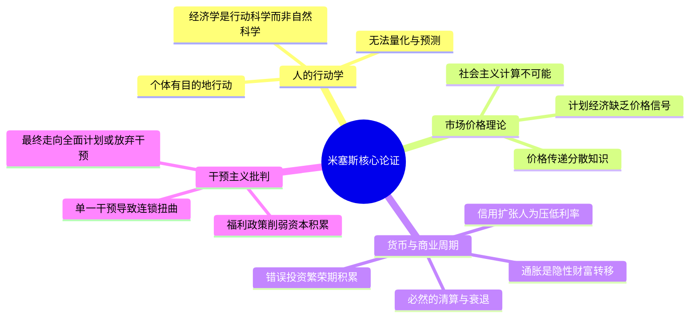

## 《米塞斯的经济学课：讲座与演讲精选集》读书笔记
  
### 作者  
digoal  
  
### 日期  
2026-05-25  
  
### 标签  
读书笔记 , 米塞斯的经济学课：讲座与演讲精选集   
  
----  
  
## 背景  
   
---
书名: 《米塞斯的经济学课：讲座与演讲精选集》   
作者: [奥] 路德维希·冯·米塞斯   
译者: 吴荻枫   
出版社: 浙江人民出版社   
出版年份: 2025-4   
ISBN: 9787213118531   
笔记日期: 2025-05-25   
标签: [经济学, 奥地利学派, 自由市场, 米塞斯, 古典自由主义, 货币理论]   
---

   

> **一句话**：一位在凯恩斯主义洪流中逆行的经济学家，用讲台上的声音告诉你：干预市场的代价，永远由普通人来付。   
> **适合谁读**：对经济现象有好奇心的普通人；想入门奥地利学派的读者；厌倦了宏观数字、想理解"钱是怎么被稀释的"的职场人。   
> **阅读难度**：⭐⭐☆☆☆（讲座体，通俗）   
> **推荐指数**：⭐⭐⭐⭐☆   

---

## 一、时代坐标：这本书从哪里来？

1959 年，路德维希·冯·米塞斯已年届七十八岁。

这位出生于奥匈帝国的经济学家，一生几乎都在"逆流而行"：他在纳粹兴起前夕离开维也纳，辗转瑞士，再流亡美国。在凯恩斯主义席卷全球学术界的年代，他在纽约大学做着没有薪酬的访问教授，靠赞助人的资助维持研究。

就是在这一年，他受邀前往阿根廷布宜诺斯艾利斯，为当地的"自由研究中心"（Centro de Estudios sobre la Libertad）发表了六场公开讲座。彼时阿根廷正深陷庇隆主义留下的经济烂摊子——通胀、国有化、福利膨胀——米塞斯的听众迫切需要一种解释：为什么"好意的"政府干预会让人民变得更穷？

这六场讲座，后来经他的妻子玛格丽特整理，成为英文版《经济政策》（*Economic Policy: Thoughts for Today and Tomorrow*）——也就是本书的主要蓝本之一。

中文版《米塞斯的经济学课》在此基础上扩展，收录了他在不同时期的重要演讲，形成一个横跨四十余年（1920年代至1960年代）、覆盖经济学哲学基础、市场与计划、货币、商业周期、通货膨胀、福利政策等核心议题的"讲座精选集"。

这不是一本学院派教材，而是一个老人在课堂上说的真心话。

```
时代背景示意图
━━━━━━━━━━━━━━━━━━━━━━━━━━━━━━━━━━━━━━━━━━━━━━━
1920s        1930s        1940s        1950s        1960s
  │            │            │            │            │
米塞斯在维也纳  大萧条爆发     流亡美国       在纽约大学      1959年阿根廷
发表社会主义   凯恩斯主义    出版《人的     做访问教授      六次讲座
计算不可能论   崛起         行为》
  │            │            │            │            │
[奥地利学派]  [凯恩斯革命]  [孤立边缘化]  [默默坚守]   [思想结晶]
━━━━━━━━━━━━━━━━━━━━━━━━━━━━━━━━━━━━━━━━━━━━━━━
```

---

## 二、核心命题：作者在说什么？

### 命题一：人的行动是经济学的唯一出发点

米塞斯的整套理论有一块基石，他称之为"行动学"（Praxeology）——研究人类有目的行动的科学。

这个听起来抽象的词，其实指向一个具体的主张：**经济学不是物理学，无法用统计规律和数学模型来预测人的行为**。每个人在特定时刻的选择，都源于他对目标的判断和对手段的权衡——这是无法被平均化、模型化的。

在那个计量经济学方兴未艾、越来越多经济学家试图用回归方程"捕捉"经济规律的时代，米塞斯是那个泼冷水的人：你们预测的不是经济，是人。而人不是原子。

### 命题二：价格机制是人类社会最精密的计算机

计划经济为何不可行？米塞斯的回答在1920年代就已经给出，到1959年讲座中再度强调：**没有私有产权，就没有市场价格；没有市场价格，就没有任何人能做出合理的经济计算。**

在市场中，每一个价格都凝结着无数人分散的知识——生产者的成本、消费者的偏好、资源的稀缺程度……这些信息无法被任何一个中央机构收集和处理。计划者不是缺少算力，而是根本不可能拥有所需的信息。

这就是著名的"社会主义经济计算论证"——后来被哈耶克以"知识的分散性"发扬光大，成为批评中央计划最有力的理论武器之一。

### 命题三：通货膨胀是一种隐性税，受害者永远是普通人

这是本书中最入世、也最令今日读者感同身受的部分。

米塞斯说：政府印钞票不是"无中生有创造财富"，而是财富的重新分配——从晚拿到新钱的人（工薪阶层、储户）转移到早拿到新钱的人（政府、银行、大企业）。当新钱流入经济，物价还未上涨，先得到钱的人已经以旧价格购买了资源；等物价涨起来，普通人的工资还没跟上，实际购买力已经下降。

他把这个过程叫做**"坎蒂隆效应"**——货币增发的影响不是均匀扩散的，是不平等地扩散的。

在一个货币超发成为常态的时代，这段话值得反复品味。

---

## 三、论证地图：作者怎么说服你的？



米塞斯的论证风格是**演绎式的**：他从几个他认为不言自明的公理出发（人有目的地行动、资源稀缺、时间有价值），用纯粹的逻辑推理导出结论，几乎不借助统计数据。

这既是他的力量所在——逻辑链条无懈可击——也是他的致命弱点：主流经济学界认为这种方法论根本无法被"证伪"，因此不算严格意义上的科学。

他最擅长用的是**历史案例的对比**：德国战后经济奇迹（放弃管制、货币改革）vs. 英国的福利主义停滞；阿根廷的通胀 vs. 自由贸易时代的繁荣——用宏观历史案例来"验证"理论，而非统计回归。

---

## 四、前提假设与边界：什么时候米塞斯会说错？

### 假设一：市场总能自我纠正

米塞斯相信，如果没有外部干预，市场的商业周期会自然完成清算——坏的投资被淘汰，好的资源被重新配置，经济重回正轨。

但这个"清算"过程可能代价极高。大萧条期间，美国失业率超过25%，数百万人陷入贫困。你可以说这是政府干预导致的，但对于正在挨饿的家庭来说，等待"自然清算"是一个遥不可及的答案。凯恩斯那句话有其残忍的道理："从长远来看，我们都死了。"

### 假设二：人始终是理性的行动者

米塞斯的体系建立在"人有目的地行动"之上，但行为经济学的大量研究表明，人在系统性地做出非理性选择——锚定效应、损失厌恶、从众心理……这些"偏差"并不是少数例外，而是普遍现象。

奥地利学派会反驳：这些"非理性"仍然是有目的的行动，只是目的复杂多元，超出了主流经济学的假设。但这个争论至今没有定论。

### 假设三：自由市场能解决所有问题

米塞斯对市场的信任是全方位的——公共品、外部性、信息不对称，他认为私人机制最终都能更好地处理。对于今天全球化下的气候变化、平台垄断、金融系统性风险，这种乐观可能低估了"市场失灵"的规模和后果。

**总结**：米塞斯的理论框架在分析"为什么政府干预会产生意外后果"时极为锋利；但在回答"当市场自我清算造成大规模社会痛苦时该怎么办"时，他的答案显得过于冷静，甚至冷漠。

---

## 五、思想谱系：这本书在哪个传统里？

```
【奥地利学派谱系】

门格尔 (1840-1921)
主观价值论 · 边际革命
        │
庞巴维克 (1851-1914)
资本理论 · 利息理论
        │
    米塞斯 (1881-1973)         ←── 康德认识论
    行动学 · 计算问题 · 货币理论      ↓
        │                    哈耶克 (1899-1992)
        │                    知识分散 · 价格信号
        │                    1974年诺贝尔经济学奖
        ↓
    罗斯巴德 (1926-1995)
    无政府资本主义 · 自然权利论
        │
    现代自由意志主义运动
```

米塞斯自觉继承了门格尔的主观主义传统，同时深受康德先验哲学的影响——他认为，某些经济规律不是从经验归纳出来的，而是人类认知结构本身就预设了的。

他与同时代的凯恩斯之间的对立，远不只是政策主张的分歧，而是两种根本不同的世界观：一个认为经济是可以被工程师管理的机器，另一个认为经济是无数个体互动自发涌现的秩序，任何"管理"都是僭越。

他的学生哈耶克将"分散知识"的洞见发展为更精致的论证，并于1974年获得诺贝尔经济学奖——那是主流学界第一次正式承认奥地利学派的重要性，但米塞斯已于前一年辞世，未能亲见。

---

## 六、我学到了什么？

**第一课：警惕"好意的干预"**

米塞斯反复强调的不是干预者坏，而是干预的**逻辑结构**决定了它的后果。价格管制会导致短缺，不是因为官员想创造短缺，而是因为人为压低价格之后，供给方会减少供给，需求方会增加需求，供需缺口由此产生。好意不能改变逻辑。

这个思维框架对我理解很多现实政策的"意外后果"极有帮助——租金管制为什么会减少可租房源、最低工资为什么可能增加青年失业，等等。

**第二课：通货膨胀是有方向的**

在此之前，我对通胀的理解是"物价普遍上涨"。读完米塞斯，我理解到这是一个**财富再分配的过程**——新钱是有"着陆点"的，它先流到哪里，哪里的人就占了便宜。普通储户是通胀税的天然承担者，这不是概率问题，而是货币传导机制决定的结构性现象。

**第三课：经济学是关于选择的科学，不是关于数字的科学**

主流经济学越来越像物理学——满是公式、模型、显著性水平。米塞斯提醒我，这背后的主体是真实的人，有欲望、有判断、会犯错、会学习。任何把人简化成"效用最大化函数"的模型，都有其固有的盲点。

---

## 七、举一反三：这个框架还能用在哪？

**场景一：企业内部的"计划经济"**
一家大公司的内部资源配置，和计划经济面临相似的问题：如果没有内部市场价格机制，总部很难知道各部门的资源应该如何分配。这正是亚马逊"两个披萨团队"、字节"小前台大中台"等组织实验背后的部分逻辑——让内部单元有真实的成本压力，产生类似市场的信号。

**场景二：识别政策的"意外后果"**
任何新政策出台时，可以问米塞斯式的问题：这个政策改变了哪些激励？参与者会如何调整行为？这种调整会产生什么二阶、三阶效果？——这是一种对政策逻辑结构的系统性审视，胜过单纯看政策意图。

**场景三：理解个人财务**
在一个货币长期超发的环境中，持有现金是在缓慢让渡财富。这不是阴谋论，是米塞斯一百年前就说清楚的机制。理解这一点，对个人资产配置思路会有根本性影响。

---

## 八、批判与反思

**米塞斯有一种"先知的傲慢"**

他的论证极为自信，甚至有些不留余地。对于凯恩斯主义者、社会主义者，他几乎不假设对方有任何合理性——他们要么是无知，要么是被意识形态蒙蔽。但在历史上，某些形式的干预确实在特定条件下起到了效果，比如二战后美国的GI法案、东亚发展型政府……单纯用"短期偶然"来解释这些，未免过于武断。

**他对"贫穷是短暂过渡"的描述过于乐观**

米塞斯相信资本积累的长期力量会惠及所有人。这在百年视角下或许成立，但对于具体的个人和世代，结构性贫困并不会因为"市场自由化"而自动消失。他的逻辑有其正确性，但缺乏对时间维度和分配问题的正视。

**方法论上的孤立**

坚守先验演绎、拒绝计量验证，让奥地利学派在20世纪的主流学术圈里越来越孤立。米塞斯的很多洞见是深刻的，但包装在这套方法论里，它们很难和其他研究传统对话，也难以被系统地检验和完善。这是一种智识上的遗憾。

---

## 九、金句与记忆点

> **"资本主义的本质是大众生产，为大众服务。"**
> — 米塞斯打破了"资本主义只服务富人"的误解：大规模生产降低了商品价格，让普通人也能负担曾经是奢侈品的东西。

> **"在资本主义下，富人的功能是成为消费者新产品的试验品。"**
> — 听起来讽刺，却是真实的市场机制：新技术总是先被有钱人承担高价试错，然后价格降下来普及全民。

> **"通货膨胀政策是剥夺储蓄者财产、支持债务人的政策。"**
> — 一句话说清了货币超发的政治经济学本质。

> **"计划经济计划的只是贫穷，因为没有价格，就没有计算，没有计算，就没有进步。"**
> — 米塞斯对社会主义计划的根本批判，简洁到令人难忘。

> **"自由市场不是神，它只是人类迄今发现的最不坏的资源配置方式。"**
> — 这不完全是米塞斯的原话，但准确概括了他的态度：对自由市场的支持不是盲目信仰，而是与所有替代方案比较后的理性选择。

> **"经济学家的任务是解释世界，不是改造世界——但理解清楚之后，改造就有了方向。"**
> — 米塞斯相信教育公众是经济学家最重要的责任。他向大众讲授经济学，不是为了名声，而是因为他真的认为公民的经济素养关乎文明的命运。

---

## 十、延伸阅读

**入门进阶**
- 📖 **《通往奴役之路》** — 哈耶克著。米塞斯的学生把计划经济的批判写成了适合大众的经典，可读性更强。
- 📖 **《经济学的思维方式》** — 保罗·海恩著。用奥地利式思维框架写成的经济学入门，比教科书有趣得多。

**加深理解**
- 📖 **《人的行为》** — 米塞斯的代表作，本书是精华浓缩版，看完想深挖的读者可以啃这部大部头（警告：超过900页）。
- 📖 **《货币与信用理论》** — 米塞斯奥地利学派货币理论的奠基作，理解今日货币政策的底层逻辑。

**批判视角**
- 📖 **《就业、利息和货币通论》** — 凯恩斯著。与米塞斯针锋相对的对手，读完再看米塞斯，会理解这场争论的真正深度。

---

*笔记写于 2025-05-25 | 基于公开资料与深度思考整理*
*本笔记参考了豆瓣书评、澎湃新闻学术评论、Mises Institute 原文资料及多篇中文奥地利学派研究文章*
  
  
#### [PostgreSQL 解决方案集合](../201706/20170601_02.md "40cff096e9ed7122c512b35d8561d9c8")
  
  
#### [德哥 / digoal's Github - 公益是一辈子的事.](https://github.com/digoal/blog/blob/master/README.md "22709685feb7cab07d30f30387f0a9ae")
  
  
#### [About 德哥](https://github.com/digoal/blog/blob/master/me/readme.md "a37735981e7704886ffd590565582dd0")
  
  

  
