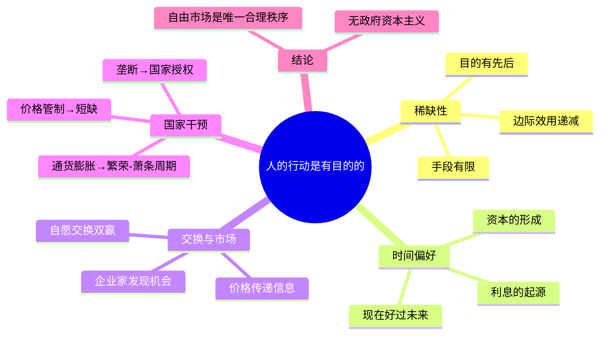
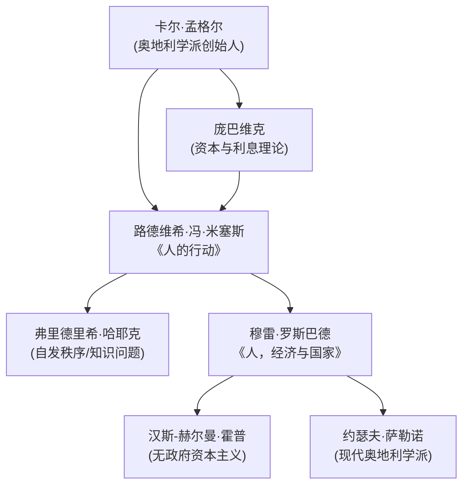

## 《人，经济与国家》读书笔记
  
### 作者  
digoal  
  
### 日期  
2026-05-25  
  
### 标签  
读书笔记 , 人，经济与国家   
  
----  
  
## 背景  
   
---
书名: 《人，经济与国家》   
作者: [美] 穆雷·N. 罗斯巴德（Murray N. Rothbard）   
原作名: Man, Economy, and State   
出版年份: 1962（中译本：2020）   
笔记日期: 2026-05-25   
出版社: 浙江大学出版社·启真馆   
豆瓣链接: https://book.douban.com/subject/35218088/   
标签: [奥地利学派, 经济学, 自由主义, 人的行动学, 政治经济学]   
---

   

> **一句话**：从一个公理出发——"人的行动是有目的的"——然后用纯粹逻辑把整个经济学大厦重建一遍。   
> **适合谁读**：对经济学本质有好奇心的人；对主流经济学感到不满足的人；想理解"为什么政府干预经济会失败"的人。   
> **阅读难度**：⭐⭐⭐⭐☆（篇幅巨大，逻辑严密，需要耐心）   
> **推荐指数**：⭐⭐⭐⭐⭐（改变经济学思维方式的书）   

---

## 一、时代坐标：这本书从哪里来？

1962年，《人，经济与国家》问世。那是一个什么样的年代？

凯恩斯主义正如日中天。二战刚结束不久，西方政府普遍相信：经济不能靠市场自发运转，国家必须主动干预——刺激需求、调控货币、分配资源。计量经济学大行其道，主流经济学家们手握数学方程，自信满满地认为经济是可以被"设计"的。

罗斯巴德不这么看。

他师从路德维希·冯·米塞斯——那位把奥地利学派带到美国的流亡经济学家。米塞斯已经写了一部鸿篇巨制《人的行动》（1949），用"人的行动学（praxeology）"重建了经济学的基础，但那本书晦涩艰深，门槛颇高。罗斯巴德的目标是：把米塞斯的思想写得更清晰、更系统、更完整，让人能真正读懂并学会用它思考。

他在三十多岁时完成了这项工程。米塞斯亲自为本书写了书评，称其为"对人的行动学这门一般科学，以及其最重要、迄今最精细阐述的部分——经济学——的划时代贡献"。

这不是一本修补主流经济学的书，而是一次根基重建。

```
时代背景示意：

1944       1949        1962          1971
布雷顿     米塞斯      罗斯巴德      美元脱离
森林体系   《人的行动》  《人，经济     金本位
建立       出版        与国家》出版
  ↓          ↓            ↓             ↓
凯恩斯      奥地利      奥地利学派    罗斯巴德
主义全盛    学派反击    重建体系      批判被
           开始                      印证
```

---

## 二、核心命题：作者在说什么？

### 命题一：经济学可以从一个公理出发，用逻辑演绎

罗斯巴德的起点只有一句话：**"人的行动是有目的的。"**

这不是一个需要用数据证明的假设，而是一个先验的公理（axiom）——你只要是人，你的行为就有目的，这根本无需验证。从这个公理出发，罗斯巴德像几何学家证明定理一样，逐步推导出边际效用递减、时间偏好、资本理论、价格形成……整个经济学。

这与主流经济学的方法截然不同。主流经济学大量使用统计数据、计量模型、数学方程。罗斯巴德认为这是走错了路：数学方程适用于无意识变量之间的固定数量关系，而人的行动是有意识的、不可量化的。把经济学数学化，就像用温度计测量音乐的美丑。

**这一命题的激进之处在于**：如果经济规律可以靠逻辑推导，那就不需要统计局，不需要经济模型，更不需要政策委员会——任何违背这些规律的政策，都必然会失败，无论意图多么良好。

### 命题二：自愿交换必然带来双赢，国家干预必然制造损失

罗斯巴德用鲁滨逊·克鲁索作为思想实验的起点：一个人在荒岛上如何做决策？然后引入第二个人，展示交换如何产生。

结论是：每一次自愿交换，都说明双方都认为自己会从中获益——否则交换不会发生。市场是人类合作的自发秩序，价格是传递信息的信号，利润和亏损是企业家行动的罗盘。

反过来，国家的每一次干预——价格管制、关税、许可证制度、最低工资——都是用强制替代了自愿，必然扭曲信息、错配资源，造成主流经济学家看不见的损失。

书中有一句话极为有力：国家是"有组织的、系统化的、大规模的抢劫"。这不是情绪化的表达，而是逻辑推导的结论。

### 命题三：微观与宏观的割裂是伪问题，经济是一个整体

现代经济学有一个奇怪的分裂：微观经济学研究个体和企业，宏观经济学研究GDP、通货膨胀、失业率。但这两套理论用的是完全不同的语言和逻辑，甚至互相矛盾。

罗斯巴德认为，这种分裂根本就是错误的。所谓"宏观"，不过是无数个"微观"行为的加总。任何总量——"货币供应量""价格水平""国民收入"——都是从个体行动中产生的，不能割裂来分析。

这也是他对凯恩斯主义最核心的批判：凯恩斯的"乘数效应"、"总需求"等概念，建立在虚构的总量之上，脱离了个体选择的微观基础，因此注定产生误导性的政策建议。

---

## 三、论证地图：作者怎么说服你的？



罗斯巴德的论证方式是**演绎而非归纳**。他不列举案例说"看，价格管制在A国B年造成了短缺"，而是说"只要你承认人的行动是有目的的，那么价格管制必然导致短缺——这是逻辑推论，不是经验观察"。

这种方法的优点是：结论非常坚实，不依赖特定数据，也不会被反例推翻（因为不是归纳）。

但代价是：你必须先接受那个公理和推导链条，才能接受结论。一旦你在某个推导环节存疑，整座大厦都会动摇。

对凯恩斯乘数效应的批判尤其精彩——他用同样的逻辑证明，按照凯恩斯的推导，读他这本书的读者本身也能产生巨大的"乘数效应"，荒谬性一目了然。

---

## 四、前提假设与边界：什么情况下这不成立？

### 假设一：人的偏好是稳定且自知的

人的行动学的整个逻辑，建立在"人知道自己想要什么"这一假设上。但行为经济学的大量研究表明，人的偏好是不稳定的、易受框架效应影响的，甚至是自相矛盾的。

如果人连自己真正想要什么都不清楚，那么"自愿交换必然互利"这一命题就要打折扣。

### 假设二：外部性可以被忽视或内部化

当工厂排污影响了下游居民，这不是任何自愿交换的一部分。罗斯巴德有他的产权理论来处理外部性，但批评者认为这套处理方案在现实中极难操作，尤其是气候变化这种全球性外部性，用私有产权框架几乎无解。

### 假设三：所有的强制来自国家

罗斯巴德把国家视为唯一的强制力量来源。但批评者指出：企业垄断、性别歧视、种族不平等，同样是一种强制，市场并不能自动消除它们。

**这本书的边界**：它是一套关于自愿秩序如何运作的理论，对于如何处理不自愿的历史遗留问题（如奴隶制的历史补偿）、全球公地悲剧、信息严重不对称等问题，答案并不充分。

---

## 五、思想谱系：这本书在哪个传统里？



罗斯巴德是米塞斯的嫡传弟子，但他走得比老师更远。米塞斯是一个古典自由主义者，接受有限政府；罗斯巴德则彻底否定国家存在的合法性，发展出"无政府资本主义（anarcho-capitalism）"。

他的影响延伸至今：自由意志主义运动、加密货币圈子（"去中心化"的思想根源之一）、比特币的一部分精神内核，都能看到罗斯巴德的影子。卡托研究所的创建，他也参与其中。

---

## 六、我学到了什么？

**收获一：方法论的冲击**

读完这本书，我开始重新审视一个问题：什么叫"用经济学思考"？主流经济学给我的训练是：找数据、建模型、跑回归。但罗斯巴德提醒我，数据背后的逻辑才是根本。数据会说谎，模型会误导，但"人是有目的地行动的"这个事实，任何数据都无法推翻。

这不是说数据不重要，而是说：**因果逻辑优先于统计相关性**。

**收获二：政府干预的内在矛盾**

罗斯巴德有一套分析政府干预的框架：任何干预都会产生意想不到的后果，而这些后果会催生更多的干预，形成恶性循环。这个逻辑链条，在价格管制、住房补贴、农业保护主义等领域一再被验证。

我不完全同意他"所有干预都必然有害"的结论，但这套分析工具非常有力，值得放进思维工具箱。

**收获三：对"自由"的重新理解**

罗斯巴德区分了两种"不自由"：一种是市场竞争的压力（你必须提供别人需要的东西才能生存），另一种是强制（有人用暴力或暴力威胁让你服从）。他认为只有后者才是真正的不自由。

这个区分，我觉得值得细想——尤其在今天，"自由"这个词被各种意识形态争夺时。

---

## 七、举一反三：这个框架还能用在哪？

**场景一：理解价格的本质**

罗斯巴德的价格理论告诉我们：价格不是成本加成，而是买卖双方主观估值博弈的结果。这个视角在分析房价、药价、平台定价时都非常有用——问"这个东西为什么这么贵"，真正的答案往往不是"成本高"，而是"某种供给被限制了"。

**场景二：识别政策的隐性成本**

每一项政府政策都有"可见"的收益和"不可见"的代价。罗斯巴德的框架提醒我们系统地追问：这项政策会扭曲哪些信号？会改变哪些激励？谁会从中受益，谁的成本被转移了？

**场景三：思考组织设计**

即使在公司内部，"中央计划 vs 分散决策"的问题同样存在。哪些决策应该集中到总部？哪些应该下放到一线？罗斯巴德关于知识分散性的论述（借鉴哈耶克），对组织设计有直接启发。

---

## 八、批判与反思

**批判一：分配问题被刻意忽略**

罗斯巴德的体系对效率问题分析极为精彩，但对公平问题几乎沉默。他预设产权的原始分配是合法的，但历史上许多产权的形成本身就是暴力的结果（土地掠夺、殖民、奴隶制）。在这个意义上，"自由市场"保护的有时候是不公正的既得利益。

**批判二：公共品和外部性的处理过于简化**

他认为国防、道路、灯塔等"公共品"都可以由市场提供。理论上他给出了一些论证，但说服力不足——现实中，纯粹依靠私人合同来提供这些服务，交易成本将高得惊人。

**批判三：时代已经变了**

1962年是一个工业时代的世界。今天，数字经济、平台垄断、数据权利、算法歧视……这些问题用传统产权框架很难处理。罗斯巴德的逻辑需要被后人用新的现实重新检验，而不是直接套用。

**我的总体立场**：这本书是一把极其锋利的手术刀，用来解剖国家干预的失败逻辑；但它不是一张完整的地图，不足以指导如何建设一个真实可行的社会秩序。

---

## 九、金句与记忆点

1. **"人的行动是有目的的。"**  
   ——整本书的出发点。看似平凡，实则是对机械主义经济学的釜底抽薪。

2. **"国家是有组织的、系统化的、大规模的抢劫。"**  
   ——罗斯巴德最著名的论断，不是愤青语录，而是他整套逻辑推导的终点。

3. **"价格不是被制定的，而是被发现的。"**  
   ——价格是信息，不是政策工具。管制价格就是摧毁信息。

4. **"每一次自愿交换，都是双赢的。"**  
   ——不是因为"市场公平"，而是因为：不认为有利的交换根本不会发生。

5. **"宏观经济学的错误，在于它忘记了所有的总量都是从个体行动中产生的。"**  
   ——对凯恩斯主义的根本批判。

6. **"经济学研究的是人在稀缺条件下有目的的行动，因此，一切有目的的人类行动都是经济学的研究对象。"**  
   ——经济学不是一门关于钱的学问，而是一门关于选择的学问。

7. **"数学方程适用于无意识变量之间的固定数量关系；它不适用于有意识的人类行动。"**  
   ——对主流经济学数学化的系统性批判。

---

## 十、延伸阅读

1. **《人的行动》——路德维希·冯·米塞斯**  
   罗斯巴德的思想源头。读完《人，经济与国家》再读这本，会发现两本书相互印证，各有侧重。

2. **《通往奴役之路》——弗里德里希·哈耶克**  
   同一传统，但哈耶克更关注知识的分散性和自发秩序，风格更政治化、更易读。

3. **《自由的伦理》——穆雷·罗斯巴德**  
   罗斯巴德自己的政治哲学著作，为《人，经济与国家》的经济逻辑提供伦理基础，是一对互补阅读。

4. **《资本主义与自由》——米尔顿·弗里德曼**  
   同为自由市场阵营，但与罗斯巴德路线不同（弗里德曼接受有限政府和货币政策）。对比阅读可以看清两条路线的分歧。

5. **《一课经济学》——亨利·赫兹利特**  
   罗斯巴德最推崇的经济学入门书。核心思想是"看不见的成本"，读起来轻松，是进入奥地利学派的最佳跳板。

---

*笔记写于 2026-05-25 | 基于公开资料、学术评论与深度思考整理*
  
  
#### [PostgreSQL 解决方案集合](../201706/20170601_02.md "40cff096e9ed7122c512b35d8561d9c8")
  
  
#### [德哥 / digoal's Github - 公益是一辈子的事.](https://github.com/digoal/blog/blob/master/README.md "22709685feb7cab07d30f30387f0a9ae")
  
  
#### [About 德哥](https://github.com/digoal/blog/blob/master/me/readme.md "a37735981e7704886ffd590565582dd0")
  
  

  
