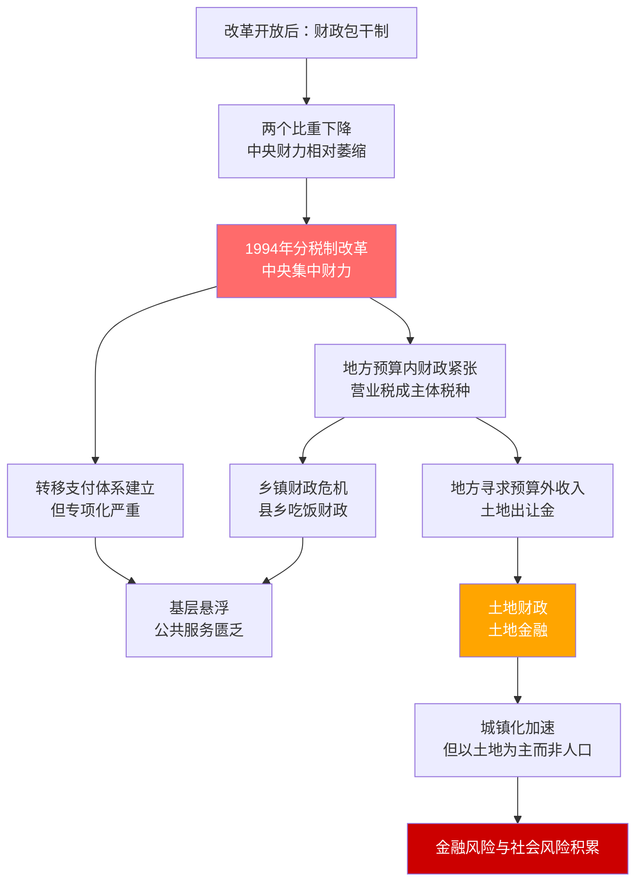

## 《以利为利：财政关系与地方政府行为》读书笔记
  
### 作者  
digoal  
  
### 日期  
2026-05-25  
  
### 标签  
读书笔记 , 以利为利：财政关系与地方政府行为   
  
----  
  
## 背景  
   
---
书名: 《以利为利：财政关系与地方政府行为》   
作者: 周飞舟   
出版年份: 2012   
出版社: 上海三联书店   
笔记日期: 2025-05-25   
豆瓣链接: https://book.douban.com/subject/10587755/   
ISBN: 9787542636492   
标签: [财政制度, 地方政府, 分税制, 土地财政, 中国改革, 政治经济学, 社会学]   
---

   

> **一句话**：一把财政的手术刀，剖开了中国地方政府三十年行为逻辑的内脏。   
> **适合谁读**：关心中国政治经济运行逻辑的读者；想理解土地财政、城镇化和基层治理的人；政策研究者、城市规划从业者；任何对"政府为什么这么做"感到困惑的公民。   
> **阅读难度**：⭐⭐⭐☆☆（有社科基础者可轻松读完，无需经济学专业背景）   
> **推荐指数**：⭐⭐⭐⭐⭐   

---

## 一、时代坐标：这本书从哪里来？

2012年，周飞舟出版此书时，中国的房价刚刚经历了一轮令人咋舌的上涨，"地王"频出的新闻每隔几个月就会刷屏一次。与此同时，各地"鬼城"的报道也开始出现，县城烂尾楼成了某种奇景。普通人感到迷惑：**地方政府为什么如此热衷于卖地？基层乡镇为什么那么穷？农村公共服务为什么如此匮乏？**

这些问题在当时大多停留在直觉层面，缺乏系统解释。周飞舟——北京大学社会学系教授、长期深入基层的田野研究者——用这本书给出了一个制度层面的根本性回答：**这一切，都是财政制度设计的必然结果。**

作者并非坐在象牙塔里推演模型，而是真正走进过中国县乡政府的日常——观察乡镇干部如何"要饭"，如何"跑项目"，如何在压力体制下挣扎求存。田野调查的温度与宏观数据的冷峻，在这本书里形成了罕见的结合。

本书写于分税制改革（1994年）近二十年后，正是土地财政问题全面暴露、积累的社会矛盾开始显现的关键节点。书名取自《大学》："国不以利为利，以义为利也。"——言下之意是：当一个国家以逐利为目标，后患无穷。

```
  1978              1994              2002              2012
   |                 |                 |                 |
改革开放           分税制改革         农村税费改革       本书出版
财政包干制开始     央地格局逆转      乡镇财政空壳化    土地财政顶峰期
```

---

## 二、核心命题：作者在说什么？

### 命题一：财政制度决定政府行为——钱从哪里来，决定官员往哪里跑

这是全书最核心的论断，听起来直白，却有极强的解释力。

1994年的**分税制改革**是全书的历史转折点。改革前，中央与地方财政收入大体是"三七开"（中央30%，地方70%）；改革后倒转为"倒三七开"（中央60%，地方40%）。但财政支出的比例几乎没变，地方政府仍然承担约70%的公共支出责任。

这个剪刀差造成的后果是：**地方政府——尤其是县乡一级——几乎立刻陷入财政困境。** 分税制将最肥的税种（增值税75%归中央）集中到了中央；地方只剩营业税（主要来自建筑业和房地产）作为主体税收。这一制度安排，几乎像一只看不见的手，将地方政府的利益与建设工程、土地开发绑定在一起。

> 分税制后流传一句话：**"中央财政喜气洋洋，省市财政勉勉强强，县级财政拆东墙补西墙，乡镇财政哭爹叫娘。"**

这不是戏谑，而是精准的制度描述。

### 命题二：土地财政是理性选择，而非道德失范

许多人在谴责地方政府"卖地成瘾"时，预设了一个道德框架：官员是贪婪或不负责任的。周飞舟提供了一个更结构性的解释：在分税制将营业税划为地方税种之后，**建筑业和房地产业的营业税成了地方政府最重要的预算内收入来源**。与此同时，土地出让金（预算外收入）更是直接成为地方的"第二财政"。

于是形成了一个自我强化的循环：

```
  土地出让金
      ↓
  成立政府融资平台（城投公司）
      ↓
  以土地抵押从银行贷款
      ↓
  用于城市基础设施建设 → 推高周边地价
      ↓
  新一轮征地、出让，偿还贷款
      ↓
  循环往复，规模不断扩大
```

这个"土地—财政—金融三位一体"的模式，不是什么邪恶的发明，而是理性官员在制度约束下的必然选择。只要土地价格不断上涨，游戏就可以继续。问题在于：**它把风险积累在了金融系统和居民部门**，而把收益锁定在了政府账本和GDP增速上。

### 命题三：基层政权"悬浮"——国家能力在最后一公里的丧失

这是本书最令人沉重的发现之一。

分税制将财力集中到上级，农村税费改革（2002年后）虽然减轻了农民负担，却也切断了乡镇政府原本靠"三提五统"维系运转的财源。改革后，大量乡镇财政只剩一件事可做：**发工资**。没有运转经费，没有办事资金，只有人头费。

结果是：乡镇政府虽然存在，却无力提供基本的农村公共服务——道路、卫生、教育、水利都在衰退。公共服务资金停留在县城，无法"下乡"。这就是周飞舟提出的"**悬浮型政权**"：国家机器悬浮于乡村社会之上，既无法汲取资源，也无法有效服务。

---

## 三、论证地图：作者怎么说服你的？



**关键数据支撑：**

- 分税制后，中央财政收入占全国财政收入比例从22%升至约55%，地方财政支出责任却维持在70%以上。
- 1990年代中后期，农民"三提五统"实际负担约为农业税的两倍。
- 政府城市开发资金中，金融投入约占三分之二，财政仅约三分之一——土地抵押贷款是核心杠杆。
- 专项转移支付中，中部地区所获甚至低于东部，"能跑会哭"的地区更容易拿到资金。

**论证方式的特点：** 周飞舟擅长"制度—行为"分析框架，将宏观数据与微观田野调查结合，避免了纯统计研究的抽象感，也避免了纯案例研究的偶然性。书中那些关于乡镇干部日常的描写，读来几乎令人心酸又会心一笑。

---

## 四、前提假设与边界：什么情况下这不成立？

**假设一：地方官员主要受财政激励驱动**

这个假设在经验上颇为有力，但并不完整。政治晋升激励（仕途逻辑）同样重要，有时二者一致，有时相互张力。书中虽有涉及"压力型体制"和"锦标赛体制"，但财政激励视角仍是主轴，政治激励处于次要位置。

**假设二：制度设计的后果是可分析和预测的**

周飞舟的分析隐含了一种结构功能论的倾向：制度设计→激励结构→政府行为。这个链条逻辑清晰，但现实中存在大量地方差异——同样的分税制，为什么东部地区能通过土地财政实现繁荣，而中西部却陷入"要饭财政"？作者有所触及（城镇化基础不同），但未完全展开。

**适用边界：**

本书主要描述的是2010年前、分税制改革后约十五年内的政府行为格局。此后十余年，随着房地产调控政策趋严、土地出让金增速放缓乃至下滑，"土地财政"模式已经遭遇严峻挑战。书中的预警——金融风险与社会风险的积累——在今天（2024-2025年）正在以各种形式兑现。书的诊断依然成立，但"游戏还能继续多久"这个问题，现在已有了更明确的答案。

---

## 五、思想谱系：这本书站在哪个传统里？

周飞舟的方法论根植于**发展社会学**与**制度主义政治经济学**的交汇处。他明显受到以下几个思想传统的影响：

- **华尔德（Andrew Walder）**的"地方国家公司主义"理论——地方政府以公司化逻辑运营，周飞舟在此基础上进一步追问：这种公司化逻辑的财政基础是什么？
- **魏昂德（Jean Oi）**的"地方政府产业化"分析——乡镇企业时代地方政府的经营者角色。
- **奥尔森（Mancur Olson）**的集体行动理论——地方政府如何在制度约束下实现自身利益最大化。
- **曹锦清**的田野传统——《黄河边的中国》那种直面基层现实的调查精神。

在国内学界，本书与**黄宗智**的历史社会学路径、**贺雪峰**的乡村研究传统形成对话，共同构成了中国本土政治社会学的重要方阵。

与同期颇受关注的经济学视角（如张五常的"县域竞争论"）相比，周飞舟更强调财政制度的结构性约束，而非单纯的市场竞争激励，视角更为立体。

```
华尔德/魏昂德（地方政府公司化）
         ↘
          周飞舟《以利为利》（财政制度→政府行为）
         ↗
曹锦清/贺雪峰（田野调查传统）

↓ 影响

兰小欢《置身事内》（面向大众的普及版）
陆铭《大国大城》（城镇化政策讨论）
```

---

## 六、我学到了什么？

读完这本书，最大的收获不是某个具体结论，而是一套**读政府行为的眼光**。

**第一个收获：理解制度逻辑，才能理解"不合理"行为**

很多看起来荒唐的现象——地方政府明明财政紧张却热衷于搞形象工程、农村学校破败却县城楼越盖越高——在"财政激励"框架下都有了解释。这不是为失职辩护，而是说：**如果不改变制度，仅靠道德谴责无法改变行为**。这个思维方式，适用于分析几乎所有机构行为。

**第二个收获：警惕"效率崇拜"**

书末，周飞舟引用孔孟之语，提出了一个罕见于中国政治经济学著作的价值判断：效率不应该是政府的最终目标。"压力型体制"的效率极高，能在短时间内集中资源完成惊人的基础设施建设；但这种效率背后，是农村公共服务的塌陷、是居民杠杆的累积、是基层治理的空洞化。**快，不等于好。**

**第三个收获：中部塌陷不是偶然**

书中揭示，在转移支付体系中，中部地区所获资金甚至低于东部——东部有钱、西部有政策，中部两头落空。这让我重新理解了"中部省份"长期以来的发展困境，它不是天然的地理劣势，而是制度安排的结果。

---

## 七、举一反三：这个框架还能用在哪？

**场景一：理解任何组织的行为**

"财政激励决定行为"这个框架，可以迁移到几乎所有机构分析中。一家公司为什么做出奇怪决策？先看它的考核机制和收入来源。一所医院为什么过度检查？先看医保结算方式和科室绩效结构。**利益结构是行为的X光机。**

**场景二：阅读城镇化新闻**

每当看到"某地拆迁补偿纠纷"、"地方城投债违约"、"新区变鬼城"，脑子里可以自动启动周飞舟的分析框架：这背后的土地财政逻辑是什么？资金链的哪个环节出了问题？

**场景三：比较不同国家的地方治理**

分税制的核心张力——财政权力集中于上级，事权责任留给下级——在许多发展中国家都有类似案例。理解中国的经验，对比较政治研究者有重要参照价值。

---

## 八、批判与反思

**批判一：财政视角的边界**

本书过于强调财政制度的决定性作用，有时会让人忽略其他重要变量：政治体制的整体架构、官员的个人偏好与地方文化差异、社会力量对政府的反制约等。财政是理解中国政府行为的重要视角，但不是唯一视角。

**批判二：规范性立场略显隐晦**

作者在书末引用儒家经典批评"以利为利"，但这种价值判断相对克制，没有系统讨论"以义为利"的制度路径应该是什么。这本书更像一份精准的病理报告，而非治疗方案。这未必是缺陷——厘清问题已是巨大贡献——但读者可能期待更多的政策想象力。

**批判三：时代局限性**

本书主要材料截至2010年前后。2015年后，随着地方债务管理趋严、城投融资收紧、房地产市场整体下行，"土地—财政—金融三位一体"的模式已进入压力测试阶段。书中的历史描述依然精准，但今天的读者需要自行补充这十余年的后续：风险积累到什么程度？哪些预警已经成真？

---

## 九、金句与记忆点

**1. "国不以利为利，以义为利也。"（《大学》）**
书名的来源。作者用此点题：当国家机器以生财为首要目标，"义"便退场了。

**2. "中央财政喜气洋洋，省市财政勉勉强强，县级财政拆东墙补西墙，乡镇财政哭爹叫娘。"**
分税制后基层财政困境的民间写照，精准而辛辣。

**3. "专项资金流向那些能找会跑、能哭会叫的地区，而最需要的地区往往得不到足够的专项补助。"**
转移支付的结构性悖论：设计用来均等化，实际上强化了不均等。

**4. "越是强调预算的透明和规范，地方政府越是会寻找预算外的收入。"**
制度逻辑的吊诡之处：堵上一个口，另一个口就被撑开。

**5. "土地城市化不以人口城市化为必要条件。"**
解释了"鬼城"的成因：城市扩张是财政驱动的，不一定对应真实的人口需求。

**6. "政府土地储备中心：用旧储土地的抵押贷款征新土地，用新土地的出让收入还旧贷款，再用新土地抵押贷款……"**
这个击鼓传花的循环，只要地价不跌，就可以一直转。问题是，地价不可能永远涨。

**7. "有效率的政府不一定是好的政府。"**
全书最有分量的价值判断，也是对"集中力量办大事"式效率崇拜的温和但有力的质疑。

---

## 十、延伸阅读

**1. 兰小欢《置身事内：中国政府与经济发展》（2021）**
本书的"大众普及版"，写作更流畅，覆盖更广，但深度稍逊。两书互为补充，先读《以利为利》打底，再读《置身事内》拓展视野，效果极佳。

**2. 曹锦清《黄河边的中国》（2000）**
中国田野调查写作的经典，深度记录了1990年代中原农村社会的真实状态，与周飞舟的财政分析形成现实与制度的互文。

**3. 荣敬本等《从压力型体制向民主合作体制的转变》（1998）**
"压力型体制"概念的源头文本，读完《以利为利》后读此书，可以理解周飞舟引用的制度背景。

**4. 华尔德（Andrew Walder）《共产党社会的新传统主义》**
地方政府行为研究的西方学术奠基之作，理解周飞舟的国际学术对话背景必读。

**5. 陆铭《大国大城》（2016）**
从城镇化与空间经济学视角讨论相近问题，与周飞舟的财政视角形成有趣的对话——两人结论有时相近，有时相悖，对照阅读能激发更多思考。

---

## 附：核心逻辑一图流

```
  ┌─────────────────────────────────────────────────────────────┐
  │                    1994年分税制改革                          │
  │          财政收入向上集中 ↑    支出责任留在基层 ↓            │
  └──────────────────┬──────────────────────────────────────────┘
                     │
        ┌────────────┴────────────┐
        ▼                         ▼
  东部沿海地区               中西部内陆地区
  城镇化基础较好             财政资源匮乏
        │                         │
        ▼                         ▼
  土地财政+土地金融           "吃饭财政"
  三位一体模式运转            转移支付依赖
  经济快速增长                乡镇悬浮化
        │                         │
        ▼                         ▼
  金融风险积累               农村公共服务塌陷
  居民杠杆拉满               基层治理空洞化
        │                         │
        └────────────┬────────────┘
                     ▼
              "以利为利"的系统性后果：
        经济高增长 + 社会高风险 + 治理低效能
```

---

*笔记写于 2025-05-25 | 基于公开资料、田野文献与独立思考整理*
*本笔记不构成对原书观点的完整转述，建议结合原著阅读*
  
  
#### [PostgreSQL 解决方案集合](../201706/20170601_02.md "40cff096e9ed7122c512b35d8561d9c8")
  
  
#### [德哥 / digoal's Github - 公益是一辈子的事.](https://github.com/digoal/blog/blob/master/README.md "22709685feb7cab07d30f30387f0a9ae")
  
  
#### [About 德哥](https://github.com/digoal/blog/blob/master/me/readme.md "a37735981e7704886ffd590565582dd0")
  
  

  
