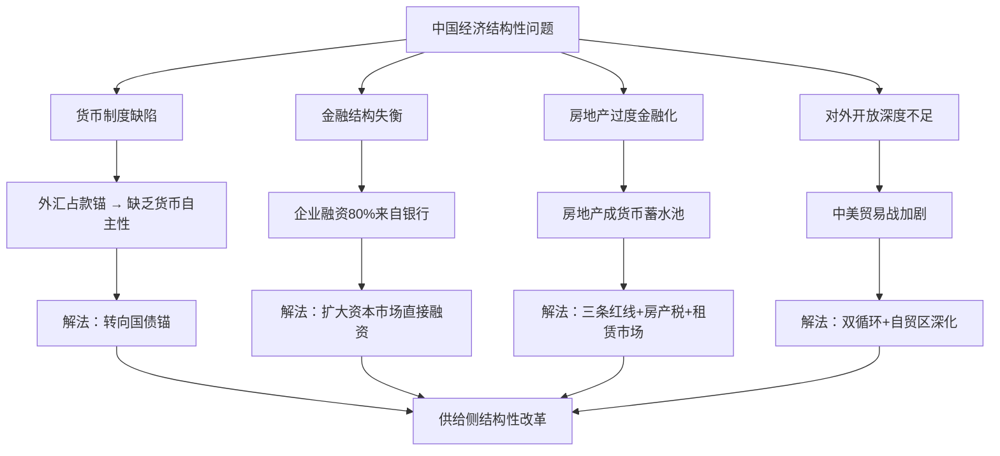

## 《分析与思考——黄奇帆的复旦经济课》读书笔记
  
### 作者  
digoal  
  
### 日期  
2026-05-25  
  
### 标签  
读书笔记 , 分析与思考——黄奇帆的复旦经济课   
  
----  
  
## 背景  
   
---
书名: 《分析与思考——黄奇帆的复旦经济课》   
作者: 黄奇帆   
出版年份: 2020   
出版社: 上海人民出版社   
笔记日期: 2026-05-25   
豆瓣链接: https://book.douban.com/subject/35149551/   
豆瓣评分: 9.2   
标签: [中国经济, 宏观调控, 货币制度, 资本市场, 房地产, 中美贸易]   
---

   
### ——一个"做过市长"的经济学家，如何解剖中国经济？

> **一句话**：这是一本由实操派官员写就的中国经济诊断书，用"问题—结构—对策"三板斧，把货币、资本、房地产、中美博弈一一拆开来看。   
>   
> **适合谁读**：想真正读懂中国经济政策逻辑的人；在A股里迷失方向的投资者；对"供给侧改革"只知其名不知其义的读者。   
>   
> **阅读难度**：⭐⭐⭐☆☆（有基础经济学知识者顺畅阅读，完全零基础稍有门槛）   
>   
> **推荐指数**：⭐⭐⭐⭐⭐   

---

## 一、时代坐标：这本书从哪里来？

2020年，中国站在一个特殊的历史十字路口：中美贸易战进入深水区，新冠疫情刚刚冲击全球供应链，国内经济下行压力与高债务风险并存，资本市场改革迟迟未能突破——几乎所有人都感到困惑，中国经济接下来该怎么走？

就在这个时候，68岁的黄奇帆走进了复旦大学的演讲厅。

黄奇帆是一个罕见的人物。他在上海工作长达33年，深度参与了浦东新区的早期开发；后来担任重庆常务副市长、市长长达十余年，主导了一系列轰动性的金融重组与产业升级，被称为"金融市长"和"重组大师"。退休之后，他没有写回忆录，而是把自己数十年的从政经验，系统转化成了经济学讲座。

这本书就是这12次复旦讲座的合集。它既不是纯学术论文，也不是政策宣传手册，而是一种独特的"官员经济学"——用政策操盘者的视角，去解读经济运行的底层逻辑。

```
时间轴：黄奇帆的三个身份

1980s-2001年       2001-2017年        2020年
  上海浦东    →     重庆市长    →    复旦讲堂
 "开发者"          "操盘手"          "解局者"
  参与改革          主导改革           解释改革
```

这个时间节点，也意味着这本书有一个特殊的使命：**在中国经济最需要方向感的时刻，提供一套有内在逻辑的坐标系**。

---

## 二、核心命题：作者在说什么？

全书12讲，看似分散，实则有一根暗线串联：**中国经济的核心问题，是结构性问题，而不是周期性问题；解决之道，是供给侧结构性改革，而不是需求端大水漫灌**。

围绕这条主线，黄奇帆展开了三个层次的核心命题：

---

### 命题一：中国货币制度亟需转型——从"外汇锚"走向"国债锚"

这是全书最具前瞻性、也最有争议性的观点。

过去二十多年，中国的基础货币主要是通过"外汇占款"来发行的——出口创汇越多，人民币发行量就越大。这在出口高速增长时期有其合理性，但也埋下了深层隐患：货币政策的主动权实际上被绑定在了贸易顺差的规模上。顺差大时，流动性泛滥，推高通胀和房价；顺差收窄时，市场缺钱，利率飙升，出现"钱荒"。

黄奇帆认为，未来中国应当转向以"国债"为锚的主权信用货币制度。央行通过购买国债来投放货币，货币发行量与GDP增速、通胀率挂钩，真正实现货币政策的自主性。这不仅能平滑经济周期，也为人民币国际化提供制度支撑。

这个观点，在2020年时还属于政策边缘讨论；而到2024-2025年，央行开始逐步在二级市场操作国债，这一转型已然悄然启动。**黄奇帆的这个判断，提前五年说准了政策方向。**

---

### 命题二：中国资本市场的根本病灶是"间接融资过重、直接融资过轻"

黄奇帆有一个一针见血的诊断：中国企业负债率长期偏高，根源不在企业本身，而在于金融结构失衡——企业80%以上的融资来自银行贷款，股市、债市等直接融资渠道严重不足。

这种结构造成了一个恶性循环：企业高负债→银行风险集中→稍有风吹草动就引发系统性风险。而解法也很清晰：扩大股票市场规模，引入长期机构资金（养老金、保险资金），让企业能够通过股权融资降低杠杆率。

书中提出了一个令人印象深刻的标准：**一个健康的资本市场，股票总市值应该约等于GDP规模**。以此衡量，中国当时的股市规模远远不够，还有巨大的发展空间——这也是资本市场改革不是可选项，而是必选项的深层逻辑。

---

### 命题三：房地产的核心是"去金融化"，不是打压，而是归位

房地产是黄奇帆着墨最多、也最具操作性的章节。他的核心判断是：中国房地产的问题，不是房子太多或太少，而是房地产被过度金融化——成了货币蓄水池和金融投机工具，而不是真正服务于居住需求的民生产品。

他早在2015-2016年就提出了"房地产三条红线"的概念框架（开发商的负债率、现金短债比、净负债率），这与2020年国家正式推出的"三道红线"政策惊人吻合。这不是巧合，而是一个长期浸淫地方经济的实践者，对系统风险的精准预判。

黄奇帆认为，房地产的出路在于：土地供给结构改革（增加租赁用地）、税收杠杆调节（房产税）、打通新市民住房需求。**让房子回归居住属性，是手段，不是目的；目的是让资本从房地产流向实体经济。**

---

## 三、论证地图：作者怎么说服你的？



黄奇帆最擅长的论证方式有三种：

**用数字逼死人**：他记忆力惊人，讲座中随口引用几十个精准数据，M2增速、GDP平减指数、外汇占款比例……这些数字不是装饰，而是论证的支柱。读者几乎无法从数据层面找到漏洞。

**用案例说话**：他本人就是案例。重庆金融不良资产从30%压降到4%，重庆电子信息产业集群化崛起，这些都是他亲历操盘的案例，有血有肉，说服力远超纯理论推演。

**用比较做参照**：他频繁对比美国、日本、欧洲的经验教训，尤其是2008年金融危机的处置逻辑，用横向比较来论证中国的政策选择是否正确。

---

## 四、前提假设与边界：什么情况下这不成立？

黄奇帆的论证框架建立在几个隐含假设之上，值得仔细检视：

**假设一：政府有能力实现精准调控。**
书中大量论述依赖于"政策设计合理→执行到位→效果显现"的逻辑链。但现实中，政策的执行层层衰减是常态，地方政府的利益博弈也会扭曲政策初衷。黄奇帆本人在重庆的成功，或许在很大程度上依赖于他个人超强的执行力和特殊的政治资本，不一定具备可复制性。

**假设二：中国经济问题主要是结构性的，而非体制性的。**
黄奇帆的分析始终在"优化现有体制"的框架内展开，对产权保护、市场竞争中性、民营经济信心等深层制度问题着墨不多。而许多经济学家认为，这些恰恰是中国经济更难突破的约束。

**假设三：人口红利的消退不会根本性改变经济逻辑。**
这本书出版于2020年，彼时人口问题尚未成为主流议题。但到了2026年，人口负增长、消费不足、通缩压力，已经成为新的核心变量。书中对需求侧问题的讨论相对薄弱，这是时代局限，也是边界所在。

---

## 五、思想谱系：这本书在哪个传统里？

黄奇帆的经济思想，难以用单一标签定义。他不是纯粹的凯恩斯主义者（他反对大水漫灌），也不是芝加哥学派信徒（他不信任完全自由市场），更接近于**"有为政府+有效市场"的中国本土混合经济学派**。

在思想谱系上，他与以下几位学者有明显的对话关系：

- **林毅夫**：同样强调产业政策与结构性改革，但黄奇帆更侧重金融与财政机制，而非比较优势理论。
- **吴敬琏**：同样批判金融过度脱实向虚，但吴更强调市场化方向的彻底性，黄则更注重操作层面的渐进路径。
- **兰小欢（《置身事内》）**：两本书常被并列推荐，都是解读中国政府经济逻辑的力作，但《置身事内》更侧重学术框架，《分析与思考》更具操盘者的现场感。

```
中国经济学思想谱系（简图）

完全市场化 ←————————————————→ 政府主导
           张维迎  吴敬琏  黄奇帆  林毅夫
                           ↑
                    本书所在位置
                  （实用主义混合派）
```

---

## 六、我学到了什么？

读完这本书，最大的冲击不是某个具体观点，而是**一种思考问题的方式**：面对任何经济现象，先问"结构是什么"，再问"机制是什么"，最后才问"对策是什么"。这套"问题—结构—对策"的框架，让黄奇帆在面对复杂问题时总能找到切入点。

第一个收获：**货币不是中性的工具**。货币如何发行、以什么为锚、通过什么渠道进入经济，这些问题决定了经济体的血液循环是否健康。过去我以为"钱多了就通胀"是货币政策的全部，读完之后才意识到，货币与实体经济之间的传导机制，才是真正值得关注的核心。

第二个收获：**理解中国政策，要从"结构约束"出发**。很多政策初看匪夷所思，放到具体的结构背景下就豁然开朗。比如"去杠杆"为何如此重要？因为高杠杆叠加低效资产配置，是系统性风险的温床。比如为何要推动注册制改革？因为资本市场结构不改变，就无法真正降低全社会融资成本。

第三个收获：**实践经验是最好的经济学教材**。黄奇帆的洞见，来自于真实世界的摸爬滚打。他处理过重庆六百亿坏账，亲手搭建过产业集群，操盘过大量企业重组。这种经验，让他的判断有一种学院经济学家缺乏的质感。

---

## 七、举一反三：这个框架还能用在哪？

**"问题—结构—对策"框架，在商业世界同样适用。**

看一个企业是否值得投资，不要先看利润表，先问：这家公司所在行业的结构性问题是什么？它的商业模式是在解决问题，还是在利用问题？它的护城河来自结构性优势，还是一时的市场错误定价？

看个人职业发展，也可以用同一框架：你所在的行业，结构性问题是什么？你的技能配置，是在强化稀缺性，还是在随波逐流？应对变化的对策，是被动适应还是主动预判？

黄奇帆在书中一再强调：**金融的本质是为实体经济服务**。这句话看似平常，却是一把锋利的剃刀——凡是脱离实体、自我循环的金融活动，迟早会出问题。这个判断，在过去五年的中国经济现实中被一再验证。

---

## 八、批判与反思

读这本书，有一种感受难以回避：**这是一本自信过头的书**。

黄奇帆的判断大多清晰、果断、充满自信，鲜少在书中表达"我也不确定"或"这个问题目前还没有答案"。这固然来自他丰富的实操经验，但也让人隐隐担忧：经济现实远比任何模型都复杂，过度自信的政策设计者，往往也是风险的制造者。

重庆的"黄奇帆模式"成就斐然，但重庆金融体系在他离任后暴露出的若干风险隐患，也提醒我们：一套依赖强人意志的体系，其可持续性值得追问。

此外，书中对民营经济的关注明显不足。2020年之后，民营企业信心的坍塌成为中国经济最大的变量之一，而这个问题在本书的分析框架中几乎缺席。宏观结构再优化，如果微观主体丧失活力，依然是竹篮打水。

最后，这本书的底色是乐观的——相信政策可以解决问题，相信改革可以推进，相信中国经济有足够的韧性。这种乐观在2020年或许有充足依据，但在今天，值得打一个问号：当外部环境急剧恶化、内部动力明显减弱，仅靠精准的结构性改革，能否真正走出困境？

---

## 九、金句与记忆点

> **"市长只是个职务，研究经济学是终身的。"**
> ——黄奇帆自述。这句话道出了他写这本书的心态：不是总结，而是继续。

> **"没有信用就没有杠杆，没有杠杆就没有风险。"**
> ——金融逻辑的最简洁表达。理解了这条链条，就理解了所有金融危机的底层机制。

> **"供给侧结构性改革，是改革开放的魂。"**
> ——这是本书的核心命题。改革不是修补，而是重构经济的供给结构。

> **"一切金融活动的目的，是为实体经济服务。"**
> ——这是黄奇帆反复强调的价值判断，也是他评判所有金融政策的终极标准。

> **"问题—结构—对策。"**
> ——全书的方法论内核。面对任何复杂问题，先找结构，再谈出路。

> **"房地产不是洪水猛兽，但它不应该成为货币的蓄水池。"**
> ——对房地产问题的精准定性，把"打压"与"归位"区分得很清楚。

> **"资本市场的规模，应当大致等于GDP。"**
> ——一个简洁的衡量标准，让人对资本市场的发展空间有直觉性认识。

---

## 十、延伸阅读

**《置身事内》兰小欢**
同样解读中国政府经济逻辑，但学术框架更清晰，适合对理论框架感兴趣的读者。与本书并列阅读，互补效果绝佳。

**《结构性改革：中国经济的问题与对策》黄奇帆**
本书的姊妹作，黄奇帆在退休后的延伸思考，对本书的很多主题有更深的展开。

**《刚性泡沫》朱宁**
专门讨论中国隐性担保与系统性金融风险，与本书在房地产和金融章节形成很好的对话，诺贝尔经济学奖得主罗伯特·席勒作序推荐。

**《货币论》凯恩斯**
想从经典文本出发理解货币制度的读者，这本书提供了理论底色，有助于更深入地理解黄奇帆对货币锚转型的论述。

**《大国大城》陆铭**
从城市化与空间经济学的角度解读中国经济，与黄奇帆的房地产与城市化论述形成有趣的张力——两人的政策建议有时方向一致，有时却有微妙的分歧。

---

*笔记写于 2026-05-25 | 基于公开资料与深度思考整理*
*本文所有观点为读书心得，不构成任何投资建议*
  
  
#### [PostgreSQL 解决方案集合](../201706/20170601_02.md "40cff096e9ed7122c512b35d8561d9c8")
  
  
#### [德哥 / digoal's Github - 公益是一辈子的事.](https://github.com/digoal/blog/blob/master/README.md "22709685feb7cab07d30f30387f0a9ae")
  
  
#### [About 德哥](https://github.com/digoal/blog/blob/master/me/readme.md "a37735981e7704886ffd590565582dd0")
  
  

  
