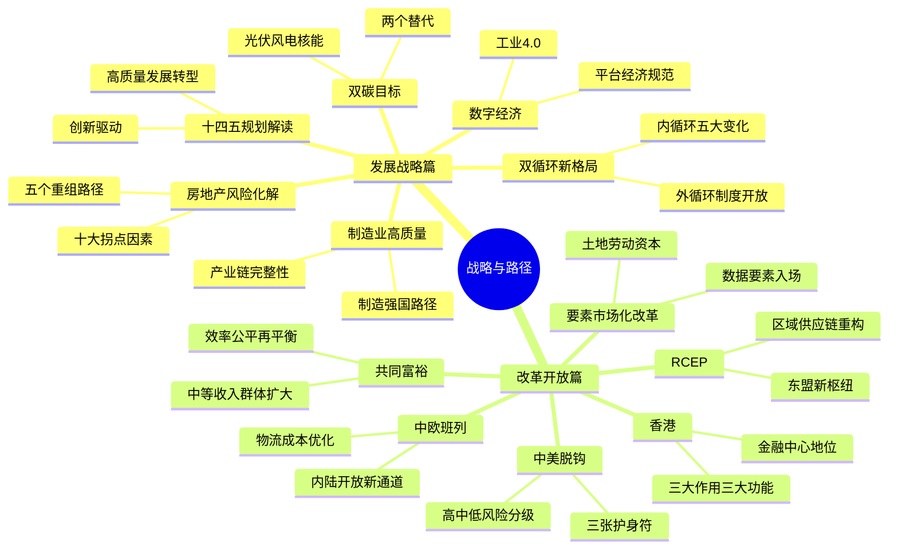

## 《战略与路径：黄奇帆的十二堂经济课》读书笔记
  
### 作者  
digoal  
  
### 日期  
2026-05-26  
  
### 标签  
读书笔记 , 战略与路径：黄奇帆的十二堂经济课   
  
----  
  
## 背景  
   
---
书名: 《战略与路径：黄奇帆的十二堂经济课》   
作者: 黄奇帆   
出版年份: 2022   
出版社: 上海人民出版社   
笔记日期: 2025-05-26   
豆瓣链接: https://book.douban.com/subject/36085424/   
ISBN: 9787208178212   
标签: [中国经济, 宏观政策, 双循环, 共同富裕, 中美关系, 政策解读]   
---

   
## ——一位前市长的政策解码课

> **一句话**：这是一本帮你用"体制内视角"读懂中国经济棋局的工具书，作者是同时拿到过政策制定权和实操权的极少数人之一。   
>   
> **适合谁读**：想看懂国家政策逻辑的商人、创业者、投资人；对"为什么政府这么决策"感到困惑的普通人；希望了解中国宏观经济框架的任何人。   
>   
> **阅读难度**：⭐⭐☆☆☆（语言通俗，结构清晰，无需经济学背景）   
>   
> **推荐指数**：⭐⭐⭐⭐☆   

---

## 一、时代坐标：这本书从哪里来？

2020—2021年，中国正处在一个罕见的历史叠加期：

- 新冠疫情打乱全球供应链，"全球化红利"第一次系统性退潮
- 中美贸易战从关税战升级为科技战、金融战
- 国内房地产高杠杆风险开始集中暴露
- "十四五"规划发布，官方正式提出"双循环"新发展格局
- 碳达峰碳中和目标被写入顶层文件

正是在这个内外压力同时到来的历史窗口，黄奇帆以复旦大学特聘教授身份开讲了这十二堂课。

黄奇帆何许人也？他在上海工作33年，在重庆主政15年（2001—2016），是中国官员体系里罕见的"政策学者型官员"。吴晓波曾评价他是继吴敬琏、周小川之后，最懂中国经济运作的策略型学者之一。他不仅能在市长层面决策，还能讲清楚"为什么这样决策"——这种能力在官员群体中极为稀缺。

这本书不是在书斋里写成的，它是行动者的复盘。黄奇帆讲的每一个政策，他都亲身经历过执行的艰难；他分析的每一个风险，他都曾在现实中摸索着应对。这是它最大的价值所在。

```
时代背景时间轴
────────────────────────────────────────────────────────
2018   中美贸易战爆发
  │
2020   新冠疫情 → 全球供应链断裂 → 黄奇帆开始授课
  │    "十四五"规划发布 → 双循环正式确立
  │
2021   碳达峰碳中和路线图出台
  │    恒大危机爆发 → 房地产拐点来临
  │
2022   本书出版（课程录整理成书）
  │
现在   书中预判逐一接受检验
────────────────────────────────────────────────────────
```

---

## 二、核心命题：作者在说什么？

全书十二章，貌似分散，实则贯穿着三条主线：

### 命题一："外循环为主"的旧引擎正在失速，内循环是战略必答题

过去四十年，中国经济靠"出口导向+外资引进"的外循环模式高速增长。但这个模式有两个结构性问题正在浮现：第一，随着中国劳动力成本上升，低端制造的比较优势正在消退；第二，美国主导的国际分工体系开始把中国视为竞争对手而非合作伙伴，把高技术列入管制清单。

黄奇帆以日本为镜鉴——1970年代日本成为世界第二后，出口占GDP比重从70%降到25%，内需开始接棒。中国正走到类似的历史转折点。构建以内循环为主体的新格局，不是被动挨打的退守，而是历史阶段使然的主动转型。

### 命题二：共同富裕不是均贫富，而是扩大中等收入群体

书中对"共同富裕"的解读是全书最有价值的部分之一。黄奇帆明确区分了两种误读：一是把共同富裕当成"杀富济贫"；二是以为这是一蹴而就的短期目标。

他的判断是：过去四十年"效率优先、兼顾公平"推动了经济总量的快速增长；下一阶段要在高质量发展中逐步实现共同富裕，核心路径是做大蛋糕的同时优化分配机制，重点是把14亿人口的中间层做厚。这是一个分阶段、有节奏的系统工程，而不是政治运动。

### 命题三：中美脱钩是真实风险，但中国有三张"护身符"

这是书中最受关注的章节。黄奇帆把中美脱钩分为高、中、低三类风险领域：

- **高风险**：科技脱钩、互联网脱钩、国际清结算体系（SWIFT）脱钩
- **中风险**：贸易、投资、资本市场、教育人文交流
- **低风险**：金融机构合作、外汇市场、国际经贸规则体系

而中国应对脱钩的底气，来自三张"护身符"：资本项下人民币管制（对冲资本冲击的盾牌）、外资在华巨量资产（应对资产冻结的筹码）、超大规模贸易体量（应对外汇脱钩的金钟罩）。这个分析框架在2022年至今依然有解释力。

---

## 三、论证地图：作者怎么说服你的？



黄奇帆最擅长的论证方式，是**用数字建立坐标**。比如他谈房地产，不是泛泛说"有风险"，而是指出物流成本占中国GDP的15%，而欧美只有7%——这个差距就是内循环的堵点。谈双碳目标，他会具体到特高压技术的损耗率（1.5%）、胡焕庸线两侧的人口与资源分布。这种数字化的分析方式，是从官员实践中磨砺出来的，不是书斋里的纸上谈兵。

他的研究方法是一贯的**"问题—结构—对策"三段法**：先把问题讲清楚，再拆解其内在的结构性关系，最后给出具体路径。这让即便是不懂经济学的读者，也能跟着逻辑走。

---

## 四、前提假设与边界：什么情况下这不成立？

读这本书，有几个隐含前提值得保持清醒：

**假设一：政策能被有效执行。** 黄奇帆的分析建立在"中央决策—地方执行"链条基本通畅的假设上。但现实是，要素市场化改革、土地制度改革、共同富裕的税收调节机制，每一项都面临巨大的地方利益博弈。书中更多展示了"应该怎么做"，对执行难度着墨不多。

**假设二：外部环境不会急剧恶化。** 书的写作时间是2020—2021年，当时中美博弈激烈但尚有一定边界。2022年以后，俄乌战争、芯片法案、新一轮关税战的升级，让外部环境比书中预判的更为严峻。书中的一些"中风险"已经往高风险区间移动。

**假设三：房地产能软着陆。** 黄奇帆明确提出房地产需要"软着陆"，并设计了"五个重组、五个转变"的路径。但2022年之后恒大、碧桂园等巨头的连续暴雷，说明这场着陆比预期更颠簸。

这三个假设的局限性，并不是批评作者，而是提醒读者：这是一本"政策视角"的书，不是"市场预测"的书。它告诉你政府想怎么做，而不是市场最终会怎么走。

---

## 五、思想谱系：这本书在哪个传统里？

黄奇帆的思想既不属于新古典自由主义（他相信政府有积极作用），也不是简单的凯恩斯主义（他对市场配置资源持明确尊重态度）。用他自己的话说，是"市场这只看不见的手和政府这只看得见的手协调配合、相得益彰"。

这套思维，跟吴敬琏的"市场化改革主义"有传承，也跟林毅夫的"新结构经济学"有所呼应——都重视政府在特定发展阶段的主导作用，但并非计划经济的复归。

他的著作系列构成了一个完整的研究体系：
- 《结构性改革》（2020）：中国经济问题与对策的总论
- 《分析与思考》（2021）：复旦经济课第一辑，更多宏观基础理论
- **《战略与路径》（2022）**：聚焦"十四五"热点议题，政策解读为主

三本书连起来读，能看到一个学者型官员从基础理论到顶层战略的完整思考路径。

---

## 六、我学到了什么？

读完这本书，有三点真实的收获：

**第一，读懂政策文件的"解码器"。** 中国政府的政策文件习惯用宏观表述，很多人觉得是套话。黄奇帆这本书最大的作用是，告诉你那些宏观词汇背后的具体经济逻辑。比如"双循环"不是口号，它背后是"外部压力+内部消费升级"的双重驱动逻辑；"共同富裕"不是均贫富，它背后是"中等收入群体扩大才能撑起内需"的经济学推断。掌握这个解码器，读任何政策文件都会更有底气。

**第二，数字思维的重要性。** 黄奇帆每次分析，都会给出一组精确的数字来建立坐标——不是"差距很大"，而是"我们15%，人家7%"；不是"增长很快"，而是"翻了几倍，降到了多少"。这种用数字固定讨论边界的思维方式，对做任何复杂问题的分析都有参考价值。

**第三，"软着陆"思维值得借鉴。** 房地产那一章让我印象最深。黄奇帆不是说"房地产要完了"，也不是说"房价会一直涨"，而是系统梳理了"为什么会到拐点"和"怎么才能尽量少死人地过渡到新常态"。这种在承认问题的前提下设计路径的思维方式，比简单的悲观或乐观都要有价值。

---

## 七、举一反三：这个框架还能用在哪？

**场景一：企业战略规划**。黄奇帆的"问题—结构—对策"三段法，是做战略分析的通用框架。先定义清楚问题是什么，再拆解内在结构和约束条件，最后才谈路径选择。这比"头脑风暴→找解法"的常见模式要严谨得多。

**场景二：理解行业政策风险**。书中对房地产、互联网、制造业的政策走向分析，可以作为模板，用同样的逻辑去分析你所在行业可能面临的政策变量——政府想要什么结果？有哪些现实约束？短期和长期目标是否存在张力？

**场景三：理解"中国速度"的底层逻辑**。书中反复出现一个视角：中国政府是一个"有计划有定力也有执行力"的组织，它的重大决策不是一时冲动，而是有阶段性目标、有资源配套、有退路设计的系统工程。用这个视角理解中国，比把政府决策当成"随机信号"要准确得多。

---

## 八、批判与反思

作为普通读者，有两点保留意见：

**一是政策乐观主义的倾向。** 书中对国家政策的基本预设是正面的——"只要方向对，执行到位，问题就能解决"。但现实中，政策执行的摩擦成本、利益集团的阻力、改革窗口期的把握，往往比书中呈现的更复杂。黄奇帆在重庆的实践成功，有个人能力的因素，也有特定历史窗口的因素，不是每个地方的官员都有条件复制。

**二是个体维度的缺位。** 这十二堂课是宏观视角的俯拍，几乎没有从普通人的角度谈问题。比如谈共同富裕，更多是经济结构调整的路径，对普通家庭"怎么在这场转型中保护自己的资产、把握机遇"的指引几乎没有。这不是批评，而是提醒：这是一本"政策解读书"，不是"个人财富指南"，读者需要自己完成从宏观到个体的转译。

时间是最好的检验者。2022年写成的书，在2025年回头看，部分预判已经被验证（双循环确立、制造业升级加速、碳中和稳步推进），部分路径比预期更曲折（房地产软着陆变成了硬着陆的过渡期，中美脱钩的烈度超预期）。这种接受现实检验的过程，本身就是读这本书最有趣的维度。

---

## 九、金句与记忆点

> **1. "问题—结构—对策"**
> 黄奇帆的分析方法论。遇到任何复杂问题，先问"这是什么问题"，再问"内在结构是什么"，最后才谈"怎么解决"。避免了直接跳到解决方案的思维陷阱。

> **2. "外循环为主到内循环为主，是历史阶段使然，不是被迫退守"**
> 日本的先例已经证明：当一个国家成为世界前两名时，靠出口拉动经济的模式会自然衰减，内需接棒是必然路径，不是失败。

> **3. "物流成本占GDP的15%，欧美是7%"**
> 内循环最大的堵点之一。这个数字把"打通国内大循环"从口号变成了具体的优化目标。

> **4. "高风险脱钩三件事：科技、互联网、国际清结算"**
> 简单清晰的风险分级。科技断供（芯片）是目前已经落地的高风险，SWIFT剔除是俄罗斯已经经历过的风险，这两点今天看比2021年写作时更有紧迫感。

> **5. "共同富裕不是均贫富，是做厚中间层"**
> 一个让人从恐慌中冷静下来的判断。共同富裕的经济学逻辑，是扩大中等收入群体以支撑内需，而不是削峰填谷式的财富再分配。

> **6. "脱钩护身符：资本管制、外资在华资产、贸易体量"**
> 三张牌，三重保障。理解这三点，才能理解为什么中国在应对外部金融压力时有底气。

> **7. "房价涨跌取决于十大因素，不是一个因素"**
> 对抗"房价一定涨/一定跌"的简单化叙事。影响房价的是一个复杂系统，供给、人口、货币、政策缺一不可。

---

## 十、延伸阅读

**1.《分析与思考：黄奇帆的复旦经济课》（黄奇帆，2021）**
本书的上一本，侧重宏观经济基础理论，与《战略与路径》配套读效果更佳。

**2.《结构性改革：中国经济的问题与对策》（黄奇帆，2020）**
黄奇帆著作系列的第一本，偏重改革实践，有大量重庆实操案例，适合想了解"政策如何落地"的读者。

**3.《置身事内：中国政府与经济发展》（兰小欢，2021）**
同样是解读中国政府与经济关系的优秀作品，视角更学术，与黄奇帆的实操视角互为补充，两本一起读可以建立更立体的认知。

**4.《新结构经济学》（林毅夫，2012）**
黄奇帆思想的理论源流之一。理解政府在经济发展中的比较优势理论框架，有助于更深入地理解本书的立场。

**5.《世界是平的》（托马斯·弗里德曼，2005）**
作为参照系而非批评对象——这本书代表了"全球化红利时代"的乐观主义；黄奇帆的《战略与路径》则是在"全球化退潮"背景下如何重新布局的思考。两本对比读，能感受到历史大转折的质感。

---

*笔记写于 2025年5月26日 | 基于公开资料、书评与深度思考整理*
*本书出版于2022年10月，部分预判已可用现实检验，建议结合当下形势对照阅读*
  
  
#### [PostgreSQL 解决方案集合](../201706/20170601_02.md "40cff096e9ed7122c512b35d8561d9c8")
  
  
#### [德哥 / digoal's Github - 公益是一辈子的事.](https://github.com/digoal/blog/blob/master/README.md "22709685feb7cab07d30f30387f0a9ae")
  
  
#### [About 德哥](https://github.com/digoal/blog/blob/master/me/readme.md "a37735981e7704886ffd590565582dd0")
  
  

  
