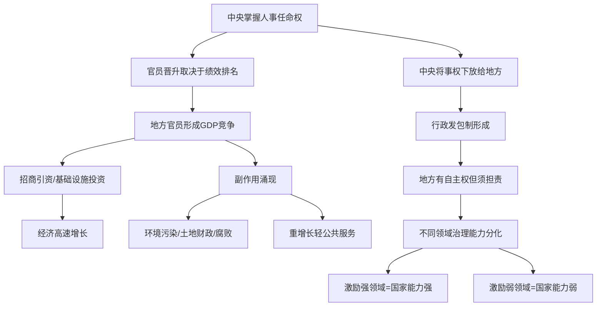

## 《转型中的地方政府：官员激励与治理》读书笔记
  
### 作者  
digoal  
  
### 日期  
2026-05-26  
  
### 标签  
读书笔记 , 转型中的地方政府：官员激励与治理   
  
----  
  
## 背景  
   
---
书名: 《转型中的地方政府：官员激励与治理（第二版）》  
作者: 周黎安  
出版年份: 2017（第二版）/ 2008（第一版）  
笔记日期: 2026-05-26  
出版社: 格致出版社 / 上海三联书店 / 上海人民出版社  
ISBN: 9787543227651  
标签: [政治经济学, 中国经济, 地方政府, 官员激励, 制度分析, 晋升锦标赛, 行政发包制]  
---

  
## ——用一把钥匙，开中国奇迹的锁

> **一句话**：中国的经济奇迹，不是市场自发秩序的产物，而是一套独特的政治激励机制驱动的结果——地方官员的仕途，被绑在了GDP的战车上。  
>  
> **适合谁读**：对中国经济增长感到困惑的人；公共政策、政治学、经济学学生；想真正理解"为什么地方政府这么拼"的人  
>  
> **阅读难度**：⭐⭐⭐⭐☆（有经济学基础更好，但无基础也能读懂主线）  
>  
> **推荐指数**：⭐⭐⭐⭐⭐  

---

## 一、时代坐标：这本书从哪里来？

二十世纪八九十年代，西方主流经济学界流行一个诊断：社会主义国家的转型，只有"休克疗法"一条路——迅速私有化、市场化、建立法治，否则就是失败。这套处方在东欧和俄罗斯被大规模实施，结果惨烈：俄罗斯GDP在1990年代腰斩，社会剧烈动荡。

与此同时，中国走了一条奇异的路：没有全面私有化，没有政治体制的根本变革，党政体制几乎原封不动，却创造了长达三十年的高速增长。这是西方标准理论无法解释的"异类"。

面对这个谜，学界出现了两种反应：一是否认，认为数据有水分、增长不可持续；二是解释，试图找到中国独特的制度逻辑。周黎安属于后者。

2004年，他在《经济研究》发表了"晋升锦标赛"的早期论文，引发广泛关注。2008年出版本书第一版，将这一理论体系化。2017年第二版在原有基础上加入了"行政发包制"的完整论述和对十八大后新形势的分析，构成了迄今为止中国地方政府政治经济学最完整的理论框架之一。

周黎安本人的背景极为重要：北大经济学本硕、斯坦福经济学博士。他是少数能同时驾驭西方主流经济学工具（委托代理、博弈论、计量实证）和对中国体制有深刻本土感知的学者。这本书的价值，恰恰在于这两种能力的结合。

```
时间轴：这本书的来处

1978 ──── 改革开放：财政包干、乡镇企业兴起
  │
1994 ──── 分税制改革：中央收权，土地财政萌芽
  │
2004 ──── 周黎安发表"晋升锦标赛"核心论文
  │
2008 ──── 本书第一版：建立系统理论框架
  │
2012 ──── 十八大后：反腐、淡化GDP考核
  │
2017 ──── 第二版：加入行政发包制、回应新变化
```

---

## 二、核心命题：作者在说什么？

周黎安的核心贡献，是用两个相互咬合的概念，打开了中国地方治理这个"黑箱"。

### 命题一：晋升锦标赛——让官员拼命的隐形发动机

这是本书最著名、引用最广的概念。其逻辑如下：

在中国，地方官员的人事任命权高度集中于上级。地方党政一把手能否晋升，很大程度上取决于其治下的经济表现——尤其是GDP增速和财政收入，相对于同级竞争者的排名。这就构成了一场"锦标赛"：赢者晋升，输者淘汰或原地踏步。

这套机制有几个关键特征：

**强激励**：晋升意味着权力、薪酬、地位的巨大跃升；落败意味着仕途终结。奖惩落差极大，激励极强。

**可比性**：中国是世界上极少数同时公布省、市、县四级GDP的国家，横向比较清晰，使得竞赛结果相对透明。

**内部封闭劳动力市场**：官员几乎只能在体制内晋升，外部机会极少，使他们不得不全力投入这场竞赛。

**结果**：地方官员有极强的动机去"发展经济"——招商引资、上马项目、修路建桥。这解释了为什么中国的地方政府普遍呈现出高度的行动能力和经济积极性，而同样政治体制的其他国家（如前苏联各共和国）地方政府却往往消极怠慢。

### 命题二：行政发包制——理解央地关系的底层逻辑

这是第二版新增的核心概念，也是周黎安理论的重大深化。

行政发包制的比喻来自市场中的"总承包商—分包商"关系：中央政府是总包方，将各种行政任务（招商引资、维护稳定、完成计划生育指标等）"发包"给地方政府；地方政府有较大的执行自由裁量权，但必须对最终结果负责，且须接受考核。

这解释了一个表面上的悖论：中国在政治上是高度中央集权的单一制国家，但在行政事务上却呈现出高度分权的实际状态。答案是：中央集中人事权（锦标赛的裁判权），但将事权大幅下放（发包）。

行政发包制与科层制（Weberian bureaucracy）和纯粹外包制都不同，是一种介于两者之间的独特混合体——保留了强激励，又维持了上级的政治权威。

### 命题三：两个机制的结合，解释"好"与"坏"

周黎安最有洞见的地方，在于他用同一套框架同时解释了中国经济增长的成就和弊病。

用一个2×2矩阵来理解：纵轴是"晋升激励强度"，横轴是"行政发包程度"。

```
              行政发包程度
              弱          强
晋升   强  │ 国家直管项目 │ 招商引资/防疫 │  ← 治理能力强
激励   弱  │ 高铁/核电  │ 食品安全/环保 │  ← 治理能力弱
```

食品安全、环境保护、基础教育——这些事务长期处于"晋升激励弱、行政发包强"的象限：地方政府有执行责任，但做好了不加分、做差了不扣分（或扣分有限），于是普遍敷衍。这正是中国这些领域长期存在系统性问题的制度根源。

相比之下，招商引资（晋升激励强、发包程度高）和重大国家工程（晋升激励弱但中央直管、发包程度低）则表现优异。

这是一个高度简洁却极具解释力的分析框架。

---

## 三、论证地图：作者怎么说服你的？



**关键数据支撑**：周黎安与合作者（Li & Zhou, 2005）用省级数据实证检验了"增长排名影响官员晋升概率"的假说，发现GDP增长绩效与省委书记、省长的晋升概率之间存在统计显著的正相关。这是该理论被广泛接受的重要基础。

**代表性案例**：乡镇企业的兴起与衰落，是本书反复援引的一个标本。1980年代，地方分权让乡镇政府有动力发展本地企业；财政包干制让乡镇留存收入；这两者结合，催生了乡镇企业的异军突起。但同样的机制，也在1990年代后期乡镇财政激励弱化后，导致了乡镇企业的整体萎缩——"看得见的手"，随激励的方向而动。

**论证方式评价**：周黎安采用了经济学家最擅长的路径——先建立简洁的理论模型，再用计量实证检验。理论部分的逻辑链条清晰，经得起推敲；实证部分受制于数据可得性，略有局限，但在国内同类研究中仍属严谨。

---

## 四、前提假设与边界：什么情况下这不成立？

这本书的理论优雅，但成立需要几个关键假设，值得审视。

**假设一：GDP考核是真实的、主导性的晋升标准**

部分研究者（如陶然等，2009年）对此提出质疑，认为实证数据并不稳健——影响晋升的因素众多，GDP增长只是其中之一，且存在"人情关系"、"政治背景"等难以量化的变量。事实上，十八大后中央明确提出"淡化GDP考核"，强调绿色发展、社会稳定等多元指标，这使得理论的现实适用性面临压力。

**假设二：官员是理性的"政治人"**

理论假设官员优先追求晋升，并为此最大化可考核的绩效指标。但现实中，有些官员到了仕途天花板后，可能转向其他目标（如腐败、安享太平）；有些则有真实的公共服务动机，不能用单一的"晋升激励"来概括。

**假设三：横向竞争是充分的**

理论成立的前提是各地官员之间能够实质性比较。但省份之间发展差距悬殊，西部省份和东部省份如何在同一尺度竞争？事实上，考核往往是分层、分区域的，这削弱了全国统一锦标赛的假设。

**时代边界**：这套框架最精准地描述的是2000年代前后的中国地方治理。随着十八大后的集权化趋势、反腐运动和数字化监管的兴起，地方官员的激励结构已发生深刻变化，"不作为"而非"乱作为"开始成为新的治理难题。周黎安在第二版中对此有所回应，但这一新变局仍是理论的待解之题。

---

## 五、思想谱系：这本书在哪个传统里？

周黎安的理论有清晰的知识谱系，来自几个方向的交汇：

**西方委托代理理论**：整套分析框架建立在信息不对称和激励设计的基础上，是经济学主流工具的直接应用。

**"市场维护型联邦制"（Market-preserving Federalism）**：钱颖一、温加斯特等人提出，分权的财政联邦制通过利益绑定让地方政府有动力维护市场。周黎安与此对话，但强调政治激励（晋升）比财政激励（分成）更根本，补充了这一理论的缺口。

**中国本土政治学传统**：王绍光等政治学家的"国家能力"研究，提供了周黎安分析国家能力强弱分化的问题意识。

**对后续研究的影响**：这本书已成为中国政治经济学领域的基础性文献，被国内外数千篇论文引用。它推动了整整一代经济学家去研究"官员激励与政府行为"，催生了大量关于官员晋升、土地财政、腐败、环保执法的实证研究。

```
思想影响谱系

           委托代理理论 (Holmstrom等)
                │
     市场维护联邦制 (钱颖一/温加斯特)
                │
           周黎安 (本书)
          ┌────┴────┐
    晋升锦标赛    行政发包制
          │            │
   大量实证研究     国家能力分析
   (官员行为/      (周黎安后续
    土地/腐败)       研究延伸)
```

---

## 六、我学到了什么？

**收获一：激励设计决定组织行为**

读完这本书，我对一个朴素的道理有了更深的理解：你怎么考核人，人就怎么做事。GDP排名决定仕途，官员就用尽一切手段拉高GDP。这个逻辑如此清晰，以至于让人不得不反思：任何组织——无论是政府、企业还是学校——设计激励机制时，如果只盯着单一的、可量化的指标，必然会产生"目标替代"：真正重要但难以测量的东西（教育质量、环境、社会公平）会被系统性忽视。

这不是中国特有的问题，而是所有大型组织的通病。只是在中国，体量之大、时间之长，使其后果格外显著。

**收获二：从"黑箱"到"机制"**

在周黎安之前，很多人描述中国地方政府像"黑箱"——知道输入（政策）和输出（增长），但不知道里面发生了什么。这本书强迫我们打开箱子，去看具体的激励、具体的官员、具体的决策逻辑。这种"机制思维"的训练比任何结论都更有价值。

**收获三：同一套制度可以同时解释成功与失败**

我最欣赏这本书的地方，在于它不是一本"歌颂书"也不是一本"批判书"。同一套晋升锦标赛机制，既解释了高速增长，也解释了环境污染、土地财政、官员腐败。这种两面性的、辩证的分析，比那些非黑即白的论断要诚实得多，也有用得多。

---

## 七、举一反三：这个框架还能用在哪？

**企业内部治理**：大公司的区域经理之间也存在类似的"锦标赛"——年终业绩排名决定奖金和晋升。理解周黎安的框架，有助于企业设计更合理的绩效考核体系，避免只盯短期可量化指标。

**学术界的"发文锦标赛"**：高校教师的晋升越来越依赖顶刊论文数量，结果导致"发文而非解决真实问题"的激励扭曲。这与地方官员的GDP锦标赛在结构上如出一辙。

**教育系统的应试逻辑**：学校以升学率排名，老师的绩效绑定考试分数，学生的激励完全导向可测量的指标。周黎安的框架可以帮助我们理解：为什么素质教育难以真正落地——激励机制不变，行为就不会变。

---

## 八、批判与反思

**一、理论的"成功偏差"**

这套框架在解释经济高速增长时最有说服力，但中国还有大量的"地方治理失败"案例——群体性事件、食品安全危机、环境污染、官员腐败——这些固然也能纳入框架（"激励不足的领域"），但整体感觉是：框架在解释"为什么成功"时更强，在解释"为什么失败以及失败边界在哪里"时略显捉襟见肘。

**二、忽略了"从下到上"的信号**

框架主要关注上级对下级的考核，但现实中地方治理的信息流动并非单向。民众的上访、媒体的曝光、社会的抗议，也在塑造地方官员的行为。这些"自下而上"的压力机制在书中着墨不多。

**三、时代在变，框架需更新**

2012年以来，中国治理格局发生了根本性变化：反腐高压、数字监控、党对一切的全面领导强化，以及在政策目标上从单纯经济增长转向更复杂的多维治理。在这一背景下，"地方官员自主性+晋升竞争"的故事是否仍然成立？地方政府是否在从"能动者"变成"执行机器"？这是周黎安第二版没能完全回答的问题，也是未来研究最迫切的命题。

---

## 九、金句与记忆点

1. **"晋升锦标赛"**：上级政府对多个下级政府行政长官设计的晋升竞赛，竞赛优胜者获得晋升。这不只是一个概念，而是理解中国增长逻辑的一把钥匙。

2. **"政治集权+经济分权"**：中国体制的核心特征。人事权集中于中央，事权分散给地方——这是悖论的解法。

3. **"行政发包制"**：政府内部上下级之间的"总包—分包"关系，既非纯粹科层制，亦非纯粹外包，是一种独特的混合治理形态。

4. **"为增长而竞争"**：周黎安与张军主编的另一本书的题目，也是对中国地方竞争本质最精炼的概括。

5. **"放手做事"→"束手做事"**：作者对中国治理转型的判断——传统体制是"放权激励、放手做事"，改革方向应是"公平透明问责、束手做事"。两种体制各有利弊，如何过渡，是最难的问题。

6. **"鞭打快牛"困境**：中央的激励承诺面临可置信性难题——如果你做好了，中央可能会提高标准甚至收回你的成果。这就像一位教师说"达到90分就加奖励"，但等你考了91分，他又把及格线改成95分。这种"承诺不可置信"问题贯穿整个财政体制演变史。

7. **"两个比重"**：1990年代初，财政收入占GDP的比重和中央财政占全国财政的比重持续下降，这是当时分权激励扭曲的集中体现，最终倒逼了1994年分税制改革。

---

## 十、延伸阅读

1. **《为增长而竞争》（张军、周黎安主编，2008）**
   周黎安理论的配套读本，汇集了该研究议题下的多篇实证论文，可作为本书的数据和案例扩展阅读。

2. **《中国的奇迹》（林毅夫、蔡昉、李周，1994）**
   从比较优势战略角度解释中国增长，与周黎安的政治激励路径形成有益对话，代表了中国经济学界对"增长之谜"的早期系统性尝试。

3. **《城乡中国》（梁鸿，2013）**
   从文学和田野调查的角度，提供了周黎安理论框架的"血肉"——那些被GDP考核驱动的地方政府，在基层究竟是如何与真实的人和社会互动的。

4. **《无声的革命》（魏昂德，Andrew Walder，英文）**
   从政治社会学角度研究中国的组织行为，与周黎安的经济学路径互为补充，理解中国体制需要两种视角的结合。

5. **《大国治理》（周黎安，论文集）**
   周黎安近年来在行政发包制、国家能力等议题上的延伸研究，是本书理论框架的最新发展和自我修正，代表了作者对自身理论的反思与更新。

---

*笔记写于 2026-05-26 | 基于公开学术资料、书评及深度研读整理*
*核心理论框架来自周黎安原著；批评性观点及延伸思考为笔记作者独立分析*
  
  
#### [PostgreSQL 解决方案集合](../201706/20170601_02.md "40cff096e9ed7122c512b35d8561d9c8")
  
  
#### [德哥 / digoal's Github - 公益是一辈子的事.](https://github.com/digoal/blog/blob/master/README.md "22709685feb7cab07d30f30387f0a9ae")
  
  
#### [About 德哥](https://github.com/digoal/blog/blob/master/me/readme.md "a37735981e7704886ffd590565582dd0")
  
  

  
