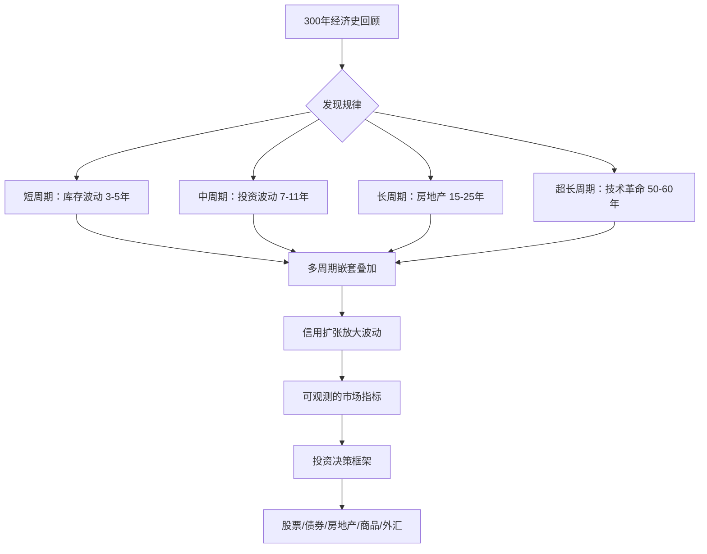
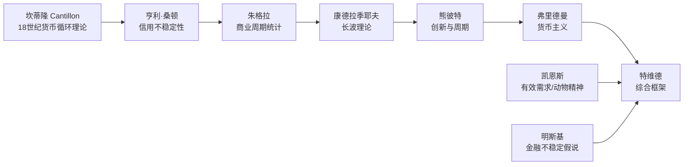

## 《逃不开的经济周期：历史、理论与投资现实》读书笔记
  
### 作者  
digoal  
  
### 日期  
2026-05-26  
  
### 标签  
读书笔记 , 逃不开的经济周期：历史、理论与投资现实   
  
----  
  
## 背景  
   
---
书名: 《逃不开的经济周期：历史、理论与投资现实》   
作者: 拉斯·特维德（Lars Tvede）   
译者: 董裕平   
出版年份: 2012（中信出版社中文版）   
笔记日期: 2026-05-26   
豆瓣链接: https://book.douban.com/subject/20272113/   
豆瓣评分: 8.6   
标签: [经济周期, 宏观经济, 投资, 金融历史, 周期理论]   
---

   

> **一句话**：周期不是偶发事件，而是市场经济的心跳——理解它，你就拥有了穿越繁荣与萧条的地图。   
> **适合谁读**：对宏观经济感兴趣的投资者、想搞懂"经济为什么涨了又跌"的普通人、对经济史有热情的读者   
> **阅读难度**：⭐⭐⭐☆☆   
> **推荐指数**：⭐⭐⭐⭐⭐   

---

## 一、时代坐标：这本书从哪里来？

2008年，全球金融危机像一枚深水炸弹引爆了整个世界经济体系。美国次贷市场的崩溃、雷曼兄弟的倒塌、随之而来的全球衰退……无数经济学家、政策制定者和投资者被打了个措手不及。人们愤怒地问：为什么没有人预警？为什么那么多"聪明人"没看到它的到来？

正是在这样的背景下，拉斯·特维德的这本书引发了广泛共鸣——它的英文原版《Business Cycles》早在危机前便已出版，却在危机后才真正找到了它应有的读者。

特维德本人是个有趣的混血儿：他拥有工程学硕士和国际商业学士双学位，在衍生品交易员、基金经理、投资银行家、高科技创业者之间来回切换，最终又以对冲基金合伙人的身份回归金融。他不是学院派的经济学家，而是一个在市场真枪实弹干过的人。这本书的底气，正来自于他在第一线摸爬滚打积累的现实感。

他想回答的问题很朴素：经济为什么会起伏？我们能预测它吗？如果能，投资者应该怎么用？

这三个问题，贯穿了全书428页。

---

## 二、核心命题：作者在说什么？

### 命题一：周期是市场经济的内生结构，不是外部冲击的产物

书中最震撼我的一句话来自熊彼特（Schumpeter）："周期并不像扁桃体那样，是可以单独摘除的东西，而是像心跳一样，是有机体的核心。"

特维德用300年的历史来证明这一点：从18世纪约翰·劳（John Law）在法国主导的纸币实验、密西西比泡沫的兴起与崩溃，到工业革命中的朱格拉投资周期，再到20世纪的大萧条与战后繁荣——每一次繁荣背后都埋藏着衰退的种子，每一次萧条中也孕育着下一轮的回升。周期不是外部冲击（战争、瘟疫、政策失误）强加给经济体的，而是由信用扩张、库存调整、固定资产投资的内在节律自发产生的。

### 命题二：经济有四个嵌套的周期，时间尺度各不相同

这是全书最有价值的分析框架。特维德整合了前人的研究，将经济周期梳理为四个层次：

| 周期名称 | 又称 | 时间长度 | 驱动力 |
|---------|------|---------|--------|
| 基钦周期（Kitchin） | 库存周期 | 3-5年 | 库存积累与去化 |
| 朱格拉周期（Juglar） | 投资周期 | 7-11年 | 固定资产投资 |
| 库兹涅茨周期（Kuznets） | 房地产周期 | 15-25年 | 建筑与房地产 |
| 康德拉季耶夫周期（Kondratieff） | 长波/康波 | 50-60年 | 技术革命+基础设施 |

四个周期并非独立运行，而是像钟表的齿轮一样相互咬合——当多个周期同时下行时，便会出现历史性的大萧条；当多个周期共振上行时，便是令人亢奋的"黄金时代"。2008年的危机，就是基钦、朱格拉与房地产周期三者同步下行的结果。

### 命题三：信用体系的内在不稳定性是周期的放大器

特维德花了大量笔墨讲述一个被主流教科书忽视的真相：信用体系天然具有自我强化的属性。繁荣时期，银行愿意放贷，企业愿意借贷，资产价格上涨又增加了抵押品价值，进一步刺激借贷——这是正向反馈。而当这个循环逆转，去杠杆、资产贬值、信用收缩会彼此叠加，形成螺旋式下降。"中央银行之父"亨利·桑顿早在1802年便已指出这种内在不稳定性，但200年后经济学主流仍然常常忽视它。

---

## 三、论证地图：作者怎么说服你？

特维德的论证策略是"历史案例 → 理论提炼 → 投资应用"的三段式。他不是从理论出发再找证据，而是先铺陈史实，让读者自己发现规律，再归纳理论，最后落地于实操。

这种叙事方式有个很大的优点：读者不会被学术术语吓跑，因为你是先看故事，再接受概念的。约翰·劳在巴黎发行纸币、密西西比公司股价飙涨再崩溃的故事，比任何教科书中对"通货膨胀"的定义都更有冲击力。

书中的关键数据论证包括：霍莫·霍伊特对芝加哥103年房地产数据的研究（得出18-20年房地产周期的结论）、巴布森对股票市场领先于经济的发现、以及危机前的五大预警信号（信贷过度增长、资产价格快速上涨、出借人激烈竞争、信贷标准放松、风险溢价收窄）。

---

## 四、前提假设与边界：什么情况下这不成立？

### 假设一：历史会重演，过去的周期长度可以外推

这是全书最脆弱的假设。特维德大量依赖历史统计规律，但正如统计学家乔治·博克斯所言："所有模型都是错的，但有些是有用的。"当结构性变量发生根本改变（例如全球化、数字经济、现代央行的主动干预），周期的时间长度和幅度都会发生变化。20世纪80年代以来，美联储"大缓和"政策使朱格拉周期的振幅显著收窄，这是历史回溯所无法预测的。

### 假设二：四种周期是相对独立且可识别的

在实际操作中，区分"我们现在处于哪个周期的哪个阶段"并不容易。周期的转折点只能在事后确认，实时判断往往充满争议。2012年，不少人认为房地产周期已触底，但很多国家的房地产又涨了十年。

### 假设三：理性的分析可以战胜市场的非理性

特维德写的是"应该如何"，但市场运行的是"实际如何"。凯恩斯早就说过，市场的非理性持续时间可以超过你保持偿付能力的时间。即使你判断对了周期位置，择时失误也可能导致投资失败。

**结论**：这套框架是理解宏观形势的优秀望远镜，但不是精确到季度的预测工具。

---

## 五、思想谱系：这本书在哪个传统里？

特维德是一个综合主义者，而非某一学派的信徒。他把奥地利学派（信用周期、利率扭曲）、凯恩斯主义（动物精神、流动性偏好）、货币主义（货币供给的周期性作用）和行为金融学（过度乐观/悲观）都纳入了自己的框架。

这种折衷主义有时会让理论纯粹主义者不满——他没有一个统一的"元理论"来解释所有周期——但对于投资实践者而言，这恰恰是优点：它更接近真实世界的复杂性。

在中文世界，这本书影响了一大批周期投资者，并为后来中国市场上"康波周期""朱格拉周期"概念的流行奠定了基础。

---

## 六、我学到了什么？

**第一个收获：学会用"层叠眼镜"看经济**

在读这本书之前，我看经济新闻像是看天气——每天的消息都在说"今天的晴雨"，但缺乏时间维度。现在我的脑子里多了一套"层叠眼镜"：同一件事，我会问它在哪个周期层次上发生意义。比如信贷扩张，在基钦周期里可能只是库存回补，但如果它同时出现在朱格拉周期的后半段和房地产周期的顶部，那性质就完全不同了。

**第二个收获：繁荣是萧条的因，不是反常状态**

这个认知颠覆了我的直觉。我过去总觉得"经济增长是常态，危机是意外"。但特维德用历史告诉我们：正是繁荣本身——过度的信用扩张、资产泡沫、杠杆堆积——孕育了危机。朱格拉的那句话"萧条的唯一原因是繁荣"，值得每个投资者反复回味。

**第三个收获：时间滞后是理解经济的核心变量**

房地产市场对利率的反应可能滞后一到两年，商业地产的开发周期可能长达十年。正是这些时间滞后，导致了人们在泡沫顶部仍然乐观（因为还没看到滞后的损害），而在底部仍然悲观（因为恢复的信号还被时滞掩盖）。理解时滞，就是理解"为什么大家总是踏错节奏"。

---

## 七、举一反三：这个框架还能用在哪？

**场景一：判断买房时机**
把房地产周期（15-25年）与当地的供给端指标（新开工数、空置率、租售比）结合，可以形成一个粗略的"位置感"。当租售比回到合理区间、信贷条件开始放松但房价尚未大幅回升时，往往是周期性的买入窗口。

**场景二：行业投资的周期定位**
朱格拉周期（7-11年）与资本开支周期高度相关。当某个重资产行业经历了连续多年的资本开支收缩后，供给端出清，往往会迎来下一轮的景气上行。能源、有色金属、半导体设备都遵循这个逻辑。

**场景三：理解政策的周期性**
央行的加息/降息往往是在滞后于实体经济的情况下做出的——这本身就是一种周期性的系统延迟。理解这一点，有助于判断政策转向的时间窗口，而不是被每次政策声明牵着鼻子走。

---

## 八、批判与反思

**批评一：对行为经济学的整合不足**

书中虽然提到了凯恩斯的"动物精神"，但对非理性行为如何系统性地放大和扭曲周期的分析相对浅薄。明斯基的金融不稳定假说（从套期保值融资 → 投机融资 → 庞氏融资的演化）提供了一个更完整的微观机制，特维德没有给予足够重视。

**批评二：写作于数字经济时代之前**

书中的许多历史案例都是工业经济时代的。在平台经济、零边际成本、数字货币盛行的今天，库存周期的逻辑（因为实体库存的变化）是否依然适用？科技平台的"网络效应护城河"是否会使朱格拉周期失效？这些是书中没有触及、但今天的读者必须自己思考的问题。

**批评三：择时的诅咒**

全书隐含的预设是：如果你知道周期位置，你就能做出更好的投资决策。但现实中，即便是训练有素的专业投资者，成功的经济周期择时案例也极为罕见。"知道"和"能用它赚钱"之间，横着一道巨大的鸿沟。

---

## 九、金句与记忆点

1. **"周期并不像扁桃体那样，是可以单独摘除的东西，而是像心跳一样，是有机体的核心。"**——熊彼特（书中引用）。经济周期是市场经济的结构性存在，不是可以被政策根除的异常。

2. **"萧条的唯一原因是繁荣。"**——朱格拉。这句话翻转了我们对"危机是意外"的直觉认知。

3. **五大危机预警信号**：信贷快速增长、资产价格快速上涨并伴随投机、出借人激烈争夺新业务、信贷标准放松、风险溢价收窄。这五个信号同时出现时，请保持高度警惕。

4. **房地产周期的核心判断指标**：月供与可支配收入之比、房价与员工收入之比、房价与GDP之比。三个指标同时大幅偏离历史均值，是泡沫的重要信号。

5. **时间滞后是市场踏错节奏的根本原因**。开发商开始建楼到竣工交付可能需要3-5年，这段滞后足以让市场在供给端出清之前已经过热，又在过热之后的供给洪峰到来前过度乐观。

6. **"股票市场是经济的晴雨表"**——巴布森。通过研究股票来预测经济，比通过经济预测股票更容易。股市领先于实体经济，是最重要的先行指标之一。

7. **可变价格资产总额与GDP之比**：持续上升意味着走向繁荣，持续下降意味着走向衰退。这是一个比单一资产价格更有参考价值的宏观指标。

---

## 十、延伸阅读

1. **《金融心理学》（拉斯·特维德）**——本书作者的另一部代表作，从行为心理学角度解释金融市场的非理性，与本书形成完美互补，合称特维德"双璧"。

2. **《这次不同了》（莱因哈特 & 罗格夫）**——用800年跨国数据研究金融危机的共同规律，与本书周期框架形成实证层面的对话，告诉你每一次"这次不同了"背后的相同逻辑。

3. **《稳定不稳定的经济》（海曼·明斯基）**——明斯基金融不稳定假说的原典，从微观金融行为的角度解释为什么信用周期天然具有自我强化的破坏性，是本书信用分析部分的最佳深化读物。

4. **《周期》（霍华德·马克斯）**——橡树资本创始人马克斯从投资实战角度出发，讲述如何"感知"周期位置并据此调整组合风险，是本书投资应用章节的现代续篇。

5. **《大国债务》（雷·达利奥）**——桥水基金创始人达利奥的债务周期分析框架，聚焦于长期债务周期（75-100年）的运作机制，为特维德的康波周期补充了更微观的债务视角。

---

*笔记写于 2026-05-26 | 基于公开资料与深度思考整理*
  
  
#### [PostgreSQL 解决方案集合](../201706/20170601_02.md "40cff096e9ed7122c512b35d8561d9c8")
  
  
#### [德哥 / digoal's Github - 公益是一辈子的事.](https://github.com/digoal/blog/blob/master/README.md "22709685feb7cab07d30f30387f0a9ae")
  
  
#### [About 德哥](https://github.com/digoal/blog/blob/master/me/readme.md "a37735981e7704886ffd590565582dd0")
  
  

  
