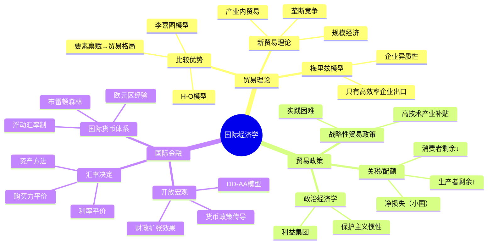

## 《国际经济学：理论与政策》读书笔记
  
### 作者  
digoal  
  
### 日期  
2026-05-26  
  
### 标签  
读书笔记 , 国际经济学：理论与政策   
  
----  
  
## 背景  
   
---
书名: 《国际经济学：理论与政策》（第十一版）   
作者: 保罗·R.克鲁格曼 / 茅瑞斯·奥伯斯法尔德 / 马克·J.梅里兹   
译者: 黄卫平 等   
出版社: 中国人民大学出版社   
出版年份: 2021   
笔记日期: 2026-05-26   
ISBN: 9787300288055   
标签: [国际经济学, 国际贸易, 国际金融, 宏观经济, 教材]   
---

   

> **一句话**：一部用现代语言重写李嘉图、赫克歇尔和凯恩斯的书——它告诉你，全球化不是自然法则，而是人类选择的结果。   
> **适合谁读**：经济学本科生、研究生、对贸易政策和汇率感兴趣的从业者，以及想看懂"贸易战"新闻背后逻辑的普通读者   
> **阅读难度**：⭐⭐⭐☆☆（需要高中数学，无需高等数学）   
> **推荐指数**：⭐⭐⭐⭐⭐   

---

## 一、时代坐标：这本书从哪里来？

这本书第一版出版于1988年，正值冷战末期。彼时布雷顿森林体系瓦解刚过去十五年，浮动汇率制方兴未艾；日本制造业崛起让美国如芒在背；里根政府的贸易保护主义与自由化口号并行不悖，政策与理论之间的张力从未如此明显。

保罗·克鲁格曼那时还不到四十岁，但已经用他1979年的论文——用垄断竞争模型解释产业内贸易——颠覆了延续两百年的比较优势叙事框架。合著者奥伯斯法尔德则是国际金融领域的顶尖学者，专攻汇率、货币危机和资本流动。两人合力，一个负责"为什么贸易发生"，一个负责"货币如何影响一切"，构成了这本书的两座主峰。

第十一版（2017年英文版，2021年中译版）新增了哈佛大学梅里兹教授参与修订，引入了他关于企业异质性的贸易理论——这是继克鲁格曼之后最重要的贸易理论突破。这一版还大幅更新了欧元区危机、中国汇率政策和全球价值链等内容，带有鲜明的后金融危机时代印记。

```
1970s                 1980s                 2000s              2017/2021
  │                    │                    │                    │
布雷顿森林            克鲁格曼             梅里兹               第十一版
体系瓦解             新贸易理论           企业异质性            整合三代
  │                    │                    │                    │
浮动汇率制            本书第1版           金融危机              更新现实
  │                    │                    │                    │
```

---

## 二、核心命题：作者在说什么？

这本书有两条并行的主线，像铁路的双轨，各自独立又共同驶向同一终点：理解开放世界经济如何运转。

### 命题一：贸易不只来自"差异"，也来自"相似"

传统理论（李嘉图、赫克歇尔-俄林）认为，国与国之间贸易，是因为彼此不同——技术不同、要素禀赋不同。这解释了为什么巴西出口咖啡，芬兰出口木材。

但它解释不了一个棘手的事实：当今世界最大规模的贸易，发生在**最相似的国家之间**。德国和法国互相买汽车，美国和日本互相买芯片。这叫"产业内贸易"（Intra-industry trade）。

克鲁格曼的回答是：**规模经济**和**消费者对多样性的偏好**才是真正的发动机。当市场足够大，专业化生产某种差异产品（比如某个型号的汽车）可以降低成本；而消费者又喜欢多样选择，贸易就成为两种需求的共同解——既实现了规模，又提供了多样性。

这意味着：即便两个国家一模一样，只要开放贸易，双方都能得益，因为贸易扩大了市场规模。贸易不是零和游戏，即使在最没有"差异"的情况下也能创造价值。

### 命题二：汇率不只是"价格标签"，是宏观经济政策的传导带

教科书常把汇率讲成一个简单的价格。克鲁格曼-奥伯斯法尔德的金融部分告诉你：汇率是资产价格，由预期驱动，与货币政策、财政政策深度耦合。

他们用**资产方法**（Asset Approach）解释汇率决定：外汇市场上人们持有本外币资产，当利率或预期改变，资金流动推动汇率变化。这解释了为什么央行一句话能让汇率跳动，而贸易逆差本身对汇率的影响反而是迟滞的、间接的。

进一步地，他们引入**购买力平价**（长期）和**利率平价**（短期）两个锚，构建了一套完整的开放经济宏观分析框架——这就是著名的"DD-AA模型"，是凯恩斯IS-LM框架在开放经济中的延伸。

### 命题三：自由贸易是最优选，但政治经济学让它永远难以实现

书的第二大板块（贸易政策）几乎是一部"自由贸易的辩护书"，但写得极为诚实。理论上关税是净福利损失，"最优关税"只在大国且对方不报复时成立。战略性贸易政策（补贴高技术产业）在理论上有空间，但实践中政府几乎不可能精准执行。

然而作者也坦承：贸易的收益是分散的（消费者省了点钱），损失是集中的（某些工人失业）。这种"散收集损"的结构，内生出保护主义的政治压力。理解这一点，就理解了为什么特朗普的关税政策能有民意基础，尽管它在经济学上几乎没有辩护余地。

---

## 三、论证地图：作者怎么说服你的？



**论证风格的三个特点：**

1. **模型先行，案例收尾**。每一章都先建立简洁的理论模型（通常是两国、两商品），再用历史案例或数据检验。这种风格极具说服力，因为你先被逻辑说服，再被事实强化。

2. **保留不确定性**。书中专门设有"争议中的贸易政策"章节，列出经济学家内部仍有分歧的问题，比如战略性贸易政策的有效性。这种诚实感是好教材的标志。

3. **政策贯穿始终**。每个理论模型都明确问：政策含义是什么？政府应该做什么、不应该做什么？理论和政策的双线并行，是本书书名的忠实体现。

---

## 四、前提假设与边界：什么情况下这不成立？

### 假设一：要素可以在国内自由流动

H-O模型（赫克歇尔-俄林）的核心假设是，劳动和资本可以在国内产业间自由转移。贸易开放后，劳动力可以从受冲击的行业流向新兴行业。但现实中，一个在铁锈带工厂工作了二十年的工人，很难转型成为程序员。这个摩擦成本，是书中承认但处理较轻的地方。

### 假设二：政府有能力执行最优政策

无论是反倾销还是战略性产业政策，书中的理论分析都预设了政府有足够的信息和执行力。而现实中，产业政策的失败案例（欧洲的协和飞机、各国的半导体补贴烂尾）提示我们：知道"该做什么"和"能做到什么"之间，有一道深沟。

### 假设三：全球价值链是外生的

书中对国际贸易的处理，基本仍是"一国生产、另一国消费"的框架。而当代贸易的真实面貌是：一部iPhone，设计在美国、芯片来自台湾、屏幕来自韩国、组装在中国。"价值链贸易"使得传统的贸易收支统计都变得失真，这是第十一版有所触及但尚未完全内化的挑战。

---

## 五、思想谱系：这本书在哪个传统里？

```
李嘉图（1817）
比较优势 → 自由贸易
     │
赫克歇尔-俄林（1919-1933）
要素禀赋 → 贸易格局
     │
萨缪尔森（1948）
要素价格均等化
     │
克鲁格曼（1979）──────────────────────┐
规模经济 + 垄断竞争 → 新贸易理论        │
     │                                  │
奥伯斯法尔德                    经济地理学
国际金融、汇率、货币危机          集聚效应
     │                                  │
梅里兹（2003）──────────────────────┘
企业异质性 → 新新贸易理论
```

克鲁格曼属于"新古典综合"传统中的改良者——他不拒绝市场，但用不完全竞争和规模经济填补了传统理论留下的空白。他的方法论是：建立一个尽可能简洁的数学模型，然后问这个模型能解释哪些现实现象。

他的思想对政策圈的影响极为深远。他对"战略性贸易政策"的研究，一度被美国克林顿政府的经济学家（如萨默斯）引用来支持产业政策；但克鲁格曼自己后来日益警惕实际操作中的政治扭曲风险，变得比自己的理论更加倾向自由贸易。这种"学者自我修正"的诚实，值得敬重。

---

## 六、我学到了什么？

读完这本书，对我冲击最大的，是一种**对"直觉"的不信任**。

我们在日常生活中看贸易问题，直觉往往是："进口多了，本国工人受损，要保护。"克鲁格曼的书告诉你，这个直觉在短期、局部层面是对的，但在整体、长期层面是错的——贸易扩大了市场、降低了成本、让消费者获益、也倒逼了本国产业升级。

**第一个收获：模型是简化的镜子，不是现实本身。**书中每个模型都有一堆假设。李嘉图假设只有一种要素（劳动），H-O假设要素可以自由流动。学会读一个模型，首先要问：它的假设是什么？假设不成立时，结论还成立吗？这种"拆假设"的思维方式，适用于读任何经济学文献。

**第二个收获：贸易的政治经济学比贸易的经济学更重要。**为什么自由贸易明明有效率，各国却老是搞保护主义？因为收益是弥散的，损失是集中的。这个"集中-弥散"结构，决定了利益集团的政治动员能力。读懂这一点，你就读懂了"为什么正确的政策不被执行"——这几乎是理解现实政治的万用钥匙。

**第三个收获：汇率不是价格，是预期。**很多人以为人民币升值就一定会减少出口。但汇率由预期决定，预期由资本流动决定，资本流动由利率差和风险偏好决定……这是一个多步传导链条，每一步都有摩擦和时滞。"汇率→贸易"的直接逻辑，远比想象中的更脆弱。

---

## 七、举一反三：这个框架还能用在哪？

**场景一：理解"贸易战"的逻辑**

2018年以来的中美贸易摩擦，用书中框架一眼可以分析：美国对中国商品加征关税，短期内转移了部分消费者支出到国内产品，但同时推高了进口品价格，美国消费者（尤其是沃尔玛购物者）承担了更高成本。"大国最优关税"理论上存在，但中国的反制让其变成了双输。

**场景二：理解"汇率操纵"争议**

中国是否操纵汇率？书中的资产方法告诉你：干预外汇市场会影响外汇储备，但长期汇率取决于经济基本面和利率差。争议的核心不是技术问题，而是政治问题——谁有权定义"公平"汇率？

**场景三：理解欧元区的内在矛盾**

书中"最优货币区"理论（蒙代尔）是理解欧元危机的钥匙：欧元区成员国共享货币但财政政策独立，当希腊爆发危机，它无法通过货币贬值来调整竞争力，只能靠痛苦的内部工资下调。这是制度设计的先天缺陷，不是希腊人的懒惰造成的。

---

## 八、批判与反思

**哪里我不同意，或时代已经变了？**

**一、分配问题被低估了。** 书中对"贸易增加总体福利"的论证是可靠的，但对"谁赢谁输"的处理相对简略。近二十年的实证研究（尤其是大卫·奥特尔等人的研究）表明，中国加入WTO对美国制造业就业的冲击，远比主流教科书预测的更深、更持久、更难复原。克鲁格曼本人后来也公开承认，他们这一代经济学家低估了贸易摩擦的分配成本。

**二、数字贸易和服务贸易被忽视。** 本书的框架基本建立在商品贸易上。但当今全球贸易中，跨境数据流动、软件服务、平台经济占比越来越高。这些不走海关、没有关税的贸易，如何影响就业和增长？现有框架尚无令人满意的答案。

**三、气候贸易议题缺失。** 碳边境调节机制（CBAM）、碳关税的兴起，意味着贸易政策和气候政策的融合正在发生。书中对环境外部性的贸易含义只有简短涉及，这是下一版需要大幅扩展的领域。

---

## 九、金句与记忆点

**1. "贸易不需要以差异为前提。"**
——即便两个完全相同的国家，开放贸易也能互相得益，因为规模经济。这是新贸易理论的灵魂。

**2. "汇率是资产价格，不是商品价格。"**
——汇率由预期驱动，不是贸易流量驱动。理解这一点，才不会被"贸易逆差→汇率必跌"的直觉误导。

**3. "自由贸易是对的，但政治上很难。"**
——书中对自由贸易的辩护是理论上的，对保护主义的解释是政治经济学的。两者缺一不可。

**4. "最优关税论只对大国有效，且前提是对方不报复。"**
——这两个前提在现实中几乎从未同时成立过。所以"最优关税"是一个理论上精妙、实践上几乎无用的概念。

**5. "斯托尔伯-萨缪尔森定理：贸易让丰裕要素受益，让稀缺要素受损。"**
——这解释了为什么发达国家的低技能工人反对自由贸易，发展中国家的劳动密集型企业支持它。贸易不是对每个人都好的，分配效应是真实的。

**6. "产业内贸易：德国和法国互相卖汽车。"**
——这是新贸易理论的标志性现象。不是因为德法不同，而是因为市场足够大时，专业化生产某种型号有优势。

**7. "购买力平价是长期锚，利率平价是短期锚。"**
——汇率在短期被资金流动和预期左右，在长期被通胀差异拉回。两个锚的时间尺度不同，是很多汇率分析混乱的根源。

---

## 十、延伸阅读

**1.《贸易战是阶级战争》（Trade Wars Are Class Wars）— 克莱恩 & 皮拉尔**
为什么读：将本书的贸易理论与收入分配问题挂钩，是理解全球化政治反弹的最佳补充读物。

**2.《国际金融》（克鲁格曼/奥伯斯法尔德/梅里兹）**
为什么读：本书的下册单独出版版，如果你对汇率和国际宏观更感兴趣，可以直接从这本入手。

**3.《地理与贸易》（Geography and Trade）— 克鲁格曼**
为什么读：克鲁格曼最精彩的大众讲座记录，讲述新经济地理学的直觉，比教材轻松十倍，却不损失核心洞见。

**4.《大而不稳》（Exorbitant Privilege）— 艾肯格林**
为什么读：专讲美元作为国际储备货币的历史和困境，是本书国际货币体系部分的深度延伸。

**5.《比较优势的秘密》（The Wealth of Nations in the Modern World）— 大卫·里卡多原著 + 当代诠释**
为什么读：读完克鲁格曼对比较优势的颠覆，回头读里卡多原典，会有截然不同的感受——你会发现传统理论有多深刻，也有多局限。

---

*笔记写于 2026-05-26 | 基于公开学术资料、教材内容与深度思考整理*
*核心参考：克鲁格曼2008年诺贝尔经济学奖委员会评述、教材各版序言、MBA智库及学术期刊书评*
  
  
#### [PostgreSQL 解决方案集合](../201706/20170601_02.md "40cff096e9ed7122c512b35d8561d9c8")
  
  
#### [德哥 / digoal's Github - 公益是一辈子的事.](https://github.com/digoal/blog/blob/master/README.md "22709685feb7cab07d30f30387f0a9ae")
  
  
#### [About 德哥](https://github.com/digoal/blog/blob/master/me/readme.md "a37735981e7704886ffd590565582dd0")
  
  

  
