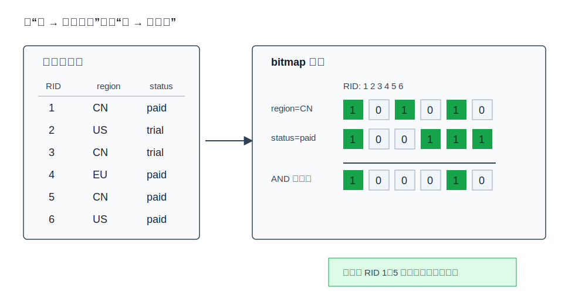
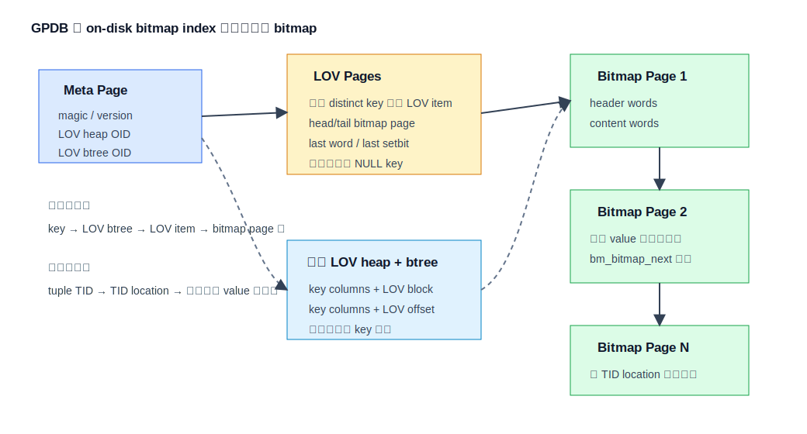
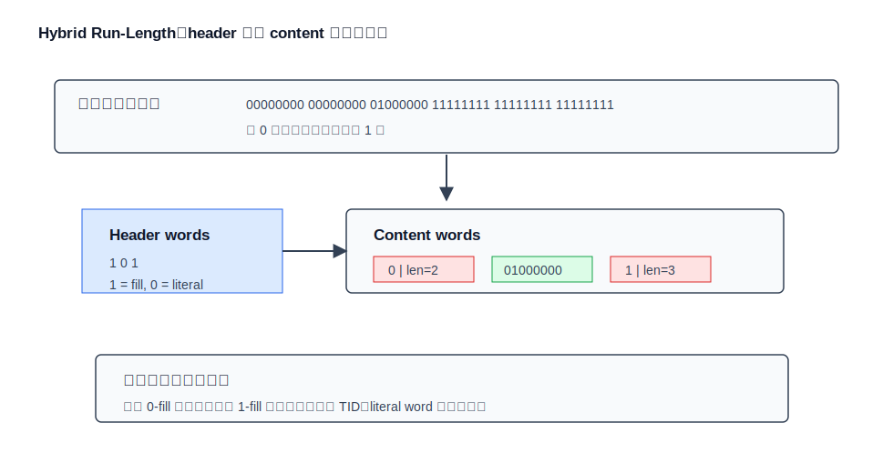
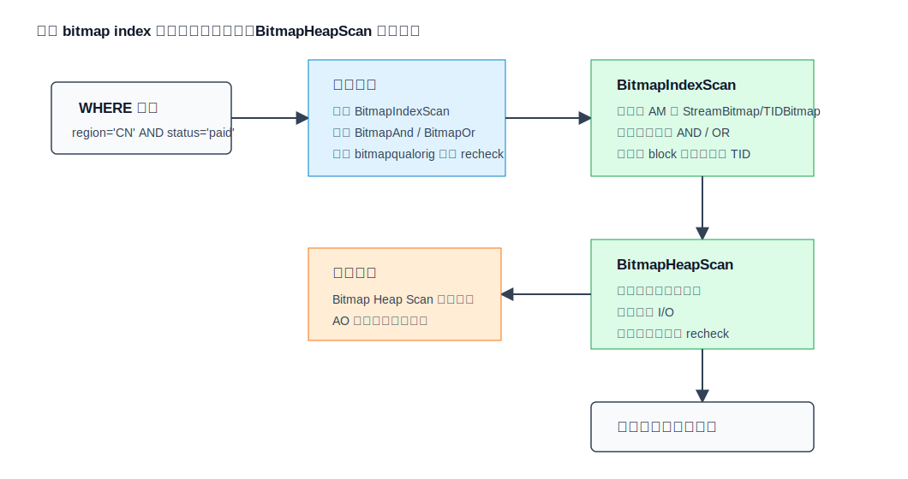
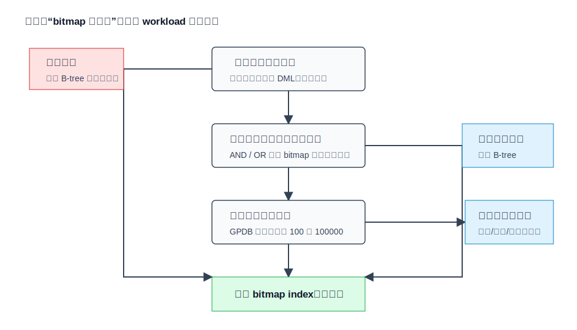

## 数据库筑基课 - bitmap 索引结构
                                                                                            
### 作者                                                                
digoal                                                                
                                                                       
### 日期                                                                     
2026-05-26                                                      
                                                                    
### 标签                                                                  
PostgreSQL , Greenplum , GPDB , 应用开发者 , DBA , 数据库筑基课 , 索引结构 , Bitmap Index  
                                                                                           
----                                                                    

## 背景


本节属于“索引结构”基础能力：理解一种索引为什么能把查询问题变小，也理解它把代价转移到了哪里。当前工作区没有发现“数据库筑基课”总纲文件，因此本文先独立成篇。

业务上最典型的痛点是：一张宽事实表有几十亿行，用户按 `region`、`status`、`channel`、`is_vip`、`event_type` 等维度做临时组合过滤。单列 B-tree 能找到某个条件的行，但多条件临时组合经常变成“先从一个索引取很多 TID，再随机回表，再过滤掉大部分”。如果每个条件都能先变成一串位，再用 CPU 的 `AND`、`OR` 在索引层把候选行收缩，回表 I/O 会少很多。这就是 bitmap 索引的基本价值。

本文以 Greenplum Database 的持久 bitmap index 为主线。Greenplum 文档明确说，Greenplum 提供 PostgreSQL 正常没有的 bitmap index 类型，并建议它用于数据仓库、决策支持、少 DML 的场景；源码中对应实现位于 `gpdb-archive/src/backend/access/bitmap/`，采用 Hybrid Run-Length（HRL）压缩。需要同时区分两件事：

- **持久 bitmap index**：磁盘上的访问方法，`CREATE INDEX ... USING bitmap` 创建，本文重点讨论。
- **执行期 bitmap scan**：查询执行时用 `BitmapIndexScan`、`BitmapAnd`、`BitmapOr`、`BitmapHeapScan` 汇集候选 TID。它可以消费 bitmap index，也可以消费 B-tree/GIN/BRIN 等索引产出的 bitmap。

## 一、它解决什么问题？

bitmap 索引把“按值找行”的问题转成“按值找一串 bit”。每个 distinct key value 对应一条 bitmap vector；第 N 个 bit 表示第 N 个逻辑位置的行是否含有这个 key value。查询 `a = 1 AND b = 'x'` 时，系统先拿到两条 bitmap，再做按位与，得到候选行集合；查询 `a IN (1,2)` 或多个 OR 条件时，先按位或。



图 1 说明：bitmap index 的核心不是“位很省空间”这么简单，而是把多个谓词的组合提前到回表之前。先在 bitmap 层做集合运算，再访问表页，适合多维过滤、候选行能显著缩小的分析查询。

它牺牲的是写入和维护灵活性。某一行的值发生变化，相关 key 的 bitmap vector 需要改 bit；如果 vector 被压缩，改中间 bit 可能导致压缩字拆分、页溢出、碎片。Greenplum 文档也反复提醒：不要把 bitmap index 用在更新频繁列、唯一列、非常高或非常低基数列，以及事务型 workload 上。

## 二、它是什么？

一个持久 bitmap index 可以从三层理解：

1. **逻辑层**：`key value -> bitmap vector`。例如 `status='paid'` 对应一条位向量。
2. **物理层**：bitmap vector 被切成压缩字，写入 bitmap pages；distinct key 的入口保存在 LOV（List Of Values）页。
3. **执行层**：`BitmapIndexScan` 从索引 AM 产生命中集合；`BitmapAnd`/`BitmapOr` 合并多个集合；`BitmapHeapScan` 按页顺序回表并必要时 recheck。

Greenplum 的实现细节有几个关键术语：

- **LOV item**：每个 distinct value 一个，保存该 value 对应 bitmap vector 的 head/tail page、最后几个压缩字、最后 set bit 等元数据。
- **LOV heap + LOV btree**：辅助内部对象，用 key value 查到 LOV page 的 block/offset。源码注释说明这是为了在高基数情况下加速查找 distinct value。
- **TID location**：GPDB 没有直接把 TID 列表塞进 bitmap，而是把 `block number` 和 `offset number` 映射成 64 位位置：`block * BM_MAX_TUPLES_PER_PAGE + offset`。源码宏为 `BM_IPTR_TO_INT`。
- **HRL word**：64 位 Hybrid Run-Length word。header bit 标记 content word 是 literal 还是 fill；fill word 表示连续 0 或连续 1。

## 三、核心原理

### 3.1 页面组织：先找 LOV，再顺链读 bitmap page

Greenplum 的 bitmap index 第 0 页是 metapage，记录版本、LOV heap OID、LOV btree OID、最后 LOV page。LOV page 从第 1 页开始，第一页预留 NULL key。对普通 key，查询先通过辅助 LOV btree 找到 LOV item，再沿着 `bm_lov_head -> bm_lov_tail` 指向的 bitmap page 链读取压缩向量。



图 2 说明：GPDB 的 bitmap index 是一个“小目录 + 辅助查找结构 + 压缩 bitmap page 链”的组合。目录让 key lookup 不必扫描所有 LOV item；bitmap page 链让同一个 key 的向量按 TID location 追加和顺序读取。

源码依据：

- `gpdb-archive/src/backend/access/bitmap/README` 说明 on-disk bitmap index 由每个 distinct key value 一条压缩 bitmap vector 构成。
- `gpdb-archive/src/include/access/bitmap.h` 定义 `BMMetaPageData`、`BMLOVItemData`、`BMBitmapData` 和 `BM_IPTR_TO_INT`。
- `gpdb-archive/src/backend/access/bitmap/bitmapinsert.c` 负责 LOV item 创建、辅助 LOV heap/btree 查找和 bitmap word 写入。

### 3.2 HRL 压缩：压缩后仍能做扫描和集合运算

HRL 与 WAH 一类 word-aligned RLE 思路相近：不是用通用压缩算法把 bitmap 压成黑盒，而是保留“可跳过、可批量展开、可做布尔运算”的结构。Greenplum 的 HRL word size 是 64 位。每个 bitmap page 中有 header words 和 content words。header 某 bit 为 1，表示对应 content word 是 fill word；为 0，表示 literal word。



图 3 说明：长串 0 能被一个 0-fill word 表示，扫描时可以跳过；长串 1 能被一个 1-fill word 表示，扫描时可以批量产生命中。混合位段用 literal word 保留原始 bit。这类压缩特别依赖数据顺序：相同值在 TID 空间中越聚集，压缩越好。

论文《Optimizing Bitmap Indices with Efficient Compression》提出 WAH（Word-Aligned Hybrid）并指出压缩 bitmap index 能直接服务范围查询与多维组合查询。Roaring 论文则从另一个方向提醒：传统 RLE 类格式在有长 run 时很好，但随机访问和无序稀疏数据可能不占优；Roaring 用 65536 分块和 array/bitmap/run 容器解决部分场景。

### 3.3 写入路径：追加容易，中间改 bit 昂贵

Greenplum 的 README 把插入分为几类：

- 新 bit 只影响 LOV item 中保存的最后两个 word：直接更新 LOV item。
- 需要写最后 bitmap page，且页有空间：锁最后 page，写入新 words。
- 最后 page 空间不足：新建 bitmap page，接到链尾，并更新 LOV item。
- 如果新 tuple 的 TID location 落在 vector 中间，需要 in-place bit update。压缩字可能被拆成 2 到 3 个新 word，当前 page 可能溢出，于是插入 overflow page。

这就是为什么 bitmap index 对更新敏感。追加式批量装载比较友好；乱序插入、频繁更新会破坏 run，带来额外 I/O 和碎片。`bmbuild()` 还会用内存 buffer 按 distinct value 批量缓存 TID location，源码注释说这样可以减少底层插入调用、减少压缩/解压、让同一向量的页更可能连续。

### 3.4 执行路径：先组合 bitmap，再按页回表

规划器会把 bitmap 访问路径变成 `BitmapHeapScan` 上挂 `BitmapIndexScan`，复杂条件下中间可能有 `BitmapAnd` 或 `BitmapOr`。GPORCA 的 DXL 翻译代码也有对应的 `TranslateDXLBitmapTblScan`、`TranslateDXLBitmapBoolOp`、`TranslateDXLBitmapIndexProbe`，会把 DXL bitmap table scan 翻译成 `BitmapHeapScan` 或 `DynamicBitmapHeapScan`。



图 4 说明：`BitmapIndexScan` 只负责产生命中集合，不直接返回业务行；`BitmapHeapScan` 负责按 table page 顺序访问表，从而缓解普通 index scan 随机回表的问题。Greenplum 文档特别说明，即使是 append-only 表，计划节点名也叫 `Bitmap Heap Scan`。

执行期的 TID bitmap 还可能有 exact/lossy 之分。`gpdb-archive/src/backend/nodes/tidbitmap.c` 注释说明，当内存不足时，执行期 TIDBitmap 可以退化为“一页一个 bit”的 lossy 存储，之后需要回表 recheck。注意这说的是执行期中间结构；Greenplum bitmap index AM 自身的 `bmgettuple()` 注释写着“this implementation of a bitmap index is never lossy”。

## 四、横向对比

| 维度 | Greenplum bitmap index | B-tree index | BRIN / 分区裁剪 | Roaring bitmap |
|---|---|---|---|---|
| 主要目标 | 多条件分析过滤，先做集合运算再回表 | 高选择性点查、范围查、排序相关访问 | 大范围跳过数据块或分区 | 内存/文件中的压缩整数集合 |
| 数据组织 | 每个 distinct key 一条压缩 bitmap vector，LOV 定位 | 有序 key 到 TID 的树结构 | page range 摘要或分区元数据 | 32 位空间按高 16 位分 container |
| 写入代价 | 更新压缩向量，中间 bit 修改可能拆 word 和碎片化 | 单行维护较成熟，OLTP 更适合 | 维护摘要/分区元数据，通常较轻 | 取决于实现，常用于内存集合或列存元数据 |
| 读取代价 | 多个谓词可快速 AND/OR；回表前减少候选 | 单索引过滤好，多索引组合通常要执行期 bitmap | 粗粒度过滤，可能大量 recheck | 集合交并差很快，随机访问优于 RLE 类格式 |
| 空间成本 | 与行数、distinct value 数、压缩效果相关 | 与 key/TID 数量相关，高重复值不一定省 | 很小，但精度低 | 稀疏用 array，稠密用 bitmap，长 run 用 run |
| 事务/MVCC | 不适合频繁 DML；GPDB 文档建议少更新 | 更适合通用事务场景 | 适合大表扫描裁剪 | 不是通用数据库二级索引协议 |
| 适合场景 | 数据仓库、ad hoc 多维过滤、低到中等基数 | 唯一键、高基数、强选择性条件 | 时间序列、天然分区、大块有序数据 | 搜索/OLAP 引擎的 doc id / row id 集合 |
| 不适合场景 | 唯一列、更新频繁列、OLTP | 低基数多条件组合可能回表过多 | 精准点查 | 直接替代数据库索引 AM |

这张表的关键不是“谁更快”，而是数据结构在优化哪个瓶颈。B-tree 优化有序查找；BRIN/分区优化粗粒度跳过；bitmap 优化多条件集合运算；Roaring 优化压缩整数集合的随机访问和交并差。

## 五、效果如何？

收益主要来自三处：

1. **回表前消减候选行**：多个条件先在 bitmap 层 `AND`/`OR`，减少需要访问的数据页。
2. **顺序化 heap/table 访问**：`BitmapHeapScan` 把候选 TID 按 page 聚合，尽量按页访问，减少普通 index scan 的随机 I/O。
3. **压缩降低索引尺寸**：HRL/WAH 类压缩对长 run 很有效，数据按过滤列或相关列聚集时更明显。

代价也很直接：

1. **空间与 distinct value 数相关**：Greenplum 文档给出的经验边界是 bitmap index 在约 100 到 100000 个 distinct value 的列上表现较好，超过 100000 后性能和空间效率下降。
2. **写入/更新放大**：中间 bit 更新可能拆分压缩 word，甚至插入 overflow page。
3. **不适合唯一列和极低基数列**：唯一列会让每条 bitmap 极稀疏；极低基数列如果过滤不掉足够多行，索引也帮不上忙。
4. **收益依赖组合谓词**：单列过滤如果选择性很差，bitmap index 也可能只是在回表前确认“几乎全表都要读”。



图 5 说明：bitmap index 的第一判断不是列类型，而是 workload：是否读多写少、是否多条件组合、是否能在回表前显著缩小候选集合。任何一个条件不成立，都要把 B-tree、分区、BRIN、列存顺扫一起比较。

## 六、实操 DEMO

下面是可以在 Greenplum 环境中验证的最小实验。本文没有启动 GPDB 集群执行，因此不提供伪造的 `EXPLAIN ANALYZE` 输出；SQL 语法来自 GPDB 文档和回归测试文件 `gpdb-archive/src/test/regress/sql/bitmap_index.sql`。

```sql
SET enable_seqscan = off;
SET enable_indexscan = on;
SET enable_bitmapscan = on;
SET optimizer_enable_bitmapscan = on;

DROP TABLE IF EXISTS bm_sales;
CREATE TABLE bm_sales (
    id bigint,
    region text,
    status text,
    channel text,
    amount numeric
) DISTRIBUTED BY (id);

INSERT INTO bm_sales
SELECT g,
       CASE g % 4 WHEN 0 THEN 'CN' WHEN 1 THEN 'US' WHEN 2 THEN 'EU' ELSE 'APAC' END,
       CASE g % 3 WHEN 0 THEN 'paid' WHEN 1 THEN 'trial' ELSE 'cancel' END,
       CASE g % 5 WHEN 0 THEN 'app' WHEN 1 THEN 'web' ELSE 'partner' END,
       (g % 1000)::numeric
FROM generate_series(1, 1000000) AS g;

ANALYZE bm_sales;

CREATE INDEX bm_sales_region_idx ON bm_sales USING bitmap (region);
CREATE INDEX bm_sales_status_idx ON bm_sales USING bitmap (status);
CREATE INDEX bm_sales_channel_idx ON bm_sales USING bitmap (channel);

EXPLAIN
SELECT count(*)
FROM bm_sales
WHERE region = 'CN'
  AND status = 'paid'
  AND channel IN ('app', 'web');
```

预期观察点：

- 计划底部出现一个或多个 `Bitmap Index Scan`。
- 多条件组合时出现 `BitmapAnd` 或 `BitmapOr`。
- 上层出现 `Bitmap Heap Scan`，即使表是 append-only，Greenplum 文档也说明节点名仍沿用这个名称。
- 如果把 bitmap index 删除，或者关闭 `enable_bitmapscan` / `optimizer_enable_bitmapscan`，计划应切换到其他访问路径。

也可以用 Greenplum 的 `pageinspect` 扩展观察物理页。官方文档列出了 `bm_metap()`、`bm_bitmap_page_header()`、`bm_lov_page_items()`、`bm_bitmap_page_items()` 等函数，用于查看 bitmap index 的 meta page、LOV page 和 bitmap page 内容。

## 七、最佳实践

**数据库架构师**

- 把 bitmap index 设计在事实表的“常用组合过滤维度”上，而不是把所有低基数列都建上。
- 对分区表先评估分区裁剪是否已经足够；Greenplum 文档建议需要在分区表上建索引时，索引列应不同于分区列。
- 如果数据装载是批量模式，优先先装载、`ANALYZE`、再建索引。Greenplum 文档建议大批量装载前可先删除索引，装载后重建。

**DBA**

- 对 bitmap index 重点监控写入、更新、删除比例。只要 DML 频繁，索引维护就可能吞掉查询收益。
- 维护统计信息。bitmap scan 的选择依赖选择性估计；统计信息陈旧会导致“该顺扫时走索引”或“该组合 bitmap 时顺扫”。
- 大量 `UPDATE` / `DELETE` 后考虑重建或整理策略。源码 README 明确说 `VACUUM FULL` 场景会通过 REINDEX 处理 bitmap index。

**业务开发者**

- SQL 写法要让谓词可索引。`WHERE region='CN' AND status='paid'` 比把列包进复杂函数更容易命中索引；如果确实常用表达式，应显式建表达式索引并验证计划。
- 不要为了一个单列低基数过滤强行要求 bitmap index。例如 `gender='M'` 若返回半张表，瓶颈仍是读表。
- 对报表查询保存 `EXPLAIN` 基线。索引是否有效，要看计划是否先组合 bitmap、候选行是否明显减少。

## 八、适合与不适合场景

适合：

- 大表、读多写少、批量装载、少单行更新。
- 数据仓库和决策支持系统，用户经常按多个维度 ad hoc 组合过滤。
- 中低基数字段，并且多个字段组合后选择性明显提高。
- 压缩 AO/列存表的 drill-through 查询：索引能帮助只解压必要页面，但必须实测。

不适合：

- OLTP，高并发更新、删除、单行插入非常频繁。
- 唯一列、手机号、订单号、UUID 这类高基数字段。
- 极低基数字段但过滤不掉足够数据，例如全表 50% 以上都命中的条件。
- 查询主要是范围排序、前缀匹配、主键点查，B-tree 往往更直接。
- 数据顺序完全随机且经常乱序写入，HRL/WAH 类压缩难以形成长 run。

## 九、常见坑

1. **把 Bitmap Index Scan 和 bitmap index 混为一谈**  
   PostgreSQL/Greenplum 的执行计划里有 `Bitmap Index Scan`，这不等于底层一定是持久 bitmap index。B-tree 也可以产出执行期 bitmap。

2. **只看列基数，不看组合选择性**  
   bitmap index 的强项是组合多个条件。如果单列或组合后仍返回大量行，回表成本不会消失。

3. **更新后不关注碎片和重建**  
   GPDB README 明确提到 middle insert/update 可能导致 vector fragmentation。频繁更新列建 bitmap index，本质上是在用查询收益换维护债。

4. **把经验阈值当绝对规则**  
   Greenplum 文档给出 100 到 100000 distinct value 的建议区间，但真实效果还取决于行数、压缩、数据聚集、列相关性、segment 分布和查询模式。

5. **忽略分布键和数据倾斜**  
   Greenplum 是 MPP 系统。bitmap index 在每个 segment 上工作；如果分布键导致热点 segment，单机局部索引再快也会被整体并行度拖住。

## 十、扩展问题

1. 如果一个字段基数 50000，但数据按时间随机写入，bitmap index 压缩效果会怎样？如果先按该字段或相关字段聚簇，效果又会怎样？
2. B-tree 也能参与执行期 bitmap scan。什么场景下“多个 B-tree + BitmapAnd”比“持久 bitmap index”更合适？
3. Roaring 用 array/bitmap/run 三类容器自适应稀疏和稠密场景。数据库二级索引要采用 Roaring，还需要解决哪些 MVCC、WAL、并发更新、页布局问题？
4. 对 append-only 列存表，bitmap index、分区、列存 zone map/metadata、BRIN 的边界如何划分？
5. 如果查询总是返回 30% 以上的数据，索引还能帮忙吗？什么情况下顺序扫描反而更稳定？

## 十一、扩展阅读

- Greenplum 源码：`gpdb-archive/src/backend/access/bitmap/README`，on-disk bitmap index、HRL、LOV、插入与 VACUUM FULL 说明。
- Greenplum 源码：`gpdb-archive/src/include/access/bitmap.h`，`BMMetaPageData`、`BMLOVItemData`、`BMBitmapData`、TID location 宏。
- Greenplum 源码：`gpdb-archive/src/backend/access/bitmap/bitmap.c`，`bmhandler()`、`bmbuild()`、`bminsert()`、`bmgetbitmap()`。
- Greenplum 源码：`gpdb-archive/src/backend/access/bitmap/bitmapinsert.c` 和 `bitmapsearch.c`，写入与扫描细节。
- Greenplum 源码：`gpdb-archive/src/backend/nodes/tidbitmap.c`，执行期 exact/lossy TIDBitmap。
- Greenplum 文档：`gpdb-archive/gpdb-doc/markdown/admin_guide/ddl/ddl-index.html.md`，About Bitmap Indexes、适用与不适用场景、计划节点说明。
- Greenplum 文档：`gpdb-archive/gpdb-doc/markdown/ref_guide/sql_commands/CREATE_INDEX.html.md`，`USING bitmap`、多列支持、基数建议。
- Greenplum 文档：`gpdb-archive/gpdb-doc/markdown/ref_guide/modules/pageinspect.html.md`，bitmap index 页面观察函数。
- DeepWiki：`greenplum-db/gpdb-archive` 关于 bitmap scan planning/execution 的问答，用于理解 GPORCA/执行节点关系；关键结论已回查源码。
- Elizabeth O'Neil, Patrick O'Neil, Kesheng Wu, [Bitmap Index Design Choices and Their Performance Implications](https://sdm.lbl.gov/~kewu/ps/LBNL-62756.html), IDEAS 2007。
- Kesheng Wu, Ekow J. Otoo, Arie Shoshani, [Optimizing bitmap indices with efficient compression](https://cir.nii.ac.jp/crid/1360011145086169984), ACM TODS 2006。
- Daniel Lemire, Gregory Ssi-Yan-Kai, Owen Kaser, [Consistently faster and smaller compressed bitmaps with Roaring](https://arxiv.org/abs/1603.06549), Software: Practice and Experience 2016。
- RoaringBitmap 项目：[Roaring Bitmaps About](https://www.roaringbitmap.org/about/) 与 [RoaringFormatSpec](https://github.com/RoaringBitmap/RoaringFormatSpec)。
- Oracle Database Concepts：[Bitmap Indexes](https://docs.oracle.com/html/E25789_01/indexiot.htm)，用于横向理解 bitmap index 的 OLAP/OLTP 边界。

## 验证清单

- 标题、分类、结构已按“数据库筑基课 - bitmap 索引结构”整理。
- 关键实现说法已回查 Greenplum 本地源码和文档。
- 论文结论只使用公开页面可核验的摘要和格式说明，没有伪造性能数据。
- SQL 示例未执行，已明确声明；示例语法参考 GPDB 文档和回归测试。
- 5 个 SVG 均为独立文件，使用相对路径引用，不含 JavaScript、`foreignObject`、外部 CSS、远程字体或远程图片。
   
## 附录  
  
1、问 gemini  
```  
bitmap 索引结构相关的论文、开源项目.
```  
  
2、克隆代码  
```  
git clone --depth 1 https://github.com/greenplum-db
```  
  
3、启用 codex, 使用 [数据库筑基课 skill](../skills/README.md).  
````
文章标题: 
  数据库筑基课 - bitmap 索引结构
项目源码(已克隆到当前项目如下目录中):  
  gpdb-archive
论文: 
  Bitmap Indexing Design and Applications
  Optimizing Bitmap Indices with Efficient Compression
  Consistently Faster Bitmaps: Consistently Faster Bitmaps: Roaring Bitmaps
项目 deepwiki reponame:  
  greenplum-db/gpdb-archive
项目参考信息: 
  gpdb-archive/CLAUDE.md
````
    
  
#### [PostgreSQL 解决方案集合](../201706/20170601_02.md "40cff096e9ed7122c512b35d8561d9c8")
  
  
#### [德哥 / digoal's Github - 公益是一辈子的事.](https://github.com/digoal/blog/blob/master/README.md "22709685feb7cab07d30f30387f0a9ae")
  
  
#### [About 德哥](https://github.com/digoal/blog/blob/master/me/readme.md "a37735981e7704886ffd590565582dd0")
  
  

  
