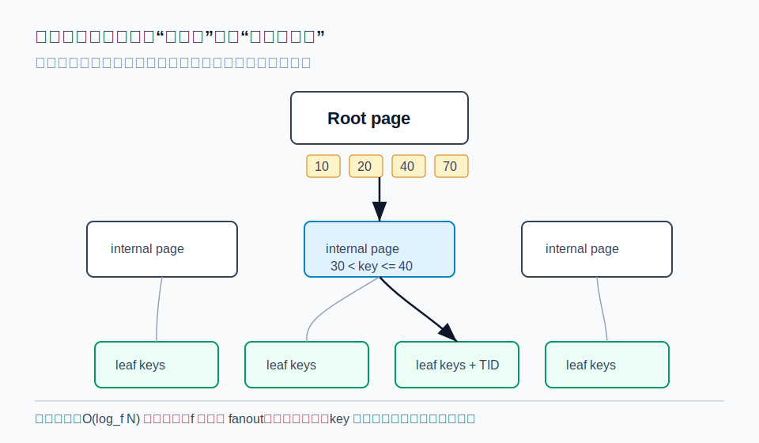
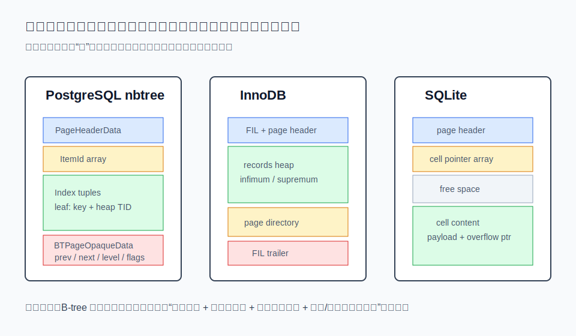
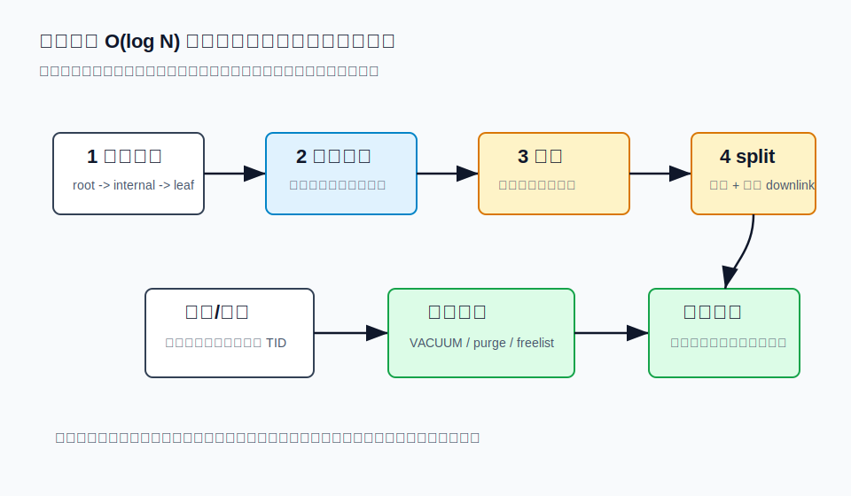
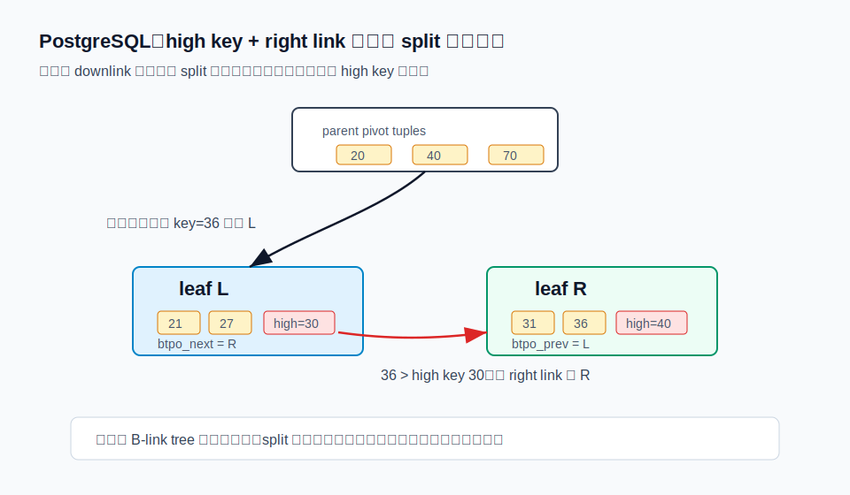
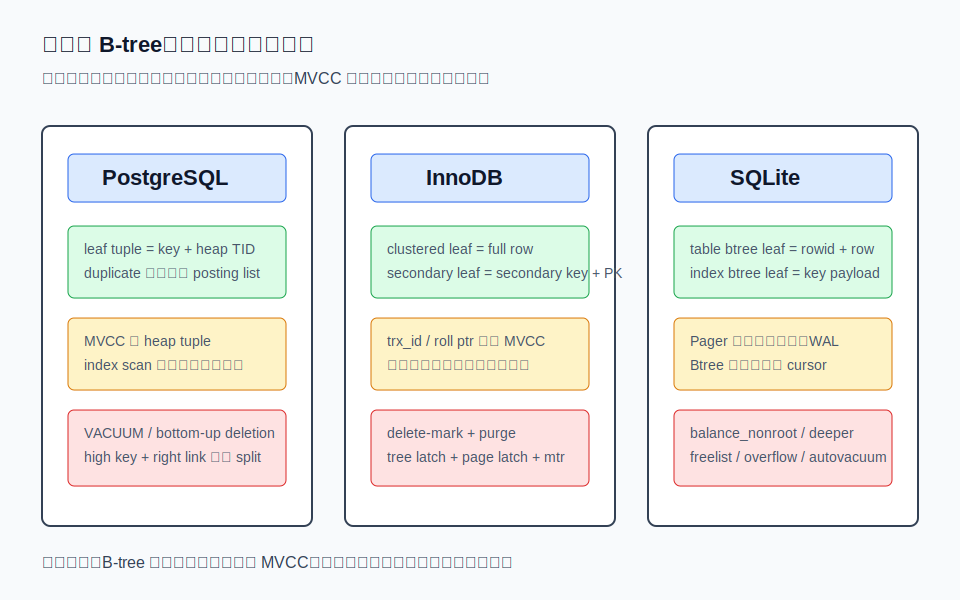

## 数据库筑基课 - btree 索引结构
                                                                                            
### 作者                                                                
digoal                                                                
                                                                       
### 日期                                                                     
2026-05-26                                                      
                                                                    
### 标签                                                                  
PostgreSQL , Greenplum , GPDB , 应用开发者 , DBA , 数据库筑基课 , 索引结构 , btree Index  
                                                                                           
----                                                                    

## 背景


本节属于“索引结构”基础能力。当前工作区没有发现“数据库筑基课”总纲文件，因此本文先独立成篇。

业务上最常见的问题很朴素：表越来越大以后，`WHERE id = ?`、`WHERE user_id = ? AND created_at BETWEEN ? AND ?`、`ORDER BY created_at LIMIT 20` 这些查询不能每次都扫全表。我们希望把“从 N 行里找几行”转成“沿着少量页面跳转，定位到一小段有序数据”。B-tree/B+tree 就是数据库长期选择的通用索引骨架。

但“B-tree 索引”不是一句 `CREATE INDEX` 能讲完的。真正影响工程行为的是：

- 叶子页里放的是行本身、行地址，还是主键？
- 并发 split 时，读线程如何不走错？
- MVCC 信息在索引里还是表里？
- 删除后空间什么时候回收？
- 页面大小、key 宽度、压缩、填充率如何改变树高和缓存命中？

本文以经典论文为理论主线，用本地源码中的 PostgreSQL `nbtree`、MySQL InnoDB、SQLite `btree` 作为工程参照。

## 一、它解决什么问题？

B-tree 解决的是“外存或页式存储上的有序查找”问题。二叉树在内存里很好理解，但放到磁盘或缓冲池里，每访问一个节点都可能变成一次页访问。B-tree 把节点做宽，让一个页里容纳很多 key 和指针，树高就会显著下降。



图 1 说明：如果每个内部页能分出几百个孩子，千万级甚至亿级数据也可能只有 3 到 4 层。查找的关键成本不再是比较次数，而是 root、internal、leaf 这些页是否在缓存里，以及叶子定位后需要回表多少次。

Bayer 和 McCreight 在 1972 年的 B-tree 论文里讨论了动态随机访问文件上的大型有序索引，目标就是让检索、插入、删除的页访问随 `log_k(I)` 增长，其中 `k` 由设备和页大小决定。Comer 的综述把 B-tree 变体的普及原因讲得更系统：它同时兼顾顺序访问、范围查找、插入删除和较高空间利用率。

B-tree 牺牲的东西也很明确：

- 写入不是纯追加，页满时要 split，删除后要清理或合并。
- 范围查询很好，但多维组合条件不如专门的 bitmap、GIN、R-tree、列存 zone map。
- key 太宽会降低 fanout，导致树变高、缓存效率下降。
- 随机写和页分裂会制造尾延迟，尤其在主键随机、二级索引多、长事务阻塞清理时。

## 二、它是什么？

严格说，数据库里常说的 B-tree 索引大多接近 B+tree：内部页主要保存导航 key 和 child pointer，真正可返回的数据或行定位信息集中在叶子层。叶子层通常按 key 有序，适合范围扫描。

几个术语先统一：

- **page/block**：树节点的物理载体。PostgreSQL 默认 block 是 8KB；InnoDB 默认 index page 是 16KB；SQLite page size 可在 512 到 65536 字节之间。
- **fanout**：一个内部页能指向多少个子页。key 越短、指针越紧凑、压缩越有效，fanout 越高。
- **separator/pivot key**：内部页里的导航 key，用来决定走向哪个 child。
- **leaf tuple/record/cell**：叶子页里的实际索引项。不同数据库放的内容差异很大。
- **split**：页放不下新项时，把一部分项移动到新页，并把新页入口插入父页。
- **merge/recycle/vacuum/purge/balance**：删除后的空间维护动作。各数据库名字不同，工程约束也不同。



图 2 说明：抽象教材会画成“key 数组 + 指针数组”，但数据库源码里首先面对的是页格式。PostgreSQL 页尾 special area 放 `BTPageOpaqueData`；InnoDB 页内有 infimum/supremum 伪记录和 page directory；SQLite 的 cell pointer array 有序，cell content 可不按物理顺序连续。

## 三、核心原理

### 3.1 查找：从根到叶，叶子再顺序走

B-tree 查找从 root 开始，在每个内部页做页内搜索，找到应下降的 child pointer，直到 leaf。点查在 leaf 中找精确 key；范围查找到起点后沿 leaf 顺序扫描。

页内搜索可以是二分、线性、SIMD、cache-conscious 布局，具体取决于实现。Rao 和 Ross 的 cache-conscious B+tree 工作提醒我们：内存数据库或缓冲池命中率很高时，瓶颈会从磁盘页访问转向 CPU cache miss 和分支预测。也就是说，B-tree 不是只服务磁盘时代；它的节点宽度和布局仍然影响现代 CPU。

### 3.2 插入和 split：先局部改，页满再传播

插入通常分三步：

1. 从 root 找到应插入的 leaf。
2. leaf 有空间时，在页内插入记录并更新目录或 slot。
3. leaf 无空间时 split，创建新 leaf，把部分记录迁移过去，再把新页的 separator/downlink 插入父页；父页也满时继续向上传播，root 满时树高加一。



图 3 说明：B-tree 写入的均摊复杂度很好，但线上系统感受到的是尾延迟。页分裂、父页传播、日志刷写、二级索引维护、后台清理被长事务阻塞，都会把一次普通写入放大。

### 3.3 并发：B-link tree、latch、SMO

Lehman 和 Yao 的论文提出了高并发 B-tree 管理方法：给页增加 right link，并用 high key 表示页的上界。搜索线程如果因为并发 split 落到旧页，可以比较 high key，发现目标 key 已经超出本页范围，然后沿 right link 向右修正。

PostgreSQL `src/backend/access/nbtree/README` 明确说 `nbtree` 是 Lehman-Yao 高并发 B-tree 算法的正确实现，并解释了 high key、right link、left link、root split、page deletion 等细节。PostgreSQL 因为多个 backend 共享 buffer page，仍会对 btree page 加 page-level read lock，保证读页时记录不会被修改。



图 4 说明：父页旧 downlink 不一定马上反映最新 split 状态。只要页上有 high key 和 right link，查找就能在页级别自我纠正。这让结构修改操作和读操作可以更高并发地交错。

ARIES/IM 则把问题推进到事务系统：索引结构修改操作（SMO，例如 split、delete）不能简单依赖长时间持有页面锁；它把并发控制、WAL、重做/撤销策略一起设计，使检索、插入、删除能与 SMO 并发，并让恢复尽量以 page-oriented 方式完成。

### 3.4 删除：逻辑删除快，物理回收慢

B-tree 删除不能只看“把 key 从 leaf 删掉”。数据库里还有事务可见性、并发扫描、崩溃恢复和页复用安全。

PostgreSQL 的索引项指向 heap TID，MVCC 主要在 heap 中判断。过期索引项会通过 VACUUM、simple deletion、bottom-up deletion 清理；重复 key 可通过 deduplication 合并成 posting list。`postgres/doc/src/sgml/btree.sgml` 说明 deduplication 默认启用，重复 leaf tuple 可以合并为一个 key 加一组 TID，从而降低空间和延迟。

InnoDB 删除记录时通常先 delete-mark，之后由 purge 线程在安全时物理移除。MySQL 官方文档也说明，二级索引记录包含主键列；如果二级索引记录被 delete-mark 或页面被更新，InnoDB 可能需要回聚簇索引确认记录状态。

SQLite 由 Btree 层管理页、cell、overflow、freelist，事务、日志和锁主要由 Pager 层处理。`sqlite/src/btree.c` 中的 `balance_nonroot`、`balance_deeper`、`balance_quick` 等逻辑负责页过满或过空时的再平衡。

### 3.5 三种工程实现的核心差异



图 5 说明：同样是 B-tree，叶子层语义完全不同。PostgreSQL leaf 存 key 和 heap TID；InnoDB clustered index leaf 存整行，secondary index leaf 存二级 key 加主键；SQLite rowid table 的 table btree leaf 存 rowid 和行内容，index btree leaf 存 key payload。

## 四、横向对比

| 维度 | PostgreSQL nbtree | MySQL InnoDB B-tree | SQLite btree | Bw-tree / FAST+FAIR 等现代变体 |
|---|---|---|---|---|
| 主要目标 | 通用二级索引，配合 heap MVCC | 表即聚簇索引，二级索引回主键 | 单文件页式存储，table/index 都是 btree | 面向多核、闪存或持久内存重新设计 |
| 叶子内容 | key + heap TID，重复 key 可 posting list | 聚簇索引叶子是整行；二级索引叶子含主键 | table btree 存 rowid + row；index btree 存 key | delta record、mapping table、cache-line aware layout 等 |
| 并发 split | high key + right link；页面锁适配共享 buffer | tree latch + page latch；普通 B-tree，不是 B-link tree | 单机嵌入式模型，Pager 处理锁和事务 | CAS、delta chain、持久化 flush 顺序 |
| MVCC 关系 | 可见性主要回 heap 判断 | clustered record 含事务信息，二级索引可能回聚簇索引 | 无 PostgreSQL/InnoDB 式多版本行链；Pager 保证事务原子性 | 取决于系统设计 |
| 删除清理 | VACUUM、simple deletion、bottom-up deletion、page deletion | delete-mark 后 purge，二级索引也要维护 | cell 删除、freelist、balance、auto-vacuum | 针对 latch、日志、PM 写放大优化 |
| 最适合 | 通用 OLTP/OLAP 混合查询、范围查询、排序 | 主键访问强、行按主键聚簇、覆盖二级索引 | 嵌入式、单文件、轻量事务 | 高并发内存/闪存/持久内存索引研究或专用引擎 |
| 主要风险 | 索引膨胀、回表可见性成本、长事务阻塞清理 | 随机主键导致页分裂，长主键放大二级索引 | 大 payload overflow、频繁 page rebalance | 实现复杂，恢复协议和内存回收更难 |

这张表的重点不是排名。B-tree 是一个抽象族，存储引擎把它嵌入事务、日志、页缓存和执行器之后，才形成真实行为。

## 五、效果如何？

B-tree 的收益主要来自四处：

1. **树高低**：高 fanout 把随机页访问控制在少数几层。
2. **有序性**：天然支持等值、范围、前缀、排序、merge join 输入等模式。
3. **增量维护**：不需要每次重建索引，insert/update/delete 可局部维护。
4. **缓存友好潜力**：root 和上层 internal page 常驻缓存，热点范围的 leaf 也容易复用。

代价也要直接面对：

1. **写放大**：一次行写入可能维护多个 B-tree；页 split 还会改父页和 WAL/redo。
2. **空间放大**：二级索引复制 key 和行定位信息。InnoDB 长主键会进入所有二级索引。
3. **回表代价**：PostgreSQL 二级索引命中后通常要访问 heap；InnoDB 二级索引未覆盖查询时要回聚簇索引。
4. **清理滞后**：MVCC 系统不能随便物理删除旧版本或旧索引项。
5. **宽 key 降低 fanout**：过长字符串、复合索引列太多、包含列滥用都会让树更高、更胖。

一个实用判断：B-tree 最擅长“有序一维键空间”。如果问题是多维空间相交，用 R-tree/GiST；如果问题是包含关系、倒排、数组元素，用 GIN/倒排；如果问题是粗粒度跳过大块数据，用 BRIN/zone map；如果问题是低基数多条件集合运算，用 bitmap 更自然。

## 六、实操 DEMO

以下示例用于验证语义和执行计划形态。本文没有启动 PostgreSQL、MySQL 或 SQLite 服务执行，因此不提供伪造的 `EXPLAIN ANALYZE` 输出。

### 6.1 PostgreSQL：观察 B-tree、范围查询和 dedup 参数

```sql
DROP TABLE IF EXISTS bt_demo;
CREATE TABLE bt_demo (
    id bigserial PRIMARY KEY,
    tenant_id int NOT NULL,
    status text NOT NULL,
    created_at timestamptz NOT NULL DEFAULT now(),
    payload text
);

INSERT INTO bt_demo (tenant_id, status, created_at, payload)
SELECT g % 100,
       CASE g % 5 WHEN 0 THEN 'paid' WHEN 1 THEN 'trial' ELSE 'active' END,
       now() - (g || ' seconds')::interval,
       repeat('x', 20)
FROM generate_series(1, 200000) AS g;

CREATE INDEX bt_demo_tenant_created_idx
ON bt_demo (tenant_id, created_at DESC);

CREATE INDEX bt_demo_status_idx
ON bt_demo (status)
WITH (deduplicate_items = on);

ANALYZE bt_demo;

EXPLAIN
SELECT id, created_at
FROM bt_demo
WHERE tenant_id = 42
ORDER BY created_at DESC
LIMIT 20;
```

预期观察点：`tenant_id, created_at DESC` 复合 B-tree 能同时服务等值过滤和排序方向；`status` 这种重复值多的列适合观察 dedup 对索引尺寸的影响。可用 `pg_relation_size()` 对比 `deduplicate_items = on/off` 的索引大小，但实际收益取决于版本、数据分布和页内空间状态。

### 6.2 MySQL/InnoDB：理解聚簇索引和二级索引回表

```sql
DROP TABLE IF EXISTS bt_demo;
CREATE TABLE bt_demo (
    id BIGINT NOT NULL,
    tenant_id INT NOT NULL,
    status VARCHAR(16) NOT NULL,
    created_at DATETIME NOT NULL,
    payload VARCHAR(100),
    PRIMARY KEY (id),
    KEY idx_tenant_created (tenant_id, created_at),
    KEY idx_status (status)
) ENGINE=InnoDB;

EXPLAIN
SELECT id, created_at
FROM bt_demo
WHERE tenant_id = 42
ORDER BY created_at
LIMIT 20;

EXPLAIN
SELECT payload
FROM bt_demo
WHERE status = 'paid'
LIMIT 20;
```

预期观察点：第一个查询有机会使用 `(tenant_id, created_at)` 二级索引；如果选择列都在二级索引和主键里，可能成为覆盖访问。第二个查询选择 `payload`，二级索引没有覆盖，需要用二级索引里的主键回聚簇索引取整行。

### 6.3 SQLite：查看索引选择和文件页行为

```sql
DROP TABLE IF EXISTS bt_demo;
CREATE TABLE bt_demo (
    id INTEGER PRIMARY KEY,
    tenant_id INTEGER NOT NULL,
    status TEXT NOT NULL,
    created_at TEXT NOT NULL,
    payload TEXT
);

CREATE INDEX bt_demo_tenant_created_idx
ON bt_demo (tenant_id, created_at);

EXPLAIN QUERY PLAN
SELECT id, created_at
FROM bt_demo
WHERE tenant_id = 42
ORDER BY created_at
LIMIT 20;

PRAGMA page_size;
PRAGMA page_count;
```

预期观察点：SQLite 的 rowid table 以 rowid 为 table btree key，普通索引是独立 index btree。`EXPLAIN QUERY PLAN` 可验证是否使用索引；`PRAGMA page_size/page_count` 可观察文件页粒度。

## 七、最佳实践

**数据库架构师**

- 明确主访问路径：InnoDB 的主键决定聚簇顺序，随机 UUID 主键会增加页分裂和缓存抖动；如果必须用 UUID，可考虑有序 UUID、雪花 ID 或业务上可接受的复合键。
- 控制 key 宽度：复合索引不是越长越好。宽 key 降低 fanout，还会放大二级索引和 WAL/redo。
- 按 workload 选结构：一维范围和排序用 B-tree；多维空间、全文、数组、低基数多条件分析不要硬塞进一个 B-tree。

**DBA**

- 监控索引膨胀和清理延迟：PostgreSQL 关注 autovacuum、长事务、`pg_stat_user_indexes`、`pgstattuple`/`amcheck`；InnoDB 关注 history list length、purge、page split/merge 监控项。
- 重建不是第一反应：先确认膨胀来源，是长事务、更新模式、填充率、随机主键，还是索引本身不再匹配查询。
- 让统计信息跟上数据变化：B-tree 能不能被优化器选中，依赖基数、相关性、直方图、页成本等估计。

**业务开发者**

- 写 SQL 时匹配索引左前缀和排序方向。`(tenant_id, created_at)` 适合 `tenant_id = ? ORDER BY created_at`，不等价于任意条件组合。
- 覆盖索引要克制。为了少回表加入太多列，可能让每个 leaf tuple 变宽，反而降低缓存效率。
- 关注更新列。如果频繁更新某列，而它又出现在多个索引里，每次更新都可能变成多个 B-tree 的删除/插入。

## 八、适合与不适合场景

适合：

- 高选择性等值查询，例如主键、唯一键、账号 ID。
- 范围查询，例如时间区间、价格区间、分页游标。
- 需要有序输出的查询，例如 `ORDER BY created_at LIMIT N`。
- 外键关联、merge join、唯一约束、排重约束。
- InnoDB 中按主键聚簇访问的高频路径。

不适合：

- 低基数列单独建索引后过滤不掉多少行，例如性别、布尔值。除非和其他列组成有效复合索引。
- `%keyword%` 这种非前缀模糊匹配。应考虑全文、trigram、倒排或专用搜索。
- 多维范围相交，例如经纬度矩形、几何关系。应考虑 R-tree/GiST/SP-GiST。
- 超宽 JSON/text 直接作为长复合 key。应考虑表达式索引、前缀、hash、倒排或规范化建模。
- 写入极重且查询主要按最新追加扫描的场景。B-tree 可能不是唯一选择，需要比较 LSM、分区、BRIN、列存。

## 九、常见坑

1. **把 B-tree 当成万能索引**：B-tree 是有序一维结构，不擅长所有检索问题。
2. **忽视回表成本**：索引命中不等于查询快。候选行太多、回表随机、可见性检查多，都可能慢。
3. **随机主键导致聚簇写抖动**：InnoDB 中尤其明显，主键选择会影响整张表的物理组织。
4. **长事务阻塞清理**：PostgreSQL VACUUM 和 InnoDB purge 都可能被长事务拖住，索引膨胀随之出现。
5. **复合索引顺序随意**：列顺序要服务等值、范围、排序和选择性，不是把 WHERE 里出现的列都堆进去。
6. **统计信息陈旧**：优化器不知道真实分布时，可能放弃好索引或选择坏索引。
7. **只看平均延迟**：页 split、刷 WAL/redo、后台清理争用常体现在 P99/P999。
8. **误解唯一索引的成本**：唯一约束还要做冲突检查，并发插入相同 key 时需要额外同步。

## 十、扩展问题

1. 如果 PostgreSQL 的 B-tree leaf 直接存行数据，而不是 heap TID，会改变哪些 MVCC 和 VACUUM 设计？
2. 为什么 InnoDB 二级索引要存主键？如果存物理页号和槽位，会遇到什么维护问题？
3. 当 key 从 8 字节变成 200 字节时，fanout、树高、buffer 命中率、WAL 量会怎样变化？
4. B-link tree 的 right link 能解决 split 并发，为什么还需要 WAL 和恢复协议？
5. 持久内存场景下，为什么传统“改页后写日志”的思路会被 FAST+FAIR、Bw-tree 这类工作重新审视？

## 十一、扩展阅读

论文：

- Bayer, R. and McCreight, E. M. [Organization and Maintenance of Large Ordered Indexes](https://link.springer.com/article/10.1007/BF00288683), Acta Informatica, 1972.
- Comer, D. [The Ubiquitous B-Tree](https://dblp.org/rec/journals/csur/Comer79), ACM Computing Surveys, 1979.
- Lehman, P. L. and Yao, S. B. [Efficient Locking for Concurrent Operations on B-Trees](https://www.cs.cmu.edu/afs/cs/academic/class/15712-f08/www/readings/Lehman81.pdf), ACM TODS, 1981.
- Mohan, C. and Levine, F. [ARIES/IM: An Efficient and High Concurrency Index Management Method Using Write-Ahead Logging](https://research.ibm.com/publications/ariesiim-an-efficient-and-high-concurrency-index-management-method-using-write-ahead-logging), SIGMOD, 1992.
- Rao, J. and Ross, K. A. [Making B+-Trees Cache Conscious in Main Memory](https://dblp.org/rec/conf/sigmod/RaoR00), SIGMOD, 2000. 你给出的题名写作 “by Index Compression”，常见正式题名是 “in Main Memory”。
- Levandoski, J., Lomet, D., and Sengupta, S. [The Bw-Tree: A B-tree for New Hardware Platforms](https://www.microsoft.com/en-us/research/wp-content/uploads/2016/02/bw-tree-icde2013-final.pdf), ICDE, 2013.
- FAST+FAIR 相关工作可从 [FAST and FAIR B+-Tree for Byte-Addressable Persistent Memory](https://nvmw.ucsd.edu/program-2/) 的公开摘要和后续持久内存索引论文继续追踪。

官方文档：

- PostgreSQL 文档：[B-Tree Indexes](https://www.postgresql.org/docs/current/btree.html)。
- MySQL 文档：[Clustered and Secondary Indexes](https://dev.mysql.com/doc/refman/8.1/en/innodb-index-types.html)。
- MySQL 文档：[The Physical Structure of an InnoDB Index](https://dev.mysql.com/doc/refman/8.2/en/innodb-physical-structure.html)。
- SQLite 文档：[Database File Format](https://www.sqlite.org/fileformat2.html)。

本地源码和 DeepWiki：

- `postgres/src/backend/access/nbtree/README`
- `postgres/src/include/access/nbtree.h`
- `postgres/src/backend/access/nbtree/nbtsearch.c`
- `postgres/src/backend/access/nbtree/nbtinsert.c`
- `postgres/doc/src/sgml/btree.sgml`
- `mysql-server/storage/innobase/btr/btr0btr.cc`
- `mysql-server/storage/innobase/btr/btr0cur.cc`
- `mysql-server/storage/innobase/include/page0types.h`
- `mysql-server/storage/innobase/include/page0page.h`
- `mysql-server/storage/innobase/include/dict0mem.h`
- `sqlite/src/btreeInt.h`
- `sqlite/src/btree.c`
- DeepWiki：`postgres/postgres`、`mysql/mysql-server`、`sqlite/sqlite`
  
## 附录  
  
1、问 gemini  
```  
btree 索引结构相关的论文、开源项目.
```  
  
2、克隆代码  
```  
git clone --depth 1 https://github.com/postgres/postgres
git clone --depth 1 https://github.com/mysql/mysql-server
git clone --depth 1 https://github.com/sqlite/sqlite
```  
  
3、启用 codex, 使用 [数据库筑基课 skill](../skills/README.md).  
````
文章标题: 
  数据库筑基课 - btree 索引结构
项目源码(已克隆到当前项目如下目录中):  
  postgres
  mysql-server
  sqlite
论文: 
  Organization and Maintenance of Large Ordered Indices
  The Ubiquitous B-Tree
  Efficient Locking for Concurrent Operations on B-Trees
  Aries/IM: An Efficient and High Concurrency Index Management Method Using Write-Ahead Logging
  Making B+-Trees Cache Conscious by Index Compression
  The Bw-Tree: A Latch-free B-Tree for Log-Structured Storage
  FAST+FAIR: A Lazy Write-Ahead Logging Technique for B+-Trees on Non-Volatile Memory
项目 deepwiki reponame:  
  postgres/postgres
  mysql/mysql-server
  sqlite/sqlite
项目参考信息: 
  postgres/CLAUDE.md
  mysql-server/CLAUDE.md
  sqlite/CLAUDE.md
````
   
  
#### [PostgreSQL 解决方案集合](../201706/20170601_02.md "40cff096e9ed7122c512b35d8561d9c8")
  
  
#### [德哥 / digoal's Github - 公益是一辈子的事.](https://github.com/digoal/blog/blob/master/README.md "22709685feb7cab07d30f30387f0a9ae")
  
  
#### [About 德哥](https://github.com/digoal/blog/blob/master/me/readme.md "a37735981e7704886ffd590565582dd0")
  
  

  
