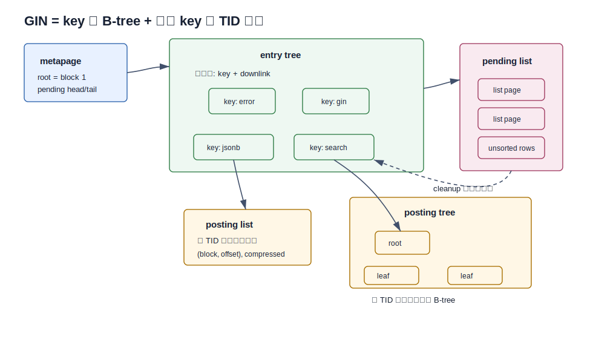
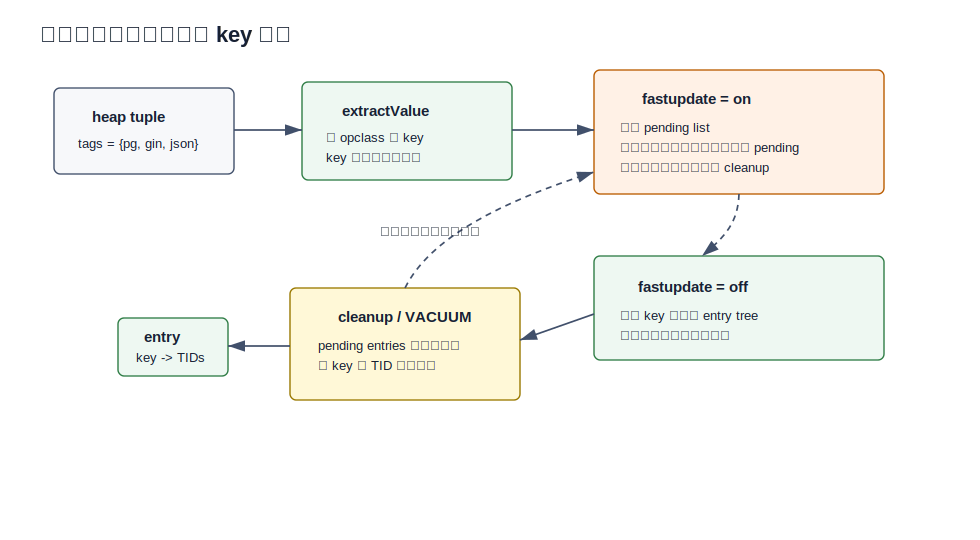
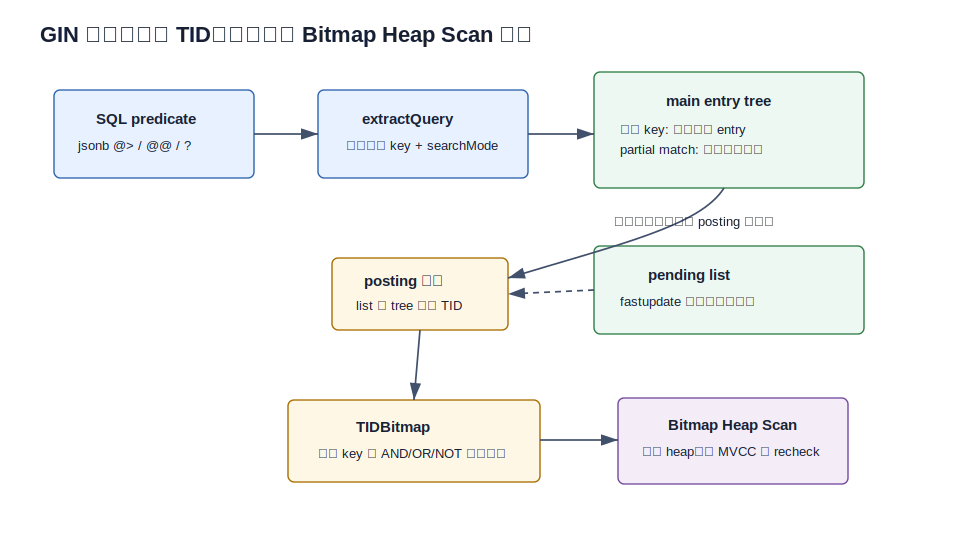
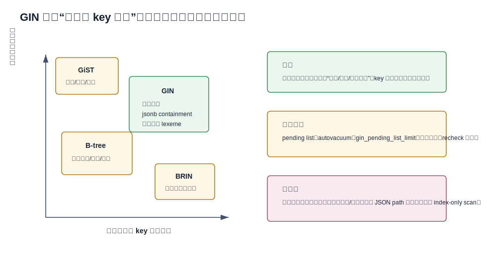

## 数据库筑基课 - GIN 索引结构
                                                                                            
### 作者                                                                
digoal                                                                
                                                                       
### 日期                                                                     
2026-05-26                                                      
                                                                    
### 标签                                                                  
PostgreSQL , 应用开发者 , DBA , 数据库筑基课 , 索引结构 , GIN , 倒排索引 , JSONB , 全文检索
                                                                                           
----                                                                    

## 背景


本节属于“索引结构”基础能力。当前工作区没有发现“数据库筑基课”总纲文件，因此本文先独立成篇。

业务里经常有这类查询：

- 找出 `tags` 数组里包含 `postgres` 和 `gin` 的商品。
- 找出 JSONB 文档里包含 `{"tenant": 42, "status": "paid"}` 的订单。
- 找出正文里同时包含 `database` 和 `index` 的文章。
- 找出文本中带某些 trigram 的候选行，再回表做相似度或 `LIKE` 复查。

B-tree 擅长“一个有序标量值 -> 行位置”。上面的问题不是这样：一行里面有很多词、很多数组元素、很多 JSON key/value。真正要查的是“哪些行包含某个元素”。这就是倒排索引的基本模型：从 **key -> 行集合**，而不是从 **行 -> 值**。

PostgreSQL GIN，全称 Generalized Inverted Index，把这个模型做成可扩展的索引访问方法。官方文档定义得很直接：GIN 面向 composite value，索引存储和搜索的是 item 中抽取出来的 key，而不是 item 本身；每个 key 对应一组出现该 key 的行 ID。源码 `postgres/src/backend/access/gin/README` 也强调：GIN 主体是一个建在 key 上的 B-tree，叶子 entry 指向 posting list 或 posting tree。

本文只讨论 PostgreSQL GIN 的结构和工程边界。DeepWiki `postgres/postgres` 可作为源码导航入口；本文关键结论以本地 `postgres` 源码和官方文档核对。

## 一、它解决什么问题？

GIN 解决的是“行内多元素值的成员查找”问题。

如果一行 JSONB、数组或 `tsvector` 能拆出很多 key，那么普通 B-tree 至少有三个尴尬点：

1. B-tree 的索引项通常对应一个完整表达式值，不天然理解“这个值内部有哪些元素”。
2. 多个元素组合查询需要把每行的复合值取出来再解释，容易退化成大量回表或全表扫描。
3. 对全文检索来说，一个文档会产生很多词项，同一个词项又会出现在大量文档里；按文档建索引不是最自然的方向。

GIN 把问题反过来：

```text
row 1: tags = {postgres, gin, jsonb}
row 2: tags = {postgres, btree}
row 3: tags = {jsonb, search}

GIN:
postgres -> row 1, row 2
gin      -> row 1
jsonb    -> row 1, row 3
search   -> row 3
```

这样 `tags @> ARRAY['postgres','gin']` 就变成：找到 `postgres` 的 TID 集合，找到 `gin` 的 TID 集合，再做集合交集，最后回表确认可见性和必要的 recheck。

代价也从一开始就写在结构里：一行写入可能抽出很多 key，所以一次 heap insert/update 会放大成多次索引插入。GIN 查询很适合读多写少的“包含/成员/词项”场景，但不是通用替代 B-tree 的索引。

## 二、它是什么？

GIN 是 PostgreSQL 的一个索引访问方法，核心抽象有三层。

- **item**：被索引的复合值，例如数组、JSONB 文档、`tsvector`。
- **key**：从 item 中抽出的元素，例如数组元素、JSON key/value、lexeme。
- **posting**：包含某个 key 的 heap TID 集合。



图 1 说明：GIN 不是“一个倒排表”这么简单。它有固定位置的 metapage、建在 key 上的 entry tree、保存 TID 集合的 posting list/posting tree，以及 fastupdate 开启时的 pending list。entry tree 负责找 key，posting 结构负责找行。

源码中几个结构能把这个模型钉住：

- `postgres/src/include/access/ginblock.h` 定义 `GIN_METAPAGE_BLKNO = 0`、`GIN_ROOT_BLKNO = 1`、`GinMetaPageData`、`GinPageOpaqueData`、`GIN_DATA`、`GIN_LIST`、`GIN_COMPRESSED` 等页面标记。
- `postgres/src/include/access/gin_private.h` 定义 `GinState`，里面保存每列 opclass 的 `compareFn`、`extractValueFn`、`extractQueryFn`、`consistentFn`、`triConsistentFn`。
- `postgres/src/include/access/gin_tuple.h` 定义 build 阶段使用的 `GinTuple`，记录 key、attrnum、null category、TID 数量和压缩数据。
- `postgres/src/backend/access/gin/gininsert.c` 中 `ginEntryInsert()` 负责把一个 key 对应的一组 TID 插入 entry tree 或 posting tree。
- `postgres/src/backend/access/gin/ginget.c` 中 `gingetbitmap()` 表明 GIN 查询返回的是 `TIDBitmap`，不是一条条有序 tuple。

这里有一个重要推论：GIN 天然适合 Bitmap Index Scan/Bitmap Heap Scan，而不是像 B-tree 那样直接按 key 顺序返回 heap tuple。源码 README 也解释了 GIN 不能支持 `amgettuple` 的一个原因：pending list 和 main index 之间可能产生重复访问，bitmap 可以自然去重。

## 三、核心原理

### 3.1 opclass：GIN 只管框架，语义交给数据类型

GIN 的 “Generalized” 来自 opclass。索引访问方法不需要知道 JSONB、数组、全文检索各自的语义，它只要求 opclass 提供几类函数。

官方文档列出的核心函数包括：

- `extractValue(itemValue)`：写入时从 item 中抽出 key。
- `extractQuery(query, strategy)`：查询时从右侧查询值中抽出 key，并指定 search mode。
- `consistent()` 或 `triConsistent()`：根据“候选行包含哪些查询 key”判断是否匹配，或是否需要 recheck。
- `compare()`：定义 key 在 entry tree 中的排序。
- `comparePartial()`：支持 partial match 时，判断扫描范围是否继续。

这解释了为什么同样是 GIN，`array_ops`、`jsonb_ops`、`jsonb_path_ops`、`tsvector_ops`、`pg_trgm` 的行为差异很大。GIN 负责并发、WAL、页面、posting 集合和扫描框架；“从值里抽什么 key、哪些 operator 能用、是否会有 recheck”由 opclass 决定。

### 3.2 entry tree：建在 key 上的 B-tree

GIN 内部有一个 B-tree，但它不是普通 B-tree 索引。普通 B-tree 的叶子项一般是“被索引值 + heap TID”；GIN entry tree 的叶子项是“key + posting 信息”。

`postgres/src/backend/access/gin/README` 对 leaf entry 有两个分支说明：

- **posting list**：如果某个 key 的 TID 集合能放进一个 entry tuple，就内联在 tuple 里，并用压缩格式保存。
- **posting tree**：如果 TID 集合太大，entry tuple 不再保存完整列表，而是保存一个 posting tree root block number。

`postgres/src/backend/access/gin/gininsert.c` 的 `addItemPointersToLeafTuple()` 和 `buildFreshLeafTuple()` 正是这个分叉：先尝试 `ginCompressPostingList()`，如果写不下，就 `createPostingTree()`，再用 `GinSetPostingTree()` 把 entry 指向 posting tree。

这个设计解决了两个相反需求：

1. 冷门 key 不值得单独建树，posting list 内联更省空间、更少 IO。
2. 热门 key 的 TID 太多，必须拆出去，否则一个 entry tuple 会塞爆页面。

### 3.3 posting list 和 posting tree：TID 集合才是真正的负载

posting list/tree 存的是 heap item pointer，也就是 `(block, offset)`。GIN 利用 TID 有序这个事实做压缩：`postgres/src/backend/access/gin/README` 的 Posting List Compression 章节说明，第一项不压缩，后续项存相对前一项的差值，再用 varbyte 编码。`postgres/src/include/access/ginblock.h` 中的 `GinPostingList` 也体现了这个格式：`first`、`nbytes`、`bytes[]`。

posting tree 本身也是 B-tree，key 是 ItemPointer。`postgres/src/include/access/ginblock.h` 中 `PostingItem` 保存 child block 和 right bound；posting tree leaf page 存多个 compressed posting list segment。源码 README 解释了为什么不是一个大压缩列表：随机定位某个 TID 时可以跳过不相关 segment，更新时也只需重编码受影响 segment。

### 3.4 pending list 与 fastupdate：把随机小写变成批量合并

GIN 写入慢的根因是：一行可能抽出很多 key，每个 key 都要在 entry tree 中查找和插入。PostgreSQL 默认开启 `fastupdate`，先把新 entry 写进 pending list，再由 VACUUM、autoanalyze、`gin_clean_pending_list()` 或超过 `gin_pending_list_limit` 的前台写入触发 cleanup，把 pending entries 批量合并进主结构。



图 2 说明：`fastupdate=on` 降低的是前台单次写入成本，但不是让维护成本消失。成本被推迟到 cleanup，并且查询必须额外扫描 pending list。`fastupdate=off` 则把每次写入直接落到主 entry/posting 结构，写入更重，但读路径更稳定。

源码路径对应得很清楚：

- `postgres/src/include/access/gin_private.h` 中 `GinOptions` 有 `useFastUpdate` 和 `pendingListCleanupSize`。
- `postgres/src/backend/access/gin/ginfast.c` 的 `ginHeapTupleFastInsert()` 负责写 pending list。
- `postgres/src/backend/access/gin/ginfast.c` 的 `ginInsertCleanup()` 负责把 pending pages 中的数据读入 accumulator，按 key 聚合后调用 `ginEntryInsert()` 批量写入主结构。
- `postgres/src/backend/access/gin/ginvacuum.c` 在 autovacuum analyze 或 vacuum 路径中会调用 `ginInsertCleanup()`。

这里的工程边界很重要：pending list 太大时，查询变慢；阈值太大时，偶发前台 cleanup 会更慢；阈值太小时，写入更频繁地付合并成本。

### 3.5 查询路径：先 pending，再 main index，最后 bitmap 回表

GIN 查询不会直接返回有序行，而是构造 `TIDBitmap`。



图 3 说明：查询值先经 `extractQuery()` 拆成 query key。扫描时必须先处理 pending list，再扫 main entry tree。每个 key 找到 posting list 或 posting tree，得到候选 TID 集合。多个 key 的逻辑组合由 scan key 和 consistent 函数处理，最终交给 Bitmap Heap Scan 回表做 MVCC 可见性和必要 recheck。

`postgres/src/backend/access/gin/ginget.c` 中 `gingetbitmap()` 的顺序值得注意：

1. `ginNewScanKey()` 准备 scan key。
2. `scanPendingInsert()` 先扫 pending list。
3. `startScan()` 扫 main index。
4. `scanGetItem()` 不断取 TID 或 lossy page，写入 `TIDBitmap`。

源码注释解释了为什么不能反过来：如果先扫 main index，再有并发 cleanup 把 pending entry 合并进 main index，可能漏掉条目；先扫 pending 即使后续在 main index 又扫到同一个 TID，bitmap 也只是重复置位。

### 3.6 并发与删除：entry tree 不删 key，posting tree 才做页面删除

GIN entry tree 和 posting tree 都是带 right-link 的 B-tree 结构。README 明确说这与常规 B-tree indexam 使用的 Lehman-Yao 思路相同，但 GIN 不支持反向扫描，所以不需要 left-link。entry tree leaf 没有专门 high key，最大 leaf tuple 充当 high key；这成立的前提是 entry tree 不删除 tuple。

删除和 VACUUM 的边界也因此不同：

- VACUUM 不从 entry tree 删除 key tuple。
- VACUUM 会遍历 entry tree leaf，清理 posting list 中可删除的 TID。
- posting tree leaf 清空后，`ginScanPostingTreeToDelete()` 才会删除空 page。
- 被删除 page 会用 xid 标记，不能立刻复用；这避免并发 reader 通过旧 downlink 或 rightlink 走到已复用页面。

所以 GIN 的“膨胀”不只是死 TID 的问题，也包括 entry key 的生命周期、posting tree 空页回收、pending list 周期性合并等多个层面。

## 四、横向对比

| 维度 | GIN | B-tree | GiST | BRIN |
|---|---|---|---|---|
| 主要目标 | 复合值内部 key 的包含、成员、全文检索 | 标量等值、范围、排序 | 可扩展搜索树，空间、相似、签名等 | 大表块范围摘要 |
| 基本映射 | key -> TID 集合 | value -> TID | predicate/key signature -> 候选 | block range -> min/max/summary |
| 最强场景 | `jsonb @>`、数组 `@>`/`&&`、`tsvector @@`、trigram 候选 | 主键、外键、时间范围、排序分页 | 地理空间、范围重叠、近邻、部分全文场景 | 时间序列、追加写、物理顺序相关 |
| 写入代价 | 高，一行可产生多 key；可用 pending list 延迟 | 中，通常一行一个索引项 | 中到高，依 opclass | 低，按块摘要维护 |
| 查询输出 | TIDBitmap，通常 Bitmap Heap Scan | 可 index scan / index-only scan | 候选集，常需 recheck | 候选块，常需 recheck |
| 空间成本 | 取决于 key 数、重复度、posting 压缩和 pending | 取决于 key 宽度和行数 | 取决于签名/树结构 | 通常很小 |
| 典型风险 | pending list 过大、热词低选择性、更新放大、recheck | 随机写 split、膨胀、宽 key | false positive、opclass 语义复杂 | 物理相关性差时过滤弱 |



图 4 说明：不要按“哪个索引更快”选型，要按查询语义选型。GIN 的强项是复合值内 key 的反向映射；如果只是 `created_at BETWEEN ...` 或 `ORDER BY created_at LIMIT 20`，B-tree 更直接；如果是超大追加表上的时间范围跳块，BRIN 更便宜；如果是空间/近邻/签名类谓词，GiST 更自然。

## 五、效果如何？

GIN 的收益来自四处：

1. **把行内解释提前到写入阶段**：查询时不用逐行解析 JSONB、数组或 `tsvector`。
2. **相同 key 只存一次**：一个热词或 JSON key 对应一组 TID，适合重复度高的数据。
3. **posting list/tree 支持集合运算**：多个 key 查询可以在 TID 层做交集、并集，再回表。
4. **fastupdate 把写入摊到批量合并**：对持续小批量写入很有价值。

代价也同样具体：

1. **写放大**：一行抽出多少 key，就可能有多少索引 entry 需要维护。
2. **读路径受 pending list 影响**：pending list 越大，查询越要多做线性扫描。
3. **热 key 低选择性**：某个词或 JSON key 出现在大多数行时，posting 很大，回表很多，收益下降。
4. **不能承担排序需求**：GIN 不是按结果排序的访问路径。
5. **通常不能 index-only scan**：官方文档在 index-only scan 章节中指出，GIN 索引项通常只保存原值的一部分，无法重构完整 indexed value。
6. **评估依赖 workload**：论文 `Indexing in PostgreSQL: Performance Evaluation and Use Cases` 的综述结论也强调，索引选择要由 workload 语义、更新强度和存储约束共同决定；GIN 在全文和 JSONB 包含查询上优势明显，但维护成本高。

因此，GIN 的正确姿势不是“给 JSONB 列建一个 GIN 就完事”，而是先回答四个问题：

1. 查询 operator 是否被对应 opclass 支持？
2. 抽出的 key 是否有足够选择性？
3. 更新频率和 pending list cleanup 能否承受？
4. 回表 recheck 之后剩下的结果集是否足够小？

## 六、实操 DEMO

以下 SQL 是最小验证脚本。本文没有启动 PostgreSQL 实例执行，因此不提供伪造的 `EXPLAIN ANALYZE` 输出。实际验证时建议先跑 `EXPLAIN (ANALYZE, BUFFERS)`，再观察 `Bitmap Index Scan`、`Bitmap Heap Scan`、`Rows Removed by Index Recheck` 和 shared/read buffers。

### 6.1 JSONB containment

```sql
DROP TABLE IF EXISTS gin_doc_demo;
CREATE TABLE gin_doc_demo (
    id bigserial PRIMARY KEY,
    jdoc jsonb NOT NULL
);

INSERT INTO gin_doc_demo (jdoc)
SELECT jsonb_build_object(
           'tenant', g % 100,
           'status', CASE g % 5 WHEN 0 THEN 'paid' WHEN 1 THEN 'trial' ELSE 'active' END,
           'tags', jsonb_build_array('postgres', 'gin', 'idx' || (g % 20))
       )
FROM generate_series(1, 200000) AS g;

CREATE INDEX gin_doc_demo_jdoc_idx
ON gin_doc_demo USING gin (jdoc);

ANALYZE gin_doc_demo;

EXPLAIN
SELECT id
FROM gin_doc_demo
WHERE jdoc @> '{"tenant": 42, "status": "paid"}';
```

默认 `jsonb_ops` 支持 `@>`、`?`、`?|`、`?&`、`@?`、`@@` 等 operator。若主要是 containment 和 jsonpath 查询，可比较：

```sql
CREATE INDEX gin_doc_demo_jdoc_path_idx
ON gin_doc_demo USING gin (jdoc jsonb_path_ops);
```

官方 JSON 文档说明：`jsonb_path_ops` 支持的 operator 少，但通常比 `jsonb_ops` 更小、更适合特定 containment/jsonpath 查询；缺点是没有为“不含值的结构”创建索引项，某些查询会退化成全索引扫描。

### 6.2 数组包含与 overlap

```sql
DROP TABLE IF EXISTS gin_array_demo;
CREATE TABLE gin_array_demo (
    id bigserial PRIMARY KEY,
    tags text[] NOT NULL
);

INSERT INTO gin_array_demo (tags)
SELECT ARRAY[
    'tenant_' || (g % 50),
    CASE g % 4 WHEN 0 THEN 'postgres' WHEN 1 THEN 'jsonb' ELSE 'search' END,
    'bucket_' || (g % 200)
]
FROM generate_series(1, 200000) AS g;

CREATE INDEX gin_array_demo_tags_idx
ON gin_array_demo USING gin (tags);

ANALYZE gin_array_demo;

EXPLAIN
SELECT id
FROM gin_array_demo
WHERE tags @> ARRAY['postgres', 'bucket_42'];

EXPLAIN
SELECT id
FROM gin_array_demo
WHERE tags && ARRAY['jsonb', 'fts'];
```

注意 `value = ANY(tags)` 不是同一个 operator 语义，不能想当然认为会用这个 GIN 索引。应优先使用 opclass 明确支持的 `@>`、`&&`、`<@`、`=` 等数组 operator。

### 6.3 pending list 观测与手工清理

```sql
CREATE EXTENSION IF NOT EXISTS pgstattuple;

SELECT *
FROM pgstatginindex('gin_doc_demo_jdoc_idx'::regclass);

SELECT gin_clean_pending_list('gin_doc_demo_jdoc_idx'::regclass);

ALTER INDEX gin_doc_demo_jdoc_idx
SET (fastupdate = off);

ALTER INDEX gin_doc_demo_jdoc_idx
SET (fastupdate = on, gin_pending_list_limit = '64MB');
```

`pgstatginindex()` 可查看 GIN version、pending pages、pending tuples。`gin_clean_pending_list()` 会把指定 GIN 索引的 pending list 批量移入主结构。如果线上发现查询尾延迟和 pending list 增长同步，要同时检查 autovacuum、写入峰值、`gin_pending_list_limit` 和是否存在长期事务。

## 七、最佳实践

### 面向数据库架构师

1. **先建模，再选 GIN**：如果 JSONB 里某些字段已经是高频过滤、排序、关联条件，应提升为普通列并用 B-tree，而不是依赖一个大 JSONB GIN 包打天下。
2. **按 operator 选 opclass**：`jsonb_ops` 覆盖面广；`jsonb_path_ops` 更窄但通常更紧凑；`pg_trgm` 的 GIN 是候选过滤，不等于全文搜索引擎的完整排序能力。
3. **拆分热路径**：`tenant_id + JSONB 条件` 不一定适合单个 GIN 解决。常见做法是 `tenant_id` B-tree 加 JSONB GIN，由 planner 做 bitmap combine，或把租户条件放进分区/局部索引策略。

### 面向 DBA

1. **监控 pending list**：用 `pgstatginindex()` 看 pending pages/tuples；配合 `pg_stat_user_indexes` 看扫描频率和命中收益。
2. **调 autovacuum，而不是只调阈值**：增大 `gin_pending_list_limit` 可以减少 cleanup 次数，但会放大单次 cleanup 和查询扫描 pending 的成本。
3. **批量导入优先后建索引**：官方文档建议大批量插入时考虑先 drop GIN index，导入后重建；`maintenance_work_mem` 对 GIN build 很敏感。
4. **关注 recheck 和 lossy bitmap**：`EXPLAIN (ANALYZE, BUFFERS)` 里如果 recheck 很重，问题可能不是索引没用，而是候选集太大或 work_mem 不足导致 bitmap lossy。

### 面向业务开发者

1. **SQL 表达式要匹配索引表达式**：全文检索中 `CREATE INDEX ... USING gin (to_tsvector('english', body))` 只能稳定支持同样配置的 `to_tsvector('english', body) @@ ...`。
2. **避免低选择性热词直查**：全文搜索里停用词、极高频词、JSONB 中几乎每行都有的 key，都会让 GIN 变成“大量候选 TID 生成器”。
3. **不要期待 GIN 排序**：相关度排序、时间排序、分页深翻仍需单独设计，例如先限制候选范围、结合时间列 B-tree、物化搜索向量或引入专门搜索系统。

## 八、适合与不适合场景

适合：

- JSONB containment：`jdoc @> '{"company":"Magnafone"}'`。
- JSONB key existence：`jdoc ? 'tags'`，前提是使用支持该 operator 的 opclass。
- 数组包含、被包含、overlap：`tags @> ARRAY[...]`、`tags && ARRAY[...]`。
- 全文检索：`tsvector @@ tsquery`，尤其读多写少或可接受异步 cleanup 的场景。
- trigram 候选过滤：`LIKE '%abc%'`、相似度查询的候选集过滤。

不适合：

- 单列标量等值/范围/排序：优先 B-tree。
- 更新极高、每行 key 很多、查询又不频繁的表。
- 低选择性条件，例如几乎每行 JSONB 都包含同一个 key。
- 需要 index-only scan 的路径。
- 需要严格相关度排名、复杂分词召回、跨字段权重、拼写纠错、聚合分析的完整搜索产品场景；这类场景通常要额外设计搜索层，或至少明确 PostgreSQL FTS 的边界。

## 九、常见坑

1. **误以为 `jsonb` GIN 支持所有 JSON 写法**  
   `jdoc @> ...`、`jdoc ? ...` 和 `jdoc -> 'tags' ? 'qui'` 是不同表达式。官方 JSON 文档说明，简单建在 `jdoc` 上的 GIN 不会直接用于 `jdoc -> 'tags' ? 'qui'`，但可以建表达式索引 `USING gin ((jdoc -> 'tags'))`。

2. **`jsonb_path_ops` 选错**  
   它常常更小、更快，但不支持 `?`、`?|`、`?&`。如果业务大量查 key existence，默认 `jsonb_ops` 更稳。

3. **pending list 变成查询尾延迟来源**  
   写入高峰后查询突然变慢，可能是 pending list 大。不要只看索引是否存在，要看 pending pages/tuples、autovacuum 是否及时、是否有长事务。

4. **热词让 GIN 退化成大候选集扫描**  
   GIN 找 key 很快，但如果 key 对应大部分行，后面的 bitmap 和 heap recheck 仍然昂贵。全文检索要处理停用词、查询改写和结果集限制。

5. **把 GIN 当复合 B-tree 用**  
   多列 GIN 是在 composite `(column number, key)` 上建一个 entry tree。它不像 B-tree `(a,b)` 那样提供列顺序排序能力，也不替代常规多列 B-tree。

6. **忽略 VACUUM 与 bloat**  
   GIN 不从 entry tree 删除 key；VACUUM 清理的是 posting 中的死 TID 和 posting tree 空页。长期更新表要把 GIN 维护纳入容量和 autovacuum 设计。

## 十、扩展问题

1. 为什么 GIN 返回 bitmap，而不是像 B-tree 那样直接返回有序 tuple？
2. 对 `tenant_id + jsonb @>` 的查询，什么时候应该建 B-tree + GIN 两个索引，什么时候应该建局部 GIN，什么时候应该拆 JSON 字段？
3. 如果某个 JSONB key 出现在 99% 的行里，GIN 查询慢的瓶颈会在 entry tree、posting tree、bitmap，还是 heap recheck？
4. `fastupdate=off` 是否一定更慢？在低延迟读优先、写入可控的系统里，它可能带来什么好处？
5. GIN 和搜索引擎倒排索引都叫 inverted index，它们在事务、MVCC、排序、相关度、段合并上的目标有什么本质差异？

## 十一、扩展阅读

- PostgreSQL 官方文档：GIN Indexes  
  https://www.postgresql.org/docs/current/gin.html
- PostgreSQL 官方文档：JSONB Indexing  
  `postgres/doc/src/sgml/json.sgml`，对应线上文档 `json-indexing` 章节。
- PostgreSQL 官方文档：Text Search Indexes  
  `postgres/doc/src/sgml/textsearch.sgml`。
- PostgreSQL 源码说明：`postgres/src/backend/access/gin/README`。
- PostgreSQL 源码：`postgres/src/include/access/ginblock.h`、`gin_private.h`、`gin_tuple.h`。
- PostgreSQL 源码：`postgres/src/backend/access/gin/gininsert.c`、`ginfast.c`、`ginget.c`、`ginvacuum.c`、`gindatapage.c`、`ginpostinglist.c`。
- 论文/报告：Oleg Bartunov, Teodor Sigaev, *Generalized Inverted Index*, PostgreSQL Summit 2006.  
  https://www.sigaev.ru/gin/Gin.pdf
- 论文综述：*Indexing in PostgreSQL: Performance Evaluation and Use Cases*, Preprints.org, 2025.  
  https://www.preprints.org/manuscript/202511.2170
- DeepWiki：`postgres/postgres` Table and Index Management / index access method 相关页面。  
  https://deepwiki.com/postgres/postgres/
  
## 附录  
  
1、问 gemini  
```  
PostgreSQL GIN 索引结构相关的论文、开源项目.
```  
  
2、克隆代码  
```  
git clone --depth 1 https://github.com/postgres/postgres
```  
  
3、启用 codex, 使用 [数据库筑基课 skill](../skills/README.md).  
````
文章标题: 
  数据库筑基课 - GIN 索引结构
项目源码(已克隆到当前项目如下目录中):  
  postgres
论文: 
  GIN - Generalized Inverted Index: The Inverted Index for PostgreSQL
  Indexing in PostgreSQL: Performance Evaluation and Use Cases
项目 deepwiki reponame:  
  postgres/postgres
项目参考信息: 
  postgres/CLAUDE.md
````
    
  
#### [PostgreSQL 解决方案集合](../201706/20170601_02.md "40cff096e9ed7122c512b35d8561d9c8")
  
  
#### [德哥 / digoal's Github - 公益是一辈子的事.](https://github.com/digoal/blog/blob/master/README.md "22709685feb7cab07d30f30387f0a9ae")
  
  
#### [About 德哥](https://github.com/digoal/blog/blob/master/me/readme.md "a37735981e7704886ffd590565582dd0")
  
  

  
