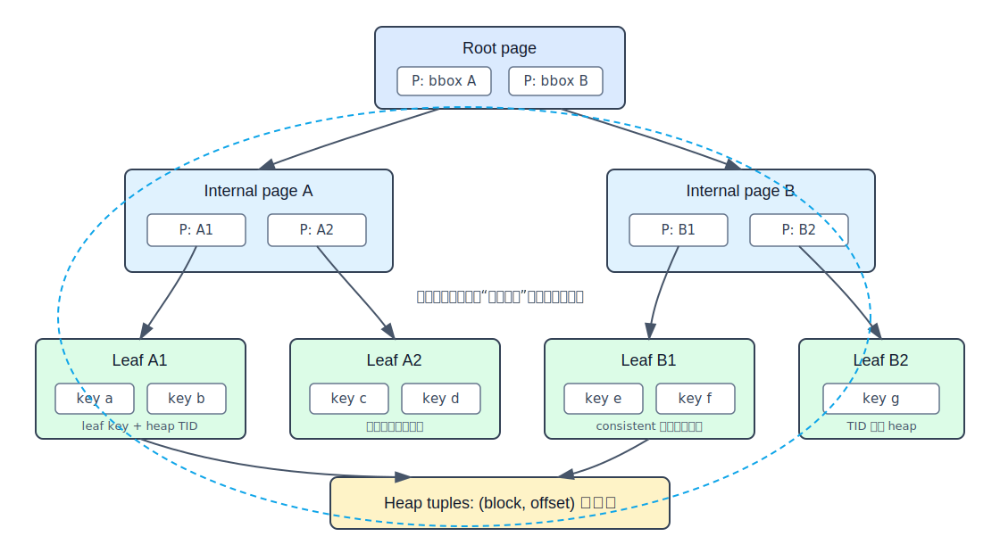
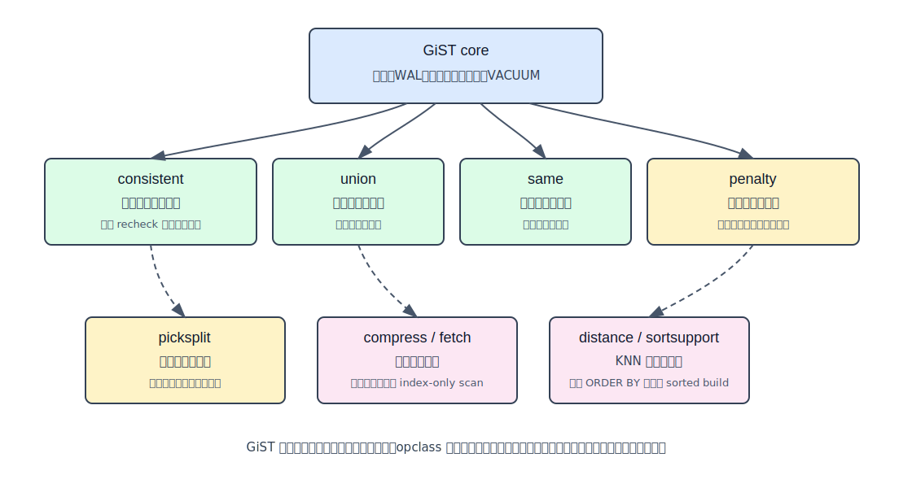
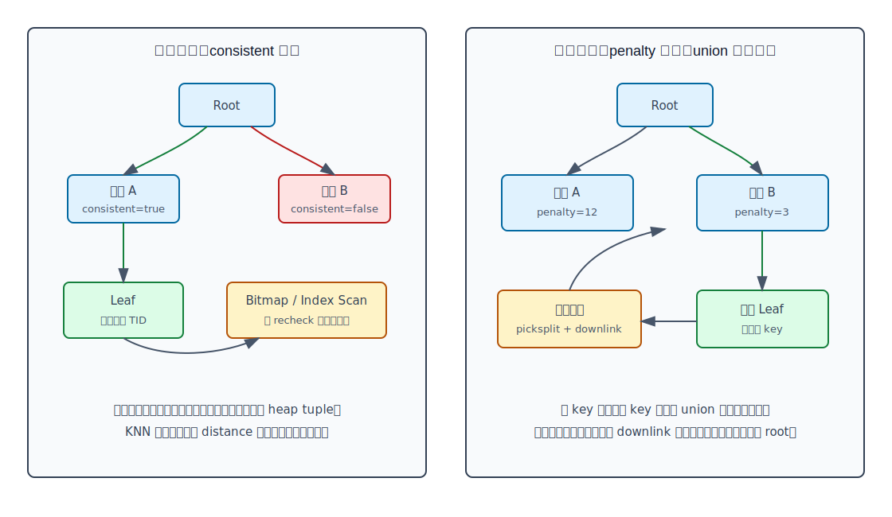
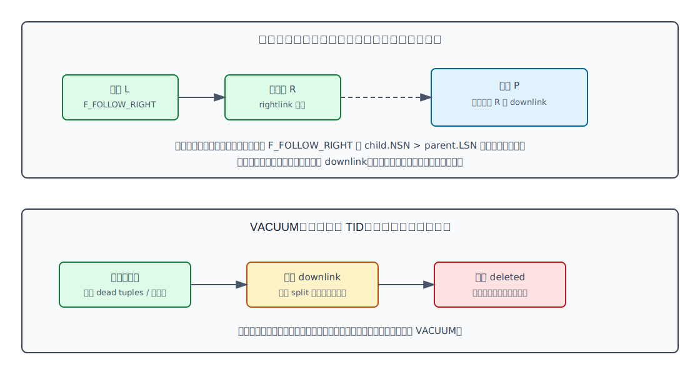
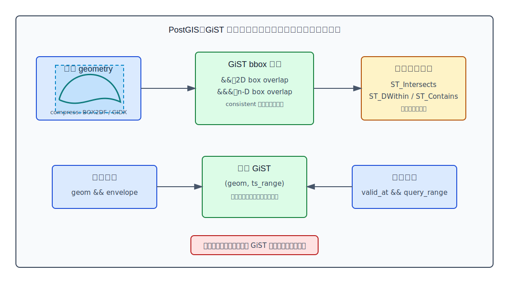

## 数据库筑基课 - GiST 索引结构
                                                                                            
### 作者                                                                
digoal                                                                
                                                                       
### 日期                                                                     
2026-05-26                                                      
                                                                    
### 标签                                                                  
PostgreSQL , 应用开发者 , DBA , 数据库筑基课 , 索引结构 , GiST , 空间索引 , KNN , 可扩展索引. 
                                                                                           
----                                                                    

## 背景


本节属于“索引结构”基础能力。当前工作区没有发现“数据库筑基课”总纲文件，因此本文先独立成篇。

业务里经常会遇到 B-tree 不顺手的问题：

- 找出和某个多边形相交的地块。
- 找出距离当前位置最近的 10 个门店。
- 判断两个时间区间、空间区域、网络地址范围是否重叠。
- 为排班、价格有效期、空间资源占用建立“不允许重叠”的约束。
- 对 PostGIS 轨迹数据同时按空间范围和时间范围过滤。

这些问题的共同点是：查询条件不再是一个线性有序标量上的 `= / < / >`，而是“一个对象是否可能满足某个领域谓词”。B-tree 可以扩展比较函数，但它的基本能力仍然围绕全序关系。GiST，全称 Generalized Search Tree，解决的是另一个层次的问题：把“搜索树的数据库工程部分”和“数据类型自己的搜索语义”拆开。

经典论文 *Generalized Search Trees for Database Systems* 把 GiST 定义为支持可扩展查询和数据类型的索引结构，可把 B+-tree、R-tree、RD-tree 等统一到一套搜索树框架里。PostgreSQL 文档也强调，GiST 不是单一索引，而是实现多种索引策略的基础设施。本文的关键结论以本地 PostgreSQL/PostGIS 源码和官方文档核对，DeepWiki 只作为源码导航辅助；DeepWiki CLI 查询在当前环境返回 `Unknown error`，未作为事实来源。

## 一、它解决什么问题？

GiST 解决的是“如何把复杂数据类型的领域谓词接入数据库级索引”的问题。

没有 GiST 时，数据库或扩展作者通常面临两个极端：

1. 为每种复杂数据结构写一个完整索引访问方法：要处理页格式、锁、WAL、崩溃恢复、并发分裂、VACUUM、优化器接口，工程成本极高。
2. 把复杂对象压成普通标量后用 B-tree：实现简单，但查询语义被迫变窄，空间相交、区间重叠、最近邻这类谓词很难自然表达。

GiST 的折中是：

- PostgreSQL GiST core 负责通用树结构、页面、WAL、锁、搜索、插入、构建、VACUUM。
- operator class 负责解释 key、query 和领域谓词，例如 PostGIS 的 bounding box、range 的区间重叠、`btree_gist` 的 B-tree 等价行为。

代价也很明确：GiST 通常保存的是“可剪枝的摘要”或“子树谓词”，很多查询只能先得到候选，再回表或复查真实值。它把问题从“精确定位一段有序 key”转化为“尽量剪掉不可能命中的子树”。当摘要太粗、数据高度重叠、第一列选择性很差时，GiST 会扫描很多候选，性能可能不如预期。

## 二、它是什么？

GiST 是 PostgreSQL 的一种索引访问方法，也是一个可扩展搜索树模板。它的基本结构是平衡树：

- **叶子页**：保存索引 key 和 heap TID。TID 指向表中的行版本。
- **内部页**：保存“子树谓词 + child block pointer”。这个谓词必须覆盖子树中的 key。
- **operator class 支持函数**：告诉 GiST 如何判断谓词是否一致、如何合并 key、如何选择插入路径、如何拆页、如何计算距离。



图 1 说明：GiST 内部节点不是 B-tree 那种严格排序边界，而是“这个子树可能包含什么”的谓词。以 R-tree-over-GiST 为例，内部节点保存的是覆盖子树的 bounding box；两个同层 bounding box 可以重叠，所以搜索可能下探多条路径。

源码入口可以直接对应这个模型：

- `postgres/src/include/access/gist.h` 定义 `GISTENTRY`、`GIST_SPLITVEC`、页标志、NSN 和 12 个 support proc 编号。
- `postgres/src/include/access/gist_private.h` 的 `GISTSTATE` 保存每列 opclass 的 `consistentFn`、`unionFn`、`compressFn`、`penaltyFn`、`picksplitFn`、`distanceFn`、`fetchFn` 等。
- `postgres/src/backend/access/gist/gist.c` 的 `gisthandler()` 注册 GiST 的 index access method 能力，例如 `amcanorderbyop = true`、`amcanmulticol = true`、`amgettuple = gistgettuple`、`amgetbitmap = gistgetbitmap`、`amcanreturn = gistcanreturn`。
- `postgres/doc/src/sgml/gist.sgml` 说明 GiST 的目标是让数据类型领域专家实现语义函数，而不是重复实现数据库底层访问方法。

## 三、核心原理

### 3.1 GiST 的本质：predicate tree

GiST 的叶子项是 `(key, TID)`，内部项是 `(predicate, child page)`。这个 predicate 不一定是范围，也不一定可排序；它只需要满足一个约束：如果某个 child 下面有可能出现匹配结果，父项的 predicate 不能把它排除。

这就是 GiST 和 B-tree 的根本差别：

- B-tree 靠全序关系定位范围，路径通常唯一。
- GiST 靠 `consistent()` 判断子树是否可能命中，路径可以有多条。
- B-tree 的内部 key 是有序分隔符；GiST 的内部 key 是由 `union()` 得到的子树摘要。

*High-Performance Extensible Indexing* 把这点说得很清楚：GiST 的核心抽象是数据库搜索树，内部页保存对子树成立的 predicate，叶子保存指向数据记录的 key/RID；搜索、插入、删除由通用算法完成，领域语义由扩展函数提供。

### 3.2 opclass 合约：哪些函数决定正确性，哪些函数决定效率

PostgreSQL 文档把 GiST support functions 分成必需和可选。核心函数包括：

- `consistent`：判断 index entry 和 query 是否一致；对内部页表示是否需要下探，对叶子页表示是否可能匹配，并通过 `recheck` 告诉执行器是否需要复查。
- `union`：把一组 entry 合成一个能覆盖它们的子树 key。
- `same`：判断两个 key 是否等价。
- `penalty`：插入时，计算把新 key 放入某个子树会带来的代价。
- `picksplit`：页满时，决定哪些 entry 留在左页、哪些移到右页，并生成两边的 union key。
- `compress` / `decompress`：把原始值转换成适合索引页存储和处理的表示。
- `distance`：支持 `ORDER BY indexed_column <-> query LIMIT n` 这类最近邻扫描。
- `fetch`：支持 index-only scan，但如果 leaf `compress` 是有损的，就不能用它重建原值。
- `sortsupport`：支持 sorted build，加速初始构建。
- `options`、`stratnum`：分别用于 opclass 参数和比较类型到策略号的转换。



图 2 说明：`consistent`、`union`、`same` 更偏正确性；如果它们错了，可能漏查或树不自洽。`penalty`、`picksplit`、`compress`、`distance` 更偏效率和能力；它们不一定导致错误，但会决定树是否重叠严重、是否膨胀、KNN 是否可用、构建是否快。

这里有一个工程判断：GiST 的通用性不是免费的。opclass 作者不写锁和 WAL，但必须认真设计摘要、距离下界、split 策略和 recheck 语义。否则索引能建出来，却可能剪枝很差，甚至产生错误答案。

### 3.3 搜索路径：consistent 剪枝，队列驱动扫描

PostgreSQL 的 `postgres/src/backend/access/gist/README` 描述了搜索算法：搜索维护一个“未访问项”队列，项可以是待访问的 index page，也可以是已知满足条件的 heap tuple。初始访问 root page，把满足条件的 page 或 tuple 放入队列；之后不断从队列取项处理。

普通 GiST 扫描倾向深度优先，这样在 `LIMIT` 较小时可以尽快返回前几个 tuple。KNN 扫描会把队列项附带距离信息：heap tuple 是精确距离，index page 是它的子树可能产生的最小距离；队列按距离从小到大弹出。



图 3 左侧说明：`consistent()` 是剪枝入口。内部页返回 false，就不访问整个子树；返回 true，只代表“可能命中”。叶子返回 true 后，执行器还要按 `recheck` 决定是否用真实行值复查。`gistgettuple()` 可以逐条返回 TID；`gistgetbitmap()` 可以把所有候选放入 `TIDBitmap`，供 Bitmap Heap Scan 使用。

源码对应：

- `postgres/src/backend/access/gist/gistget.c` 的 `gistgettuple()` 从 root 开始，按队列取页，非 KNN 时逐页返回匹配 TID。
- 同文件 `gistgetbitmap()` 从 root 开始，把匹配 TID 加入 bitmap。
- `postgres/src/include/access/gist_private.h` 的 `GISTSearchItem` 保存 `blkno`、`parentlsn` 和 `distances`，用于普通扫描和 KNN 扫描。

### 3.4 KNN：distance 必须是子树距离下界

GiST 支持 `ORDER BY indexed_column <-> query LIMIT n`，前提是 opclass 提供 ordering operator 和 `distance` support function。关键要求是：内部节点的 distance 必须是该子树里任意真实对象到 query 的距离下界。否则队列按距离出队时会把更近的真实对象排到后面，结果顺序可能错。

PostGIS 的 2D GiST 就是典型例子：

- `postgis/postgis/gserialized_gist_2d.c` 中 `gserialized_gist_distance_2d()` 对 `strategy 13` 的 `<->` 返回 box 到 query box 的最小可能距离；叶子节点会把 `recheck` 设为 true，让执行器用真实 geometry 距离修正排序。
- `strategy 14` 的 `<#>` 是 box-based distance，语义不同，复查要求也不同。
- ND 版本 `postgis/postgis/gserialized_gist_nd.c` 的 `gserialized_gist_distance()` 支持 `<<->>` 和 `|=|`，叶子同样设置 `recheck = true`。

所以 `ORDER BY geom <-> point LIMIT 10` 能利用 GiST，不是因为 GiST “知道几何距离”，而是 PostGIS opclass 提供了可用于优先队列的距离下界。

### 3.5 插入路径：penalty 选子树，union 维护父键

GiST 插入要保持树平衡，但没有 B-tree 那种唯一排序路径。算法从 root 往下走，在每层调用 `penalty()` 选择代价最小的子树。如果目标子树的 downlink key 不能覆盖新 key，就调用 `union()` 扩大 downlink key。

PostgreSQL 的实现和原始论文有差异：源码 README 说明，PostgreSQL 在向下查找插入位置时就会调整 downlink，使其覆盖新 key；这样到达 leaf 后，除非页分裂，一般不需要再向上修父节点。这个修改让崩溃恢复更简单：插入 key 后树立即自洽；即使 split 后还没来得及把新 downlink 插入父页，右半页也能通过 rightlink 从左页到达。

当页放不下新 tuple 时，GiST 调用 `picksplit()`。`postgres/src/include/access/gist.h` 的 `GIST_SPLITVEC` 要求 opclass 返回左右两侧 entry 列表和各自 union key。由于 GiST 支持变长 key、多列索引和一次插入多个 downlink，源码还允许一次分裂产生不止两个页；`postgres/src/include/access/gist_private.h` 用 `GIST_MAX_SPLIT_PAGES` 限制工程上的极端情况。

### 3.6 并发与恢复：rightlink、F_FOLLOW_RIGHT、NSN

GiST 搜索为了并发，只在扫描单个 page 时持锁。问题是：搜索看过父页之后，子页可能被并发 split；如果新右页的 downlink 还没插入父页，搜索就可能漏掉右页。

PostgreSQL GiST 用三件东西解决：

- `rightlink`：页分裂后，左页能指向右兄弟。
- `F_FOLLOW_RIGHT`：表示右页还没有父 downlink，扫描看到后要追右链。
- `NSN`：node sequence number，只在 page split 时更新。扫描记录访问父页时看到的 parent LSN，再和 child NSN 比较；如果 child NSN 大于 parent LSN，说明父页被扫描时还没看到新 downlink，需要追右链。



图 4 上半部分说明：页分裂不是一个瞬间完成的逻辑动作，而是“先分裂子页，再补父页 downlink”。GiST 用 rightlink 和 NSN 让搜索在这个窗口里仍不漏查。下半部分说明：VACUUM 清理 GiST 时，也要考虑并发 split 和旧扫描。

`postgres/src/include/access/gist.h` 定义了 `F_FOLLOW_RIGHT`、`F_DELETED`、`F_HAS_GARBAGE`、`GistNSN` 和 deleted page 的 `deleteXid`。README 的 VACUUM 部分说明，GiST VACUUM 先物理顺序扫描全索引，记录空叶子页，再尝试从父页删除 downlink；如果并发 split 让父 downlink 查找失败，本次可以放弃，留给下一次 VACUUM。当前实现只支持删除空叶子页，并且不会删除内部页的最后一个 child。

### 3.7 构建路径：sorted build 与 buffering build

GiST 初始构建有三种思路：

- 逐条插入：最简单，但大索引和随机输入容易产生大量随机 IO。
- buffering build：给部分内部节点挂 buffer，先把 tuple 推到 buffer，再批量向下 flush，减少随机 IO。README 说明这会把插入顺序从深度优先变得更接近广度优先。
- sorted build：如果所有列的 opclass 都提供 `sortsupport`，先排序输入，再自底向上构建页，类似 B-tree 构建。

`postgres/src/backend/access/gist/gistbuild.c` 中会先检查每个 key column 是否有 `GIST_SORTSUPPORT_PROC`。如果都有，则使用 `GIST_SORTED_BUILD`；否则初始化 root page，逐条插入，必要时使用 buffering。PostgreSQL 官方文档也说明，sorted method 通常是最优先选择；buffered method 能减少无序大数据构建时的随机 IO，但需要临时空间，且可能影响树质量。

### 3.8 PostGIS 如何落地：R-tree-over-GiST

PostGIS 是理解 GiST 的最好例子。PostGIS 并不把完整 geometry 放进 GiST 做复杂几何计算，而是把 geometry/geography 压缩成 bounding box：

- 2D geometry 默认 opclass `gist_geometry_ops_2d` 使用 `STORAGE box2df`。
- ND geometry opclass `gist_geometry_ops_nd` 使用 `STORAGE gidx`。
- geography opclass 也使用 `gidx`。

`postgis/postgis/postgis.sql.in` 定义了 `gist_geometry_ops_2d` 和 `gist_geometry_ops_nd`；`postgis/postgis/geography.sql.in` 定义了 `gist_geography_ops`。`postgis/postgis/gserialized_gist_2d.c` 和 `postgis/postgis/gserialized_gist_nd.c` 提供对应的 `consistent`、`compress`、`penalty`、`picksplit`、`union`、`same`、`distance`。



图 5 说明：PostGIS GiST 的第一阶段是 bounding box 过滤，用 `&&` 或 `&&&` 快速排除不可能匹配的对象；第二阶段才是 `ST_Intersects`、`ST_DWithin`、`ST_Contains` 等精确几何计算。复合 GiST 可以把空间列和范围/时间列放在同一棵树里，但第一列选择性仍然最影响扫描范围。

PostGIS 文档也明确说明，空间索引只存几何对象的 bounding box，空间查询通常先用索引作为 primary filter，再用精确空间谓词作为 secondary filter。源码里有两个值得注意的实现细节：

- `gserialized_gist_consistent_2d()` 默认把 `recheck` 设为 false，注释说这样可以避免反复把大型 geometry 拉出来复查，因为 2D box operator 本身就是 box 语义；但更精确的空间函数仍可能由上层表达式完成精确判断。
- `gserialized_gist_distance_2d()` 在 `<->` 的叶子节点设置 `recheck = true`，因为 box 最小距离只是 geometry 真距离的下界。

## 四、横向对比

| 维度 | GiST | B-tree | SP-GiST | GIN | BRIN |
|---|---|---|---|---|---|
| 核心目标 | 可扩展搜索树，支持领域谓词 | 标量全序上的等值、范围、排序 | 空间分割类搜索树 | 复合值拆 key 后的倒排索引 | 块范围摘要 |
| 树结构 | 平衡树，内部项是子树谓词 | 平衡有序树，内部项是分隔 key | 非平衡分区树，可表示 trie、quad-tree、kd-tree | entry tree + posting list/tree | revmap + range summary |
| 典型查询 | 空间相交、区间重叠、KNN、排他约束 | 主键、外键、时间范围、排序分页 | 点/空间分区、前缀/Trie 类 | JSONB/数组包含、全文、trigram | 大型追加表的粗过滤 |
| 剪枝方式 | `consistent()` 判断子树是否可能命中 | 比较函数定位 key 范围 | 分区规则决定访问节点 | key 到 TID 集合 | block range summary 是否可能命中 |
| 写入代价 | 中到高，取决于 `penalty`、split、key 大小 | 中，成熟稳定 | 取决于分区结构 | 高，一行可生成多 key | 低 |
| KNN | 支持，依赖 `distance` | 通常不是距离搜索结构 | 支持，依赖 opclass | 不擅长 | 不支持精确 KNN |
| 复查 | 常见，尤其是有损摘要 | 通常少 | 视 opclass | 常见 | 常见 |
| 主要风险 | 子树重叠、摘要粗、第一列低选择性、opclass 实现复杂 | 宽 key、随机写、膨胀 | 数据分布不适合分区时退化 | pending list、热 key、写放大 | 物理相关性差时过滤弱 |

这张表的重点不是“谁更快”，而是“谁的模型更贴合查询”。如果查询是 `WHERE id = ?`，B-tree 直接、稳定、可唯一约束。若查询是 `WHERE geom && envelope` 或 `ORDER BY geom <-> point LIMIT 10`，GiST 的 predicate tree 和 distance queue 才有意义。若查询是 `jsonb @> ...`，GIN 的 key -> TID 反向映射更自然。若大表按时间或空间装载顺序高度相关，BRIN 可能以极小空间提供足够过滤。

## 五、效果如何？

GiST 的效果来自三类收益。

第一，减少扩展索引的工程成本。1995 年 GiST 论文的核心贡献是把 B+-tree、R-tree 等搜索树的通用部分抽象出来，让新数据类型只实现领域语义。1999 年 *High-Performance Extensible Indexing* 进一步强调，GiST 把搜索、更新、并发控制和恢复封装在 core 中，外部访问方法不必重复实现这些数据库底层机制。

第二，在复杂谓词上提供有效剪枝。PostGIS 文档给出的解释很实用：空间数据有二维或更多维，普通 B-tree 不适合；PostGIS 使用 R-tree-over-GiST 存 bounding box，先过滤掉不可能匹配的几何对象，再做精确空间计算。对于大于几千行的空间表，建立 GiST 空间索引通常是基本动作。

第三，支持最近邻与复合谓词。GiST 可以用 `distance` support function 做 KNN，也可以建立多列 GiST 索引。PostgreSQL 文档提醒：多列 GiST 可被任意列子集使用，但第一列对需要扫描多少索引范围最重要；如果第一列只有很少 distinct values，GiST 可能相对低效。

但要避免把论文数字直接套到生产系统：

- *High-Performance Extensible Indexing* 的实验是在 Informix IDS/UDO GiST 架构中比较 GiST-based R-tree 和 built-in R-tree，论文报告 GiST-based R-tree 在部分插入/搜索操作中因为 UDF 调用更少而少用约 14% 到 40% CPU 时间。这个结论说明“接口边界和函数调用次数会影响扩展索引性能”，不能直接等同于 PostgreSQL GiST 比所有空间索引都快。
- *Improving Spatiotemporal Query Performance in PostGIS Through Composite GiST Indexes* 使用 1000 万条合成数据，报告复合 GiST 把某个实验查询从 1490 ms 降到 31.38 ms，约 47.5 倍。这个结果说明空间+时间条件合在一棵 GiST 里可能显著减少候选，但它依赖数据分布、查询、硬件、opclass 和统计信息。
- *Multi-Entry Generalized Search Trees for Indexing Trajectories* 针对轨迹对象提出 MGiST/MSP-GiST，把一个复杂对象分成多个 index entries，论文在点、范围和 KNN 查询上报告最高可达一个数量级提升。它说明单 entry bounding box 对复杂轨迹会过粗，但这不是当前 PostgreSQL/PostGIS 主线 GiST 的默认行为。

工程上评价 GiST，要看四个指标：索引扫描返回多少候选、回表复查比例、树是否膨胀/重叠严重、写入和 VACUUM 成本是否可接受。

## 六、实操 DEMO

以下示例未在当前环境执行，因为当前工作区只有源码，没有运行中的 PostgreSQL/PostGIS 实例和测试数据。SQL 语法按 PostgreSQL/PostGIS 文档和本地源码中的 opclass 名称编写。

### 6.1 PostGIS 2D 空间过滤

```sql
CREATE EXTENSION IF NOT EXISTS postgis;

CREATE TABLE poi (
  id bigserial PRIMARY KEY,
  name text NOT NULL,
  geom geometry(Point, 4326) NOT NULL
);

CREATE INDEX poi_geom_gist_idx
ON poi
USING gist (geom);

EXPLAIN
SELECT id, name
FROM poi
WHERE geom && ST_MakeEnvelope(120.0, 30.0, 121.0, 31.0, 4326)
  AND ST_Intersects(geom, ST_MakeEnvelope(120.0, 30.0, 121.0, 31.0, 4326));
```

这里 `geom && envelope` 是 bounding box 过滤，适合触发 GiST。`ST_Intersects` 是精确语义。实际计划可能是 `Index Scan using ...` 或 `Bitmap Index Scan` + `Bitmap Heap Scan`，取决于统计信息、选择性和成本估算。

### 6.2 KNN 最近邻

```sql
EXPLAIN
SELECT id, name
FROM poi
ORDER BY geom <-> ST_SetSRID(ST_MakePoint(120.5, 30.5), 4326)
LIMIT 10;
```

这个查询依赖 PostGIS `gist_geometry_ops_2d` 的 ordering operator `<->` 和 `gserialized_gist_distance_2d()`。由于叶子节点 box 距离不一定等于真实 geometry 距离，源码会在 `<->` 叶子场景设置 `recheck = true`。

### 6.3 空间 + 时间复合 GiST

```sql
CREATE EXTENSION IF NOT EXISTS btree_gist;

CREATE TABLE vehicle_ping (
  vehicle_id bigint NOT NULL,
  ts timestamptz NOT NULL,
  geom geometry(Point, 4326) NOT NULL,
  valid_at tstzrange GENERATED ALWAYS AS (tstzrange(ts, ts, '[]')) STORED
);

CREATE INDEX vehicle_ping_geom_time_gist_idx
ON vehicle_ping
USING gist (geom, valid_at);

EXPLAIN
SELECT vehicle_id, ts
FROM vehicle_ping
WHERE geom && ST_MakeEnvelope(120.0, 30.0, 121.0, 31.0, 4326)
  AND valid_at && tstzrange('2026-05-26 10:00+08', '2026-05-26 11:00+08', '[)');
```

这个例子把空间条件和时间范围条件放进同一棵 GiST。注意，多列 GiST 的第一列最重要。如果空间范围很大而时间条件很窄，可能需要比较 `(geom, valid_at)`、`(valid_at, geom)`、分区+B-tree/GiST 组合，不能假定一个复合 GiST 永远最好。

### 6.4 排他约束和 temporal uniqueness

```sql
CREATE EXTENSION IF NOT EXISTS btree_gist;

CREATE TABLE room_booking (
  room_id int NOT NULL,
  during tstzrange NOT NULL,
  EXCLUDE USING gist (
    room_id WITH =,
    during WITH &&
  )
);
```

这类约束用 GiST 同时表达普通标量相等和 range 重叠。`btree_gist` 为 `room_id` 这类标量提供 GiST operator class；range 类型本身有 GiST 支持。PostgreSQL 文档中的 temporal primary key / unique constraint 也说明，`WITHOUT OVERLAPS` 底层使用 GiST 思路，非时间列常需要 `btree_gist`。

## 七、最佳实践

面向数据库架构师：

- 先按谓词模型选索引，不要按名字选。空间相交、范围重叠、KNN、排他约束优先考虑 GiST；全文/JSONB/数组包含优先看 GIN；纯标量范围和排序优先 B-tree。
- 复合 GiST 的列顺序要按过滤能力和查询形态验证。PostgreSQL 文档明确指出第一列最影响扫描范围；第一列低基数时，后续列很难挽救大量扫描。
- 对轨迹、多段线、超大 polygon，要警惕单个 bounding box 过粗。必要时考虑切分对象、分区、预聚合 tile、或专门轨迹索引方案。MGiST 论文的价值就在于指出“复杂对象单 entry 摘要”会降低过滤率。

面向 DBA：

- 建索引后及时 `ANALYZE`。PostGIS 的空间选择性估算依赖统计信息，源码 `postgis/postgis/gserialized_estimate.c` 专门处理 2D 和 ND histogram/selectivity。
- 大表建 GiST 时关注 `CREATE INDEX CONCURRENTLY`、维护窗口、临时空间和 IO。GiST sorted build 依赖 opclass `sortsupport`；否则可能走逐条插入或 buffering build。
- 监控 `idx_scan`、`idx_tup_read`、`idx_tup_fetch`、查询计划中的 `Rows Removed by Filter`、`Recheck Cond`。候选很多但最终命中很少，通常说明摘要粗、统计不准、谓词写法不利于索引，或索引列顺序不合适。
- 对频繁更新的 GiST 索引，关注 VACUUM、膨胀和写放大。GiST VACUUM 对空叶子页删除是 best-effort，不要期待每次都完全回收。

面向业务开发者：

- 查询条件要写成 opclass 能识别的 operator。PostGIS 常见触发索引的是 `&&`、`&&&`、`<->`、以及能被 planner 展开为空间索引条件的函数。复杂表达式若包在函数里，可能需要表达式索引。
- `ST_DWithin(geom, point, r)` 往往比 `ST_Distance(geom, point) < r` 更容易走索引，因为前者能形成 bounding box 过滤。
- 坐标系要一致。geometry 的距离单位取决于 SRID 坐标单位；geography 更适合经纬度地球距离，但计算和索引语义不同。
- 不要把 GiST 当唯一答案。低选择性查询、大范围空间扫描、返回大比例表数据时，顺序扫描或 BRIN/分区可能更便宜。

## 八、适合与不适合场景

适合：

- 空间对象：点、线、面、地理围栏、附近搜索、空间 join 的候选过滤。
- 范围对象：时间区间、价格有效期、IP/network 包含和重叠。
- 最近邻：`ORDER BY <-> LIMIT n`，前提是 opclass 提供正确的 `distance`。
- 排他约束：会议室、设备、价格生效区间、空间资源占用不允许重叠。
- 多维候选过滤：空间+时间的组合条件，且第一列选择性足够好。

不适合：

- 纯主键、外键、唯一约束：B-tree 更直接。`btree_gist` 文档也说它通常不会超过标准 B-tree，且不能像 B-tree 那样 enforce uniqueness。
- JSONB、数组、全文的“包含多个元素”查询：GIN 的倒排结构通常更自然。
- 大范围、低选择性空间查询：如果命中大部分表，索引扫描加回表可能比顺序扫描更慢。
- 数据摘要高度重叠：例如大量跨全城的长线、覆盖全域的大 polygon，bounding box 很难剪枝。
- 写入极频繁且查询收益不明确的表：GiST 写入要维护树和 split，收益需要用计划和延迟验证。

## 九、常见坑

1. **把 `ST_Distance() < r` 当成可索引条件。**  
   更稳妥的写法通常是 `ST_DWithin(geom, point, r)`，让 planner 有机会生成 bounding box 索引条件。

2. **忘记 `ANALYZE`。**  
   空间选择性估算不准时，planner 可能不用索引，也可能误用索引。批量导入后应 `ANALYZE`。

3. **复合 GiST 列顺序凭直觉。**  
   GiST 多列索引可用任意列子集，但第一列最重要。空间范围很大、时间范围很窄时，把时间 range 放前面有时更好；也可能是时间分区 + 空间 GiST 更好。

4. **把 bounding box 命中当成精确空间命中。**  
   GiST 常常是候选过滤。PostGIS 的空间函数通常会再做精确判断；如果只写 `&&`，你得到的就是 box overlap 语义。

5. **KNN 距离和业务距离不一致。**  
   geometry `<->` 在经纬度坐标下不是米制地球距离。需要米制距离时，要评估 geography、投影坐标系或二阶段排序。

6. **忽视大对象 TOAST 和回表成本。**  
   大 geometry 即使命中少，精确复查也可能很重。可以考虑简化几何、切片、缓存 envelope、或先用轻量候选表过滤。

7. **认为 `btree_gist` 能替代 B-tree。**  
   `btree_gist` 的价值是让标量列参与 GiST 复合索引或排他约束，不是替代普通 B-tree。

8. **忽略 VACUUM 与膨胀。**  
   高更新 GiST 索引会产生死项和空页。VACUUM 删除空叶子页是 best-effort；长期膨胀时需要评估 `REINDEX CONCURRENTLY`。

## 十、扩展问题

- 如果你要给一个新数据类型设计 GiST opclass，key 应该是原值、摘要、签名，还是多段摘要？为什么？
- `consistent()` 返回 false 会剪掉整个子树。你如何证明它不会误剪？
- `distance()` 在内部节点为什么必须返回下界，而不是平均距离或中心点距离？
- PostGIS 复杂轨迹用一个 bounding box 为什么容易退化？MGiST 的 multi-entry 思路能解决什么，又会增加什么写入和存储成本？
- 对一个空间+时间查询，应该选复合 GiST、时间分区+空间 GiST、空间 GiST+B-tree bitmap AND，还是 BRIN？验证指标是什么？

## 十一、扩展阅读

- PostgreSQL 源码：`postgres/src/backend/access/gist/README`，GiST 搜索、插入、并发、构建、VACUUM 的实现说明。
- PostgreSQL 源码：`postgres/src/include/access/gist.h`，GiST public API、support proc 编号、页标志、`GISTENTRY`、`GIST_SPLITVEC`。
- PostgreSQL 源码：`postgres/src/include/access/gist_private.h`，`GISTSTATE`、扫描队列、插入栈、split 内部结构。
- PostgreSQL 源码：`postgres/src/backend/access/gist/gist.c`、`gistget.c`、`gistbuild.c`、`gistvacuum.c`。
- PostgreSQL 官方文档：[GiST Indexes](https://www.postgresql.org/docs/current/gist.html)。
- PostgreSQL 官方文档：[btree_gist](https://www.postgresql.org/docs/current/btree-gist.html)。
- PostgreSQL 文档源码：`postgres/doc/src/sgml/gist.sgml`、`postgres/doc/src/sgml/indices.sgml`、`postgres/doc/src/sgml/btree-gist.sgml`。
- PostGIS 源码：`postgis/postgis/postgis.sql.in`、`postgis/postgis/geography.sql.in` 中的 GiST opclass 定义。
- PostGIS 源码：`postgis/postgis/gserialized_gist_2d.c`、`postgis/postgis/gserialized_gist_nd.c`、`postgis/postgis/gserialized_estimate.c`。
- PostGIS 文档：[Spatial Indexes](https://postgis.net/docs/manual-3.2/using_postgis_dbmanagement.html#idm2506)。
- DeepWiki：[`postgres/postgres` Table and Index Management](https://deepwiki.com/postgres/postgres/2.3.2-table-and-index-management)，仅作为源码导航；本文关键机制已回到本地源码核对。
- DeepWiki：[`postgis/postgis` Overview](https://deepwiki.com/postgis/postgis)，用于定位 PostGIS 空间索引相关文档和源码入口。
- Joseph M. Hellerstein, Jeffrey F. Naughton, Avi Pfeffer, [Generalized Search Trees for Database Systems](https://www.sigmod.org/publications/dblp/db/conf/vldb/HellersteinNP95.html), VLDB 1995.
- Marcel Kornacker, [High-Performance Extensible Indexing](https://www.vldb.org/conf/1999/P65.pdf), VLDB 1999.
- Aisha Yousef, Anwar Alhenshiri, [Improving Spatiotemporal Query Performance in PostGIS Through Composite GiST Indexes](https://doi.org/10.54361/ajmas.269315), AlQalam Journal of Medical and Applied Sciences, 2026.
- Maxime Schoemans, Walid G. Aref, Esteban Zimányi, Mahmoud Sakr, [Multi-Entry Generalized Search Trees for Indexing Trajectories](https://arxiv.org/abs/2406.05327), arXiv:2406.05327 / SIGSPATIAL 2024.
  
## 附录  
  
1、问 gemini  
```  
PostgreSQL GiST 索引结构相关的论文、开源项目.
```  
  
2、克隆代码  
```  
git clone --depth 1 https://github.com/postgres/postgres
git clone --depth 1 https://github.com/postgis/postgis
```  
  
3、启用 codex, 使用 [数据库筑基课 skill](../skills/README.md).  
````
文章标题: 
  数据库筑基课 - GiST 索引结构
项目源码(已克隆到当前项目如下目录中):  
  postgres
  postgis
论文: 
  Generalized Search Trees for Database Systems
  High-Performance Extensible Indexing
  Improving Spatiotemporal Query Performance in PostGIS Through Composite GiST Indexes
  Multi-Entry Generalized Search Trees for Indexing Trajectories
项目 deepwiki reponame:  
  postgres/postgres
  postgis/postgis
项目参考信息: 
  postgres/CLAUDE.md
  postgis/CLAUDE.md
````
  
  
#### [PostgreSQL 解决方案集合](../201706/20170601_02.md "40cff096e9ed7122c512b35d8561d9c8")
  
  
#### [德哥 / digoal's Github - 公益是一辈子的事.](https://github.com/digoal/blog/blob/master/README.md "22709685feb7cab07d30f30387f0a9ae")
  
  
#### [About 德哥](https://github.com/digoal/blog/blob/master/me/readme.md "a37735981e7704886ffd590565582dd0")
  
  

  
