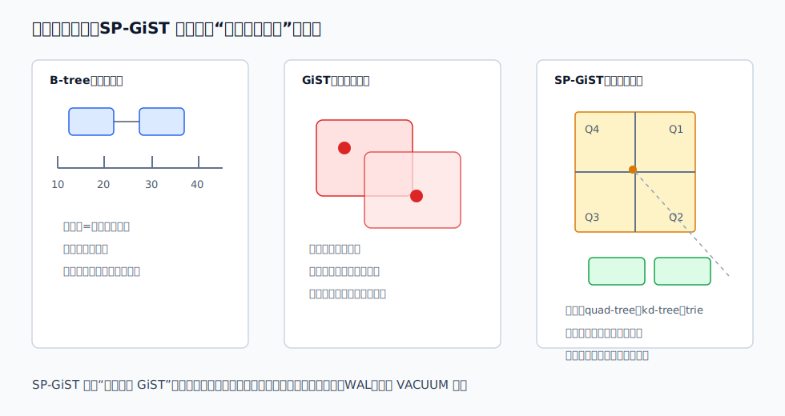
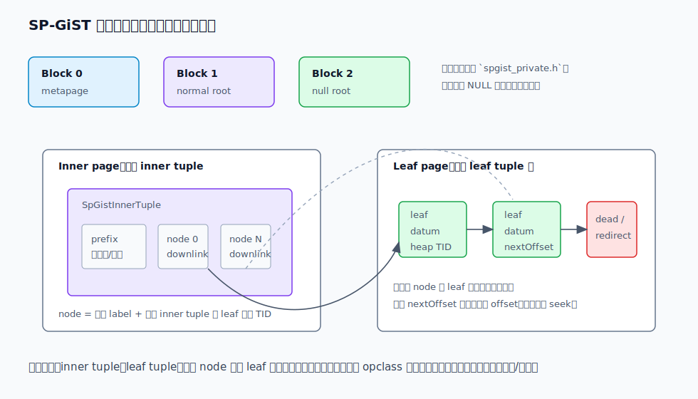
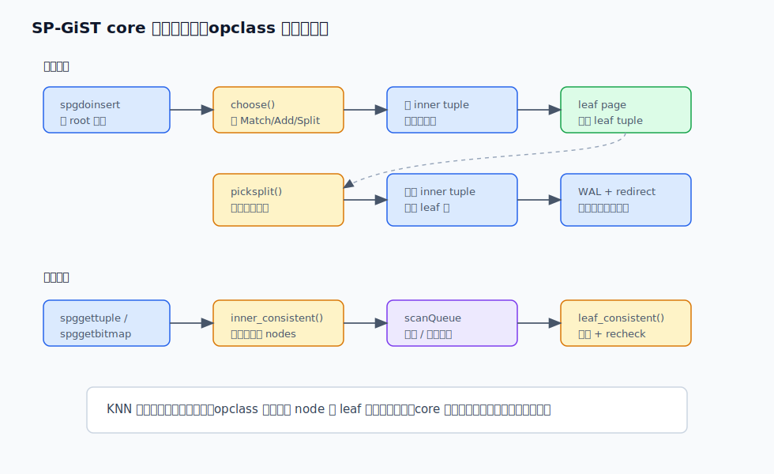
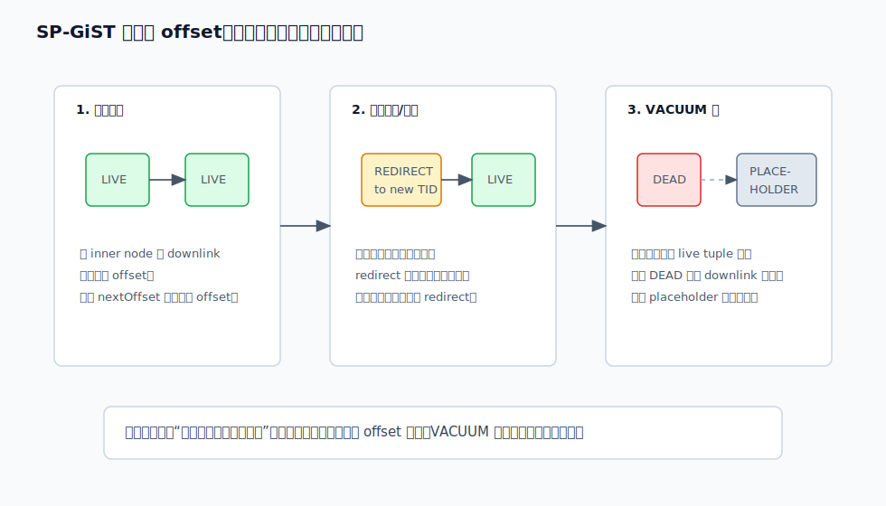
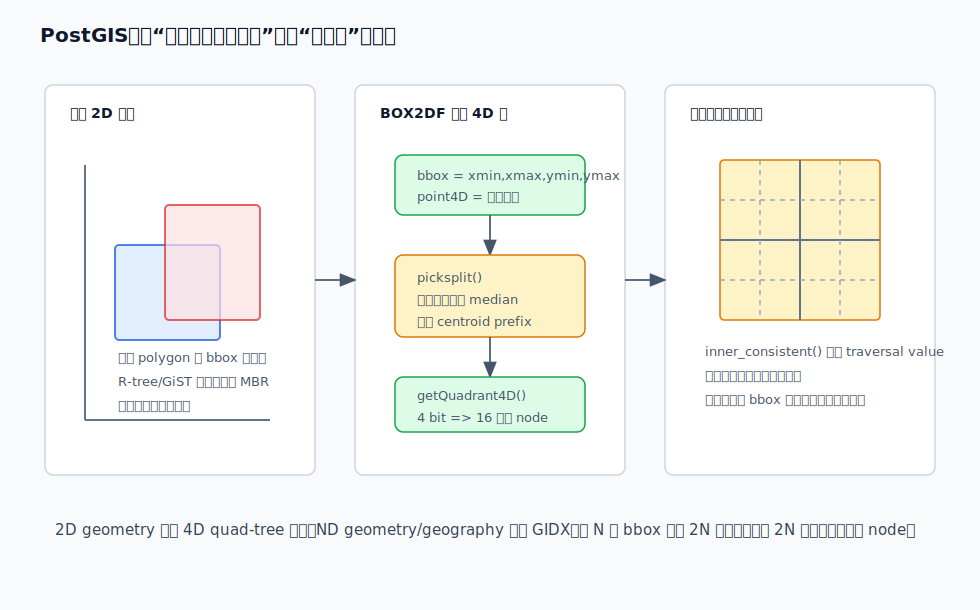

## 数据库筑基课 - SP-GiST 索引结构
                                                                                            
### 作者                                                                
digoal                                                                
                                                                       
### 日期                                                                     
2026-05-26                                                      
                                                                    
### 标签                                                                  
PostgreSQL , PostGIS , 应用开发者 , DBA , 数据库筑基课 , 索引结构 , SP-GiST , 空间索引 , Trie , Quadtree , KNN    
                                                                                           
----                                                                    

## 背景
  

本节属于“索引结构”基础能力。当前工作区没有发现“数据库筑基课”总纲文件，因此本文先独立成篇。

B-tree 擅长一维有序键：`id = ?`、`created_at between ...`、`order by price`。但业务里还有一类问题，数据本身不是一条线：

- IP 路由：`192.168.1.10` 属于哪个网络前缀？
- 文本前缀：哪些字符串以 `postgres` 开头？
- 二维点：哪些点落在一个矩形窗口里？
- 空间对象：哪些 geometry 的 bounding box 与查询窗口相交？
- 最近邻：离某个点最近的 N 个点是什么？

这些问题的共同点是：查询过程更像“沿着分区规则排除不可能的区域”，而不是“在全序键上二分”。SP-GiST，全称 Space-Partitioned GiST，就是 PostgreSQL 为这类“空间分区树”提供的索引访问方法。

本文的事实来源以本地 PostgreSQL/PostGIS 源码和文档为主，Purdue 的两篇 SP-GiST 论文用于解释设计动机和早期性能经验，DeepWiki 只作为源码导航辅助，关键结论均回到源码或官方文档核对。

## 一、它解决什么问题？

SP-GiST 解决的是：如何把 quad-tree、kd-tree、radix tree/trie 这类非平衡、递归分区树，做成数据库可用的磁盘索引。

这件事难在两个地方。

第一，经典空间分区树最早多为内存结构。内存里可以用很多小节点和指针，树很深也没问题；磁盘里如果每走一层都读一个 page，IO 成本会失控。Purdue 的 *SP-GiST: An Extensible Database Index for Supporting Space Partitioning Trees* 明确指出，quad-tree、trie、k-D tree 可能又瘦又长，若不把逻辑节点合理聚集到磁盘页，会产生大量 IO。

第二，数据库索引不只是算法。真正落地还要处理 page layout、WAL、锁、并发扫描、崩溃恢复、VACUUM、优化器接口、index-only scan、NULL、INCLUDE 列。每种数据类型都重写一遍访问方法，工程成本太高。

SP-GiST 的分工是：

- **SP-GiST core** 负责磁盘页、元组格式、插入、扫描、WAL、并发、VACUUM。
- **operator class** 负责领域语义：如何分区、如何选择子 node、如何拆分一批 leaf、哪些子分区可能满足查询、叶子值是否匹配。

它牺牲的东西也很明确：SP-GiST 不保证树平衡；分区规则如果和数据分布、查询谓词不匹配，就可能出现深路径、低剪枝率、写入分裂成本高等问题。它不是 B-tree 或 GiST 的通用替代品，而是给“递归分区”这个模型一个数据库工程化外壳。

## 二、它是什么？

SP-GiST 是 PostgreSQL 的一种 index access method，也是一个可扩展的非平衡分区树框架。官方文档把它描述为支持 partitioned search trees 的基础设施，可实现 quad-tree、k-d tree、radix tree/trie 等结构。

逻辑上，SP-GiST 索引由两类 tuple 组成：

- **inner tuple**：分支点，包含可选 `prefix` 和一组 child `node`。每个 node 有可选 label 和 downlink。
- **leaf tuple**：保存索引叶值、heap TID、可选 NULL bitmap、可选 INCLUDE 列。

和 GiST 的区别可以先抓住一句话：

- GiST 内部节点保存“可重叠的子树摘要”，例如 R-tree 的 bounding box。
- SP-GiST 内部节点保存“分区规则下的 child nodes”，通常表示互不相交的搜索空间分区。



图 1 说明：B-tree 的路径来自全序关系；GiST 的路径来自“子树是否可能命中”，同层谓词可以重叠；SP-GiST 的路径来自分区规则，例如 quad-tree 的象限、kd-tree 的左右侧、radix tree 的下一字节。查询越贴合这个分区规则，剪枝越有效。

PostgreSQL 内置 SP-GiST opclass 包括 `box_ops`、`inet_ops`、`quad_point_ops`、`kd_point_ops`、`poly_ops`、`range_ops`、`text_ops`。其中 `quad_point_ops` 是 `point` 默认 SP-GiST opclass，`kd_point_ops` 使用不同树结构；`quad_point_ops`、`kd_point_ops`、`poly_ops` 支持 `<->` ordering operator，可做 k-NN。

PostGIS 也提供 SP-GiST opclass：

- `spgist_geometry_ops_2d`：geometry 默认 SP-GiST 2D opclass，PostGIS 2.5 起可用。
- `spgist_geometry_ops_3d`：3D geometry opclass。
- `spgist_geometry_ops_nd`：N 维 geometry opclass，PostGIS 3.0 起可用。
- `spgist_geography_ops_nd`：geography 默认 SP-GiST opclass，PostGIS 3.0 起可用。

PostGIS 文档特别提醒：当前 PostGIS SP-GiST 空间索引没有 kNN 支持；这一点不同于 PostgreSQL core 中某些 point/polygon SP-GiST opclass 的 `<->` 支持。

## 三、核心原理

### 3.1 页结构：root、null root、inner page、leaf page

源码 `postgres/src/include/access/spgist_private.h` 固定了前三个 block：

- `SPGIST_METAPAGE_BLKNO = 0`：metapage，存 magic number 和 last-used page cache。
- `SPGIST_ROOT_BLKNO = 1`：普通值根页。
- `SPGIST_NULL_BLKNO = 2`：NULL 值根页。

SP-GiST 把 NULL 另放在一棵独立的树里。原因很实际：SP-GiST 假设可索引操作符是 strict 的，普通 opclass 不需要处理 NULL；但索引又需要支持全表 index scan 和 `IS NULL`。因此 NULL 由 core 用硬编码逻辑管理，不传给 opclass 支持函数。

普通页面分成 inner page 和 leaf page。inner tuple 只放在 inner page，leaf tuple 只放在 leaf page。早期索引很小时，root page 可以先直接放一堆 leaf tuple；第一次 split 后，root page 必须变成只包含一个 inner tuple。



图 2 说明：inner tuple 由“可选 prefix + node 数组”组成，node downlink 指向下层 inner tuple 或某条 leaf tuple 链。leaf tuple 链必须在同一个 leaf page 内，链路用页内 `nextOffset` 表达。这减少了跨页 seek，也带来硬边界：单个 inner tuple、单条 leaf 链、单个 leaf tuple 都不能无限增长。

这个设计解释了很多限制：

- opclass 不应产生过多 node。`spgist_private.h` 的 `SpGistInnerTupleData` 用 13 bit 记录 `nNodes`，且整个 inner tuple 仍要放进一个 page。
- prefix 和 node label 不能过大。`spgFormInnerTuple()` 会检查 inner tuple 大小。
- leaf value 不能过大，除非 opclass 设置 `longValuesOK` 并能通过逐层 suffixing 缩短 leaf datum。`text_ops` 就是典型例子。

### 3.2 opclass 合约：5 个必需函数，2 个可选函数

PostgreSQL 当前 SP-GiST support proc 编号在 `postgres/src/include/access/spgist.h` 中定义：

| support proc | 函数 | 作用 |
|---|---|---|
| 1 | `config` | 声明 prefix、label、leaf 类型，以及是否能还原原值、是否支持超长值 |
| 2 | `choose` | 插入时，在当前 inner tuple 上决定匹配已有 node、增加 node，还是拆 inner tuple |
| 3 | `picksplit` | leaf page 放不下时，把一批 leaf tuple 分配到新的 child nodes |
| 4 | `inner_consistent` | 扫描时判断哪些 child nodes 可能满足查询 |
| 5 | `leaf_consistent` | 扫描到 leaf 时判断 leaf datum 是否满足查询，并设置 recheck |
| 6 | `compress` | 可选，把输入值转换成 leaf 存储值；输入类型和 leaf 类型不同时必须提供 |
| 7 | `options` | 可选，声明 opclass 自定义参数 |

`choose()` 的输出有三个动作：

- `spgMatchNode`：新值属于某个已有 child node，继续下探。
- `spgAddNode`：当前 inner tuple 需要增加一个 child node，增加后重试 `choose()`。
- `spgSplitTuple`：当前 prefix 对新值太窄，需要把 inner tuple 拆成 upper prefix tuple 和 lower postfix tuple，拆完后重试 `choose()`。

`picksplit()` 的输出则是一次新分区：是否有 prefix、多少 node、每个 leaf tuple 映射到哪个 node、每个 leaf tuple 下层要保存什么 datum。



图 3 说明：插入和扫描都是 core 驱动、opclass 决策。插入时 `choose()` 只选一条下降路径；leaf 链放不下时 `picksplit()` 产生新的 inner tuple。扫描时 `inner_consistent()` 可以返回多个 child node；KNN 场景下还可以返回距离信息，让 core 用优先队列先访问更近的候选。

### 3.3 插入路径：先攒 root，再 split，必要时 redirect

`postgres/src/backend/access/spgist/README` 给出了插入算法的简化描述：

1. 从 root 的第一个 tuple 开始。
2. 如果当前页是 leaf page，空间够就追加 leaf tuple。
3. 如果 leaf page 空间不够，就调用 `picksplit()`，生成 inner tuple，并把 leaf tuple 分配到各 child node 的 leaf 链上。
4. 如果当前页是 inner page，就调用 `choose()`。
5. `choose()` 返回 `MatchNode` 就下探；返回 `AddNode` 就修改 inner tuple 后重试；返回 `SplitTuple` 就拆 inner tuple 后重试。

这套逻辑有几个工程点值得注意。

第一，root page 初期直接堆 leaf tuple。这样能推迟 root split，让 top-level 分区使用更多样本，避免过早用少量数据决定顶层分区。

第二，SP-GiST leaf 链不能跨页。某个 parent node 下面的一串 leaf tuple 都要在同一页。如果要追加新 leaf 时放不下，core 可能把整条链移到新页，也可能调用 `picksplit()` 把这条链变成一个下层 inner tuple。

第三，移动非空 downlink 目标时要留 redirect tuple。扫描过程一次只锁一个 page，可能已经从父页读到旧 downlink，正准备访问旧位置；如果插入同时把目标移走，旧扫描会走丢。redirect tuple 的作用就是告诉这种“在路上”的扫描去新位置。

### 3.4 扫描路径：普通扫描是待访问队列，KNN 是距离优先队列

`postgres/src/backend/access/spgist/spgscan.c` 中的扫描状态 `SpGistScanOpaqueData` 保存：

- `scanQueue`：待访问项队列，底层是 pairing heap。
- `keyData`：index quals。
- `orderByData`：ordering operators。
- `innerConsistentFn`、`leafConsistentFn`：opclass 扫描函数。
- `distances`、`zeroDistances`、`infDistances`：KNN/order by 距离相关状态。

普通扫描流程是：

1. 从 root 加入一个 search item。
2. 取出 search item，若是 inner tuple，就调用 `inner_consistent()` 返回要访问的 child nodes。
3. 若到 leaf tuple，就调用 `leaf_consistent()` 判断是否产生候选 TID。
4. `amgettuple` 逐条返回，`amgetbitmap` 把所有候选填入 bitmap。

KNN 的区别在于队列排序。opclass 可以在 `inner_consistent()` 和 `leaf_consistent()` 中返回 distances；core 把待访问 page/leaf 按距离排序。这样 `ORDER BY point <-> query LIMIT n` 可以先返回最近的候选。Purdue 的 PostgreSQL 实现论文也把 incremental nearest-neighbor search 作为 SP-GiST 的扩展能力之一；当前 PostgreSQL core 中，`quad_point_ops`、`kd_point_ops`、`poly_ops` 支持 `<->`。

### 3.5 VACUUM 与状态元组：LIVE、REDIRECT、DEAD、PLACEHOLDER

SP-GiST 的 tuple 有四种状态，定义在 `spgist_private.h`：

- `SPGIST_LIVE`：正常 tuple。
- `SPGIST_REDIRECT`：临时重定向，服务于并发扫描。
- `SPGIST_DEAD`：死 tuple，但仍可能被父 downlink 指向，因此不能简单移除。
- `SPGIST_PLACEHOLDER`：占位 tuple，用于保持页内 offset 稳定，可被后续插入复用。

VACUUM 的目标不是把树整理得“最干净”，而是在不破坏 downlink 和并发扫描的前提下回收空间。`postgres/src/backend/access/spgist/README` 说明，`spgbulkdelete` 会顺序扫描整个索引：清理可删除 leaf tuple，把过期 redirect 转成 placeholder，移除页尾不再需要的 placeholder，并更新 free space map。



图 4 说明：SP-GiST 不能随便移动或删除某个 offset，因为其他 page 的 downlink 可能正指向它。redirect 解决并发扫描“旧地址还可达”；dead 解决父 downlink 暂时仍有效；placeholder 解决页内 offset 稳定和未来复用。

另一个并发细节是 inner page 的 triple parity。README 描述了一个死锁风险：不同分支的 inner tuple 可能交叉引用两个 page，两次插入各自持有父页再等子页。SP-GiST 用“子 inner tuple 尽量放在特定 block parity 的 page 上”的规则降低这种交叉引用概率；如果条件锁失败，插入会释放并重启。这不是零成本方案，但避免了更复杂的全局锁序。

### 3.6 内置实现：quad point、kd point、text radix

PostgreSQL core 中最直观的三个实现是：

- `spgquadtreeproc.c`：`point` 的 quad-tree。prefix 是中心点，node label 省略，固定 4 个 node。`picksplit()` 默认用点集 x/y 平均值作为 centroid，把点映射到四象限。
- `spgkdtreeproc.c`：`point` 的 kd-tree。prefix 是当前层的 x 或 y 坐标，固定 2 个 node。层级 `level % 2` 决定按哪个维度切分。
- `spgtextproc.c`：`text` 的 radix tree / compressed trie。prefix 是公共前缀，node label 是下一字节，leaf datum 可以是剩余 suffix；`longValuesOK = true`，因为逐层 suffixing 可以缩短超长值。

这三个实现说明了 SP-GiST 的抽象能力：prefix 不一定是“字符串前缀”。在 quad-tree 里 prefix 是中心点，在 kd-tree 里是切分坐标，在 PostGIS 里可以是 BOX2DF/GIDX 的高维 centroid。

### 3.7 PostGIS：为什么把 bbox 当成 4D 或 2N 维点？

PostGIS 的 SP-GiST 实现位于：

- `postgis/postgis/postgis_spgist.sql.in`
- `postgis/postgis/gserialized_spgist_2d.c`
- `postgis/postgis/gserialized_spgist_3d.c`
- `postgis/postgis/gserialized_spgist_nd.c`

`gserialized_spgist_2d.c` 的文件头直接说明：这是 over `box2df` 的 4D quad-tree 类比。它的关键判断是：SP-GiST 不适合直接索引会互相重叠的对象，所以 PostGIS 把二维对象的 bounding box 当成四维点：

```text
box2df = (xmin, xmax, ymin, ymax)
```

这样，两个二维 bbox 即使在真实平面重叠，在 4D key 空间里也只是两个点。`picksplit_2d()` 对 `xmin/xmax/ymin/ymax` 分别排序取 median，形成一个 4D centroid；`getQuadrant4D()` 用四个比较位产生 16 个 quadrant；`inner_consistent_2d()` 用 traversal value 维护每个 quadrant 在 4D 空间中的边界，从而判断该 quadrant 是否可能与查询 bbox 相交、包含或满足方向关系。



图 5 说明：PostGIS 并不是把完整 geometry 放进 SP-GiST，而是把 bounding box 压成索引 key。2D 版本用 BOX2DF；ND/geography 版本用 GIDX。ND 版本把 N 维 bbox 映射为 2N 维点，并用 `0x01 << (2 * maxdims)` 生成 node 数量；`GIDX_MAX_DIM = 4` 时理论最大 node 数为 256。

这带来两个直接后果：

- 对 bbox 操作符，PostGIS SP-GiST leaf check 可以是 exact bbox check，源码中 `out->recheck = false`。
- 对真实几何谓词，例如 `ST_Intersects`，索引仍然只是第一阶段过滤；最终是否相交要由几何函数判断。

## 四、横向对比

| 维度 | SP-GiST | GiST | B-tree | GIN | BRIN |
|---|---|---|---|---|---|
| 核心模型 | 非平衡空间分区树 | 平衡 predicate tree | 一维全序树 | 倒排索引 | 块范围摘要 |
| 典型结构 | quad-tree、kd-tree、radix tree | R-tree、range tree、btree_gist | B+tree | JSONB/数组/全文 key -> TID | min/max、bloom、multi-minmax |
| 同层区域 | 通常按规则分区，不相交 | 可以重叠 | 有序分隔 | 不适用 | block range |
| 路径数量 | 插入单路径；查询可多路径 | 查询常多路径 | 通常单路径或连续范围 | 多 key 合并 posting | 扫描可能命中的 ranges |
| 树平衡 | 不保证平衡 | 平衡 | 平衡 | 多结构组合 | 非树形主索引 |
| KNN | core 支持，取决于 opclass；PostGIS SP-GiST 当前无 kNN | 支持，取决于 distance | 不擅长通用距离 | 不擅长 | 不支持 |
| 写入风险 | 分区倾斜导致深路径或频繁 split | 子树摘要膨胀、page split | 随机写、页分裂 | 写放大、pending list | 很低 |
| 空间风险 | 小 node 多、page 利用率受结构影响 | 摘要和重叠导致膨胀 | 成熟稳定 | posting list/tree 可能大 | 极小 |
| 适合 | 前缀、IP、点、分区明确的空间数据 | 重叠区域、范围、通用空间谓词 | 主键、外键、排序、标量范围 | 包含、全文、多值字段 | 追加型大表粗过滤 |

这里最容易误解的是 SP-GiST 和 GiST 的关系。名字里都有 GiST，但工程模型不同：

- GiST 是“子树摘要可能重叠”的通用平衡树，PostGIS 常用它实现 R-tree-over-GiST。
- SP-GiST 是“按分区规则递归切空间”的非平衡树，适合 trie、kd-tree、quad-tree 这类结构。

对 PostGIS 来说，GiST 更通用，支持 KNN；SP-GiST 是 GiST 的替代选择之一，文档也写明它是 lossy bounding-box index，且当前没有 kNN。实际选型要看 workload，而不是看名字。

## 五、效果如何？

SP-GiST 的收益来自三点。

第一，减少非传统索引进入数据库的工程成本。2001 年 SP-GiST 论文的核心动机就是：不希望每一种 quad-tree、trie、kd-tree 都重写 DBMS 内核里的搜索、插入、并发和恢复。PostgreSQL 当前实现延续了这个方向：opclass 写少数 support functions，core 处理页和事务工程。

第二，查询贴合分区规则时剪枝强。比如：

- `text_ops` 的 radix tree 对 `^@` 前缀查询很自然。
- `inet_ops` 对网络地址前缀关系很自然。
- `quad_point_ops` / `kd_point_ops` 对点窗口查询和点 KNN 有明确几何分区规则。
- PostGIS SP-GiST 对“bbox 在高维空间中的分区剪枝”有优势，尤其是在 R-tree bounding boxes 高度重叠时可能更有价值。

第三，SP-GiST 能把深逻辑路径聚集到更少 page 上。论文强调，空间分区树的内存节点往往很小，直接一节点一页会非常低效；SP-GiST 的核心问题就是把树节点映射到 page，使搜索即使经过多个逻辑节点，也只访问较少磁盘页。PostgreSQL 当前实现采用 inner/leaf 页分离、last-used page cache、leaf 链同页、root 延迟 split 等方式服务这个目标。

但效果不能脱离 workload。

Purdue 2006 年 *Space-Partitioning Trees in PostgreSQL: Realization and Performance* 的实验报告：在他们的 PostgreSQL 原型中，SP-GiST trie 对某些 regular expression match 搜索比 B+-tree 好两个数量级以上，kd-tree 对 point match 比 R-tree 好 300% 以上；但同一论文也报告，B+-tree 在 prefix match 上更好，R-tree 在部分 PMR quadtree 线段实验中更好，B+-tree/R-tree 的插入或索引大小也常有优势。这说明 SP-GiST 的优势是“查询形态和分区结构匹配时很强”，不是“所有场景都更快”。

PostGIS 也类似。`gserialized_spgist_2d.c` 注释说，把 bbox 当 4D 点的技术在高度重叠的 “spaghetti data” 上尤其有益；但这不是一个无条件承诺。真实效果要看：

- 查询是否使用 SP-GiST opclass 支持的 bbox 操作符。
- 数据 bbox 是否大量重叠，GiST 是否因此剪枝变差。
- 写入是否频繁，分区是否倾斜。
- 查询是否需要 KNN；PostGIS SP-GiST 当前不支持 kNN，KNN 应优先看 GiST。
- 统计信息是否及时，优化器是否愿意选索引。

## 六、实操 DEMO

以下 SQL 未在当前环境执行。当前工作区只有 PostgreSQL/PostGIS 源码，没有运行中的数据库实例和测试数据。示例按本地源码和官方文档中的 opclass 名称编写，用于给出最小验证路径。

### 6.1 PostgreSQL point：默认 quad-tree 与 kd-tree

```sql
CREATE TABLE point_demo (
  id bigserial PRIMARY KEY,
  p point
);

INSERT INTO point_demo (p)
SELECT point((random() * 10000)::int, (random() * 10000)::int)
FROM generate_series(1, 100000);

CREATE INDEX point_demo_spgist_quad_idx
ON point_demo
USING spgist (p);

CREATE INDEX point_demo_spgist_kd_idx
ON point_demo
USING spgist (p kd_point_ops);

ANALYZE point_demo;

EXPLAIN (ANALYZE, BUFFERS, COSTS OFF)
SELECT count(*)
FROM point_demo
WHERE p <@ box '(2000,2000,4000,4000)';

EXPLAIN (ANALYZE, BUFFERS, COSTS OFF)
SELECT id, p
FROM point_demo
WHERE p IS NOT NULL
ORDER BY p <-> point '(3000,3000)'
LIMIT 10;
```

验证点：

- 窗口查询应能使用 SP-GiST index scan 或 bitmap scan。
- `ORDER BY p <-> point ... LIMIT` 在 `quad_point_ops` / `kd_point_ops` 上有机会使用 KNN SP-GiST。
- 同一数据上比较 quad 与 kd，不要只看一次运行；点分布、范围大小和缓存状态都会影响结果。

### 6.2 PostgreSQL text：radix tree 与前缀查询

```sql
CREATE TABLE text_demo (
  id bigserial PRIMARY KEY,
  t text NOT NULL
);

INSERT INTO text_demo (t)
SELECT 'user-' || lpad(g::text, 8, '0')
FROM generate_series(1, 100000) AS g;

CREATE INDEX text_demo_spgist_idx
ON text_demo
USING spgist (t);

ANALYZE text_demo;

EXPLAIN (ANALYZE, BUFFERS, COSTS OFF)
SELECT count(*)
FROM text_demo
WHERE t ^@ 'user-0001';
```

`^@` 是 PostgreSQL 文档列出的 `text_ops` SP-GiST 可索引 operator。它和 `LIKE 'prefix%'` 不是同一个操作符，写 demo 时要避免把二者混淆。

### 6.3 PostGIS 2D：默认 SP-GiST geometry opclass

```sql
CREATE EXTENSION IF NOT EXISTS postgis;

CREATE TABLE geom_demo (
  id bigserial PRIMARY KEY,
  geom geometry(Polygon, 4326) NOT NULL
);

-- 这里只示意数据结构，实际请加载真实业务数据或构造测试数据。
CREATE INDEX geom_demo_spgist_2d_idx
ON geom_demo
USING spgist (geom);

ANALYZE geom_demo;

EXPLAIN (ANALYZE, BUFFERS, COSTS OFF)
SELECT id
FROM geom_demo
WHERE geom && ST_MakeEnvelope(120.0, 30.0, 121.0, 31.0, 4326);
```

验证点：

- `spgist_geometry_ops_2d` 支持 `<<`、`&<`、`&&`、`&>`、`>>`、`~=`、`~`、`@`、`&<|`、`<<|`、`|>>`、`|&>` 等 2D bbox operators。
- 如果写 `ST_Intersects(geom, query_geom)`，索引通常只做 bbox 预过滤，精确相交仍由 PostGIS 函数判断。
- PostGIS 文档写明当前 SP-GiST 空间索引没有 kNN；最近邻通常仍用 GiST 的 `<->` 路径。

### 6.4 PostGIS 3D / ND

```sql
CREATE INDEX geom_demo_spgist_3d_idx
ON geom_demo
USING spgist (geom spgist_geometry_ops_3d);

CREATE INDEX geom_demo_spgist_nd_idx
ON geom_demo
USING spgist (geom spgist_geometry_ops_nd);

-- 3D bbox overlap operator
EXPLAIN
SELECT id
FROM geom_demo
WHERE geom &/& ST_3DMakeBox(
  ST_MakePoint(120.0, 30.0, 0.0),
  ST_MakePoint(121.0, 31.0, 100.0)
);

-- ND bbox overlap operator
EXPLAIN
SELECT id
FROM geom_demo
WHERE geom &&& ST_MakeEnvelope(120.0, 30.0, 121.0, 31.0, 4326);
```

3D opclass 的 operators 在 `postgis_spgist.sql.in` 中包括 `&/&`、`~==`、`@>>`、`<<@`。ND opclass 包括 `&&&`、`~~=`、`~~`、`@@`。实际项目中不要为了“维度更多”盲目建 ND 索引；如果数据和查询只有 2D bbox，2D opclass 往往更直接。

## 七、最佳实践

### 面向数据库架构师

把 SP-GiST 放在“模型匹配”的位置上评估。

- 前缀、IP、点、空间分区明确的数据，可以进入候选方案。
- 高度重叠的空间 bbox，可以和 GiST 做 A/B 测试。
- 需要 PostGIS KNN 最近邻时，不要把 SP-GiST 当默认答案；当前 PostGIS 文档明确无 kNN 支持。
- 如果查询是普通标量等值、范围、排序，优先 B-tree。
- 如果是 JSONB/数组/全文包含，优先 GIN。
- 如果是追加型大表粗过滤，评估 BRIN。

### 面向 DBA

验证时不要只看“用了索引没有”，要看候选数量和回表成本。

推荐检查：

```sql
EXPLAIN (ANALYZE, BUFFERS)
SELECT ...
```

关注：

- `Index Scan` / `Bitmap Index Scan` 是否出现。
- `Rows Removed by Filter` 是否很高。
- `Heap Blocks` 是否说明回表过多。
- `shared read/hit` 是否被缓存状态影响。
- `VACUUM (ANALYZE)` 后计划是否变化。

构建生产索引时，PostGIS 文档建议可用：

```sql
CREATE INDEX CONCURRENTLY index_name
ON table_name
USING spgist (geom);

VACUUM ANALYZE table_name;
```

`CREATE INDEX CONCURRENTLY` 降低写阻塞，但构建时间更长，失败后可能留下 invalid index，需要 DBA 按 PostgreSQL 常规流程处理。

### 面向业务开发者

SQL 要写成 opclass 支持的谓词，索引才有机会工作。

- PostgreSQL `text_ops` 前缀查询用 `^@`。
- PostgreSQL `point` 窗口查询可用 `<@ box`。
- PostGIS SP-GiST 主要加速 bbox operators，例如 `&&`、`&&&`、`&/&`。
- 精确几何谓词通常要配合 bbox 过滤理解，不要以为 SP-GiST 存了完整 geometry。

写空间查询时，先问两个问题：

1. 第一阶段能不能用 bbox 排除大量对象？
2. 第二阶段的精确谓词是否仍然需要大量 CPU？

如果第一阶段剪枝弱，换索引类型也未必救得了，需要重新看数据模型、切分策略、统计信息、业务过滤条件。

## 八、适合与不适合场景

适合：

- IP/network 包含、前缀匹配、点数据窗口查询。
- `text ^@ prefix` 这类 radix tree 能自然表达的查询。
- 点 KNN，使用 PostgreSQL core 支持 `<->` 的 SP-GiST opclass。
- PostGIS bbox 查询，尤其是 GiST/R-tree 受大量重叠 bbox 影响时。
- 自定义数据类型有明确分区规则，且愿意实现 SP-GiST support functions。

不适合：

- 需要唯一约束、主键、外键支撑的标量键：用 B-tree。
- 需要全序排序分页：用 B-tree。
- PostGIS 最近邻：当前优先 GiST，因为 PostGIS SP-GiST 无 kNN。
- 查询和分区规则不匹配，例如空间数据只靠非空间属性过滤。
- 数据高度倾斜且没有好的分区策略，可能产生深树。
- 高频更新且索引收益不明显的表，SP-GiST split、redirect、VACUUM 成本可能抵消收益。

## 九、常见坑

1. **把 SP-GiST 当 GiST 的升级版。**  
   不是。GiST 和 SP-GiST 的树模型不同。PostGIS 中 GiST 更通用且支持 KNN；SP-GiST 是某些 bbox workload 的替代方案。

2. **忽略 PostGIS SP-GiST 无 kNN。**  
   PostGIS 文档明确写着当前无 kNN 支持。`ORDER BY geom <-> point LIMIT n` 通常看 GiST，不看 SP-GiST。

3. **用错操作符。**  
   `text_ops` 支持 `^@`，不是所有 `LIKE` 写法都等价。PostGIS SP-GiST 支持的是 bbox operators，精确空间函数是否能触发索引要看表达式改写和操作符。

4. **只看是否 Index Scan，不看候选规模。**  
   有索引扫描不等于快。bbox 太粗、分区不匹配、统计信息旧，都可能让索引扫描返回大量候选。

5. **忘记 ANALYZE。**  
   新建索引后不更新统计信息，优化器可能继续选 seq scan。PostGIS 文档也建议建索引后 `VACUUM ANALYZE`。

6. **以为 leaf datum 一定是原值。**  
   SP-GiST leaf 可以保存 lossy 或 partial value。`text_ops` 可以保存 suffix；PostGIS 保存 bbox 而不是完整 geometry。是否能 index-only scan，取决于 `canReturnData` 和 opclass 能否还原原值。

7. **自定义 opclass 时让 node 或 prefix 过大。**  
   inner tuple 必须放进一个 page。radix tree 的 `spgtextproc.c` 对最大 prefix 长度有专门限制，就是为了避免 inner tuple 过大。

8. **忽略 NULL 独立树。**  
   SP-GiST 会索引 NULL，但 opclass 不会看到 NULL。调试 `IS NULL` 计划时，不要从普通 opclass support function 找 NULL 分支。

## 十、扩展问题

1. 如果你的业务对象是轨迹，单个 bounding box 很粗，应该用 GiST、SP-GiST，还是把轨迹切成多段后多 entry 索引？
2. 如果点数据强烈聚集在少数热点区域，quad-tree 和 kd-tree 哪个更容易退化？如何用实验验证？
3. PostGIS 的 4D bbox 映射解决了什么问题？它又丢失了哪些真实几何信息？
4. 对一个自定义类型，哪些信息适合作为 inner tuple prefix，哪些信息只适合作为 traversal value？
5. 为什么 SP-GiST 要让 leaf 链留在同一页？如果允许跨页，会简化什么，又会牺牲什么？

## 十一、扩展阅读

- PostgreSQL 官方文档：SP-GiST Indexes，`https://www.postgresql.org/docs/current/spgist.html`
- PostgreSQL 本地源码：`postgres/doc/src/sgml/spgist.sgml`
- PostgreSQL 本地源码：`postgres/src/backend/access/spgist/README`
- PostgreSQL 本地源码：`postgres/src/include/access/spgist.h`
- PostgreSQL 本地源码：`postgres/src/include/access/spgist_private.h`
- PostgreSQL 本地源码：`postgres/src/backend/access/spgist/spgquadtreeproc.c`
- PostgreSQL 本地源码：`postgres/src/backend/access/spgist/spgkdtreeproc.c`
- PostgreSQL 本地源码：`postgres/src/backend/access/spgist/spgtextproc.c`
- PostgreSQL 回归测试：`postgres/src/test/regress/sql/create_index_spgist.sql`
- PostGIS 文档：`postgis/doc/using_postgis_dataman.xml` 的 SP-GiST Indexes 小节
- PostGIS 本地源码：`postgis/postgis/postgis_spgist.sql.in`
- PostGIS 本地源码：`postgis/postgis/gserialized_spgist_2d.c`
- PostGIS 本地源码：`postgis/postgis/gserialized_spgist_3d.c`
- PostGIS 本地源码：`postgis/postgis/gserialized_spgist_nd.c`
- PostGIS 回归测试：`postgis/regress/core/regress_spgist_index_2d.sql`、`regress_spgist_index_3d.sql`、`regress_spgist_index_nd.sql`
- Purdue SP-GiST 项目主页：`https://www.cs.purdue.edu/research/spgist/`
- Walid G. Aref, Ihab F. Ilyas, *SP-GiST: An Extensible Database Index for Supporting Space Partitioning Trees*, Journal of Intelligent Information Systems, 2001.
- Mohamed Y. Eltabakh, Ramy Eltarras, Walid G. Aref, *Space-Partitioning Trees in PostgreSQL: Realization and Performance*, ICDE 2006.
- DeepWiki：`postgres/postgres` 与 `postgis/postgis` 的源码结构问答，用于导航，本文关键事实已用本地源码和文档复核。
  
## 附录  
  
1、问 gemini  
```  
PostgreSQL SP-GiST 索引结构相关的论文、开源项目.
```  
  
2、克隆代码  
```  
git clone --depth 1 https://github.com/postgres/postgres
git clone --depth 1 https://github.com/postgis/postgis
```  
  
3、启用 codex, 使用 [数据库筑基课 skill](../skills/README.md).  
````
文章标题: 
  数据库筑基课 - SP-GiST 索引结构
项目源码(已克隆到当前项目如下目录中):  
  postgres
  postgis
论文: 
  SP-GiST: An Extensible Database Index for Supporting Space Partitioning Trees
  Space-Partitioning Trees in PostgreSQL: Realization and Performance
项目 deepwiki reponame:  
  postgres/postgres
  postgis/postgis
项目参考信息: 
  postgres/CLAUDE.md
  postgis/CLAUDE.md
````
  
  
#### [PostgreSQL 解决方案集合](../201706/20170601_02.md "40cff096e9ed7122c512b35d8561d9c8")
  
  
#### [德哥 / digoal's Github - 公益是一辈子的事.](https://github.com/digoal/blog/blob/master/README.md "22709685feb7cab07d30f30387f0a9ae")
  
  
#### [About 德哥](https://github.com/digoal/blog/blob/master/me/readme.md "a37735981e7704886ffd590565582dd0")
  
  

  
