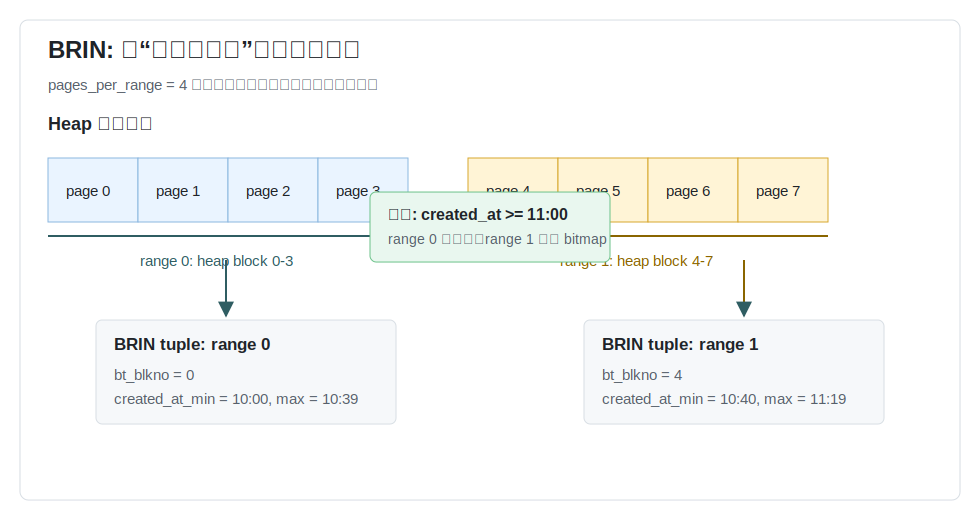
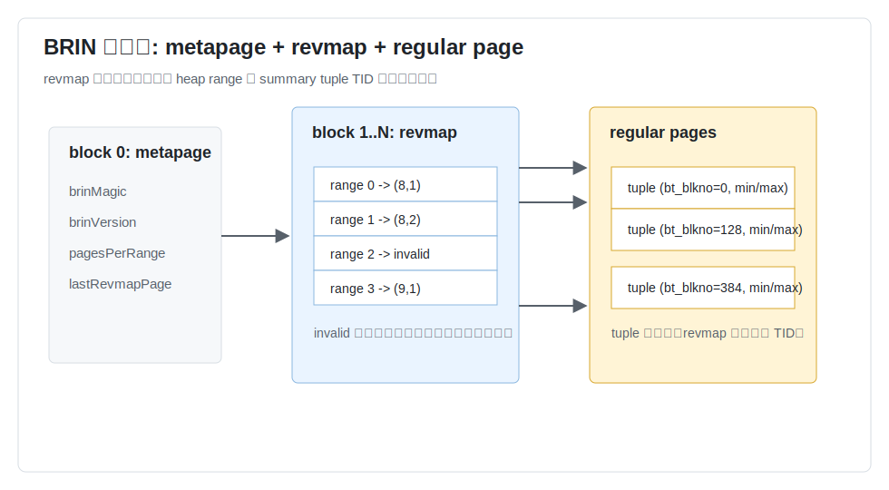
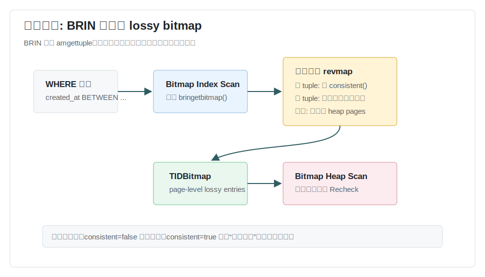
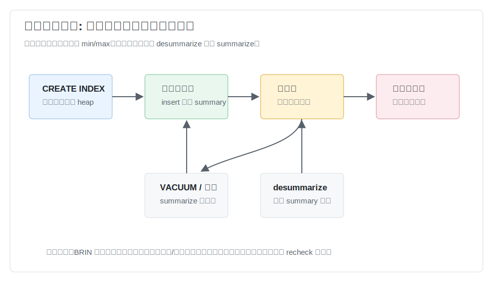
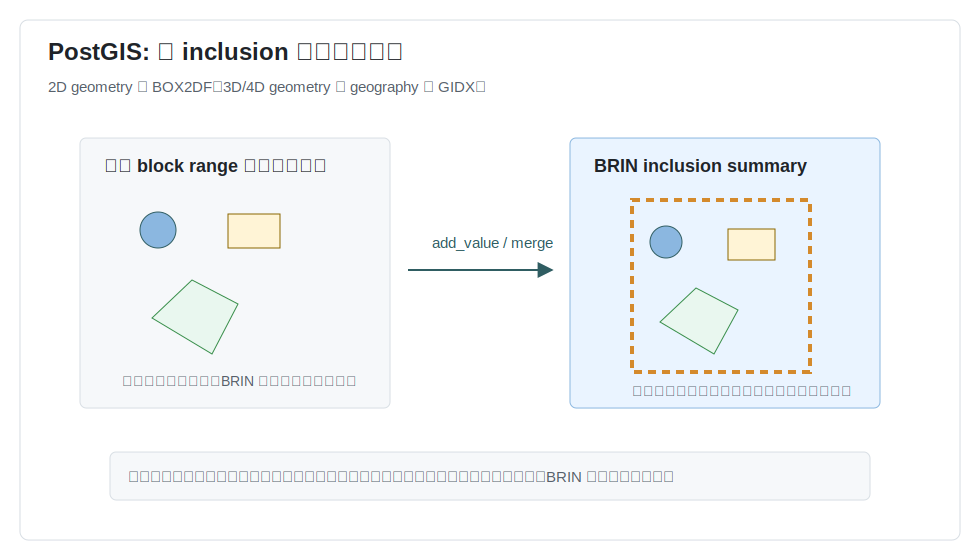

## 数据库筑基课 - BRIN 索引结构
                                                                                            
### 作者                                                                
digoal                                                                
                                                                       
### 日期                                                                     
2026-05-26                                                      
                                                                    
### 标签                                                                  
PostgreSQL , 应用开发者 , DBA , 数据库筑基课 , 索引结构 , BRIN , 块范围索引 , 数据湖
                                                                                           
----                                                                    

## 背景
  


本节属于“索引结构”基础能力。当前工作区没有发现“数据库筑基课”总纲文件，因此本文先独立成篇。

业务里有一种表很常见：数据量极大，持续追加，查询通常按时间、递增 ID、批次号、地理瓦片、物流轨迹顺序做范围过滤。例如：

- 交易流水表按 `created_at` 追加写入，查询最近一天或某个历史窗口。
- 物联网时序表按设备上报时间写入，排障时扫某个时间段。
- 日志表按 ingest time 入库，分析时先粗筛时间再做聚合。
- PostGIS 大表按装载顺序接近空间顺序，查询某个窗口内的 geometry。
- 冷热分层或数据湖文件里，每个 row group / stripe 已经有 min/max、zone map 或统计摘要。

如果用 B-tree，索引能精确定位键范围，但超大表上每行都有索引项，写入、空间和维护成本都高。如果完全顺序扫描，写入便宜，但每次查询都要读大量无关页面。BRIN，Block Range Index，解决的是中间问题：不记录每行在哪里，只记录一段连续 heap 页面里“可能有什么”。

一句话：BRIN 是 PostgreSQL 的内置 zone map。它用很小的索引换取“能跳过大块无关页面”的能力，代价是过滤是有损的，必须回表复查。

本文以本地 PostgreSQL/PostGIS 源码、官方文档、DeepWiki 的 PostgreSQL 查询结果为主。用户给出的论文题名中，`Minmax Indexes in PostgreSQL` 能对应到 PostgreSQL BRIN/minmax 设计脉络；`Block Range Indexes in Analytical Data Lakes: Algorithms, Implementations, and Extensions` 在当前环境未定位到可核验全文，因此只作为数据湖类比方向，不作为事实来源。

## 一、它解决什么问题？

BRIN 解决的是“超大表范围查询如何低成本跳过不可能命中的物理页面”的问题。

传统选择通常有三个：

| 做法 | 好处 | 代价 |
|---|---|---|
| 顺序扫描 | 写入最便宜，不维护索引 | 每次读大量无关页面 |
| B-tree | 精确、可排序、适合点查和窄范围 | 每行有索引项，索引大，随机写和维护成本高 |
| 分区 | 可以按分区元数据裁剪 | 粒度较粗，分区过多带来管理成本 |

BRIN 的思路是把问题改写成：

> 不问“哪几行命中”，只问“哪些连续页面范围不可能命中”。

如果一段 heap 页面里 `created_at` 的 min/max 是 `[2026-05-01, 2026-05-02]`，而查询条件是 `created_at >= '2026-05-20'`，这段页面可以直接跳过。反过来，如果 min/max 与查询条件有交集，BRIN 不能证明里面没有匹配行，就把整段页面交给 `Bitmap Heap Scan` 复查。

这就是 BRIN 的基本交易：

- 用每个 block range 一个摘要元组，换取极小索引体积。
- 用物理相关性，换取块级跳过能力。
- 用 lossy bitmap 和 recheck，换取简单、稳定、写入友好的结构。

## 二、它是什么？

BRIN 是 PostgreSQL 的一种索引访问方法。它把 heap 表按连续物理页面切成 block range，也叫 page range。每个 range 存一个 summary tuple。summary tuple 的内容由 operator class 决定：

- `minmax`：保存该范围内最小值和最大值，适合有线性排序语义的类型。
- `minmax-multi`：保存多个 min/max 区间，适合一个范围内有少量簇但整体 min/max 太宽的情况。
- `bloom`：保存该范围内值的 Bloom filter，适合等值过滤。
- `inclusion`：保存能包含范围内所有值的摘要，例如几何外包框。



图 1 说明：BRIN 不保存 `(key, TID)`，也不形成 B-tree 那种有序搜索路径。它只保存“这一组连续页面的摘要”。查询能证明某个 range 不可能命中时跳过；不能证明时返回整段页面。

源码里的几个结构能直接对应这个定义：

- `postgres/src/include/access/brin.h` 定义 `BRIN_DEFAULT_PAGES_PER_RANGE = 128`，并通过 `BrinOptions` 保存 `pagesPerRange` 和 `autosummarize`。
- `postgres/src/include/access/brin_page.h` 定义 BRIN page 类型：`BRIN_PAGETYPE_META`、`BRIN_PAGETYPE_REVMAP`、`BRIN_PAGETYPE_REGULAR`。
- `postgres/src/include/access/brin_tuple.h` 定义 `BrinTuple` 和 `BrinMemTuple`。一个 BRIN tuple 对应一个 heap block range，字段 `bt_blkno` 记录该 tuple 覆盖的起始 heap block。
- `postgres/src/backend/access/brin/README` 明确说明 BRIN 没有 item pointer 级索引项，只支持 `amgetbitmap`，返回 lossy `TIDBitmap`。

## 三、核心原理

### 3.1 物理结构：metapage、revmap、regular page

BRIN 索引文件不是一棵搜索树。它由三类页组成：

- **metapage**：固定在 block 0，保存 magic、version、`pagesPerRange`、最后一个 revmap 页号。
- **revmap page**：reverse range map。它是定长数组，按 range 编号保存 summary tuple 的 TID。
- **regular page**：真正存放 BRIN summary tuple。



图 2 说明：revmap 的作用是通过算术快速从 heap block 找到对应 range，再找到 summary tuple。summary tuple 可以移动到新的 regular page；只要 revmap 指向新 TID，扫描就能找到它。如果 revmap entry 是 invalid TID，这个范围就是未摘要范围。

这个结构解释了 BRIN 为什么小：假设表有 1 TB，页面大小 8 KB，约 134,217,728 个 heap pages。如果 `pages_per_range = 128`，summary tuple 数量约 1,048,576 个。它不是每行一条索引项，而是每 128 个 heap pages 一条摘要。

但它也解释了 BRIN 的上限：如果每个 range 的 min/max 都很宽，或者所有 range 都与查询条件相交，BRIN 最后会把大量页面交给 Bitmap Heap Scan，效果接近顺序扫描，还多了一次索引扫描。

### 3.2 minmax opclass：两个值决定一个范围

最容易理解的是 `brin_minmax.c`：

- `brin_minmax_opcinfo()` 声明该 opclass 每列存 2 个值。
- `brin_minmax_add_value()` 插入新 heap tuple 时，如果新值小于当前 min 或大于当前 max，就更新摘要。
- `brin_minmax_consistent()` 扫描时判断查询条件是否与 `[min, max]` 有可能相交。
- `brin_minmax_union()` 合并两个摘要时扩展 min/max。

对 `WHERE col = 42`，minmax 的一致性条件是：

```text
min <= 42 AND max >= 42
```

对 `WHERE col > 42`，只要 `max > 42` 就不能跳过。对 `WHERE col < 42`，只要 `min < 42` 就不能跳过。

注意这里的“不能跳过”不等于“命中”。它只表示 range 内可能有匹配行。BRIN 的正确性要求是不能漏掉可能命中的页面；多返回候选页面是允许的，因为执行器会复查。

### 3.3 查询路径：BRIN 只有 bitmap scan

`brinhandler()` 注册的 `IndexAmRoutine` 里，`amgettuple = NULL`，`amgetbitmap = bringetbitmap`。这意味着 BRIN 不能像 B-tree 那样逐条返回 TID，只能返回 bitmap。

`bringetbitmap()` 的路径是：

1. 打开 heap relation，拿到 heap block 数量。
2. 按 `pagesPerRange` 从 heap block 0 开始迭代。
3. 对每个 range，通过 `brinGetTupleForHeapBlock()` 从 revmap 找 summary tuple。
4. 如果没有 tuple，说明 range 未摘要，必须把该 range 的所有页面加入 bitmap。
5. 如果有 tuple，反序列化为 `BrinMemTuple`。
6. 按列调用 opclass 的 `consistent` support function。
7. 若摘要与 scan key 一致，把该 range 内所有 heap page 加入 `TIDBitmap`。
8. 上层 `Bitmap Heap Scan` 访问候选页，并按真实 tuple 复查条件。



图 3 说明：BRIN 的输出单位是 heap page，不是 row。它把候选页加入 lossy bitmap；最终哪些行符合条件，要由 heap scan 读取页面后判断。正因为如此，`EXPLAIN` 里 BRIN 常表现为 `Bitmap Index Scan` + `Bitmap Heap Scan`，并且可能看到 `Recheck Cond`。

### 3.4 建索引和插入：摘要从扫描中形成

`brinbuild()` 创建索引时会：

- 初始化 metapage。
- 初始化 revmap。
- 按 heap 物理顺序扫描表。
- 每走满一个 range，把该 range 的累计摘要形成 BRIN tuple 并插入 regular page。
- 对空范围回填 empty range tuple，避免某些选择性查询退化成全表重扫。

源码注释强调：普通串行构建禁用 syncscan，因为 BRIN 构建需要按 heap block 物理顺序产出 range。

插入路径由 `brininsert()` 维护：

- 根据 heap TID 算出 `heapBlk = floor(origHeapBlk / pagesPerRange) * pagesPerRange`。
- 如果该 range 已经有摘要 tuple，就用 `add_values_to_range()` 尝试把新值并入摘要。
- 如果新值仍在旧摘要范围内，不更新索引。
- 如果摘要需要变宽，优先尝试同页更新；放不下时可创建新 tuple 并更新 revmap。
- 如果该 range 未摘要，插入不做任何 BRIN 更新。

这解释了 BRIN 写入成本低的原因：很多插入不会改变 min/max；即使改变，也只更新当前 range 的一个摘要，而不是为每行插入索引项。

### 3.5 未摘要范围：正确性优先

BRIN 的一个重要边界是 unsummarized range。

当新数据进入一个全新的 page range 时，PostgreSQL 默认不会立即创建摘要 tuple。未摘要 range 的 revmap entry 是 invalid TID。查询遇到 invalid TID 时，`bringetbitmap()` 必须把这段页面全部加入 bitmap。

这样做保证正确性：没有摘要，就不能证明任何页面不匹配。

摘要可以由几种方式产生：

- `CREATE INDEX` 时扫描已有数据。
- `VACUUM` 或 autovacuum 对未摘要范围做 summarization。
- 显式调用 `brin_summarize_new_values(index regclass)`。
- 显式调用 `brin_summarize_range(index regclass, blockNumber bigint)`。
- 开启 `autosummarize` 后，插入进入新 range 的第一个页面时，向 autovacuum 发送前一个 range 的 summarization 请求。



图 4 说明：BRIN 的摘要维护不是“每一行都同步精确更新”。已摘要 range 上的插入会尝试扩展摘要；新 range 可能先保持未摘要；VACUUM、手工函数或 autosummarize 再补摘要。删除旧行不会自动让 min/max 变窄。

### 3.6 删除、更新和 VACUUM：为什么摘要会变粗

BRIN 不保存 heap TID 列表，所以 heap tuple 删除时不需要像 B-tree 那样清理每条索引项。这是优点。

但它也带来一个问题：如果某个 range 的 min 值或 max 值对应的 heap tuple 被删除，BRIN 不知道应该把 min/max 收紧到哪个值。源码 README 说得很直接：这不是正确性问题，而是优化机会；当前设计更简单的做法是需要时重新摘要。

工程含义：

- 大量乱序 UPDATE 会让 range 的 min/max 逐渐变宽。
- 删除极值不会自动提升过滤能力。
- 当查询候选页比例显著上升时，可以考虑 `brin_desummarize_range()` 后重新 summarize，或直接 `REINDEX`。
- 对纯追加时间序列表，BRIN 通常更稳；对频繁回填、修正历史时间的数据，要谨慎。

### 3.7 `pages_per_range`：小索引和强过滤之间的旋钮

`pages_per_range` 决定一个 summary tuple 覆盖多少 heap pages。PostgreSQL 源码默认是 128。

调大：

- 索引更小。
- revmap 和 regular page 更少。
- 每个摘要更宽，过滤能力下降。
- 返回候选页更多，recheck 代价更高。

调小：

- 摘要更细，能跳过更多页面。
- 索引变大，构建和维护成本上升。
- 对局部乱序或热点回填更耐受。

一个实用判断：`pages_per_range` 不应该只按表大小选，而要按“一个 range 内业务键的跨度”选。对 8 KB page、默认 128 pages/range 来说，一个 range 约 1 MB heap 数据。如果 1 MB 内的 `created_at` 跨度已经很大，时间范围查询就会返回太多候选页。

### 3.8 PostGIS 的 BRIN：inclusion opclass 存 bounding box

PostGIS 给 geometry/geography 提供 BRIN inclusion operator class：

- `brin_geometry_inclusion_ops_2d` 默认用于 `geometry`，存储类型是 `box2df`。
- `brin_geometry_inclusion_ops_3d`、`brin_geometry_inclusion_ops_4d` 存储类型是 `gidx`。
- `brin_geography_inclusion_ops` 默认用于 `geography`，存储类型是 `gidx`。

源码里 `postgis/postgis/brin_2d.c` 的 `geom2d_brin_inclusion_add_value()` 会把 geometry 转成 `BOX2DF`，并把当前 range 的 box 扩大到包含新 geometry 的 box。`postgis/postgis/brin_nd.c` 对 geography、3D、4D geometry 做类似处理，使用 `GIDX`。



图 5 说明：PostGIS BRIN 不在索引里做精确几何判断。它保存的是一个 block range 内所有对象的外包范围。查询框与该外包范围没有交集时可以跳过；有交集时只能返回候选页面。若数据按空间顺序装载，过滤有效；若空间对象随机散布，每个 range 的外包框会越来越大，BRIN 很快退化。

## 四、横向对比

| 维度 | BRIN | B-tree | GiST | GIN | 分区裁剪 / 数据湖 zone map |
|---|---|---|---|---|---|
| 核心目标 | 用块范围摘要跳过页面 | 精确定位有序键 | 复杂谓词的可扩展搜索树 | 复合值倒排 | 用元数据跳过分区、文件、row group |
| 索引项粒度 | 每个 page range 一条摘要 | 通常每行一条 key/TID | 每行或对象摘要进入树 | value/key 到 TID 集合 | 分区、文件、stripe、row group |
| 读取方式 | Bitmap Index Scan + recheck | Index Scan / Bitmap Scan / Index Only | Index Scan / Bitmap Scan / KNN | Bitmap Scan 常见 | 执行前或扫描层裁剪 |
| 写入代价 | 低，摘要变宽时更新 | 中，随机写明显 | 中到高，取决于 opclass | 高，一行可能多 key | 取决于元数据生成 |
| 空间成本 | 极低 | 中到高 | 中到高 | 高 | 低 |
| 适合场景 | 超大追加表，物理相关性强 | 点查、排序、窄范围 | 空间、范围、KNN、排他约束 | JSONB、数组、全文、trigram | 批量分析、湖仓扫描 |
| 不适合场景 | 随机分布、频繁乱序更新、极窄点查 | 只需粗跳块且写入极重 | 谓词简单且 B-tree 可表达 | 写入极重或热 key | 小表或元数据过粗 |

这张表的关键不是“哪个索引最快”，而是粒度差异。B-tree 的精确来自每行索引项；BRIN 的低成本来自放弃行级定位。GiST 的强项是领域谓词和空间剪枝；PostGIS BRIN 的强项是更便宜的空间粗过滤。数据湖 zone map 与 BRIN 思想相近，但粒度通常在文件/row group/stripe，BRIN 则嵌入 PostgreSQL heap 页面和执行器 bitmap scan。

## 五、效果如何？

BRIN 的收益主要来自三点。

第一，索引很小。索引 tuple 数量约等于：

```text
ceil(heap_pages / pages_per_range)
```

这使 BRIN 对 TB 级追加表非常有吸引力。它不会像 B-tree 那样为每行生成索引项。

第二，写入轻。已摘要 range 上的插入只有在新值突破摘要边界时才需要更新；未摘要 range 上的插入不更新 BRIN。对时间递增写入，当前尾部 range 之外的新 range 可以延后摘要。

第三，扫描能跳过大块无关页面。只要物理顺序和查询列有相关性，min/max 就能有效排除大量 range。

成本也必须同时看：

- **假阳性**：摘要命中不等于 tuple 命中，候选页内还要 recheck。
- **未摘要范围**：invalid revmap entry 会被保守返回，短期内影响过滤。
- **相关性依赖**：数据越随机，min/max 越宽，BRIN 越接近顺序扫描。
- **删除不收紧摘要**：删除历史极值不会自动变窄，需要重新摘要或重建。
- **不支持唯一性和排序输出**：`brinhandler()` 明确 `amcanunique = false`、`amcanorder = false`、`amcanorderbyop = false`。

评价 BRIN 不要只看索引大小，要看查询阶段：

- Bitmap Index Scan 返回了多少 heap pages。
- Bitmap Heap Scan 的 `Rows Removed by Index Recheck` 是否很高。
- `Heap Blocks: lossy` 是否占比过大。
- 未摘要范围是否很多。
- `pages_per_range` 调小后是否显著降低候选页。

## 六、实操 DEMO

以下 SQL 未在当前环境执行，因为当前工作区只有源码和文档，没有启动中的 PostgreSQL/PostGIS 实例。语法按 PostgreSQL/PostGIS 文档、本地源码和回归测试编写。

### 6.1 时间追加表

```sql
CREATE TABLE sensor_log (
  id bigint GENERATED ALWAYS AS IDENTITY,
  device_id int NOT NULL,
  created_at timestamptz NOT NULL,
  payload jsonb NOT NULL
);

INSERT INTO sensor_log (device_id, created_at, payload)
SELECT
  (random() * 1000)::int,
  timestamptz '2026-01-01 00:00:00+00' + (g * interval '1 second'),
  jsonb_build_object('v', random())
FROM generate_series(1, 1000000) AS g;

CREATE INDEX sensor_log_created_at_brin
ON sensor_log USING brin (created_at)
WITH (pages_per_range = 32, autosummarize = on);

ANALYZE sensor_log;

EXPLAIN (ANALYZE, BUFFERS)
SELECT count(*)
FROM sensor_log
WHERE created_at >= timestamptz '2026-01-10 00:00:00+00'
  AND created_at <  timestamptz '2026-01-11 00:00:00+00';
```

预期验证点不是固定耗时，而是计划形态：应该观察是否出现 `Bitmap Index Scan` on `sensor_log_created_at_brin`、`Bitmap Heap Scan`、`Recheck Cond`，以及 buffer 读取是否显著少于顺序扫描。

### 6.2 摘要维护函数

```sql
SELECT brin_summarize_new_values('sensor_log_created_at_brin');

SELECT brin_summarize_range('sensor_log_created_at_brin', 0);

SELECT brin_desummarize_range('sensor_log_created_at_brin', 0);
SELECT brin_summarize_range('sensor_log_created_at_brin', 0);
```

含义：

- `brin_summarize_new_values`：扫描所有未摘要 range 并补 summary tuple。
- `brin_summarize_range`：只摘要包含指定 block number 的 range。
- `brin_desummarize_range`：让某个 range 的摘要失效，适合摘要已经明显不代表当前数据时重做。

### 6.3 用 pageinspect 看 BRIN 页面

```sql
CREATE EXTENSION IF NOT EXISTS pageinspect;

SELECT *
FROM brin_metapage_info(get_raw_page('sensor_log_created_at_brin', 0));

SELECT *
FROM brin_revmap_data(get_raw_page('sensor_log_created_at_brin', 1))
LIMIT 10;
```

这个实验能把图 2 落到实物上：metapage 里能看到 `pagesPerRange`，revmap page 里能看到每个 range 指向哪个 summary tuple TID。

### 6.4 PostGIS 空间粗过滤

```sql
CREATE EXTENSION IF NOT EXISTS postgis;

CREATE TABLE gps_point (
  id bigint GENERATED ALWAYS AS IDENTITY,
  geom geometry(Point, 4326) NOT NULL
);

-- 实际生产中应尽量按空间块、瓦片、轨迹顺序或加载批次保持物理相关性。
CREATE INDEX gps_point_geom_brin
ON gps_point USING brin (geom)
WITH (pages_per_range = 16);

EXPLAIN
SELECT id
FROM gps_point
WHERE geom && ST_MakeEnvelope(120.0, 30.0, 121.0, 31.0, 4326);
```

PostGIS 回归测试 `postgis/regress/core/regress_brin_index.sql` 也用 `enable_bitmapscan = on`、`enable_seqscan = off` 验证 BRIN 空间索引会走 bitmap scan。

## 七、最佳实践

面向数据库架构师：

- 把 BRIN 放在“分区、物理装载顺序、查询谓词”一起设计。最常见组合是按时间分区，每个分区内再用 BRIN 做块级跳过。
- 只在物理相关性强的列上优先尝试：时间、递增 ID、批次号、地理排序键、append-only 状态字段。
- 不要用 BRIN 替代主键、唯一约束、外键支撑索引。BRIN 不支持唯一性，也不擅长点查。

面向 DBA：

- 建索引后用 `EXPLAIN (ANALYZE, BUFFERS)` 验证候选页比例，不要只看是否用了 BRIN。
- 对持续追加表，监控未摘要范围；必要时定期执行 `brin_summarize_new_values()`。
- 对数据回填多的表，调小 `pages_per_range` 或按回填维度分区。
- 大量历史修正或删除后，如果 recheck 代价明显升高，考虑 desummarize + summarize 或 `REINDEX`。

面向业务开发者：

- 查询条件要直接落在 BRIN 索引列上，例如 `created_at >= ... AND created_at < ...`。
- 避免把列包进不可索引表达式，例如 `date(created_at) = ...`；需要时建表达式 BRIN 索引或改写谓词。
- 了解 BRIN 是粗过滤。返回少量行的点查仍应使用 B-tree。
- 对 PostGIS BRIN，尽量保证装载顺序与空间位置相关；随机插入全球点会让外包框失效。

## 八、适合与不适合场景

适合：

- 百 GB 到 TB 级追加表，查询列与物理写入顺序高度相关。
- 时间范围扫描、批次范围扫描、递增 ID 范围扫描。
- 大表上“先粗筛再聚合”的分析查询。
- 历史冷数据，写入少、更新少、查询范围相对大。
- PostGIS 中按空间顺序装载的大对象表，需要比 GiST 更低成本的粗过滤。

不适合：

- 小表。顺序扫描成本已经很低。
- 高频点查，例如 `WHERE id = ?`。
- 需要唯一约束、排序输出、`ORDER BY ... LIMIT` 的场景。
- 查询列与 heap 物理顺序无关，例如随机 UUID、随机打散的时间。
- 更新频繁且新值会跨很大范围，导致摘要快速变宽。
- 删除大量极值后仍希望索引自动变精确的场景。

## 九、常见坑

1. **看到用了 BRIN 就以为快。**  
   BRIN 计划也可能返回大量 lossy pages。要看 buffers、recheck、候选页比例。

2. **`pages_per_range` 只用默认值。**  
   默认 128 是通用折中，不一定适合所有表。范围内业务键跨度才是关键。

3. **忽略未摘要范围。**  
   新追加 range 未摘要时，查询会保守扫描整段。对实时查询敏感的表要考虑 `autosummarize` 或定期 summarize。

4. **把 BRIN 用在随机分布列。**  
   如果每个 range 的 min/max 都覆盖全域，BRIN 没有剪枝价值。

5. **大量 UPDATE 后不复查效果。**  
   BRIN 摘要倾向变宽，删除也不会自动收紧。历史修正多的系统要定期验证。

6. **PostGIS BRIN 与 GiST 混淆。**  
   GiST 是空间搜索树，适合更细的空间剪枝和 KNN；BRIN 空间索引只是 range-level bounding box 粗过滤。

7. **把函数写在列上导致无法匹配索引。**  
   `WHERE date(created_at) = '2026-05-26'` 不等同于直接范围条件。优先写成半开区间。

## 十、扩展问题

1. 如果一个时间序列表每天回填 5% 历史数据，应该用更小的 `pages_per_range`、按天分区，还是用 B-tree？验证指标是什么？
2. `minmax`、`minmax-multi`、`bloom` 三种 BRIN opclass 分别适合什么数据分布？等值查询一定适合 bloom 吗？
3. 数据湖里的 Parquet row group min/max 与 PostgreSQL BRIN 在正确性、粒度、维护时机上有什么差异？
4. PostGIS 大表应该选择 GiST、SP-GiST、BRIN，还是“空间分区 + 局部 GiST/BRIN”？如何按装载顺序评估？
5. 删除极值后 BRIN 不自动收紧，这是正确性问题还是性能问题？为什么？

## 十一、扩展阅读

- PostgreSQL 官方文档：[BRIN Indexes](https://www.postgresql.org/docs/current/brin.html)。
- PostgreSQL 源码说明：[postgres/src/backend/access/brin/README](../postgres/src/backend/access/brin/README)。
- PostgreSQL BRIN AM 入口：[postgres/src/backend/access/brin/brin.c](../postgres/src/backend/access/brin/brin.c)。
- PostgreSQL BRIN 页结构：[postgres/src/include/access/brin_page.h](../postgres/src/include/access/brin_page.h)。
- PostgreSQL BRIN tuple 结构：[postgres/src/include/access/brin_tuple.h](../postgres/src/include/access/brin_tuple.h)。
- PostgreSQL BRIN minmax opclass：[postgres/src/backend/access/brin/brin_minmax.c](../postgres/src/backend/access/brin/brin_minmax.c)。
- PostgreSQL pageinspect BRIN 函数：[postgres/contrib/pageinspect/brinfuncs.c](../postgres/contrib/pageinspect/brinfuncs.c)。
- PostGIS BRIN SQL 定义：[postgis/postgis/postgis_brin.sql.in](../postgis/postgis/postgis_brin.sql.in)、[postgis/postgis/geography_brin.sql.in](../postgis/postgis/geography_brin.sql.in)。
- PostGIS BRIN 2D/ND 实现：[postgis/postgis/brin_2d.c](../postgis/postgis/brin_2d.c)、[postgis/postgis/brin_nd.c](../postgis/postgis/brin_nd.c)。
- PostGIS BRIN 回归测试：[postgis/regress/core/regress_brin_index.sql](../postgis/regress/core/regress_brin_index.sql)。
- DeepWiki 查询：`postgres/postgres` 的 BRIN 架构问答返回内容与本地源码一致；`postgis/postgis` 查询返回 `Unknown error`，未作为事实来源。
- 论文线索：`Minmax Indexes in PostgreSQL`、`Block Range Indexes in Analytical Data Lakes: Algorithms, Implementations, and Extensions`。后者当前未定位到可核验全文，本文未引用其中实验或算法结论。
  
## 附录  
  
1、问 gemini  
```  
PostgreSQL BRIN 索引结构相关的论文、开源项目.
```  
  
2、克隆代码  
```  
git clone --depth 1 https://github.com/postgres/postgres
git clone --depth 1 https://github.com/postgis/postgis
```  
  
3、启用 codex, 使用 [数据库筑基课 skill](../skills/README.md).  
````
文章标题: 
  数据库筑基课 - BRIN 索引结构
项目源码(已克隆到当前项目如下目录中):  
  postgres
  postgis
论文: 
  Minmax Indexes in PostgreSQL
  Block Range Indexes in Analytical Data Lakes: Algorithms, Implementations, and Extensions
项目 deepwiki reponame:  
  postgres/postgres
  postgis/postgis
项目参考信息: 
  postgres/CLAUDE.md
  postgis/CLAUDE.md
````
  
  
#### [PostgreSQL 解决方案集合](../201706/20170601_02.md "40cff096e9ed7122c512b35d8561d9c8")
  
  
#### [德哥 / digoal's Github - 公益是一辈子的事.](https://github.com/digoal/blog/blob/master/README.md "22709685feb7cab07d30f30387f0a9ae")
  
  
#### [About 德哥](https://github.com/digoal/blog/blob/master/me/readme.md "a37735981e7704886ffd590565582dd0")
  
  

  
