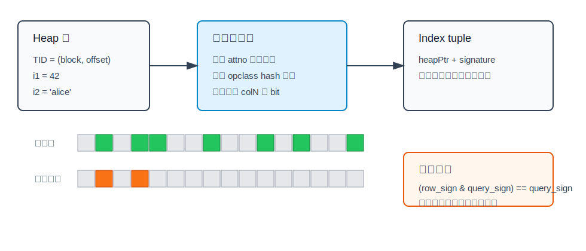
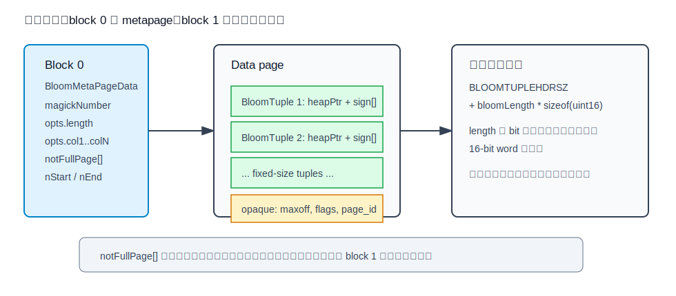
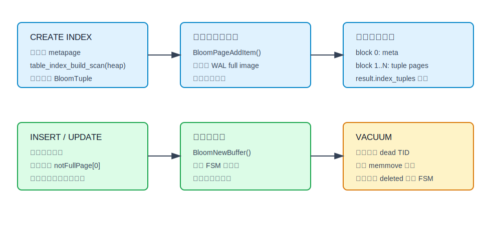
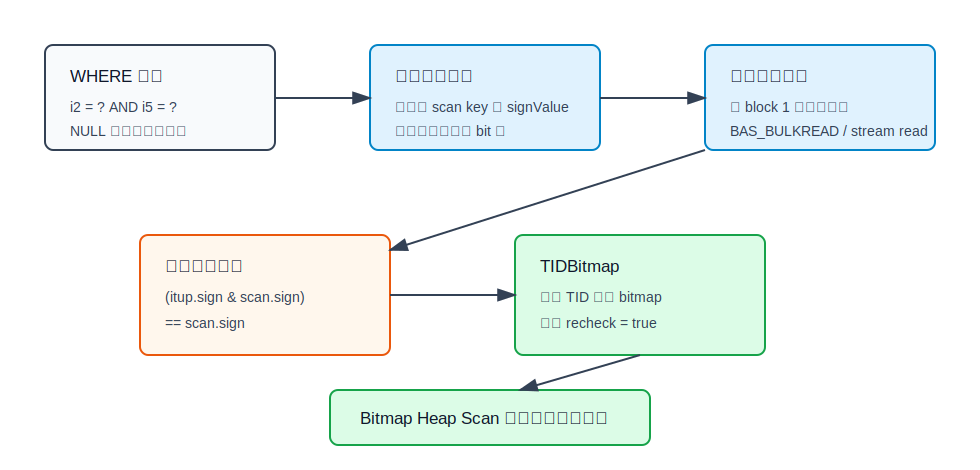
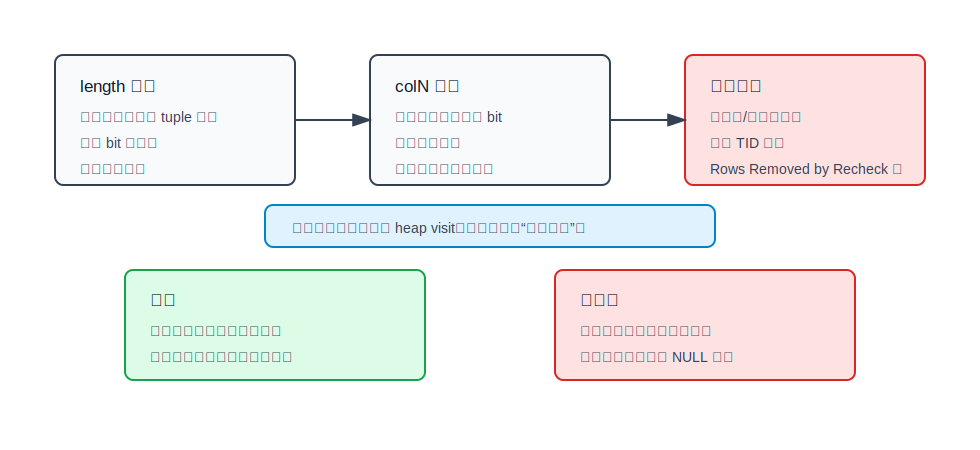

## 数据库筑基课 - bloom 索引结构
                                                                                            
### 作者                                                                
digoal                                                                
                                                                       
### 日期                                                                     
2026-05-26                                                      
                                                                    
### 标签                                                                  
PostgreSQL , 应用开发者 , DBA , 数据库筑基课 , 索引结构 , Bloom filter , 有损索引 , Bitmap Scan  
                                                                                           
----                                                                    

## 背景
  


本节属于“索引结构”基础能力。当前工作区没有发现“数据库筑基课”总纲文件，因此本文先独立成篇。

业务表经常会长成这样：字段很多，查询组合不固定，但大部分条件都是等值过滤。

- 用户画像表：`city = ?`、`gender = ?`、`level = ?`、`tag = ?`，组合经常变化。
- 订单宽表：`buyer_id`、`seller_id`、`status`、`channel`、`warehouse` 任意组合查。
- 设备资产表：型号、区域、固件版本、状态、责任人等字段都可能参与筛选。
- 风控明细表：很多低到中等选择性的枚举、文本、整数列需要临时组合查询。

如果每一种组合都建 B-tree 复合索引，索引数量会爆炸；如果每列都建单列 B-tree，空间和写入维护成本很高，查询还要做 bitmap AND；如果完全顺序扫描，宽表大表上的延迟不可控。

PostgreSQL `bloom` 扩展给出的答案是：把一行中多个列值压缩成一段定长签名，用一个索引支持任意列组合的等值过滤。代价也很明确：签名是有损的，命中索引只表示“可能匹配”，执行器必须回表复查。

本文主线是 PostgreSQL `contrib/bloom`。它不同于 `src/backend/access/brin/brin_bloom.c` 里的 BRIN bloom operator class：前者是独立索引访问方法，后者是 BRIN 某个 page range 的摘要类型。

本文使用的关键来源是本地 PostgreSQL 源码、官方 `bloom.sgml` 文档和回归测试。DeepWiki 仓库查询在当前环境返回错误，因此没有作为事实来源。用户给出的三篇论文题名用于追溯思想来源：Bloom 1970 论文提出用可容忍误判换空间的集合成员测试；signature file 文献把“文档/记录签名顺序扫描 + 复查”的思路用于文本检索；PostgreSQL bloom 论文题名对应到本实现的设计、实现和评估方向，但本文的实现细节以源码为准。

## 一、它解决什么问题？

Bloom 索引解决的是“多列任意组合等值查询，如何少建索引仍然能快速排除大量不匹配行”的问题。

传统做法的矛盾是：

| 做法 | 好处 | 代价 |
|---|---|---|
| 多个复合 B-tree | 对固定查询形态最快 | 组合多时索引数量爆炸，且受 leading column 约束 |
| 每列一个 B-tree | 任意组合可用 BitmapAnd | 空间、写入、VACUUM 维护成本高 |
| GIN / GiST | 适合特定复杂类型和谓词 | 对普通多列等值宽表不是最直接模型 |
| 顺序扫描 | 无写入索引成本 | 大表延迟和 IO 不可控 |

`bloom` 的转换是：

> 不为每列维护精确有序入口，而是为每一行维护一段有损签名。查询也生成签名；凡是签名不包含查询 bit 的行一定不匹配，包含的行只是候选。

这个设计牺牲了精确定位、排序、范围查询、唯一约束和 index-only scan，换来一个紧凑的多列等值过滤器。

## 二、它是什么？

PostgreSQL `bloom` 是一个 contrib 扩展，安装后通过 `CREATE ACCESS METHOD bloom TYPE INDEX HANDLER blhandler` 注册为索引访问方法。扩展内置两个 operator class：`int4_ops` 和 `text_ops`，都只需要等值操作符和 hash 函数；其他类型可以按同样接口扩展 operator class。

一句话定义：

> PostgreSQL bloom 索引是“每个 heap tuple 一条 `(heap TID, Bloom signature)` 的顺序存储有损索引”，查询时扫描整个索引，把可能匹配的 TID 放进 bitmap，再由 Bitmap Heap Scan 回表复查。

核心术语：

- **signature**：定长 bit 数组，默认 80 bit，最大 4096 bit。源码以 `uint16` word 数组存储，所以长度会按 16 bit 上取整。
- **col1..col32**：每个索引列设置多少个 bit，默认每列 2 bit。实际源码按 PostgreSQL 索引最大列数处理，官方文档暴露 `col1` 到 `col32` 参数。
- **BloomTuple**：索引页中的固定大小条目，包含 heap TID 和 signature。
- **false positive**：签名判断通过但真实列值不匹配。它不会造成错结果，只会造成无用回表。
- **recheck**：`tbm_add_tuples(..., recheck = true)` 强制堆表复查真实条件。



图 1 说明：同一行的多个列值通过列相关哈希映射到同一个定长签名。查询条件也生成签名。只有当行签名包含查询签名时，这行才进入候选集；但进入候选集不代表真实命中。

## 三、核心原理

### 3.1 签名生成：同值不同列也要落到不同 bit 序列

`signValue()` 是理解 bloom 索引的入口。它先用列号 `attno` 初始化伪随机种子，再调用当前列 operator class 的 hash 函数，最后按该列的 `bitSize[attno]` 设置若干 bit。源码注释明确说明：这样做是为了避免不同列中的相同值映射到完全相同的 bit 序列。

行签名形成时，`BloomFormTuple()` 会：

1. 分配一个固定大小的 `BloomTuple`。
2. 保存 heap TID。
3. 遍历索引列。
4. 跳过 `NULL`。
5. 对非空列值调用 `signValue()`，把 bit OR 到同一个签名里。

因此 PostgreSQL bloom 索引不是“每列一个 Bloom filter”，也不是“每页一个 Bloom filter”，而是“每行一个多列组合签名”。这点很重要：它能支持任意列组合，是因为一行的所有索引列 bit 都在同一个签名里。

理想化估算可以这样理解：若签名长度为 `m`，一行所有索引列累计设置约 `K` 个 bit，查询条件累计检查约 `Q` 个 bit，且 hash 近似独立，则候选误判概率可粗略看成：

```text
p(false positive) ≈ (1 - e^(-K/m))^Q
```

这不是 PostgreSQL 的成本公式，只是调参直觉：`length` 太小或索引列太多时，签名会变满；查询列越少，检查的 bit 越少，误判越容易上升。

### 3.2 物理结构：metapage + 顺序数据页

源码 `bloom.h` 定义了两类关键页：

- block 0 是 metapage，保存 magic number、索引参数和 `notFullPage[]`。
- block 1 起是数据页，页内连续存放固定大小 `BloomTuple`。

`BloomTuple` 结构非常简单：

```c
typedef struct BloomTuple
{
    ItemPointerData heapPtr;
    BloomSignatureWord sign[FLEXIBLE_ARRAY_MEMBER];
} BloomTuple;
```

页尾的 opaque 区域保存 `maxoff`、页标记和 bloom page id。`notFullPage[]` 不是查询入口，只是插入时寻找有剩余空间数据页的提示数组。



图 2 说明：bloom 索引没有 B-tree 那样的根、内部页和叶页导航，也没有 BRIN 的 range revmap。查询要从第一个数据页顺序扫到索引文件末尾。它靠“索引条目比 heap 行更短”以及“签名能排除候选 TID”来省 IO，而不是靠树形定位。

### 3.3 构建路径：顺序扫 heap，攒满数据页

`blbuild()` 创建索引时先初始化 metapage，再调用 `table_index_build_scan()` 扫 heap。每个 heap tuple 进入 `bloomBuildCallback()`：

1. 用 heap TID 和列值形成 `BloomTuple`。
2. 尝试追加到构建缓存页。
3. 缓存页满就 `flushCachedPage()` 写入一个新的 bloom 数据页。
4. 继续初始化新页并追加。

这条路径说明 bloom 索引构建没有排序阶段，也不构造树。构建成本更接近“读 heap + 顺序写紧凑签名页”。

### 3.4 插入路径：先找半空页，再扩展

`blinsert()` 对每条新 heap tuple 形成 `BloomTuple`，然后优先尝试 metapage 里的 `notFullPage[]`：

- 如果第一个候选页能放下，直接插入，不必修改 metapage。
- 如果放不下，拿 metapage 独占锁，继续尝试后续候选页。
- 如果都放不下，调用 `BloomNewBuffer()`。
- `BloomNewBuffer()` 先从索引 FSM 找可复用页，找不到再扩展索引文件。
- 新页插入成功后，把 `notFullPage[]` 重置为这个新页。

这意味着 bloom 索引不是严格 append-only。VACUUM 产生的 deleted page 可以被 FSM 回收，半空页也可能被后续插入复用。



图 3 说明：构建时顺序形成签名页；插入时用 `notFullPage[]` 和 FSM 控制空间复用；VACUUM 负责删除 dead TID 对应的 BloomTuple，并把空页交给 FSM。

### 3.5 查询路径：只能 Bitmap Index Scan

`blhandler()` 注册的 `IndexAmRoutine` 很关键：

- `amgettuple = NULL`
- `amgetbitmap = blgetbitmap`
- `amcanorder = false`
- `amcanunique = false`
- `amcanmulticol = true`
- `amoptionalkey = true`
- `amsearchnulls = false`
- `amcanparallel = false`
- `amcanbuildparallel = false`

因此 PostgreSQL bloom 索引不能像 B-tree 那样逐条返回有序 TID，也不能做 index-only scan 或唯一约束。它的扫描入口是 `blgetbitmap()`。

`blgetbitmap()` 的路径是：

1. 第一次扫描时为 scan key 生成查询签名。
2. 如果 scan key 是 `NULL`，直接返回 0，因为 bloom 不支持搜索 NULL。
3. 使用 bulk read 策略，从 block 1 扫到索引末尾。
4. 对每个非空、未删除数据页，遍历页内 BloomTuple。
5. 对每个 tuple 做 bit 包含测试：

```text
(itup->sign[i] & scan_sign[i]) == scan_sign[i]
```

6. 通过测试的 heap TID 加入 `TIDBitmap`，并标记需要 recheck。
7. 上层 `Bitmap Heap Scan` 回表读取真实 tuple，再按 SQL 条件复查。



图 4 说明：bloom 扫描的索引侧是全索引扫描，不是树查找。它把“全表扫 heap”转成“扫更小的索引签名文件 + 只访问候选 heap TID”。如果误判很多，优势会被无用回表吃掉。

### 3.6 VACUUM：删除 dead TID，压缩页，回收空页

`blbulkdelete()` 扫描所有数据页，用 VACUUM 回调判断某个 `heapPtr` 是否对应要删除的 heap tuple。要删除时，它减少页内 `maxoff`；保留 tuple 时用 `memmove()` 向前压缩。

如果一个 bloom 数据页删空，就设置 `BLOOM_DELETED`。`blvacuumcleanup()` 后续把 new/deleted 页记录到 index FSM，并统计页数和 tuple 数。

这和 B-tree 的页面分裂、合并、半死页生命周期不同。bloom 的页面结构更平，但代价是查询没有导航能力，仍要读完整个索引。

## 四、横向对比

| 维度 | PostgreSQL bloom | 多列 B-tree | 多个单列 B-tree + BitmapAnd | BRIN bloom opclass | GIN |
|---|---|---|---|---|---|
| 主要目标 | 一个紧凑索引支持多列任意组合等值过滤 | 固定列序的精确查找、排序、范围 | 每列精确过滤后做 bitmap 交集 | 每个 page range 保存 Bloom 摘要 | 复合值、数组、JSONB、全文倒排 |
| 索引粒度 | 每 heap tuple 一个有损签名 | 每 heap tuple 一个有序键入口 | 每列每 heap tuple 一个入口 | 每 block range 一个摘要 | value/key 到 posting list/tree |
| 读取路径 | 扫完整 bloom 索引，返回 bitmap | 树搜索，可返回有序 TID | 多个 bitmap index scan 再合并 | 扫 BRIN 摘要，返回 page-range bitmap | 查 key，再合并 posting |
| 支持谓词 | 等值 | 等值、范围、排序相关谓词 | 等值、范围视 opclass 而定 | 等值摘要，仍按 range 返回 | 取决于 opclass |
| 误判/复查 | 有误判，必须 recheck | 通常精确，MVCC 仍需可见性检查 | 通常精确，bitmap heap 仍复查 | range 级有损，必须 recheck | 取决于 opclass，常见 recheck |
| 空间成本 | 通常小于多个 B-tree | 单个复合索引中等 | 多列时较高 | 极小 | 可能较高 |
| 写入维护 | 每行一条固定签名 | 每个相关索引维护树 | 每列索引都要维护 | 每 range 摘要维护 | 一行可能生成多个 key |
| 不适合 | 范围、排序、唯一、NULL、极高选择性点查 | 任意组合且不满足 leading column | 列很多且写入重 | 随机数据点查 | 简单标量多列等值宽表未必划算 |

这张表的核心是粒度。B-tree 用精确有序入口换定位能力；bloom 用有损签名换空间和多列组合能力；BRIN bloom 的粒度更粗，是 page range 级摘要；GIN 更适合一个字段拆成多个 key 的倒排问题。

## 五、效果如何？

官方文档给了一个典型例子：一张 1000 万行、6 个 int 列的表，查询条件是非 leading column 上两个等值条件。单个 6 列 B-tree 由于 leading column 没有限制，仍选择顺序扫描；一个 bloom 索引可以走 `Bitmap Index Scan` + `Bitmap Heap Scan`；6 个单列 B-tree 再 BitmapAnd 更快，但总空间明显更大。文档中的示例数值显示：单个 6 列 B-tree 约 386 MB，默认 bloom 索引约 153 MB，6 个单列 B-tree 合计约 531 MB。这个数值来自 PostgreSQL 官方文档示例，不是本文本地执行结果。

从机制上看，bloom 的收益来自三处：

- **索引 tuple 短**：只保存 heap TID 和定长签名，不保存完整 key。
- **多列共用一条索引项**：一个索引可以覆盖任意列组合。
- **回表数量可控时收益明显**：签名能排除大量不匹配 TID，减少 heap 随机访问。

成本同样不能忽略：

- **全索引扫描**：`blgetbitmap()` 注释直接说明必须访问所有 index tuple。
- **误判回表**：签名碰撞越多，`Rows Removed by Index Recheck` 越高。
- **不能消除排序**：`amcanorder = false`，`ORDER BY` 不能靠 bloom 输出顺序。
- **不能做唯一约束**：`amcanunique = false`。
- **不支持 NULL 搜索**：scan key 是 NULL 时直接返回 0。
- **并行能力有限**：访问方法声明不支持 parallel scan / parallel build。



图 5 说明：`length`、每列 bit 数、索引列数、查询列数共同决定签名密度。调参目标不是让 bloom 变成精确索引，而是在可接受空间内减少无用 heap visit。

## 六、实操 DEMO

下面 SQL 是最小验证路径，设计目标是看见 bloom 的三个事实：只支持等值、走 bitmap scan、需要 recheck。本文没有在本地启动 PostgreSQL 实例执行，因此不提供伪造输出。

```sql
CREATE EXTENSION IF NOT EXISTS bloom;

DROP TABLE IF EXISTS tbloom_demo;
CREATE TABLE tbloom_demo (
    id       bigserial PRIMARY KEY,
    c1       int,
    c2       int,
    c3       int,
    c4       text,
    payload  text
);

INSERT INTO tbloom_demo (c1, c2, c3, c4, payload)
SELECT
    (random() * 100000)::int,
    (random() * 100000)::int,
    (random() * 100000)::int,
    substr(md5(g::text), 1, 2),
    md5((g * 17)::text)
FROM generate_series(1, 1000000) AS g;

ANALYZE tbloom_demo;

CREATE INDEX tbloom_demo_bloom_idx
ON tbloom_demo
USING bloom (c1, c2, c3, c4)
WITH (length = 128, col1 = 2, col2 = 2, col3 = 2, col4 = 4);

EXPLAIN (ANALYZE, BUFFERS)
SELECT *
FROM tbloom_demo
WHERE c2 = 12345 AND c4 = 'af';
```

预期观察点：

- 计划通常应是 `Bitmap Index Scan` + `Bitmap Heap Scan`，但实际是否选择 bloom 取决于统计信息、表大小和成本参数。
- `Recheck Cond` 会出现，因为 bloom 返回的是有损候选。
- `Rows Removed by Index Recheck` 越高，说明签名误判越多。
- `Heap Blocks` 越少，说明 bloom 排除能力越强。

对比试验可以继续建每列 B-tree：

```sql
CREATE INDEX tbloom_demo_c2_idx ON tbloom_demo (c2);
CREATE INDEX tbloom_demo_c4_idx ON tbloom_demo (c4);

EXPLAIN (ANALYZE, BUFFERS)
SELECT *
FROM tbloom_demo
WHERE c2 = 12345 AND c4 = 'af';
```

再比较：

```sql
SELECT
    pg_size_pretty(pg_relation_size('tbloom_demo_bloom_idx')) AS bloom_size,
    pg_size_pretty(pg_relation_size('tbloom_demo_c2_idx')) AS c2_btree_size,
    pg_size_pretty(pg_relation_size('tbloom_demo_c4_idx')) AS c4_btree_size;
```

如果目标是学习源码行为，可以直接看 PostgreSQL 自带回归测试 `postgres/contrib/bloom/sql/bloom.sql`。它创建 `int4` + `text` 表，验证顺序扫描与 bloom bitmap scan 下的结果一致，并测试 `length`、`col1` 等 reloptions 的边界。

## 七、最佳实践

面向数据库架构师：

- 把 bloom 定位成“宽表多列等值过滤的空间折中”，不要把它当作 B-tree 替代品。
- 对高频、强选择性、固定列序查询，优先 B-tree；对组合很多但每个组合频率不稳定的查询，bloom 才有价值。
- 对范围、排序、唯一约束、外键支撑索引、`IS NULL` 查询，不要选 bloom。
- 评估时同时看索引总空间、写入 TPS、`Rows Removed by Index Recheck`、heap block 访问数。

面向 DBA：

- 用 `CREATE EXTENSION bloom` 管理扩展；确认目标列类型有 bloom opclass。内置只有 `int4` 和 `text`。
- 初始参数可以从默认值开始；列多、误判高时先调大 `length`，再考虑给更常用、更高选择性的列增加 `colN`。
- 建立压测脚本时不要只测空缓存；bloom 的优势依赖“索引更小、heap 回表更少”，缓存状态会影响结论。
- 大量删除后执行 VACUUM，让 dead TID 对应的 BloomTuple 被清理，空页进入 FSM。

面向业务开发者：

- SQL 条件必须是 bloom opclass 支持的等值操作，例如 `c1 = ?`、`c4 = ?`。
- 不要期待 `c1 > ?`、`ORDER BY c1`、`c1 IS NULL` 使用 bloom 达到 B-tree 效果。
- 查询列越少，越容易误判；一个条件命中 bloom 不一定比顺序扫描划算。
- 看到 `Recheck Cond` 是正常现象，不是 bug；要关注 recheck 移除了多少行。

## 八、适合与不适合场景

适合：

- 一张表有很多可过滤列，查询组合不可预测。
- 条件主要是等值，且可以接受 Bitmap Heap Scan 回表。
- 不想为大量组合或大量单列维护 B-tree。
- 查询目标是过滤候选行，不要求索引提供排序。
- 列值分布使签名误判率可控，实际 heap 访问明显少于顺序扫描。

不适合：

- 需要唯一约束、主键、外键支撑索引。
- 需要范围查询、前缀查询、排序输出或 index-only scan。
- 查询大量 `IS NULL`。
- 表很小，顺序扫描已经足够快。
- 极高选择性点查有稳定列，单列 B-tree 明显更快。
- 列太多、每行设置 bit 太多、签名长度太短，导致签名接近全 1。

## 九、常见坑

1. 把 bloom 当成精确索引。  
   bloom 只能返回候选 TID。结果正确依赖回表复查，误判越高性能越差。

2. 只建一个默认参数索引就下结论。  
   默认 `length=80`、每列 2 bit 只是通用起点。列数、查询列数、值分布不同，合适参数会变。

3. 忘记 leading column 问题的比较基准。  
   单个 `(c1,c2,c3,c4)` B-tree 对 `WHERE c3 = ?` 未必有效；但单列 B-tree 或合适复合 B-tree 仍可能比 bloom 快。

4. 忽略 operator class 限制。  
   扩展内置 `int4` 和 `text`。其他类型需要提供等值操作符和 hash 函数的 bloom opclass。

5. 用 bloom 支撑排序或唯一性。  
   访问方法声明不支持 order、orderbyop、unique。需求里有这些条件时直接换索引。

6. 误读官方示例性能数值。  
   官方示例说明的是一个特定数据规模、分布和查询条件下的空间/时间对比，不是所有场景通用结论。

7. 混淆 `contrib/bloom` 和 BRIN bloom。  
   `contrib/bloom` 是行级签名索引访问方法；BRIN bloom 是 block range 摘要，两者读写路径和调参目标不同。

## 十、扩展问题

- 如果一张 20 列宽表里只有 3 列经常被查，bloom 还比 3 个单列 B-tree 更合适吗？如何用 `EXPLAIN (ANALYZE, BUFFERS)` 证明？
- 什么时候应该增加 `length`，什么时候应该增加某个 `colN`？这两个动作对索引大小和误判率分别有什么影响？
- 如果查询总是固定 `(tenant_id, status, created_at range)`，为什么 bloom 不是首选？
- 为什么 PostgreSQL bloom 查询必须扫完整索引，而 B-tree 可以只走一小段路径？
- BRIN bloom 与 `contrib/bloom` 都使用 Bloom 思想，为什么一个是 range 级摘要，一个是 tuple 级签名？它们分别适合什么数据布局？

## 十一、扩展阅读

- PostgreSQL 官方文档：`postgres/doc/src/sgml/bloom.sgml`，以及 <https://www.postgresql.org/docs/current/bloom.html>，介绍 bloom 扩展、参数、示例和限制。
- PostgreSQL 源码：`postgres/contrib/bloom/bloom.h`，定义 page opaque、metapage、BloomTuple、BloomState 和参数上限。
- PostgreSQL 源码：`postgres/contrib/bloom/blutils.c`，实现 reloptions、访问方法声明、签名生成、页初始化和空间复用。
- PostgreSQL 源码：`postgres/contrib/bloom/blinsert.c`，实现构建和插入路径。
- PostgreSQL 源码：`postgres/contrib/bloom/blscan.c`，实现 `blgetbitmap()` 全索引扫描和 recheck bitmap 输出。
- PostgreSQL 源码：`postgres/contrib/bloom/blvacuum.c`，实现 VACUUM 删除、页压缩和 FSM 回收。
- PostgreSQL 回归测试：`postgres/contrib/bloom/sql/bloom.sql`。
- Burton H. Bloom, “Space/Time Trade-offs in Hash Coding with Allowable Errors”, Communications of the ACM, 1970, DOI: <https://doi.org/10.1145/362686.362692>。
- Signature file 相关论文与综述线索，例如 <https://ftp.math.utah.edu/pub/tex/bib/toois.html> 中关于 signature files 的书目信息，用于理解“记录/文档签名 + 顺序扫描 + 复查”的访问方法思想。
- “Bloom Index Access Method in PostgreSQL: Design, Implementation and Evaluation”，用于了解 PostgreSQL bloom 访问方法设计背景；实现细节请以当前源码为准。

## 本文校验记录

- 标题、分类、结构已按“数据库筑基课 - bloom 索引结构”整理。
- 本文主线为 PostgreSQL `contrib/bloom`，BRIN bloom 仅作为相邻技术对比。
- SQL 示例未在本地执行，文中已明确说明；没有编造执行输出。
- 官方性能数值只引用 PostgreSQL 文档示例，并标明不是本文执行结果。
- 5 张 SVG 均为独立文件，并以相对路径引用。
- DeepWiki 查询失败，未作为关键事实来源。
  
## 附录  
  
1、问 gemini  
```  
PostgreSQL bloom 索引结构相关的论文、开源项目.
```  
  
2、克隆代码  
```  
git clone --depth 1 https://github.com/postgres/postgres
```  
  
3、启用 codex, 使用 [数据库筑基课 skill](../skills/README.md).  
````
文章标题: 
  数据库筑基课 - bloom 索引结构
项目源码(已克隆到当前项目如下目录中):  
  postgres
论文: 
  Space/Time Trade-offs in Hash Coding with Allowable Errors
  Signature Files: An Access Method for Text Databases and Voice Messages
  Bloom Index Access Method in PostgreSQL: Design, Implementation and Evaluation
项目 deepwiki reponame:  
  postgres/postgres
项目参考信息: 
  postgres/CLAUDE.md
````
  
  
#### [PostgreSQL 解决方案集合](../201706/20170601_02.md "40cff096e9ed7122c512b35d8561d9c8")
  
  
#### [德哥 / digoal's Github - 公益是一辈子的事.](https://github.com/digoal/blog/blob/master/README.md "22709685feb7cab07d30f30387f0a9ae")
  
  
#### [About 德哥](https://github.com/digoal/blog/blob/master/me/readme.md "a37735981e7704886ffd590565582dd0")
  
  

  
