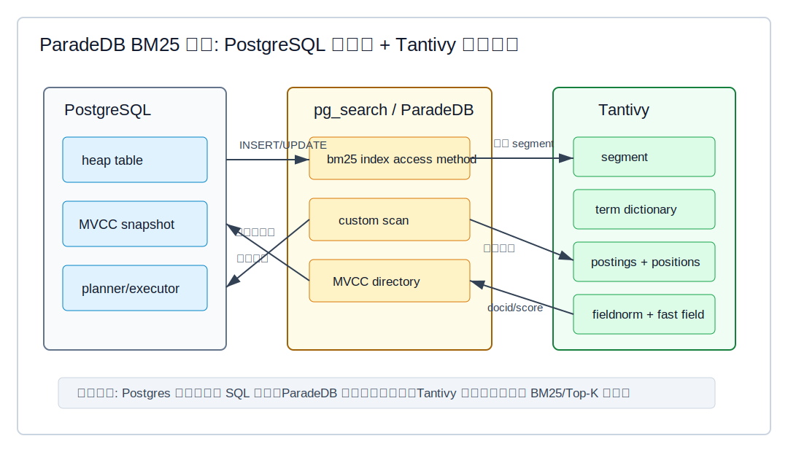
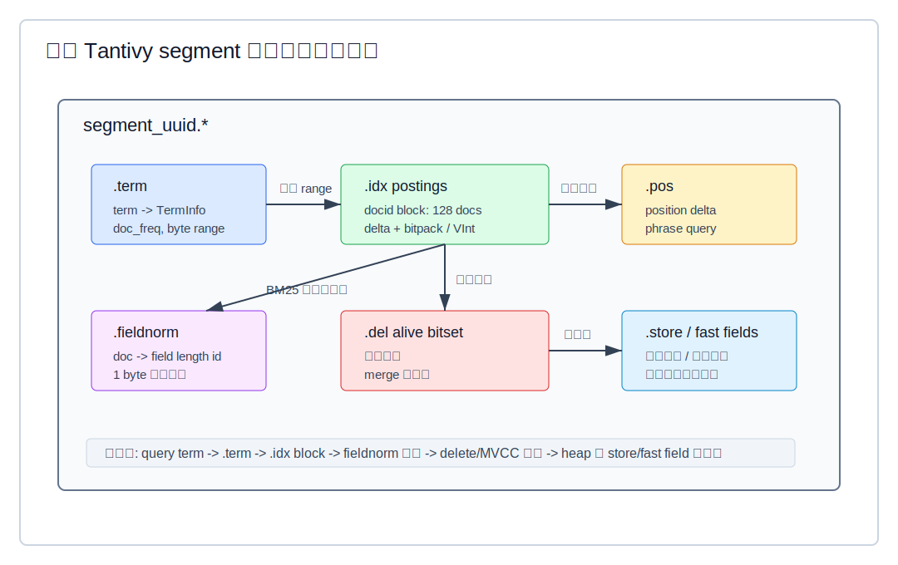
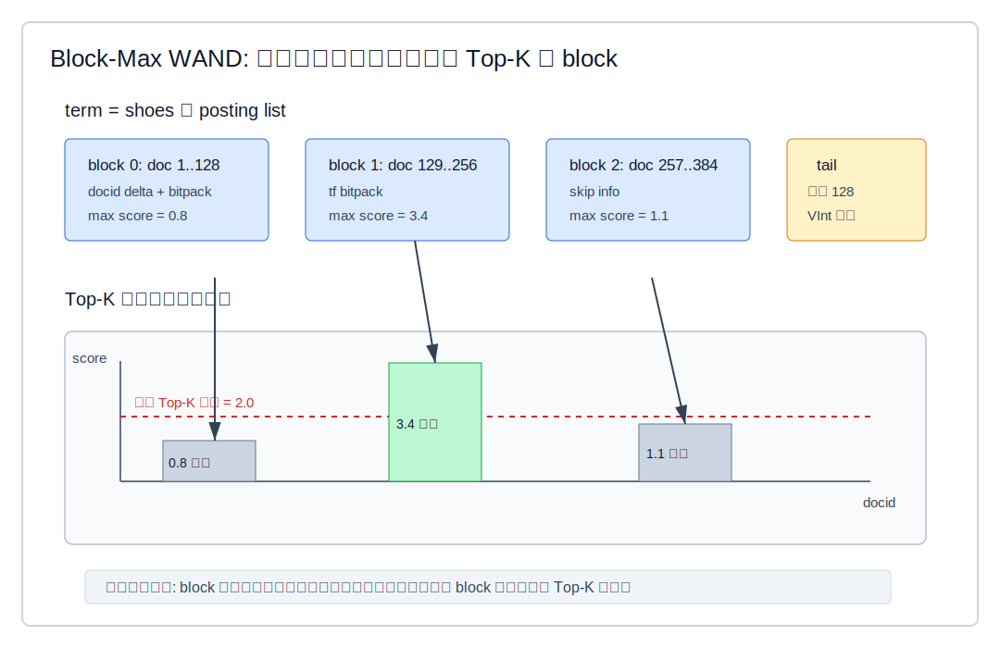
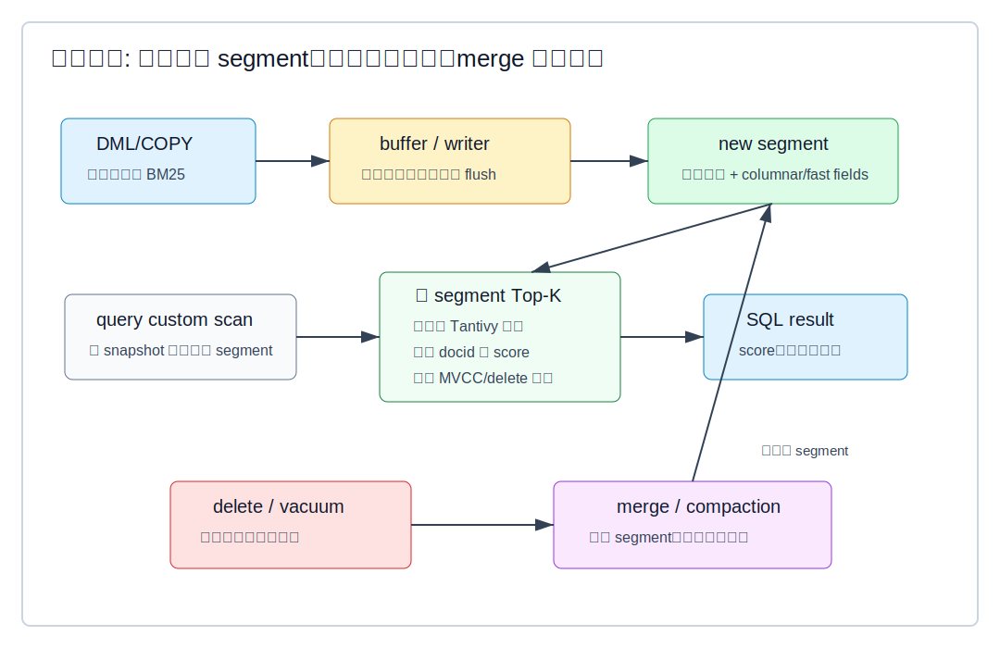

## 数据库筑基课 - paradedb BM25 索引结构
                                                                                            
### 作者                                                                
digoal                                                                
                                                                       
### 日期                                                                     
2026-05-26                                                      
                                                                    
### 标签                                                                  
PostgreSQL , ParadeDB , Tantivy , DataFusion , 应用开发者 , DBA , 数据库筑基课 , 索引结构 , BM25 , 倒排索引 , Block-Max WAND  
                                                                                           
----                                                                    

## 背景


本节属于“索引结构”基础能力。当前工作区没有发现“数据库筑基课”总纲文件，因此本文先独立成篇。

业务里常见的搜索需求不是“找 `id = 42` 的一行”，而是：

- 商品标题、描述、类目里包含 `running shoes`，并按相关性取前 20 个。
- 日志内容包含多个关键词，同时按租户、时间、级别过滤。
- 文档库既要全文匹配，又要按结构化字段排序、聚合、分页。
- 数据已经在 PostgreSQL 里，不想再维护一套 Elasticsearch 集群、同步链路和一致性补偿逻辑。

PostgreSQL 原生全文检索有 `tsvector`、`tsquery`、GIN，但 ParadeDB 的目标不同：把 Lucene/Elasticsearch 类搜索能力做成 Postgres 扩展，通过 BM25 索引和自定义扫描把相关性排序、Top-K、过滤、聚合尽量下推到索引层。

本文只讨论 `pg_search`/ParadeDB 的 BM25 索引结构。由于当前工作区没有 `paradedb/` 本地目录，我使用了 ParadeDB 官方文档、DeepWiki `paradedb/paradedb`、本地 `tantivy/` 与 `datafusion/` 源码交叉核对。ParadeDB 源码路径来自 DeepWiki 导航，未在本地逐行打开，因此涉及 ParadeDB 具体函数名的描述会标注为“DeepWiki 源码导航信息”。

## 一、它解决什么问题？

BM25 索引解决的是“按词项快速找候选文档，并按相关性取 Top-K”的问题。

如果没有倒排索引，搜索 `description ||| 'running shoes'` 大概率要逐行分词、匹配、算分。表一大，代价就不可接受。倒排索引把问题反过来：

```text
row 1: "running shoes for trail"
row 2: "leather shoes"
row 3: "running belt"

倒排:
running -> row 1, row 3
shoes   -> row 1, row 2
trail   -> row 1
```

查询时先取词项的 posting list，再做并集、交集、短语匹配、过滤和 BM25 打分。Top-K 查询不必给所有候选文档完整打分，可以用 Block-Max WAND 这类安全剪枝算法跳过不可能进入前 K 的 block。

ParadeDB 在这个模型上又解决了 PostgreSQL 集成问题：

- 写入、更新、删除要跟 PostgreSQL 事务语义对齐。
- 查询要走 PostgreSQL planner/executor，可以用 SQL、`EXPLAIN`、ORM。
- 结构化字段不能只做回表过滤，应该尽量进入索引层过滤、排序、聚合。
- 相关性分数要能通过 `paradedb.score(...)` 这类函数返回给 SQL。

代价也很明确：写入会生成或刷新搜索 segment，字段分词和 posting 写入会放大写成本；segment 过多会拖慢查询；BM25 只解决词项相关性，不理解语义相似度；事务可见性也会让“搜索引擎式 segment”多一层数据库一致性约束。

## 二、它是什么？

ParadeDB BM25 索引可以理解为三层结构。



图 1 说明：PostgreSQL 仍然是事务、SQL、heap 表和 planner/executor 的外壳。ParadeDB 通过 PostgreSQL 扩展接入自定义索引访问方法和 custom scan。Tantivy 是底层全文检索库，负责 segment、term dictionary、posting list、fieldnorm、BM25 评分和 Top-K 检索。

三层分别是：

- **PostgreSQL 层**：表、事务、MVCC、SQL 解析、计划和执行。ParadeDB 文档强调 BM25 索引在行插入或更新时会被实时通知，并作为当前事务的一部分记录索引更新。
- **ParadeDB `pg_search` 层**：提供 `USING bm25` 索引、搜索操作符、`paradedb.score`、custom scan、索引选项、MVCC directory 等接入逻辑。DeepWiki 源码导航给出的核心路径包括 `pg_search/src/postgres/build.rs`、`pg_search/src/postgres/insert.rs`、`pg_search/src/postgres/delete.rs`、`pg_search/src/postgres/customscan/pdbscan/mod.rs`、`pg_search/src/index/mvcc.rs`。
- **Tantivy 层**：Lucene 风格的 Rust 搜索库。本地 `tantivy/CLAUDE.md` 总结其核心结构：segment 是不可变索引单元；`.term` 存 term dictionary；`.idx` 存 postings；`.pos` 存位置；`.fieldnorm` 存字段长度；`.store` 存展示字段；`.del` 或 alive bitset 处理删除。

ParadeDB 官方文档还把 DataFusion 列为 `pg_search` 的三大依赖之一，定位是 OLAP query execution framework。本地 `datafusion/CLAUDE.md` 和源码显示 DataFusion 的核心抽象是 `TableProvider`、`ExecutionPlan`、`RecordBatch` stream、Top-K/sort/filter pushdown 等。对于本文主题要注意边界：BM25 倒排结构和 Block-Max WAND 来自 Tantivy，不是 DataFusion；DataFusion 更适合作为查询执行与下推框架的对照。

## 三、核心原理

### 3.1 ParadeDB 的索引外壳：让搜索成为 PostgreSQL 的访问路径

ParadeDB 文档给出的最小建索引形式是：

```sql
CREATE INDEX search_idx ON mock_items
USING bm25 (id, description, category)
WITH (key_field = 'id');
```

`key_field` 是必需的：它是索引中文档的唯一标识，通常应是主键或有唯一约束的列，并且在索引列列表中排第一。官方文档还说明同一张表只能有一个 BM25 索引，建议把搜索、排序、过滤、聚合可能用到的字段都放入 BM25 索引。

这和普通二级索引的设计点不同。B-tree 只需要回答“某个 key 对应哪些 TID”；BM25 索引还要回答：

- 文本字段如何分词、归一化、记录 term frequency 和 position。
- 非文本字段是否进入列式 fast field，用于过滤、排序、聚合。
- 哪个字段是文档唯一 key。
- 相关性分数是否需要 fieldnorm。
- 查询中哪些谓词可以下推到 custom scan。

DeepWiki 对 ParadeDB 源码的导航显示，`bm25_handler()` 返回 PostgreSQL `IndexAmRoutine`，由 `ambuild()`、`aminsert()`、`ambulkdelete()` 等函数接入索引构建、插入和 VACUUM 删除路径；custom scan 会把 ParadeDB 操作符相关谓词提取成搜索查询，再转换为 Tantivy query。

### 3.2 Tantivy segment：不可变小索引的集合

ParadeDB 文档说 BM25 索引由多个 segment 组成，每个 segment 存一小部分索引；每个 `INSERT`、`UPDATE`、`COPY` 语句至少创建一个新 segment，segment 数量过多会降低查询性能，系统会通过分层 merge policy 合并 segment。

这和 Tantivy 的结构一致。Tantivy 本地源码中，`tantivy/src/index/segment_component.rs` 定义 segment 组件；`tantivy/src/postings/serializer.rs` 的 `InvertedIndexSerializer` 写入 `.idx`、`.pos`、`.term`；`tantivy/src/postings/term_info.rs` 的 `TermInfo` 保存 `doc_freq`、postings byte range 和 positions byte range。



图 2 说明：一个 segment 不是一张单独的“倒排表”，而是一组彼此配合的文件。`.term` 负责 term 到 `TermInfo` 的定位，`.idx` 负责 docid 和 term frequency，`.pos` 支持短语，`.fieldnorm` 支持 BM25 长度归一化，delete/alive bitset 处理删除，store/fast fields 支持返回、过滤、排序或聚合。

Tantivy 的 segment 设计带来两个工程后果：

1. 写入可以先生成新的不可变 segment，减少原地随机更新。
2. 查询要跨多个 segment 搜索，再合并局部 Top-K，并处理删除和 MVCC 可见性。

### 3.3 posting list：BM25 索引真正吃 IO 的地方

posting list 是倒排索引的核心负载。Tantivy 本地源码给出的实现细节很具体：

- `tantivy/src/postings/compression/mod.rs` 中 `COMPRESSION_BLOCK_SIZE` 为 block 大小，CLAUDE 摘要和源码路径均显示 postings 以 128 个 doc 为一组。
- `tantivy/src/postings/serializer.rs` 中 `Block` 保存 `doc_ids` 和 `term_freqs`，满 128 个文档时 `write_block()` 写出。
- docid 使用 sorted delta + bitpack；term frequency 使用 bitpack；不足一个完整 block 的尾部使用 VInt。
- `tantivy/src/postings/skip.rs` 的 `SkipSerializer` 为完整 block 写 `last_doc`、doc bitwidth、tf bitwidth、position offset 所需的 tf sum，以及 Block-Max WAND 所需的最大分数参数。

Tantivy 的 `TermInfo` 不直接保存 posting 数据，而是保存 postings 文件里的 byte range。查询时先用 term dictionary 找到 `TermInfo`，再打开对应 byte range 的 postings。这个设计让 term dictionary 小而可缓存，posting 大而顺序解码。

### 3.4 BM25：把词频、稀有度和字段长度合成相关性

BM25 来自 Okapi/TREC 系列信息检索实验。`Okapi at TREC-3` 是 Robertson、Walker、Jones、Hancock-Beaulieu、Gatford 在 TREC-3 的系统论文，后续 BM25 公式成为全文检索系统的经典打分模型。

Tantivy 本地 `tantivy/src/query/bm25.rs` 使用固定参数：

```rust
const K1: Score = 1.2;
const B: Score = 0.75;
```

其 `idf` 公式为：

```text
idf = ln(1 + (N - n + 0.5) / (n + 0.5))
```

其中 `N` 是总文档数，`n` 是包含该 term 的文档数。单 term 的分数可以概括为：

```text
score = idf * (k1 + 1) * tf / (tf + k1 * (1 - b + b * dl / avgdl))
```

这里：

- `tf`：term 在当前文档字段中的出现次数。
- `dl`：当前文档该字段长度。
- `avgdl`：该字段平均长度。
- `k1`：控制词频饱和，词频越高收益越递减。
- `b`：控制字段长度归一化，长文档不会因为词多就天然占优。

Tantivy 的 `FieldNormReader` 用 1 byte `fieldnorm_id` 近似保存字段长度。`tantivy/src/fieldnorm/reader.rs` 明确说明 fieldnorm 是近似值，等于或低于实际 token 数，解码时通过表查回近似长度。这是典型工程取舍：每个 doc 每个字段只用很小空间保存长度，换取 BM25 评分时的快速随机访问。

### 3.5 Block-Max WAND：Top-K 不必完整打分所有候选

Top-K 搜索的关键不是“能不能找到所有匹配文档”，而是“能不能证明某些候选不可能进入前 K”。Ding 和 Suel 的 `Faster Top-k Document Retrieval Using Block-Max Indexes` 提出在压缩倒排链的每个 block 上保存最大 impact score，把它集成到 WAND，以安全跳过大量不会改变 Top-K 结果的 block。

Tantivy 正好这样做。`tantivy/src/postings/serializer.rs` 在写完整 block 时，根据 block 内文档的 `(fieldnorm_id, term_freq)` 选择 BM25 `tf_factor` 最大的一组，写入 skip 信息；`tantivy/src/postings/skip.rs` 的 `block_max_score()` 可以用这组信息计算 block 分数上界；`tantivy/src/query/boolean_query/block_wand_union.rs` 和 `block_wand_intersection.rs` 使用当前 Top-K 阈值剪枝。



图 3 说明：每个 posting block 都有一个最大可能分数。查询执行过程中，Top-K heap 填满后会产生动态阈值。如果某些 term 在当前 block 的最大可能分数之和仍然不超过阈值，这个 block 即使完整解码、完整打分，也不可能进入结果集，可以安全跳过。

这里的“安全”很重要：Block-Max WAND 不是近似搜索，不牺牲召回；它只是利用上界证明某些候选不可能赢。代价是写索引时要多保存 block max 信息，查询时代码更复杂，而且剪枝效果依赖查询词分布、Top-K 大小、当前阈值上升速度和 segment 数量。

### 3.6 MVCC、删除和 merge：搜索 segment 要服从数据库事务

纯搜索引擎只需要考虑 segment delete bitset 和 refresh；PostgreSQL 扩展还要考虑事务快照。DeepWiki 对 ParadeDB 的源码导航显示，ParadeDB 有 `MVCCDirectory` 和 `MvccSatisfies` 这类抽象，用于让 Tantivy directory 服从 PostgreSQL 可见性模式。删除路径通过 PostgreSQL VACUUM/bulk delete 与 Tantivy 删除队列或 segment merge 配合，物理回收通常在 merge 过程中完成。

Tantivy 本身也是“先标记删除，再 merge 回收”的模型。本地 `tantivy/CLAUDE.md` 说明 deletes 通过 alive bitset 文件跟踪，后台 merge 会减少 tombstoned documents 和 segment 数量。DeepWiki 对 Tantivy 的说明也强调，merge 会重写新 segment，跳过已删除文档，并重映射 docid。



图 4 说明：写入路径偏 LSM，新增数据进入新 segment；查询路径跨多个可见 segment 搜索并合并；删除先变成标记或不可见，最终通过 merge/compaction 回收空间。这个生命周期解释了为什么 segment 数量、merge 策略、VACUUM 和长事务都会影响搜索延迟。

## 四、横向对比

| 维度 | ParadeDB BM25 | PostgreSQL GIN 全文检索 | Elasticsearch/Lucene | DataFusion TableProvider/Top-K |
|---|---|---|---|---|
| 主要目标 | 在 Postgres 内做 BM25 搜索、过滤、排序、聚合下推 | Postgres 内置倒排索引框架，支持 `tsvector`、JSONB、数组等 | 独立搜索引擎，完整搜索集群生态 | 可扩展查询执行引擎，不是全文索引结构 |
| 索引核心 | Tantivy segment、postings、fieldnorm、fast fields | GIN entry tree + posting list/tree | Lucene segment、postings、doc values | `ExecutionPlan` 处理 `RecordBatch` |
| 相关性 | BM25，一等能力 | 原生全文检索有 ranking 函数，但不是 BM25 索引访问核心 | BM25，一等能力 | 需要外部算子或数据源实现 |
| 事务一致性 | 贴合 PostgreSQL MVCC，索引更新在事务内 | 原生 PostgreSQL MVCC | 需要外部同步和刷新语义 | 取决于接入的数据源 |
| Top-K 优化 | Tantivy Block-Max WAND | GIN 更偏 bitmap 候选集，再排序 | Lucene WAND/BMW 类优化 | SortExec/TopK、dynamic filter，可作执行层优化 |
| 写入模型 | segment/LSM + merge，写入会放大为搜索索引维护 | heap DML 触发索引维护，GIN 有 pending list | segment refresh + merge | 本身不定义存储写入模型 |
| 适合场景 | PostgreSQL 内强一致搜索、混合过滤排序聚合 | 内置全文/JSON/数组成员查询 | 搜索独立扩展、跨系统搜索、多租户搜索集群 | OLAP、查询引擎、外部数据源执行 |
| 不适合场景 | 极高写入且不需要搜索相关性；语义向量检索单独主导 | BM25、复杂搜索体验、Elasticsearch 兼容能力 | 不想维护双写和一致性链路 | 把它当成倒排索引或 BM25 引擎 |

这张表的重点不是“谁替代谁”。ParadeDB 的特殊位置是：它把搜索引擎的核心结构嵌进 PostgreSQL 事务和 SQL 生态。GIN 是 Postgres 原生倒排框架，适合很多结构化包含查询；Elasticsearch 是完整独立搜索系统；DataFusion 是查询执行框架，和 BM25 posting list 不在同一抽象层。

## 五、效果如何？

从机制上看，ParadeDB BM25 的收益来自五处：

1. **倒排定位**：从 term 直接找到候选 docid，不逐行分词扫描。
2. **压缩 posting**：docid delta + bitpack 降低 IO 和缓存压力。
3. **fieldnorm 快速评分**：字段长度用 1 byte 近似保存，BM25 评分不用回表计算长度。
4. **Block-Max WAND**：Top-K 查询可跳过不可能超过阈值的 block。
5. **custom scan 下推**：过滤、排序、聚合尽量在索引层完成，减少 Postgres 后处理。

代价也来自同一套机制：

- **写放大**：一行文本会产生多个 term；多字段索引会写入倒排、位置、fieldnorm、fast fields。
- **空间放大**：除了 heap，还要保存 segment 文件、posting、positions、fieldnorm、columnar/fast fields 和删除标记。
- **merge 成本**：segment 过多时查询要扫更多段；merge 会消耗 CPU、IO，并影响写入尾延迟。
- **可见性成本**：PostgreSQL MVCC 让结果正确，但也意味着搜索结果不能只看 Tantivy delete bitset。
- **评分边界**：BM25 是词项相关性，不解决同义词、语义相似、跨语言理解等问题。

不要在没有实验的情况下写“比 GIN 快多少”或“毫秒级”。正确的验证方式是固定数据集、字段配置、查询集合、Top-K 大小、并发、segment 数、VACUUM/merge 状态，用 `EXPLAIN ANALYZE` 和应用侧延迟一起看。

## 六、实操 DEMO

以下 SQL 按 ParadeDB 文档风格编写，用于说明验证路径。当前工作区没有运行 ParadeDB 数据库实例，因此未执行，不能把示例输出当成实测结果。

```sql
CREATE EXTENSION IF NOT EXISTS pg_search;

CREATE TABLE mock_items (
    id bigint PRIMARY KEY,
    description text,
    category text,
    rating int,
    in_stock boolean,
    created_at timestamptz
);

INSERT INTO mock_items VALUES
(1, 'running shoes for trail', 'sports', 5, true, now()),
(2, 'leather shoes for office', 'fashion', 4, true, now()),
(3, 'running belt and bottle', 'sports', 3, false, now());

CREATE INDEX search_idx ON mock_items
USING bm25 (id, description, category, rating, in_stock, created_at)
WITH (key_field = 'id');
```

基础搜索：

```sql
EXPLAIN ANALYZE
SELECT id, paradedb.score(id)
FROM mock_items
WHERE description ||| 'running shoes'
ORDER BY paradedb.score(id) DESC
LIMIT 5;
```

带结构化过滤：

```sql
EXPLAIN ANALYZE
SELECT id, description, paradedb.score(id)
FROM mock_items
WHERE description ||| 'running shoes'
  AND category = 'sports'
  AND in_stock = true
ORDER BY paradedb.score(id) DESC
LIMIT 10;
```

验证时看四件事：

- `EXPLAIN` 是否出现 ParadeDB custom scan 或 BM25 index scan。
- 过滤、排序、聚合是否下推到 BM25 索引路径，而不是先取大量候选再由 PostgreSQL 后处理。
- `LIMIT K` 变化时延迟是否接近 Top-K 预期，而不是候选集线性增长。
- 大量写入后 segment 数、merge/VACUUM 状态是否影响查询尾延迟。

## 七、最佳实践

面向数据库架构师：

- 把 ParadeDB BM25 定位为“Postgres 内强一致全文搜索索引”，不是 B-tree、GIN、向量索引的通用替代。
- 先明确搜索字段、过滤字段、排序字段和聚合字段。ParadeDB 文档建议把可能用于这些操作的列都放进 BM25 索引，但字段越多写入和空间成本越高。
- 对语义搜索、相似图片、embedding rerank 等场景，把 BM25 当召回或混合检索的一路，不要期待它单独解决语义理解。

面向 DBA：

- 关注 segment 数量。官方文档指出 segment 数量等于并行 worker 数附近较理想，几百个以上可能明显拖慢搜索。
- 关注 VACUUM、merge、长事务。删除和更新不会自动等价于物理空间马上回收。
- 对写入高峰和查询高峰做隔离评估。merge/compaction 是真实 IO，不是免费后台任务。
- 用 `EXPLAIN ANALYZE` 验证 custom scan 是否生效。没有 ParadeDB 操作符时，查询可能完全走原生 Postgres 路径。

面向业务开发者：

- `key_field` 选稳定唯一字段，通常是主键；不要选会频繁更新或非唯一的字段。
- 明确 tokenizer。默认分词不一定适合中文、SKU、邮箱、路径、日志 token、代码片段。
- 相关性排序必须显式看 `paradedb.score(...)`，并结合业务排序字段做二次排序时注意排序方向和 LIMIT 语义。
- 不要把所有字段都当全文字段。数值、时间、布尔字段更多是过滤或排序，应该按字段类型配置。

## 八、适合与不适合场景

适合：

- 数据主系统在 PostgreSQL，要求搜索结果和事务状态强一致。
- 文本搜索需要 BM25 相关性，同时还要按结构化字段过滤、排序、聚合。
- 数据量和查询复杂度超过原生 `ILIKE`、`tsvector + GIN` 的舒适区。
- 团队不想维护外部搜索集群、CDC、双写补偿和一致性排障。

不适合：

- 只做主键点查、范围扫描、唯一约束，B-tree 更合适。
- 只做 JSONB/数组包含查询，且不需要 BM25 相关性，GIN 可能更简单。
- 写入极高、查询很少，BM25 索引维护可能得不偿失。
- 主要需求是语义相似度，应该评估向量索引或混合检索。
- 需要跨数据库、跨服务的大规模独立搜索集群能力，Elasticsearch/OpenSearch 仍有生态优势。

## 九、常见坑

1. **把 BM25 当模糊匹配**：BM25 是基于 token 的词项匹配。分词器不对，相关性再好也找不到想要的词。
2. **忽视 `key_field` 约束**：文档唯一标识不稳定，会直接影响索引更新、去重和分数返回。
3. **字段全塞进去**：索引字段越多，写入、merge、空间和 cache 压力越大。先从搜索路径必需字段开始。
4. **只看平均延迟**：segment merge、VACUUM、长事务、批量导入会影响尾延迟。
5. **误解 DataFusion 的角色**：DataFusion 是查询执行框架，不是 BM25 posting list。BM25 索引结构要看 ParadeDB + Tantivy。
6. **用性能口号替代验证**：必须用本地数据、真实查询、真实并发、真实字段配置测 `EXPLAIN ANALYZE`。
7. **忽略更新模式**：频繁 update 文本字段会制造旧文档删除标记和新 segment，merge 压力比 insert-only 更大。

## 十、扩展问题

- 如果 Top-K 的 `K` 从 10 变成 10000，Block-Max WAND 的剪枝效果会如何变化？
- 为什么 fieldnorm 只用 1 byte 近似保存，而不是保存完整 token 数？
- ParadeDB 的 BM25 索引和 PostgreSQL GIN 都是倒排结构，为什么一个适合相关性 Top-K，一个更偏 bitmap 候选集？
- 如果中文分词、英文 stemming、SKU ngram 混在一张表中，字段级 tokenizer 应该如何设计？
- segment 数量、并行 worker 数、merge policy 之间是什么关系？
- 如果要做 hybrid search，应该先 BM25 后向量，还是先向量后 BM25？过滤条件放在哪一路更划算？

## 十一、扩展阅读

- ParadeDB 官方文档：[Create an Index](https://docs.paradedb.com/v2/indexing/create_index)，说明 `USING bm25`、`key_field`、tokenizer、字段索引建议。
- ParadeDB 官方文档：[Indexing concepts](https://docs.paradedb.com/documentation/concepts/index)，说明 BM25 index、segment、强一致和 segment 数量影响。
- ParadeDB 官方文档：[Architecture](https://docs.paradedb.com/welcome/architecture)，说明 BM25 index、LSM tree、inverted index、columnar index、custom scan、DataFusion/Tantivy 依赖。
- DeepWiki：`paradedb/paradedb`，用于源码路径导航，包括 `pg_search/src/postgres/*`、`pg_search/src/postgres/customscan/*`、`pg_search/src/index/*`。
- 本地 Tantivy 源码：`tantivy/src/query/bm25.rs`，BM25 参数、IDF 公式、fieldnorm 归一化。
- 本地 Tantivy 源码：`tantivy/src/postings/serializer.rs`、`tantivy/src/postings/skip.rs`、`tantivy/src/postings/block_segment_postings.rs`，posting block、skip、block max score。
- 本地 Tantivy 源码：`tantivy/src/query/boolean_query/block_wand_union.rs`、`tantivy/src/query/boolean_query/block_wand_intersection.rs`，Block-Max WAND 查询剪枝。
- 本地 Tantivy 源码：`tantivy/src/fieldnorm/reader.rs`、`tantivy/src/postings/term_info.rs`，fieldnorm 与 TermInfo。
- 本地 DataFusion 源码：`datafusion/datafusion/catalog/src/table.rs`、`datafusion/datafusion/physical-plan/src/*`、`datafusion/datafusion/physical-optimizer/src/filter_pushdown.rs`，用于理解 TableProvider、ExecutionPlan、Top-K 和 filter pushdown。
- 论文：[Okapi at TREC-3](https://www.microsoft.com/en-us/research/publication/okapi-at-trec-3/)，BM25/Okapi 系列的经典来源之一。
- 论文：[Faster Top-k Document Retrieval Using Block-Max Indexes](https://research.engineering.nyu.edu/~suel/papers/bmw.pdf)，Block-Max WAND 的核心论文。

## 校验说明

- 标题、分类、结构已按“数据库筑基课 - paradedb BM25 索引结构”整理。
- SVG 均为独立文件，并使用相对路径引用。
- SQL 示例按 ParadeDB 文档语法编写，但当前未运行 ParadeDB 实例，因此未提供执行结果。
- ParadeDB 本地源码目录缺失，ParadeDB 源码路径依据 DeepWiki；Tantivy 和 DataFusion 机制依据本地源码核对。
  
## 附录  
  
1、问 gemini  
```  
paradedb BM25 索引结构相关的论文、开源项目.
```  
  
2、克隆代码  
```  
git clone --depth 1 https://github.com/paradedb/paradedb
git clone --depth 1 https://github.com/quickwit-oss/tantivy
git clone --depth 1 https://github.com/apache/datafusion
```  
  
3、启用 codex, 使用 [数据库筑基课 skill](../skills/README.md).  
````
文章标题: 
  数据库筑基课 - paradedb BM25 索引结构
项目源码(已克隆到当前项目如下目录中):  
  paradedb
  tantivy
  datafusion
论文: 
  Okapi at TREC-3
  Efficient Top-K Retrieval using Block-Max WAND
项目 deepwiki reponame:  
  paradedb/paradedb
  quickwit-oss/tantivy
  apache/datafusion
项目参考信息: 
  paradedb/CLAUDE.md
  tantivy/CLAUDE.md
  datafusion/CLAUDE.md
````
  
  
#### [PostgreSQL 解决方案集合](../201706/20170601_02.md "40cff096e9ed7122c512b35d8561d9c8")
  
  
#### [德哥 / digoal's Github - 公益是一辈子的事.](https://github.com/digoal/blog/blob/master/README.md "22709685feb7cab07d30f30387f0a9ae")
  
  
#### [About 德哥](https://github.com/digoal/blog/blob/master/me/readme.md "a37735981e7704886ffd590565582dd0")
  
  

  
