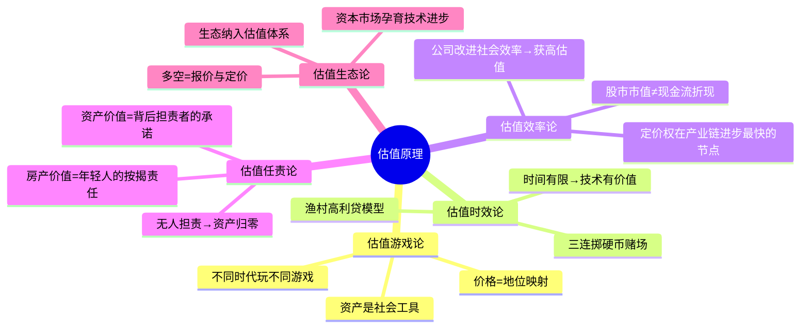

## 《估值原理》读书笔记
  
### 作者  
digoal  
  
### 日期  
2026-05-26  
  
### 标签  
读书笔记 , 估值原理   
  
----  
  
## 背景  
   
  
---
书名: 《估值原理》  
作者: 周洛华  
出版年份: 2022  
笔记日期: 2025-05-26  
豆瓣链接: https://book.douban.com/subject/35947137/  
豆瓣评分: 8.7  
标签: [金融哲学, 估值, 社会学, 人类学, 田野调查, 资本市场]  
---

  

> **一句话**：资产没有内在价值，它的价值来自人与人之间形成的责任关系——这是一部把金融学还给社会学的逆行之作。  
> **适合谁读**：对金融感到困惑的人；想看懂股市却不懂公式的人；对"价值到底从哪里来"有哲学好奇的人  
> **阅读难度**：⭐⭐⭐☆☆  
> **推荐指数**：⭐⭐⭐⭐☆  

---

## 一、时代坐标：一个金融学教授的叛逃

2013年，周洛华在担任上海大学经济学院副院长时，面试一位海归学者，被对方当众反问："这个问题早就解决了，您没看那篇论文吗？"他当场大窘。

这件事成了一个触发点。一个在金融学圈子里摸爬滚打多年、写过国家级规划教材的教授，开始怀疑：这个领域，究竟走在正确的路上吗？

诺贝尔经济学奖得主尤金·法玛说过一句话刺穿了他的防线：如果有效市场假说成立，市场每3000年才应该出现一次5倍标准差的涨跌，但现实是每3—4年就发生一次。金融学的模型，不断被现实打脸，然后打一个新补丁，创造新的受害者。

真正点醒他的，是费雪·布莱克临终前说的一句话：**"金融学不是数学和物理学的一部分，而是人类学和社会学的一部分。"**

于是，周洛华做了一件"野生学者"才干得出来的事：去渔村。

他在上海奉贤和舟山的渔村蹲了整整一年，做田野调查，研究渔民、高利贷、冷库老板和海鲜中间商之间的关系。然后，用这些故事，写了这本《估值原理》——他"金融哲学三部曲"（《货币起源》《市场本质》《估值原理》）的终结篇，2022年出版。

这本书的写作指导思想是维特根斯坦的哲学：不构建新模型，不追求普遍定律，只是在不同事物之间建立联系，让概念"物归原处"。

```
【时间轴】

2018        2019        2020        2022
  |           |           |           |
《货币起源》  田野调查    《市场本质》  《估值原理》
三部曲启动   奉贤/舟山   (中篇)      (终结篇)
                渔村
```

---

## 二、核心命题：你以为在给资产估值，其实在给人排位

### 命题一：估值是一场社会地位游戏，不是现金流计算

传统金融学告诉我们，一项资产的价值等于其未来现金流的折现之和（DCF）。这是金融学最经典的定价框架，从格雷厄姆到巴菲特都在用。

周洛华的颠覆在于：这个框架描述的不是"价值从哪里来"，而只是"价格怎么算"。

他认为，**资产价格的本质，是社会对不同群体之间地位高低的一次集体表态**。当全社会追逐一类资产，是因为这个社会在推崇某种价值观、某种社会地位。股价涨跌，不是随机漫步，而是社会地位的升降在资本市场的投影。

用书中的比方：古代的黄金、近代的钻石、今天的房产，它们的价值不在于物质本身，而在于"拥有它的人"在社会中因此获得的位置。

### 命题二：估值任责论——资产的价值来自背后承担责任的人

这是全书最具颠覆性的论点，也是我认为最有洞见的部分。

周洛华问：房产为什么值钱？

不是因为房子稀缺，不是因为供求关系，而是因为**有年轻人愿意签下15年的按揭贷款，愿意用未来15年的劳动为这套房子承担责任**。是这些人背后承担的责任，支撑起了资产的价值。

推论下去：当年轻人不愿意买房（不愿意承担责任）时，房价会跌——不是因为需求减少，而是因为"担责者"消失了。

这个逻辑非常深刻。它解释了一个常见现象：为什么很多看起来没有现金流的资产（比如年轻城市的期房、初创公司的股票）依然拥有高估值——因为那里有一群人在用青春押注，在为它担责。

### 命题三：估值时效论——时间有限，技术进步才有价值

这部分从渔村的高利贷出发。渔民为什么要借高利贷？因为渔季有限，错过了就是一年。时间压力，让资金成本变得真实。

推论到整个资本市场：**如果时间是无限的，科技进步就没有意义**（反正总会发生）。正是因为生命有限、窗口期有限，"今天比明天更快实现"这件事才变得值钱——这就是技术溢价的根源。

这让我想到了一个反例：日本"失去的三十年"里，为什么技术迭代的估值溢价一直偏低？可能恰恰是因为那个社会的时间压力太弱——老龄化、低欲望社会、没有人急着完成什么。

---

## 三、论证地图：从渔村到华尔街的思维路径



**论证方式的特点**：
- 不用公式，大量用类比和故事（渔村、动物、历史）
- 案例来自田野调查（第一手），可信度高
- 论证风格偏"哲学演绎"，少"实证归纳"——这是风格，也是局限

---

## 四、前提假设与边界：什么情况下这不成立？

**假设一：资本市场足够完善，能反映社会关系**

周洛华的整个框架建立在"市场有效传导社会信息"这个基础上。但在很多新兴市场（包括A股），市场往往被操纵、被政策干预、被情绪主导。这时候，"社会地位投影"的逻辑就大打折扣——价格反映的不是社会关系，而是庄家意志。

**假设二："担责者"的存在是可观测的**

这个框架很有洞察力，但落地困难：我怎么判断某个资产背后"有多少人在担责"？没有量化指标，这套理论更适合解释过去，难以预测未来。

**假设三：社会价值观变动是可以被提前感知的**

如果估值是社会价值观的投影，那么读懂社会就能读懂市场。问题是：谁能系统性地提前感知社会价值观的转向？这需要的能力可能比建模更难——更近似于社会学家、记者、甚至作家的直觉。

**适用边界**：这套框架更适合理解长周期的资产价格逻辑（10年、20年维度），在短期交易层面几乎没有操作性。

---

## 五、思想谱系：站在哪些巨人的肩膀上

周洛华明确承认两大精神来源：

**维特根斯坦**：书的哲学底色。维特根斯坦认为，哲学的任务不是发现真理，而是澄清语言、消解困惑，让各概念"回到它们应在的地方"。周洛华用这个方法论对待金融——不构建新模型，而是重新理解已有概念。

**费雪·布莱克**：金融学向人类学转向的启蒙。Black-Scholes模型的创始人之一，临终前说的那句话成了周洛华的旗帜。

另外两个暗合的思想传统：

- **卡尔·波兰尼**《大转型》：经济活动嵌入社会关系，不能独立于人类社会运转——这与周洛华"估值不脱离人的活动"高度一致。
- **费孝通**《江村经济》：同样用田野调查解读中国经济现象，是方法论上的精神前辈（书评中有人直接拿来对比）。

```
维特根斯坦（哲学方法）
      ↓
费雪·布莱克（金融学转向人类学的宣言）
      ↓
波兰尼（经济嵌入社会结构）+ 费孝通（田野调查方法）
      ↓
周洛华《估值原理》：用人类学视角重建金融哲学
```

---

## 六、我学到了什么？

**1. 价值不在物，而在关系**

这是最根本的认知刷新。以前看到一项资产，本能地会想：它能产生多少现金流？读完这本书，我开始追问：什么人需要它，为什么需要，他们愿意为它承担什么？

这个思维切换，让我重新理解了很多现象：为什么茅台的价值是社交货币而不是饮料价值；为什么一线城市学区房跌得比总价低的郊区盘慢——因为前者背后担责的人密度更高，退出意愿更低。

**2. 估值是一种社会契约，不是一道数学题**

DCF模型之所以经常失灵，不是因为参数选得不好，而是因为它忽视了一个根本事实：资产的价值，是由愿意为它行动的人共同维系的一种社会协议。这个协议一旦松动，模型就崩溃了。2022年中国某些城市的烂尾楼潮，就是一次大规模的"担责者集体退出"。

**3. 社会学视角是金融学的盲区，也是超额收益的来源**

既然主流金融学以数学为工具，那么读社会、读人、读文化的能力，就是一种差异化优势。这不是说要放弃量化，而是要在量化之上，建立社会学的第二眼。

---

## 七、举一反三：这个框架还能用在哪？

**场景一：理解ESG投资的逻辑**

ESG（环境、社会、治理）评级近年来成为主流机构的投资标准。周洛华的"估值生态论"为此提供了底层解释：当社会整体开始把"生态责任"视为价值观的一部分，愿意为之承担成本的人就增加了，绿色资产的担责者群体扩大，估值随之上升。

**场景二：判断一个行业的长期价值**

与其问"这个行业的现金流怎样"，不如问："这个行业吸引了哪类人为它担责？这些人的责任心和能力在增强还是减弱？"——互联网行业从2010年代的高估值到近年来的收缩，与其说是DCF计算的变化，不如说是担责者群体（程序员、创业者）的激情退潮。

**场景三：个人职业选择**

这是我觉得最私人的应用。一份工作的价值，取决于你愿意为这份工作承担多大的责任。你的薪资，是市场对"你愿意承担这份责任"的定价。所以，当你想提升薪资，不要只问"我怎么展示更多技能"，而要问"我愿意承担的责任边界在哪里？"

---

## 八、批判与反思

**这本书有没有我不同意的地方？有。**

**一，论证有时候过于文学化，缺乏可证伪性。**

书中很多观点令人豁然开朗，但也有不少是靠比喻撑起来的。"资产价格是社会地位的投影"——这句话听起来深刻，但怎么验证它比DCF更准确？没有给出路径。维特根斯坦式的哲学写作，有时候模糊了"洞见"和"无从证伪的隐喻"之间的边界。

**二，田野调查的代表性存疑。**

上海郊区渔村的运作逻辑，能代表整个中国资本市场吗？渔民的高利贷关系，能推导出纳斯达克的估值机制吗？作者跨越尺度的跳跃有时候过于大胆。

**三，时代已经变了：担责者结构的崩解**

书出版于2022年，但其实在那之前，中国年轻人"不愿买房"的趋势已经开始。按照他的逻辑，这预示着一场深刻的资产价值重估——而这正在发生。某种意义上，这反而证明了他框架的预测力。但他本人书中对此着墨不多，是一个遗憾。

---

## 九、金句与记忆点

> "估值不会独立于人类社会。我们与其观察某项资产本身的价格波动，不如观察它在人类社会中对其前后左右人们的影响。"

**解析**：把关注点从价格本身，转移到价格与人的关系。这是整本书方法论的核心。

---

> "资产本身没有价值，是人类社会的特定岗位需要有人承担责任，才使得资产有了价值。"

**解析**：责任先于价值。没有担责者，再稀缺的资产也一文不值——盐碱地上的地契就是例子。

---

> "如果时间无限，那么，科技进步就没有价值。"

**解析**：技术的溢价本质是时间的稀缺性。这为"窗口期"思维提供了理论基础：所有的技术红利，本质上都是一段有限的时间。

---

> "金融学应该是社会学和人类学的一部分。"（费雪·布莱克，被周洛华奉为精神旗帜）

**解析**：这句话是本书的灵魂。数学只是语言，人才是主语。

---

> "完善的资本市场本身孕育着技术进步的机制——看似对立的多与空，其实对应了报价和定价两个功能。"

**解析**：做空不是破坏，而是对现有技术的替代者报价。这个视角让"空头"从坏人变成了一种社会功能。

---

> "街上大妈都能听懂。"（读者对这本书可读性的评价）

**解析**：一本没有一个公式的金融书。这本身就是一种立场：真正的原理，不应该躲在数学后面。

---

## 十、延伸阅读

**1. 《大转型》卡尔·波兰尼**
理解"经济嵌入社会"这一命题的源头之作。周洛华的很多论点，在波兰尼这里有更扎实的学术基础。

**2. 《江村经济》费孝通**
同样是田野调查+经济学的跨界之作，中国社会学的里程碑。读完可以理解周洛华为什么选择渔村作为研究对象。

**3. 《宽客人生》伊曼纽尔·德尔曼**
一位从物理学转入金融学的量化大师的反思录。书中对"模型是报价工具而非真理"的论断，与周洛华高度共鸣。

**4. 《货币起源》《市场本质》周洛华**
三部曲的前两部，理解"估值"之前，先读"货币"和"市场"，完整性更强。

**5. 《哲学研究》维特根斯坦**
想真正理解周洛华写作背后的哲学基础，这是源头。不必全读，前50节足以。

---

*笔记写于 2025-05-26 | 基于公开资料与深度思考整理*
*本书豆瓣评分 8.7，2022年3月出版，上海财经大学出版社*
  
  
#### [PostgreSQL 解决方案集合](../201706/20170601_02.md "40cff096e9ed7122c512b35d8561d9c8")
  
  
#### [德哥 / digoal's Github - 公益是一辈子的事.](https://github.com/digoal/blog/blob/master/README.md "22709685feb7cab07d30f30387f0a9ae")
  
  
#### [About 德哥](https://github.com/digoal/blog/blob/master/me/readme.md "a37735981e7704886ffd590565582dd0")
  
  

  
