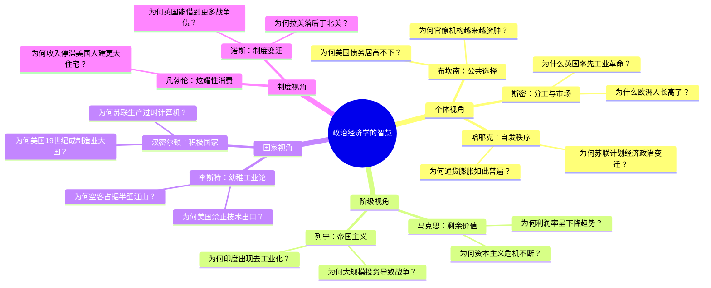

## 《政治经济学的智慧：经典传承与当代回响》读书笔记
  
### 作者  
digoal  
  
### 日期  
2026-05-26  
  
### 标签  
读书笔记 , 政治经济学的智慧：经典传承与当代回响   
  
----  
  
## 背景  
   
---
书名: 《政治经济学的智慧：经典传承与当代回响》   
作者: 黄琪轩   
出版社: 上海三联书店   
出版年份: 2025-05-31   
笔记日期: 2026-05-26   
页数: 812   
定价: 148元   
丛书: here此间学人系列   
标签: [政治经济学, 社会科学, 学术教材, 国际关系, 制度经济学]   
---

   

> **一句话**：用50个"为什么"，把两百年的思想争鸣变成一张读懂当代世界的认知地图。   
> **适合谁读**：想摆脱单一经济学或政治学思维的读者；关心大国博弈与国家兴衰逻辑的人；需要一本"思想武器库"的学生与政策研究者。   
> **阅读难度**：⭐⭐⭐☆☆   
> **推荐指数**：⭐⭐⭐⭐⭐   

---

## 一、时代坐标：这本书从哪里来？

2025年，中美技术脱钩已是现实，人工智能重塑产业秩序，全球供应链在地缘裂缝中重组——每一条新闻背后，都藏着一个古老的问题：**国家、市场与个人，究竟谁说了算？**

黄琪轩是上海交通大学国际与公共事务学院教授，研究方向恰是大国技术竞争与政治经济学。这本书的前身是他主持多年的精品课程"政治经济学经典导读"，也是2018年出版的《政治经济学通识》的大幅扩充与升级版——从392页变成812页，从通识读本进化为"专著式教材"。

在新书发布会上，来自复旦、交大的学者们谈到一个共同判断：西方经济学的主流范式长期忽视了"政治的逻辑"，而在中美竞争、技术封锁、产业政策重归主流的今天，政治经济学的古典传统正在迎来最重要的一次复兴。

这本书的问题意识因此格外清晰：**不是为了介绍"经典"而介绍经典，而是要用经典的智慧来照亮当下的困惑。**

```
时间轴：政治经济学的两次历史高峰

18-19世纪                    20世纪中后期              21世纪20年代
    │                              │                         │
斯密/李嘉图                  哈耶克/弗里德曼              ← 我们在这里
马克思/李斯特               新自由主义浪潮              大国技术竞争
古典政治经济学               新制度经济学               国家能力再议题
    │                              │                         │
    └──────────── 本书试图打通这三个时代 ──────────────────┘
```

---

## 二、核心命题：作者在说什么？

全书围绕三个核心命题展开，不是直白地宣告，而是藏在50个问题的追问之中。

### 命题一：理解世界需要"四副眼镜"

黄琪轩认为，政治经济学从来不是一门统一的学科，而是四种截然不同的观察视角：

- **个体视角**（斯密、哈耶克、弗里德曼、布坎南）：市场、理性人、分工协作是财富的源泉；政府干预往往是问题本身而非解决方案。
- **阶级视角**（马克思、希法亭、列宁）：财富的分配比财富的创造更关键；资本主义的内在矛盾决定了危机的必然性。
- **国家视角**（李斯特、汉密尔顿）：民族国家有独立利益，落后国家必须通过保护性产业政策追赶先进国家；自由贸易是强国的武器，保护主义是弱国的盔甲。
- **制度视角**（凡勃伦、诺斯）：规则、产权与非正式习惯决定了经济绩效；制度路径依赖可以解释"为什么穷国难以变富"。

这四副眼镜没有哪副是全能的。拿单一视角套所有问题——无论是只信"看不见的手"，还是只信"阶级斗争"——都会失去对现实的解释力。

### 命题二：经典的智慧有周期性

书中一个令人深思的观察是：**那些年代久远的思想，常常在历史的特定节点周期性地重现**。李斯特的保护主义理论在19世纪是幼稚工业的辩护，在冷战后曾被认为过时，却在特朗普关税战和中国"举国体制"的讨论中再度成为显学。汉密尔顿对产业政策的论证，和今天拜登《芯片法案》背后的逻辑如出一辙。

古老不等于过时。"道不远人"——先贤的智慧之所以能穿越时代，正因为他们在思考的是人类社会最根本的张力：**竞争与合作、贫困与富裕、强大与弱小、平等与分化**。

### 命题三："走进"经典，也要"走出"经典

这是本书最有方法论意义的地方。作者在导论中明确区分了两种阅读经典的姿态：

"走进"：理解作者在什么历史情境下、用什么方法、解决了什么问题；  
"走出"：批判地审视经典的前提假设，判断它在今天的边界与局限。

这种姿态拒绝了两种常见的阅读陷阱——要么把经典当圣经顶礼膜拜，要么以今天的标准轻易否定前人。

---

## 三、论证地图：作者怎么说服你的？

本书最特别的结构，是用**50个具体问题**作为每一节的标题——每一节都是一个谜，每一节都是一把钥匙。



这种"问题驱动"的写法，是本书最大的叙事优势。读者不会被动接受一个思想家的世界观，而是被一个具体困惑带入，看不同思想流派如何给出截然不同的解答。

举个例子：**"为何美国宁可遭受损失也要禁止技术出口？"**

从个体视角看，这是非理性的——贸易损失了双方福利；  
从阶级视角看，这是金融资本的选择性保护；  
从国家视角看，这是技术霸权的战略维护——李斯特告诉我们，技术领先国会用自由贸易巩固优势，只有在优势受威胁时才祭出保护主义；  
从制度视角看，出口管制是规则本身，规则的形成由权力格局决定。

四个视角给出了四层不同深度的解释，读者自行判断哪一层更接近真相。

---

## 四、前提假设与边界：什么情况下这不成立？

任何宏大的智识框架都有它的盲区，这本书也不例外。

**假设一：经典是可以"融通"的**

本书雄心勃勃地追求"四种融通"——古今、中外、方法、学科。但个体视角（市场最优）与阶级视角（资本剥削）在根本价值观上存在不可调和的张力。把它们并置展示，有助于开阔视野，但"融通"并不意味着"调和"，读者需要自己在矛盾中做选择，而不是期待书本给出一个大统一答案。

**假设二：问题意识是最好的经典入口**

"每节一个问题"的设计非常适合引发兴趣，但也带来一个风险：过于碎片化。政治经济学各流派之间有深层的历史联系与思想对话，单靠问题驱动很难完整呈现某位思想家的内在逻辑体系。读完本书，可能对斯密的几个结论有印象，却对《国富论》整体框架仍不熟悉。

**假设三：中国经验具有理论意义**

新书发布会上，学者们强调本书为"构建新型举国体制提供了智识支撑"。这是一个有意思的方向，但也需要警惕：用西方经典来解释中国实践，和从中国实践中提炼新的理论命题，是两件不同的事。本书更多属于前者，后者尚需另辟蹊径。

---

## 五、思想谱系：这本书站在哪个传统里？

```
西方政治经济学谱系简图

古典自由主义               历史学派/制度主义
斯密 → 李嘉图              李斯特 → 凡勃伦 → 诺斯
    ↓                           ↓
新自由主义               发展主义/国家能力论
哈耶克/弗里德曼/布坎南      汉密尔顿 → 弗里登
    ↓
马克思主义传统
马克思 → 希法亭 → 列宁 → 巴兰/斯威齐

《政治经济学的智慧》的位置：
不选边站，而是做"思想图书馆管理员"——
把各个传统的核心文本和核心问题整理成地图，
让读者自己导航。
```

这种写法在国内学术界相对少见。国内教材要么以马克思主义政治经济学为唯一框架，要么以新古典经济学为主轴——黄琪轩的选择是多元并陈，让各种传统平等出场、公开竞争。这在知识上是诚实的，在学术环境中也需要相当的勇气。

本书与西方的类似作品——如弗里登（Jeffry Frieden）的《全球资本主义》、吉尔平（Robert Gilpin）的《国际关系政治经济学》——处于相近的知识谱系，但更注重教学功能和中国读者的现实关怀。

---

## 六、我学到了什么？

读这本书最大的收获，是**对"解释的多元性"有了更深的敬畏**。

我们习惯了寻找"正确答案"，但政治经济学告诉我们：同一个现象，站在不同的社会位置、使用不同的分析工具，会产生截然不同却各自自洽的解释。这不是相对主义——有些解释确实比另一些更有解释力——但它提醒我们，任何单一视角都是有盲区的。

第二个收获是理解了**"国家"这个分析单位的不可绕过性**。主流经济学训练让人习惯于个体和市场，但历史上几乎所有追赶型国家的成功——美国19世纪的制造业崛起、战后日本和韩国的产业奇迹、今天中国的技术攻关——背后都有强力国家的战略性介入。李斯特和汉密尔顿早在两百年前就说清楚了这一点，只是被新自由主义浪潮压制了几十年。

第三个收获是：**历史是理解当下最好的透镜**。当美国封锁芯片出口、当欧盟补贴空客、当发展中国家讨论产业政策合法性，这些争论的原型早在19世纪就上演过了。了解那段历史，不会让答案变得更简单，但会让我们更清楚地看到争论的本质。

---

## 七、举一反三：这个框架还能用在哪？

本书的"四视角"框架，其实是一套通用的**政策分析工具**，可以迁移到许多现实场景：

**场景一：分析产业政策争论**  
当政府宣布补贴某个新兴行业时，个体视角会质疑效率损失，阶级视角会追问谁是受益者，国家视角会评估战略意义，制度视角会分析政策可持续性。四个问题叠加，比任何单一立场都更接近完整的评估。

**场景二：理解大国博弈**  
中美科技竞争不只是"两个超级大国的利益冲突"（个体/理性主义），还是两种发展模式的竞争（制度视角），也是全球生产体系中的阶级重组（阶级视角），更是国家能力博弈的长期战略展开（国家视角）。

**场景三：评估改革方案**  
任何重大改革——医疗、教育、养老、住房——都会在四个维度上产生不同的影响和争议。用这个框架来梳理，可以更快识别哪些反对意见是真正的价值分歧，哪些只是利益立场的包装。

---

## 八、批判与反思

这本书有几处让我感到意犹未尽。

**"问题"的选取并非价值中立**。为什么选"为何美国禁止技术出口"而不是"为何中国难以突破技术封锁"作为问题？前者是外部视角，后者是内部视角。在一本声称"中外融通"的书里，中国自身的发展经验作为问题主体出现的频率依然偏低——更多是作为西方理论的验证场域，而非理论生产的起点。

**812页的体量，是丰盛也是负担**。对普通读者而言，这更像一本案头参考书，而非一口气读完的叙事作品。如果有一个更精简的"导读版"，可能会触达更广泛的读者。

**"融通"的边界在哪里？** 当不同视角给出相互矛盾的解释时，作者选择并陈而不评判，这固然尊重读者的判断，但也在某些章节留下了"各说各话"的感觉，缺少一个更高层次的整合尝试。

---

## 九、金句与记忆点

**1. "这些年代久远的智慧常常周期性地重现，影响人类历史进程。"**
→ 提醒我们：思想的半衰期远比我们想象得长。看起来过时的东西，可能只是在等待它的历史时刻。

**2. "道不远人"**
→ 书中用来说明经典与现实的关系。政治经济学的先贤不是象牙塔里的哲学家，他们思考的都是真实的权力、财富与冲突。

**3. 四组终极问题：竞争与合作、贫困与富裕、强大与弱小、平等与分化。
→ 人类政治经济生活的所有紧张关系，几乎都能归入这四对。用它来检验任何政策辩论，都会迅速找到核心矛盾。**

**4. 李斯特的洞见：自由贸易是强国的武器**
→ 当英国在19世纪大力鼓吹自由贸易时，它恰恰是世界制造业第一强国。李斯特指出，自由贸易的真实逻辑是：我已经跑在前面，现在请撤掉护栏。这个洞见在今天依然振聋发聩。

**5. 布坎南的"政府失灵"：公共选择理论的核心贡献**
→ 政治家和官员并不是公共利益的代理人，而是有自身利益的理性行为者。为什么美国食糖价格是其他国家两倍？因为少数糖业集团集中游说，而广大消费者的损失分散而微小，没有人愿意为此组织起来。这是"理性的无知"与集体行动困境的教科书案例。

**6. 制度的"路径依赖"：为何拉美落后于北美？**
→ 诺斯的解释：历史上西班牙殖民者建立的是掠夺性制度（大地产、强制劳役），英国殖民者建立的是包容性制度（产权保护、契约执行）。初始制度差异被路径锁定，几百年后仍在决定今天的贫富。

**7. "走进"又"走出"经典**
→ 这不只是阅读方法，更是一种认知态度：尊重先人的思想成就，同时保持批判的独立性。

---

## 十、延伸阅读

**1.《国际关系政治经济学》（罗伯特·吉尔平）**
→ 为什么推荐：本书的英文学术参照系，系统梳理了现实主义、自由主义、马克思主义三大国际政治经济学范式，与黄书形成很好的互补。

**2.《全球资本主义》（杰弗里·弗里登）**
→ 为什么推荐：以全球经济史为主线，把19世纪至21世纪的资本主义兴衰用极好的叙事呈现，是"国家视角"的最佳历史注脚。

**3.《制度、制度变迁与经济绩效》（道格拉斯·诺斯）**
→ 为什么推荐：黄书"制度视角"章节的核心原典，读完黄书再读这本，会理解诺斯为何能获诺贝尔经济学奖。

**4.《国富论》（亚当·斯密）**
→ 为什么推荐：被误读最多的经典。大多数人以为斯密只是"自由市场"的辩护人，但他同样对商人的合谋、对不平等的担忧有深刻论述。本书是很好的"导游"，读完再啃原典，收获不同。

**5.《大国权力转移与技术变迁》（黄琪轩）**
→ 为什么推荐：作者自己的学术专著，专注于大国技术竞争的政治经济学分析，是《政治经济学的智慧》在"国家-技术"维度上的深度延伸。

---

*笔记写于 2026-05-26 | 基于公开资料、新书发布会记录与深度思考整理*
  
  
#### [PostgreSQL 解决方案集合](../201706/20170601_02.md "40cff096e9ed7122c512b35d8561d9c8")
  
  
#### [德哥 / digoal's Github - 公益是一辈子的事.](https://github.com/digoal/blog/blob/master/README.md "22709685feb7cab07d30f30387f0a9ae")
  
  
#### [About 德哥](https://github.com/digoal/blog/blob/master/me/readme.md "a37735981e7704886ffd590565582dd0")
  
  

  
