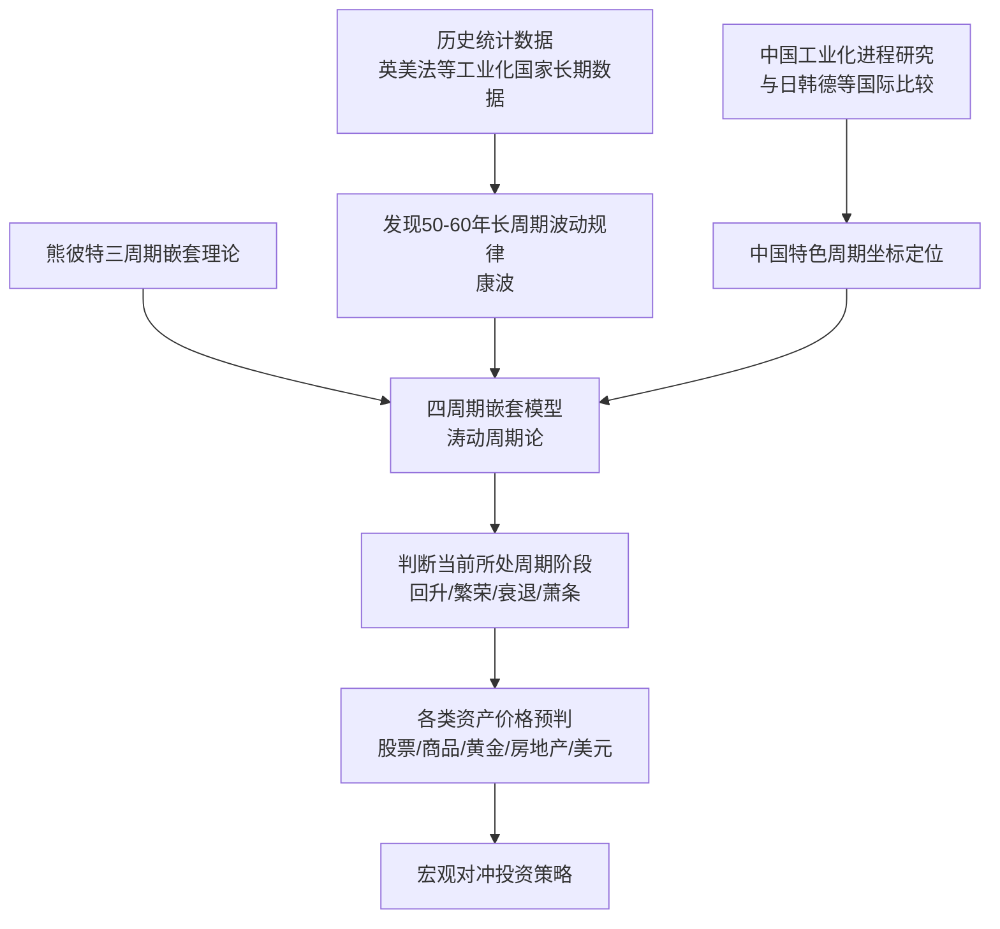
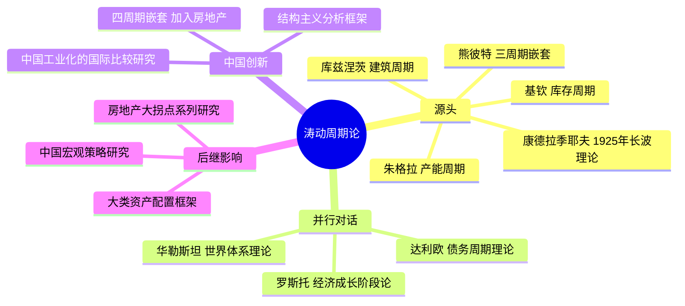

## 《人生财富靠康波：涛动周期论》读书笔记
  
### 作者  
digoal  
  
### 日期  
2026-05-26  
  
### 标签  
读书笔记 , 人生财富靠康波：涛动周期论   
  
----  
  
## 背景  
   
---
书名: 《人生财富靠康波：涛动周期论》   
作者: 周金涛   
出版年份: 2024-12（新版）   
出版社: 中信出版社   
ISBN: 9787521769425   
笔记日期: 2026-05-26   
豆瓣链接: https://book.douban.com/subject/37128565/   
标签: [经济周期, 宏观经济, 投资, 康波, 财富管理, 长波理论]   
---

   

> **一句话**：人不是靠努力发财的，是靠站对了时代的浪头——这不是悲观，是清醒。     
> **适合谁读**：对宏观经济有兴趣的投资者、想理解中国经济周期的从业者、不满足于"努力就能成功"叙事的独立思考者     
> **阅读难度**：⭐⭐⭐☆☆（研报部分较硬，演讲和访谈部分流畅易读）     
> **推荐指数**：⭐⭐⭐⭐☆   

---

## 一、时代坐标：一个预言家的遗作

2016年12月27日，中信建投首席经济学家周金涛因胰腺癌在天津去世，年仅44岁。他走得太早，早到没能亲眼看到自己最重要的预言逐一兑现。

这本书是他的遗作汇编。从2006年至2016年，十年间他在长江证券、中信建投发表的核心研报、公开演讲与访谈实录，被编辑整理成册，2024年由中信出版社再版。书名来自他2016年上海清算所的一场演讲，那是他最广为人知的一句话：

> **"人生发财靠康波，一场康波60年，正好对应一个人的一生。一生中理论上只有三次机会，抓住一次，你就能成为中产。"**

这不是励志演讲，而是一个经济学家对人生财富宿命论的冷静表述。

周金涛，1972年生于天津，毕业于南开大学，是中国结构主义经济学派的开创者，也是将康德拉季耶夫周期（康波）理论系统引入中国投资研究的第一人。他成名于精准预测：2007年预言次贷危机，2013年提出房地产大拐点，2015年预告全球资产价格顶部与A股崩盘，2016年预判大宗商品年度级别反弹——每一次在市场最嘈杂时，他选择了最不受欢迎的方向，并且都对了。

```
时间轴：周金涛的预言与兑现

2005 ──── 开始研究康波与中国工业化周期
2006 ──── 发表《繁荣的起点并非沸腾的年代》（预言2020s虚拟经济大繁荣）
2007 ──── 成功预测美国次贷危机（"康波衰退第一次冲击"）
2008 ──── 提出四万亿刺激后股市房市将大反弹（应验）
2013 ──── 提出中国房地产20年周期顶部将现（2021年应验）
2015.11 ── 预言2016年一季度中国经济触底，大宗商品年度反弹（应验）
2016.12 ── 演讲"人生发财靠康波"，同年12月因病离世，享年44岁
2024 ──── 新版《人生财富靠康波》由中信出版社出版
```

---

## 二、核心命题：作者在说什么？

### 命题一：财富的本质是资产价格的β，不是个人的α

周金涛的核心观点简洁而刺激：**人生财富积累的根本，是对康波周期中资产价格的投资或投机，而非个人能力。**

在一个60年的康波周期里，每一类资产都有其"黄金窗口期"：股票在某个阶段暴涨，大宗商品在另一阶段暴涨，房地产在另一个阶段暴涨。如果你在对的时间持有了对的资产，你就"发财"了。如果你努力工作但踩错了周期，你就只是时代浪潮里的普通人。

这个观点让很多人不舒服——它暗示努力不够，命运更重要。但周金涛并不是在宣扬躺平，而是说：**你必须先看懂大势，才能知道劲往哪使。**

### 命题二：四周期嵌套——宏观世界的"钟表"

周金涛在熊彼特三周期理论基础上，引入房地产周期，建立了自己的"四周期嵌套模型"（涛动周期论）：

| 周期名称 | 时长 | 驱动力 | 对应资产 |
|---|---|---|---|
| 康波（康德拉季耶夫） | 50-60年 | 技术革命 | 所有大类资产的总方向 |
| 库兹涅茨周期 | 15-25年 | 房地产投资 | 房地产、基建相关 |
| 朱格拉周期 | 9-10年 | 设备资本投资 | 工业股、大宗商品 |
| 基钦周期 | 3-4年 | 库存波动 | 短期商品与股市 |

四个周期像齿轮一样嵌套转动。短周期的方向受中周期约束，中周期受长周期主导。当四个周期共振向上时，出现大牛市；共振向下时，出现大危机。

一个康波大约包含6个朱格拉周期和18个基钦周期。读懂这张"钟表"，就能判断当下的周期位置，从而制定资产配置策略。

### 命题三：人生只有三次财富机会

一个人的有效投资生涯约30-40年，恰好覆盖半个康波。在一个完整的60年康波中，存在三个大级别的资产价格启动窗口（回升、繁荣、衰退期的不同资产轮动机会）。

如果三次都错过，财富很难实现跨越。抓住一次，足以改变阶层。

---

## 三、论证地图：周金涛如何构建他的预言体系



**关键论证手段：**

**历史数据对标**：周金涛大量引用英国、美国、德国、日本等已完成工业化国家的百年经济数据，找到共同的周期规律，再套用到中国当前阶段。这是他研究的支柱，也是其最重要的方法论创新——用"先行者"的历史轨迹预判"后来者"的未来。

**多周期共振判断**：不只看单个周期，而是研判多个周期同时处于什么方向。2016年大宗商品反弹，是因为基钦、朱格拉、库兹涅茨三个周期在2015-2016年同时触底回升，共振向上。

**价格机制为核心**：周金涛反复强调，康波的本质是价格波动。价格是信号，理解价格在周期中的运行规律，才能理解资本、货币、投资的流向。

---

## 四、前提假设与边界：这套理论在哪里会失效？

理解一套理论的局限，和理解其精华同样重要。

**假设一：历史会重演**  
四周期嵌套的核心是历史统计规律的外推。这隐含着"历史会在更高维度上重演"的假设。然而，如果出现范式转移——比如人工智能在未来十年重组生产方式、或者货币体系发生根本性变革——历史数据的参考性会显著下降。周金涛自己也承认，"周期终将幻灭"，只是在幻灭之前，我们仍然身处其中。

**假设二：政策干预是周期的扰动，不是终结**  
书中多次提到，货币宽松、财政刺激等政策手段可以延长或扭曲周期，但无法终结周期。中国2015年的棚改货币化让房地产周期顶部推迟了约2-3年，但2021年的深度调整证明了他的判断方向正确。这个假设在历史上多次被验证，但仍然存在"政策时滞"的判断难度。

**假设三：中国工业化路径与发达国家同构**  
周金涛用日本、韩国、德国等国的工业化路径类比中国。这个假设在大趋势上是成立的，但中国有制度特殊性——国有经济比例、土地财政模式、资本账户管制——这些可能使周期的表现形式与标准模型有偏差。

**边界**：这是一套宏观框架，给出的是方向概率判断，而非精准的时间节点预测。用它来做趋势性的大类资产配置，逻辑较强；用它来做短线交易，过于粗糙。

---

## 五、思想谱系：这本书站在哪个传统里？



周金涛所处的思想传统是**非主流经济学的长波学派**。在主流经济学（尤其是新古典经济学）那里，长周期理论因"难以被精确证伪"而长期受到冷遇。但在投资界和政策分析领域，这套框架一直有其生命力——因为它试图回答一个现实问题：长期来看，钱往哪儿走？

他与达利欧的思想有相似之处——两人都强调"周期是理解世界的底层逻辑"，都试图用历史数据构建系统性投资框架。区别在于，达利欧的核心是债务周期，周金涛的核心是技术创新驱动的康波。

周金涛最重要的中国本土创新在于：将房地产周期（库兹涅茨）引入四周期嵌套，并用中国独特的城镇化进程来诠释中国经济的周期特征。这一视角使得他在2013年就洞察到"房地产作为中国经济核心引擎已接近终点"，领先市场共识整整8年。

---

## 六、我学到了什么？

**第一：区分β和α，是投资认知的分水岭**

多数人终其一生都在追求"选股能力""个人努力""独到眼光"——这些都是α。但周金涛提醒我：一个牛市里，随机选的股票大概率赚钱；一个熊市里，最优秀的股票也可能跌。β（宏观周期的方向）在长期远比α重要。这个认知让我重新审视了"努力工作"和"把握时机"之间的关系——两者都重要，但次序可能要颠倒过来先想。

**第二：历史数据是人类集体行为的结晶，不是随机噪声**

周金涛对历史数据的尊重启发了我。他不是用数据来"找规律"，而是相信"人类的集体经济行为在相似的技术-制度背景下会产生相似的结果"。历史不会简单重复，但会押韵。这是长波理论的哲学底座，也是一种面对不确定性时的理性谦逊：我们无法预测未来，但可以提高对大方向的判断概率。

**第三：遗憾是这本书最动人的底色**

周金涛去世时44岁，他预言的很多大事——中国房地产2021年的崩塌、2016年大宗商品反弹——他都没能活着亲眼看到验证。读到"人生中只有三次财富机会"，你会想到他自己的人生，也只走了一半康波。他用生命研究周期，却没能走完自己的周期。这种反差让这本书不只是投资手册，更像是一封写给后来人的遗书。

---

## 七、举一反三：这个框架还能用在哪？

**职业规划的"行业周期定位"**  
选择行业，类似于选择资产。一个处于朱格拉繁荣期的行业（比如2000年代中国的制造业、2010年代的互联网），能给你提供的成长空间远大于一个处于衰退期的行业。在大方向对的行业里做个普通人，往往好过在夕阳行业做顶尖人才。

**理解为什么"你爸妈买房那个年代很容易买到好房子"**  
1990-2010年，中国处于库兹涅茨房地产上升周期+康波繁荣期的共振阶段。那个年代买房不是他们多有眼光，是周期给了他们一个巨大的顺风。理解这一点，既避免了后代无谓的自我怀疑，也能更清醒地判断：当下是否还有类似的"顺风资产"存在。

**对国家/文明兴衰的宏观理解**  
每次康波的主导国，往往是引领那次技术革命的国家（第一次康波：英国；第三次：美国；第五次：可能是美国继续，但挑战者是中国）。用这个框架看地缘政治竞争，会有不同的视角。

---

## 八、批判与反思

**最大的质疑：这是科学还是"马后炮"？**

批评者有一个核心问题：康波周期的划分，是在数据中"找"到的规律，还是用既有规律"解释"历史？在统计学上，如果你足够灵活地调整起止点，几乎任何历史数据都可以被拟合进一个"周期"。这是长波理论在学术界长期不被主流承认的根本原因之一。

周金涛的多次精准预测是这个质疑最有力的反驳。但也应承认：他预言的时间节点有时偏差较大（如中国房地产顶部他认为在2014年，实际上到2021年），其弟子和追随者基于同一框架的预测质量也参差不齐。这说明这套框架对使用者的判断力要求很高，不是一套可以"按图索骥"的操作手册。

**时代已经变了什么？**

周金涛的主要研究是在2016年前完成的。此后发生的一些变化，在他的框架里尚无足够的处理方式：
- AI技术的爆发式发展——是新康波的起点，还是对旧康波的加速？
- 逆全球化浪潮——他的"世界经济共生模式"分析是否还适用？
- 中国房地产特殊调控路径——政府的直接干预使市场周期被深度改造

他的框架仍然有效，但需要当代读者自己去填充更新的素材和判断。

---

## 九、金句与记忆点

**① "人生发财靠康波，一生理论上只有三次机会，三次都没抓住，你就是普通人。"**  
→ 不是宿命论，是概率论。它要求你先知道自己在哪个周期位置，再决定如何行动。

**② "康波的本质就是价格波动，人生的财富积累根本上源于资产价格的投资或投机。"**  
→ 直接戳破了"财富靠努力"的幻觉，但这不是否定努力，而是说努力要用在"判断周期"上。

**③ "在长波的下降期，生产技术往往有最重要的发明，但要等到上升期才大规模应用。"**  
→ 这是康波的一个有趣特征：萧条期孕育下一次的技术革命。AI在萧条期爆发，是否正是这个规律的当下印证？

**④ "短周期决定你今年赚不赚钱，长周期决定你一生活成什么样。"**  
→ 投资者往往把精力放在短周期，却忽视了真正决定财富命运的长周期判断。

**⑤ "房地产将从中国人的财富引擎变成财富绞肉机。"**  
→ 2013年说出这句话，2021年应验。这是他最令人印象深刻的判断之一，也是他对普通家庭最重要的警示。

**⑥ "周期终将幻灭，但在此之前，我们仍将经历一次康波。"**  
→ 他承认自己理论的局限性，但同时指出：即便框架最终失效，在失效之前，周期仍然在运行。

---

## 十、延伸阅读

**① 《原则》 雷·达利欧**  
同样是用历史数据构建周期框架，达利欧聚焦债务周期，与康波形成互补。读完这两本，可以从不同维度理解"为什么经济会有起伏"。

**② 《大债务危机》 雷·达利欧**  
专门研究债务危机的历史模板，可以和康波衰退-萧条期的机制相互印证。

**③ 《繁荣与衰退》 阿瑟·伯恩斯**  
经济周期研究的经典学术文本，可以补充周金涛研究的历史背景。

**④ 《罗斯托的经济成长阶段论》**  
周金涛大量引用罗斯托的理论来分析中国工业化阶段，读原著可以加深对"主导产业"这一核心概念的理解。

**⑤ 《下一个繁荣》 哈里·登特**  
同类方向但侧重人口周期，与康波结合来看，对理解"需求侧的长期变化"很有帮助。

---

## 后记：一个被历史验证的人，和一个未竟的预言

周金涛用生命写完了这本书。他离开时，中国房地产仍在上涨，大多数人仍不相信拐点已近。但他知道。

他知道，因为他算过。他算过1800年以来每一次工业化的轨迹，算过每一次康波里房地产的生命曲线，算过当技术不再是周期的引擎时，什么资产会接替。

44岁，他没有活到看见自己预言全部兑现的那一天。

但今天，2026年，站在他生命结束后的第十年，翻开这本书——读者会发现，他说的事情，一件一件，都发生了。

这不是神话，这是周期。

---

*笔记写于 2026-05-26 | 基于公开资料、研报摘录与深度思考整理*  
*原书为周金涛研报、演讲、访谈汇编，2024年中信出版社新版*
  
  
#### [PostgreSQL 解决方案集合](../201706/20170601_02.md "40cff096e9ed7122c512b35d8561d9c8")
  
  
#### [德哥 / digoal's Github - 公益是一辈子的事.](https://github.com/digoal/blog/blob/master/README.md "22709685feb7cab07d30f30387f0a9ae")
  
  
#### [About 德哥](https://github.com/digoal/blog/blob/master/me/readme.md "a37735981e7704886ffd590565582dd0")
  
  

  
