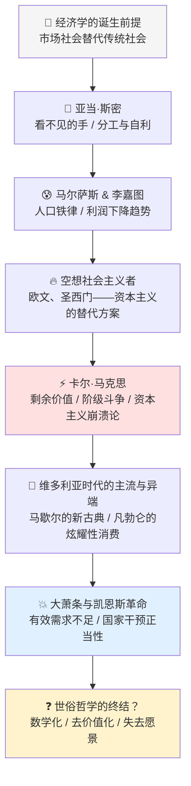

## 《经济学家到底在想什么：从亚当·斯密到凯恩斯》读书笔记
  
### 作者  
digoal  
  
### 日期  
2026-05-26  
  
### 标签  
读书笔记 , 经济学家到底在想什么：从亚当·斯密到凯恩斯   
  
----  
  
## 背景  
   
---
书名: 《经济学家到底在想什么：从亚当·斯密到凯恩斯》   
作者: [美] 罗伯特·L.海尔布罗纳   
原作名: The Worldly Philosophers: The Lives, Times, and Ideas of the Great Economic Thinkers   
出版年份: 1953（初版）/ 2024（中文新译本）   
笔记日期: 2025-05-26   
豆瓣评分: 9.2（商务印书馆旧译版）/ 8.5（2024新译版）   
标签: [经济学史, 思想史, 亚当·斯密, 马克思, 凯恩斯, 入门经典]   
---

   

> **一句话**：经济学不是冷冰冰的数学公式，而是一代代思想家对"资本主义到底怎么运转"这个灼烧时代的问题给出的滚烫答案。   
> **适合谁读**：对经济学感到陌生但又对"世界为什么是这样"充满好奇的人；刚开始学经济学、找不到历史感的学生。   
> **阅读难度**：⭐⭐☆☆☆   
> **推荐指数**：⭐⭐⭐⭐⭐   

---

## 一、时代坐标：一个研究生写出的世纪经典

1953年，罗伯特·海尔布罗纳还是个研究生，写下了这本书。没有人料到它会畅销超过400万册，成为英语世界经济学入门的"第一读本"，与《国富论》并列推荐。

海尔布罗纳是谁？他是一个异类。师从左翼经济学家保罗·斯威齐，骨子里是一个对资本主义充满批判热情的社会民主主义者，却在整个学术生涯里保持了罕见的平衡感——他不是来赞美市场的，也不是来审判它的，他是来**理解它**的。

这本书诞生于一个奇特的历史节点：二战刚刚结束，凯恩斯主义正在全盛，冷战开始，西方世界既对资本主义充满信心，又对其危机记忆犹新。在这个时刻，海尔布罗纳想做一件事：**把过去200年里那些思考过"资本主义到底是什么"的伟大头脑，用普通人能读懂的语言重新介绍给世界。**

他的问题意识极其清晰：在经济学越来越像数学的年代，我们正在忘记，这门学科本来是一门关于人类命运的"世俗哲学"（Worldly Philosophy）。

---

## 二、核心命题：作者在说什么？

### 命题一：经济学家是时代的产物，不是真空里的天才

海尔布罗纳用一个被人遗忘的常识震醒读者：**在18世纪之前，经济学家根本不存在。**不是因为没有聪明人，而是因为那个时代的经济运行方式——传统与权威——根本不需要被解释。市场经济是一个历史发明，经济学家是跟着市场经济一起被发明出来的。

亚当·斯密诞生于工业革命前夜，他的任务是为一个新秩序辩护；马尔萨斯和李嘉图面对的是工业革命带来的贫困与撕裂；马克思看见的是资本主义成熟期的内在矛盾；凯恩斯迎面撞上的是1929年大萧条的废墟。**每一个重要的经济学家，都是在回答他那个时代最灼烧的问题。**

这个视角，颠覆了人们对"学术"的刻板印象——好像学者是住在象牙塔里、研究永恒真理的人。海尔布罗纳告诉我们：不，他们是在时代的暴风雨中，试图找到一根解释一切的线头。

### 命题二：所有伟大经济学家都在研究同一个问题

书的第七版中，海尔布罗纳补充了一个统一的主线：**从亚当·斯密到凯恩斯，这些思想家表面上观点迥异，但他们其实在追问同一件事——资本主义社会是如何运转的？**

这不是一个技术问题，而是一个文明问题。资本主义是人类历史上第一个"匿名协调"的经济体系——没有皇帝下令，没有宗教规定，数百万人通过价格信号自发配合，生产出彼此需要的东西。这件事为什么能成立？它有没有内在的自我毁灭倾向？它会走向何方？

斯密说：有只看不见的手在协调，放任它就好。马克思说：这只手注定会扼住自己的脖子。凯恩斯说：这只手有时会颤抖，政府必须出手稳住。他们的答案截然不同，但问题始终是同一个。

### 命题三：现代经济学正在背叛它的使命

这是海尔布罗纳最不妥协的一个判断，写在最后一章《世俗哲学的终结？》里。他忧虑地指出：当代经济学越来越数学化、越来越像自然科学，却在这个过程中**丢失了"愿景"（vision）**——那种对资本主义作为一个整体系统的道德与政治判断。

这不是老人的怀旧。这是一个清醒的诊断：当经济学家们忙着用微积分证明均衡，却不再追问"什么样的社会是我们想要的"，他们就从世俗哲学家退化成了技术工匠。

---

## 三、论证地图：他怎么把这些人讲活的？



海尔布罗纳的讲法有一个固定的结构：**先写时代背景（Times）→ 再写人的生平（Lives）→ 最后讲思想（Ideas）**。这个顺序不是偶然的，它本身就是一个方法论宣言：思想不能脱离时代和人来理解。

他特别擅长用对比制造张力。马尔萨斯和李嘉图同是好友，却用同样的逻辑得出了对立的政策建议；马克思是个穷困潦倒的图书馆虫子，却写出了撼动世界的资本论；凯恩斯是一个喜欢艺术与美的贵族知识分子，却在大萧条时拯救了整个资本主义体系。这种戏剧性的对照，让每一章都有小说的质感。

---

## 四、前提假设与边界：什么情况下这本书不成立？

**假设一：思想史可以用"伟大人物"串联**

海尔布罗纳的叙事高度依赖个人英雄主义——亚当·斯密的洞见、马克思的愤怒、凯恩斯的智慧。但这遮蔽了一个事实：思想是集体生产的。书中几乎没有讲到机构、学派的演化、意识形态环境如何形塑思想，而是把一切归结为几个天才的个人视野。

**假设二：经济学史是线性进步的**

书的结构暗示了一种进化叙事：思想在一代代积累中走向完善。但真实的思想史充满了遗忘、断裂和倒退。凯恩斯之后并没有"更高级"的凯恩斯主义，而是出现了新自由主义的全面逆转。海尔布罗纳自己在结尾也感受到了这种不安。

**假设三：西方中心的视野**

全书的经济学家全部来自西欧和美国。阿拉伯的伊本·赫勒敦（Ibn Khaldun）、中国历史上的经济思想，完全不在视野之内。这是时代局限，但在今天读来，是明显的盲点。

---

## 五、思想谱系：这本书站在哪里？

```
古典政治经济学（斯密、李嘉图）
         │
         ▼
  马克思主义传统
         │
         ├──────── 制度经济学（凡勃仑）
         │
         ▼
  凯恩斯主义革命
         │
         ▼
  海尔布罗纳的"世俗哲学"立场
  （批判性地继承古典传统，
   警惕新古典数学化）
```

海尔布罗纳师承保罗·斯威齐（马克思主义政治经济学家），但他不是正统马克思主义者，而是一个更接近"社会民主主义"的立场——他相信资本主义有内在问题，但不相信暴力革命是出路，更倾向于改良与理解。

这本书对后世的影响极为广泛。无数经济学家承认，正是这本书让他们对经济学产生了最初的兴趣。它扮演的角色，有点像《苏菲的世界》之于哲学——用故事把一门严肃学科的大门打开了一道缝。

---

## 六、我学到了什么？

**第一个收获：经济学理论都是有"颜色"的**

读完这本书，最大的改变是：再也不会把任何经济理论当成"中性的科学事实"来接受了。斯密相信自由市场，是因为他生活在一个急需打破封建特权垄断的时代；马尔萨斯相信贫穷是必然的，是因为他站在地主阶级的立场；芝加哥学派相信市场万能，是因为他们在与凯恩斯主义博弈。

每一个经济学理论背后，都有一个"愿景"（Schumpeter说的preanalytic vision）——一个关于"什么是正常、什么是正义"的隐藏假设。看见这个假设，才真的看懂了理论。

**第二个收获：经济学家和他们的时代是共谋关系**

不是时代"产生"了经济学家，而是经济学家和时代互相塑造。斯密的自由主义帮助工业资本打败了封建商业资本；马克思的分析激励了整整一代工人运动；凯恩斯的理论让政府在大萧条后找到了干预经济的正当性。思想不只是反映现实，它也在改变现实。

**第三个收获："科学化"不是解药**

海尔布罗纳在最后提出的警告，在今天读来比1953年更有分量：当经济学把自己打扮成物理学，用数学模型替代价值判断，它并没有变得更中立——它只是把自己的意识形态藏得更深了，让普通人更难质疑它。这个洞见，在2008年金融危机后被反复引用。

---

## 七、举一反三：这个框架还能用在哪？

**场景一：看当代经济政策争论**

每次看到"专家建议降准"或"学者呼吁减税"时，海尔布罗纳教会我的第一个动作是：这个建议背后的"愿景"是什么？它在假设一个什么样的社会是好的？谁会从这个政策里获益？

**场景二：理解任何思想流派**

"时代→生平→思想"的分析框架，不只适用于经济学。读任何哲学家、社会学家、文学家，都可以先问：他/她活在什么样的历史节点？个人经历如何塑造了他的问题意识？这个框架让知识脱离了悬空感。

**场景三：职场中的"第一性原理"**

书中一个隐含的洞见是：大多数时候，人们接受的"常识"其实是特定历史时期的"发明"——包括工作、薪资、市场、国家等等概念。当你意识到这些概念都是被建构的，就有了解构和重建的可能性。

---

## 八、批判与反思

**这本书最大的问题：缺少女性**

全书16位经济思想家，无一是女性。这不只是历史局限——海尔布罗纳至少可以提到哈里雅特·泰勒（约翰·穆勒的合作者，《政治经济学原理》的共同作者之一）或罗莎·卢森堡。这个缺席在今天读来格外刺眼。

**时代已变：凯恩斯之后的世界**

书的叙事在凯恩斯那里戛然而止，此后的新自由主义革命（哈耶克、弗里德曼）、行为经济学、环境经济学、全球化的挑战……这些都不在书里。这本书给了你一张地图，但地图上的世界在1950年代就已经开始剧变了。

**英雄史观的陷阱**

思想史写成了伟大人物传记，这种写法迷人却危险。它让人以为，好的经济学来自于更聪明的个体，而不是来自于更好的制度、更多元的声音、更强的自我纠错机制。

---

## 九、金句与记忆点

1. **"经济学家是时代的孩子，而不是时代之外的神"**（我的概括）——任何经济理论都不是价值中立的，它诞生于特定历史时刻，服务于特定阶层的利益。

2. **"在市场社会之前，经济学家是不可能存在的"** ——这个洞见让我重新理解了整门学科的起源：经济学不是古老的智慧，而是工业革命的副产品。

3. **"看不见的手，并非总能看见自己"**（对斯密的延伸）——自由市场的协调机制有其辉煌的逻辑，但它对外部性、不平等、公共品是盲目的。

4. **海尔布罗纳评马克思**：他看出了资本主义的深层矛盾，但他的解决方案——无产阶级专政——带来了与他诊断同样严重的新问题。"正确的病理，错误的药方"。

5. **"凯恩斯拯救了资本主义，也许正因如此，他是资本主义历史上最重要的人物"** ——在系统最危险的时刻，凯恩斯不是要推翻它，而是要修补它。这是一种深刻的保守主义，也是一种深刻的理性。

6. **"世俗哲学的终结"** ——当经济学失去了对"什么是好社会"的追问，它就从一门思想退化成了一门工具。这个担忧，在今天比1953年更加紧迫。

---

## 十、延伸阅读

**1. 《国富论》（亚当·斯密）**
读完海尔布罗纳的"导游介绍"后，有了足够的背景知识再去读原著，会发现斯密远比教科书里的那个"自由市场布道者"复杂得多。

**2. 《资本论（第一卷）》（马克思）**
同上。马克思写得极其精彩，尤其是对商品拜物教的分析，至今仍是理解消费社会最犀利的工具。从第一章开始读，感受他如何从一件普通商品里抽出整个资本主义体系的逻辑。

**3. 《就业、利息和货币通论》（凯恩斯）**
难读，但凯恩斯的文字本身就是享受。至少读第一章和最后一章，感受他如何颠覆古典经济学的基本假设。

**4. 《资本主义、社会主义与民主》（熊彼特）**
海尔布罗纳书中另一位主角，预言资本主义最终会被自己的成功所消灭——不是因为革命，而是因为"创造性破坏"让精英阶层自我瓦解。和马克思的预言形成有趣的对照。

**5. 《价值的一切》（玛丽亚娜·马祖卡托）**
弥补海尔布罗纳书中最大的缺憾：从女性视角、从现代政治经济学角度，重新追问"谁在创造价值"——这个问题，正是斯密们的核心议题，在当代又有了新的答案。

---

*笔记写于 2025-05-26 | 基于公开资料与深度思考整理*
*原书初版于1953年，中文新译本由读客文化出品，2024年4月出版*
  
  
#### [PostgreSQL 解决方案集合](../201706/20170601_02.md "40cff096e9ed7122c512b35d8561d9c8")
  
  
#### [德哥 / digoal's Github - 公益是一辈子的事.](https://github.com/digoal/blog/blob/master/README.md "22709685feb7cab07d30f30387f0a9ae")
  
  
#### [About 德哥](https://github.com/digoal/blog/blob/master/me/readme.md "a37735981e7704886ffd590565582dd0")
  
  

  
