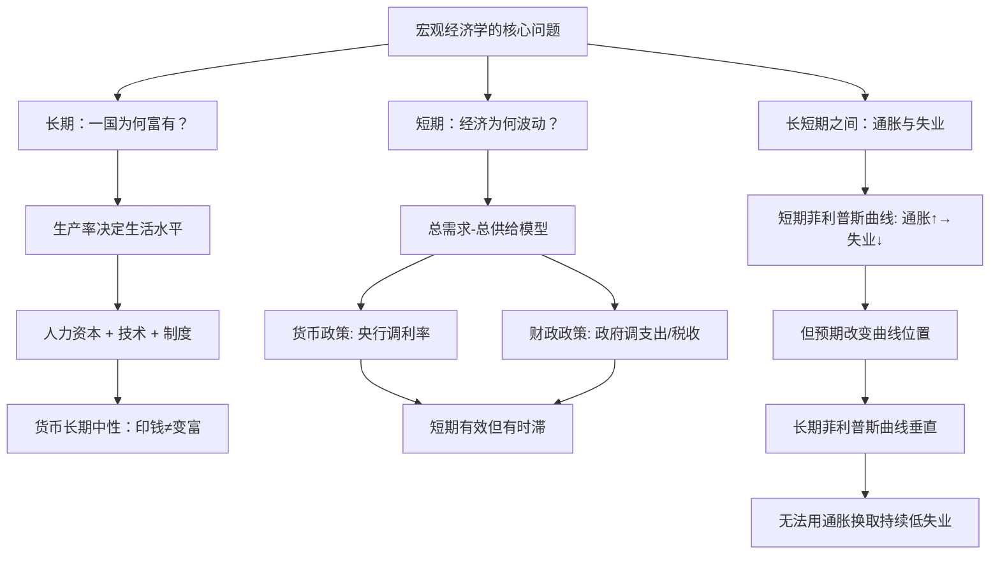

## 《经济学原理·宏观经济学分册》读书笔记
  
### 作者  
digoal  
  
### 日期  
2026-05-26  
  
### 标签  
读书笔记 , 经济学原理·宏观经济学分册   
  
----  
  
## 背景  
   
---
书名: 《经济学原理（第8版）·宏观经济学分册》   
作者: N. 格里高利·曼昆（N. Gregory Mankiw）   
译者: 梁小民 / 梁砾   
出版社: 北京大学出版社   
出版年份: 2020   
笔记日期: 2026-05-26   
豆瓣链接: https://book.douban.com/subject/34952271/   
ISBN: 9787301312988   
标签: [宏观经济学, 入门教材, 经济学思维, 货币政策, 财政政策]   
---

   

> **一句话**：这是一张帮你读懂新闻里所有"GDP"、"通胀"、"加息"的地图，也是一套用常识解释经济运行的思维框架。   
> **适合谁读**：经济学初学者、想看懂财经新闻的普通读者、备考考研的同学   
> **阅读难度**：⭐⭐☆☆☆（数学极少，逻辑清晰）   
> **推荐指数**：⭐⭐⭐⭐☆   

---

## 一、时代坐标：这本书从哪里来？

1998年，哈佛大学经济学教授曼昆把一本尚未完稿的教材手稿卖给出版商，拿到了250万美元的预付款，创下经济学著作卖价的吉尼斯世界纪录。当年出版后，销量即达20万册，再破吉尼斯纪录。

这是一个耐人寻味的起点。它说明这本书的成功，从一开始就不只是学术上的，更是市场上的——出版商押注的，是"普通人想学懂经济学"这件事本身的巨大需求。

1998年前后的背景很重要：冷战刚结束没几年，自由市场经济被视为压倒性的胜利者，IMF和世界银行在全球推销"华盛顿共识"，主流经济学家前所未有地自信。曼昆的书诞生在这个时刻，它天然带有那个时代的底色：相信市场的基本逻辑，相信价格信号，相信政策的局限性。

**写这本书，曼昆的目标只有一个**：让第一次读经济学的人"能用经济学家的眼光看世界"。为此，他几乎放弃了所有复杂的数学，用日常故事和新闻案例来诠释原理。这是这本书的核心取舍——它不是研究工具书，是一张思维地图。

宏观分册脱胎于完整版的后半部分，专门聚焦一个国家整体经济层面的问题：为什么有些国家富有有些国家贫穷？为什么会有通货膨胀和失业？政府的政策真的能稳定经济吗？

---

## 二、核心命题：作者在说什么？

宏观经济学分册可以浓缩为三大命题，各自统领一段认知旅程：

### 命题一：长期繁荣靠的是生产率，不是货币

全书的基石论断是：**一国的长期生活水平，取决于它每小时能生产多少东西**。这个看似简单的结论，颠覆了很多人的直觉——毕竟大家觉得"钱多了才会富"。

曼昆花了整整两章（第25章"生产与增长"）来论证：人力资本、实物资本、自然资源、技术知识，这四要素才是决定一国长期财富的真正密码。印钞票不能让一个国家变富，只会让物价同比例上涨。这就是古典二分法的核心：**货币是"名义的面纱"，长期不影响真实产出**。

这个命题的政策含义极为深远：政府真正能做的长期贡献，是投资教育、维护产权、保障良好的制度环境——而不是靠多发钱来制造繁荣幻觉。

### 命题二：短期波动是真实的，政策确实能（有限地）管用

如果长期来看货币是中性的，那短期呢？曼昆的答案是：短期中，货币并非中性，总需求的变动会真实影响就业和产出。

这是书中最核心的模型——**总需求—总供给模型（AD-AS）**。经济衰退时，总需求曲线向左移动，产出下降，失业上升；政府可以通过宽松货币政策（降息）或扩张性财政政策（增加支出）来刺激总需求，让曲线向右移动，提振经济。

这里有个重要的洞见：短期政策有效，但存在**时滞**——货币政策决定到见效可能要6-18个月，财政政策则还要经历漫长的政治决策过程。曼昆因此对过于积极的稳定政策持审慎态度：你以为在灭火，其实可能在加油。

### 命题三：通货膨胀与失业之间存在短期权衡，但长期不存在

菲利普斯曲线是宏观经济学中最著名的曲线之一：通胀↑则失业↓，通胀↓则失业↑。曼昆的处理颇为老练——他承认短期菲利普斯曲线存在，但强调**预期**会使这条曲线不断移动。

当人们预期通胀时，工资谈判、合同定价都会内化这一预期，结果是通胀上去了，失业却没有持续下降。这就是为什么长期菲利普斯曲线是垂直的——你不能通过制造通胀来"买"更低的失业率。20世纪70年代的滞胀（高通胀+高失业）是对这一命题最残酷的现实检验。

---

## 三、论证地图：作者怎么说服你的？



曼昆的论证方式有几个鲜明特点：

**大量用真实数据**。讨论经济增长时，他展示不同国家几十年的人均GDP数据；讨论通胀时，他引用恶性通胀国家（津巴布韦、魏玛德国）的极端案例来说明货币数量理论的威力。这些案例的选取不是随机的——极端例子往往能让原理"发光"。

**用日常比喻打通抽象概念**。货币数量论里那句"如果中央银行让货币供应量翻倍，价格也会翻倍，你的钱还是买到同样多的东西"——这种陈述方式非常适合初学者建立直觉。

**"即问即答"的设计**。每节结束都有小测验，逼着你主动检索，而不是被动接受。这一设计背后有明确的认知科学逻辑。

---

## 四、前提假设与边界：什么情况下这不成立？

曼昆的分析框架建立在几个重要的隐含假设上，值得我们明确审视：

**假设一：市场趋向均衡，价格能自由调整**

大部分分析都预设市场能通过价格机制自我调节。但现实中价格存在"粘性"（工资不容易下调，物价不容易降），市场出清需要时间，这正是短期波动存在的原因。曼昆自己承认了这一点，但并未深入分析价格粘性的制度根源。

**假设二：政策制定者掌握足够信息**

讨论货币政策和财政政策时，隐含着一个假设：央行和政府能大致准确判断经济所处的位置，并施加合适剂量的干预。但2008年金融危机深刻揭示了这一假设的脆弱——监管机构、央行和教科书模型都没有预见到系统性风险的积累。

**假设三：通胀预期是可锚定的**

菲利普斯曲线的分析依赖于"预期"这一概念，但对预期如何形成、如何改变，书中的处理比较简化。行为经济学的研究表明，人的预期形成方式远比"理性预期"复杂得多。

**这本书的适用边界**：它最适合解释一个运转基本正常的市场经济在常规时期的运行逻辑。对于金融危机、流动性陷阱、极端政策情境（比如零利率下限），这本书提供的工具就显得力不从心了。

---

## 五、思想谱系：这本书站在哪个传统里？

```
古典经济学（亚当·斯密）
    ↓
新古典综合（萨缪尔森，《经济学》，1948）
    ↓
凯恩斯主义（总需求管理，财政政策）← 大萧条的答案
    +
货币主义（弗里德曼，长期货币中性）← 70年代滞胀的回应
    ↓
新凯恩斯主义（曼昆所属流派）
= 短期凯恩斯 + 长期古典 + 价格粘性微观基础
    ↓
曼昆《经济学原理》：新凯恩斯主义共识的大众化版本
```

曼昆是**新凯恩斯主义（New Keynesian）**的代表人物之一，他的学术论文正是在这一框架内研究价格调整和货币政策。这本教材可以理解为他把新凯恩斯主义的"最大公约数"——那些大多数主流经济学家都认可的基本命题——翻译成了普通人能看懂的语言。

它的重要影响：全球数百所大学把这本书作为经济学入门课的标准教材，意味着过去二十多年里，数以千万计的学生接受的是同一套经济学思维框架。这本书事实上成了当代主流经济学观念的"传染介质"。

---

## 六、我学到了什么？

读完这本书，最大的收获不是某个具体知识点，而是**一种看新闻的方式**。

以前看到"央行降息"，脑子里是一片茫然。现在会自动反应：降息→借贷成本降低→企业投资意愿上升→总需求右移→短期产出和就业可能改善，但如果是在经济过热期降息，可能引发通胀压力。这一套推导链条，是曼昆这本书给的最实用的东西。

第二个收获是**对"长期"和"短期"的分野**有了直觉。很多政策争论本质上是关于时间维度的争论——支持刺激政策的人往往强调短期失业的痛苦，反对的人则强调长期扭曲的代价。曼昆让我意识到，双方说的可能都是真的，只是看的时间窗口不同。

第三个收获是**对"政策局限性"的尊重**。时滞、信息不完全、政治约束……曼昆反复提醒你，经济政策不是按下按钮就能精准调控的工程学，而是在不确定性中做决策的艺术。这种审慎态度，我认为比任何具体的政策建议都更有价值。

---

## 七、举一反三：这个框架还能用在哪？

曼昆的宏观分析逻辑，有几个迁移场景特别有用：

**读财经新闻**：每次看到"美联储加息25个基点"，你能自动还原背后的逻辑链——通胀过高→收紧货币供给→提高利率→抑制投资和消费→总需求下移→通胀压力减轻，但可能代价是就业受损。这套逻辑让财经新闻从术语堆砌变成了有血有肉的故事。

**理解汇率波动**：开放经济章节（第31-32章）介绍了利率、汇率、贸易差额之间的联动关系。一国加息→资本流入→本币升值→出口竞争力下降→贸易顺差收窄。这条链条解释了为什么美联储的政策决定会在全球引发连锁反应。

**评估政府经济政策**：下次政府宣布大规模基建计划，你可以用"乘数效应"（刺激有正向放大效果）和"挤出效应"（政府借债推高利率压低私人投资）来做双向评估，而不是只会"支持"或"反对"。

---

## 八、批判与反思

**批判一：2008年之后，这本书的自信显得有些天真**

金融危机暴露了主流宏观经济学模型的盲区——它们基本上没有真正意义上的金融部门，银行、信贷、杠杆、系统性风险几乎缺席。曼昆的AD-AS框架在解释2008年那种由金融体系内爆引发的大崩溃时，力道明显不够。第8版虽有更新，但基本框架未变。

**批判二：对分配问题着墨太少**

宏观经济学长期聚焦总量变量：GDP增长多少、通胀多少、失业多少。但"谁得到了增长的果实"这个问题，在书中几乎付之阙如。过去几十年发达国家经济增长而贫富差距持续扩大的现实，是这本书框架难以充分回应的挑战。

**批判三：预设了市场经济的基本合法性**

这不是批评，而是一个需要读者自知的前提。书中把很多市场经济的运行方式当作"自然规律"来介绍，而非一套可以质疑和设计的制度安排。如果读者本身对市场逻辑持保留态度，这本书的很多推论会让人感到不适——但这种不适本身是有价值的，它让你意识到自己在和一套特定的世界观对话。

---

## 九、金句与记忆点

1. **"人们面临权衡取舍"**（Trade-offs）
   > 经济学十大原理之首。一切资源配置问题，本质上都是权衡取舍——多生产大炮就得少生产黄油，鱼与熊掌不可兼得。

2. **"某种东西的成本是为了得到它所放弃的东西"**（机会成本）
   > 大学四年的成本不只是学费，还有这四年你本可以挣到的工资。机会成本是经济学最有价值的思维工具之一。

3. **"货币数量论：货币供给增加一倍，价格增加一倍"**
   > 长期通胀归根结底是货币现象。津巴布韦用万亿元面值的钞票买不起一个面包，是这个原理最惨烈的注脚。

4. **"短期中，通货膨胀与失业之间存在权衡取舍"**（菲利普斯曲线）
   > 政府想刺激经济、降低失业，往往代价是通胀上升。但长期中这条曲线垂直，权衡消失——没有免费的午餐。

5. **"政策有内在时滞"**
   > 货币政策的效果可能要6-18个月才能显现。等你看到问题、讨论政策、实施措施，经济可能早已转向，于是"稳定"政策反而成了波动的来源。

6. **"生产率是生活水平的最终决定因素"**
   > 一国人民的长期繁荣，取决于每个工人每小时能生产多少。这是拒绝"只靠印钞就能富"的最简洁表达。

7. **"自动稳定器"**
   > 失业保险金、累进税制这类机制，让经济衰退时自动增加支出、减少税收，无需任何人做决定。有时候最好的稳定政策，是设计好制度然后不动它。

---

## 十、延伸阅读

**如果你想深化理解——**

1. **《宏观经济学》（曼昆著，中级版）**：这本书的进阶版，引入了更多数学，专门给经济学专业学生读，是从入门到专业的桥梁。

2. **《这次不同了》（莱因哈特 & 罗格夫）**：研究800年金融危机历史的经典，专门填补曼昆教材对金融危机分析的空白。读完之后，你会对"这次不一样"这句话永远保持警惕。

3. **《凯恩斯传》（斯基德尔斯基）**：了解凯恩斯主义的思想来源和时代背景，帮你理解为什么政府干预在大萧条之后成为经济学主流。

**如果你想批判这本书——**

4. **《债：第一个5000年》（格雷伯）**：从人类学和历史角度颠覆货币和债务的主流叙事，是对曼昆货币理论的一个另类补充（也是挑战）。

5. **《大转型》（卡尔·波兰尼）**：论证市场经济不是自然演化的结果，而是国家主动建构的制度，挑战曼昆框架中对市场"自然性"的预设。

---

*笔记写于 2026-05-26 | 基于公开资料与深度思考整理*
*原书：Principles of Economics (8/e), N. Gregory Mankiw | 译者：梁小民 / 梁砾 | 北京大学出版社 2020年版*
  
  
#### [PostgreSQL 解决方案集合](../201706/20170601_02.md "40cff096e9ed7122c512b35d8561d9c8")
  
  
#### [德哥 / digoal's Github - 公益是一辈子的事.](https://github.com/digoal/blog/blob/master/README.md "22709685feb7cab07d30f30387f0a9ae")
  
  
#### [About 德哥](https://github.com/digoal/blog/blob/master/me/readme.md "a37735981e7704886ffd590565582dd0")
  
  

  
