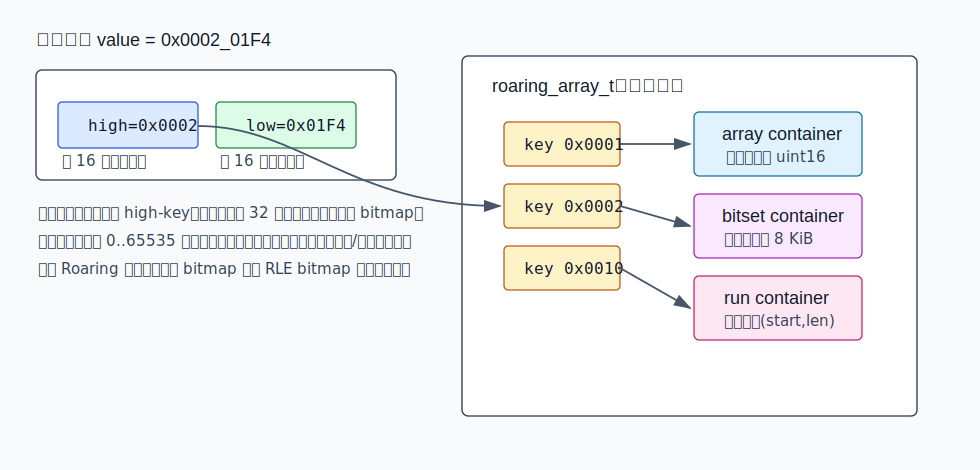
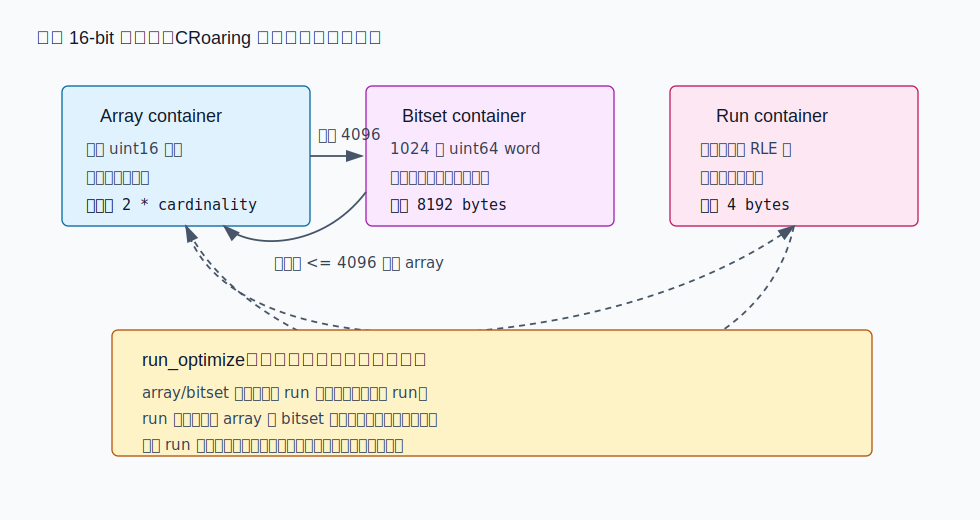
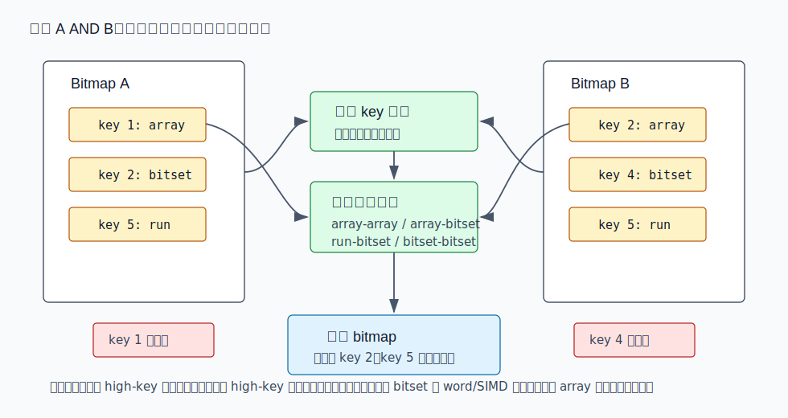
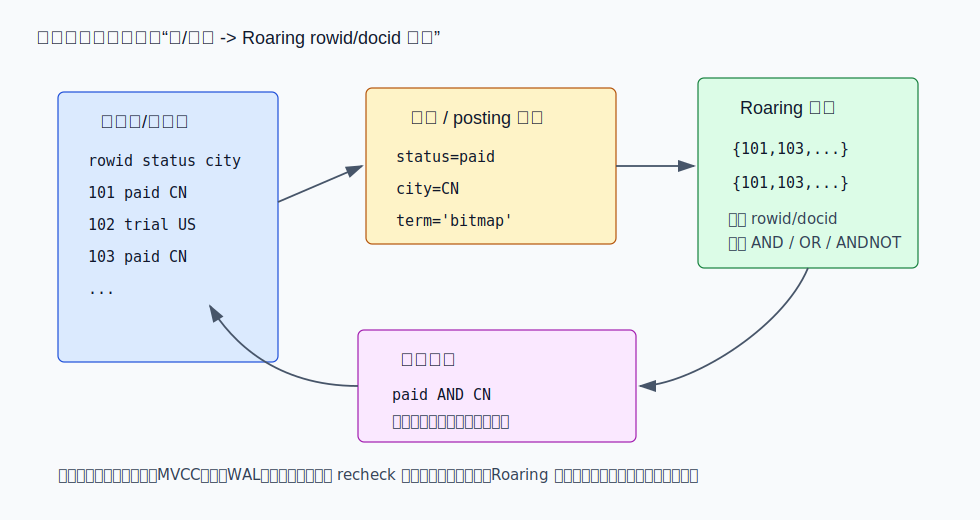
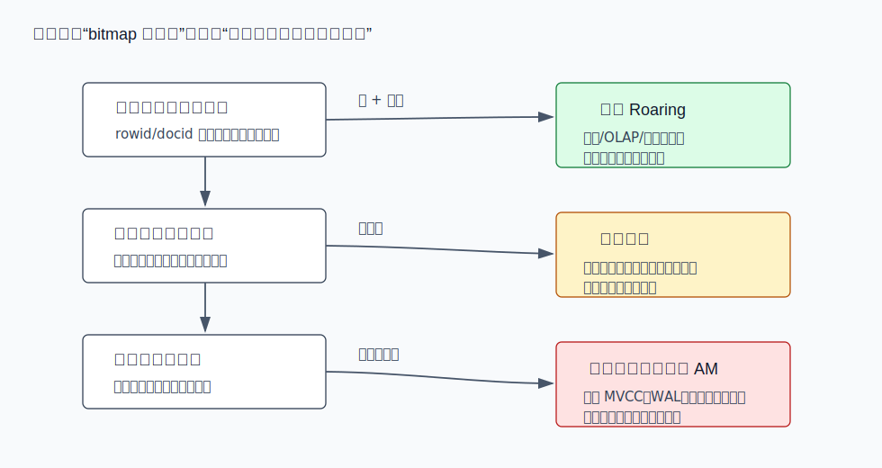

## 数据库筑基课 - roaring bitmap 索引结构
                                                                                            
### 作者                                                                
digoal                                                                
                                                                       
### 日期                                                                     
2026-05-26                                                      
                                                                    
### 标签                                                                  
PostgreSQL , 应用开发者 , DBA , 数据库筑基课 , 索引结构 , Roaring Bitmap , 倒排索引 , OLAP.   
                                                                                           
----                                                                    

## 背景

  
本节属于“索引结构”基础能力：理解一种索引结构如何把查询问题转化成集合问题，也理解它把代价转移到了哪里。当前工作区没有发现“数据库筑基课”总纲文件，因此本文先独立成篇。

业务上的典型场景是：一张行为明细表或搜索文档库有大量 `rowid/docid`，查询经常是 `city = 'CN' AND status = 'paid' AND tag IN (...)`。如果每个条件都能先变成一组整数集合，再用 CPU 做 `AND`、`OR`、`ANDNOT`，系统就可以在访问明细行之前把候选集合缩小。传统完整 bitmap 速度快，但一个 32 位空间如果直接铺满需要 2^32 个 bit，稀疏时浪费严重；传统 RLE bitmap 对长连续段很省，但随机分布、局部无序、高速交集时未必占优。

Roaring bitmap 的核心思路是：不要为整个值域选一种压缩方式，而是把 32 位整数空间切成 65536 个局部分片，每个分片独立选择最合适的容器。CRoaring 是 Roaring bitmap 的 C/C++ 高性能实现，项目 README 说明它面向数据库、搜索引擎和分析系统，目标是贴近现代硬件实现高性能压缩整数集合；DeepWiki 对 `RoaringBitmap/CRoaring` 的架构总结也把它归纳为 32-bit `roaring_array_t`、64-bit ART、三类容器、序列化和 SIMD/runtime dispatch 的组合。

本文讨论“roaring bitmap 索引结构”时，严格区分两层：

- **Roaring bitmap 本身**：一种压缩整数集合结构，提供 membership、迭代、rank/select、序列化、交并差等操作。
- **数据库索引系统中的 Roaring**：常作为 `value/term -> rowid/docid roaring set` 的 posting list 或 segment metadata，不自动等于一个完整数据库索引访问方法。MVCC、锁、WAL、代价估算、回表 recheck 仍要由数据库引擎承担。

## 一、它解决什么问题？

Roaring 解决的是“整数集合既要压缩，又要快”的矛盾。

普通 bitset 的好处是位运算极快：两个集合求交就是机器字按位与。但它有一个硬成本：空间随最大值域增长，而不是随实际元素数量增长。若只存 `{100, 1000000000}` 两个整数，完整 bitset 仍要覆盖巨大的空洞。

排序数组的好处是稀疏时省空间：每个 16 位值只要 2 字节，也容易迭代。但数组求交、求并需要比较和写结果；当局部集合很稠密时，数组会比固定 bitmap 更大、更慢。

RLE 的好处是连续值非常省，例如 `[100000, 200000]` 可以编码成一个 run。但如果值分布像随机采样，run 数量会膨胀；如果要和另一个集合做复杂交并差，也要处理段边界和分支。

Roaring 的做法是把一个大问题拆成很多小问题：

1. 高 16 位作为目录 key，定位一个局部容器。
2. 低 16 位放进该容器。
3. 容器按局部形态选择 array、bitset 或 run。
4. 集合运算先对齐目录 key，再对同 key 的容器执行类型专用算法。

代价是结构更复杂：需要维护目录、容器类型、转换阈值、序列化格式和跨容器操作矩阵。它不是“压缩版 bitset”这么简单，而是一个两级、自适应、硬件友好的整数集合索引结构。

## 二、它是什么？

Roaring bitmap 是一种分块压缩整数集合。对 32 位无符号整数：

- `high = value >> 16`：高 16 位，作为顶层目录 key。
- `low = value & 0xFFFF`：低 16 位，作为容器内值。
- 每个 high-key 最多对应一个容器，容器覆盖 `0..65535` 的局部空间。

CRoaring 的 32-bit 公共结构是：

```c
typedef struct roaring_bitmap_s {
    roaring_array_t high_low_container;
} roaring_bitmap_t;
```

`roaring_array_t` 保存 `size`、`containers`、`keys`、`typecodes` 等数组。也就是说，32-bit Roaring 的顶层不是哈希表，而是按 high-key 有序管理的一组容器指针。源码文件 [roaring_types.h](../CRoaring/include/roaring/roaring_types.h)、[roaring_array.h](../CRoaring/include/roaring/roaring_array.h)、[roaring.c](../CRoaring/src/roaring.c) 对应这一路径。



图 1 说明：Roaring 避免为整个 32 位空间分配完整 bitmap。只有出现过元素的 high-key 才有目录项；每个目录项下的低 16 位空间再独立选择 array、bitset 或 run 容器。

三类容器的含义：

- **array container**：排序 `uint16_t` 数组，适合稀疏分片。CRoaring 中 `DEFAULT_MAX_SIZE = 4096`，array 容器超过这个局部 cardinality 后通常转成 bitset。
- **bitset container**：固定 65536 bit，即 1024 个 `uint64_t`，序列化大小 8192 字节，适合稠密分片和批量位运算。
- **run container**：有序不重叠的 `(value, length)` 连续段，适合长连续区间。CRoaring 的 `rle16_t` 里 `length` 表示额外长度，因此一个 `{3,2}` 表示 `3,4,5`。

为什么 array 与 bitset 的阈值是 4096？一个 array 元素是 2 字节，4096 个元素约 8192 字节，正好等于一个 16-bit 分片的完整 bitset 大小。超过这个点后，bitset 通常不比 array 更占空间，并且集合运算更适合走机器字位运算。实际实现还要考虑分配容量、lazy 运算和 run 优化，但这个阈值解释了第一性原理。

## 三、核心原理

### 3.1 插入：先找 high-key，再改局部容器

`roaring_bitmap_add()` 的路径很直接：

1. 计算 `hb = val >> 16`。
2. 在 `roaring_array_t` 中通过 `ra_get_index()` 查 high-key。
3. 若目录项存在，取出容器和 typecode，调用 `container_add()`。
4. 若目录项不存在，先创建 array container，再插入目录。
5. 如果 `container_add()` 返回了新容器，比如 array 转 bitset，就替换目录项中的容器指针和 typecode。

这也是 Roaring 对局部性的利用：一次插入只影响一个 high-key 分片，不会重写全局结构。

### 3.2 容器转换：局部密度决定 array/bitset，连续性决定 run

CRoaring 的 `container_add()` 在 array 容器中尝试插入；如果 array 已无法在 `DEFAULT_MAX_SIZE` 内容纳，就通过 `bitset_container_from_array()` 转成 bitset，再设置新 bit。删除时，bitset 的 cardinality 降到 `DEFAULT_MAX_SIZE` 以下可以转回 array。run 容器的处理更谨慎：普通 add/remove 不会自动把 run 转成别的类型，空间优化主要由 `roaring_bitmap_run_optimize()` 触发。



图 2 说明：array/bitset 的边界主要来自局部 cardinality 和固定 bitset 大小；run 的边界来自“连续段数量是否足够少”。`convert_run_optimize()` 会比较 run、array、bitset 三种序列化空间，只有 run 更省时才保留或转换成 run。

源码中的关键判断：

- [array.h](../CRoaring/include/roaring/containers/array.h)：`DEFAULT_MAX_SIZE = 4096`。
- [bitset.h](../CRoaring/include/roaring/containers/bitset.h)：`BITSET_CONTAINER_SIZE_IN_WORDS = (1 << 16) / 64`。
- [containers.h](../CRoaring/include/roaring/containers/containers.h)：`container_add()` 和 `container_remove()` 处理 array/bitset 转换。
- [convert.c](../CRoaring/src/containers/convert.c)：`convert_run_to_efficient_container()` 和 `convert_run_optimize()` 按空间比较处理 run。

### 3.3 集合运算：目录级剪枝 + 容器级分派

两个 Roaring bitmap 求交时，不需要把所有整数解压出来。算法先按 high-key 对齐目录：

- 对交集，只有双方都有的 high-key 才需要进入容器运算。
- 对并集，一侧独有的 high-key 可以直接拷贝或共享。
- 对差集，只需要处理左侧 high-key，并在双方都有时执行容器差。

进入同一个 high-key 后，再按容器类型调用专用函数。例如：

- array-array：两个排序数组交集，可用线性 merge、galloping 或 SIMD 思路。
- array-bitset：遍历 array，查 bitset 中对应 bit。
- bitset-bitset：1024 个 64-bit word 做 `&`、`|`、`^`、`&~`，再计算 cardinality。
- run-array/run-bitset/run-run：按连续段边界处理。



图 3 说明：Roaring 的集合运算有两层剪枝。目录层跳过不可能命中的分片，容器层选择最适合局部表示的算法。这个结构解释了为什么它既能处理稀疏集合，也能处理局部稠密集合。

论文《SIMD Compression and the Intersection of Sorted Integers》证明了排序整数数组交集可以从 SIMD 受益，尤其是 posting list 场景；CRoaring 中 bitset 和 run 路径也包含 AVX2/AVX-512/NEON 或 runtime dispatch 相关实现。例如 [bitset.c](../CRoaring/src/containers/bitset.c) 对 bitset cardinality 使用 x64 AVX2/AVX-512 或 NEON 路径，[run.c](../CRoaring/src/containers/run.c) 对 run cardinality 和 run 展开有 AVX2 实现，[isadetection.c](../CRoaring/src/isadetection.c) 负责硬件能力检测。

注意一个工程细节：SIMD 不是永远更快。CRoaring 的 README 明确提到 AVX2 代码避免浮点和乘法，从而减少多核 Intel 上的 turbo frequency throttling 风险；AVX-512 只在较新硬件上启用。`run.c` 里也有注释指出，经验上 AVX-512 不总是快于 AVX2。

### 3.4 64-bit Roaring：高 48 位用 ART，低 16 位仍进容器

32-bit Roaring 用 high 16 位目录就够了，因为最多 65536 个容器。64-bit 空间如果照搬 high-key 数组会非常稀疏。CRoaring 的 `roaring64_bitmap_t` 使用 Adaptive Radix Tree（ART）管理高 48 位 key，低 16 位仍然放进 array/bitset/run 容器。

[roaring64.c](../CRoaring/src/roaring64.c) 中：

- `split_key()` 把 `uint64_t` 拆成 high 48 和 low 16。
- `combine_key()` 把 high 48 和 low 16 重新组合。
- `roaring64_bitmap_t` 内部有 `art_t art`、`containers` 指针数组，以及记录容器 index 和 typecode 的 leaf。

这说明 Roaring 的“容器内局部 16-bit 空间”是稳定核心；顶层目录可以根据值域大小替换实现。

### 3.5 序列化：portable 追求互通，frozen 追求快速映射

CRoaring 支持多种序列化：

- `roaring_bitmap_portable_serialize()`：面向 Java/Go 等实现互通，遵循 Roaring format spec。
- `roaring_bitmap_frozen_serialize()`：模仿 C 内存布局，面向快速反序列化和 frozen view，但格式不固定，且受大小端影响。
- 64-bit 也有 portable/frozen 对应 API。

对数据库或存储引擎来说，这一点很重要：如果 bitmap 要落盘并跨版本、跨语言读取，优先考虑 portable 格式；如果只是同一进程、同一平台上的 mmap 加速，可以评估 frozen，但要把版本、大小端、对齐和生命周期纳入边界。

## 四、横向对比

| 维度 | Roaring bitmap | 普通完整 bitmap | RLE/WAH/EWAH/Concise 类 bitmap | 排序数组 / posting list | B-tree / GIN 等数据库索引 |
|---|---|---|---|---|---|
| 主要目标 | 压缩整数集合，并保持快速交并差 | 极快位运算 | 压缩长 0/1 run | 稀疏集合、顺序迭代 | 完整数据库访问方法 |
| 数据组织 | high-key 目录 + array/bitset/run 容器 | 一个 bit 覆盖一个值 | 压缩字或 run | 有序整数列表 | page、tuple、WAL、锁、统计信息 |
| 稀疏空间 | 只为有值分片建容器 | 浪费大 | 取决于 run | 很省 | 取决于索引类型 |
| 稠密空间 | 局部转 bitset，固定 8 KiB/分片 | 很直接 | 如果没有长 run 未必好 | 数组膨胀 | 取决于 key/TID 数量 |
| 长连续段 | run container 省空间 | 不压缩 | 强项 | 可用区间压缩但非默认 | 不是核心目标 |
| 交并差 | 目录剪枝 + 容器专用算法 | 极快但空间大 | 受压缩字边界影响 | 稀疏时好，稠密时慢 | 通过执行器/访问方法组合 |
| 更新代价 | 单点更新影响一个容器，可能触发转换 | 直接改 bit | 中间改 run 可能昂贵 | 插入保持有序可能移动 | 有事务协议和维护成本 |
| 数据库语义 | 只表示集合 | 只表示集合 | 只表示集合 | 只表示集合 | 负责 MVCC、锁、恢复、优化器 |
| 适合场景 | 搜索/OLAP/列存元数据、权限集合、标签集合 | 小值域或固定值域 | 数据强聚集、长 run 很多 | 小集合、短生命周期 | 通用表访问和事务一致性 |
| 不适合场景 | 高频事务写、极小集合、要直接替代索引 AM | 大稀疏值域 | 随机稀疏分布 | 局部稠密大集合 | 只想要轻量内存集合 |

这张表的关键不是“Roaring 永远最快”，而是它把完整 bitmap、排序数组、RLE 的优点放进同一个两级结构中，并按局部分布切换。论文《Better bitmap performance with Roaring bitmaps》把 Roaring 与 WAH、Concise 等压缩 bitmap 比较，报告了在合成和真实数据上的压缩和交集性能优势；后续《Consistently faster and smaller compressed bitmaps with Roaring》加入 RLE segment 后，进一步处理了排序数据形成长 run 时原始 Roaring 不够省的问题。

## 五、效果如何？

可以把收益拆成四类。

第一，空间随“实际分片 + 局部密度”增长，而不是随全局最大值增长。一个只落在少数 high-key 的集合，只需要少数容器；每个容器再按稀疏、稠密、连续选择表示。

第二，集合运算利用 CPU 友好布局。bitset container 是连续 `uint64_t` words；array container 是连续 `uint16_t` 排序数组；run container 是连续 RLE pair。相比链式对象或散列结构，这些布局更容易被 cache 和 SIMD 利用。

第三，数据库查询可以先做候选集合组合，再访问明细行。搜索引擎、列存、OLAP 系统常把某个维度值、倒排词项、segment zone map 或权限条件映射成 rowid/docid 的 Roaring 集合。



图 4 说明：Roaring 通常位于“谓词命中的 rowid/docid 集合”这一层。它能让多个条件先在集合层相交或相并，但不替代数据库引擎对事务可见性、回表、recheck、代价估算的处理。

第四，序列化格式让不同语言实现可以互通。CRoaring README 指向 Roaring Format Spec，并说明 C++、Java、Go、Python 等实现可以通过统一格式交换 bitmap。

代价同样明确：

1. **写入不是免费**：单点 add/remove 可能导致 array/bitset 转换；run 优化也需要扫描和重编码。批量构建通常比高频随机改写更友好。
2. **小集合不一定值得**：几十个整数用排序数组、small vector 或普通 set 可能更简单。
3. **极端随机分布会削弱 run 优势**：此时主要靠 array/bitset 混合。
4. **不是有损结构**：Roaring 与 Bloom filter 不同，没有 false positive；但这也意味着它不能用误判换取更小空间。
5. **数据库落盘语义要额外设计**：如果要做真正索引 AM，需要处理并发、MVCC、崩溃恢复、统计信息、vacuum/compaction，而不是只把 CRoaring 嵌进去。

## 六、实操 DEMO

下面的 C 示例用于观察三类容器如何出现。它不是 SQL 示例，因为 Roaring 本身是库；在数据库中通常会被包装到扩展、索引、列存 segment metadata 或执行器内部。

```c
#include <inttypes.h>
#include <stdio.h>
#include <roaring/roaring.h>

static void print_stats(const char *name, const roaring_bitmap_t *rb) {
    roaring_statistics_t st;
    roaring_bitmap_statistics(rb, &st);
    printf("%s: card=%" PRIu64
           " containers=%u array=%u bitset=%u run=%u bytes=%zu\n",
           name,
           st.cardinality,
           st.n_containers,
           st.n_array_containers,
           st.n_bitset_containers,
           st.n_run_containers,
           roaring_bitmap_portable_size_in_bytes(rb));
}

int main(void) {
    roaring_bitmap_t *sparse = roaring_bitmap_create();
    roaring_bitmap_t *dense = roaring_bitmap_create();
    roaring_bitmap_t *runs = roaring_bitmap_create();

    for (uint32_t i = 0; i < 100; i++) {
        roaring_bitmap_add(sparse, i * 1000);
    }

    for (uint32_t i = 0; i < 5000; i++) {
        roaring_bitmap_add(dense, i);
    }

    for (uint32_t i = 100000; i < 180000; i++) {
        roaring_bitmap_add(runs, i);
    }
    print_stats("before run_optimize", runs);
    roaring_bitmap_run_optimize(runs);

    print_stats("sparse", sparse);
    print_stats("dense", dense);
    print_stats("runs", runs);

    roaring_bitmap_t *both = roaring_bitmap_and(dense, runs);
    print_stats("dense AND runs", both);

    roaring_bitmap_free(sparse);
    roaring_bitmap_free(dense);
    roaring_bitmap_free(runs);
    roaring_bitmap_free(both);
    return 0;
}
```

验证观察点：

- `sparse` 应主要是 array container，因为每个局部分片只有少量值。
- `dense` 在第一个 16-bit 分片内超过 4096 个值，应出现 bitset container。
- `runs` 在逐点插入连续值后通常先形成 bitset container；调用 `roaring_bitmap_run_optimize()` 后，应出现 run container，并显著降低 portable 序列化大小。
- `dense AND runs` 为空或很小，取决于两个集合的值域是否重叠。

本文已用当前 CRoaring 源码构建并执行同类示例；输出只用于验证容器行为，不作为性能 benchmark。真实性能必须用你的数据分布、CPU、编译选项、批量大小和查询组合实测，不能直接套论文数字。

如果要在数据库里做最小验证，建议从下面的模型开始：

```sql
-- 伪代码：具体函数名取决于数据库扩展或引擎实现
CREATE TABLE rb_posting (
    attr_name text,
    attr_value text,
    roaring_docids bytea,
    PRIMARY KEY (attr_name, attr_value)
);

-- 查询时：取出多个 roaring_docids，先在扩展函数中求交，再回表 docid。
SELECT count(*)
FROM documents d
JOIN LATERAL roaring_to_rows(
    roaring_and(
        (SELECT roaring_docids FROM rb_posting WHERE attr_name='city' AND attr_value='CN'),
        (SELECT roaring_docids FROM rb_posting WHERE attr_name='status' AND attr_value='paid')
    )
) AS hit(docid) ON hit.docid = d.docid;
```

这段 SQL 是建模示意，没有在本机数据库执行。真正产品化时还要解决 posting list 的增量维护、事务一致性、统计信息、压缩格式版本和回表成本估算。

## 七、最佳实践

**数据库架构师**

- 把 Roaring 放在“集合层”设计，而不是直接把它当成 B-tree 替代品。常见建模是 `值/词项 -> rowid/docid set`。
- 先按 workload 判断收益：是否有大量多条件组合，是否能在回表前显著缩小候选，是否读多写少。
- 对 64-bit rowid/docid，确认实现是直接使用 64-bit Roaring，还是做 segment id + local rowid 的两级拆分。后者常更利于局部性和序列化。
- 落盘时优先明确格式策略：跨语言、跨版本用 portable；同版本 mmap 加速才考虑 frozen。

**DBA**

- 监控 bitmap 的容器组成。array/bitset/run 比例变化，往往比单纯总大小更能解释性能波动。
- 批量装载后再构建或重写 bitmap，通常比逐行维护更稳定。
- 对持续更新的 posting list 设置合并策略。例如先写 delta，再周期性 merge 到主 Roaring，避免每次事务都改大对象。
- 评估内存峰值。多路 `OR` 或 lazy union 可能暂时保留较多 bitset container，`roaring_bitmap_repair_after_lazy()` 之后才修复 cardinality。

**业务开发者**

- 优先把 Roaring 用在 rowid/docid、用户 id、权限 id、标签集合这类整数集合上。
- 不要把极小集合强行 Roaring 化。短数组更简单，也可能更快。
- 写查询时让集合组合发生在回表前。先相交再 join 明细，通常比先 join 再过滤更可控。
- 保存代表性样本做 benchmark：稀疏、稠密、连续、随机、冷热数据都要覆盖。

## 八、适合与不适合场景

适合：

- 搜索引擎倒排索引中的 docid posting list。
- OLAP/列存引擎的 segment 内 rowid 集合、删除向量、zone/skip metadata。
- 用户画像、标签系统、权限系统中的大规模整数集合交并差。
- 数据分布局部性较强：同一 high-key 内可能稀疏、稠密或连续，适合自适应容器。
- 读多写少或批量更新，可以接受周期性 merge/optimize。

不适合：

- 高频 OLTP 单点更新，并要求每次更新都同步改大 bitmap。
- 集合极小，几十个整数就结束。
- 查询主要是有序范围扫描、排序、前缀匹配，而不是集合交并差。
- 需要完整数据库索引语义但没有实现 MVCC、锁、WAL、统计信息和 vacuum/compaction。
- 值域和数据分布已知很小，普通固定 bitset 更简单。



图 5 说明：Roaring 的第一判断是 workload。若主要瓶颈是多个大整数集合的交并差，并且更新可控，Roaring 很合适；若问题是事务索引、排序访问或小集合临时过滤，别把它用成万能索引。

## 九、常见坑

1. **把 Roaring 当成数据库索引 AM**  
   CRoaring 负责整数集合；数据库索引还需要处理事务可见性、锁、恢复、统计信息和执行器接口。

2. **只看总 cardinality，不看局部分布**  
   Roaring 的空间和速度取决于每个 high-key 分片内的密度和连续性。相同总 cardinality，不同分布可能得到完全不同的容器组成。

3. **忘记调用 run optimize**  
   逐点插入形成的连续值，如果希望压成 run container，需要评估并调用 `roaring_bitmap_run_optimize()`。部分 range API 可能直接构造 run，但不要把所有写入路径都假定成 run。

4. **把论文 benchmark 当成自己系统的 SLA**  
   论文报告的是特定数据集、实现和硬件条件下的结果。自己的查询组合、CPU 指令集、编译器、冷热缓存、序列化路径都会改变结果。

5. **滥用 frozen 格式**  
   frozen format 快，但与 C 内存布局和大小端有关，不适合作为长期、跨版本、跨语言交换格式。

6. **并发读写同一个 bitmap**  
   CRoaring README 说明库本身没有内置线程支持；一个线程修改 bitmap 时，其他线程查询同一对象是不安全的。需要复制、copy-on-write 或外部同步。

7. **对短生命周期小集合过度工程化**  
   如果集合只在一次函数调用内存在，元素也很少，排序数组或栈上 small vector 常常更简单。

## 十、扩展问题

1. 如果你的数据库已有执行期 TID bitmap，Roaring 应该放在执行器中间结构、索引 posting list，还是列存 segment metadata？三者的生命周期和一致性要求有什么不同？
2. 对一组持续增量写入的 posting list，应该直接更新主 Roaring，还是维护 delta + compact？什么时候触发 merge？
3. 64-bit id 是直接使用 `roaring64_bitmap_t`，还是拆成 shard/segment + 32-bit local id？这会如何影响压缩率、并发和落盘格式？
4. 如果一个查询需要 Top-N 排序，Roaring 先过滤候选后，排序代价是否仍是瓶颈？能否结合 WAND、Block-Max WAND 或列存 min/max？
5. 如何把 Roaring 的容器统计信息喂给优化器，让优化器知道一次集合交集大概会剩多少 rowid？

## 十一、扩展阅读

- CRoaring 本地源码：[README.md](../CRoaring/README.md)、[CLAUDE.md](../CRoaring/CLAUDE.md)、[roaring.h](../CRoaring/include/roaring/roaring.h)、[roaring.c](../CRoaring/src/roaring.c)、[roaring_array.h](../CRoaring/include/roaring/roaring_array.h)、[array.h](../CRoaring/include/roaring/containers/array.h)、[bitset.h](../CRoaring/include/roaring/containers/bitset.h)、[run.h](../CRoaring/include/roaring/containers/run.h)、[convert.c](../CRoaring/src/containers/convert.c)、[roaring64.c](../CRoaring/src/roaring64.c)。
- DeepWiki：`RoaringBitmap/CRoaring`，本次使用 `npx --yes @seflless/deepwiki ask RoaringBitmap/CRoaring ...` 获取架构概览，并用本地源码核验关键点。
- Roaring 官方论文列表：[Roaring Bitmaps publications](https://roaringbitmap.org/publications/)。
- Samy Chambi, Daniel Lemire, Owen Kaser, Robert Godin, [Better bitmap performance with Roaring bitmaps](https://arxiv.org/abs/1402.6407), Software: Practice and Experience, 2016。
- Daniel Lemire, Gregory Ssi-Yan-Kai, Owen Kaser, [Consistently faster and smaller compressed bitmaps with Roaring](https://arxiv.org/abs/1603.06549), Software: Practice and Experience, 2016。
- Daniel Lemire, Leonid Boytsov, Nathan Kurz, [SIMD Compression and the Intersection of Sorted Integers](https://arxiv.org/abs/1401.6399), Software: Practice and Experience, 2016。
- Daniel Lemire, Owen Kaser, Nathan Kurz 等，[Roaring Bitmaps: Implementation of an Optimized Software Library](https://arxiv.org/abs/1709.07821), Software: Practice and Experience, 2018。

---

## 验证记录

- 标题、分类、结构已按“数据库筑基课 - roaring bitmap 索引结构”整理。
- 本文主题归类为“索引结构 / 压缩整数集合结构”。
- 关键机制已对照 CRoaring 本地源码、README、DeepWiki 输出和 Roaring 论文摘要核验。
- Markdown 中引用的 SVG 均为独立文件，使用相对路径。
- C 示例已按当前 CRoaring API 编写；本文保存前执行了同类示例验证容器统计行为。
- SQL 示例为数据库建模示意，未在本机数据库执行，文中已标注。
  
## 附录  
  
1、问 gemini  
```  
roaring bitmap 索引结构相关的论文、开源项目.
```  
  
2、克隆代码  
```  
git clone --depth 1 https://github.com/RoaringBitmap/CRoaring
```  
  
3、启用 codex, 使用 [数据库筑基课 skill](../skills/README.md).  
````
文章标题: 
  数据库筑基课 - roaring bitmap 索引结构
项目源码(已克隆到当前项目如下目录中):  
  CRoaring
论文: 
  Better bitmap performance with Roaring bitmaps
  Consistently Faster Bitmaps: Roaring Bitmaps
  Osiand and Lemire: Vectorized Intersection of Sorted Arrays via SIMD Instructions
项目 deepwiki reponame:  
  RoaringBitmap/CRoaring
项目参考信息: 
  CRoaring/CLAUDE.md
````
   
  
#### [PostgreSQL 解决方案集合](../201706/20170601_02.md "40cff096e9ed7122c512b35d8561d9c8")
  
  
#### [德哥 / digoal's Github - 公益是一辈子的事.](https://github.com/digoal/blog/blob/master/README.md "22709685feb7cab07d30f30387f0a9ae")
  
  
#### [About 德哥](https://github.com/digoal/blog/blob/master/me/readme.md "a37735981e7704886ffd590565582dd0")
  
  

  
