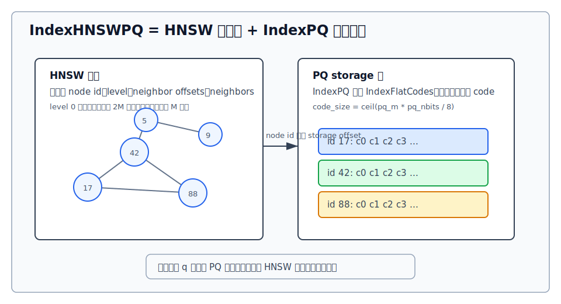
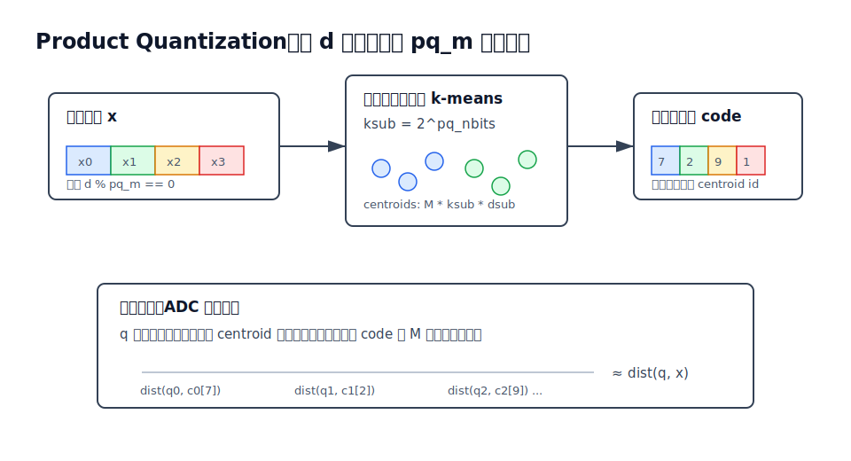
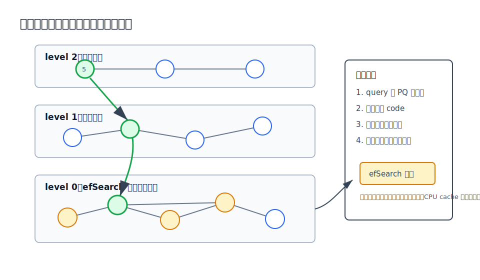
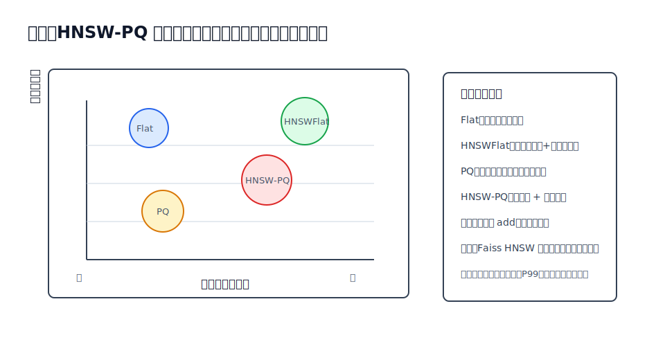

## 数据库筑基课 - hnsw-pq 索引结构
                                                                                            
### 作者                                                                
digoal                                                                
                                                                       
### 日期                                                                     
2026-05-26                                                      
                                                                    
### 标签                                                                  
PostgreSQL , 应用开发者 , DBA , 数据库筑基课 , 索引结构 , 向量检索 , HNSW , PQ , Faiss  
                                                                                           
----                                                                    

## 背景

  

本节属于“索引结构”基础能力。当前工作区没有发现“数据库筑基课”总纲文件，因此本文先独立成篇。

向量检索系统里最朴素的问题是：Embedding 越来越多，维度越来越高，业务又要求低延迟召回。比如 1 亿条 768 维 `float32` 向量，光原始向量就约 286GB，还没算主键、元数据、索引边、缓存和副本。直接全量算距离准确，但延迟和内存都很难接受。

HNSW-PQ 把问题拆成两层：

- HNSW 负责“少看点”：用可导航小世界图把候选空间缩小。
- PQ 负责“少存点、算轻点”：把原始向量压成短 code，用查表距离近似原距离。

这不是免费的午餐。它用召回率、距离误差、构建时间、图边内存、更新复杂度，换取更低的向量存储成本和更快的近似检索。

本文以两篇经典论文为理论主线：Jégou、Douze、Schmid 的 Product Quantization for Nearest Neighbor Search，以及 Malkov、Yashunin 的 HNSW 论文；工程实现以本地 `faiss` 源码和 DeepWiki `facebookresearch/faiss` 为依据。

## 一、它解决什么问题？

精确 KNN 的基本代价是 `O(N * d)`：每个查询都要和 N 个 d 维向量算距离。数据库工程里，这相当于“没有选择性过滤条件的全表扫描”，只是扫描对象从行变成了向量。

常见优化可以从三个方向入手：

1. 减少候选数：IVF、HNSW、NSG 等索引负责把搜索限制在一小部分候选上。
2. 减少单个向量的存储：PQ、SQ、二值量化、半精度等压缩原始向量。
3. 减少距离计算成本：预计算查表、SIMD、GPU、批量化、重排候选。

HNSW-PQ 组合的是第 1 和第 2/3 类能力。它把“在所有原始向量上精确算距离”变成“沿 HNSW 图访问少量节点，并对这些节点的 PQ code 做近似距离打分”。

牺牲也很明确：

- HNSW 图本身要保存邻接边，内存不会只剩 PQ code。
- PQ code 引入量化误差，候选排序可能错。
- HNSW 是近似图搜索，`efSearch` 不够时可能走不到真近邻。
- 构建需要先训练 PQ，再插入向量并维护图边。
- 高频原地更新、删除、事务可见性，不是 Faiss HNSW-PQ 这类库的强项，需要数据库层另做 segment、delete bitmap、后台重建或版本管理。

## 二、它是什么？

一句话定义：HNSW-PQ 是“用 HNSW 图做候选导航、用 PQ 压缩码保存向量并近似计算距离”的 ANN 索引结构。

在 Faiss 里，这个组合非常直接：

- `IndexHNSW` 是外层索引，成员里有 `HNSW hnsw` 和 `Index* storage`。
- `HNSW` 只保存图结构：`levels`、`offsets`、`neighbors`、`entry_point`、`max_level`、`efConstruction`、`efSearch`。
- `IndexHNSWPQ` 继承 `IndexHNSW`，构造函数把 `storage` 设置为 `new IndexPQ(...)`。
- `IndexPQ` 继承 `IndexFlatCodes`，真实存储是连续的 `codes` 数组，每条向量是一个定长 PQ code。



图 1 说明：HNSW 节点 id 与 storage 中的 code offset 对齐。图边不保存向量值，PQ storage 不知道图怎么走；查询时由 `DistanceComputer` 把 query 和候选 id 对应的 code 连接起来。

几个术语先统一：

- **M / hnsw_M**：HNSW 每层邻居规模参数。Faiss 默认 level 0 最多 `2 * M` 条边，上层最多 `M` 条边。
- **efConstruction**：构建时搜索候选的宽度，越大图质量通常越好，构建越慢。
- **efSearch**：查询时候选扩展宽度，越大召回通常越高，延迟越高。
- **pq_m**：PQ 子量化器数量，也就是把 d 维向量拆成多少段。
- **pq_nbits**：每段 code 的 bit 数，`ksub = 2^pq_nbits`。
- **code_size**：每个向量的压缩码字节数，Faiss 源码里是 `ceil(pq_m * pq_nbits / 8)`。
- **ADC**：Asymmetric Distance Computation，query 仍用原始 float，库向量用 PQ code，通过查表累加近似距离。
- **SDC**：Symmetric Distance Computation，query 和库向量都用 code，Faiss 在 HNSW-PQ 构建邻接边时会用到 code-code 距离表。

## 三、核心原理

### 3.1 PQ：把向量空间拆成多个小码本

PQ 的基本假设是：高维向量可以切成多个低维子向量，每个子空间独立训练一个小码本。数据库向量不再保存原始 `float32[d]`，而是保存每个子空间最近 centroid 的编号。

假设 `d = 768`、`pq_m = 96`、`pq_nbits = 8`：

- 每个子向量 `dsub = 8` 维。
- 每个子空间有 `ksub = 256` 个 centroid。
- 每条向量 code 大小是 `96 * 8 / 8 = 96` 字节。
- 原始 float 向量是 `768 * 4 = 3072` 字节。

这只是向量编码本身的压缩比，不能等同于整个索引压缩比，因为 HNSW 图边、id、元数据、码本、SDC 表还要占空间。



图 2 说明：PQ 的读路径不是先把每个候选完整解码再算距离。典型 ADC 做法是先为 query 计算 `pq_m * ksub` 的距离表，然后每访问一个 code，就按每段 code 查表并累加。

Faiss 源码对应关系：

- `faiss/impl/ProductQuantizer.cpp` 的 `set_derived_values()` 检查 `d % M == 0`，计算 `dsub`、`ksub`、`code_size`。
- `ProductQuantizer::train()` 对每个子空间运行 k-means。
- `ProductQuantizer::compute_codes()` 把原始向量编码成 PQ code。
- `ProductQuantizer::compute_distance_table()` 和 `search()` 支持 query 到 code 的查表距离。
- `faiss/IndexPQ.cpp` 中 `IndexPQ::sa_encode()` 调用 `pq.compute_codes()`，`IndexFlatCodes::add()` 负责把 code 追加进连续数组。

### 3.2 HNSW：用分层图减少候选

HNSW 的核心是分层可导航图。每个点随机获得一个最高层级，层级概率指数衰减；上层点少、边长，适合快速接近目标区域；底层点全、边密，负责精细搜索。

构建时，新点从当前 `entry_point` 开始：

1. 在高于自身最高层的层上做贪心搜索，只更新最近入口。
2. 到达需要插入的层后，搜索一批候选邻居。
3. 用启发式裁剪邻居列表，避免只连向同一小簇。
4. 写入双向边；如果邻居列表满，重新裁剪。

Faiss 的 `HNSW::set_default_probas()` 会设置层级概率，并把 level 0 的邻居容量设为 `2 * M`，上层设为 `M`。`HNSW::add_with_locks()` 负责从高层贪心下降，并逐层调用 `add_links_starting_from()` 建边。

### 3.3 HNSW-PQ：构建时用 PQ code 参与图结构选择

`IndexHNSWPQ` 的训练和插入路径可以拆成：

1. `IndexHNSWPQ::train()` 调用 `IndexHNSW::train()`。
2. `IndexHNSW::train()` 训练下层 `storage`，这里就是 `IndexPQ::train()`。
3. `IndexHNSWPQ::train()` 之后调用 `ProductQuantizer::compute_sdc_table()`。
4. `IndexHNSW::add()` 先调用 `storage->add(n, x)`，也就是把向量编码成 PQ code。
5. 再调用 `hnsw_add_vertices()`，用 storage 的 `DistanceComputer` 给候选打分并维护图边。

这里有一个容易忽略的点：HNSW 建图不是拿原始向量精确距离选边，而是通过 `IndexPQ` 的距离计算器在压缩表示上比较。`PQDistanceComputer::symmetric_dis()` 依赖 `sdc_table`，所以 `IndexHNSWPQ::train()` 里预计算 SDC 表不是装饰，而是建图距离所需的基础设施。

### 3.4 查询：HNSW 负责走图，PQ 负责打分

查询路径和构建路径类似，但 query 本身仍是原始 float：

1. `IndexHNSW::search()` 建结果堆。
2. `hnsw_search()` 为每个 query 创建 `storage_distance_computer(index->storage)`。
3. `DistanceComputer::set_query()` 对 PQ 来说会预计算 query 到每个子码本 centroid 的距离表。
4. `HNSW::search()` 从入口点开始，高层贪心下降。
5. 到 level 0 后，`search_from_candidates()` 扩展候选邻居，并用 `qdis(v1)` 对候选 code 做 ADC 近似距离。
6. `efSearch` 控制候选扩展宽度，结果堆返回 top-k。



图 3 说明：HNSW 的速度来自“少访问候选”，PQ 的速度和省内存来自“每个候选只访问短 code 并查表累加”。二者的误差会叠加：图可能没走到真近邻，PQ 也可能把候选距离排错。

### 3.5 序列化与恢复：图和 storage 分开写

Faiss 写索引时会识别 `IndexHNSWPQ` 并写入 FourCC `IHNp`。读取时遇到 `IHNp` 会创建 `IndexHNSWPQ`，先读 HNSW 图，再读 storage，并检查 storage 的 `ntotal` 和 `d` 与外层索引一致。

源码还处理了 SDC 表的恢复：读取 `IHNp` 后，如果没有设置 `IO_FLAG_PQ_SKIP_SDC_TABLE`，会对 storage 的 `IndexPQ` 重新调用 `pq.compute_sdc_table()`。本地测试 `tests/test_disable_pq_sdc_tables.cpp` 专门验证了带 `IO_FLAG_PQ_SKIP_SDC_TABLE` 读取时 SDC 表为空。

这说明 HNSW-PQ 的持久化不是“一个扁平文件里只有 code”。它至少包含：

- `IndexHNSW` 头信息。
- HNSW 图结构。
- 下层 `IndexPQ` 的 PQ 码本、code 数组和索引头。
- 可重建或可跳过的 SDC 表。

## 四、横向对比

| 维度 | HNSW-PQ | HNSW-Flat | IVF-PQ | Flat / Exact |
|---|---|---|---|---|
| 主要目标 | 图导航 + 压缩存储 | 高召回、低延迟图搜索 | 聚类分桶 + 压缩扫描 | 精确基线 |
| 候选选择 | 沿 HNSW 边扩展 | 沿 HNSW 边扩展 | 先选 nprobe 个倒排桶 | 全量扫描 |
| 向量存储 | PQ code | 原始 float 或指定 storage | PQ code，常按倒排桶存 | 原始 float |
| 距离误差 | 图近似 + PQ 量化误差 | 主要是图近似 | 粗量化遗漏 + PQ 量化误差 | 无近似误差 |
| 内存结构 | code + 图边 + 码本/表 | 原始向量 + 图边 | code + list id + 码本，通常无 HNSW 边 | 原始向量 |
| 写入代价 | 训练后可 add，但要编码并更新图 | 可 add，要更新图 | 训练后 add 到桶，通常更适合批量 | 追加简单 |
| 删除/更新 | 不适合高频原地删改，常靠外层治理 | 同左 | segment/delete bitmap/重建更常见 | 删除取决于外层系统 |
| 适合场景 | 内存紧张、召回可调、读多写少 | 内存充足、追求高召回低延迟 | 超大规模批量检索、可接受桶参数调优 | 小数据、评估基线、重排阶段 |
| 不适合场景 | 强事务、高频更新、必须精确排序 | 内存预算紧张 | 数据分布强漂移、nprobe 难调 | 大规模低延迟在线召回 |

差异背后的关键是“候选生成”和“候选打分”分离。HNSW-Flat 和 HNSW-PQ 的候选生成方式类似，但打分对象不同；IVF-PQ 和 HNSW-PQ 都用 PQ code，但候选生成一个靠聚类桶，一个靠图导航。



图 4 说明：HNSW-PQ 位于 HNSW-Flat 和纯 PQ/IVF-PQ 之间。它通常比 HNSW-Flat 省向量存储，但不会像纯 PQ 那样没有图边成本；它通常比纯 PQ 更会“主动找候选”，但要承担图构建和维护代价。

## 五、效果如何？

不要脱离数据集谈固定性能数字。HNSW-PQ 的收益和代价主要由这些量决定：

- **向量存储压缩**：从 `4 * d` 字节降到 `ceil(pq_m * pq_nbits / 8)` 字节。例如 `d=768,pq_m=96,pq_nbits=8` 时，单向量编码从 3072 字节降到 96 字节。
- **图边开销**：Faiss `HNSW::storage_idx_t` 是 `int32_t`，邻接表保存在 `neighbors` 里；level 0 默认容量 `2M`，上层容量 `M`，实际层级随机分布。工程估算时不能只看 PQ code。
- **码本开销**：PQ centroid 表大小约 `pq_m * 2^pq_nbits * dsub * 4` 字节，通常小于数据区，但 `pq_nbits` 增大时会快速增长。
- **SDC 表开销**：`ProductQuantizer::compute_sdc_table()` 分配 `pq_m * ksub * ksub` 个 float。`pq_nbits=8` 时每个子量化器是 `256 * 256 * 4 = 256KB`，`pq_m=96` 时约 24MB。
- **查询 CPU**：每个 query 要先算 `pq_m * ksub` 距离表，然后对访问到的候选 code 查表累加。`efSearch` 越大，候选访问和跳边越多。
- **召回率**：受 HNSW 图质量、`efSearch`、PQ 量化误差、向量分布、距离度量影响。
- **构建时间**：PQ 训练需要 k-means；HNSW add 需要在图上搜索和建边，`efConstruction` 越大越慢。

可以用一个粗略内存框架做容量预算：

```text
HNSW-PQ index memory
≈ N * code_size
  + N * average_graph_edges * sizeof(storage_idx_t)
  + HNSW offsets/levels
  + PQ centroids
  + optional SDC table
  + allocator/vector overhead
```

这个公式故意不写成精确值，因为不同实现会有 id、padding、vector capacity、序列化/运行时结构差异。做数据库容量规划时，应该用目标参数真实构建样本索引，再用进程 RSS、序列化文件大小和 recall/latency 一起评估。

## 六、实操 DEMO

下面是最小 Faiss Python 示例，演示如何构建 `HNSW8,PQ4np`。`np` 表示关闭 polysemous training；这和 Faiss factory 源码中 `PQ...np` 对 `do_polysemous_training` 的处理一致。

```python
import numpy as np
import faiss

d = 32
nt = 2000
nb = 10000
nq = 5
k = 5

rng = np.random.default_rng(123)
xt = rng.random((nt, d), dtype=np.float32)
xb = rng.random((nb, d), dtype=np.float32)
xq = rng.random((nq, d), dtype=np.float32)

index = faiss.index_factory(d, "HNSW8,PQ4np", faiss.METRIC_L2)
index.train(xt)
index.add(xb)

index.hnsw.efSearch = 32
D, I = index.search(xq, k)

storage = faiss.downcast_index(index.storage)
print("ntotal:", index.ntotal)
print("code_size:", storage.sa_code_size())
print("level0_neighbors:", index.hnsw.nb_neighbors(0))
print("level1_neighbors:", index.hnsw.nb_neighbors(1))
print("first_query_ids:", I[0].tolist())
print("first_query_distances:", D[0].tolist())
```

本环境尝试执行时，`python3` 导入的是工作区源码目录 `/Users/digoal/new/faiss` 形成的 namespace module，不是编译后的 Faiss Python 绑定，因此缺少 `index_factory`，无法得到真实输出。上面的代码是按 Faiss Python API 写的可运行示例，但本文不编造执行结果。

如果要在数据库侧复现实验，建议按下面指标记录，而不是只看 top-k 输出：

```text
dataset: 向量数量、维度、是否归一化、距离度量
index: HNSW M、efConstruction、pq_m、pq_nbits、是否 np
search: efSearch、k、并发数、是否批量查询
quality: recall@k，以 Flat 精确结果为基线
latency: p50、p95、p99、CPU 使用率、内存 RSS
storage: 序列化文件大小、常驻内存、构建峰值内存
maintenance: train 时间、add 吞吐、重建时间
```

## 七、最佳实践

面向数据库架构师：

- 先把 HNSW-PQ 定位为“读多写少的召回索引”，不要把它当成支持强事务和高频更新的 B-tree。
- 容量规划要同时算 PQ code 和 HNSW 图边。只用 PQ 压缩比估内存，会系统性低估。
- 保留精确重排通道：HNSW-PQ 适合召回候选，最终排序可以对 top-R 候选取原始向量或更高精度向量重排。
- 将 delete bitmap、segment compaction、后台重建纳入架构。Faiss 的 `IndexHNSW` 路径不是数据库 MVCC 索引。

面向 DBA：

- 用 recall@k 和 P99 一起调 `efSearch`。只看平均延迟会掩盖图搜索尾部问题。
- 用样本训练 PQ 时要覆盖线上分布；Embedding 模型升级或数据分布漂移后，旧码本可能明显变差。
- 监控构建峰值内存。PQ 训练、SDC 表、HNSW 构建候选都会产生额外内存。
- 序列化和恢复后做一致性 smoke test，尤其关注 `IO_FLAG_PQ_SKIP_SDC_TABLE` 这类会影响 SDC 表的读取参数。

面向业务开发者：

- 不要把 ANN 返回距离当成可跨索引、跨模型、跨参数稳定比较的业务分数。
- 写入路径要接受“先进入新 segment，后台建索引/合并”的延迟，而不是要求每条写入立即进入全局最优图。
- 查询参数要绑定业务目标：推荐召回、RAG 召回、去重、风控相似案例，对 recall 和延迟的容忍度不同。
- 对关键链路保留降级：小数据或低并发时 Flat 可能足够；高精度场景可以 ANN 召回后精排。

## 八、适合与不适合场景

适合：

- 百万到十亿级向量，内存预算明显不足以保存 HNSW-Flat。
- 读多写少，允许批量构建、周期重建或 segment 合并。
- 业务接受近似召回，并可通过 `efSearch`、重排和离线评测控制质量。
- 向量分布相对稳定，PQ 码本不会频繁失效。
- 候选召回比精确排序更重要，例如 RAG 初筛、推荐候选生成、相似图片/文本初召。

不适合：

- 必须精确 top-k，不能接受量化误差和图近似。
- 高频 update/delete，并要求单条变更立即对所有查询强一致可见。
- 数据量不大，Flat 或 HNSW-Flat 已经满足成本和延迟。
- 向量模型频繁变更，导致全量重编码和重建成本不可接受。
- 业务距离阈值有强语义，不能接受 PQ 近似距离漂移。

## 九、常见坑

1. **只算 PQ 压缩比，不算图边。**  
   HNSW-PQ 不是纯压缩数组。图边、层级、offset、SDC 表都会吃内存。

2. **训练样本太少或不代表线上分布。**  
   PQ 码本由训练数据决定。样本偏了，距离误差会直接进入排序。

3. **把 `efSearch` 当成固定推荐值。**  
   `efSearch` 是召回和延迟旋钮，不同数据集、k、并发、CPU cache 行为都不同。

4. **忽略构建距离也是近似的。**  
   在 Faiss `IndexHNSWPQ` 中，add 阶段图边选择依赖 PQ storage 的距离计算器和 SDC 表；图质量本身也受量化误差影响。

5. **误以为 HNSW-PQ 自动适合数据库事务更新。**  
   Faiss 是向量检索库，不是事务数据库索引管理器。数据库产品要额外处理 MVCC、删除、segment、WAL、恢复、compaction。

6. **没有 Flat 基线。**  
   召回率必须以精确搜索结果为基线。没有 Flat 或高精度重排基线，就无法判断参数调优是在变好还是变快但变差。

7. **距离度量和向量归一化混用。**  
   L2、内积、cosine 的语义不同。cosine 常通过归一化后内积实现，索引和训练数据要保持一致。

8. **忽略序列化恢复后的辅助表。**  
   SDC 表可以恢复时重建，也可以用 flag 跳过。跳过后如果后续路径需要 code-code 距离，会踩到实现边界。

## 十、扩展问题

1. 如果把 HNSW-PQ 放进 PostgreSQL 扩展，delete bitmap、VACUUM、WAL、crash recovery 应该放在哪一层？
2. 对 RAG 场景，应该用 HNSW-PQ 直接返回 top-k，还是返回 top-R 后用原始向量和 reranker 重排？
3. IVF-PQ 与 HNSW-PQ 都能降低候选数和向量存储，它们在数据分布漂移、增量写入、冷热分层上的取舍有什么不同？
4. PQ 的 `pq_m`、`pq_nbits` 与 Embedding 维度、语义损失之间如何建立实验矩阵？
5. 如果内存足够保存 HNSW-Flat，但 P99 不稳定，瓶颈可能是图跳转 cache miss、距离计算、并发锁，还是语言绑定开销？
6. 对多租户向量库，应该每个租户单独训练 PQ，还是共享码本并用元数据过滤？

## 十一、扩展阅读

- Hervé Jégou, Matthijs Douze, Cordelia Schmid, Product Quantization for Nearest Neighbor Search, IEEE TPAMI 2011. 搜索入口：[dblp](https://dblp.org/rec/journals/pami/JegouDS11)。
- Yu. A. Malkov, D. A. Yashunin, Efficient and robust approximate nearest neighbor search using Hierarchical Navigable Small World graphs. 论文入口：[arXiv:1603.09320](https://arxiv.org/abs/1603.09320)。
- Faiss C++ API: [`faiss::IndexHNSWPQ`](https://faiss.ai/cpp_api/struct/structfaiss_1_1IndexHNSWPQ.html)。
- Faiss Wiki: [Faiss indexes](https://github.com/facebookresearch/faiss/wiki/Faiss-indexes)。
- DeepWiki: `facebookresearch/faiss` 关于 graph-based indexes 和 `IndexHNSWPQ` 的说明，用于架构梳理，关键结论已回查本地源码。
- 本地源码：`faiss/faiss/IndexHNSW.h`，`faiss/faiss/IndexHNSW.cpp`。
- 本地源码：`faiss/faiss/impl/HNSW.h`，`faiss/faiss/impl/HNSW.cpp`。
- 本地源码：`faiss/faiss/IndexPQ.h`，`faiss/faiss/IndexPQ.cpp`。
- 本地源码：`faiss/faiss/impl/ProductQuantizer.h`，`faiss/faiss/impl/ProductQuantizer.cpp`。
- 本地源码：`faiss/faiss/impl/pq_code_distance/PQDistanceComputer_impl.h`。
- 本地源码：`faiss/faiss/index_factory.cpp`，`faiss/faiss/impl/index_write.cpp`，`faiss/faiss/impl/index_read.cpp`。
- 本地测试：`faiss/tests/test_factory.py`，`faiss/tests/test_graph_based.py`，`faiss/tests/test_disable_pq_sdc_tables.cpp`。
- 项目参考：`faiss/CLAUDE.md`。
  
## 附录  
  
1、问 gemini  
```  
hnsw-pq 索引结构相关的论文、开源项目.
```  
  
2、克隆代码  
```  
git clone --depth 1 https://github.com/facebookresearch/faiss
```  
  
3、启用 codex, 使用 [数据库筑基课 skill](../skills/README.md).  
````
文章标题: 
  数据库筑基课 - hnsw-pq 索引结构
项目源码(已克隆到当前项目如下目录中):  
  faiss
论文: 
  Product Quantization for Nearest Neighbor Search
  Efficient and robust approximate nearest neighbor search using Hierarchical Navigable Small World graphs
项目 deepwiki reponame:  
  facebookresearch/faiss
项目参考信息: 
  faiss/CLAUDE.md
````
  
  
#### [PostgreSQL 解决方案集合](../201706/20170601_02.md "40cff096e9ed7122c512b35d8561d9c8")
  
  
#### [德哥 / digoal's Github - 公益是一辈子的事.](https://github.com/digoal/blog/blob/master/README.md "22709685feb7cab07d30f30387f0a9ae")
  
  
#### [About 德哥](https://github.com/digoal/blog/blob/master/me/readme.md "a37735981e7704886ffd590565582dd0")
  
  

  
