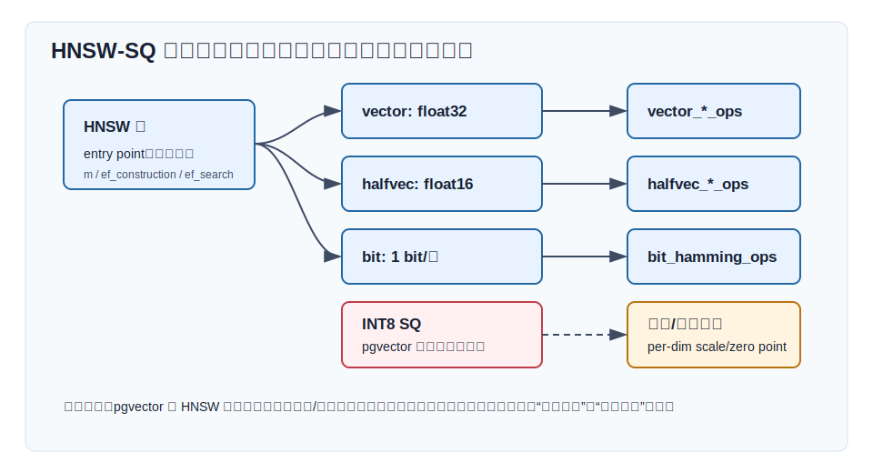
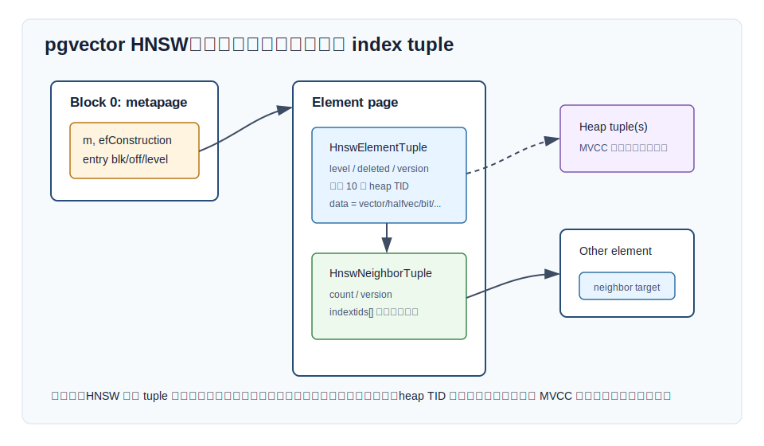
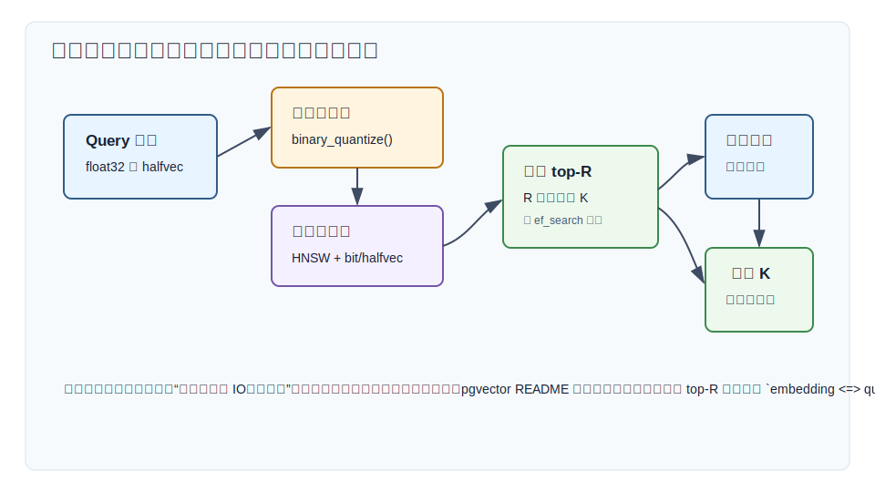
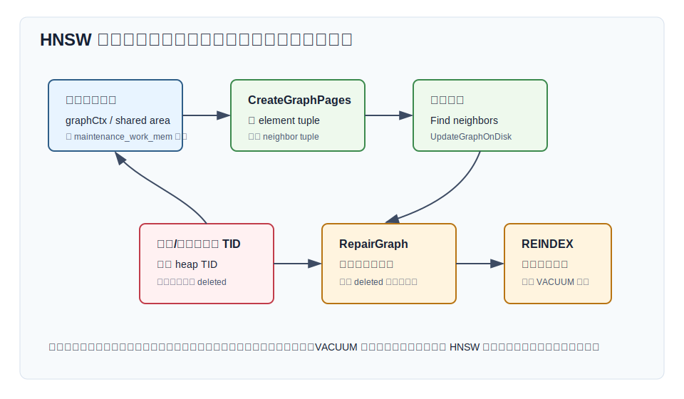
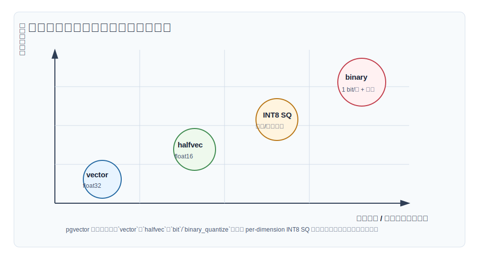

## 数据库筑基课 - hnsw-sq 索引结构
                                                                                            
### 作者                                                                
digoal                                                                
                                                                       
### 日期                                                                     
2026-05-26                                                      
                                                                    
### 标签                                                                  
PostgreSQL , 应用开发者 , DBA , 数据库筑基课 , 索引结构 , 向量检索 , HNSW , SQ , pgvector  
                                                                                           
----                                                                    

## 背景
  


本节属于“索引结构”基础能力。当前工作区没有发现“数据库筑基课”总纲文件，因此本文先独立成篇。

向量检索的核心矛盾很朴素：Embedding 越来越大，业务却希望搜索越来越快、成本越来越低。以 1 亿条 768 维 `float32` 向量为例，原始向量约 286GB；如果再加 HNSW 图边、行标识、MVCC、索引页、缓存和副本，工作集很快会超过单机内存。此时只说“用 HNSW”是不够的，因为 HNSW 解决的是“少访问多少节点”，不直接解决“每个节点多大”。

所谓 HNSW-SQ，可以从两个层面理解：

- **算法层**：HNSW 负责候选导航；SQ（Scalar Quantization，标量量化）把每个维度从浮点数压成低 bit 表示，降低内存带宽和距离计算成本。
- **pgvector 工程层**：pgvector 当前没有一个叫 `hnsw_sq_ops` 或 INT8 SQ 的独立索引类型。它能直接落地的是 `halfvec` 半精度 HNSW、`bit` HNSW，以及通过 `binary_quantize()` 做表达式索引后再重排的二值量化路径。

这篇文章的重点不是把“SQ”泛化成营销词，而是把边界讲清楚：HNSW 的图结构是什么，低精度向量表示改变了什么，pgvector 源码实际支持什么，以及上线时怎样验证召回、延迟、内存和维护成本。

主要参考材料包括：本地 `pgvector` 源码与 `README.md`，DeepWiki `pgvector/pgvector`，Malkov 和 Yashunin 的 HNSW 论文，Jacob 等人的 integer-only quantization 论文，以及向量数据库查询处理综述。用户给出的 *A Survey on Inverted Indices for Vector Search and Quantization Strategies* 未检索到稳定的同名公开入口，因此本文不把它作为已核验来源；相关 IVF/量化背景改用可访问论文和 pgvector 源码交叉说明。

## 一、它解决什么问题？

精确向量搜索要对候选集合逐个计算距离。全表精确 KNN 的代价近似是：

```text
distance_work = N * d * cost_per_dimension
memory_read   = N * bytes_per_vector
```

HNSW 把第一项的 `N` 变小：不扫描全部向量，而是沿多层近邻图访问一批候选。SQ 或低精度表示把第二项的 `bytes_per_vector` 变小：每个候选的向量数据更短，更容易留在内存和 CPU cache 里。

在数据库里，这个问题还要多看三层：

1. **索引页空间**：HNSW 节点除了向量值，还要保存层级、版本、heap TID、邻接边。
2. **执行器语义**：PostgreSQL 仍要处理 MVCC 可见性、过滤条件、排序、LIMIT。
3. **维护成本**：插入要更新图，删除和更新留下的死 TID 要靠 VACUUM/REINDEX 治理。

因此 HNSW-SQ 解决的是“向量召回阶段的候选访问成本和内存工作集”问题，不解决所有检索问题。它付出的代价也明确：

- HNSW 是近似搜索，`ef_search` 太小会漏掉真近邻。
- 量化会引入表示误差，候选距离排序可能改变。
- 二值量化尤其激进，通常要扩大召回 top-R 后用原始向量重排。
- 图边和维护元数据不会因为量化而消失。
- pgvector 当前的 SQL 能力不是完整 INT8 SQ；不能把其他系统的 SQ 指标直接套到 pgvector。

## 二、它是什么？

一句话定义：HNSW-SQ 是“用 HNSW 图找候选，用低精度向量表示降低节点存储和距离计算成本”的 ANN 索引思路。

但在 pgvector 里，应该更精确地拆成三种可用路径：

| 路径 | pgvector 形态 | 是否是严格 SQ | 典型用途 |
|---|---|---:|---|
| HNSW + `vector` | `USING hnsw (embedding vector_l2_ops)` | 否 | 精度优先，维度不超过 HNSW `vector` 限制 |
| HNSW + `halfvec` | `USING hnsw ((embedding::halfvec(n)) halfvec_l2_ops)` | 近似低精度，不是 INT8 SQ | 降低向量值大小，索引更高维 |
| HNSW + `bit` | `USING hnsw ((binary_quantize(embedding)::bit(n)) bit_hamming_ops)` | 二值量化，不是多级 SQ | 超小索引候选召回，配合原始向量重排 |
| HNSW + INT8 SQ | pgvector 当前无独立类型/opclass | 是 | 需要其他系统、自定义扩展或未来能力 |



图 1 说明：HNSW 是访问路径，低精度表示是节点值和距离函数的选择。pgvector 源码暴露了 `vector`、`halfvec`、`bit`、`sparsevec` 的 HNSW 支持函数；没有暴露 per-dimension scale/zero point 的 INT8 SQ HNSW 类型。

几个术语先统一：

- **HNSW**：Hierarchical Navigable Small World，分层可导航小世界图。上层稀疏、负责快速接近目标区域；底层密集、负责候选扩展。
- **`m`**：每层邻居数量参数。pgvector 默认 16，level 0 实际使用 `2 * m` 的邻居容量。
- **`ef_construction`**：建图时动态候选列表大小。越大图质量通常越好，构建和插入越慢。
- **`hnsw.ef_search`**：查询时动态候选列表大小。越大召回通常越好，延迟和内存越高。
- **SQ**：Scalar Quantization，通常指每个维度独立映射到低 bit 整数，例如 INT8。它需要 scale、zero point 或 min/max 等量化参数。
- **二值量化**：pgvector 的 `binary_quantize()` 把每个维度按是否大于 0 转成一个 bit；这是更激进的 1 bit 表示，不等同于 INT8 SQ。
- **重排**：先用低精度索引取 top-R，再用原始向量距离取最终 top-K。

## 三、核心原理

### 3.1 pgvector HNSW 的物理结构

pgvector 的 HNSW 访问方法在 `src/hnsw.c` 初始化参数和 GUC，在 `src/hnsw.h` 定义磁盘结构。核心页和 tuple 包括：

- `HNSW_METAPAGE_BLKNO = 0`：metapage，保存 magic、version、dimensions、`m`、`efConstruction`、entry point 和 insert page。
- `HNSW_HEAD_BLKNO = 1`：第一个元素页。
- `HnswElementTupleData`：保存节点层级、删除标记、版本、最多 10 个 heap TID、邻居 tuple TID，以及被索引值 `data`。
- `HnswNeighborTupleData`：保存邻居 index TID 数组。
- `HnswTypeInfo`：按 opclass 决定最大维度、normalize 函数和检查函数。

源码里 `HNSW_MAX_DIM` 是 2000。`hnsw_halfvec_support` 把 HNSW 可索引维度提高到 `HNSW_MAX_DIM * 2`，也就是 4000；`hnsw_bit_support` 提高到 `HNSW_MAX_DIM * 32`，也就是 64000；`hnsw_sparsevec_support` 使用 sparsevec 自身维度上限，但检查非零元素数不超过 `HNSW_MAX_NNZ = 1000`。



图 2 说明：pgvector 的 HNSW 索引 tuple 保存被索引值。表达式索引 `binary_quantize(embedding)::bit(n)` 写入索引的就是表达式结果，不是原始 `embedding`。heap TID 仍指向原表行，所以重排时可以回表取原始向量。

这个设计对 HNSW-SQ 很关键：低精度表示能缩小 `data` 部分，但不能缩小所有成本。邻接边、heap TID、tuple header、page overhead、WAL 和维护动作仍然存在。

### 3.2 建图：先内存图，装不下就落盘插入

`src/hnswbuild.c` 的文件头注释把构建分成两阶段：

1. **In-memory phase**：图先完整放在内存里。并行构建时使用共享内存区域，指针用相对偏移表示；非并行构建时使用 backend 私有内存上下文。
2. **On-disk phase**：如果图不能完全放进 `maintenance_work_mem`，就把已有图 materialize 到磁盘，再像普通 INSERT 一样逐条插入后续向量，只是不为每条插入单独 WAL-log。

`CreateGraphPages()` 会先创建 metapage，然后把每个元素写成 element tuple，并为邻居写 neighbor tuple。若 element tuple 和 neighbor tuple 能放在同一页，pgvector 会尽量放在同页；否则邻居 tuple 可能在下一页。

这解释了 README 的提示：HNSW 构建在图能放入 `maintenance_work_mem` 时明显更快；当图不再适合该内存预算时，会出现类似 `hnsw graph no longer fits into maintenance_work_mem` 的 notice。

### 3.3 插入：新增节点要搜索邻居并更新图

在线插入路径在 `src/hnswinsert.c`：

1. `hnswinsert()` 跳过 NULL，创建临时内存上下文。
2. `HnswFormIndexValue()` detoast 被索引值，按 opclass 需要时做 normalize。
3. `HnswInsertTupleOnDisk()` 读取 metapage 里的 `m` 和 entry point。
4. 新节点随机生成 level，调用 `HnswFindElementNeighbors()` 找邻居。
5. `UpdateGraphOnDisk()` 写 element/neighbor tuple，更新邻居，必要时更新 entry point。

这和 B-tree 插入不同。B-tree 主要维护有序页和分裂；HNSW 插入要在图上搜索、选邻居、更新多条边。低精度向量可以降低距离计算和节点值 IO，但 `ef_construction`、锁、页写入、邻居更新仍然是实打实的写放大来源。

### 3.4 查询：高层贪心下降，底层动态候选扩展

`src/hnswscan.c` 的 `GetScanItems()` 注释说明它实现了 HNSW 论文的 Algorithm 5：

1. 从 metapage 读取 entry point。
2. 从最高层向 level 1 做 `ef = 1` 的贪心搜索。
3. 到 level 0 后，用 `hnsw.ef_search` 扩展动态候选列表。
4. 返回候选 heap TID 给执行器。

`hnswgettuple()` 还要处理 PostgreSQL 语义：它要求 MVCC snapshot；查询时持有 `HNSW_SCAN_LOCK` 的共享锁，避免 VACUUM 在读取邻居期间删除并替换元素；返回 heap TID 后，执行器继续做可见性、过滤、排序等工作。

README 明确提醒：近似索引的过滤条件是在索引扫描之后应用的。如果过滤条件只匹配 10% 行，而默认 `hnsw.ef_search = 40`，平均可能只有约 4 个结果通过过滤。pgvector 0.8.0 起支持 iterative index scans，可以设置 `hnsw.iterative_scan = strict_order` 或 `relaxed_order`，让索引继续扫更多候选，直到拿到足够结果或达到 `hnsw.max_scan_tuples`、`hnsw.scan_mem_multiplier` 约束。

### 3.5 量化：pgvector 里能落地的是 halfvec 和 binary_quantize

严格 SQ 常见形式是：

```text
q_i = round(x_i / scale_i) + zero_point_i
x_i ≈ scale_i * (q_i - zero_point_i)
```

Jacob 等人的 integer-only inference 论文讨论了如何把神经网络推理中的浮点张量映射到整数，并用训练过程减少量化后精度损失。这个思想能解释为什么低精度表示可以带来硬件友好性：更小的数据、更高 cache 命中、更便宜的整数运算。但它不能直接推出“pgvector 已支持 INT8 SQ HNSW”，因为数据库索引还需要类型、opclass、距离函数、存储格式、WAL、升级脚本和执行器集成。

pgvector 当前直接可用的低精度路径是：

```sql
-- 半精度索引：索引中保存 halfvec 表示
CREATE INDEX ON items
USING hnsw ((embedding::halfvec(768)) halfvec_cosine_ops);

-- 二值量化表达式索引：索引中保存 bit 表示
CREATE INDEX ON items
USING hnsw ((binary_quantize(embedding)::bit(768)) bit_hamming_ops);
```

`src/vector.c` 的 `binary_quantize()` 对每个 float 维度判断 `> 0`，把结果写入 bit；`src/halfvec.c` 的 `halfvec_binary_quantize()` 先把 half 转成 float 再判断 `> 0`。这说明 pgvector 的二值量化是符号量化，不保存每维 min/max、scale 或 zero point。



图 3 说明：量化索引通常只做第一阶段召回。二值量化误差较大时，应扩大候选 top-R，再按原始 `embedding` 的 L2、IP 或 cosine 距离重排，避免把召回结果直接当最终精确排序。

### 3.6 VACUUM：删除不是简单移除一个节点

`src/hnswvacuum.c` 把清理拆成多个动作：

- `RemoveHeapTids()` 遍历 element tuple，移除已死 heap TID。
- 如果一个 element 没有有效 heap TID，就加入 deleted list。
- `NeedsUpdated()` 检查邻居列表是否指向 deleted 元素，或者 level 0 邻居不满。
- `RepairGraphElement()` 对受影响元素重新找邻居并覆盖 neighbor tuple。
- 最后再把应删除的 tuple 标记 deleted，并更新 insert page。

README 给出运维建议：HNSW 索引的 VACUUM 可能比较慢，可以先 `REINDEX INDEX CONCURRENTLY index_name`，再 `VACUUM table_name`。这背后的原因就是图结构要修，不是清几个 posting list 那么简单。



图 4 说明：量化只降低节点值大小，不取消 HNSW 的生命周期成本。读多写少、可批量重建的业务更容易受益；高频更新删除的业务要提前设计重建窗口和索引膨胀治理。

## 四、横向对比

| 维度 | pgvector HNSW + halfvec | pgvector HNSW + binary_quantize | 严格 HNSW + INT8 SQ | HNSW + vector | IVFFlat |
|---|---|---|---|---|---|
| 主要目标 | 降低向量值大小，保持连续距离语义 | 极小候选索引，快速粗召回 | 每维低 bit 压缩，通常兼顾距离近似 | 精度优先的图召回 | 聚类分桶后扫描部分 list |
| pgvector 支持状态 | 已支持 | 已支持，表达式索引 | 当前无独立类型/opclass | 已支持 | 已支持 |
| 距离函数 | L2/IP/cosine/L1 | Hamming/Jaccard | 取决于实现 | L2/IP/cosine/L1 | L2/IP/cosine/L1/Hamming 等 |
| 训练步骤 | 不需要 | 不需要 | 通常需要统计 scale/minmax 或训练 | 不需要 | 需要训练聚类中心 |
| 索引能否空表创建 | 可以 | 可以 | 取决于实现 | 可以 | 不适合空表训练 |
| 空间收益 | 约减少向量值一半 | 向量值约变成 1 bit/维 | 常见 INT8 约 1 byte/维 | 无量化收益 | 主要靠候选分桶，不必然压缩 |
| 召回风险 | 低到中，取决于数据 | 高，强烈建议重排 | 中，取决于量化策略 | 来自 HNSW 近似 | 来自 list/probes 和训练质量 |
| 写入代价 | HNSW 图维护 + half 转换 | 表达式计算 + HNSW 图维护 | 量化 + HNSW 图维护 | HNSW 图维护 | 插入到 list，构建较快 |
| 适合场景 | 高维、内存敏感、质量要求较高 | 超大规模粗召回、RAG 候选池 | 自研或支持 SQ 的向量引擎 | 数据量中等、内存充足 | 批量数据、参数可调、构建速度优先 |
| 不适合场景 | 极端追求压缩 | 不重排还要求高精度 | pgvector 原生场景 | 内存紧张的大库 | 数据分布频繁漂移或过滤强依赖 |

差异背后的关键是：HNSW 和量化分别影响不同瓶颈。HNSW 影响访问候选数，量化影响每个候选的表示和距离计算。IVFFlat 则换了一种候选生成方式：先用聚类中心把空间分桶，查询时只扫若干 list。



图 5 说明：`vector` 最稳但最大；`halfvec` 是 pgvector 中比较温和的低精度路径；`binary_quantize` 空间收益最大但误差也最大；严格 INT8 SQ 位于二者之间，但不是 pgvector 当前原生 HNSW 类型。

## 五、效果如何？

不要脱离数据集给固定性能数字。HNSW-SQ 的效果至少受这些因素影响：

- **维度和分布**：维度越高、向量越大，低精度表示越可能降低工作集；但高内在维度也可能让 HNSW 需要更大的 `ef_search`。
- **距离度量**：归一化向量常用 cosine 或 inner product；二值量化后用 Hamming/Jaccard，语义不是同一个距离。
- **候选 R 和最终 K**：二值索引直接 top-K 风险大，top-R 重排能显著降低排序误差，但会增加回表和精确距离计算。
- **图参数**：`m` 和 `ef_construction` 决定图质量与构建成本；`hnsw.ef_search` 决定查询时召回和延迟。
- **过滤条件**：过滤在索引扫描后发生时，低 `ef_search` 可能导致返回行数不足；iterative scan 能缓解，但会多扫。
- **维护状态**：死 TID、删除标记和图修复会影响扫描质量与 VACUUM 时间。

一个粗略空间框架：

```text
pgvector HNSW index size
≈ element tuples(value + heap tids + header)
  + neighbor tuples(index tids per layer)
  + metapage/page overhead
  + dead tuples before vacuum/reindex
  + WAL and build-time temporary memory
```

对 `value` 部分，直觉上：

```text
vector(n)   ≈ 4 * n bytes + varlena/header
halfvec(n)  ≈ 2 * n bytes + varlena/header
bit(n)      ≈ n / 8 bytes + varlena/header
```

这不是 `pg_relation_size()` 的精确公式，因为 PostgreSQL tuple 对齐、页头、ItemId、邻居 tuple、TOAST/varlena、死元组和填充都会影响真实大小。上线前应使用目标数据集真实建索引，并记录：

```sql
SELECT pg_size_pretty(pg_relation_size('items_embedding_idx'));
SELECT pg_size_pretty(pg_total_relation_size('items_embedding_idx'));
```

同时用 `EXPLAIN (ANALYZE, BUFFERS)` 看是否真的命中 HNSW 索引、回表量是否可接受、共享缓冲区读写是否异常。

## 六、实操 DEMO

下面示例展示三条 pgvector 可落地路径。SQL 语法按 pgvector README 和本地 `sql/vector.sql` 支持的函数/opclass 编写；当前工作区没有启动 PostgreSQL 实例，因此本文没有执行这些 SQL，也不编造 EXPLAIN 输出。

### 6.1 准备表

```sql
CREATE EXTENSION IF NOT EXISTS vector;

DROP TABLE IF EXISTS items;
CREATE TABLE items (
    id bigserial PRIMARY KEY,
    category_id int,
    embedding vector(768)
);
```

真实测试应导入你的业务 embedding。示例只给结构，不构造随机输出。

### 6.2 基线：float32 HNSW

```sql
CREATE INDEX items_embedding_hnsw_vec_idx
ON items
USING hnsw (embedding vector_cosine_ops)
WITH (m = 16, ef_construction = 64);

BEGIN;
SET LOCAL hnsw.ef_search = 100;
EXPLAIN (ANALYZE, BUFFERS)
SELECT id
FROM items
ORDER BY embedding <=> '[...]'::vector
LIMIT 10;
COMMIT;
```

这条路径适合作质量基线。先用它与 exact search 对比 recall@K，再评估是否需要低精度。

### 6.3 半精度 HNSW

```sql
CREATE INDEX items_embedding_hnsw_half_idx
ON items
USING hnsw ((embedding::halfvec(768)) halfvec_cosine_ops)
WITH (m = 16, ef_construction = 64);

BEGIN;
SET LOCAL hnsw.ef_search = 100;
EXPLAIN (ANALYZE, BUFFERS)
SELECT id
FROM items
ORDER BY embedding::halfvec(768) <=> '[...]'::halfvec
LIMIT 10;
COMMIT;
```

如果你的最终排序仍希望使用原始 `vector`，可以把 halfvec 作为候选召回，再回表重排。

### 6.4 二值量化 HNSW + 原始向量重排

```sql
CREATE INDEX items_embedding_hnsw_bit_idx
ON items
USING hnsw ((binary_quantize(embedding)::bit(768)) bit_hamming_ops)
WITH (m = 16, ef_construction = 64);

BEGIN;
SET LOCAL hnsw.ef_search = 200;

WITH candidates AS MATERIALIZED (
    SELECT id, embedding
    FROM items
    ORDER BY binary_quantize(embedding)::bit(768)
             <~> binary_quantize('[...]'::vector)
    LIMIT 100
)
SELECT id
FROM candidates
ORDER BY embedding <=> '[...]'::vector
LIMIT 10;

COMMIT;
```

这里的 `100` 是 top-R，不是固定最佳值。应该用你的数据集扫一组 R，例如 50、100、200、500，画出 recall@10、P95/P99 延迟、共享缓冲区读写和 CPU 的曲线。二值量化如果不重排，通常不应作为高质量语义搜索的最终排序。

### 6.5 带过滤条件时使用 iterative scan

```sql
BEGIN;
SET LOCAL hnsw.ef_search = 100;
SET LOCAL hnsw.iterative_scan = strict_order;
SET LOCAL hnsw.max_scan_tuples = 20000;

EXPLAIN (ANALYZE, BUFFERS)
SELECT id
FROM items
WHERE category_id = 42
ORDER BY embedding <=> '[...]'::vector
LIMIT 10;

COMMIT;
```

如果过滤列选择性强，优先考虑普通 B-tree/partial index/partitioning 缩小业务范围。不要指望 HNSW 自动理解过滤条件；pgvector README 已说明过滤是在近似索引扫描后应用。

## 七、最佳实践

面向数据库架构师：

- 把 pgvector 的 HNSW-SQ 实践定义为“`halfvec` 或 `binary_quantize` 的低精度 HNSW 召回”，不要在设计文档里写成“pgvector 原生 INT8 SQ”。
- 对二值量化采用两阶段检索：低精度 top-R 召回，原始向量 top-K 重排。R 的大小由 recall/latency 曲线决定。
- 保留 exact 或 float32/halfvec 基线，用它做离线 recall@K 评估。没有基线，就无法知道量化损失是否可接受。
- 如果业务过滤条件强，考虑分区、partial index 或先过滤后向量检索的架构，不要只调大 `ef_search`。

面向 DBA：

- 建索引前批量导入数据。README 明确建议初始数据加载后再创建索引。
- 根据服务器内存设置 `maintenance_work_mem`，让构建阶段尽量在内存图完成，但不要设置到挤爆系统内存。
- 监控 `pg_stat_progress_create_index`，关注 HNSW 的 `initializing` 和 `loading tuples` 阶段。
- 对 HNSW 索引的表大量删除/更新后，评估 `REINDEX INDEX CONCURRENTLY` 再 `VACUUM`，减少 VACUUM 修图压力。
- 用 `EXPLAIN (ANALYZE, BUFFERS)` 看真实 page read、hit、回表，而不是只看 SQL 延迟。

面向业务开发者：

- Embedding 模型、维度、归一化方式改变后，要重新评估索引和量化路径。旧的 recall 曲线不能自动继承。
- `halfvec` 更适合“想降内存，但不想大幅改变距离语义”的场景；`binary_quantize` 更适合“先便宜召回，再精排”的场景。
- 查询里 `ORDER BY` 的表达式必须和索引表达式匹配。建的是 `binary_quantize(embedding)::bit(768)`，查询也要用相同表达式和对应 Hamming 操作符。
- 不要把 `LIMIT 10` 当成候选数。重排模式下，内部候选 R 应该大于最终 K。

## 八、适合与不适合场景

适合：

- RAG、推荐、相似图片/文本检索等读多写少 workload。
- 向量维度较高，HNSW `vector` 工作集太大，希望用 `halfvec` 或 `bit` 降低索引值大小。
- 可以接受近似召回，并且有离线评测集衡量 recall@K。
- 可以用 top-R + 原始向量重排保障最终排序质量。
- 初始批量构建为主，增量插入量可控。

不适合：

- 金融风控、审计等必须精确 top-K 且不能接受近似漏召的场景。
- 高频更新/删除的大表，且没有重建窗口。
- 强过滤后只剩极少行，却仍希望 HNSW 自动返回足够结果的查询。
- 没有原始向量或高精度向量可用于重排，却使用二值量化做最终排序。
- 把其他引擎的 INT8 SQ benchmark 直接当成 pgvector 当前能力的容量规划。

## 九、常见坑

1. **把 `binary_quantize` 当成 INT8 SQ**  
   pgvector 的 `binary_quantize()` 是按维度符号转 bit。它没有 scale、zero point、min/max，不是 8 bit scalar quantization。

2. **二值量化不重排**  
   Hamming 距离适合快速粗召回，但不等价于原始 cosine/L2 排序。质量敏感场景要 top-R 后按原始向量重排。

3. **只看向量压缩比，不看图边**  
   HNSW 索引空间包括 element tuple、neighbor tuple、heap TID、page overhead 和死元组。`bit` 很小不等于整个索引也按同等比例缩小。

4. **过滤条件导致返回不足**  
   pgvector 的近似索引扫描后再过滤。过滤选择性越强，越需要提高 `ef_search`、启用 iterative scan，或用分区/partial index 改写数据布局。

5. **`maintenance_work_mem` 设置过小或过大**  
   太小会让构建早早进入 on-disk phase，明显变慢；太大会抢占系统内存。要按并发构建数和实例内存预算设置。

6. **表达式索引和查询表达式不一致**  
   PostgreSQL 使用表达式索引要求查询表达式能匹配索引定义。`embedding::halfvec(768)`、`binary_quantize(embedding)::bit(768)` 这些细节不要省略。

7. **更新后不治理索引膨胀**  
   HNSW 删除涉及 heap TID 清理和图修复。大量更新删除后要观察索引大小、查询质量和 VACUUM 时间。

8. **把 `ef_search` 当免费召回开关**  
   提高 `ef_search` 会增加候选扩展、内存和延迟。它是召回/延迟旋钮，不是只增益不付费的参数。

## 十、扩展问题

1. 如果你的业务最终必须用原始 cosine 排序，低精度索引的 top-R 应该如何自动调参？
2. `halfvec` 与 `binary_quantize` 的误差分别来自哪里？哪个更适合语义文本，哪个更适合图像 hash？
3. 如果要给 pgvector 增加 INT8 SQ HNSW，需要新增哪些类型、opclass、距离函数和升级 SQL？
4. 强过滤条件下，应该让 HNSW 扫更多候选，还是应该先用分区/partial index 缩小向量空间？
5. HNSW 索引的 VACUUM 慢，本质上和 B-tree、GIN、IVFFlat 的维护差异在哪里？
6. 如果 embedding 模型升级，旧的低精度索引是否还能用？如何设计灰度重建和 recall 回归测试？

## 十一、扩展阅读

- pgvector README：HNSW、halfvec、binary quantization、filtering、iterative scans、scaling。<https://github.com/pgvector/pgvector/blob/master/README.md>
- pgvector 本地源码：`pgvector/src/hnsw.c`、`pgvector/src/hnsw.h`、`pgvector/src/hnswbuild.c`、`pgvector/src/hnswscan.c`、`pgvector/src/hnswinsert.c`、`pgvector/src/hnswvacuum.c`、`pgvector/src/hnswutils.c`、`pgvector/src/vector.c`、`pgvector/src/halfvec.c`、`pgvector/sql/vector.sql`。
- DeepWiki `pgvector/pgvector`：用于源码导航和架构核对。<https://deepwiki.com/pgvector/pgvector>
- Yu. A. Malkov, D. A. Yashunin, *Efficient and robust approximate nearest neighbor search using Hierarchical Navigable Small World graphs*. <https://arxiv.org/abs/1603.09320>
- Benoit Jacob 等，*Quantization and Training of Neural Networks for Efficient Integer-Arithmetic-Only Inference*. <https://arxiv.org/abs/1712.05877>
- Jiadong Xie 等，*A Survey on Query Processing in Vector Databases*. <https://xiejiadong.github.io/files/paper/vector_survey.pdf>
- Faiss `IndexScalarQuantizer` 文档，用于理解严格 SQ 在其他系统中的工程形态。<https://faiss.ai/cpp_api/struct/structfaiss_1_1IndexScalarQuantizer.html>

---

## 校验记录

- 标题、分类、结构已按“数据库筑基课 - hnsw-sq 索引结构”整理。
- 本文主题归类为“索引结构 / 向量检索 / HNSW + 低精度表示”。
- pgvector 是否支持严格 INT8 SQ 已通过 README、SQL schema、源码和 DeepWiki 交叉核对：当前未发现独立 `hnsw_sq` 类型/opclass。
- SQL 示例按 pgvector README 与 `sql/vector.sql` 中的函数/opclass 编写；当前未连接 PostgreSQL 实例，未执行，不提供虚构输出。
- SVG 均为独立文件，使用相对路径引用，不包含 JavaScript、`foreignObject`、外部字体、远程图片或动画。
  
## 附录  
  
1、问 gemini  
```  
hnsw-sq 索引结构相关的论文、开源项目.
```  
  
2、克隆代码  
```  
git clone --depth 1 https://github.com/pgvector/pgvector
```  
  
3、启用 codex, 使用 [数据库筑基课 skill](../skills/README.md).  
````
文章标题: 
  数据库筑基课 - hnsw-sq 索引结构
项目源码(已克隆到当前项目如下目录中):  
  pgvector
论文: 
  Quantization and Training of Neural Networks for Efficient Integer-Arithmetic-Only Inference
  A Survey on Inverted Indices for Vector Search and Quantization Strategies
项目 deepwiki reponame:  
  pgvector/pgvector
项目参考信息: 
  pgvector/CLAUDE.md
````
  
  
#### [PostgreSQL 解决方案集合](../201706/20170601_02.md "40cff096e9ed7122c512b35d8561d9c8")
  
  
#### [德哥 / digoal's Github - 公益是一辈子的事.](https://github.com/digoal/blog/blob/master/README.md "22709685feb7cab07d30f30387f0a9ae")
  
  
#### [About 德哥](https://github.com/digoal/blog/blob/master/me/readme.md "a37735981e7704886ffd590565582dd0")
  
  

  
