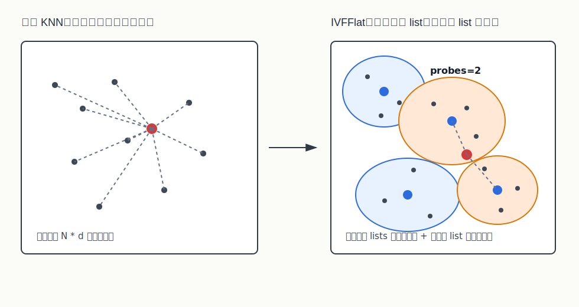
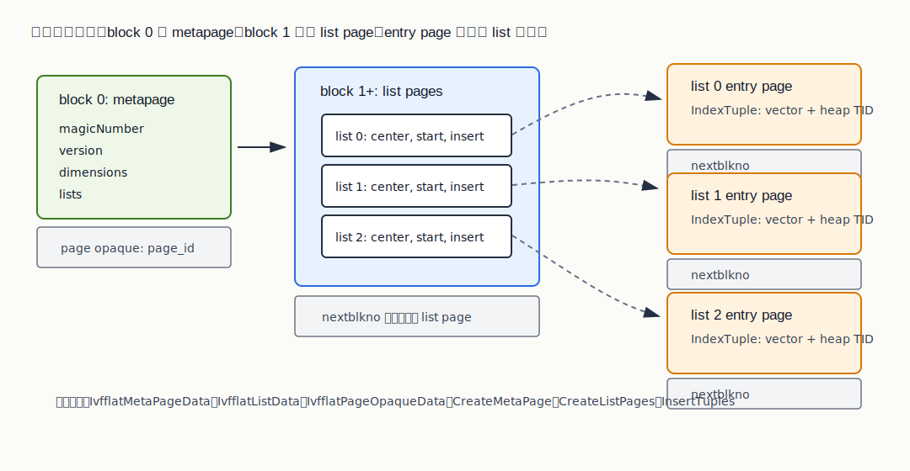
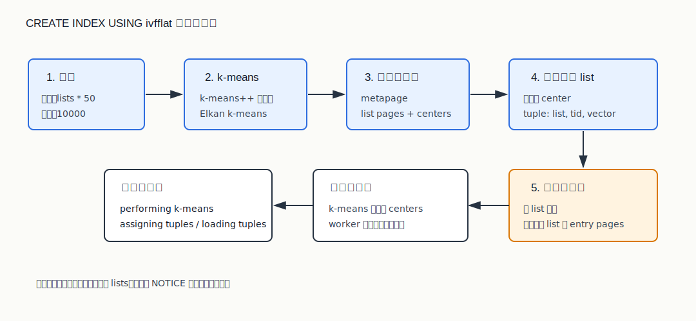
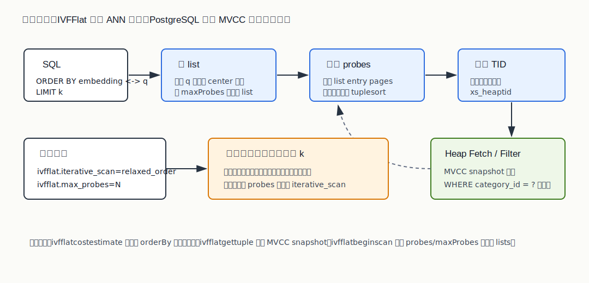

## 数据库筑基课 - ivfflat 索引结构
                                                                                            
### 作者                                                                
digoal                                                                
                                                                       
### 日期                                                                     
2026-05-26                                                      
                                                                    
### 标签                                                                  
PostgreSQL , PolarDB , DuckDB , 应用开发者 , DBA , 数据库筑基课 , 索引结构 , 向量检索 , IVFFlat , pgvector  
                                                                                           
----                                                                    

## 背景

  


本节属于“索引结构”基础能力。当前工作区没有发现“数据库筑基课”总纲文件，因此本文先独立成篇。

向量检索的第一个现实问题很朴素：如果有 1000 万条 768 维 embedding，每次查询都和全部向量算一遍距离，精确但贵。即使用 SIMD 和并行，数据库还要同时处理 SQL 解析、事务可见性、过滤条件、排序、连接和并发。全量扫描在小数据上是好基线，在在线高并发上通常不是好答案。

`ivfflat` 的思路是把“全量找最近邻”改写成“先找最可能命中的几个分区，再在分区内精确算距离”。它不是魔法索引，也不是无损索引；它用召回率换延迟，用预先训练出的中心点换更少的候选扫描，用参数 `lists` 和 `probes` 把选择权交给使用者。

本文以本地 `pgvector` 源码为主线，参考 `pgvector/CLAUDE.md`、项目 README、DeepWiki `pgvector/pgvector` 的 IVFFlat 页面，以及两篇论文：

- Hervé Jégou、Matthijs Douze、Cordelia Schmid，Product Quantization for Nearest Neighbor Search。
- Simeon Emanuilov、Aleksandar Dimov，Billion-scale Similarity Search Using a Hybrid Indexing Approach with Advanced Filtering。

其中第一篇论文帮助理解 IVF 与 PQ 的关系：IVF 负责“少看候选”，PQ 负责“少存向量/近似距离”。pgvector 的 `ivfflat` 只取 IVF-Flat 这条线：倒排桶内保存原始向量值，不做 PQ 压缩。第二篇论文帮助理解过滤条件为什么是向量数据库工程里的硬问题：如果过滤不能参与候选生成，只在候选返回后处理，就可能出现 “LIMIT 10 但过滤后不够 10 条”。

## 一、它解决什么问题？

精确 KNN 的基本代价是：

```text
cost_exact ~= N * distance_cost(d)
```

N 是行数，d 是向量维度。这个模型很干净，也很残酷：数据量翻倍，距离计算也大体翻倍。普通 B-tree 能通过有序键快速定位范围，但高维向量没有一个天然的全局一维顺序能同时保持所有邻近关系。KD-tree、LSH、图索引、倒排文件等 ANN 方法，本质都是在回答同一个问题：能不能少看一点，同时尽量别漏掉真近邻？

IVFFlat 的转换方式是：

1. 建索引时，用样本训练出 `lists` 个中心点。
2. 每条向量分配给最近的中心点，对应一个倒排 list。
3. 查询时，先计算 query 到所有中心点的距离。
4. 只扫描最近的 `probes` 个 list。
5. list 内对候选向量做真实距离计算，再按距离排序返回 TID。



图 1 说明：IVFFlat 的收益来自候选集缩小。它不是把距离计算变成零，而是先用中心点粗筛，把原来的全量候选压缩到若干 list 内。`probes` 越大，漏掉真近邻的概率通常越小，但扫描候选越多。

它付出的代价也很明确：

- 召回率不再天然等于 100%。
- 建索引需要训练，数据太少时中心点质量差。
- 数据分布漂移后，旧中心点可能不再适合新数据。
- `WHERE` 过滤通常在索引候选返回后发生，过滤选择性会影响最终返回数量。
- `lists`、`probes` 没有跨数据集通用的固定答案，必须用业务数据验证。

## 二、它是什么？

一句话定义：pgvector 的 `ivfflat` 是一个 PostgreSQL index access method，它用 k-means 训练出的中心点把向量划分成多个倒排 list，查询时只扫描离 query 最近的若干 list，并在 list 内保存的原始向量上计算距离。

这里的 “Flat” 很关键：它表示 list 内保存可直接计算距离的向量值，而不是 PQ code、二进制签名或残差压缩码。因此 pgvector `ivfflat` 与论文里的 IVFADC / IVF-PQ 不同：

- IVF：用中心点把空间切成倒排 list。
- IVFFlat：list 内保存原始向量，候选距离是真实距离。
- IVF-PQ / IVFADC：list 内保存 PQ code 或残差 PQ code，候选距离是近似距离，通常更省内存但多一层量化误差。

pgvector 在 SQL 层注册了 `ivfflat` access method，并为 `vector`、`halfvec`、`bit` 提供对应 operator class。常用写法如下：

```sql
CREATE INDEX ON items USING ivfflat (embedding vector_l2_ops) WITH (lists = 100);
CREATE INDEX ON items USING ivfflat (embedding vector_ip_ops) WITH (lists = 100);
CREATE INDEX ON items USING ivfflat (embedding vector_cosine_ops) WITH (lists = 100);
CREATE INDEX ON items USING ivfflat (embedding bit_hamming_ops) WITH (lists = 100);
```

查询必须是按距离排序的 KNN 形态，典型 SQL 是：

```sql
SELECT id, embedding <-> '[3,1,2]' AS distance
FROM items
ORDER BY embedding <-> '[3,1,2]'
LIMIT 10;
```

源码里 `ivfflatcostestimate()` 对没有 `ORDER BY` 距离算子的路径直接给无穷大成本；`ivfflatgettuple()` 也会在没有 order 信息时抛错。因此不要把它理解成 “给向量列建了索引后，任何 WHERE 都能用”。它服务的是近邻排序。

几个术语先统一：

- **lists**：建索引参数，表示中心点/list 数量。源码默认 100，范围 1 到 32768。
- **probes**：查询参数，表示初始扫描多少个最近 list。默认 1，范围同样受 list 数限制。
- **max_probes**：迭代扫描时最多扫描多少个 list；如果小于 `probes`，源码会至少使用 `probes`。
- **iterative_scan**：过滤后结果不足时，可以用 `relaxed_order` 继续扫描更多 list，直到满足执行器需求或达到 `max_probes`。
- **center / centroid**：k-means 训练出的 list 中心。
- **entry page**：某个 list 下保存 `IndexTuple` 的页面链，每个 tuple 带向量值和 heap TID。

## 三、核心原理

### 3.1 从 IVF 到 pgvector IVFFlat

经典 IVF 把空间划成 Voronoi cells：给定 K 个中心点，每个向量归入距离自己最近的中心点。查询时不扫描全部数据，只扫描 query 最近的 T 个中心点对应的倒排 list。Emanuilov 和 Dimov 的论文把这个模型写成 K 个 centroids 和 K 个 inverted lists，并在 IVF-Flat 中保留 list 内的完整向量。

Product Quantization 论文进一步说明了 IVF 与 PQ 的组合价值：PQ 把高维空间拆成低维子空间，每段独立量化，用短 code 估计距离；再配合 inverted file 避免穷举扫描。pgvector 的 `ivfflat` 没有采用 PQ code，它选择在 PostgreSQL 索引 tuple 里保存向量值。这个取舍更符合数据库扩展的边界：实现简单、list 内排序距离准确、支持 PostgreSQL 的索引接口和 WAL/VACUUM 机制；代价是索引体积比 IVF-PQ 大。

### 3.2 物理结构：metapage、list page、entry page

本地源码里核心结构在 `pgvector/src/ivfflat.h`：

- `IvfflatMetaPageData`：block 0，保存 magic number、版本、维度、list 数。
- `IvfflatListData`：list page 里的 item，保存 `startPage`、`insertPage` 和 `center`。
- `IvfflatPageOpaqueData`：每个页面的 opaque 区，保存 `nextblkno` 和 `page_id`。
- entry page：保存 PostgreSQL `IndexTuple`，tuple 的 key 是向量值，TID 指向 heap tuple。



图 2 说明：`metapage` 是全局元信息入口；list page 保存多个 list 的中心点和页面指针；每个 list 自己有一条 entry page 链。`startPage` 用于扫描，`insertPage` 用于增量插入时更快找到可追加页面。

这个结构带来几个工程结论：

- list 内是“页面链 + tuple 数组”，不是内存图结构。
- VACUUM 可以沿 list 链删除失效 TID 对应的 index tuple。
- 插入只会把新向量追加到最近中心点所在 list，不会因为新数据到来自动重算中心点。
- 如果 list 负载不均，某些 list 会变成长链，查询这些 list 的延迟会更高。

### 3.3 构建流程：采样、k-means、分配、装载

`ivfflatbuild()` 的主路径在 `pgvector/src/ivfbuild.c`。流程可以拆成五段：

1. `InitBuildState()` 读取 operator class、维度、`lists`、距离函数和类型支持函数。
2. `ComputeCenters()` 采样并运行 k-means。
3. `CreateMetaPage()` 写 metapage。
4. `CreateListPages()` 写 list pages，并把中心点保存在 list item 中。
5. `CreateEntryPages()` 扫表、给每个 tuple 找最近 center、按 list 排序、批量写入 entry pages。



图 3 说明：k-means 之后，所有向量都要重新扫一遍并分配到最近 list。源码里构建阶段有 `performing k-means`、`assigning tuples`、`loading tuples` 等进度子阶段，可通过 PostgreSQL 的 create index progress 视图观察。

采样策略有一个重要细节：源码目标样本数是 `lists * 50`，并且最少 10000 个样本。样本不足 `lists` 时，源码会发出 NOTICE，提示索引是在少量数据上创建的，会导致低召回风险。这和 README 的建议一致：IVFFlat 应该在表里已经有一些数据后创建。

k-means 实现位于 `pgvector/src/ivfkmeans.c`：

- 初始化使用 k-means++。
- 迭代使用 Elkan k-means，通过三角不等式减少不必要的距离计算。
- 最多迭代 500 次。
- 如果 operator class 需要归一化，样本和中心点会做归一化处理。
- 如果 k-means 所需内存超过 `maintenance_work_mem`，源码会报错。

这解释了两个常见现象：

- `maintenance_work_mem` 不只影响排序，也影响 k-means 的内存上限。
- cosine / inner product operator class 的训练和插入路径会跳过无法归一化的零向量。

### 3.4 查询流程：先选 list，再精排候选

查询入口在 `pgvector/src/ivfscan.c`。核心流程：

1. `ivfflatbeginscan()` 从 metapage 读取 `lists` 和维度，并计算本次扫描的 `probes` / `maxProbes`。
2. `GetScanLists()` 遍历所有 list pages，计算 query 到每个 center 的距离，保留最近的若干 list。
3. `GetScanItems()` 扫描被选中的 list entry pages，对每个候选向量计算 query 距离，把 `(distance, tid)` 放进 tuplesort。
4. `ivfflatgettuple()` 按排序结果逐个返回 heap TID。
5. 如果 tuplesort 取完但 `listIndex < maxProbes`，迭代扫描可以继续取下一批 list。



图 4 说明：IVFFlat access method 返回的是按向量距离排序的 heap TID。普通 SQL 过滤、MVCC 可见性、最终 LIMIT 行数由 PostgreSQL 执行层共同决定。过滤条件如果没有进入候选选择阶段，就可能让近似索引先返回的候选在过滤后变少。

源码还有两个值得 DBA 记住的限制：

- `ivfflatgettuple()` 要求 MVCC snapshot，因为扫描过程中会把候选放进 tuplesort，不能像某些索引扫描那样长期 pin 页面。
- `scan->xs_recheck` 和 `xs_recheckorderby` 被置为 false，表示 list 内候选距离已经按索引中的向量值算过；但这不等于整个 top-k 是精确的，因为没扫描的 list 里可能存在更近向量。

### 3.5 插入与 VACUUM：追加，不重训

增量插入在 `pgvector/src/ivfinsert.c`：

1. 跳过 NULL。
2. 必要时归一化向量。
3. 遍历所有 list center，找到最近 list。
4. 形成 `IndexTuple`，写入该 list 的 `insertPage`。
5. 当前页空间不足时追加新 page，并更新 list 的 `insertPage`。

这意味着新写入的数据会被分到已有中心点，不会触发中心点重训。对写多、分布持续漂移的业务，需要周期性 `REINDEX` 或重建索引，否则 list 的空间划分会越来越不代表真实数据。

VACUUM 在 `pgvector/src/ivfvacuum.c`：

- 沿 list pages 找到每个 list 的 entry page 链。
- 对 entry page 执行 bulk delete，删除回调判定为 dead 的 TID。
- 如果某页出现可删除 tuple，会把该页作为新的可插入页候选并更新 list 元信息。
- `vacuumcleanup` 更新页数统计。

它不会压缩 list、不会重算 center、不会合并长链，也不会把一个向量从旧 list 迁移到更合适的新 list。VACUUM 解决的是死 tuple，不解决训练质量。

### 3.6 优化器如何看待成本

`ivfflatcostestimate()` 的核心估算是：

```text
ratio = min(ivfflat.probes / lists, 1)
startup_cost ~= index_total_cost * ratio
```

也就是说，`probes / lists` 是优化器理解 IVFFlat 扫描规模的关键。`probes` 越接近 `lists`，越像全索引扫描。README 也提醒：当 `probes` 设置为 list 总数时，可以得到精确近邻搜索，但此时 planner 可能不会再选择 IVFFlat 索引，因为它失去了“少扫”的成本优势。

## 四、横向对比

| 维度 | pgvector IVFFlat | pgvector HNSW | IVF-PQ / IVFADC | 精确扫描 |
|---|---|---|---|---|
| 主要目标 | 聚类分桶，减少候选扫描 | 图导航，追求更好速度-召回曲线 | 分桶 + PQ 压缩，降低内存和距离成本 | 100% 精确 |
| 是否需要训练 | 需要 k-means | 不需要训练 | 需要粗量化和 PQ 训练 | 不需要 |
| 候选生成 | 最近 `probes` 个 list | HNSW 图搜索候选 | 最近 `nprobe` 个 list | 全量候选 |
| list / 候选内距离 | 原始向量真实距离 | 原始向量或类型对应距离 | PQ 近似距离，常可重排 | 原始向量真实距离 |
| 写入代价 | 找最近 center 后追加 | 搜图并维护边 | 编码后追加到 list | 追加数据即可 |
| 空间成本 | 保存向量副本 + TID + 页面开销 | 图边 + 向量 | PQ code + list/id/码本，通常更省 | 表数据本身 |
| 召回调参 | `lists`、`probes`、`max_probes` | `m`、`ef_construction`、`ef_search` | `nlist`、`nprobe`、PQ 参数 | 无召回参数 |
| 过滤问题 | 过滤通常后置，可能结果不足 | 同样可能后置 | 取决于实现是否把 filter 进索引 | SQL 层自然处理 |
| 适合场景 | 已有一定数据、读多、内存比 HNSW 紧 | 更重视召回和延迟，能接受更多内存 | 十亿级、内存敏感、可接受量化误差 | 小数据、基线、强精确 |
| 不适合场景 | 高频漂移、强过滤、必须精确 top-k | 内存预算紧、构建慢不可接受 | 不想引入近似距离误差 | 大规模低延迟在线检索 |

表里的核心差异不是“哪个永远更好”，而是误差来自哪里。IVFFlat 的误差主要来自粗分桶后没有扫描所有 list；IVF-PQ 还会叠加 PQ 量化误差；HNSW 的误差主要来自图搜索候选扩展不充分。精确扫描没有召回误差，但可能不满足延迟。

## 五、效果如何？

不要脱离数据分布谈固定性能数字。IVFFlat 的效果至少受五个因素影响：

1. **中心点质量**：训练样本是否足够、是否代表线上分布。
2. **list 粒度**：`lists` 越大，单个 list 通常越小，但中心点更多、建索引和选 list 成本更高。
3. **扫描宽度**：`probes` 越大，召回通常越高，延迟越高。
4. **过滤选择性**：如果过滤后置，候选里能留下多少行取决于 WHERE 条件。
5. **数据漂移**：插入不会重训 center，长期漂移会降低 list 划分质量。

README 给出的经验起点是：

- 100 万行以内，`lists` 可以从 `rows / 1000` 开始。
- 100 万行以上，`lists` 可以从 `sqrt(rows)` 开始。
- 查询时 `probes` 可以从 `sqrt(lists)` 开始。

这些是起点，不是结论。生产验证建议用 recall@k、平均延迟、P95/P99 延迟、索引大小、构建时间一起看。一个可落地的 recall 验证方法是：同一批 query 先跑 IVFFlat，再在事务里临时关闭 index scan 跑精确扫描，用精确 top-k 作为基线比较交集。

```sql
-- 近似结果
BEGIN;
SET LOCAL ivfflat.probes = 10;
SELECT id
FROM items
ORDER BY embedding <-> '[3,1,2]'
LIMIT 20;
COMMIT;

-- 精确基线。README 建议可通过关闭 indexscan 做对照。
BEGIN;
SET LOCAL enable_indexscan = off;
SELECT id
FROM items
ORDER BY embedding <-> '[3,1,2]'
LIMIT 20;
COMMIT;
```

上面的 SQL 是验证模板，本文未在本地执行，因为当前任务是写作与源码分析，没有启动 PostgreSQL、安装扩展、加载样本数据。文章不提供伪造的 EXPLAIN 或性能数字。

## 六、实操 DEMO

下面给一个最小可执行形态，便于读者在自己的 PostgreSQL + pgvector 环境里验证结构和参数。示例使用小表，只验证语义，不代表性能。

```sql
CREATE EXTENSION IF NOT EXISTS vector;

DROP TABLE IF EXISTS items;
CREATE TABLE items (
    id bigserial PRIMARY KEY,
    category_id int NOT NULL,
    embedding vector(3)
);

INSERT INTO items (category_id, embedding) VALUES
(1, '[0,0,0]'),
(1, '[1,2,3]'),
(1, '[1,1,1]'),
(2, '[4,4,4]'),
(2, '[3,3,3]'),
(2, NULL);

-- IVFFlat 最好在已有数据后创建。小表只用于演示，所以 lists 设置得很小。
CREATE INDEX items_embedding_ivfflat_l2
ON items USING ivfflat (embedding vector_l2_ops)
WITH (lists = 2);

-- 基本 KNN
SET ivfflat.probes = 1;
SELECT id, category_id, embedding <-> '[3,3,3]' AS distance
FROM items
ORDER BY embedding <-> '[3,3,3]'
LIMIT 3;

-- 带过滤条件。过滤通常在 ANN 候选之后发生，结果数量受 probes 和过滤选择性影响。
SET ivfflat.probes = 1;
SELECT id, category_id, embedding <-> '[3,3,3]' AS distance
FROM items
WHERE category_id = 1
ORDER BY embedding <-> '[3,3,3]'
LIMIT 3;

-- 过滤后结果不足时，可以尝试提高 probes 或启用迭代扫描。
SET ivfflat.probes = 1;
SET ivfflat.iterative_scan = relaxed_order;
SET ivfflat.max_probes = 2;

SELECT id, category_id, embedding <-> '[3,3,3]' AS distance
FROM items
WHERE category_id = 1
ORDER BY embedding <-> '[3,3,3]'
LIMIT 3;
```

配套观测 SQL：

```sql
-- 建索引期间观察阶段
SELECT phase,
       round(100.0 * blocks_done / nullif(blocks_total, 0), 1) AS pct
FROM pg_stat_progress_create_index;

-- 查看参数
SHOW ivfflat.probes;
SHOW ivfflat.iterative_scan;
SHOW ivfflat.max_probes;
```

注意：小表上 planner 可能选择顺序扫描，因为精确扫描成本更低。为了观察索引路径，可以在实验环境临时调整 planner 参数，但不要把这当成生产优化建议。

## 七、最佳实践

面向数据库架构师：

- 把 IVFFlat 放在“可接受近似召回的候选生成层”，不要放在强精确排序或强一致业务规则层。
- 对过滤字段先建普通 PostgreSQL 索引或做分区/局部索引设计。向量索引不能自动解决所有 SQL 谓词选择性问题。
- 如果业务有多租户、分类、地域等强过滤条件，优先考虑 partial index 或 partition，让 ANN 候选空间先按业务边界缩小。
- 保留精确搜索或高精度重排链路，用于评估 recall、线上抽检和关键请求兜底。

面向 DBA：

- 建索引前确认表中已有足够样本。源码在样本数少于 `lists` 时会提示低召回风险，这个提示应该被当成质量风险。
- `lists` 从 README 经验值开始，但用业务 query 集调参，不要直接照搬。
- 用 `SET LOCAL ivfflat.probes = ...` 给单次查询调参，避免会话级参数影响连接池里的其他请求。
- 监控索引大小、VACUUM 时间、P99 延迟和 recall。只监控平均延迟会掩盖长 list 和过滤后置问题。
- 大量数据重分布、embedding 模型升级、批量导入后，考虑 `REINDEX CONCURRENTLY` 或重建索引。

面向业务开发者：

- SQL 必须写成 `ORDER BY embedding <operator> query LIMIT k`，否则索引没有近邻排序语义。
- 不要把 ANN 距离当成跨模型、跨索引参数稳定可比的业务分数。
- 过滤条件越强，越需要关注 `probes` 和迭代扫描，否则返回行数可能少于预期。
- RAG 场景建议 `ANN top-R -> 精确向量或 reranker 重排 -> top-k`，不要盲目让 IVFFlat 的 top-k 直接成为最终答案。

## 八、适合与不适合场景

适合：

- 表里已经有一定规模的稳定向量数据。
- 查询以 top-k 近邻为主，业务接受近似召回。
- 写入不是极端高频，或者允许周期性重建索引。
- 内存预算不适合 HNSW，但又希望比精确扫描更快。
- RAG 初筛、推荐候选生成、相似图片/文本召回、去重候选生成。

不适合：

- 必须返回精确 top-k，不能接受任何漏召回。
- 数据量很小，精确扫描已经足够快。
- 数据分布快速漂移，中心点需要频繁重训。
- 过滤条件极强且不能通过分区、partial index 或普通索引先缩小范围。
- 高频 update/delete 且要求索引结构持续保持最优聚类。
- 需要 PQ 级别的极致压缩；pgvector IVFFlat 是 Flat，不是 IVF-PQ。

## 九、常见坑

1. **空表或小表先建索引。**
   IVFFlat 有训练步骤。数据太少时中心点不可靠，后续插入只会追加到已有中心点，不会自动重训。

2. **把 `lists` 调得越大越好。**
   list 更多会让单 list 更小，但中心点更多、训练更重、查询选 list 也要遍历更多 center。更大的 `lists` 还可能让小数据集每个 list 样本不足。

3. **只提高 `lists`，不调 `probes`。**
   list 变多但 `probes` 仍为 1，查询扫描比例会下降，召回可能变差。

4. **把 `probes = lists` 当生产默认。**
   这接近全索引扫描，召回好但失去 ANN 的成本优势，planner 也可能不用索引。

5. **忽略过滤后置。**
   `WHERE category_id = 1 ORDER BY embedding <-> q LIMIT 10` 里，向量索引先找到的候选不一定都满足 category。提高 probes、迭代扫描、partial index、partition 都是可能方案。

6. **误以为 VACUUM 会优化聚类。**
   VACUUM 删除死 tuple，更新可插入页指针，但不重算中心点、不移动存活向量、不合并 list。

7. **cosine 零向量问题。**
   cosine 相关路径需要归一化，源码会跳过不能归一化的零向量。业务侧应避免把零向量当成可检索 embedding。

8. **没有精确基线。**
   ANN 调参不能只看“快了多少”，还要看“漏了多少”。精确扫描或高精度重排是必要基线。

## 十、扩展问题

1. 如果 `WHERE` 条件选择性只有 1%，应该提高 `ivfflat.probes`，还是按过滤字段建 partial index / partition？如何用 EXPLAIN 和 recall@k 判断？
2. 当 embedding 模型从 v1 升级到 v2，旧 IVFFlat 索引是否还能继续服务？如何设计双写、双索引和回滚？
3. 为什么 IVF-PQ 更省内存，但 pgvector 选择 IVFFlat 更符合 PostgreSQL 扩展的实现边界？
4. 如果某些 list 明显比其他 list 长，说明数据分布有什么问题？应该调 `lists`、重训，还是先做业务分区？
5. 对 RAG 系统，`LIMIT k` 应该等于最终返回条数，还是应该先取更大的 `R` 后重排？`R` 如何随 recall 和 reranker 成本调整？
6. 如果 `probes / lists` 很高，为什么 planner 可能倾向顺序扫描？这和 `ivfflatcostestimate()` 的 ratio 模型有什么关系？

## 十一、扩展阅读

- pgvector README：`pgvector/README.md`，IVFFlat、query options、filtering、iterative scans、monitoring 章节。
- pgvector 项目参考：`pgvector/CLAUDE.md`。
- pgvector 源码：`pgvector/src/ivfflat.h`，核心结构与参数常量。
- pgvector 源码：`pgvector/src/ivfflat.c`，access method handler、GUC、成本估算。
- pgvector 源码：`pgvector/src/ivfbuild.c`，采样、构建、并行构建、页面装载。
- pgvector 源码：`pgvector/src/ivfkmeans.c`，k-means++ 与 Elkan k-means。
- pgvector 源码：`pgvector/src/ivfscan.c`，list 选择、候选扫描、tuplesort、迭代扫描。
- pgvector 源码：`pgvector/src/ivfinsert.c`，增量插入。
- pgvector 源码：`pgvector/src/ivfvacuum.c`，bulk delete 与 vacuum cleanup。
- pgvector SQL 定义：`pgvector/sql/vector.sql`，`ivfflat` access method 与 operator classes。
- pgvector 测试：`pgvector/test/sql/ivfflat_vector.sql`。
- DeepWiki: [IVFFlat Index | pgvector/pgvector](https://deepwiki.com/pgvector/pgvector/5.2-ivfflat-index)，用于架构梳理，关键结论已回查本地源码。
- Hervé Jégou, Matthijs Douze, Cordelia Schmid, [Product Quantization for Nearest Neighbor Search](https://doi.org/10.1109/TPAMI.2010.57), IEEE TPAMI 2011.
- Simeon Emanuilov, Aleksandar Dimov, [Billion-scale Similarity Search Using a Hybrid Indexing Approach with Advanced Filtering](https://arxiv.org/abs/2501.13442), Cybernetics and Information Technologies 2024.
- PostgreSQL 文档：[Index Access Method Interface](https://www.postgresql.org/docs/current/index-api.html)。
- PostgreSQL 文档：[Progress Reporting for CREATE INDEX](https://www.postgresql.org/docs/current/progress-reporting.html#CREATE-INDEX-PROGRESS-REPORTING)。

## 本文验证说明

- 标题、分类、结构已按“数据库筑基课 - ivfflat 索引结构”整理。
- 主要机制结论均来自本地 `pgvector` 源码、README、DeepWiki 和论文资料。
- SQL 示例按 pgvector README 与测试文件写法整理，本文未启动 PostgreSQL 执行。
- 文中没有编造性能数字；参数建议均标为经验起点，需要用业务数据验证。
- SVG 图均为 standalone 文件，通过相对路径引用。
  
## 附录  
  
1、问 gemini  
```  
ivfflat 索引结构相关的论文、开源项目.
```  
  
2、克隆代码  
```  
git clone --depth 1 https://github.com/pgvector/pgvector
```  
  
3、启用 codex, 使用 [数据库筑基课 skill](../skills/README.md).  
````
文章标题: 
  数据库筑基课 - ivfflat 索引结构
项目源码(已克隆到当前项目如下目录中):  
  pgvector
论文: 
  Product Quantization for Nearest Neighbor Search
  Billion-scale Similarity Search Using a Hybrid Indexing Approach with Advanced Filtering
项目 deepwiki reponame:  
  pgvector/pgvector
项目参考信息: 
  pgvector/CLAUDE.md
````
  
  
#### [PostgreSQL 解决方案集合](../201706/20170601_02.md "40cff096e9ed7122c512b35d8561d9c8")
  
  
#### [德哥 / digoal's Github - 公益是一辈子的事.](https://github.com/digoal/blog/blob/master/README.md "22709685feb7cab07d30f30387f0a9ae")
  
  
#### [About 德哥](https://github.com/digoal/blog/blob/master/me/readme.md "a37735981e7704886ffd590565582dd0")
  
  

  
