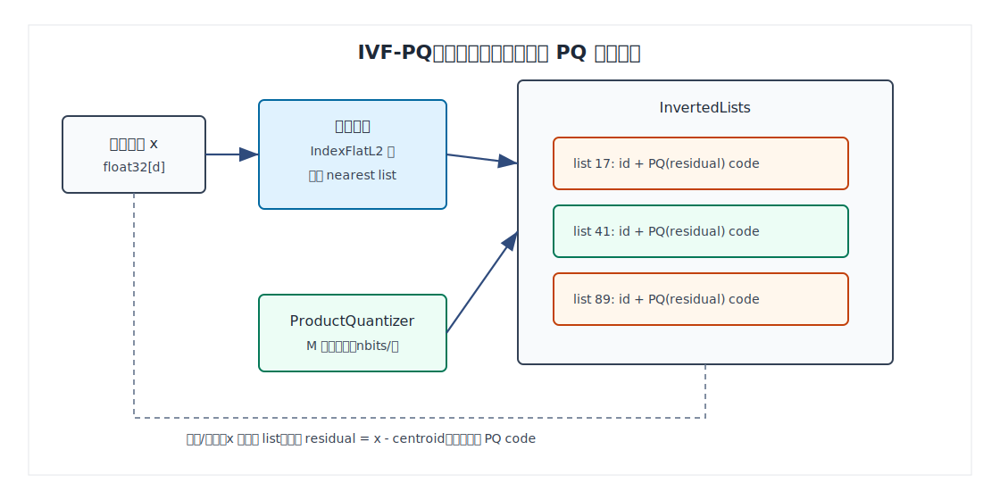
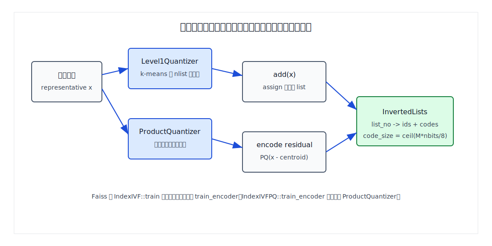
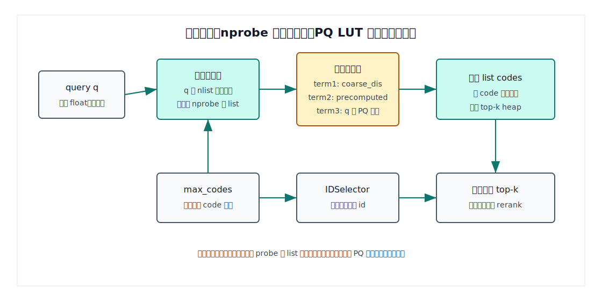
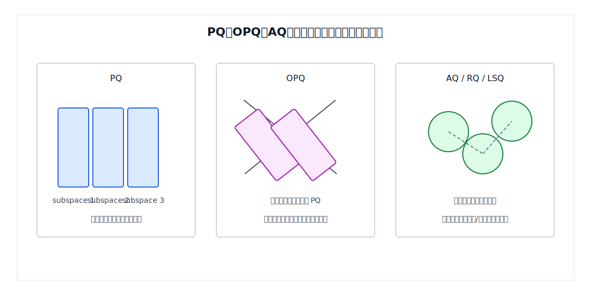
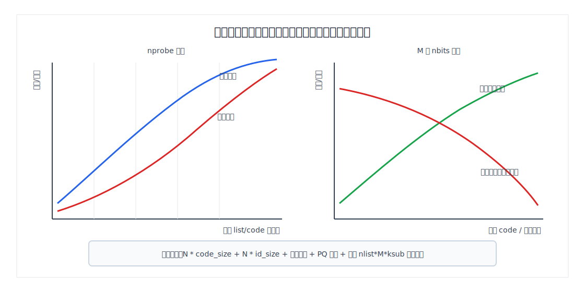

## 数据库筑基课 - ivfflat-pq 索引结构
                                                                                            
### 作者                                                                
digoal                                                                
                                                                       
### 日期                                                                     
2026-05-26                                                      
                                                                    
### 标签                                                                  
PostgreSQL , DuckDB , 应用开发者 , DBA , 数据库筑基课 , 索引结构 , 向量检索 , IVFPQ , IVFADC , Product Quantization , Faiss  
                                                                                           
----                                                                    

## 背景
  


本节属于“索引结构”基础能力。当前工作区没有发现“数据库筑基课”总纲文件，因此本文先独立成篇。

向量检索里，`ivfflat` 解决的是“不要全量扫”：先用粗聚类中心把空间切成倒排桶，查询时只扫 `nprobe` 个桶。问题是，桶里如果保存原始 `float32[d]` 向量，空间和内存带宽仍然很贵。比如 1 亿条 768 维向量，原始向量区就是：

```text
100,000,000 * 768 * 4 bytes ~= 286 GB
```

这还没算主键、倒排 list、过滤字段、缓存、复制和重排用原向量。`ivfflat-pq` 这个题目要讨论的核心，就是把 “IVF 少扫桶” 和 “PQ 少存向量、少搬数据、查表算距离” 结合起来。

先澄清一个命名点：Faiss 源码里标准类名是 `IndexIVFPQ`，不是 `IndexIVFFlatPQ`。`IndexIVFFlat` 和 `IndexIVFPQ` 是两个 IVF 子类：前者 list 内保存原始 float，后者 list 内保存 PQ code。很多工程文档会把“粗量化器使用 Flat index 的 IVF-PQ”口头叫成 “ivfflat-pq”，但从结构上更准确的名字是 **IVF-PQ** 或论文中的 **IVFADC**。

本文以本地 `faiss` 源码为主线，参考 `faiss/CLAUDE.md`、Faiss 官方 wiki、DeepWiki `facebookresearch/faiss`、以及三条论文线索：

- Hervé Jégou、Matthijs Douze、Cordelia Schmid, [Product Quantization for Nearest Neighbor Search](https://doi.org/10.1109/TPAMI.2010.57), 2011。
- Tiezheng Ge、Kaiming He、Qifa Ke、Jian Sun, [Optimized Product Quantization for Approximate Nearest Neighbor Search](https://openaccess.thecvf.com/content_cvpr_2013/html/Ge_Optimized_Product_Quantization_2013_CVPR_paper.html), CVPR 2013。
- 用户给出的 “Anisotropic Quantization for Fast Transformation-Based Approximate Nearest Neighbor Search” 与常见公开题名不完全一致。本文按 Ruiqi Guo 等人的 [Accelerating Large-Scale Inference with Anisotropic Vector Quantization](https://proceedings.mlr.press/v119/guo20h.html), ICML 2020 作为“各向异性量化”参考。

## 一、它解决什么问题？

精确 KNN 的基础代价是：

```text
cost_exact ~= N * distance_cost(d)
memory_exact ~= N * d * sizeof(float)
```

IVF 把第一项变成：

```text
cost_ivf ~= nlist_center_search + scanned_vectors_in_nprobe_lists * distance_cost(d)
```

这已经减少了候选数，但 list 内仍然要读取原始向量并计算真实距离。IVF-PQ 继续把 list 内存储改成短码：

```text
code_size = ceil(M * nbits / 8)
```

其中 `M` 是 PQ 子量化器数量，`nbits` 是每个子量化器 code 的 bit 数。以 `d=768, M=96, nbits=8` 为例，原始向量 3072 字节，PQ code 只有 96 字节。这个压缩只针对向量 payload，不等于整个索引压缩比，因为倒排 list 的 id、码本、预计算表和系统元数据仍然要占空间。

它解决的是三个工程痛点：

1. **内存容量**：同样机器能放下更多候选向量的压缩表示。
2. **内存带宽**：扫描 list 时读短 code，而不是读完整 float 向量。
3. **距离计算**：query 到 PQ 码本预先形成查表距离，每个候选 code 只需解码若干小整数并累加。

它付出的代价也很明确：

- 粗量化只扫 `nprobe` 个桶，未扫桶可能藏着真近邻。
- PQ code 有量化误差，已扫候选的距离排序也可能错。
- 训练变成两层：粗量化器要训练，PQ 码本也要训练。
- 数据分布漂移后，桶中心和 PQ 码本都可能变差。
- 删除、更新、事务可见性不是 Faiss `IndexIVFPQ` 自身的强项，数据库通常还要靠 segment、delete bitmap、重建和 rerank 治理。

## 二、它是什么？

一句话定义：IVF-PQ 是“用 IVF 粗量化器选择少量倒排桶，用 Product Quantization 把桶内向量残差压成短 code，并用查表距离近似排序候选”的 ANN 索引。

在 Faiss 本地源码中，对应关系很清楚：

- `faiss/faiss/IndexIVF.h` 定义 `Level1Quantizer`、`nlist`、`nprobe`、`InvertedLists`，并说明 IVF 在查询时只访问若干倒排 list。
- `faiss/faiss/IndexIVFFlat.h` 说明 `IndexIVFFlat` 的 code array 保存原始 float entries。
- `faiss/faiss/IndexIVFPQ.h` 说明 `IndexIVFPQ` 是 “Inverted file with Product Quantizer encoding”，每个 residual vector 编码成 PQ code。
- `faiss/faiss/impl/ProductQuantizer.h` 定义 `M`、`nbits`、`dsub`、`ksub`、`centroids`、`compute_distance_table()` 等 PQ 基础结构。
- DeepWiki 的 IVF 页面也把 `IndexIVFFlat`、`IndexIVFPQ`、`IndexIVFScalarQuantizer`、`IndexIVFAdditiveQuantizer` 列为 IVF 家族的不同 list payload 编码方式。



图 1 说明：粗量化器负责把向量映射到 list，`ProductQuantizer` 负责把 `x - centroid` 的残差编码成短 code。查询时不是把所有 code 完整解码后再算距离，而是用 query、粗中心和 PQ 码本构造距离表，再扫描 list 内 code。

几个术语先统一：

- **nlist**：倒排 list 数量，也就是粗量化中心数。
- **nprobe**：每次查询探测多少个 list，默认通常很小，调大可提高召回但增加扫描量。
- **coarse quantizer**：粗量化器，常见是 `IndexFlatL2(d)`。
- **residual**：残差，`x - coarse_centroid`。Faiss `IndexIVFPQ` 默认 `by_residual = true`。
- **M**：PQ 子量化器数量，把 d 维切成 M 段。
- **nbits**：每段 code 的 bit 数，`ksub = 2^nbits`。
- **ADC**：Asymmetric Distance Computation，query 保持原始 float，库向量用 PQ code 表示。
- **IVFADC**：论文里常见说法，粗量化器加残差 PQ 的组合。
- **OPQ**：先学习一个旋转或线性变换，再做 PQ，减少固定维度切块造成的失真。
- **AQ / RQ / LSQ**：加性量化家族，用多个码本向量相加表达原向量或残差，和 PQ 的“子空间拼接”不同。

## 三、核心原理

### 3.1 IVF 层：把全量候选变成少量倒排桶

`IndexIVF` 的结构可以按数据库倒排索引理解：

```text
coarse centroid id -> inverted list -> (vector id, encoded code)*
```

`IndexIVF::search()` 的主路径是：

1. 调用 `quantizer->search(..., cur_nprobe, ...)`，找 query 最近的 `nprobe` 个粗中心。
2. 调用 `invlists->prefetch_lists()` 预取这些 list。
3. 调用 `search_preassigned()` 扫描这些 list。
4. 子类通过 `get_InvertedListScanner()` 决定 list 内 code 如何打分。

也就是说，IVF 的第一层误差来自候选桶选择：如果 `nprobe` 太小，真近邻所在 list 没被访问，就算 PQ 距离再准也找不到它。

### 3.2 PQ 层：把残差切成多个子空间独立量化

PQ 的核心假设是：把高维向量切成 M 个低维子向量，每个子空间独立训练一个 k-means 码本。一个向量不再保存完整 float，而是保存每个子空间最近 centroid 的编号。

Faiss `ProductQuantizer::set_derived_values()` 做了几个关键约束和派生值：

```text
dsub = d / M
ksub = 1 << nbits
code_size = ceil(M * nbits / 8)
centroids.size = d * ksub
```

源码还要求 `d % M == 0`，否则无法等分子空间。`ProductQuantizer::train()` 对每个子空间分别跑 `Clustering(dsub, ksub, cp)`。`compute_code()`、`compute_codes()` 把向量映射为短码，`compute_distance_table()` 生成 query 到每个子码本 centroid 的距离表。

### 3.3 IVFPQ：默认编码的是残差，不是原向量

`IndexIVFPQ` 构造函数里有三个非常关键的事实：

```text
pq(d, M, nbits)
code_size = pq.code_size
by_residual = true
```

`IndexIVFPQ::encode()` 和 `encode_vectors()` 进一步说明了默认路径：

1. 已知向量所属 list id，也就是粗中心 id。
2. 调用 `quantizer->compute_residual(x, residual, key)`。
3. 调用 `pq.compute_code(residual, code)` 或批量 `pq.compute_codes()`。
4. 把 `(id, code)` 追加到对应倒排 list。

这就是论文里 IVFADC 的本质：粗量化器先给出一个近似位置，PQ 不再量化原始向量，而是量化残差。这样同样 code 长度下，通常比直接 PQ 原向量误差更小。



图 2 说明：构建不是一次简单排序，而是两套训练加一次编码装载。粗量化中心决定 list，PQ 码本决定 list 内 code。训练样本不代表线上分布时，两层误差都会放大。

### 3.4 查询：三段距离分解和查表扫描

对 L2 距离、残差 PQ，Faiss 源码注释把距离写成：

```text
d = || x - y_C - y_R ||^2
```

其中：

- `x` 是 query。
- `y_C` 是粗量化中心。
- `y_R` 是 PQ residual centroid 组合。

源码进一步把它拆成三类项：

```text
term 1: ||x - y_C||^2
term 2: ||y_R||^2 + 2 * <y_C, y_R>
term 3: -2 * <x, y_R>
```

`term 1` 在粗量化阶段已经得到，`term 3` 是 query 到 PQ 码本的经典查表项，`term 2` 可以预计算，但要付出 `nlist * M * ksub` 个 float 的空间，所以 `use_precomputed_table` 默认按启发式决定是否开启。

扫描 list 时，`IVFPQScanner` 的核心动作就是：

1. 对每个 query 建立 PQ 查表距离。
2. 对 list 内每个 code，读取 M 个子码本编号。
3. 从表里取出每段贡献并累加。
4. 把近似距离放入 top-k heap。



图 3 说明：`nprobe` 控制访问多少 list，`max_codes` 可以限制扫描多少 code，`IDSelector` 可做 id 级过滤。返回结果是 ANN 结果，常见生产链路会保留原始向量或更高精度向量，对 top-N 候选做 rerank。

### 3.5 OPQ：先旋转，再切块

PQ 固定按维度切块，这个假设在真实 embedding 上未必好。两个强相关维度如果被切到不同子空间，独立量化会损失信息。OPQ 的思路是学习一个空间变换，让变换后的维度更适合 PQ 切分。

Faiss 的 `OPQMatrix` 位于 `faiss/faiss/VectorTransform.h` 和 `VectorTransform.cpp`。注释明确说它是应用在 `IndexPQ` 或 `IndexIVFPQ` 前的预处理，方法是 OPQ 论文中的 non-parametric version。`index_factory.cpp` 里 `OPQ([0-9]+)(_[0-9]+)?` 会构造 `OPQMatrix(d, M, d_out)`，并通过 `IndexPreTransform` 串到子索引前面。

工程含义是：

```text
OPQm,IVFn,PQm
```

不是一个新的倒排结构，而是：

```text
raw vector -> OPQMatrix -> transformed vector -> IndexIVFPQ
```

它通常能降低 PQ 量化误差，但训练更贵，索引读写路径多一层变换，跨版本迁移和在线重建也要保存变换矩阵。

### 3.6 AQ 与各向异性量化：相邻技术，不要混成一个东西

Faiss 有 `AdditiveQuantizer` 和 `IndexIVFAdditiveQuantizer` 家族。源码注释把 PQ 和 AQ 的差异说得很清楚：PQ 的 decoded vector 是 M 个子向量拼接；AQ 的 decoded vector 是 M 个码本向量求和。AQ 表达力更强，但编码搜索更复杂，Faiss 里包括 Residual Quantizer、Local Search Quantizer、Product Residual Quantizer 等子类。

各向异性量化来自另一条思路：传统量化通常最小化重构误差，但 MIPS 场景里，高内积候选对排序更重要。Guo 等人的 ICML 2020 论文提出一族 anisotropic quantization loss，对残差中平行于数据点方向的分量给更高惩罚。这个思想解释了为什么“重构误差最小”不总等于“召回排序最好”。



图 4 说明：PQ 是子空间拼接，OPQ 是学一个变换后再 PQ，AQ 是多个码本向量相加。它们都能生成短码，但训练目标、误差形态、查询代价和实现复杂度不同。

## 四、横向对比

| 维度 | IVFFlat | IVF-PQ / IVFPQ | OPQ + IVF-PQ | IVF-AQ / RQ / LSQ | HNSW-PQ |
|---|---|---|---|---|---|
| 候选生成 | 粗量化 list | 粗量化 list | 变换后粗量化 list | 粗量化 list | HNSW 图导航 |
| list 内存储 | 原始 float | 残差 PQ code | 变换后残差 PQ code | 加性量化 code | PQ code + 图边 |
| list 内距离 | 真实距离 | 近似距离 | 近似距离 | 近似距离，可解码或 LUT | 近似距离 |
| 空间成本 | 高 | 低 | 低，加变换矩阵 | 低到中，依配置 | code 低，但图边额外占内存 |
| 训练成本 | 粗量化训练 | 粗量化 + PQ 训练 | 粗量化 + OPQ + PQ | 粗量化 + AQ 训练 | PQ 训练 + 图构建 |
| 查询参数 | `nprobe` | `nprobe`, `max_codes`, `use_precomputed_table` | 同 IVFPQ，加变换成本 | search_type、beam/LUT 等 | `efSearch` 等 |
| 主要风险 | 未扫桶漏召回 | 未扫桶 + PQ 排序误差 | 训练更复杂，漂移更敏感 | 实现和调参复杂 | 图边内存、更新复杂 |
| 适合场景 | 内存够，桶内要精确 | 大规模召回、内存预算紧 | 追求更低 PQ 误差 | 量化误差是主要瓶颈 | 低延迟图召回并压缩 payload |

这张表的关键不是“谁更高级”，而是看瓶颈在哪里。若瓶颈是内存和带宽，IVF-PQ 很直接；若瓶颈是 PQ 误差，OPQ 或 AQ 可能有价值；若瓶颈是 list 扫描候选太多，图索引或更好的 coarse quantizer 可能更重要。

## 五、效果如何？

不要脱离数据集给固定性能数字。IVF-PQ 的效果由四类代价共同决定。

**1. 空间**

粗略估算：

```text
index_size
≈ N * code_size
  + N * id_size
  + inverted_list_overhead
  + pq_centroids
  + optional_precomputed_table
```

其中：

```text
code_size = ceil(M * nbits / 8)
pq_centroids ~= M * ksub * dsub * sizeof(float) = d * 2^nbits * 4
precomputed_table ~= nlist * M * ksub * sizeof(float)
```

Faiss 官方 wiki 对 `IndexIVFPQ` 的字节估算写成 `ceil(M * nbits / 8) + 8`，这里的 `+8` 是向量 id 的常见存储成本。实际进程内存还会受 vector capacity、对齐、direct map、运行时表影响。

**2. 召回**

召回受两层影响：

- `nprobe` 太小，候选 list 没覆盖真近邻。
- `M`、`nbits` 太小，PQ 近似距离排序错。

因此调参要看 recall@k，而不是只看平均延迟。

**3. 延迟**

查询延迟大致来自：

```text
coarse search over nlist centers
+ build query-to-codebook LUT
+ scan codes in nprobe lists
+ heap maintenance / filtering / optional rerank
```

`nprobe` 增大通常提升召回，但 list 扫描和堆维护也增加。`M` 增大通常降低量化误差，但每个 code 的查表累加项更多，code 也更长。

**4. 训练与维护**

`IndexIVF::train()` 会先训练粗量化器，再调用子类 `train_encoder()`。`IndexIVFPQ::train_encoder()` 内部调用 `pq.train()`，如果开启 polysemous training 还会调整 PQ centroid 顺序；残差 L2 场景下还可能预计算表。



图 5 说明：`nprobe` 主要调候选覆盖，`M/nbits` 主要调量化误差和 code 长度。`use_precomputed_table` 是典型的空间换 CPU。实际部署要用业务数据画出 recall、P95/P99 延迟、内存三条曲线。

## 六、实操 DEMO

下面是 Faiss Python 的最小实验。当前工作区的 `faiss` 目录是源码目录，会遮蔽系统 Python 包；本机也没有可直接导入的已构建 Faiss Python 包，所以此示例未在当前环境执行。它是 Faiss 官方 tutorial `tutorial/python/3-IVFPQ.py` 的简化版。

```python
import numpy as np
import faiss

d = 32
nt = 2000
nb = 5000
nq = 3
k = 5

rng = np.random.default_rng(20260526)
xt = rng.random((nt, d), dtype=np.float32)
xb = rng.random((nb, d), dtype=np.float32)
xq = rng.random((nq, d), dtype=np.float32)

nlist = 64
M = 8
nbits = 8

quantizer = faiss.IndexFlatL2(d)
index = faiss.IndexIVFPQ(quantizer, d, nlist, M, nbits)

index.train(xt)
index.add(xb)
index.nprobe = 8

D, I = index.search(xq, k)
print(index.is_trained, index.ntotal, index.nprobe)
print(I[0])
print(D[0])
```

如果要验证 `nprobe` 的影响，可以加一个 exact baseline：

```python
exact = faiss.IndexFlatL2(d)
exact.add(xb)

_, gt = exact.search(xq, k)

for nprobe in [1, 2, 4, 8, 16, 32]:
    index.nprobe = nprobe
    _, got = index.search(xq, k)
    recall = sum(len(set(got[i]) & set(gt[i])) for i in range(nq)) / (nq * k)
    print(nprobe, recall)
```

生产测试不要只跑随机数据。更接近真实数据库 workload 的测试至少要包含：

- 业务 embedding 样本。
- 真实 top-k 和 recall@k。
- 过滤条件后的最终返回数量。
- rerank 前后召回变化。
- `nprobe`、`M`、`nbits`、`nlist` 的延迟和内存曲线。

## 七、最佳实践

**数据库架构师**

- 把 IVF-PQ 定位为“召回层索引”，不要把它当强一致精确排序结构。需要精排时，保留原始向量或更高精度副本做 rerank。
- 先定业务目标：recall@k、P95/P99、内存上限、更新频率，再反推 `nlist/nprobe/M/nbits`。
- 大规模多租户场景下，优先考虑 segment 化：每个 segment 独立训练或周期性重建，避免全局索引被分布漂移拖垮。
- 如果过滤条件很强，单纯 ANN 后过滤容易返回不足。要么扩大候选，要么让过滤参与分片、分区或粗筛。

**DBA / 运维**

- 监控不要只看 QPS。至少看 list size 分布、扫描 code 数、召回抽样、重建耗时、索引文件大小、进程 RSS。
- 对 `nprobe` 做灰度，观察召回和 P99 延迟曲线。不要用默认值长期裸跑。
- 定期抽样对比 exact baseline。分布漂移时，平均距离、召回和 list 负载会一起变差。
- 预计算表是空间换 CPU，`nlist * M * ksub * 4` 可能很快变大，容量规划要算进去。

**业务开发者**

- 查询不要只写 `LIMIT 10`，还要理解返回的是近似 top-k。高价值场景用更大的候选集再 rerank。
- embedding 模型升级等同于数据分布变更，旧 IVF/PQ 训练结果不能默认继续适用。
- 对 cosine、inner product、L2 的选择要和模型训练目标一致。PQ 的训练误差在 Faiss 注释里也提示偏向 L2，IP 场景要额外验证。
- 不要在频繁更新的小表上过早使用 IVF-PQ。小数据 exact scan 往往更简单、稳定、可解释。

## 八、适合与不适合场景

适合：

- 千万到十亿级向量召回，内存和带宽是主要瓶颈。
- 允许 ANN 近似，能用 rerank 修正最终排序。
- 数据相对稳定，能批量训练和周期性重建。
- 查询以 top-k 召回为主，而不是强事务下的单行实时更新。
- 可以接受通过 `nprobe` 调节召回和延迟。

不适合：

- 必须返回精确 top-k，且不能 rerank。
- 数据持续高频更新、删除，且不能做 segment 合并或后台重建。
- 过滤条件极强，但过滤无法参与候选生成。
- 维度不能被 `M` 整除，或者为了凑整导致子空间设计很差。
- 数据量很小，exact scan 已经满足延迟。
- 业务无法建立 recall 评估集，只能凭感觉调参数。

## 九、常见坑

1. **把 IVFPQ 当成 IVFFlat 加压缩开关**

   `IndexIVFFlat` list 内保存原始 float；`IndexIVFPQ` list 内保存 PQ code，而且默认是残差 code。它们不是同一个结构的小参数变化。

2. **只看 code 压缩比，不算 id 和预计算表**

   `M=96, nbits=8` 的 code 是 96 字节，但每条还有 id，list 结构也有开销；`use_precomputed_table` 还可能带来 `nlist * M * ksub` 个 float。

3. **训练样本不代表线上分布**

   粗中心和 PQ 码本都依赖训练数据。embedding 模型换了、业务类目变了、冷热分布变了，都可能让旧索引召回下降。

4. **nprobe 默认值过小**

   Faiss `SearchParametersIVF` 里 `nprobe` 默认是 1。很多 demo 会手动设成 5、10 或更大。生产不能不测就沿用默认。

5. **维度和 M 不匹配**

   `ProductQuantizer` 要求 `d % M == 0`。如果 768 维用 `M=100`，不是“压缩更细”，而是直接不符合等分子空间约束。

6. **把 PQ 误差和 IVF 漏召回混在一起**

   排查召回时要分层：先把 `nprobe` 提高看候选覆盖，再调 `M/nbits/OPQ` 看量化误差，再看是否需要 rerank。

7. **忽略过滤后的召回**

   ANN 先返回近似候选，再做 SQL 过滤，可能导致 `LIMIT 10` 最终不足 10 条。过滤维度强时，应考虑分区、预过滤、扩大候选或混合索引。

## 十、扩展问题

1. 如果把 `nprobe` 提到 `nlist`，IVF-PQ 是否等价于全量精确搜索？为什么？
2. 为什么残差 PQ 通常比直接 PQ 原始向量更适合 IVF？
3. OPQ 降低的是哪类误差？它能解决未 probe list 的漏召回吗？
4. 为什么 inner product 场景下，“重构误差小”不一定等价于“top-k 排序好”？
5. 如果数据库必须支持 MVCC 删除和频繁更新，IVF-PQ 的 delete bitmap、segment merge、后台重建应该如何设计？
6. `nlist` 太大和太小分别会带来什么问题？如何从 list size 分布观察？

## 十一、扩展阅读

- Faiss 本地源码：`faiss/faiss/IndexIVF.h`、`faiss/faiss/IndexIVF.cpp`、`faiss/faiss/IndexIVFPQ.h`、`faiss/faiss/IndexIVFPQ.cpp`、`faiss/faiss/impl/ProductQuantizer.h`、`faiss/faiss/impl/ProductQuantizer.cpp`、`faiss/faiss/VectorTransform.h`、`faiss/faiss/VectorTransform.cpp`、`faiss/faiss/IndexIVFAdditiveQuantizer.h`。
- Faiss 示例：`faiss/tutorial/python/3-IVFPQ.py`、`faiss/tutorial/cpp/3-IVFPQ.cpp`。
- Faiss 项目参考：`faiss/CLAUDE.md`。
- Faiss 官方 wiki：[Faiss indexes](https://github.com/facebookresearch/faiss/wiki/Faiss-indexes)。
- DeepWiki：[facebookresearch/faiss Inverted File (IVF) Indexes](https://deepwiki.com/facebookresearch/faiss/5.2-residual-quantization)。
- Hervé Jégou, Matthijs Douze, Cordelia Schmid, [Product Quantization for Nearest Neighbor Search](https://doi.org/10.1109/TPAMI.2010.57), IEEE TPAMI, 2011。
- Tiezheng Ge, Kaiming He, Qifa Ke, Jian Sun, [Optimized Product Quantization for Approximate Nearest Neighbor Search](https://openaccess.thecvf.com/content_cvpr_2013/html/Ge_Optimized_Product_Quantization_2013_CVPR_paper.html), CVPR 2013。
- Ruiqi Guo et al., [Accelerating Large-Scale Inference with Anisotropic Vector Quantization](https://proceedings.mlr.press/v119/guo20h.html), ICML 2020。

## 校验说明

- 标题、分类、结构已按“数据库筑基课 - ivfflat-pq 索引结构”整理。
- 本文把 `ivfflat-pq` 命名解释为工程口语，源码实现以 Faiss `IndexIVFPQ` 为准。
- 关键机制已回到本地 Faiss 源码复核：IVF 搜索、残差 PQ 编码、PQ code size、OPQMatrix、AdditiveQuantizer。
- SVG 图均为独立文件，使用相对路径引用，不含 JavaScript、`foreignObject`、远程字体或外部图片。
- Python DEMO 因当前环境没有已构建的 Faiss Python 包而未执行；源码目录 `faiss` 会遮蔽同名 Python 包。

## 附录  
  
1、问 gemini  
```  
ivfflat-pq 索引结构相关的论文、开源项目.
```  
  
2、克隆代码  
```  
git clone --depth 1 https://github.com/facebookresearch/faiss
```  
  
3、启用 codex, 使用 [数据库筑基课 skill](../skills/README.md).  
````
文章标题: 
  数据库筑基课 - ivfflat-pq 索引结构
项目源码(已克隆到当前项目如下目录中):  
  faiss
论文: 
  Product Quantization for Nearest Neighbor Search
  Optimized Product Quantization
  Anisotropic Quantization for Fast Transformation-Based Approximate Nearest Neighbor Search
项目 deepwiki reponame:  
  facebookresearch/faiss
项目参考信息: 
  faiss/CLAUDE.md
````
  
  
#### [PostgreSQL 解决方案集合](../201706/20170601_02.md "40cff096e9ed7122c512b35d8561d9c8")
  
  
#### [德哥 / digoal's Github - 公益是一辈子的事.](https://github.com/digoal/blog/blob/master/README.md "22709685feb7cab07d30f30387f0a9ae")
  
  
#### [About 德哥](https://github.com/digoal/blog/blob/master/me/readme.md "a37735981e7704886ffd590565582dd0")
  
  

  
