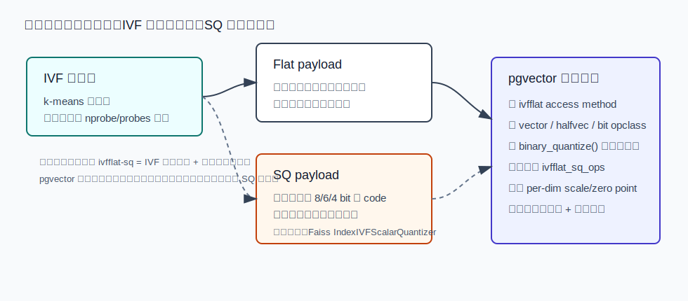
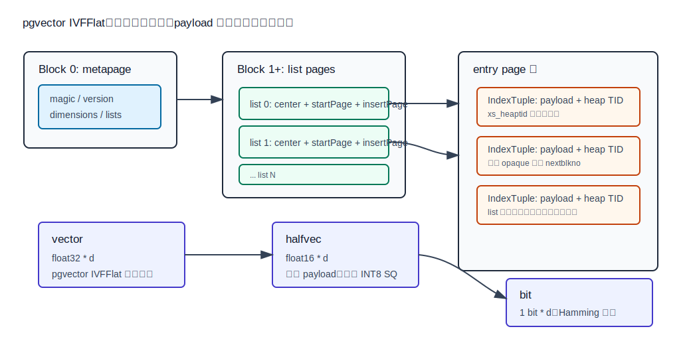
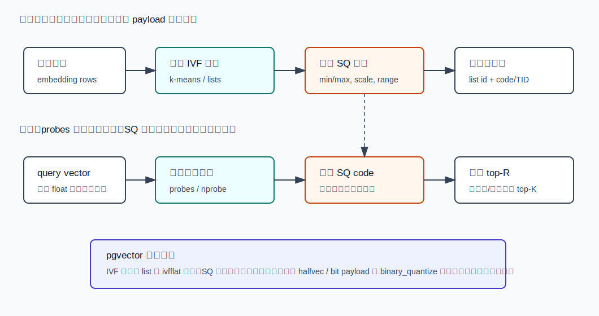
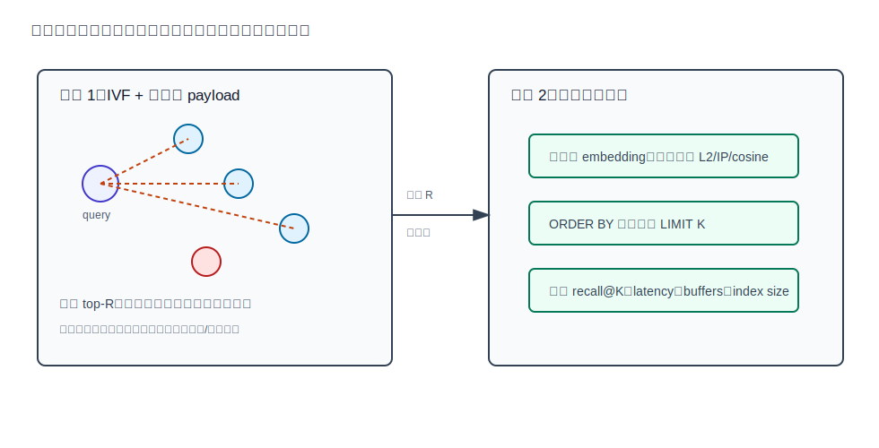
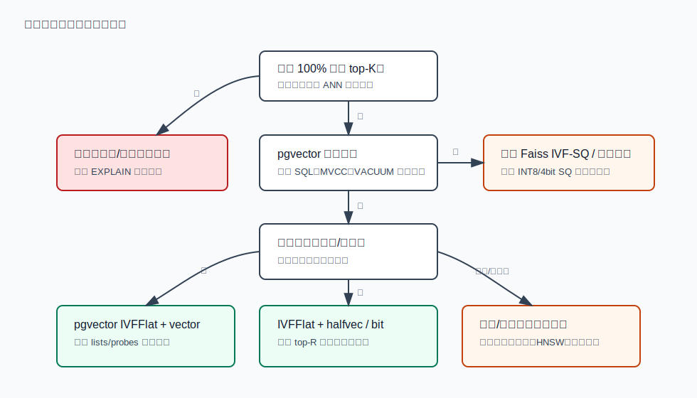

## 数据库筑基课 - ivfflat-sq 索引结构
                                                                                            
### 作者                                                                
digoal                                                                
                                                                       
### 日期                                                                     
2026-05-26                                                      
                                                                    
### 标签                                                                  
PostgreSQL , 应用开发者 , DBA , 数据库筑基课 , 索引结构 , 向量检索 , IVFFlat , SQ , Scalar Quantization , pgvector , Faiss  
                                                                                           
----                                                                    

## 背景
  


本节属于“索引结构”基础能力。当前工作区没有发现“数据库筑基课”总纲文件，因此本文先独立成篇。

向量检索的成本有两个独立维度：**看多少候选**，以及**每个候选多大、多贵**。`ivfflat` 解决第一件事：用 k-means 中心点把向量划到倒排 list，查询时只扫最近的 `probes` 个 list。SQ（Scalar Quantization，标量量化）解决第二件事：把每个维度从 `float32` 压成更低 bit 的表示，例如 8 bit、6 bit、4 bit 或半精度。

先把边界说清楚：本地 `pgvector` 源码没有发现一个叫 `ivfflat_sq_ops`、`ivfsq` 或 INT8 SQ 的独立访问方法。pgvector 当前可直接落地的是：

- `ivfflat` access method；
- `vector`、`halfvec`、`bit` 的 IVFFlat operator class；
- `binary_quantize()` 表达式索引用于二值量化召回；
- 查询后用原始向量重排，降低低精度表示带来的排序误差。

因此本文里的 `ivfflat-sq` 是一个**结构化讨论题**：用 Faiss `IndexIVFScalarQuantizer` 作为严格 IVF-SQ 参照，用 pgvector 源码说明 PostgreSQL 里能落地到哪里、不能假装已经有什么。

主要材料：

- 本地 `pgvector`：`README.md`、`CLAUDE.md`、`sql/vector.sql`、`src/ivfflat.h`、`src/ivfbuild.c`、`src/ivfscan.c`、`src/ivfinsert.c`、`src/ivfvacuum.c`、`src/ivfutils.c`、`src/vector.c`、`src/halfvec.c`。
- 本地 `faiss`：`IndexScalarQuantizer.h`、`IndexScalarQuantizer.cpp`、`impl/ScalarQuantizer.h`、`impl/ScalarQuantizer.cpp`、`index_factory.cpp`。
- DeepWiki `pgvector/pgvector` 的 IVFFlat 页面。
- Jacob 等人的论文 *Quantization and Training of Neural Networks for Efficient Integer-Arithmetic-Only Inference*。
- 用户给出的 *A Survey on Inverted Indices for Vector Search and Quantization Strategies* 未检索到稳定同名公开入口，本文不把它作为已核验来源；相关 IVF / 量化背景以源码和可访问资料交叉说明。

## 一、它解决什么问题？

精确向量检索的基本代价是：

```text
cost_exact ~= N * distance_cost(d)
memory_read ~= N * bytes_per_vector
```

IVFFlat 把 `N` 变小：

```text
cost_ivf ~= lists * center_distance(d)
          + candidates_in_probes_lists * distance_cost(d)
```

SQ 或低精度表示把 `bytes_per_vector` 变小：

```text
float32 payload: d * 4 bytes
float16 payload: d * 2 bytes
SQ8 payload:    d * 1 byte
binary payload: ceil(d / 8) bytes
```

两者结合后的直觉是：

1. IVF 先减少候选数。
2. SQ 再减少每个候选的内存读和距离计算成本。
3. 如果低精度距离会扰乱排序，就扩大候选 top-R，再用原始向量重排成最终 top-K。



图 1 说明：IVF 是候选生成，SQ 是 payload 编码。pgvector 有 IVFFlat，也有 `halfvec`、`bit` 和 `binary_quantize()`，但没有严格意义上的 INT8/4bit `ivfflat_sq_ops`。设计文档必须写清楚真实落地形态。

它付出的代价也很明确：

- IVF 的召回误差来自未探测 list。
- SQ 的排序误差来自低精度编码。
- `halfvec` 是半精度浮点，不是 per-dimension scale/zero point 的 INT8 SQ。
- `binary_quantize()` 是按符号转 bit，更激进，不等同于 SQ8。
- PostgreSQL 仍要处理 MVCC、过滤、回表、VACUUM、WAL 和索引膨胀。

## 二、它是什么？

一句话定义：IVFFlat-SQ 是“用 IVF 粗分桶限制候选范围，用标量量化或低精度表示降低倒排桶内 payload 成本”的 ANN 索引思路。

但不同系统里的名字不完全一样：

| 形态 | 结构含义 | pgvector 当前是否原生支持 |
|---|---|---:|
| `ivfflat` | IVF 粗分桶，list 内保存可直接算距离的 payload | 是 |
| `ivfflat + halfvec` | IVF 粗分桶，list 内保存 half precision payload | 是 |
| `ivfflat + bit` | IVF 粗分桶，list 内保存 bit payload，用 Hamming 距离 | 是 |
| `ivfflat + binary_quantize(expr)` | 表达式索引，把原向量转 bit 后进入 IVFFlat | 语法上可构造，需按 SQL 表达式匹配验证 |
| Faiss `IVF,SQ8` | IVF 粗分桶，list 内保存 SQ8 code | Faiss 支持，pgvector 不等价 |
| 严格 INT8 `ivfflat_sq_ops` | PostgreSQL 类型、opclass、距离函数、WAL/VACUUM 全链路实现 | 当前未发现 |

在 pgvector SQL schema 中，`ivfflat` 是一个 PostgreSQL index access method；`vector_l2_ops`、`vector_ip_ops`、`vector_cosine_ops`、`halfvec_l2_ops`、`halfvec_ip_ops`、`halfvec_cosine_ops`、`bit_hamming_ops` 等 operator class 把类型和距离函数挂到该 access method 上。`src/ivfutils.c` 的 `IvfflatTypeInfo` 又把不同 payload 的最大维度、归一化函数、item size、center 更新和求和函数封装起来。

几个术语先统一：

- **lists / nlist**：倒排 list 数量。pgvector 默认 100，范围 1 到 32768。
- **probes / nprobe**：查询探测多少个 list。pgvector 默认 1。
- **SQ**：每个维度独立低 bit 编码。常见 SQ8 是 1 byte/维，需要训练 range 或 scale。
- **residual SQ**：先减去 IVF 粗中心，再对残差做 SQ。Faiss `IndexIVFScalarQuantizer` 默认 `by_residual = true`。
- **halfvec**：pgvector 半精度浮点向量。它降低 payload 大小，但不是 INT8 SQ。
- **binary quantization**：pgvector `binary_quantize()` 按维度是否大于 0 转 bit，适合粗召回后重排。
- **重排**：低精度索引先取 top-R，再用原始 `embedding` 的真实距离选 top-K。

## 三、核心原理

### 3.1 严格 IVF-SQ：Faiss 里的参照结构

Faiss 的 `IndexIVFScalarQuantizer` 很适合作为严格 IVF-SQ 参照。它继承 `IndexIVF`，内部有一个 `ScalarQuantizer sq`。构造函数接收 `quantizer`、`d`、`nlist`、`qtype`、metric，并把 `code_size` 设置为 `sq.code_size`。`ScalarQuantizer::QuantizerType` 包含 `QT_8bit`、`QT_6bit`、`QT_4bit`、`QT_fp16`、`QT_8bit_direct` 等多种编码。

Faiss `ScalarQuantizer::set_derived_sizes()` 给出了 payload 大小：

```text
QT_8bit: code_size = d
QT_6bit: code_size = ceil(d * 6 / 8)
QT_4bit: code_size = ceil(d / 2)
QT_fp16: code_size = d * 2
QT_0bit: code_size = 0
```

训练上也有边界：`QT_8bit`、`QT_6bit`、`QT_4bit` 会训练 range；`QT_fp16`、`QT_8bit_direct` 等不需要训练；`IndexIVFScalarQuantizer::encode_vectors()` 默认可以先计算 residual，再对 residual 编码。

这说明严格 IVF-SQ 不是“把 float 强转成小整数”这么简单。它至少包括：

1. 粗量化器训练：决定 list。
2. SQ 参数训练：决定每维如何编码。
3. 编码写入倒排 list：保存 code 而不是完整 float。
4. 查询扫描 code：解码或近似算 query-to-code 距离。
5. 必要时 reconstruct 或 rerank。

### 3.2 pgvector IVFFlat：页面结构不变，payload 类型可变

pgvector 的 IVFFlat 物理结构在 `src/ivfflat.h` 和 `src/ivfbuild.c` 里很清楚：

- block 0 是 metapage，保存 magic number、version、dimensions、lists。
- block 1 起是 list pages，每个 `IvfflatListData` 保存 `startPage`、`insertPage` 和 `center`。
- 每个 list 指向自己的 entry page 链。
- entry page 里保存 PostgreSQL `IndexTuple`，tuple 的 key 是被索引 payload，TID 指向 heap tuple。



图 2 说明：pgvector 不因为使用 `halfvec` 或 `bit` 改变 IVFFlat 页面骨架。变化的是 list center 和 entry tuple 中 payload 的表示大小、距离函数和最大维度。`vector` 是 float32，`halfvec` 是 float16，`bit` 是 1 bit/维。

`src/ivfutils.c` 的类型支持函数体现了这点：

- 默认 `vector`：`maxDimensions = IVFFLAT_MAX_DIM`，即 2000。
- `ivfflat_halfvec_support`：最大维度是 `IVFFLAT_MAX_DIM * 2`，即 4000；center 更新时用 `Float4ToHalfUnchecked()`。
- `ivfflat_bit_support`：最大维度是 `IVFFLAT_MAX_DIM * 32`，即 64000；center 更新时按 `x[i] > 0.5` 写 bit。

这不是严格 SQ8，但它已经体现了低精度 payload 对索引工作集的影响。

### 3.3 构建流程：pgvector 只训练 IVF 中心，不训练 SQ scale

pgvector `ivfflatbuild()` 的主路径是：

1. `InitBuildState()` 读取维度、`lists`、operator class 和类型支持函数。
2. `ComputeCenters()` 采样并运行 k-means。
3. `CreateMetaPage()` 写 metapage。
4. `CreateListPages()` 写 list center 和页面指针。
5. `CreateEntryPages()` 扫表、给每条 tuple 找最近 center、按 list 排序、装载 entry pages。

`ComputeCenters()` 里有两个重要参数：

- 目标样本数是 `lists * 50`；
- 最少 10000 个样本；
- 样本少于 `lists` 时会 NOTICE：索引是在少量数据上创建的，会导致低召回。

`src/ivfkmeans.c` 使用 k-means++ 初始化和 Elkan k-means，最多 500 次迭代。对 cosine / inner product 这类需要归一化的路径，样本和中心会归一化；零向量会被跳过或拒绝。

严格 IVF-SQ 还会有第二个训练步骤：SQ range/scale 或其他编码参数。pgvector 当前没有这个步骤。`halfvec` 不需要训练 scale；`binary_quantize()` 也只是按 `> 0` 写 bit。



图 3 说明：严格 IVF-SQ 的构建通常是“训练 IVF 中心 + 训练 SQ 参数 + 写 code”。pgvector 的 `ivfflat` 完成 IVF 中心训练和 list 装载；低精度部分来自具体 payload 类型或表达式，不存在独立 SQ 训练器。

### 3.4 查询流程：`probes` 控制召回，payload 控制桶内成本

pgvector 查询路径在 `src/ivfscan.c`：

1. `ivfflatbeginscan()` 从 metapage 读取 `lists` 和 `dimensions`，并计算 `probes` / `maxProbes`。
2. `GetScanLists()` 遍历所有 list center，计算 query 到 center 的距离，保留最近 list。
3. `GetScanItems()` 扫描这些 list 的 entry page 链，对每个候选 payload 算距离，把 `(distance, tid)` 放进 tuplesort。
4. `ivfflatgettuple()` 从 tuplesort 返回 heap TID。
5. 若启用 iterative scan，候选用完后还能继续扫描更多 list，直到 `maxProbes`。

这里有两个关键点：

- IVFFlat 的近似误差主要由未扫描 list 造成。
- 低精度 payload 的误差由 `halfvec` 精度、`bit` 距离语义或外部 SQ code 近似造成。

如果用低精度路径直接返回 top-K，可能把“召回阶段排序”误当成“最终精确排序”。更稳的方式是 top-R 召回后重排。



图 4 说明：量化索引更适合做第一阶段召回。尤其是 `binary_quantize()` 这种 1 bit/维路径，建议扩大 R，再用原始 `embedding` 的真实距离重排。否则候选排序会同时受 list 探测和量化误差影响。

### 3.5 插入、删除和分布漂移

`src/ivfinsert.c` 的插入流程是：

1. 跳过 NULL。
2. 必要时归一化。
3. 遍历所有 list center，找到最近 list。
4. 形成 `IndexTuple`，写入该 list 的 `insertPage`。
5. 页面满了就追加新 page，并更新 list 元信息。

插入不会重训中心点，也不会因为新数据分布改变而迁移旧 tuple。`src/ivfvacuum.c` 的 VACUUM 负责沿 list entry pages 删除 dead TID，并把有空洞的页面作为新的可插入页候选；它也不会重训 center 或重新量化。

这对 IVFFlat-SQ 特别重要：如果数据分布漂移，粗中心会变差；如果严格 SQ 依赖训练 range，range 也会变差。pgvector 当前没有 SQ range，所以漂移主要影响 IVF center 和 list 负载；`halfvec` / `binary_quantize()` 的误差则要用召回测试观察。

### 3.6 优化器和执行器边界

pgvector `ivfflatcostestimate()` 对没有 `ORDER BY` 距离算子的路径给无穷成本；`ivfflatgettuple()` 没有 order 信息也会报错。也就是说，IVFFlat 服务的是：

```sql
ORDER BY embedding <operator> query
LIMIT k
```

不是任意 `WHERE` 加速器。

过滤条件通常在索引候选返回后发生。README 也提醒，近似索引叠加过滤时可能返回更少结果；0.8.0 起的 iterative scan 可以继续扫描更多候选。对于 `ivfflat`，可用：

```sql
SET ivfflat.iterative_scan = relaxed_order;
SET ivfflat.max_probes = 100;
```

如果过滤选择性很强，先考虑普通 B-tree、分区、局部向量索引，或者把 tenant/category 等条件纳入物理布局，而不是只调大 `probes`。

## 四、横向对比

| 维度 | pgvector IVFFlat + vector | pgvector IVFFlat + halfvec | pgvector IVFFlat + bit / binary_quantize | 严格 IVF-SQ8 | IVF-PQ | HNSW |
|---|---|---|---|---|---|---|
| 候选生成 | IVF list | IVF list | IVF list | IVF list | IVF list | 图导航 |
| 桶内 payload | float32 向量 | float16 向量 | bit 向量 | 每维 8 bit code | 子空间 PQ code | 原始或低精度向量 |
| pgvector 原生状态 | 支持 | 支持 | `bit` 支持；表达式路径需匹配查询 | 当前未发现 | 当前未发现 | 支持 |
| 是否训练 payload 编码 | 不需要 | 不需要 | 不需要 | 通常需要 range/scale | 需要 PQ codebook | 不需要 |
| 主要误差 | 未探测 list | 未探测 list + 半精度误差 | 未探测 list + 二值语义误差 | 未探测 list + SQ 误差 | 未探测 list + PQ 误差 | 图搜索误差 |
| 空间收益 | 无低精度收益 | payload 约减半 | payload 约 1 bit/维 | payload 约 1 byte/维 | 常比 SQ 更压缩 | 取决于图边和 payload |
| 重排必要性 | 看召回要求 | 建议验证 | 强烈建议 | 常见建议 | 常见建议 | 看低精度与召回要求 |
| 写入维护 | 追加到最近 list | 同左 | 同左 + 表达式计算 | 编码后追加 | 编码后追加 | 维护图边 |
| 适合场景 | 质量优先的 IVFFlat 基线 | 内存敏感、希望温和降精度 | 大规模粗召回、可重排 | 专用向量引擎或自研扩展 | 十亿级压缩检索 | 召回/延迟优先 |
| 不适合场景 | 超大内存压力 | 不能接受半精度误差 | 不重排还要求高精度 | 只使用当前 pgvector 原生能力 | 不想引入复杂训练和近似距离 | 构建/内存预算紧 |

这张表背后的核心判断是：不要把“低精度”当成一种单一技术。`halfvec`、binary quantization、SQ8、PQ 的误差形态完全不同，调参方式也不同。

## 五、效果如何？

不要脱离数据集给固定性能数字。IVFFlat-SQ 类设计的收益至少由这些因素决定：

- **维度**：维度越高，payload 缩小越可能降低内存带宽压力。
- **list 负载均衡**：k-means center 质量差会导致部分 list 过长。
- **`lists` 和 `probes`**：`probes/lists` 越大，召回通常越好，扫描越贵。
- **低精度误差**：`halfvec` 通常温和；`binary_quantize()` 更激进；SQ8 介于二者之间但 pgvector 当前没有原生实现。
- **过滤条件**：过滤后置会放大“候选不足”问题。
- **重排 R/K 比例**：R 越大越可能恢复最终 top-K，但回表和精确距离计算越多。
- **数据漂移**：新增数据只分配到旧中心点，不触发重训。

一个可操作的评估指标集：

```text
recall@K        = approximate_topK 与 exact_topK 的交集比例
p95_latency     = 业务可接受延迟
index_size      = pg_relation_size(index)
buffer_reads    = EXPLAIN (ANALYZE, BUFFERS)
rerank_rows     = top-R 回表数量
write_cost      = INSERT/UPDATE 延迟与 WAL
maintenance     = VACUUM/REINDEX 周期
```

## 六、实操 DEMO

下面 SQL 按 pgvector README 与本地 `sql/vector.sql` 支持的函数和 opclass 编写。当前工作区没有启动 PostgreSQL、安装扩展、加载数据，因此本文未执行 SQL，也不提供虚构 `EXPLAIN ANALYZE` 输出。

### 6.1 建立精确基线

```sql
CREATE EXTENSION IF NOT EXISTS vector;

CREATE TABLE items (
    id bigserial PRIMARY KEY,
    category_id int NOT NULL,
    embedding vector(3) NOT NULL
);

INSERT INTO items (category_id, embedding)
SELECT
    (i % 10),
    ARRAY[random(), random(), random()]::vector
FROM generate_series(1, 100000) AS s(i);

-- 精确 top-K，用于评估召回
SELECT id
FROM items
ORDER BY embedding <-> '[0.2,0.4,0.6]'::vector
LIMIT 10;
```

### 6.2 IVFFlat + vector

```sql
CREATE INDEX items_embedding_ivfflat_l2
ON items USING ivfflat (embedding vector_l2_ops)
WITH (lists = 100);

SET ivfflat.probes = 10;

EXPLAIN (ANALYZE, BUFFERS)
SELECT id, embedding <-> '[0.2,0.4,0.6]'::vector AS distance
FROM items
ORDER BY embedding <-> '[0.2,0.4,0.6]'::vector
LIMIT 10;
```

### 6.3 IVFFlat + halfvec 表达式索引

如果原表保留 `vector`，但索引希望用 `halfvec` 降低 payload，可使用表达式索引。查询表达式要和索引定义匹配。

```sql
CREATE INDEX items_embedding_half_ivfflat_l2
ON items USING ivfflat ((embedding::halfvec(3)) halfvec_l2_ops)
WITH (lists = 100);

SET ivfflat.probes = 10;

SELECT id
FROM items
ORDER BY embedding::halfvec(3) <-> '[0.2,0.4,0.6]'::halfvec(3)
LIMIT 20;
```

### 6.4 二值量化召回 + 原始向量重排

`binary_quantize()` 把每个维度按符号转 bit，适合粗召回。最终排序建议回到原始向量。

```sql
CREATE INDEX items_embedding_bin_ivfflat_hamming
ON items USING ivfflat ((binary_quantize(embedding)::bit(3)) bit_hamming_ops)
WITH (lists = 100);

WITH candidates AS MATERIALIZED (
    SELECT id, embedding
    FROM items
    ORDER BY binary_quantize(embedding)::bit(3)
             <~> binary_quantize('[0.2,-0.4,0.6]'::vector)::bit(3)
    LIMIT 100
)
SELECT id, embedding <=> '[0.2,-0.4,0.6]'::vector AS cosine_distance
FROM candidates
ORDER BY embedding <=> '[0.2,-0.4,0.6]'::vector
LIMIT 10;
```

### 6.5 召回率对照查询

```sql
WITH exact AS MATERIALIZED (
    SELECT id
    FROM items
    ORDER BY embedding <-> '[0.2,0.4,0.6]'::vector
    LIMIT 10
),
approx AS MATERIALIZED (
    SELECT id
    FROM items
    ORDER BY embedding::halfvec(3) <-> '[0.2,0.4,0.6]'::halfvec(3)
    LIMIT 10
)
SELECT count(*)::float / 10 AS recall_at_10
FROM exact
JOIN approx USING (id);
```

## 七、最佳实践

### 面向数据库架构师

- 把 IVFFlat-SQ 拆成两层验收：`lists/probes` 的候选召回，以及低精度 payload 的排序误差。不要只看总体延迟。
- 如果使用 pgvector，设计文档中写清楚真实实现：`ivfflat + halfvec`、`ivfflat + bit`、`binary_quantize()` 表达式索引，而不是写“pgvector 原生 SQ8”。
- 对强过滤 workload，优先考虑分区、局部索引、普通字段索引和数据布局，让过滤尽早缩小候选范围。
- 对分布漂移明显的业务，设计 `REINDEX CONCURRENTLY` 或滚动重建窗口。

### 面向 DBA

- 建 IVFFlat 前先导入足够数据。样本少于 `lists` 会有低召回风险。
- 记录 `pg_relation_size()`、`pg_stat_user_indexes`、`EXPLAIN (ANALYZE, BUFFERS)`、召回率和重排行数。
- `maintenance_work_mem` 会影响 k-means 和构建排序，建大索引前要评估内存。
- 使用 `ivfflat.iterative_scan = relaxed_order` 和 `ivfflat.max_probes` 缓解过滤后结果不足，但要观察延迟。
- 对 dead tuple 多、分布漂移明显的表，VACUUM 只能清死 TID，不能重训 center。

### 面向业务开发者

- SQL 必须写成 `ORDER BY 向量距离 LIMIT K`，否则 IVFFlat 没有 KNN 语义。
- 表达式索引要保持查询表达式一致，例如 `embedding::halfvec(768)` 或 `binary_quantize(embedding)::bit(768)`。
- 不要把 `binary_quantize()` 的 Hamming top-K 直接当最终语义相似 top-K；先取 top-R，再用原始向量重排。
- 每次换 embedding 模型、维度、归一化方式，都要重新测召回与参数。

## 八、适合与不适合场景

适合：

- 数据已有一定规模，能先 bulk load 再建 IVFFlat。
- 在线查询以近邻 top-K 为主，能接受 ANN 召回误差。
- 内存或缓存压力明显，希望用 `halfvec` 或 bit 表达式路径降低索引 payload。
- RAG、推荐、去重等场景允许“两阶段召回 + 精排”。
- 有能力用业务验证集持续记录 recall@K。

不适合：

- 必须 100% 精确 top-K，且不能接受任何低精度误差。
- 高频更新、数据分布持续漂移，却没有重建窗口。
- 过滤条件非常强，但过滤字段没有参与物理分区或普通索引设计。
- 希望直接获得严格 SQ8/4bit 原生 pgvector 索引能力。
- 只看 benchmark 延迟，不愿维护召回率和重排指标。



图 5 说明：先判断业务是否允许近似，再判断是否必须在 pgvector 内完成。如果需要严格 SQ8/4bit，当前 pgvector 不是直接答案；如果只是希望降低工作集，可以从 `halfvec`、`bit` 和重排路径开始验证。

## 九、常见坑

1. **把 `ivfflat-sq` 当成 pgvector 已存在索引类型**  
   本地 README、SQL schema 和源码未发现独立 `ivfflat_sq_ops`。能用的是现有类型、opclass 和表达式索引。

2. **把 `halfvec` 当成 INT8 SQ**  
   `halfvec` 是 16 bit 浮点表示，不需要训练 per-dimension range；严格 SQ8 通常需要 range/scale。

3. **把 `binary_quantize()` 当成 SQ8**  
   它是 1 bit 符号量化。空间小，但排序误差更大，通常要重排。

4. **只调 `lists`，不调 `probes`**  
   `lists` 决定桶数，`probes` 决定每次看多少桶。桶多但 probes 太小，召回会掉。

5. **空表或小表先建 IVFFlat**  
   中心点训练质量差，README 和源码都会提示低召回风险。

6. **忽略表达式匹配**  
   `embedding::halfvec(768)` 和 `embedding` 不是同一个索引表达式。查询写法要匹配索引定义。

7. **过滤条件后置导致 LIMIT 不足**  
   向量索引先返回近邻候选，SQL 过滤后可能剩不够 K 条。需要普通索引、分区、partial index 或 iterative scan 协同。

8. **用 VACUUM 期待重训中心点**  
   VACUUM 清 dead TID，不重训 k-means center，也不重新分配旧 tuple。

9. **没有精确基线就谈召回**  
   每个数据集都要先跑 exact top-K，再比较 approximate top-K。

## 十、扩展问题

1. 如果要给 pgvector 增加严格 SQ8 IVFFlat，需要新增哪些 SQL 类型、opclass、距离函数、升级脚本和 WAL/VACUUM 逻辑？
2. `halfvec` 和 SQ8 都能降低 payload，为什么它们的误差模型不同？
3. 在强过滤场景，应该先增加 `probes`，还是先改数据分区和普通索引？怎么验证？
4. 为什么 `binary_quantize()` 更适合召回 top-R，而不是直接产出最终 top-K？
5. 如果 embedding 模型升级导致向量分布改变，如何设计无停机重建和召回回归测试？

## 十一、扩展阅读

- pgvector README：`pgvector/README.md`，IVFFlat、halfvec、binary quantization、iterative scan、scaling 章节。
- pgvector SQL 定义：`pgvector/sql/vector.sql`，`ivfflat` access method、`vector` / `halfvec` / `bit` operator classes。
- pgvector IVFFlat 源码：`pgvector/src/ivfflat.h`、`ivfbuild.c`、`ivfscan.c`、`ivfinsert.c`、`ivfvacuum.c`、`ivfutils.c`、`ivfkmeans.c`。
- pgvector 低精度函数：`pgvector/src/halfvec.c`、`pgvector/src/vector.c` 中的 `binary_quantize()`。
- DeepWiki: [IVFFlat Index | pgvector/pgvector](https://deepwiki.com/pgvector/pgvector/5.2-ivfflat-index)。
- Faiss 源码：`faiss/faiss/IndexScalarQuantizer.h`、`IndexScalarQuantizer.cpp`、`impl/ScalarQuantizer.h`、`impl/ScalarQuantizer.cpp`、`index_factory.cpp`。
- Faiss C++ API: [IndexScalarQuantizer](https://faiss.ai/cpp_api/struct/structfaiss_1_1IndexScalarQuantizer.html)。
- Jacob, Kligys, Chen, Zhu, Tang, Howard, Adam, Kalenichenko: [Quantization and Training of Neural Networks for Efficient Integer-Arithmetic-Only Inference](https://arxiv.org/abs/1712.05877)。
- PostgreSQL 文档：[Index Access Method Interface](https://www.postgresql.org/docs/current/index-api.html)。

## 校验说明

- pgvector 是否支持严格 INT8 IVFFlat-SQ 已通过本地 README、SQL schema、`ivf*` 源码和 DeepWiki 交叉核对：当前未发现独立 `ivfflat_sq` 类型或 operator class。
- SQL 示例按 pgvector README 和 `sql/vector.sql` 整理；当前未启动 PostgreSQL 实例，未执行，不提供伪造输出。
- 用户给出的同名 Survey 论文未找到稳定公开入口，未作为已核验引用。
  
## 附录  
  
1、问 gemini  
```  
ivfflat-sq 索引结构相关的论文、开源项目.
```  
  
2、克隆代码  
```  
git clone --depth 1 https://github.com/pgvector/pgvector
```  
  
3、启用 codex, 使用 [数据库筑基课 skill](../skills/README.md).  
````
文章标题: 
  数据库筑基课 - ivfflat-sq 索引结构
项目源码(已克隆到当前项目如下目录中):  
  pgvector
论文: 
  Quantization and Training of Neural Networks for Efficient Integer-Arithmetic-Only Inference
  A Survey on Inverted Indices for Vector Search and Quantization Strategies
项目 deepwiki reponame:  
  pgvector/pgvector
项目参考信息: 
  pgvector/CLAUDE.md
````
  
  
#### [PostgreSQL 解决方案集合](../201706/20170601_02.md "40cff096e9ed7122c512b35d8561d9c8")
  
  
#### [德哥 / digoal's Github - 公益是一辈子的事.](https://github.com/digoal/blog/blob/master/README.md "22709685feb7cab07d30f30387f0a9ae")
  
  
#### [About 德哥](https://github.com/digoal/blog/blob/master/me/readme.md "a37735981e7704886ffd590565582dd0")
  
  

  
