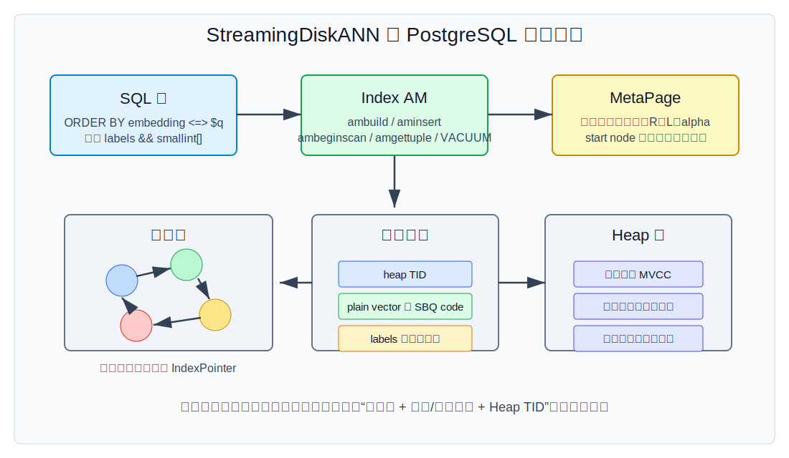
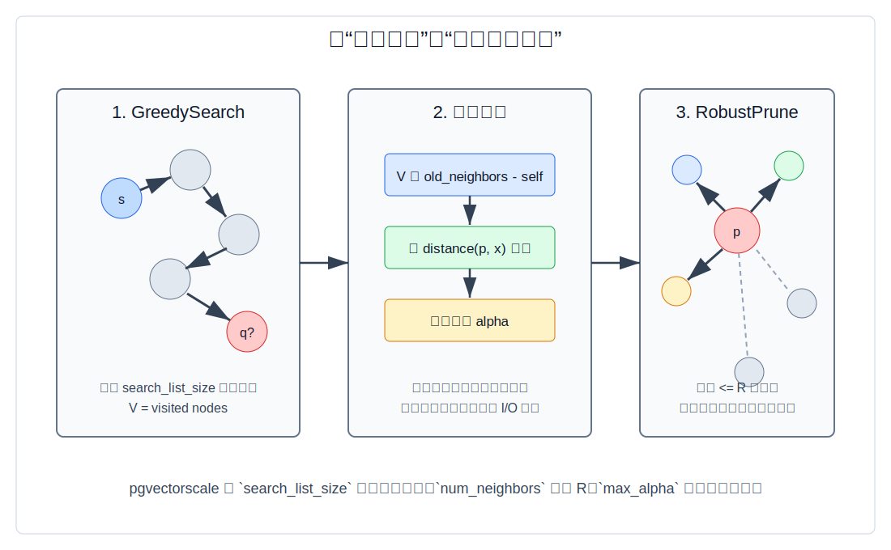
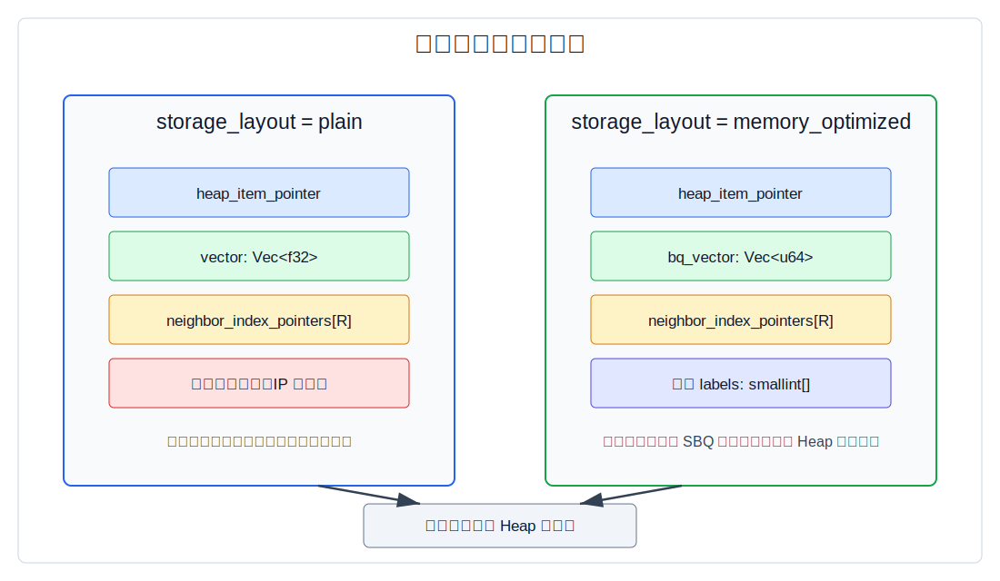
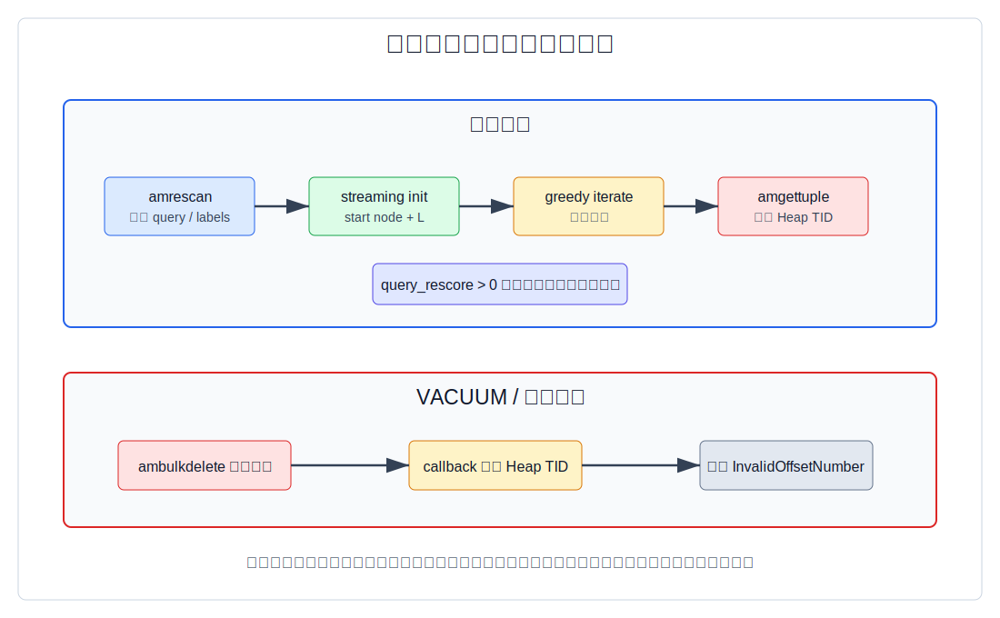
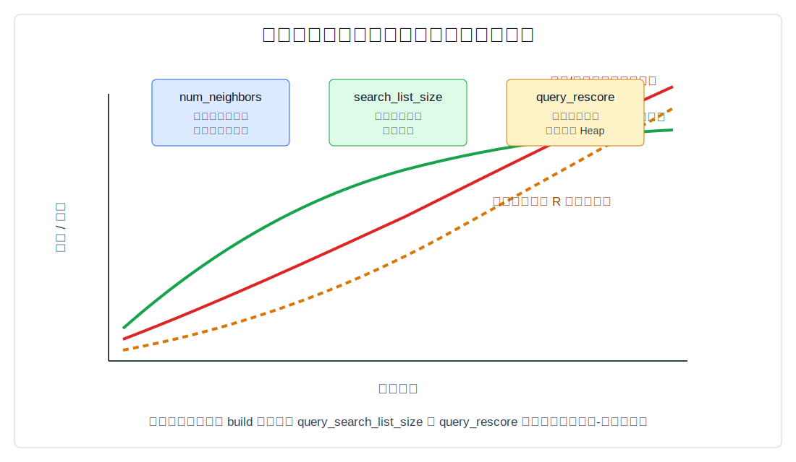

## 数据库筑基课 - DiskANN 索引结构
                                                                                            
### 作者                                                                
digoal                                                                
                                                                       
### 日期                                                                     
2026-05-26                                                      
                                                                    
### 标签                                                                  
PostgreSQL , 应用开发者 , DBA , 数据库筑基课 , 索引结构 , 向量检索 , DiskANN , StreamingDiskANN , pgvectorscale  
                                                                                           
----                                                                    

## 背景


本节属于“索引结构”基础能力。当前工作区没有发现“数据库筑基课”总纲文件，因此本文先独立成篇。

向量检索在数据库里会遇到一个很现实的问题：业务希望把 embedding、原始业务行、权限条件、事务可见性和 SQL 查询放在同一个 PostgreSQL 里；但向量维度高、数据量大，精确 KNN 又近似等于全表扫描。1 亿条 768 维 `float4` 向量，原始向量本身约 286GB，还没有算表行、索引边、WAL、缓存、VACUUM 和副本。

DiskANN 这一类索引想解决的不是“让近邻搜索变成精确 B-tree 查找”，而是把问题改写成：

- 少看候选：用可导航图从一个入口点开始，沿着越来越接近 query 的边走。
- 少占内存：把大部分图和向量放在磁盘或 PostgreSQL 索引页里，只把必要结构、缓存和压缩表示用于快速判别。
- 可调准确率：用候选宽度、出边数、量化、重排，在召回率、延迟、构建时间、空间成本之间调平衡。

本文以三类资料为主线：

- 理论算法：NeurIPS 2019 论文 [DiskANN: Fast Accurate Billion-point Nearest Neighbor Search on a Single Node](https://papers.nips.cc/paper_files/paper/2019/hash/09853c7fb1d3f8ee67a61b6bf4a7f8e6-Abstract.html) 和 arXiv 论文 [FreshDiskANN: A Fast and Accurate Graph-Based ANN Index for Streaming Similarity Search](https://arxiv.org/abs/2105.09613)。
- PostgreSQL 产品化实现参照：[Azure Database for PostgreSQL 的 DiskANN 文档](https://learn.microsoft.com/en-us/azure/postgresql/extensions/how-to-use-pgdiskann)。
- 本地源码：`pgvectorscale` 项目，重点是 `pgvectorscale/pgvectorscale/src/access_method/` 下的 build、scan、graph、storage、vacuum、labels、sbq 代码，以及 `pgvectorscale/CLAUDE.md`。

一个必须提前说明的差异：微软原始 DiskANN 论文里的系统设计是“Vamana 图 + SSD + PQ 缓存 + full-precision rerank”；Azure `pg_diskann` 文档显式提供 product quantization 参数；本地 `pgvectorscale` 的 `diskann` access method 则默认使用 `memory_optimized`，源码里对应的是 SBQ，即 Statistical Binary Quantization，而不是 PQ。本文会把算法思想、Azure 形态和 pgvectorscale 实现边界分开讲。

## 一、它解决什么问题？

精确 KNN 的基本代价是 `O(N * d)`：每次查询都要把 query 和 N 条 d 维向量算一遍距离。数据库里这相当于“没有选择性条件的全表扫描”，只是扫描单位从行变成了高维向量。

传统办法有几类：

| 做法 | 优点 | 问题 |
|---|---|---|
| 精确全表扫描 | 结果准确，逻辑简单 | 大数据低延迟场景不可接受 |
| B-tree / Hash | 适合一维或等值条件 | 高维距离没有天然全序键 |
| IVF / IVFFlat | 聚类分桶后少扫一部分 | 分桶边界会漏召回，需要调 `nprobe` |
| HNSW | 内存图搜索快，召回高 | 图和向量常驻内存成本高，数据库更新治理复杂 |
| DiskANN / Vamana | 面向 SSD 和大规模高召回，减少随机 I/O | 构建、压缩、重排、删除维护都有代价 |

DiskANN 论文指出，大规模 ANN 有三个同时要满足的目标：高召回、低延迟、高密度。它的核心挑战是 SSD 随机读虽快，但如果一次查询要几百次随机读，延迟仍然不可接受；因此系统要把随机读控制在少量 round trip 内，并尽量让一次读带回邻居、向量或可重排信息。

放到 PostgreSQL 里，问题又多一层：索引不能只返回向量 id，还要返回 Heap TID；执行器要处理 MVCC 可见性；`CREATE INDEX`、`INSERT`、`VACUUM`、opclass、GUC、planner cost 都要接上。这就是 pgvectorscale 的价值点：把 DiskANN/Vamana 类图索引落成一个 PostgreSQL index access method。

代价也要讲清楚：

- 它是近似索引，不保证精确 top-k。
- 图边会占空间；`num_neighbors` 越大，召回通常越好，但索引更大、遍历更慢。
- 压缩表示会引入距离误差；需要 `query_rescore` 读取完整向量做重排。
- 删除不是“立刻重建全图”；长期高 churn workload 需要观察死节点比例、召回变化和重建窗口。
- 带标签过滤、并行构建、plain/SBQ、内积距离之间存在实现限制。

## 二、它是什么？

一句话定义：DiskANN 索引是一种用可导航邻接图生成少量候选、再用压缩或完整向量距离排序的近似 KNN 索引结构；在 pgvectorscale 里，它被实现成 PostgreSQL 的 `diskann` index access method。



图 1 说明：SQL 层只看到 `ORDER BY embedding <=> query LIMIT k` 这样的 pgvector 语法；access method 层负责 `ambuild`、`aminsert`、`amrescan`、`amgettuple`、`ambulkdelete` 等 PostgreSQL 接口；索引节点保存图邻居、压缩或原始向量表示、Heap TID，完整事务可见性仍然交给 Heap/执行器体系。

几个术语先统一：

- **ANNS**：Approximate Nearest Neighbor Search，近似最近邻搜索。
- **Vamana**：DiskANN 论文提出的图构建算法，核心是 GreedySearch 生成候选，再用 RobustPrune 控制度数和边的多样性。
- **R / num_neighbors**：每个节点最多保存多少出边。pgvectorscale 的 `num_neighbors` 对应这个角色。
- **L / search_list_size**：构建或查询时的候选宽度。pgvectorscale 构建期参数叫 `search_list_size`，查询期 GUC 叫 `diskann.query_search_list_size`。
- **alpha / max_alpha**：RobustPrune 中控制剪枝强度的参数。pgvectorscale 默认 `max_alpha = 1.2`。
- **SBQ**：Statistical Binary Quantization。pgvectorscale 默认 `memory_optimized` 布局使用它压缩向量，而不是原始 DiskANN 论文中常见的 PQ。
- **rescore / rerank**：先用索引中的近似表示找候选，再回表或读取完整向量计算精确距离并重排。
- **label filtering**：把 `smallint[]` labels 列一起放进索引，用 `&&` overlap 条件参与图搜索，而不是只做普通 WHERE 后过滤。

从源码看，`access_method/mod.rs` 注册了 `diskann` access method，并把 PostgreSQL AM 回调连接到 build、scan、vacuum、cost estimate 和 options 代码；它也定义了 `vector_cosine_ops`、`vector_l2_ops`、`vector_ip_ops` 和 `smallint[]` label opclass。对应源码：`pgvectorscale/pgvectorscale/src/access_method/mod.rs`。

## 三、核心原理

### 3.1 从图搜索看：GreedySearch 不是找 k 个，而是维护候选宽度

DiskANN 论文里的 GreedySearch 从 start node 出发，维护一个候选集合 `L` 和已访问集合 `V`。每次选择候选里离 query 最近且未访问的点，展开它的出边，把新邻居加入候选，再把候选裁到宽度 `L`。最后从候选或访问集合里取 top-k。

pgvectorscale 源码里的注释说得很直接：greedy search 并不需要 `K` 参数，而是用 `search_list_size`；它会一直搜索到已经评估了最接近的 `search_list_size` 个节点，然后结果层再取前 K 个。对应实现是 `Graph::greedy_search_for_build`、`Graph::greedy_search_streaming_init` 和 `Graph::greedy_search_iterate`，见 `pgvectorscale/pgvectorscale/src/access_method/graph/mod.rs`。

### 3.2 从建图看：候选生成 + RobustPrune + 回边

Vamana 建图的关键不是“每个点连最近 R 个点”这么简单。论文的逻辑是：

1. 对待插入点 `p`，从 start node 对 `p` 执行 GreedySearch。
2. 把访问过的点作为候选集。
3. 对 `p` 执行 RobustPrune，保留不超过 `R` 条出边。
4. 对每个新邻居添加回边；如果邻居度数超限，再对邻居剪枝。



图 2 说明：候选宽度解决“看哪些点”，RobustPrune 解决“留下哪些边”。`alpha` 的作用是鼓励保留不同方向的边，减少局部近邻冗余。pgvectorscale 的 `Graph::prune_neighbors` 会先按距离排序候选，再逐步扩大 `alpha`，直到结果达到 `num_neighbors` 或 `max_alpha` 上限。

这类图索引真正的工程 tradeoff 在这里：边太少，图不连通或容易陷入局部最优；边太多，索引膨胀，查询访问更多节点，SSD/缓存压力上升。

### 3.3 从存储看：pgvectorscale 有 plain 和 memory_optimized 两种布局

pgvectorscale 的 `Storage` trait 抽象了节点创建、距离计算、邻居读取、重排距离、访问候选等操作。它有两个主要实现：

- `plain`：节点保存完整 `Vec<f32>` 向量。
- `memory_optimized`：节点保存 SBQ 压缩后的 `Vec<u64>`，默认布局。



图 3 说明：两种布局都要保存 Heap TID 和邻居指针；`memory_optimized` 保存的是 `bq_vector`，并且可以带 labels；完整向量仍在 Heap 表行里，因此查询重排时可以读取完整向量计算真实距离。

源码里的边界非常具体：

- `build.rs` 定义 `MAX_DIMENSION = 16000`，但 `plain` 不使用 SBQ 时最大索引维度是 `MAX_DIMENSION_NO_SBQ = 2000`。
- `get_meta_page` 禁止 inner product 使用 `plain` storage。
- `get_meta_page` 禁止 label filtering 使用 `plain` storage。
- `storage.rs` 里默认 `DEFAULT_STORAGE_TYPE_STR = "memory_optimized"`。
- `sbq/node.rs` 中经典节点保存 `heap_item_pointer`、`bq_vector`、`neighbor_index_pointers`；带标签节点额外保存 `labels`。

SBQ 不是 PQ。`sbq/quantize.rs` 里的量化器先训练每个维度的均值和可选方差；1 bit 时判断 `v > mean[i]`，多 bit 时基于 z-score 分段并写入 bit。它的空间估算可以粗略写成：

```text
SBQ bytes ≈ ceil(num_dimensions_to_index * num_bits_per_dimension / 64) * 8
```

例如 `1536` 维、`2` bit/dim，压缩向量约 `ceil(3072 / 64) * 8 = 384` 字节；原始 `float4[1536]` 是 `6144` 字节。注意这只是节点里的压缩向量部分，不能代表完整索引大小，因为邻居指针、page header、rkyv 序列化、labels、meta page、quantizer metadata 都要另算。

### 3.4 从构建路径看：先训练量化器，再扫描 Heap 建图

`ambuild` 的路径大致是：

1. 读取 index reloptions，形成 `TSVIndexOptions`。
2. 根据 opclass 确定距离类型，创建并写入 `MetaPage`。
3. 如果是 `memory_optimized`，先扫描 Heap 训练 SBQ quantizer，并把量化元数据写入索引。
4. 扫描 Heap，把每条非 NULL 向量写成索引节点。
5. 对每个节点执行图插入：GreedySearch 找候选、RobustPrune 选邻居、更新回边。
6. 如果编译启用并满足条件，使用 parallel build。

并行构建有明确条件：`build_parallel` 特性开启、没有 labels、storage 是 `SbqCompression`，并且行数达到 `diskann.min_vectors_for_parallel_build` 阈值，或通过 `diskann.force_parallel_workers` 强制。README 也说明 label-based filtering 暂不支持 parallel build。

### 3.5 从查询路径看：它是“流式产出候选 + 可选精确重排”

pgvectorscale 的 scan 路径由 `ambeginscan`、`amrescan`、`amgettuple` 组成：

- `ambeginscan` 初始化 scan state，并读取 meta page。
- `amrescan` 要求一个 order-by key，解析 query vector 和可选 label filter，读取 `diskann.query_search_list_size`。
- `TSVResponseIterator` 初始化图搜索状态。
- `amgettuple` 反复从 iterator 取下一个候选 Heap TID。
- 如果是 SBQ，或者 plain 只索引了部分维度，就走 `next_with_resort`，用完整向量距离重排。



图 4 说明：图搜索先给出候选，`query_rescore` 控制读取多少候选做完整向量距离重排；VACUUM 不是查询路径的一部分，它扫描索引页并把已删除 Heap TID 对应的节点标记为删除。查询消费候选时会跳过 `InvalidOffsetNumber` 的节点。

这解释了 README 里“relaxed ordering”的含义：索引是流式返回近似候选，结果可能略微不按真实距离排序。如果业务必须严格按距离排序，可以用 materialized CTE 对返回的小候选集再排序。

### 3.6 从删除与更新看：FreshDiskANN 思想和 PostgreSQL VACUUM 不是一回事

FreshDiskANN 论文关注 streaming dataset：实时 insert、delete、search，同时后台把短期内存索引合并进长期 SSD 索引。论文的核心贡献包括 FreshVamana 更新规则和 StreamingMerge，让大规模索引在有限内存下保持新鲜度。

pgvectorscale 在数据库里的更新路径更 PostgreSQL 化：

- `aminsert` 对单条新索引元组加索引级 advisory transaction lock，写节点并插入图。
- `ambulkdelete` 在 VACUUM 时扫描索引页，调用 PostgreSQL 提供的 callback 判断 Heap TID 是否已删。
- 删除命中后调用 `NodeVacuum::delete`，把节点 Heap pointer 置为 invalid。
- 查询时如果遇到 deleted tuple，就继续取下一个候选。

所以不要把 pgvectorscale 的 VACUUM 行为理解成 FreshDiskANN 论文里的 StreamingMerge。它支持 PostgreSQL 语义下的插入和删除标记，但长期高频更新后的图质量、死节点比例、空间回收和重建策略仍然需要业务自己监控。

## 四、横向对比

| 维度 | pgvectorscale StreamingDiskANN | Azure `pg_diskann` | 原始 DiskANN 论文系统 | pgvector HNSW | pgvector IVFFlat |
|---|---|---|---|---|---|
| 主要目标 | PostgreSQL 内高性能向量索引，默认 SBQ 压缩 | Azure PostgreSQL 中的 DiskANN 扩展 | 单机 SSD 上十亿级高召回 ANN | 内存图 ANN | 聚类倒排 ANN |
| 图结构 | Vamana/DiskANN 风格邻接图 | DiskANN 图索引 | Vamana 图，面向 SSD round trip 优化 | HNSW 多层图 | 无图，list/probe |
| 压缩 | `memory_optimized` 使用 SBQ；`plain` 存完整向量 | 文档支持 PQ 参数 | PQ 缓存在内存，完整向量在磁盘重排 | 通常存向量和图 | 可配合量化变体，但 pgvector IVFFlat 本身是聚类 |
| PostgreSQL 集成 | Rust/PGRX index AM，支持 opclass、VACUUM、labels | 托管扩展，SQL 使用 `USING diskann` | 不是 PostgreSQL AM | pgvector 内置 AM | pgvector 内置 AM |
| 构建参数 | `num_neighbors`、`search_list_size`、`max_alpha`、`num_dimensions`、`num_bits_per_dimension` | `max_neighbors`、`l_value_ib`、`product_quantized`、PQ chunks 等 | R、L、alpha、beam width、PQ/cache 策略 | `m`、`ef_construction` | `lists` |
| 查询参数 | `diskann.query_search_list_size`、`diskann.query_rescore` | `diskann.iterative_search`、`l_value_is` 等文档参数 | beam width、search list、cache/rerank | `hnsw.ef_search` | `ivfflat.probes` |
| 过滤 | `smallint[]` labels 可进入索引；普通 WHERE 是后过滤 | 文档侧重点在索引和 PQ | 论文主要讲向量搜索系统 | 一般依赖后过滤或迭代扫描 | 一般依赖后过滤或迭代扫描 |
| 删除维护 | VACUUM 标记节点删除，查询跳过 | 文档强调 REINDEX 处理版本不兼容 | FreshDiskANN 另有 streaming merge 论文 | 删除维护取决于实现 | 删除维护取决于实现 |
| 适合 | PostgreSQL 内 embedding 检索、读多写适中、需要 SQL/事务集成 | Azure 托管 PostgreSQL 用户 | 专用向量服务/底层系统设计 | 内存足、追求高召回低延迟 | 大规模批量、可接受聚类调参 |
| 不适合 | 强精确 top-k、高 churn 且不愿重建、复杂非 label 过滤强依赖索引内过滤 | 非 Azure 或需要源码级控制 | 直接作为数据库 AM 使用 | 内存预算紧张 | 召回对聚类边界敏感 |

表里的关键差异是：同叫 DiskANN，实现侧重点不一样。原始论文重点是 SSD-resident ANN 系统；Azure 文档重点是托管 PostgreSQL 扩展和 PQ 参数；pgvectorscale 的源码重点是 PostgreSQL AM 与 SBQ/label/scan/vacuum 的结合。

## 五、效果如何？

不要把论文 benchmark 直接搬到自己的生产库。DiskANN 论文在 SIFT1B 上报告了单机 SSD、64GB RAM、高召回低延迟的结果；FreshDiskANN 论文报告了十亿点、实时插删查和背景合并的系统实验；pgvectorscale README 也给出过与 Pinecone 的 benchmark 对比。这些数字都依赖硬件、数据分布、维度、召回定义、候选参数、过滤条件和缓存状态。

更可靠的理解方式是看代价模型：

```text
单次查询近似成本
≈ 图上访问的节点数 * 每节点邻居读取/距离计算
  + query_rescore 个候选的完整向量距离
  + Heap 可见性/回表成本
  + label 或普通 WHERE 过滤成本
```

```text
索引空间近似成本
≈ N * 节点头与 Heap TID
  + N * 压缩向量或完整向量
  + N * num_neighbors * IndexPointer
  + labels / meta / quantizer metadata
  + page、rkyv、对齐和空洞成本
```



图 5 说明：提高候选宽度、出边数、重排数，通常能提高召回，但延迟、构建时间和空间也会上升。真正应该画的是自己的 recall-latency 曲线，而不是记一个固定参数。

几个参数的经验含义：

- `num_neighbors`：图更密，召回更稳，但节点更大、遍历更多。
- `search_list_size`：构建时候选更宽，图质量可能更好，但构建更慢。
- `max_alpha`：剪枝更宽松时可能保留更多长边/多样边，但构建和边质量要实测。
- `num_bits_per_dimension`：SBQ 精度和空间的直接旋钮；默认低维 2 bit，高维 1 bit。
- `diskann.query_search_list_size`：查询时多看候选，提高召回但增加延迟。
- `diskann.query_rescore`：多用完整向量重排，提高排序质量但增加 Heap/距离计算成本。

## 六、实操 DEMO

以下 DEMO 是最小可验证 SQL。当前工作区没有正在运行且已安装 `vectorscale` 的 PostgreSQL 实例，因此我没有执行这些 SQL，也不提供 EXPLAIN 实测输出。

### 6.1 安装扩展与建表

```sql
CREATE EXTENSION IF NOT EXISTS vectorscale CASCADE;

CREATE TABLE document_embedding (
    id BIGINT GENERATED BY DEFAULT AS IDENTITY PRIMARY KEY,
    tenant_id INT NOT NULL,
    labels SMALLINT[],
    content TEXT,
    embedding vector(768)
);
```

### 6.2 默认 memory_optimized DiskANN 索引

```sql
CREATE INDEX document_embedding_diskann_idx
ON document_embedding
USING diskann (embedding vector_cosine_ops);
```

查询：

```sql
SET LOCAL diskann.query_search_list_size = 100;
SET LOCAL diskann.query_rescore = 50;

SELECT id, content, embedding <=> $1 AS distance
FROM document_embedding
ORDER BY embedding <=> $1
LIMIT 10;
```

如果要求严格排序，可以对小候选集再排序：

```sql
WITH relaxed_results AS MATERIALIZED (
    SELECT id, content, embedding <=> $1 AS distance
    FROM document_embedding
    ORDER BY embedding <=> $1
    LIMIT 50
)
SELECT *
FROM relaxed_results
ORDER BY distance
LIMIT 10;
```

### 6.3 带 label filtering 的索引

```sql
CREATE INDEX document_embedding_diskann_label_idx
ON document_embedding
USING diskann (embedding vector_cosine_ops, labels);
```

查询：

```sql
SELECT id, content, embedding <=> $1 AS distance
FROM document_embedding
WHERE labels && ARRAY[101, 205]::smallint[]
ORDER BY embedding <=> $1
LIMIT 10;
```

注意：pgvectorscale 的 label filtering 要用 `smallint[]`，并且 `plain` storage 不支持 label filtering。普通 `tenant_id = 42` 这类 WHERE 条件不是 label filtering，会在向量候选产生后再过滤；过滤选择性很强时，可能需要把常用过滤维度映射成 labels，或采用分区/多索引策略。

### 6.4 构建参数示例

```sql
SET maintenance_work_mem = '2GB';

CREATE INDEX document_embedding_diskann_tuned_idx
ON document_embedding
USING diskann (embedding vector_cosine_ops)
WITH (
    storage_layout = memory_optimized,
    num_neighbors = 64,
    search_list_size = 150,
    max_alpha = 1.2,
    num_dimensions = 0,
    num_bits_per_dimension = 2
);
```

这些参数不应该照抄到生产。建议先抽取代表性数据集和查询集，记录：

- recall@k：用精确扫描或离线 Faiss flat 结果做 ground truth。
- p50/p95/p99 latency。
- `EXPLAIN (ANALYZE, BUFFERS)`。
- 索引大小、表大小、缓存命中、CPU。
- 插入/VACUUM 后召回和延迟是否漂移。

## 七、最佳实践

### 面向数据库架构师

把 DiskANN 当成“召回候选层”，而不是最终业务排序层。推荐架构是：DiskANN 召回 50 到 400 个候选，SQL 再结合权限、时间、新鲜度、业务分、reranker 做最终排序。这样既能利用 PostgreSQL 的数据一致性，也不会把所有排序语义压进 ANN 索引。

区分三类过滤：

- 高选择性、强隔离：优先考虑分区、租户拆表或单独索引。
- 中等选择性、标签集合稳定：考虑 `smallint[]` labels 进入 diskann 索引。
- 临时复杂条件：接受后过滤，并提高候选宽度或分两阶段查询。

容量规划时不要只算向量压缩比。必须把 `N * num_neighbors * IndexPointer`、page overhead、labels 和死节点都算进去。

### 面向 DBA

建索引前先调 `maintenance_work_mem`，并根据表大小、labels、storage layout 判断 parallel build 是否会生效。README 说明 parallel build 要求无 labels、SBQ layout、行数达到阈值。

监控重点：

- `pg_relation_size(index)` 与增长趋势。
- 查询 p95/p99 和召回抽检。
- 插入、删除、VACUUM 后的延迟和候选耗尽情况。
- `DEBUG1` 下 pgvectorscale 输出的 query stats，例如 index reads、heap reads、distance comparisons、visited/candidate nodes。
- 版本升级后的 REINDEX 要求。Azure 文档也提醒过 pg_diskann 元数据格式升级可能要求 REINDEX。

对高 churn 表，不要假设 VACUUM 会把图恢复到全新构建质量。VACUUM 标记删除节点，查询会跳过，但图边的全局优化不是免费发生的。需要设定重建触发条件，例如删除比例、召回下降、索引膨胀、p99 异常。

### 面向业务开发者

查询必须写成可被 index order-by 使用的形式：

```sql
SELECT ...
FROM ...
ORDER BY embedding <=> $query
LIMIT 20;
```

不要把向量距离藏在复杂表达式里，也不要忘记匹配 opclass 和操作符：

- `vector_cosine_ops` 对应 `<=>`。
- `vector_l2_ops` 对应 `<->`。
- `vector_ip_ops` 对应 `<#>`。

如果结果“看起来不够准”，先不要盲目加大所有参数。优先按顺序排查：

1. query 向量是否归一化，距离度量是否选对。
2. `LIMIT k` 是否太小，候选是否被 WHERE 后过滤耗尽。
3. 是否需要提高 `diskann.query_rescore`。
4. 是否需要提高 `diskann.query_search_list_size`。
5. 是否需要重建索引并提高 `num_neighbors` 或 `search_list_size`。

## 八、适合与不适合场景

适合：

- PostgreSQL 内部 embedding 检索，要求 SQL、事务、业务表、向量列放在一起。
- 数据量达到精确扫描不可接受，但业务允许近似召回。
- 读多写少或写入适中，能接受周期性评估和必要时 REINDEX。
- 需要和 pgvector 语法、PostgreSQL 权限、备份、运维体系结合。
- 常用过滤可以设计成 labels、分区或小候选后过滤。

不适合：

- 必须返回精确 top-k，且不能用候选重排近似。
- 极高频更新/删除，且不能安排重建或召回抽检。
- 查询主要由复杂 WHERE 条件决定，向量只是弱排序信号。
- 小表。小表直接精确扫描更简单，近似索引反而增加复杂度。
- 业务无法定义 recall ground truth，也没有延迟和召回的验收指标。

## 九、常见坑

1. 把 DiskANN 当成 B-tree。B-tree 的正确性来自有序键和比较器，DiskANN 的价值来自近似图搜索；它需要召回评估。
2. 只看平均延迟。图搜索和回表重排都可能产生尾延迟，应该看 p95/p99。
3. 后过滤导致结果少。`WHERE tenant_id = 42 ORDER BY embedding <=> q LIMIT 10` 如果先召回的候选多数不属于 tenant 42，就会出现召回不足或需要更多迭代。
4. 忽略 opclass。索引用 cosine 建，查询却用 L2 操作符，planner 不会按预期使用同一个索引语义。
5. 把 `num_neighbors` 调太大。召回可能提高，但索引空间、构建时间、查询访问边数都会涨。
6. 忽略维度限制。源码限制 plain storage 最大 2000 维，超过要用 `memory_optimized`。
7. 忽略 label 类型。label filtering 是 `smallint[]`，不是任意 text/jsonb metadata。
8. 删除后从不重建。VACUUM 标记删除不是图全局再优化，长期 churn 要有重建策略。
9. 直接套论文数字。论文数据集、硬件、召回定义和你的业务 embedding 分布可能完全不同。
10. 没有 ground truth。没有精确结果样本，就无法判断“快”是不是以不可接受的召回损失换来的。

## 十、扩展问题

1. 为什么 Vamana 需要 `alpha`，而 HNSW 的层级结构试图解决的是另一个问题？
2. 如果业务有强租户隔离，应该用 labels、分区、每租户索引，还是召回后过滤？代价分别是什么？
3. SBQ、PQ、SQ 的误差分别会怎样影响候选生成和最终排序？
4. `query_search_list_size` 和 `query_rescore` 同时变大时，召回提升来自“走到了更好的候选”，还是“把候选排准了”？
5. PostgreSQL 的 MVCC、VACUUM 和图索引的删除维护之间为什么天然有张力？
6. 如果要做冷热分层，哪些节点或向量应该进内存缓存：入口附近、热门 query 访问节点、还是最近写入数据？

## 十一、扩展阅读

- DiskANN 论文：[DiskANN: Fast Accurate Billion-point Nearest Neighbor Search on a Single Node](https://papers.nips.cc/paper_files/paper/2019/hash/09853c7fb1d3f8ee67a61b6bf4a7f8e6-Abstract.html)，NeurIPS 2019。
- DiskANN PDF：[proceedings.neurips.cc PDF](https://proceedings.neurips.cc/paper_files/paper/2019/file/09853c7fb1d3f8ee67a61b6bf4a7f8e6-Paper.pdf)。
- FreshDiskANN：[arXiv:2105.09613](https://arxiv.org/abs/2105.09613) 和 [PDF](https://arxiv.org/pdf/2105.09613)。
- Azure PostgreSQL DiskANN 文档：[Enable and use DiskANN extension](https://learn.microsoft.com/en-us/azure/postgresql/extensions/how-to-use-pgdiskann)。
- pgvectorscale GitHub：[timescale/pgvectorscale](https://github.com/timescale/pgvectorscale)。
- pgvectorscale DeepWiki：[timescale/pgvectorscale](https://deepwiki.com/timescale/pgvectorscale)。
- 本地项目参考：`pgvectorscale/CLAUDE.md`。
- 本地源码入口：`pgvectorscale/pgvectorscale/src/access_method/mod.rs`、`build.rs`、`scan.rs`、`graph/mod.rs`、`storage.rs`、`vacuum.rs`、`sbq/quantize.rs`、`sbq/node.rs`、`plain/node.rs`、`labels/mod.rs`。

## 校验记录

- 标题、分类、结构已按“数据库筑基课 - DiskANN 索引结构”整理。
- 关键机制已分别用论文、Azure 文档、DeepWiki 和本地 pgvectorscale 源码交叉核对。
- SQL 示例为语法级示例，当前未执行；没有编造 EXPLAIN 或性能输出。
- SVG 使用独立文件引用，未使用 JavaScript、`foreignObject`、外部 CSS、远程字体或远程图片。
- 重要边界已标注：pgvectorscale 默认 SBQ，不是 PQ；plain storage 维度和能力有限；label filtering 要 `smallint[]`；VACUUM 删除标记不等于 FreshDiskANN StreamingMerge。
  
## 附录  
  
1、问 gemini  
```  
DiskANN 索引结构相关的论文、开源项目.
```  
  
2、克隆代码  
```  
git clone --depth 1 https://github.com/timescale/pgvectorscale
```  
  
3、启用 codex, 使用 [数据库筑基课 skill](../skills/README.md).  
````
文章标题: 
  数据库筑基课 - DiskANN 索引结构
项目源码(已克隆到当前项目如下目录中):  
  pgvectorscale
论文: 
  DiskANN: Fast Accurate Billion-scale Approximate Nearest Neighbor Search on a Single Node
  FreshDiskANN: A Fast and Accurate Graph-Based ANN Search System for Streaming Datasets
  DiskANN Vector Index in Azure Database for PostgreSQL
项目 deepwiki reponame:  
  timescale/pgvectorscale
项目参考信息: 
  pgvectorscale/CLAUDE.md
````
  
  
#### [PostgreSQL 解决方案集合](../201706/20170601_02.md "40cff096e9ed7122c512b35d8561d9c8")
  
  
#### [德哥 / digoal's Github - 公益是一辈子的事.](https://github.com/digoal/blog/blob/master/README.md "22709685feb7cab07d30f30387f0a9ae")
  
  
#### [About 德哥](https://github.com/digoal/blog/blob/master/me/readme.md "a37735981e7704886ffd590565582dd0")
  
  

  
