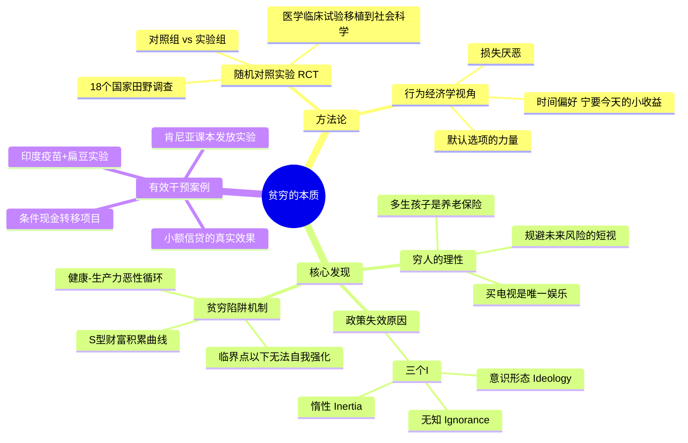

## 《贫穷的本质：我们为什么摆脱不了贫穷》读书笔记
  
### 作者  
digoal  
  
### 日期  
2026-05-26  
  
### 标签  
读书笔记 , 贫穷的本质：我们为什么摆脱不了贫穷   
  
----  
  
## 背景  
   
---
书名: 《贫穷的本质：我们为什么摆脱不了贫穷》（修订版）   
作者: 阿比吉特·班纳吉 / 埃斯特·迪弗洛   
译者: 景芳   
出版社: 中信出版社   
出版年份: 2018（修订版）   
原著出版: 2011   
笔记日期: 2026-05-26   
豆瓣链接: https://book.douban.com/subject/21966353/   
奖项: 2011年英国《金融时报》& 高盛年度商业书籍奖；作者于2019年获诺贝尔经济学奖   
标签: [发展经济学, 贫困研究, 行为经济学, 公共政策, 田野调查]   
---

   

> **一句话**：穷人并不愚蠢，贫穷是一套精密的系统性陷阱，而不是个人失败的结果。   
> **适合谁读**：对社会议题感兴趣的普通读者；公共政策从业者；想突破"穷人活该穷"偏见的任何人   
> **阅读难度**：⭐⭐⭐☆☆   
> **推荐指数**：⭐⭐⭐⭐⭐   

---

## 一、时代坐标：这本书从哪里来？

2011年，全球约有10亿人每天生活费不足1美元。几十年来，围绕"如何扶贫"的争论从未停过，战线分得很清晰：一边是以杰弗里·萨克斯（Jeffrey Sachs）为代表的"大援助派"，相信只要砸足够多的钱，贫困就能被消灭；另一边是以威廉·伊斯特利（William Easterly）为代表的"市场派"，认为政府援助只会腐蚀穷人的自立能力，不如让市场自由运作。

双方争得面红耳赤，却有一件事从没人做过：**认真去问穷人自己是怎么想的**。

这正是班纳吉和迪弗洛这两位MIT经济学教授做的事。他们在麻省理工创立了"贫穷行动实验室"（J-PAL），用15年时间深入五大洲18个国家的贫困地区，用随机对照实验（RCT——一种原本用于医学临床试验的严格方法）来测量各种扶贫政策的实际效果。《贫穷的本质》就是这15年田野调查的思想结晶。

这本书的问题意识很简单，却极其刺耳：**我们花了那么多钱、那么多精力在扶贫上，为什么那么多政策都失败了？**

答案，在于我们从一开始就对穷人抱有根深蒂固的错误假设。

```
时间轴

2003年 ──── J-PAL在MIT成立（班纳吉、迪弗洛、穆莱纳坦联合创立）
             │
2011年 ──── 《Poor Economics》英文版出版，获FT&高盛年度商业书奖
             │
2013年 ──── 中文版首次引进（中信出版社）
             │
2018年 ──── 修订版出版（本书）
             │
2019年 ──── 班纳吉与迪弗洛（已婚）获诺贝尔经济学奖
             │
  至今 ──── J-PAL研究成果影响全球超4亿人
```

---

## 二、核心命题：作者在说什么？

### 观点一：穷人的非理性行为，其实是极度理性的生存策略

我们常常对穷人的行为感到费解：印度穷人吃不饱饭，却要买电视；孩子上了学却不好好学；有免费蚊帐却不去用。这些行为看起来"不理性"，甚至"愚蠢"。

但书里的解释让人豁然开朗——**当你每天花98%的精力在"今天能不能吃饱"这件事上，大脑根本没有余裕去做长远规划**。

穷人多生孩子，不是因为无知，而是因为没有养老保险，孩子是唯一的风险对冲工具。穷人不买便宜的净水片，不是因为不在乎健康，而是当下的饥饿比未来的疾病更紧迫。这些选择在他们所处的系统约束下，有其内在的逻辑。

### 观点二："贫穷陷阱"是真实存在的，但并非无处不在

书中引入了一个核心概念：**S型曲线**。

对于真正处于"贫穷陷阱"的人，财富积累曲线在底部是平的甚至向下的——努力一点点，资源就被各种风险（生病、天灾、家庭变故）吃掉，无法积累到足以自我增强的临界点。只有当外力把人"推过"那个临界点，才能进入自我强化的上升轨道。

但作者也坦诚：并非所有贫穷都是这种结构性陷阱。很多时候，穷人缺的不是某个大突破，而是一系列小改变的叠加——更好的学校、更便宜的疫苗、更易获取的小额贷款。

### 观点三：好的扶贫政策，靠的是精准干预而不是宏大叙事

两位作者对"大计划"持深度怀疑。他们发现，大量扶贫资金之所以打水漂，是因为政策制定者对穷人的行为模式有错误假设，以为给了钱、给了学校、给了药，穷人自然会用好。

但现实是：**免费发放的蚊帐使用率，远低于收费出售的蚊帐**——不是因为穷人买不起，而是当他们花了钱，才会产生"我要用好它"的心理锚定。这是行为经济学的核心洞见：人对"免费"的东西不重视。

成功的干预往往很小、很具体：在印度给孩子打疫苗，顺便给家长一小袋扁豆作为奖励，接种率从6%提升到38%。

---

## 三、论证地图：作者怎么说服你的？



**核心数据与案例举例：**

- 在印度拉贾斯坦邦，疫苗接种率的实验揭示：给予小激励（一袋扁豆）使接种率从6%飙升至38%，成本却大幅降低。
- 肯尼亚的课本实验发现：免费教科书并未提升平均成绩，因为课本是为中等水平学生设计的，而大多数穷苦孩子的基础差距太大。
- 孟加拉国的小额贷款数据显示：微贷并不是"点石成金"的魔法，大多数借款人用它来平滑消费而非投资创业，这与格莱珉银行的宣传相悖。

**论证方式的评价：**

这本书最大的优点是**用故事讲数据，用数据支撑故事**。RCT作为方法论非常严谨，但作者在呈现时刻意保留了大量人物细节，让读者能感受到"穷人"是活生生的人而不是统计数字。

---

## 四、前提假设与边界：什么情况下这不成立？

### 假设一：RCT可以推广

书中大量结论来自特定地区、特定时期的实验。但在A地有效的干预，在B地未必奏效——文化、制度、基础设施差异都会影响结果。批评者（包括诺贝尔经济学奖得主安格斯·迪顿）指出，**RCT能告诉你"什么有效"，但无法解释"为什么有效"**，更无法保证跨情境的可迁移性。

### 假设二：微观干预可以积累成宏观变革

两位作者刻意回避了宏观结构问题：全球贸易规则、殖民历史遗产、国家制度质量。他们认为，从小处着手更务实。但批评者认为，这种"创可贴式"思路可能治标不治本——如果一个国家的政治制度极度腐败，再精准的扶贫实验也无法解决根本矛盾。

### 假设三：穷人的行为模式相对稳定

书中描述的许多穷人行为（短视、风险规避、依赖信息有限的社群判断），是在极度资源匮乏的压力下形成的。但随着数字化、手机普及，贫困人口获取信息的方式已大幅改变。书中的部分结论可能需要在新的现实下重新检验。

---

## 五、思想谱系：这本书站在哪条脉络上？

```
发展经济学的两条路线

宏大叙事派                          微观实证派
（大援助 vs 市场自由）              （J-PAL 实验经济学）
      │                                    │
 萨克斯（援助派）               班纳吉 & 迪弗洛（本书）
 伊斯特利（市场派）                        │
      │                           行为经济学的渗透
      │                      （卡尼曼、塞勒的影响）
      │                                    │
      └──────────────────┬─────────────────┘
                         │
                   2019年诺贝尔奖
                  （三人同获，含克默）
                         │
                    影响至今：
               全球400+百万人受益
               各国社会政策引入RCT
```

这本书在思想上有三个重要来源：

**发展经济学传统**——沿袭了阿马蒂亚·森（Amartya Sen）对"能力视角"的关注，穷人需要的不只是钱，而是真正可选择的生活能力。

**行为经济学**——借鉴卡尼曼（Kahneman）和塞勒（Thaler）的研究，理解人在资源稀缺下的非理性决策机制。

**公共卫生的随机对照实验方法**——将医学中的RCT移植到社会科学，这是方法论上的革命性贡献，也是他们得诺贝尔奖的核心理由。

---

## 六、我学到了什么？

读完这本书，有三件事让我真正改变了想法。

**第一，"可怜之人必有可恨之处"是一种认知懒惰。** 我们对穷人的很多判断，建立在完全错误的信息基础上。穷人多生孩子不是愚昧，穷人不存钱不是没有远见——他们面对的系统约束和我们完全不同。当我们批评穷人"活该穷"时，我们其实是在用自己的资源优势去评判别人在资源极度匮乏下做出的合理应对。

**第二，"好心"不等于"有效"。** 慈善和援助有时候反而会破坏当地的市场结构。免费发放二手衣物，会让本地纺织业崩溃。大规模援助粮食，会打击当地农民的积极性。这不是说不要帮助，而是帮助的方式必须经过实证检验，而不是凭直觉或道德满足感。

**第三，改变往往发生在边际处，而不是系统中心。** 我们总想找到那个"解决贫困的大方案"，但现实是没有魔法子弹。把一袋扁豆和疫苗绑在一起，这种小小的设计改变，却能救无数条命。很多时候，精准的小干预比宏大的计划更有力量。

---

## 七、举一反三：这个框架还能用在哪？

《贫穷的本质》的核心方法论，是**在系统约束下理解人的真实行为，然后设计符合人性的干预**。这套思路远不止适用于扶贫。

**企业管理**：员工不努力，不一定是因为懒惰——可能是绩效设计有问题，目标不清晰，或者激励机制和人的心理不匹配。在批评员工之前，先看看系统设计。

**教育改革**：学生成绩差，不一定是学生不努力——可能是课程设计完全不符合他们的认知起点。肯尼亚课本实验说明：给的东西对了，才有用。

**公共政策**：默认选项（default option）的设计非常重要。养老金自动加入制度让储蓄率大幅提升；器官捐献默认同意制让捐献率翻倍。这些都是"助推"（nudge）思维在政策中的直接运用。

---

## 八、批判与反思

这本书有一个很难被忽视的局限：**它回避了权力**。

两位作者故意把视野收窄到"可实验、可测量"的微观层面，但贫困最深层的根源往往是政治经济结构——殖民历史遗留的资源分配格局、国际贸易规则对发展中国家的不公平、精英阶层对资源的垄断。这些问题没有办法用RCT来测量，但它们可能才是不平等的真正发动机。

诺贝尔经济学奖得主安格斯·迪顿曾批评说，RCT研究者太过沉迷于"什么有效"，却忽视了"为什么有效"以及"在什么条件下有效"，这使得实验结论的推广应用面临很大障碍。

另外，这本书写于2011年，移动互联网和数字支付尚未在发展中国家普及。今天，M-Pesa（肯尼亚手机支付）已经改变了数千万人的金融行为，微信支付和Alipay也在重塑中国农村的消费结构。信息技术大幅改变了穷人获取信息、储蓄、消费的方式——书中的部分结论需要在数字时代的语境下重新审视。

总体而言，这本书是我读过的最诚实的经济学书之一：它承认自己的局限，不过度承诺，告诉你"在这些条件下，这些方法有效"。这种知识分子的谦逊，本身就值得钦佩。

---

## 九、金句与记忆点

**① "穷人是在有限资源下做出的最优选择，而不是在做错误的选择。"**
→ 这是整本书的基石。你不能用有钱人的标准去评判穷人的理性。

**② "贫穷的本质，是一系列坏运气的叠加，而不是性格缺陷。"**
→ 生在贫困地区就意味着营养不良→认知发展受损→教育机会减少→收入低→依然贫困。这个链条不是"活该"，是系统性的不公。

**③ "我们不需要宏大的理论，我们需要精准的答案。"**
→ 作者对大援助派和市场原教旨主义都持怀疑，主张一步一步地用证据说话。

**④ "免费的东西，人们往往不珍惜。"**
→ 行为经济学的洞见：价格不只是支付手段，也是心理锚定机制。

**⑤ "最好的扶贫项目，常常是最不起眼的那些。"**
→ 一袋扁豆+疫苗，远比建一所大医院更能提升接种率。

**⑥ S型曲线：临界点是关键**
→ 处于曲线底部平坦区的人，努力带来的收益会被风险吞噬。外力的作用是把人"推过"那个临界点，让自我增强的正循环得以启动。

**⑦ 三个"I"是政策失败的元凶：无知（Ignorance）、意识形态（Ideology）、惰性（Inertia）**
→ 不了解穷人真实处境、被意识形态框架锁死、懒于根据证据调整政策，这三个因素导致了无数扶贫资金打了水漂。

---

## 十、延伸阅读

**① 《稀缺：我们是如何陷入贫穷与忙碌的》（Scarcity）**
— 穆莱纳坦 & 沙菲尔著。从认知心理学角度深入解释为什么资源匮乏会劫持大脑的执行功能，是《贫穷的本质》的绝佳理论补充。

**② 《贫穷的人口学》（The Great Escape）**
— 安格斯·迪顿著（2015年诺贝尔经济学奖得主）。与本书观点有部分张力，更注重历史和宏观结构，是很好的对照阅读。

**③ 《美好经济学》（Good Economics for Hard Times）**
— 班纳吉 & 迪弗洛的第二本书，2019年出版，把同样的实证思维应用到移民、贸易、不平等等当代大议题，是本书的升级版。

**④ 《发展作为自由》（Development as Freedom）**
— 阿马蒂亚·森著。理解贫困不能只看收入，要看"能力"（capability）和"实质自由"。这是《贫穷的本质》最重要的思想前辈。

**⑤ 《助推》（Nudge）**
— 桑斯坦 & 塞勒著。理解"默认选项"和"行为设计"如何改变人的决策，是理解本书政策建议背后机制的必读书。

---

*笔记写于 2026-05-26 | 基于公开资料、学术书评与深度思考整理*
*作者于2019年荣获诺贝尔经济学奖，J-PAL研究成果至今影响全球政策制定*
  
  
#### [PostgreSQL 解决方案集合](../201706/20170601_02.md "40cff096e9ed7122c512b35d8561d9c8")
  
  
#### [德哥 / digoal's Github - 公益是一辈子的事.](https://github.com/digoal/blog/blob/master/README.md "22709685feb7cab07d30f30387f0a9ae")
  
  
#### [About 德哥](https://github.com/digoal/blog/blob/master/me/readme.md "a37735981e7704886ffd590565582dd0")
  
  

  
