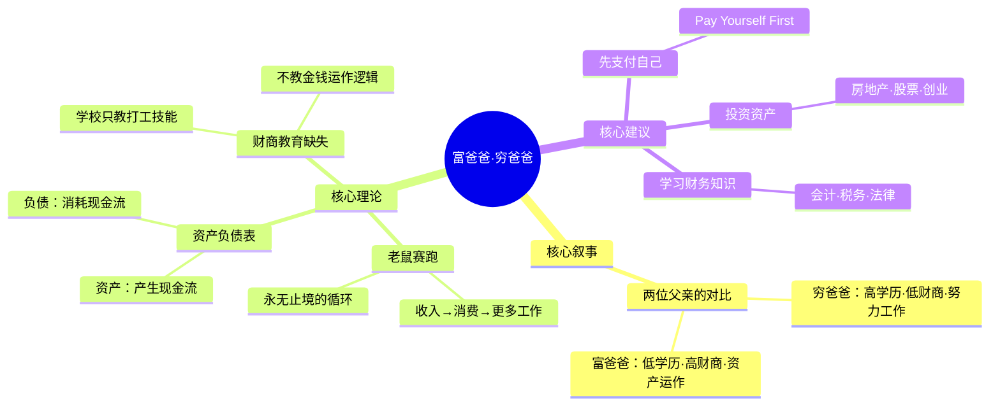

## 《富爸爸，穷爸爸》读书笔记
  
### 作者  
digoal  
  
### 日期  
2026-05-26  
  
### 标签  
读书笔记 , 富爸爸，穷爸爸   
  
----  
  
## 背景  
   
---
书名: 《富爸爸，穷爸爸》   
作者: 罗伯特·T·清崎 / 莎伦·L·莱希特   
出版年份: 1997（英文原版）/ 2000（中文版）   
笔记日期: 2026-05-26   
豆瓣链接: https://book.douban.com/subject/1074168/   
ISBN: 9787506246743   
标签: [财务自由, 投资理财, 思维方式, 资产负债, 个人成长]   
---

   

> **一句话**：这不是一本教你如何赚钱的书，而是一本逼你重新审视「钱」这件事的书——它最大的价值，是让你意识到自己从没思考过金钱。   
>   
> **适合谁读**：第一次接触财务概念的年轻人；被"好好读书、找份好工作"信条支配了半生的人；想打破固化思维但不知道从哪里下手的职场人   
>   
> **阅读难度**：⭐☆☆☆☆（极易读，故事化叙述）   
>   
> **推荐指数**：⭐⭐⭐⭐☆（作为「财商启蒙」强推，但不宜当作投资操作手册）   

---

## 一、时代坐标：这本书从哪里来？

1997年，美国正处于互联网泡沫的狂欢前夜，纳斯达克指数节节攀升，每个人都觉得自己是天才投资者。与此同时，主流文化对「成功路径」有着高度统一的叙事：努力读书→进好公司→稳定工作→储蓄养老。这套剧本已经运行了整整一代人。

就在这个节点，一个曾经破产的夏威夷商人自费印刷了1000本名叫《Rich Dad, Poor Dad》的小册子，送给朋友和学员。没有大出版社，没有名人背书。两年后，它被华纳图书买下版权正式出版，随即登上《纽约时报》畅销书榜，一待就是六年。

中文版于2000年9月上市，在中国连续18个月蝉联全国图书销售榜第一。彼时，中国刚好处于加入WTO前夕，普通家庭的财富焦虑与日俱增，「穷人思维」这个词像一颗闷在心里很久的子弹，被这本书一下子打出来了。

清崎自述的动机很简单：他亲眼看着辛苦工作一辈子的「穷爸爸」（亲生父亲，夏威夷州教育部官员，高学历）晚年陷入财务困境，而几乎没有受过正规教育的「富爸爸」（好友的父亲）成为夏威夷最富有的人之一。**同样是努力，为什么结局天差地别？** 这个问题，是整本书的出发点。

```
时间轴：
1970s ── 清崎从越战归来，开始商业探索
  │
1985 ── 清崎公司破产，重新反思金钱逻辑
  │
1997 ── 《富爸爸，穷爸爸》夏威夷自费出版
  │
1999 ── 华纳图书正式出版，登上全美畅销榜
  │
2000 ── 上欧普拉节目引爆全球；中文版上市
  │
至今 ── 翻译成50+语言，销量超4000万册
```

---

## 二、核心命题：作者在说什么？

本书围绕三个彼此咬合的核心观点展开，缺一不可：

### 观点一：穷人为钱工作，富人让钱为自己工作

这是全书最核心的命题，也是最容易被误读的一句话。

清崎说的不是「你应该不工作」，而是：大多数人进入了一个被他称为「老鼠赛跑」（Rat Race）的循环——赚钱→消费→赚更多的钱→消费更多。工资涨了，欲望也涨了，永远在跑，永远跑不出去。

富人跳出这个循环的方式，是让「资产」替自己工作。工资收入是线性的，资产收入是可以复利的。

> 关键洞见：你的职业只是收入的**通道**，资产才是财富的**来源**。不要把通道当成目的地。

### 观点二：资产和负债的区别，是财务自由的底层逻辑

清崎给出了一个极为简化但极为有力的定义：

```
资产（Asset）= 能把钱装进你口袋的东西
负债（Liability）= 把钱从你口袋取走的东西
```

这个定义刻意绕开了会计学上的严格定义，它的力量在于**实用**：你买的车，每年保险、维修、折旧——它是负债。你住的自有房子，每年还贷款、缴税——它在清崎眼里也是负债，不是资产（这一点争议极大）。

他的建议是：先用收入购买能产生现金流的资产（出租房产、股票分红、版权收入），再用资产产生的现金流来满足消费欲望。

### 观点三：财商（Financial IQ）是学校不教的核心竞争力

学校教会你如何成为一名优秀的员工，却没有教会你关于「钱」最基本的事：税如何运作？公司结构如何节税？投资回报如何计算？

清崎认为这不是意外，而是系统性的遗漏——教育体系的目标，是培养能为经济机器服务的工人，而不是资本的拥有者。

---

## 三、论证地图：作者怎么说服你的？



清崎的论证几乎全部依赖**故事和类比**，而非数据和模型。这是他被批评最多的地方，也是他传播最广的原因。

他用了大量童年记忆：9岁时和富爸爸一起打工体验穷的感觉，少年时读漫画书经营二手漫画出租店赚钱……这些故事读起来生动有趣，但难以核实——2003年清崎在接受专访时曾暗示「富爸爸」更像是一个复合形象，是他多位人生导师的化身，而非真实存在的一个人。

书中真正有说服力的部分是**概念本身的简洁与击中人心的力度**：资产/负债的重新定义，对「老鼠赛跑」的刻画，对中产阶级消费习惯的解剖——这些并非清崎的原创，但他是最善于将其通俗化的人。

---

## 四、前提假设与边界：什么情况下这不成立？

这本书的逻辑建立在若干隐含假设之上，这些假设并非普遍成立：

**假设一：每个人都有足够的资本去「先购买资产」**

对于月光族、低收入群体、或背负高额债务的人而言，「先支付自己」这个建议是空中楼阁。当收入刚刚覆盖基本生存时，「用收入买资产」的前提根本不存在。书中对起步资本的门槛几乎没有讨论。

**假设二：投资回报是可预期的**

清崎以20世纪后半段的美国房地产市场为样本，彼时美国经历了长达数十年的房价上涨周期。但2008年金融危机证明，房产也会暴跌，杠杆投资者的损失是毁灭性的。清崎本人的公司也在那段时期申请破产保护。

**假设三：放弃传统职业路径是可行且值得的**

书中对「为别人打工」的批判有时失之偏颇。数据显示，受过高等教育的群体终身收入仍显著高于未受教育者，且这一差距在知识经济时代还在拉大。「富爸爸」路径的成功率，远比书中描述的更低。

**适用边界**：这本书最有价值的地方在于思维启蒙，而非操作指导。它是一颗开关，而不是一份说明书。

---

## 五、思想谱系：这本书在哪个传统里？

《富爸爸，穷爸爸》属于美国「自助文化」（Self-Help Culture）的谱系，这一传统可以追溯到本杰明·富兰克林的《穷理查年鉴》，延伸至拿破仑·希尔的《思考致富》（1937）。

```
思想谱系：
《穷理查年鉴》富兰克林(1758) ──→ 「勤劳与智慧」
《思考致富》希尔(1937) ──────→ 「思维决定财富」
              │
              ↓
   《富爸爸，穷爸爸》(1997)
  「财商是可后天培养的核心能力」
              │
    ┌─────────┴──────────┐
    ↓                    ↓
《现金流游戏》          FIRE运动
(Kiyosaki桌游)   (Financial Independence,
                   Retire Early)
```

清崎的独特贡献，是把「阶级财富差距」从结构性问题转化为**个人财商教育问题**。这一转化有其局限（它忽视了系统性不平等），但也因此极具传播力——它把改变命运的责任还给了个人，而个人是最容易被激励的受众。

---

## 六、我学到了什么？

读完这本书，最大的收获不是某个投资技巧，而是三个认知的松动：

**第一，「工资」和「财富」不是同一件事。** 工资是流量，财富是存量。努力工作增加流量是对的，但如果流量全部流向消费，存量永远是零。这本书让我第一次认真想起「钱的去向」这个问题。

**第二，大多数人的消费决策，本质上是情绪决策。** 清崎把这称为「为恐惧工作，为欲望消费」——因为害怕穷所以不敢辞职，因为想显得成功所以买超出需要的东西。这个描述不好听，但足够真实。

**第三，财务教育是一门需要主动学习的学科，没有人会替你上这门课。** 学校不教，父母可能也不会。意识到这条知识鸿沟的存在，是填补它的第一步。

---

## 七、举一反三：这个框架还能用在哪？

清崎的「资产/负债」框架，其实是一个更通用的**「净产出」思维**，可以迁移到很多领域：

**时间管理**：哪些习惯是「时间资产」（学习新技能、锻炼身体），哪些是「时间负债」（无意义刷屏、无效社交）？每天的时间分配，就是你的时间资产负债表。

**职业规划**：你现在做的工作，是在积累「可迁移技能」（资产），还是只是在消耗当下时间换取工资（流量）？五年后这份经历还值钱吗？

**学习选择**：某门课程，能帮你产生长期回报，还是只是满足短期的「我在进步」的焦虑感？前者是知识资产，后者是知识消费。

---

## 八、批判与反思

这本书有一个根本性的张力，始终没有被诚实地面对：

**它用个体成功的故事，掩盖了结构性门槛的存在。**

清崎的财富积累发生在美国战后经济大扩张、房地产长牛、税法对投资者极度友好的历史窗口期。把这个窗口期的成功经验，作为普世可复制的路径推销给全球读者，存在明显的误导风险。

此外，书中的反教育倾向有时近乎煽动性：把大学学历与财务失败挂钩，对医生、律师、工程师等专业路径的长期回报视而不见。这种简化对年轻读者可能造成真实的判断错误。

最公允的评价，或许是这样的：**《富爸爸，穷爸爸》是一本极好的启蒙读本，也是一本危险的操作手册。** 它适合作为你财务思考的起点，但绝不应该是终点。读完它之后，你真正需要做的，是去读它让你意识到自己需要学习的那些具体内容。

---

## 九、金句与记忆点

1. **「穷人和中产阶级为金钱工作，富人让金钱为他们工作。」**
   这句话的力量不在于它有多新颖，而在于它把一个模糊的感觉变成了清晰的命题。

2. **「你的房子不是资产，除非它能给你带来收入。」**
   争议最大的一句话。刺激了无数人重新思考「拥有房产＝财富积累」的默认逻辑。

3. **「学校教你如何赚取工资，但没有教你如何让工资增值。」**
   击中了几乎所有受过正规教育的人的某个共同空白。

4. **「先支付自己（Pay Yourself First）。」**
   在支付账单之前，先把一部分收入划入投资账户。看似简单，做到需要反本能。

5. **「'老鼠赛跑'：工作→支付账单→工作更多→支付更多账单……」**
   对现代中产阶级生活最冷酷的一幅素描。

6. **「恐惧和欲望，是大多数人一生都在为之工作的两个情绪。」**
   恐惧失去所以不敢冒险，欲望享受所以超前消费。两者都让你永远处于「需要更多工资」的状态。

7. **「财务自由不是终点，而是起点——你自由了，才有时间去做真正想做的事。」**
   这一句比前几句都少被引用，但可能是最重要的。

---

## 十、延伸阅读

1. **《穷查理宝典》（芒格）**
   更严肃、更有深度的投资思维读本。芒格的「多元思维模型」是清崎财商概念的真正进阶版。

2. **《邻家的百万富翁》（托马斯·斯坦利）**
   用实证数据（而非故事）研究真实富裕群体的行为模式，与清崎的叙事形成有趣对照。

3. **《非理性繁荣》（席勒）**
   诺贝尔经济学奖得主对资产泡沫的分析，是理解「投资并非总是正确选择」的必要补充。

4. **《小狗钱钱》（博多·舍费尔）**
   同样是财商启蒙类书籍，但更温和、更具操作性，适合与本书配合阅读。

5. **《债务危机》（达利欧）**
   桥水基金创始人对宏观经济周期的分析，帮你理解「为什么有时候资产也会大幅缩水」——这是清崎书中刻意回避的话题。

---

*笔记写于 2026-05-26 | 基于公开资料与深度思考整理*
*本笔记为独立思考产出，不构成投资建议*
  
  
#### [PostgreSQL 解决方案集合](../201706/20170601_02.md "40cff096e9ed7122c512b35d8561d9c8")
  
  
#### [德哥 / digoal's Github - 公益是一辈子的事.](https://github.com/digoal/blog/blob/master/README.md "22709685feb7cab07d30f30387f0a9ae")
  
  
#### [About 德哥](https://github.com/digoal/blog/blob/master/me/readme.md "a37735981e7704886ffd590565582dd0")
  
  

  
