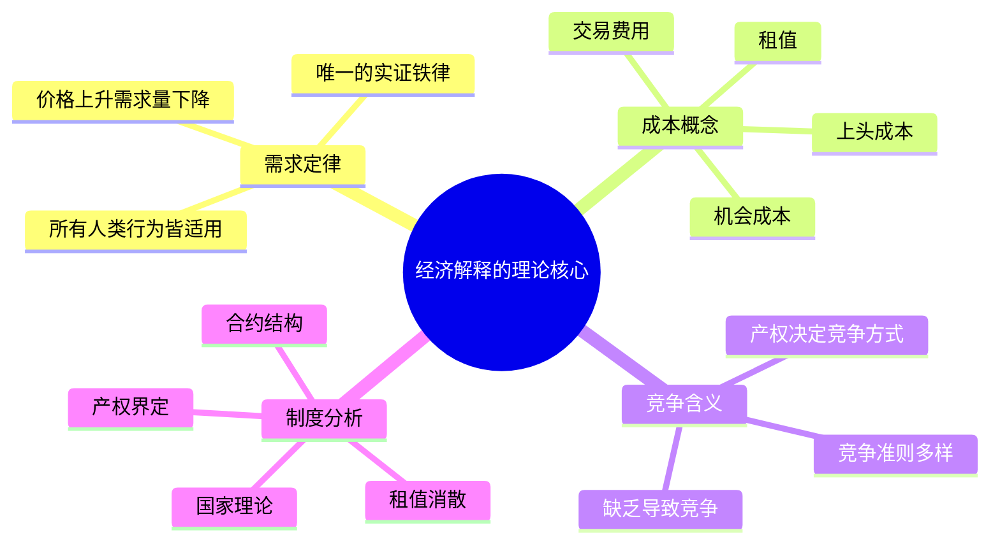

## 《经济解释》读书笔记
  
### 作者  
digoal  
  
### 日期  
2026-05-26  
  
### 标签  
读书笔记 , 经济解释   
  
----  
  
## 背景  
   
---
书名: 《经济解释（二〇一九增订版）》五卷本   
作者: 张五常   
出版年份: 2019   
笔记日期: 2026-05-26   
豆瓣链接: https://book.douban.com/subject/30398402/   
出版社: 中信出版社   
ISBN: 9787508698250   
标签: [经济学, 新制度经济学, 价格理论, 交易费用, 产权]   
---

   

> **一句话**：用三把钥匙——需求定律、成本概念、竞争含义——打开真实世界所有经济现象的锁。   
>   
> **适合谁读**：对经济学感兴趣但厌倦教科书套路的读者；想理解中国经济现实的人；希望用经济逻辑解析日常生活的思考者。   
>   
> **阅读难度**：⭐⭐⭐⭐☆（概念简洁，但思维要求高；需要反复咀嚼）   
>   
> **推荐指数**：⭐⭐⭐⭐⭐   

---

## 一、时代坐标：这本书从哪里来？

1982年，张五常在香港大学的就职演说上抛出了一个豪言壮语："让我们做经济解释的弄潮儿。"这句话，是《经济解释》整个写作计划的宣言。

彼时，主流经济学正走向数学化的高峰：计量模型越来越精密，数学符号越来越优雅，离真实世界却越来越远。张五常师从阿尔钦（Armen Alchian）于加州大学洛杉矶分校，深受芝加哥价格理论传统熏陶，又与科斯（Ronald Coase）、弗里德曼（Milton Friedman）等人有深厚的学术往来。他亲眼目睹主流经济学的偏航，决心以自己的方式回归——回归真实世界的观察，回归简单原则的极致运用。

《经济解释》第一版于2000年代分卷出版，历经反复修订，至2019年增订为五卷本，由张五常亲述为"封笔之作"。出版时他已83岁，仍坐在书桌前修改每一章，"为恐修改坏了"才请学生逐章审阅，这份对学问的执着，本身就是一堂课。

五卷分别是：
- **卷一《科学说需求》**：方法论与需求定律的基础
- **卷二《收入与成本》**：成本概念的体系构建
- **卷三《受价与觅价》**：真实市场的价格运作
- **卷四《制度的选择》**：交易费用与合约理论
- **卷五《国家的经济理论》**：制度分析的延伸与中国经济

这不是一套传统意义上的教科书，而是一位经济学大师用毕生田野观察和理论心得，写给中文读者的智识遗书。

```
时间轴：张五常学术生涯与《经济解释》的诞生

1935 ── 出生于香港
1959 ── 赴美求学，UCLA经济系（师从阿尔钦）
1967 ── 博士论文《佃农理论》，颠覆传统地租理论
1968 ── 论文发表，引发学界震动（至今被引用）
1982 ── 港大就职演说：提出"经济解释"纲领
2000s ─ 《经济解释》分卷陆续出版（中文读者）
2019 ── 五卷增订本问世，张五常自称封笔之作
```

---

## 二、核心命题：作者在说什么？

张五常用一句话道出了整本书的方法论灵魂：**"以简单的理论，解释复杂的世界。"**

他把整套经济理论压缩为三个支柱，再加一个补丁：

### 命题一：需求定律是唯一的铁律

需求定律说的是：**价格上升，需求量下降**。听起来平淡无奇，但张五常认为，这是唯一一条放之四海而皆准、真正可以被事实验证的经济学定律。

他不认为宏观经济学是一门独立科学。在他看来，没有什么"总量消费函数""IS-LM模型"等宏观框架能真正解释经济现象——那些模型是用曲线画出来的逻辑游戏，不是真实世界的观察。能解释真实世界的，只有需求定律，加上对局限条件变化的细致分析。

### 命题二：成本是"放弃的代价"

张五常对成本的定义与众不同：**成本不是你付出了什么，而是你放弃了什么**（即机会成本）。这个定义一旦真正理解，会颠覆很多日常直觉。

他由此衍生出租值、上头成本（沉没成本的前身概念）、交易费用等一整套概念体系。这套概念不是装饰，是解释真实合约与制度安排的工具。

### 命题三：交易费用决定制度形态

这是全书最有力量的洞见：**如果交易费用为零，什么样的产权安排、什么样的合约形式，最终的资源配置都是一样的**（科斯定理的核心）。但现实中交易费用从不为零，因此我们才看到如此多样的合约安排、组织形式和制度结构。

张五常把交易费用理解得极其宽泛——不仅包括谈判成本、信息成本，还包括产权不清带来的"租值消散"。租值消散，是他解释很多社会悲剧（价格管制、公地悲剧、政治腐败）的核心概念。

---

## 三、论证地图：作者怎么说服你的？



张五常的论证方式极为独特：他**几乎从不用数学模型**，而是用大量的真实案例和日常生活观察。

典型例子：为了论证"价格管制导致租值消散"，他分析了香港的士牌照制度——政府限制出租车数量，牌照费飙升，但服务质量和社会效率并未提高，只是租值从乘客转移到了牌照持有者手中。又如解释分成制（佃农理论），他到台湾农村实地调研，发现传统经济学认为分成制"低效"的结论是错的——地主与佃农的合约安排，其实是在特定信息成本下的最优选择。

这是一种"先观察后理论"的路径，与标准经济学"先建模后检验"相反。

---

## 四、前提假设与边界：什么情况下这不成立？

张五常的体系建立在几个关键假设之上，这些假设在某些情境下会产生张力：

**假设一：人是自私的**。这是"自私的武断假设"，张五常承认这是公理而非真理。他不认为人总是自私，而是说，用自私假设作出的预测，在足够多的情况下能与现实吻合。但面对利他行为、公共精神、情感决策，这个框架的解释力会减弱。

**假设二：需求定律放之四海皆准**。张五常认为吉芬商品（价格上升需求量也上升）在市场竞争中不可能存在。这在竞争充分的市场中说服力很强，但在垄断、信息极度不对称或行为偏差显著的场合，需求曲线的形状可能更复杂。

**假设三：交易费用是可以观察和分析的**。批评者指出，交易费用概念在张五常手中有时过于宽泛——任何异常都可以归入"交易费用太高"，这使得理论有"套套逻辑"（tautology）的风险。张五常对此有所回应，但这确实是这套体系最大的方法论争议。

**适用边界**：《经济解释》对制度分析、合约选择、价格机制的解释力极强；对宏观波动（经济周期、通胀机制）、货币政策、发展经济学的独立解释力相对有限。

---

## 五、思想谱系：这本书在哪个传统里？

```
        亚当·斯密（分工与市场）
               │
        古典经济学传统
               │
        ┌──────┴──────┐
    新古典经济学      制度经济学
   （价格理论）      （Commons等）
        │                │
   芝加哥学派        科斯（交易费用）
   弗里德曼等         │
        │          德姆塞茨（产权）
   阿尔钦（产权）       │
        │          ┌────┘
        └──────────┤
                张五常
           新制度经济学的
           中文化与极致化
```

张五常是**芝加哥价格理论**与**科斯产权理论**的交汇点。他继承了阿尔钦对产权的重视，又深化了科斯对交易费用的洞察，并将这套框架用中文写作推向了更广泛的读者。

他与主流新制度经济学（如诺思的"制度变迁理论"）的区别在于：张五常更强调**合约层面的微观分析**，而非宏观的制度演变路径。他不喜欢路径依赖、锁定效应等宏大叙事，认为这些往往是无法被证伪的装饰性理论。

《经济解释》在中文世界的影响极为深远，被誉为将芝加哥学派价格理论第一次系统地引介给中文读者，并结合中国经济现实做出了大量原创性应用分析。

---

## 六、我学到了什么？

读完这五卷，改变我最深的，不是某个具体结论，而是一种**思维方式的切换**。

**第一个收获：所有行为背后都有局限条件。** 张五常反复强调：解释经济现象，不是问"人为什么这样做"，而是问"局限条件是什么，局限变了行为会怎么变"。这让我看待任何社会现象的第一反应，从"动机判断"转向了"约束分析"。——比如理解房价为什么高，不是因为开发商贪婪，而是去找土地供给、产权制度、金融信贷等局限条件的结构。

**第二个收获：简单原则的力量远超复杂模型。** 张五常用需求定律和交易费用，能分析香港的士、台湾佃农、中国县域竞争……这让我反思：很多时候我们以为需要更复杂的工具，其实是因为没有把简单工具用到极致。

**第三个收获：观察比理论更先。** 张五常说，他写这本书的材料，大部分来自"跑遍街头巷尾的收获"。这种对真实世界的好奇心和田野精神，是学问的根。很多学者困在书斋里推模型，对真实的价格、合约、制度的形态反而一无所知。

---

## 七、举一反三：这个框架还能用在哪？

张五常的核心方法论——**找局限 → 分析局限变化 → 用需求定律推断行为变化**——可以迁移到很多场景：

**职场行为分析**：为什么员工会"磨洋工"？不是因为懒惰，而是因为监督成本高、绩效难以度量，局限条件导致偷懒是理性选择。改变激励结构（局限条件），行为随之改变。

**政策理解**：任何价格管制（房租管制、油价限制、医疗收费上限）的后果，都可以用"租值消散"来预测：价格信号被压制，竞争转向非价格维度，资源错配，效率损失。

**制度设计**：为什么公司要签劳动合同而不是每天议价？因为交易费用太高。任何合约安排，都是在特定信息成本和谈判成本下寻找的局部最优——理解这一点，能帮助我们更理性地评价各种组织形式。

---

## 八、批判与反思

尽管是五星推荐，这套书并非无懈可击。

**批评一：交易费用概念过于弹性。** 当任何解释不了的现象都可以归结为"交易费用太高"时，这个概念的解释力就变成了万能借口。批评者认为，张五常有时没有独立测量或约束交易费用，而是逆向推断——这在逻辑上有套套逻辑的风险。

**批评二：对行为经济学视而不见。** 大量心理学和行为实验表明，人的决策系统性地偏离理性：禀赋效应、损失厌恶、双曲折现……张五常对这一整个研究传统持怀疑甚至轻蔑态度，认为这些"异常"不过是局限条件未分析清楚。这是一种方法论上的坚持，但也可能是一种盲区。

**批评三：中国经济分析的乐观主义。** 张五常对中国县域竞争模式（他称之为"中国的经济制度"）给予了高度正面的评价，认为县际竞争替代了西方的私产保护功能。这一判断在2019年后的经济形势下受到越来越多的质疑——制度变迁并非单向，行政集权可能使他的分析前提发生根本性改变。

**时代的局限**：写于2019年的封笔之作，已无法回应此后数字经济、平台垄断、数据产权等新问题。这些新现象需要在他的框架上做大量延伸，而不能直接照搬。

---

## 九、金句与记忆点

1. **"现象必有规律，规律必有例外，例外必有规律。"**
   → 这是张五常对科学方法论的最精炼表述。任何理论都有边界条件，找到边界才是真正理解了理论。

2. **"解释现象，不是要找动机，而是要找局限。"**
   → 这句话颠覆了大多数人解释社会现象的直觉方式。从问"为什么"到问"什么条件下"，是一次认知升级。

3. **"交易费用是解释制度存在的唯一理由。"**
   → 如果世界没有信息成本、谈判成本、监督成本，一切合约和制度安排都是多余的。制度存在，是为了降低摩擦。

4. **"需求定律是唯一可以被事实推翻而至今未被推翻的经济学定律。"**
   → 张五常对需求定律的推崇不是信仰，而是一种科学性的骄傲——它经受了历史的检验。

5. **"租值消散，是竞争在价格受管制时转向非价格维度的结果。"**
   → 理解这句话，就能解释为什么价格管制通常适得其反：压制了价格竞争，反而产生了更多隐性的浪费。

6. **"套套逻辑（tautology）是科学的大敌。"**
   → 张五常对"任何情况下都成立"的理论深恶痛绝，认为无法被事实推翻的命题，不是科学，是废话。

7. **"纯为兴趣做学问，不断地追求，是学问思想可以历久传世的基本要求。"**
   → 这是他在后记中的自白，也是他一生学术态度的写照。

---

## 十、延伸阅读

1. **《佃农理论》（张五常，1969）**
   张五常的博士论文，至今仍是产权与合约理论的经典之作。理解分成制为何不低效，是进入《经济解释》最好的热身。

2. **《企业的性质》（科斯，1937）**
   张五常思想的重要源头。科斯用交易费用解释了企业为何存在，《经济解释》是这个逻辑在更广领域的展开。

3. **《产权与制度变迁》（科斯、阿尔钦、诺思等，中译文集）**
   新制度经济学的核心读本，帮助理解张五常所处的思想传统和与其他学者的异同。

4. **《价格理论》（弗里德曼，1962）**
   芝加哥价格理论的标准教材，是张五常经济学训练的基础课本，可与《经济解释》互相印证。

5. **《中国的经济制度》（张五常，2009）**
   《经济解释》框架在中国现实中的直接应用，张五常用县域竞争理论解释中国经济奇迹，争议最大也最具启发性。

---

*笔记写于 2026-05-26 | 基于公开资料、豆瓣读者评价与深度思考整理*
*张五常语录引自财新博客后记及知乎整理文本*
  
  
#### [PostgreSQL 解决方案集合](../201706/20170601_02.md "40cff096e9ed7122c512b35d8561d9c8")
  
  
#### [德哥 / digoal's Github - 公益是一辈子的事.](https://github.com/digoal/blog/blob/master/README.md "22709685feb7cab07d30f30387f0a9ae")
  
  
#### [About 德哥](https://github.com/digoal/blog/blob/master/me/readme.md "a37735981e7704886ffd590565582dd0")
  
  

  
