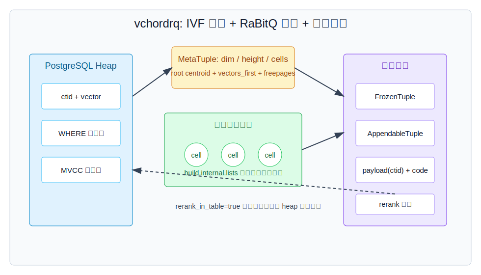
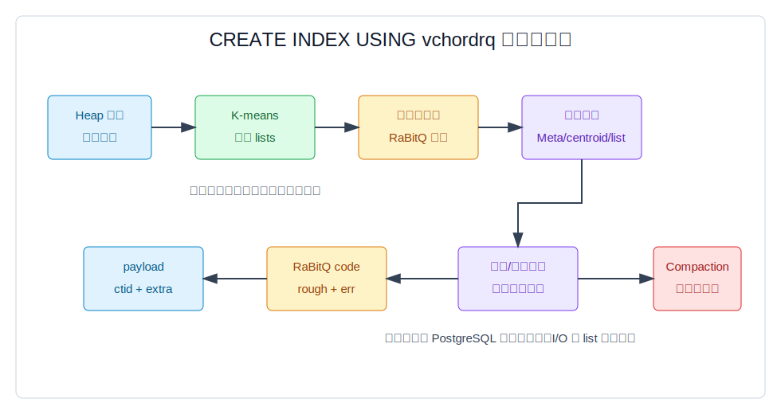
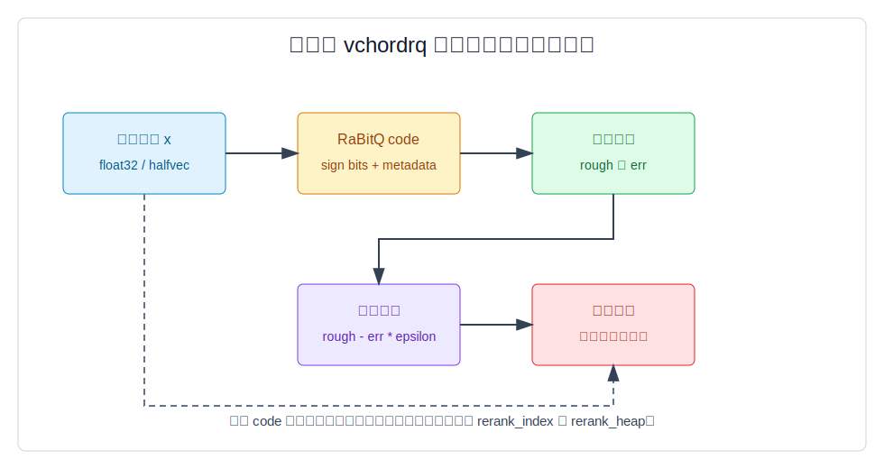
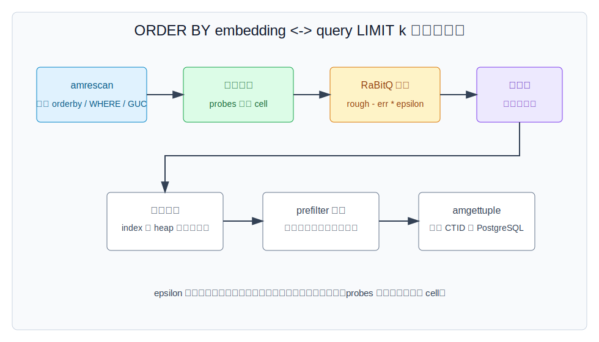
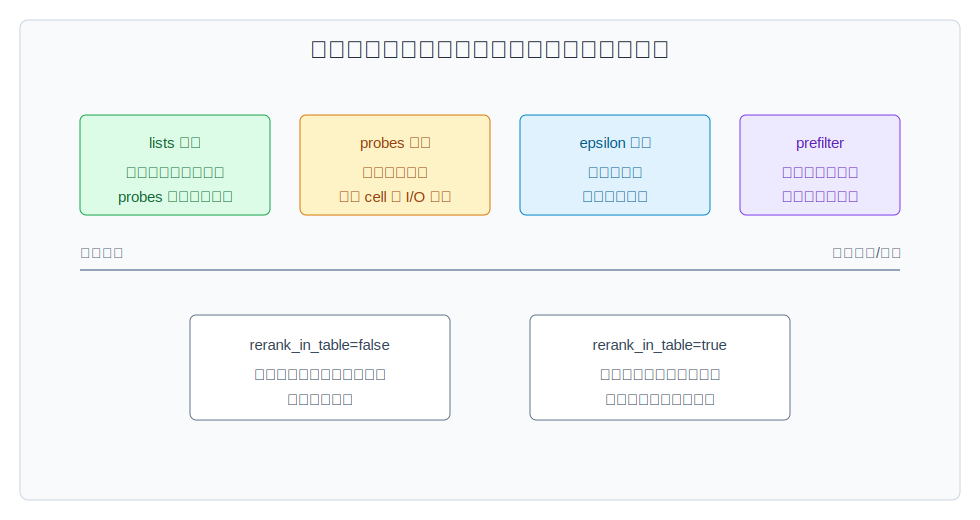

## 数据库筑基课 - VectorChord 索引结构
                                                                                            
### 作者                                                                
digoal                                                                
                                                                       
### 日期                                                                     
2026-05-26                                                      
                                                                    
### 标签                                                                  
PostgreSQL , VectorChord , 应用开发者 , DBA , 数据库筑基课 , 索引结构 , 向量检索 , RaBitQ , IVF , K-means , ANN  
                                                                                           
----                                                                    

## 背景
  


本节属于“索引结构”基础能力。当前工作区没有发现“数据库筑基课”总纲文件，因此本文先独立成篇。

业务上对向量检索最常见的要求是：“我想把 embedding 放在 PostgreSQL 里，既能和关系条件一起查，又不要为 1 亿甚至 10 亿向量准备一套独立向量数据库。”难点不在 SQL 写法，而在三类成本同时压过来：

```text
空间: N * dim * 每维字节数
带宽: 每次候选扫描要搬多少向量数据
召回: 少扫候选、压缩候选以后，TopK 会错多少
```

`pgvector` 的 `hnsw` 和 `ivfflat` 已经把向量索引接进 PostgreSQL。VectorChord 的核心问题更进一步：在 PostgreSQL 的 Index AM 框架里，怎样用更少的存储和 I/O 做大规模 ANN，同时保留 `ORDER BY embedding <-> query LIMIT k` 这类熟悉接口。

本文聚焦 VectorChord 的主索引 `vchordrq`。参考材料包括本地 `VectorChord` 源码、`VectorChord/CLAUDE.md`、官方文档、DeepWiki `tensorchord/VectorChord`、以及三篇论文：

- Jianyang Gao, Cheng Long, [RaBitQ: Quantizing High-Dimensional Vectors with a Theoretical Error Bound for Approximate Nearest Neighbor Search](https://arxiv.org/abs/2405.12497), SIGMOD 2024。
- Jianyang Gao 等, [Practical and Asymptotically Optimal Quantization of High-Dimensional Vectors in Euclidean Space for Approximate Nearest Neighbor Search](https://arxiv.org/abs/2409.09913), 2024。
- Qianxi Zhang 等, [VBASE: Unifying Online Vector Similarity Search and Relational Queries via Relaxed Monotonicity](https://www.usenix.org/conference/osdi23/presentation/zhang-qianxi), OSDI 2023。

这里先给出一个本文结论：**vchordrq 不是“一个 PostgreSQL 里的 HNSW”，而是“层级 IVF 分区 + RaBitQ 误差界筛候选 + 原向量重排 + PostgreSQL 可见性/过滤/回表”的组合索引。**

## 一、它解决什么问题？

精确向量检索要对每个候选计算距离：

```text
exact_cost ~= N * distance_cost(dim)
exact_read ~= N * dim * bytes_per_element
```

如果 `N=100,000,000`，`dim=768`，`float32` 向量本体约为：

```text
100,000,000 * 768 * 4 bytes ~= 286 GB
```

这还没算 PostgreSQL 行头、索引项、可见性、主键、过滤列、缓存和副本。数据库工程里，问题通常不是“能不能算”，而是：

1. 单机内存放不下，随机 I/O 扫不动。
2. 建索引时 K-means、图构建或压缩训练耗时过长。
3. SQL 里还有 `WHERE tenant_id = ?`、时间范围、权限过滤等关系条件，向量库的 TopK-only 接口不好和数据库优化器融合。
4. 压缩后不能只看近似距离，否则 TopK 质量不可控；但全量回表重排又太慢。

VectorChord 的 `vchordrq` 用三步处理这个问题：

- **分区**：用 `build.internal.lists` 建层级 K-means cell，查询只探测部分 cell。
- **压缩估算**：用 RaBitQ code 给候选生成粗略距离和误差范围，快速排候选。
- **重排**：候选足够少以后，从索引或 heap 读取原向量，计算精确距离再返回 CTID。

它付出的代价也必须提前讲清楚：

- 这是 ANN 索引，召回率依赖 `lists`、`probes`、`epsilon`、数据分布和过滤条件。
- 构建阶段要采样、聚类、旋转中心点、初始化多类索引页，写入不是零成本。
- `rerank_in_table=true` 能省索引空间，但会把精确重排变成回表读取。
- `prefilter` 只适合“严格且便宜”的过滤条件，过滤松或过滤表达式昂贵会让收益消失。
- PostgreSQL 事务语义要求可见性检查，VectorChord 源码也明确拒绝非 MVCC 快照扫描。

## 二、它是什么？

一句话定义：**VectorChord `vchordrq` 是 PostgreSQL 的向量索引访问方法，使用层级 K-means 把向量空间切成 cell，在 cell 内保存 RaBitQ 压缩候选和可选重排向量，查询时用误差下界剪枝，再用原向量重排。**

在源码中，对应关系很明确：

- `src/index/vchordrq/am/mod.rs` 定义 PostgreSQL Index AM 回调：`ambuild`、`aminsert`、`ambulkdelete`、`amvacuumcleanup`、`ambeginscan`、`amrescan`、`amgettuple`。
- `crates/vchordrq/src/build.rs` 创建 `MetaTuple`、`FreepagesTuple`、`CentroidTuple`、叶子 `FrozenTuple`/`AppendableTuple`，并把 `cells`、`height_of_root`、`vectors_first` 等写进元信息页。
- `crates/vchordrq/src/search.rs` 根据 `probes` 沿层级 cell 搜索，并用 `rough - err * epsilon` 作为候选下界。
- `crates/vchordrq/src/rerank.rs` 在 `rerank_index` 与 `rerank_heap` 之间切换；前者从索引读重排向量，后者从 heap 取原向量。
- `crates/rabitq/src/bit.rs`、`extended.rs`、`byte.rs`、`halfbyte.rs` 实现 1-bit、8-bit、4-bit 量化和距离估算组件。



图 1 说明：`vchordrq` 不是一张单纯的 `(key, vector)` 排序表。它有元信息页、中心点页、层级 cell、叶子列表、appendable 区、freepage 管理和可选的重排向量存储。`rerank_in_table=true` 时，索引不保存重排向量，精确距离要回 heap 读取。

几个术语先统一：

- **`vchordrq`**：VectorChord 的 RaBitQ/quantization-based 索引访问方法。
- **`vchordg`**：VectorChord 的图索引访问方法，DeepWiki 描述为 HNSW-like/Vamana 风格；本文只横向对比，不展开。
- **`lists`**：层级分区配置。`[]` 表示不分区；`[4096]` 表示一层叶子 cell；`[4096, 262144]` 表示两层。
- **`probes`**：查询时每层探测多少 cell，形状必须和 `lists` 匹配。
- **`epsilon`**：控制 RaBitQ 下界保守程度。越大通常越保守、候选更多、召回倾向更好、延迟更高。
- **`residual_quantization`**：对残差做量化。官方文档建议多数 cosine 数据集可尝试配合 spherical centroids，但源码明确禁止它用于 `rabitq8`/`rabitq4` 列类型。
- **`rerank_in_table`**：空间换时间选项。关闭时索引保存重排向量；打开时回表取向量。
- **`prefilter`**：让向量索引在候选阶段尝试应用 PostgreSQL filter 条件。

## 三、核心原理

### 3.1 Index AM：先成为 PostgreSQL 能调用的索引

`vchordrq` 首先是 PostgreSQL 的 Index Access Method。`AM_HANDLER` 设置了几个关键能力：

- `amcanorderbyop = true`：支持 `ORDER BY embedding <-> query` 这类按 operator 排序的索引扫描。
- `amcanbuildparallel = true`：在 PostgreSQL 17/18 feature 下支持并行建索引。
- `amoptionalkey = true`：让 planner 能生成只带 ORDER BY 的向量索引路径；源码随后对无 WHERE 且无 ORDER BY 的扫描报错。
- `ambulkdelete`、`amvacuumcleanup`：接入 VACUUM 删除和清理生命周期。

这一层决定了它不是旁路服务，而是 PostgreSQL 执行器里的一种 Index Scan。`amrescan` 解析 orderby vector、range sphere、GUC 和 reloption；`amgettuple` 每次返回一个 CTID。源码还要求扫描方向必须是 forward，并要求 MVCC-compliant snapshot。

### 3.2 构建：先分区，再初始化结构，再插入向量

`ambuild` 的主路径可以拆成四步：

1. 解析并校验 `VectorOptions` 与 `VchordrqIndexingOptions`。
2. 根据 `build.source` 选择默认构建、内部构建或外部构建。
3. 对结构里的 centroid 执行 `rabitq::rotate::rotate_inplace()`。
4. 调用 `dispatch::build()` 初始化索引结构，再通过并行或串行路径把 heap tuple 插入索引，最后 compact。



图 2 说明：构建成本分成“分区训练”和“把表数据装入索引”。官方文档也提醒，大表下 partitioning phase 通常主导构建时间和内存；`build.internal.kmeans_algorithm.hierarchical`、`sampling_factor`、`kmeans_dimension` 都是在这层做取舍。

`crates/vchordrq/src/build.rs` 的数据布局值得看：

- 第 0 号页是 `MetaTuple`，保存 `dim`、`height_of_root`、`is_residual`、`rerank_in_heap`、`cells`、root centroid 指针、`freepages_first` 等。
- centroid 被切成若干 `CentroidTuple` 存储，长向量会 split 成多个片段。
- 非叶层用 `H1TapeWriter` 保存从父 cell 到子 cell 的 branch，每个 branch 带 RaBitQ code、delta、prefetch 指针、child list 指针和 norm。
- 叶层由 `JumpTuple` 指向 frozen list、appendable list、directory 和 centroid 信息。
- `vectors_first` 数组数量来自 `degree_of_parallelism`，用于并发访问时分摊向量存储入口。

这套结构本质上像“面向 ANN 的倒排树”：上层是空间分区导航，叶子里才是候选向量列表。

### 3.3 RaBitQ：压缩不是目的，下界才是关键

RaBitQ 论文指出，很多 PQ 类方法经验效果好，但缺少理论误差界；RaBitQ 把 D 维向量量化成 D-bit 字符串，同时给距离估算提供误差界，并能用 bitwise 或 SIMD 方式计算。VectorChord 使用这个思想做候选排序：不是只相信近似距离，而是把“估算距离 + 误差范围”转化成可用于剪枝的下界。

源码里的核心形式很直接：

```rust
let lowerbound = Distance::from_f32(rough - err * epsilon);
```

这行在 `crates/vchordrq/src/search.rs` 的层级 cell 搜索和叶子候选扫描中都出现。含义是：

- `rough` 是压缩 code 对距离的估算。
- `err` 是估算误差相关项。
- `epsilon` 决定下界有多保守。
- 候选按这个 lower bound 进入堆；真正返回前再重排。



图 3 说明：RaBitQ code 解决的是“先少读、快估、排候选”，不是替代真实距离。VectorChord 的查询正确性边界主要靠后面的 `rerank_index` 或 `rerank_heap` 收敛，而不是直接返回压缩距离排序。

需要区分两类量化：

- **索引内部 1-bit RaBitQ code**：`rabitq::bit::code()` 存 sign bits 和 `CodeMetadata`，用于快速估算与误差下界。
- **用户可见 `rabitq8`/`rabitq4` 类型**：VectorChord 1.1.0 起提供低 bit 向量类型。`rabitq8` 每维 8 bit，`rabitq4` 每维 4 bit；官方文档明确说明这会牺牲精度和性能，适合大量结果召回或空间极紧场景。

源码中 `Rabitq8Owned` 保存 `dim`、`sum_of_x2`、`norm_of_lattice`、`sum_of_code`、`sum_of_abs_x` 和 `packed_code`；`Rabitq4Owned` 类似，只是两个 4-bit code 打包到一个 byte。`extended.rs` 则实现扩展 RaBitQ 的多 bit code、scale 搜索和 L2/dot/cos 估算。

### 3.4 查询：层级探测、下界堆、精确重排

`default_search()` 的主路径可以简化成：

1. 读取 `MetaTuple`，检查 query 维度和 `probes` 形状。
2. 如果开启 residual，先计算 query 到 root centroid 的精确距离；否则用 fast path。
3. 逐层读取 H1 tape，根据 `probes` 只保留部分 child cell。
4. 到叶层后读取 frozen/appendable tuple，计算候选 lower bound。
5. 将候选交给 reranker；reranker 按 lower bound 出队，并根据需要读取原向量做精确距离。



图 4 说明：`probes` 控制访问多少 cell，`epsilon` 控制候选下界有多保守，`io_search`/`io_rerank` 控制读页策略，`prefilter` 决定是否把 PostgreSQL filter 前推到候选阶段。最终 `amgettuple` 只把 CTID 交回 PostgreSQL，heap tuple 是否可见仍由数据库执行器处理。

重排有两条路径：

- `rerank_index`：索引内保存重排向量，查询从索引页读取向量并算精确距离。
- `rerank_heap`：`rerank_in_table=true` 时走这条，从 heap 读取向量，节省索引空间但增加随机回表。

这也是官方文档说 `rerank_in_table` 是 time-for-space tradeoff 的原因。

### 3.5 插入、删除、VACUUM：不是只读索引

`aminsert` 对每个非 NULL 向量调用 `dispatch::insert()`。底层 `insert_vector()` 先把重排向量追加到 vector tape，除非 `rerank_in_heap` 为真；然后 `insert()` 沿层级树选择一个叶子 cell，把 RaBitQ code、delta、payload、centroid 指针等序列化进 `AppendableTuple`。

删除和更新走 PostgreSQL 索引生命周期：

- UPDATE 对索引来说通常表现为旧项删除、新项插入。
- `ambulkdelete` 调用 `dispatch::bulkdelete()`，通过 VACUUM callback 判断 CTID 是否已经死掉。
- `amvacuumcleanup` 和 maintain/freepages 逻辑负责整理空间。

这说明 VectorChord 虽然服务 ANN，但仍在 PostgreSQL 的 MVCC、VACUUM 和页面管理约束下运行。向量索引如果只考虑算法，不考虑这些生命周期，很容易在数据库里失真。

## 四、横向对比

| 维度 | VectorChord `vchordrq` | pgvector `ivfflat` | pgvector `hnsw` | VectorChord `vchordg` |
|---|---|---|---|---|
| 主要结构 | 层级 IVF/K-means + RaBitQ + rerank | IVF list + 原始向量距离 | 图导航 | 图索引，配置更简单 |
| 空间目标 | 降低候选扫描和向量存储成本 | 主要减少扫描桶数 | 用图边换召回和延迟 | 图结构，非本文主线 |
| 查询核心 | probes 选 cell，下界筛候选，精确重排 | nprobe 选 list，扫 list | ef_search 控制图搜索宽度 | beam/ef 风格搜索 |
| 理论支撑 | RaBitQ 误差界用于下界剪枝 | 依赖 IVF 召回经验 | 图 ANN 经验和参数 | 图 ANN 经验和参数 |
| 写入/维护 | 插入要选叶子并追加 code；VACUUM 清理死项 | 插入到 list | 图插入和维护更重 | 图插入和维护 |
| 关系过滤 | 支持 PostgreSQL scan/filter，可选 prefilter | PostgreSQL filter 后处理为主 | PostgreSQL filter 后处理为主 | 支持 PostgreSQL scan/filter |
| 适合场景 | 大规模、空间敏感、能接受调参和 ANN | 中等规模、简单 IVF | 高召回低延迟、内存相对充足 | 想要图索引且配置简单 |
| 不适合场景 | 小表、强精确、频繁小批更新且不想调参 | 高压缩诉求 | 极端空间敏感 | 本文不展开 |

这张表的关键不是谁“绝对更好”。`vchordrq` 的优势来自把空间分区、压缩估算、误差下界和重排组合起来；代价是配置面更宽，调参失败会直接影响召回和延迟。`hnsw` 通常更直观，代价是图结构和内存/空间成本。`ivfflat` 更简单，但 list 内仍要保存和扫描原始向量。`vchordg` 是 VectorChord 的另一路图索引，适合不想使用 `vchordrq` 复杂分区/量化参数的场景。

VBASE 论文对数据库场景的启发是：向量 TopK 和关系查询难以融合，根源在于高维向量索引没有传统 B-tree 那种单调性。VectorChord 的 `prefilter`、CTID 返回、MVCC 限制和 recall evaluation 工具，都是在 PostgreSQL 执行框架内处理“向量 + 关系”问题的工程化路径。

## 五、效果如何？

不要把效果理解成一个固定 QPS 数字。`vchordrq` 的效果来自几个可控变量：

- **空间**：索引内部用 RaBitQ code 快速估算；如果列类型改成 `rabitq8`/`rabitq4`，表和索引都能进一步缩小，但精度和性能会明显受损。
- **候选数**：`lists` 越细，单个 leaf 越小，但构建更贵，`probes` 形状也更复杂。
- **召回**：`probes` 越多、`epsilon` 越保守，通常召回越好，查询越慢。
- **构建成本**：`sampling_factor`、`kmeans_iterations`、`build_threads`、`kmeans_algorithm`、`kmeans_dimension` 控制聚类阶段成本和质量。
- **I/O**：PostgreSQL 14-16 和 17+ 可用的 read/prefetch/stream 策略不同，DeepWiki 也把 storage I/O strategy 列为核心组件。
- **过滤选择性**：`prefilter` 在高选择性、低计算成本过滤上有价值；过滤很松或表达式很贵会反噬。



图 5 说明：`lists`、`probes`、`epsilon`、`rerank_in_table`、`prefilter` 不是同一个方向的“加速旋钮”。有的提高召回，有的省空间，有的降低构建成本，有的只在特定过滤选择性下有效。生产调参要先明确目标：省钱、降延迟、提召回，还是缩短构建时间。

## 六、实操 DEMO

下面示例来自 VectorChord 官方接口和本地测试风格，本文没有在本机启动 PostgreSQL 执行，因此只标注为可执行 SQL 模板，不伪造输出。

### 6.1 最小 vchordrq 索引

```sql
CREATE EXTENSION IF NOT EXISTS vchord CASCADE;

CREATE TABLE items (
    id bigserial PRIMARY KEY,
    embedding vector(3)
);

INSERT INTO items (embedding)
SELECT ARRAY[random(), random(), random()]::real[]
FROM generate_series(1, 1000);

CREATE INDEX items_embedding_vchordrq_idx
ON items USING vchordrq (embedding vector_l2_ops);

SELECT id
FROM items
ORDER BY embedding <-> '[0.3,0.2,0.1]'::vector
LIMIT 10;
```

### 6.2 分区、probes 和 epsilon

```sql
CREATE INDEX items_embedding_vchordrq_idx
ON items USING vchordrq (embedding vector_l2_ops)
WITH (options = $$
[build.internal]
lists = [1000]
build_threads = 8
$$);

SET vchordrq.probes = '10';
SET vchordrq.epsilon = 1.9;

SELECT id
FROM items
ORDER BY embedding <-> '[0.3,0.2,0.1]'::vector
LIMIT 10;
```

注意：如果 `lists = []`，`probes` 必须是空字符串；如果 `lists = [11, 22]`，`probes` 需要两个整数。源码中 `default_search()` 会检查 `height_of_root == 1 + probes.len()`，形状不对会报错。

### 6.3 cosine 场景的 residual quantization

```sql
CREATE INDEX items_embedding_cos_vchordrq_idx
ON items USING vchordrq (embedding vector_cosine_ops)
WITH (options = $$
residual_quantization = true
[build.internal]
lists = [1000]
spherical_centroids = true
build_threads = 8
$$);

SET vchordrq.probes = '10';

SELECT id
FROM items
ORDER BY embedding <=> '[0.3,0.2,0.1]'::vector
LIMIT 10;
```

官方文档建议多数 cosine embedding 数据集可尝试 `residual_quantization = true` 与 `spherical_centroids = true`。但如果列类型是 `rabitq8` 或 `rabitq4`，源码在构建阶段明确拒绝开启 residual quantization。

### 6.4 低 bit 类型

```sql
CREATE TABLE items_q8 (
    id bigserial PRIMARY KEY,
    embedding rabitq8(3)
);

INSERT INTO items_q8 (embedding)
VALUES
    (quantize_to_rabitq8('[0,0,0]'::vector)),
    (quantize_to_rabitq8('[1,1,1]'::vector)),
    (quantize_to_rabitq8('[2,2,2]'::vector));

CREATE INDEX items_q8_embedding_idx
ON items_q8 USING vchordrq (embedding rabitq8_l2_ops);

SELECT id
FROM items_q8
ORDER BY embedding <-> quantize_to_rabitq8('[0.9,0.9,1.1]'::vector)
LIMIT 10;
```

这类设计适合空间极敏感或一次召回大量候选后再做业务侧处理的场景。不适合要求很高精度的 TopK 主路径。

### 6.5 召回验证思路

VectorChord 提供 query sampling 与 recall evaluation 相关函数和视图。本地测试 `tests/vchordrq/recall.slt` 展示了 `vchordrq_evaluate_query_recall()` 和 `vchordrq_sampled_queries` 的用法。生产调参建议形成固定样本集：

```sql
SET vchordrq.probes = '10';
SET vchordrq.epsilon = 1.4;

SELECT *
FROM vchordrq_evaluate_query_recall(
    query => $$SELECT ctid FROM items ORDER BY embedding <-> '[0.3,0.2,0.1]' LIMIT 10$$
);
```

如果没有 recall 基准，只看线上延迟，很容易把参数调到“快但错”的区域。

## 七、最佳实践

### 面向数据库架构师

把 `vchordrq` 当成一个空间/召回/构建时间可调的 ANN 索引，而不是 B-tree 的替代品。先按业务定义 TopK recall 目标，例如 Top10 recall >= 0.95，再选择 `lists`、`probes`、`epsilon`，最后评估机器成本。

优先回答三个问题：

- 数据规模是否已经大到 `ivfflat`/`hnsw` 的空间或构建成本不可接受？
- 查询是否有强过滤条件，能否从 `prefilter` 获益？
- 是否允许定期重建或外部构建，以应对数据分布漂移？

### 面向 DBA

重点监控四件事：

- 建索引阶段内存与临时 I/O，尤其是 K-means sampling 和 `build_threads`。
- `probes` 形状是否和 `lists` 匹配，避免会话级 GUC 误伤不同索引。
- VACUUM 后索引膨胀、dead tuple 清理和查询延迟是否异常。
- `rerank_in_table=true` 后 heap 随机读是否成为瓶颈。

不要在没有 recall 样本的情况下盲目降低 `epsilon` 或 `probes`。这是用准确性换延迟。

### 面向业务开发者

SQL 写法上保持简单：

```sql
SELECT id, payload
FROM items
WHERE tenant_id = $1
ORDER BY embedding <-> $2
LIMIT 20;
```

但要理解执行代价：

- `WHERE` 过滤很严格且便宜时，可测试 `SET vchordrq.prefilter = on`。
- `LIMIT` 太小并不自动保证快；如果过滤条件后置，索引可能要吐出很多候选才能留下足够结果。
- embedding 模型升级后，旧索引的 K-means cell 和量化误差分布可能不再合适，应该重新评估召回。

## 八、适合与不适合场景

适合：

- 大规模文本、图片、多模态 embedding 检索，空间和内存带宽是主要瓶颈。
- PostgreSQL 内需要同时处理向量相似度和关系过滤。
- 能接受 ANN，并愿意用 recall evaluation 做参数闭环。
- 数据以批量导入、周期构建或低频更新为主。
- cosine embedding 且可以测试 residual quantization/spherical centroids 收益。

不适合：

- 小表。顺序扫描或简单 pgvector 索引已经足够时，`vchordrq` 的复杂度不值得。
- 必须精确 TopK，不允许召回误差。
- 高频单行更新且不能容忍 VACUUM/索引维护成本。
- 每个租户数据量很小但租户极多，且查询总是单租户强过滤；这时分区表、局部索引或其他建模方式可能更关键。
- 对参数治理没有预算，只想“建一个索引永远不用管”。

## 九、常见坑

1. **`lists` 和 `probes` 形状不匹配**

`lists = [1000]` 时 `probes` 应是一层；`lists = [400, 160000]` 时 `probes` 应是两层。源码会检查数量，不匹配会报错。

2. **把 `epsilon` 当成精度百分比**

`epsilon` 不是 recall，也不是误差百分比。它控制 lower bound 的保守程度。降低它可能变快，也可能漏掉应该重排的候选。

3. **开启 `rerank_in_table` 后只看索引大小**

索引变小不等于查询变快。官方文档明确说它会降低查询性能，而且 prefetch 在该模式下不工作。只有磁盘空间极紧时才建议考虑。

4. **过滤条件不适合 prefilter**

`id % 97 = 0` 这类便宜且严格的过滤可能收益明显；正则、复杂函数、低选择性条件不适合。

5. **量化列类型误用**

`rabitq8`/`rabitq4` 是表列层面的低 bit 类型。它们能省空间，但官方文档也说明会牺牲精度和性能。不要把它们当成免费压缩。

6. **忽略模型升级和分布漂移**

embedding 模型、归一化方式、维度、距离函数变化后，旧索引的 cell 与量化误差不再代表新分布。需要重新构建并测 recall。

7. **把外部论文结论直接等同于数据库实现**

RaBitQ 论文提供量化误差界和 SIMD/bitwise 路径；VectorChord 还要处理 PostgreSQL page、VACUUM、MVCC、过滤、回表和 I/O 策略。工程效果必须按数据库 workload 验证。

## 十、扩展问题

1. 为什么传统 B-tree 的单调性容易和关系查询融合，而高维向量 ANN 索引很难？
2. 如果只允许调一个参数，你会先调 `probes` 还是 `epsilon`？为什么？
3. `rerank_in_table=true` 省下的索引空间，是否会被 heap 随机读成本抵消？如何用 `EXPLAIN (ANALYZE, BUFFERS)` 验证？
4. 对多租户向量表，应该建一个全局 `vchordrq` 索引，还是按租户/时间分区后建局部索引？
5. 低 bit 列类型 `rabitq8`/`rabitq4` 和索引内部 RaBitQ code 分别解决什么问题？它们能不能叠加使用？

## 十一、扩展阅读

- VectorChord 本地源码：`VectorChord/src/index/vchordrq/am/mod.rs`、`VectorChord/crates/vchordrq/src/build.rs`、`VectorChord/crates/vchordrq/src/search.rs`、`VectorChord/crates/vchordrq/src/rerank.rs`、`VectorChord/crates/rabitq/src/bit.rs`、`VectorChord/crates/rabitq/src/extended.rs`。
- VectorChord 项目说明：`VectorChord/README.md`、`VectorChord/CLAUDE.md`。
- VectorChord 官方文档：[Indexing](https://docs.vectorchord.ai/vectorchord/usage/indexing.html)、[Quantization Types](https://docs.vectorchord.ai/vectorchord/usage/quantization-types.html)、[Partitioning Tuning](https://docs.vectorchord.ai/vectorchord/usage/partitioning-tuning.html)、[Rerank in Table](https://docs.vectorchord.ai/vectorchord/usage/rerank-in-table.html)、[Prefilter](https://docs.vectorchord.ai/vectorchord/usage/prefilter.html)。
- DeepWiki：[Core Components | tensorchord/VectorChord](https://deepwiki.com/tensorchord/VectorChord/3-core-components)。
- 论文：[RaBitQ: Quantizing High-Dimensional Vectors with a Theoretical Error Bound for Approximate Nearest Neighbor Search](https://arxiv.org/abs/2405.12497)。
- 论文：[Practical and Asymptotically Optimal Quantization of High-Dimensional Vectors in Euclidean Space for Approximate Nearest Neighbor Search](https://arxiv.org/abs/2409.09913)。
- 论文：[VBASE: Unifying Online Vector Similarity Search and Relational Queries via Relaxed Monotonicity](https://www.usenix.org/conference/osdi23/presentation/zhang-qianxi)。

## 校验说明

- 标题、分类、结构已按“数据库筑基课 - VectorChord 索引结构”整理。
- 关键机制来自本地 VectorChord 源码、官方文档、DeepWiki 和论文摘要；性能数字未自行编造。
- SQL 示例为未执行模板，语法按官方文档和本地测试用例整理。
- 本文引用的 SVG 均为 standalone 文件，使用相对路径引用。
  
## 附录  
  
1、问 gemini  
```  
VectorChord 索引结构相关的论文、开源项目.
```  
  
2、克隆代码  
```  
git clone --depth 1 https://github.com/supervc-stack/VectorChord
```  
  
3、启用 codex, 使用 [数据库筑基课 skill](../skills/README.md).  
````
文章标题: 
  数据库筑基课 - VectorChord 索引结构
项目源码(已克隆到当前项目如下目录中):  
  VectorChord
论文: 
  RaBitQ: Quantizing High-Dimensional Vectors with a Theoretical Error Bound for Approximate Nearest Neighbor Search
  Practical and Asymptotically Optimal Quantization of High-Dimensional Vectors in Euclidean Space for Approximate Nearest Neighbor Search
  VBASE: Unifying Online Vector Similarity Search and Relational Queries via Relaxed Monotonicity
项目 deepwiki reponame:  
  tensorchord/VectorChord
项目参考信息: 
  VectorChord/CLAUDE.md
````
  
  
#### [PostgreSQL 解决方案集合](../201706/20170601_02.md "40cff096e9ed7122c512b35d8561d9c8")
  
  
#### [德哥 / digoal's Github - 公益是一辈子的事.](https://github.com/digoal/blog/blob/master/README.md "22709685feb7cab07d30f30387f0a9ae")
  
  
#### [About 德哥](https://github.com/digoal/blog/blob/master/me/readme.md "a37735981e7704886ffd590565582dd0")
  
  

  
