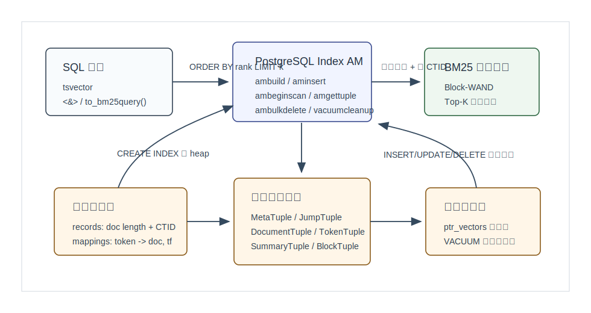
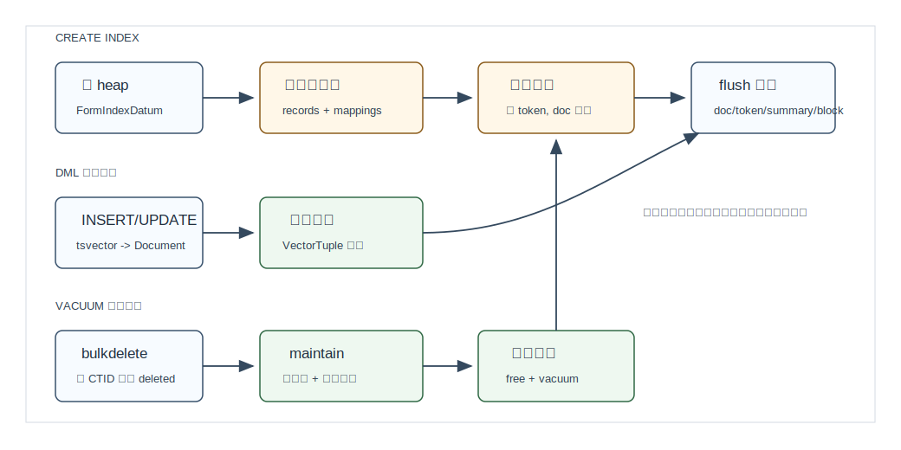
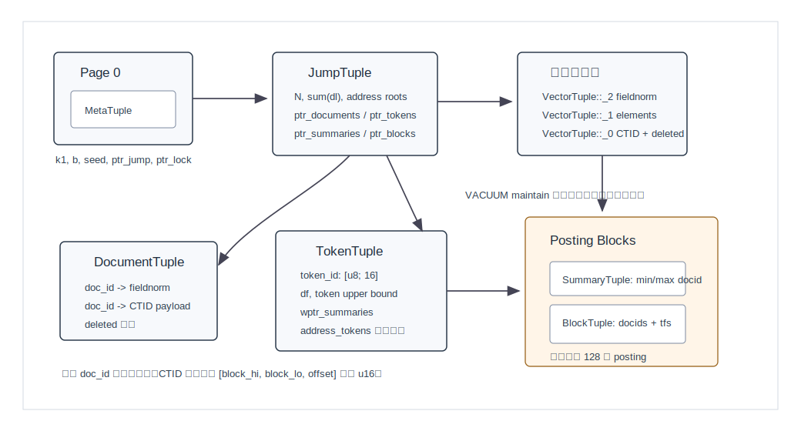
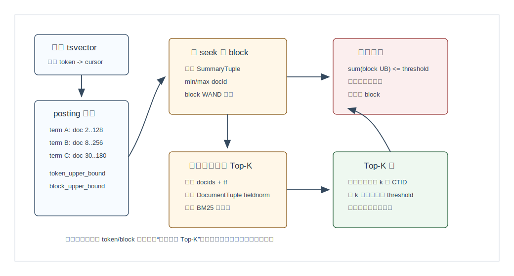

## 数据库筑基课 - VectorChord-bm25 索引结构
                                                                                            
### 作者                                                                
digoal                                                                
                                                                       
### 日期                                                                     
2026-05-26                                                      
                                                                    
### 标签                                                                  
PostgreSQL , VectorChord-bm25 , 应用开发者 , DBA , 数据库筑基课 , 索引结构 , BM25 , 倒排索引 , Block-WAND , pgrx  
                                                                                           
----                                                                    

## 背景
  

本节属于“索引结构”基础能力。当前工作区没有发现“数据库筑基课”总纲文件，因此本文先独立成篇。

业务里有一类需求很朴素：数据已经在 PostgreSQL 表里，我想对标题、正文、日志、评论做相关性排序，SQL 最好还是这样写：

```sql
SELECT id, passage
FROM documents
ORDER BY to_tsvector('english', passage) <&>
         to_bm25query(to_tsvector('english', 'PostgreSQL'), 'documents_passage_bm25')
LIMIT 10;
```

如果没有专门索引，数据库只能逐行分词、匹配、打分、排序。文档多了以后，瓶颈不是 BM25 公式本身，而是：

- 候选文档太多，不能每次都完整打分。
- 高频词 posting list 很长，不能每次都完整解压。
- 相关性排序必须和 `LIMIT` 配合，否则先算全量再排序会浪费大量 CPU。
- 数据库还有 MVCC、CTID、VACUUM、并发建索引、执行器过滤条件，不能只照搬一个搜索引擎内核。

VectorChord-bm25 的回答是：在 PostgreSQL 里实现一个自定义 Index Access Method，索引内部保存压缩倒排结构，查询时用 Block-WAND 一类上界剪枝算法做 Top-K BM25 排序。

本文参考了本地 `VectorChord-bm25` 源码、`VectorChord-bm25/CLAUDE.md`、项目 README、DeepWiki `tensorchord/VectorChord-bm25`、PostgreSQL Index AM 文档、BM25/Block-Max WAND 经典资料，以及用户给出的 RaBitQ、VBASE 论文。这里先说明一个重要边界：**RaBitQ 和 VBASE 是向量 ANN 与关系查询融合方向的论文，不是 VectorChord-bm25 这个 BM25 倒排索引的直接实现依据。** 它们适合放在“向量检索与关键词检索的边界对比”里，不适合拿来解释 BM25 posting list。

另一个版本差异也要提前讲清楚：DeepWiki 页面和 README 中仍可见旧接口痕迹，例如 `bm25vector`、`bm25_catalog.*` 等表述；本文以当前本地源码 `14fc2a332b665e1f38eb5d59bb85c8ac1a00490d` 为准。当前安装 SQL 定义的是 `tsvector`、`bm25query`、`to_bm25query(tsvector, regclass)`、`<&>` 操作符和 `USING bm25` 索引访问方法。

## 一、它解决什么问题？

BM25 索引解决的是“按词项找到候选文档，并按相关性取 Top-K”的问题。倒排索引把文档到词的关系倒过来：

```text
doc 1: PostgreSQL database search
doc 2: PostgreSQL full text
doc 3: BM25 search engine

倒排:
PostgreSQL -> doc 1, doc 2
search     -> doc 1, doc 3
BM25       -> doc 3
```

但这只是第一步。真实搜索还有三个代价：

1. **长 posting list**：高频词可能命中大量文档。
2. **Top-K 阈值**：只要前 10 条，没必要给所有候选完整打分。
3. **数据库生命周期**：文档更新、删除、VACUUM、MVCC 可见性都要处理。

VectorChord-bm25 的核心取舍是：

- 用 `tsvector` 作为用户侧文本向量表示，避免重新发明 PostgreSQL 文本输入类型。
- 用内部 token id、document id、term frequency、fieldnorm 组成 BM25 需要的数据。
- 用每 128 个 posting 一块的 block summary 保存分数上界，查询时先判断“这个块有没有机会进 Top-K”。
- 用 `ptr_vectors` 追加区承接增量写入，再通过 VACUUM/maintenance 重写为压缩倒排结构。

代价也很明确：

- 这是相关性排序索引，不是语义向量索引；它不理解“意思相近但词不同”。
- `bm25.limit` 或索引 reloption `limit` 必须和业务 Top-K 预期匹配，过小会让过滤后结果不足。
- `prefilter` 可以让 WHERE 条件提前参与候选筛选，但会引入 heap fetch 和表达式求值成本。
- VACUUM 维护不是只清一张位图，而是可能重编号、重建倒排链、回收旧页。

## 二、它是什么？

一句话定义：**VectorChord-bm25 是 PostgreSQL 上的 BM25 自定义索引访问方法，内部用压缩倒排表和 Block-WAND 上界剪枝来支持 `ORDER BY tsvector <&> bm25query LIMIT k`。**



图 1 说明：VectorChord-bm25 分成四层。SQL 层暴露 `tsvector`、`bm25query`、`<&>` 和 `USING bm25`；Index AM 层接入 PostgreSQL 的 `ambuild`、`aminsert`、`amgettuple`、`ambulkdelete` 等回调；算法层负责 BM25 和 Block-WAND；存储层把文档表、词项表、summary、posting block 和追加区落在 PostgreSQL index relation 的页面里。

当前源码中的关键入口：

- `src/sql/finalize.sql`：定义 `bm25query`、`<&>`、`to_bm25query()`、`CREATE ACCESS METHOD bm25` 和 `bm25_ops` operator class。
- `src/index/bm25/am/mod.rs`：定义 `IndexAmRoutine`，包括 `ambuild`、`aminsert`、`ambulkdelete`、`amvacuumcleanup`、`ambeginscan`、`amrescan`、`amgettuple`。
- `crates/bm25/src/build.rs`：写 `MetaTuple`、`JumpTuple`，并调用 `flush()` 生成主要倒排结构。
- `crates/bm25/src/flush.rs`：从排序后的 `(token, document, tf)` 流写出 document、token、summary、block 和地址树。
- `crates/bm25/src/search.rs`：实现查询路径，维护 Top-K 阈值、token 上界、block 上界和精确打分。
- `crates/bm25/src/maintain.rs`：VACUUM cleanup 时把未删除数据重编号、重写倒排结构并回收旧页。

几个术语先统一：

| 术语 | 含义 |
|---|---|
| `tsvector` | PostgreSQL 文本向量类型，当前源码用它作为索引列输入。 |
| `bm25query` | 复合类型，包含 query `tsvector` 和目标 index `regclass`。 |
| internal token id | `[u8; 16]`，短 token 可直接存储，长 token 或含零字节 token 用带 seed 的 BLAKE3 hash。 |
| internal document id | 构建或维护时分配的连续 `u32` 编号，不等于业务主键。 |
| payload | heap CTID，源码用 `[u16; 3]` 表示 block high、block low、offset。 |
| fieldnorm | 用 1 byte 近似表示文档长度，BM25 评分时再查表还原为近似长度。 |
| summary | 每个 posting block 的 min/max docid、block 内上界所需的 fieldnorm/tf 和 block 指针。 |
| append vector | 增量插入写入的未压缩追加区，查询时也会参与打分。 |

## 三、核心原理

### 3.1 SQL 与 Index AM：让相关性排序成为索引扫描

PostgreSQL 文档说明，支持 `ORDER BY indexed_column operator constant` 的访问方法需要设置 `amcanorderbyop`。VectorChord-bm25 的 `AM_HANDLER` 设置了：

- `amcanorderbyop = true`：允许 planner 把 `ORDER BY tsvector <&> bm25query` 交给索引。
- `amoptionalkey = true`：允许没有普通 WHERE key 的 order-by scan，但源码在既没有 key 也没有 orderby 时直接报错。
- `amcanbuildparallel = false`：当前 feature 下 BM25 索引构建不宣称并行构建。
- `amcostestimate`：当前实现非常粗，启用扫描时把 startup/total cost 设置为 0，并按 PostgreSQL selectivity 函数估算过滤选择率。

`amgettuple()` 还有两个硬约束：

- 只支持 `ForwardScanDirection`。
- 只支持 MVCC-compliant snapshot。源码注释说明，如果物理 CTID 指向的 heap tuple 在被 PostgreSQL 消费前删除，非 MVCC 扫描可能拿到错误或无关的物理指针。

这说明 VectorChord-bm25 不是一个旁路搜索服务，而是 PostgreSQL executor 调用的索引扫描器。它返回的是 CTID，最终行可见性、回表和上层 WHERE 语义仍然属于数据库执行器。

### 3.2 构建：heap tuple -> records/mappings -> 压缩倒排页

`CREATE INDEX ... USING bm25` 的构建路径可以拆成四步：

1. `ambuild()` 扫 heap，通过 `FormIndexDatum()` 取得索引表达式值。
2. `cast_tsvector_to_document()` 把 `tsvector` 变成内部 `Document`：token id 排序、重复 token 的频次求和。
3. `bm25::io::write()` 写两个临时流：`records` 保存文档长度和 CTID；`mappings` 保存 token id、internal document id、term frequency。
4. `locally_merge()` 对 mappings 做外部归并排序，然后 `flush()` 生成 PostgreSQL index pages。



图 2 说明：构建时先把 heap 转成两个临时流，再按 token/doc 排序，最后 flush 成倒排结构。普通 INSERT/UPDATE 不立即重写主倒排表，而是追加到 `ptr_vectors` 链；VACUUM cleanup 再把未删除的旧文档和追加文档合并成新的压缩倒排结构。

源码里的 `Record` 和 `Mapping` 很小：

```rust
pub struct Record(pub u32, pub [u16; 3]);
pub struct Mapping(pub [u8; WIDTH], pub u32, pub u32);
```

含义分别是：

- `Record(document_length, ctid_payload)`。
- `Mapping(token_id, document_id, term_frequency)`。

注意这里的 `document_length` 不是唯一 token 数，而是 term frequency 之和。`Document::length()` 对所有元素的 `value` 求和；随后 `length_to_fieldnorm()` 把长度压成 1 byte。

### 3.3 物理结构：MetaTuple、JumpTuple、Document、Token、Summary、Block

构建完成后，索引 relation 的页面不是一条 posting list 从头写到尾，而是多组 tape/地址结构组合。



图 3 说明：第 0 页保存 `MetaTuple`，里面有 `k1`、`b`、`seed`、`ptr_jump`、`ptr_lock`。`JumpTuple` 相当于总目录，指向文档表、词项表、summary tape、block tape、追加向量区和地址树根。查询时先走 token 地址树定位 `TokenTuple`，再沿 summary/block 读 posting；需要根据 docid 取 fieldnorm 或 CTID 时再走 document 地址树。

主要 tuple 的职责如下：

| 结构 | 关键字段 | 作用 |
|---|---|---|
| `MetaTuple` | `k1`、`b`、`ptr_lock`、`ptr_jump`、`seed` | 全局参数和入口。 |
| `JumpTuple` | 文档数、总长度、各 tape 指针、地址树 root | 主目录。 |
| `DocumentTuple` | `fieldnorm`、`payload`、`deleted` | internal docid 到 CTID 和长度归一化信息。 |
| `TokenTuple` | `id`、`df`、token WAND 上界、`wptr_summaries` | token 到 posting summary 链入口。 |
| `SummaryTuple` | min/max docid、block WAND 上界、block 指针 | 让查询先判断 block 是否值得解压。 |
| `BlockTuple` | 压缩 docids、压缩 term frequencies | 真正的 posting 数据。 |
| `VectorTuple` | fieldnorm、elements、payload、deleted | 追加区，承接增量写入。 |

两个地址树也值得注意：

- `address_tokens`：按 token id 有序，读时在叶页里二分定位 token。
- `address_documents`：按连续 docid 做宽度固定的多层寻址，用于从 docid 找到 `DocumentTuple`。

这套结构避免了把所有 posting 直接做成一个巨大的线性数组。代价是实现复杂度上升，尤其是维护时要同时更新主目录、地址树和旧页回收链。

### 3.4 BM25 公式：idf、tf、fieldnorm 和负分

当前源码的默认参数：

```rust
k1 = 1.2
b  = 0.75
```

校验范围是：

```text
1.2 <= k1 <= 2.0
0.0 <= b  <= 1.0
```

源码中的 idf 公式是：

```text
idf = ln((N + 1) / (df + 0.5))
```

其中 `N` 是索引中文档数，`df` 是包含该 token 的文档数。tf 部分是经典 BM25 的长度归一化形式：

```text
tf_part =
  tf * (k1 + 1)
  / (tf + k1 * (1 - b + b * document_length / avgdl))
```

`document_length` 不是从原文实时计算，而是通过 1 byte `fieldnorm` 查表得到近似长度。这个设计用精度换空间和随机访问速度：每个文档只保存一个很小的长度桶，但长文档之间的细微长度差异会被量化。

用户看到的 `<&>` 分数是负数。`_bm25_evaluate()` 最后返回 `-score.to_f64()`，README 也说明这样做是为了让 PostgreSQL 默认升序 `ORDER BY rank` 时把更相关的文档排在前面。

### 3.5 压缩 posting：128 个一块，满块 bitpacking，尾块 bytepacking

`flush()` 按 token 读取排序后的 mappings，每个 token 的 posting list 被切成最多 128 条一块：

```text
token = PostgreSQL
  block 0: (doc 1, tf 2) ... (doc 128, tf 1)
  block 1: (doc 130, tf 1) ... (doc 209, tf 3)
```

每个 block 写两类数据：

- `SummaryTuple`：min docid、max docid、block 内能产生最高 BM25 tf 部分的 fieldnorm/tf、对应 `BlockTuple` 指针。
- `BlockTuple`：压缩后的 docids 和 term frequencies。

压缩策略：

- docids 是有序的，满 128 条时走 `bitpacking_u32_ordered`，不足 128 条时走 `bytepacking_u32_ordered`。
- term frequencies 不需要有序，满 128 条时走 `bitpacking_u32_unordered`，尾块走 `bytepacking_u32_unordered`。

这和 Block-WAND 的目标一致：绝大多数时候先读 summary 和上界，不急着解压 block；只有 block 上界可能超过当前 Top-K 阈值时，才解压 docids/tfs 做精确打分。

### 3.6 查询：先扫追加区，再用 Block-WAND 扫压缩倒排

`search()` 的流程有一个容易忽略的细节：它先扫描 `ptr_vectors` 追加区，把还没 merge 进倒排表的增量文档算进去；然后才创建 token cursors，进入压缩倒排结构的 Block-WAND 搜索。

压缩倒排搜索的核心状态：

- 每个 query token 对应一个 `Cursor`。
- `token_upper_bound` 是这个 token 在全索引层面的最大可能贡献。
- `block_upper_bound` 是当前 block 的最大可能贡献。
- `Results` 维护 Top-K 堆和当前阈值 `threshold`。
- 当候选数量达到 k 后，第 k 名分数会提高 threshold，后续跳过更激进。



图 4 说明：查询不是“把所有 posting 解压再算分”。它先用 token upper bound 和 block upper bound 判断某些游标或 block 是否还有进入 Top-K 的机会。只有上界仍然可能超过阈值时，才解压 block、读取 document fieldnorm、计算 BM25 精确分，并把 CTID 放入 Top-K 堆。

源码里的决策可以概括成三层：

1. **token 级跳过**：如果已有 tail token 的上界加上当前 token 上界仍不超过 threshold，就继续推进。
2. **block 级跳过**：把 lead/tail cursors 的 block upper bound 相加；如果不超过 threshold，不解压，跳到下一个可能 docid。
3. **document 级打分**：只有 block 上界过线后，才读取 `DocumentTuple` 的 fieldnorm，逐 token 取 tf，计算精确 BM25。

这就是 Block-WAND 的价值：它不是改变 BM25 语义，而是减少不可能进入 Top-K 的打分工作。

### 3.7 删除与维护：先标记，再重建可用倒排

`ambulkdelete()` 调用 `bm25::bulkdelete()`，用 PostgreSQL 传入的 callback 判断某个 CTID 是否该删。源码对两类位置都做 deleted 标记：

- `ptr_vectors` 追加区里的 `VectorTuple::_0.deleted`。
- 主倒排对应的 `DocumentTuple.deleted`。

真正的空间整理在 `amvacuumcleanup()` 里触发 `bm25::maintain()`：

1. 读取旧 `DocumentTuple`，给未删除文档重新分配连续 document id。
2. 解压旧 token summary/block，把未删除 posting 重新写入 mappings。
3. 扫描追加区，把未删除向量也写入 mappings。
4. 对 mappings 归并排序，重新 `flush()` 成新的 document/token/summary/block 结构。
5. 更新 `JumpTuple` 指针，回收旧页链，最后调用 `index.vacuum()`。

这意味着删除不是立即从 posting block 中物理移除。短期内它靠 deleted 标记避免返回无效文档；长期由 VACUUM cleanup 合并和回收空间。DBA 需要把它看成“写入快、维护重”的倒排索引，而不是 B-tree 那种局部页删除模型。

## 四、横向对比

| 维度 | VectorChord-bm25 | PostgreSQL GIN + tsvector | ParadeDB BM25 | VectorChord vchordrq |
|---|---|---|---|---|
| 主要目标 | PostgreSQL 内 BM25 Top-K 排序 | 词项匹配、全文过滤 | 搜索引擎式 BM25/过滤/聚合 | 向量 ANN 相似度检索 |
| 数据模型 | `tsvector` + 自定义 `bm25query` | `tsvector`/`tsquery` | 多字段搜索索引 | `vector`/`halfvec`/量化向量 |
| 核心结构 | 压缩倒排 + summary/block 上界 | GIN posting tree/list | Tantivy segment/posting | IVF/RaBitQ/图索引等 |
| Top-K | Block-WAND 剪枝 | 通常需要再排序评分 | Block-Max WAND 等搜索引擎能力 | ANN 候选 + 重排 |
| 写入 | 追加区接收增量，维护时重写 | PostgreSQL GIN 维护逻辑 | segment 写入与 merge | ANN 结构插入/维护 |
| 删除 | deleted 标记 + VACUUM cleanup 重建 | GIN/VACUUM 处理 | segment delete/MVCC 处理 | MVCC 与索引维护 |
| 适合 | 单列表达式 BM25 排序、Postgres 内闭环 | 传统全文匹配、布尔查询 | 多字段搜索应用 | embedding 语义召回 |
| 不适合 | 语义相似、复杂搜索 DSL、多列 search engine 场景 | 高质量 BM25 Top-K | 极简轻量扩展场景 | 关键词精确相关性排序 |

这里的关键不是谁替代谁，而是问题不同：

- 关键词检索关心 token、tf、df、field length、posting list 和 Top-K 评分。
- 向量检索关心距离、召回率、压缩误差、候选重排和过滤融合。
- RaBitQ 论文讲的是高维向量量化与误差界，VBASE 论文讲的是向量相似检索和关系谓词在线融合；它们能启发“过滤和 Top-K 如何融合”，但不能直接解释 BM25 posting block。

## 五、效果如何？

本文没有编造性能数字。只从机制上看，VectorChord-bm25 的收益来自四个地方：

1. **倒排减少候选**：不含查询 token 的文档不会进入对应 posting list。
2. **summary 减少解压**：block 上界不足时不用解压 docids/tfs。
3. **Top-K 阈值减少打分**：当前第 k 名分数越高，后续越容易跳过。
4. **追加区降低写入放大**：普通插入先写向量链，避免每次插入都重写压缩倒排。

代价也对应四类：

1. **空间放大**：除了 heap，还要保存文档表、词项表、summary、block、地址树和追加区。
2. **维护放大**：VACUUM cleanup 可能解压、重编号、排序、重写倒排。
3. **过滤取舍**：`prefilter` 打开后能避免过滤后结果不足，但需要提前 heap fetch 和执行 qual。
4. **planner 风险**：当前 `amcostestimate` 还比较粗，实际生产需要用 `EXPLAIN` 验证是否选中期望路径。

特别注意 `bm25.limit`。本地 sqllogictest 里显式设置：

```sql
SET "bm25.limit" = 10;
```

另一个测试展示了过滤条件的行为：

- 不开 `bm25.prefilter`，索引先拿全局 top 3，再由 SQL `WHERE condition = TRUE` 过滤，最终可能少于业务 `LIMIT`。
- 开 `bm25.prefilter = on`，搜索阶段会通过 heap fetch 判断 WHERE 条件，能继续寻找满足条件的 top-k，但成本更高。

所以 `limit`、SQL `LIMIT`、WHERE 选择率、是否 prefilter 必须一起调。

## 六、实操 DEMO

下面示例来自项目 `tests/sqllogictest/indexing.slt` 的当前接口风格。本文没有在本机启动 PostgreSQL 执行这些 SQL；语法依据本地测试文件和安装 SQL 校对。

```sql
CREATE EXTENSION IF NOT EXISTS vchord_bm25;

CREATE TABLE documents (
    id SERIAL PRIMARY KEY,
    passage TEXT
);

INSERT INTO documents (passage) VALUES
('PostgreSQL is a powerful, open-source object-relational database system.'),
('Full-text search is a technique for searching in plain-text documents.'),
('BM25 is a ranking function used by search engines.'),
('PostgreSQL provides many advanced features like full-text search.');

CREATE INDEX documents_passage_bm25
ON documents
USING bm25 ((to_tsvector('english', passage)) bm25_ops);

SET enable_seqscan = off;
SET "bm25.limit" = 10;

SELECT id,
       passage,
       to_tsvector('english', passage) <&>
       to_bm25query(to_tsvector('english', 'PostgreSQL'), 'documents_passage_bm25') AS rank
FROM documents
ORDER BY rank
LIMIT 10;
```

如果有过滤条件，并且希望过滤参与 Top-K 搜索过程：

```sql
ALTER TABLE documents ADD COLUMN visible boolean DEFAULT true;

SET "bm25.limit" = 20;
SET "bm25.prefilter" = on;

SELECT id, passage
FROM documents
WHERE visible
ORDER BY to_tsvector('english', passage) <&>
         to_bm25query(to_tsvector('english', 'PostgreSQL'), 'documents_passage_bm25')
LIMIT 10;
```

验证建议：

```sql
EXPLAIN (ANALYZE, BUFFERS)
SELECT id, passage
FROM documents
ORDER BY to_tsvector('english', passage) <&>
         to_bm25query(to_tsvector('english', 'PostgreSQL'), 'documents_passage_bm25')
LIMIT 10;
```

重点看三件事：

- 是否走 `documents_passage_bm25` 索引扫描。
- `bm25.limit` 是否大于等于业务需要的候选数。
- 打开 `bm25.prefilter` 后 heap fetch 是否明显增加。

## 七、最佳实践

面向数据库架构师：

- 把 VectorChord-bm25 定位为“PostgreSQL 内轻量 BM25 Top-K 能力”，不要把它当成完整 Elasticsearch/ParadeDB 替代品。
- 如果业务同时需要语义召回和关键词排序，建议把 VectorChord-bm25 与向量索引分层组合：向量负责语义候选，BM25 负责关键词精排或反向。
- 对多租户和强过滤 workload，单独压测 `prefilter`。过滤选择率高时 prefilter 可能有价值；过滤很松或表达式很重时，提前 heap fetch 可能反而拖慢。

面向 DBA：

- 建索引后用 `EXPLAIN (ANALYZE, BUFFERS)` 验证 planner 行为。当前 cost estimate 很粗，不要只凭 SQL 形态判断。
- 把 VACUUM 维护纳入容量和窗口规划。删除多、更新多的表会在 cleanup 阶段重写倒排结构。
- 监控索引体积、VACUUM 时长、查询 P95/P99 和 heap fetch。尤其关注追加区持续增长后，查询是否越来越依赖扫描 `ptr_vectors`。
- 用 reloption 或会话级 GUC 明确设置 `limit`，不要让业务 SQL 的 `LIMIT` 和索引内部 top-k 上限脱节。

面向业务开发者：

- 建索引表达式和查询表达式要一致，例如都用 `to_tsvector('english', passage)`；否则 planner 未必能匹配索引。
- 记住 `<&>` 分数越小越相关，因为扩展返回负 BM25 分数。
- 查询 tokenization 要和建索引一致。当前接口直接用 PostgreSQL `tsvector`，README 中 pg_tokenizer 相关内容更像旧接口或外部配套说明，落地时以安装 SQL 和测试为准。
- 对中文文本，先确定 `tsvector` 的分词方案能不能满足业务；BM25 索引不能弥补错误分词。

## 八、适合与不适合场景

适合：

- 文档、日志、商品描述、知识库条目的关键词相关性 Top-K。
- 数据已经在 PostgreSQL 内，希望减少外部搜索系统同步链路。
- 查询主要是单列或表达式 `tsvector` 的 BM25 排序。
- 有明确 `LIMIT k`，并且 k 不大。
- 能接受 VACUUM cleanup 做周期性重写和空间整理。

不适合：

- 需要语义相似、跨语言语义召回、embedding 检索的场景；这应使用向量索引。
- 需要复杂搜索 DSL、多字段 boost、facet、聚合和搜索运维平台的场景；ParadeDB 或专门搜索引擎更合适。
- 写入极高、删除更新极频繁、又没有维护窗口的表。
- 不带 Top-K 的全量相关性排序或导出；Block-WAND 的收益会下降。
- 分词质量无法保证的语言或业务文本。

## 九、常见坑

1. **把 README 旧接口照搬到当前源码**

   当前 `src/sql/finalize.sql` 定义的是 `tsvector` operator class，不是 README 早期描述里的 `bm25vector`。写文章、写脚本、做 Demo 都应以安装 SQL 和 sqllogictest 为准。

2. **忘记设置 `bm25.limit`**

   `SearchOptions.limit` 来自 GUC 或 reloption；`DefaultBuilder` 里 `NonZero::new(options.limit)` 为 0 时会报错。实际使用中应显式设置，或在索引 reloption 中固定。

3. **过滤后结果不足**

   如果 `bm25.limit = 10`，但 WHERE 条件过滤掉其中 8 条，最终只剩 2 条。需要提高内部 limit，或打开 `bm25.prefilter`，并接受提前 heap fetch 的成本。

4. **把 `prefilter` 当成免费优化**

   `HeapFetcher` 会按 CTID 取 heap tuple，并执行 qual。过滤非常选择性时值得；过滤不选择性或 heap 随机读很贵时可能变慢。

5. **更新删除后只看查询正确性，不看空间和维护**

   bulk delete 先标记 deleted，物理整理靠 maintain。更新删除多的 workload 要看 VACUUM cleanup 的耗时和索引膨胀。

6. **把 BM25 和向量 ANN 混为一谈**

   RaBitQ/VBASE 解决的是向量距离估计、误差界、关系过滤融合。VectorChord-bm25 解决的是 token posting、BM25 分数和 Top-K 剪枝。

## 十、扩展问题

1. 如果把 block 大小从 128 改成 64 或 256，会怎样影响压缩率、跳过能力和解压成本？
2. `fieldnorm` 用 1 byte 近似保存长度，对长文档排序会产生什么偏差？
3. `bm25.limit` 应该等于 SQL `LIMIT`，还是应该按过滤选择率放大？如何用线上数据估算？
4. 为什么追加区要先参与查询，而不是等 VACUUM 后再可见？
5. 如果要支持多列字段 boost，应在 token id、DocumentTuple、BM25 scoring 哪一层扩展？
6. 如果 planner cost estimate 过于乐观，DBA 可以用哪些观测数据校正使用策略？

## 十一、扩展阅读

- 本地源码：`VectorChord-bm25/CLAUDE.md`。
- 本地源码：`VectorChord-bm25/src/sql/finalize.sql`。
- 本地源码：`VectorChord-bm25/src/index/bm25/am/mod.rs`。
- 本地源码：`VectorChord-bm25/crates/bm25/src/search.rs`。
- 本地源码：`VectorChord-bm25/crates/bm25/src/flush.rs`。
- 本地源码：`VectorChord-bm25/crates/bm25/src/maintain.rs`。
- 本地测试：`VectorChord-bm25/tests/sqllogictest/indexing.slt`、`prefilter.slt`。
- DeepWiki：[tensorchord/VectorChord-bm25](https://deepwiki.com/tensorchord/VectorChord-bm25)。本文只把它作为架构导航；具体接口以本地源码为准。
- PostgreSQL 文档：[Index Scanning](https://www.postgresql.org/docs/current/index-scanning.html)、[Index Access Method API](https://www.postgresql.org/docs/current/index-api.html)。
- Stephen Robertson 等：[Okapi at TREC-3](https://www.microsoft.com/en-us/research/publication/okapi-at-trec-3/)。
- Shuai Ding, Torsten Suel：[Faster Top-k Document Retrieval Using Block-Max Indexes](https://research.engineering.nyu.edu/~suel/papers/bmw.pdf)。
- Jianyang Gao, Cheng Long：[RaBitQ: Quantizing High-Dimensional Vectors with a Theoretical Error Bound for Approximate Nearest Neighbor Search](https://arxiv.org/abs/2405.12497)。用于理解 VectorChord 向量索引方向，不是本文 BM25 索引结构的直接依据。
- Qianxi Zhang 等：[VBASE: Unifying Online Vector Similarity Search and Relational Queries via Relaxed Monotonicity](https://www.usenix.org/conference/osdi23/presentation/zhang-qianxi)。用于理解向量检索与关系过滤融合，不是本文 BM25 posting 结构的直接依据。
  
## 附录  
  
1、问 gemini  
```  
VectorChord-bm25 索引结构相关的论文、开源项目.
```  
  
2、克隆代码  
```  
git clone --depth 1 https://github.com/supervc-stack/VectorChord-bm25
```  
  
3、启用 codex, 使用 [数据库筑基课 skill](../skills/README.md).  
````
文章标题: 
  数据库筑基课 - VectorChord-bm25 索引结构
项目源码(已克隆到当前项目如下目录中):  
  VectorChord-bm25
论文: 
  RaBitQ: Quantizing High-Dimensional Vectors with a Theoretical Error Bound for Approximate Nearest Neighbor Search
  VBASE: Unifying Online Vector Similarity Search and Relational Queries via Relaxed Monotonicity
项目 deepwiki reponame:  
  tensorchord/VectorChord-bm25
项目参考信息: 
  VectorChord-bm25/CLAUDE.md
````
   
  
#### [PostgreSQL 解决方案集合](../201706/20170601_02.md "40cff096e9ed7122c512b35d8561d9c8")
  
  
#### [德哥 / digoal's Github - 公益是一辈子的事.](https://github.com/digoal/blog/blob/master/README.md "22709685feb7cab07d30f30387f0a9ae")
  
  
#### [About 德哥](https://github.com/digoal/blog/blob/master/me/readme.md "a37735981e7704886ffd590565582dd0")
  
  

  
