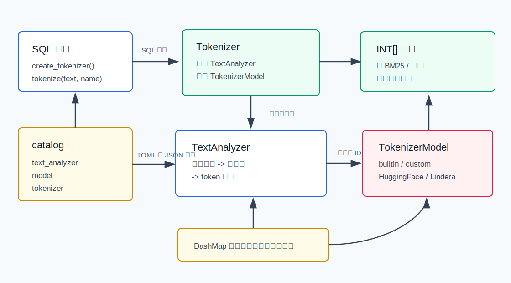
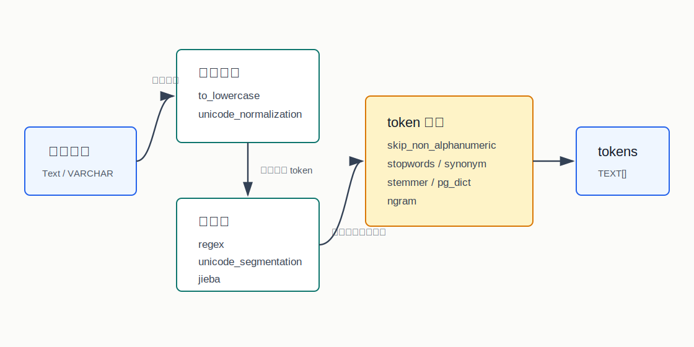
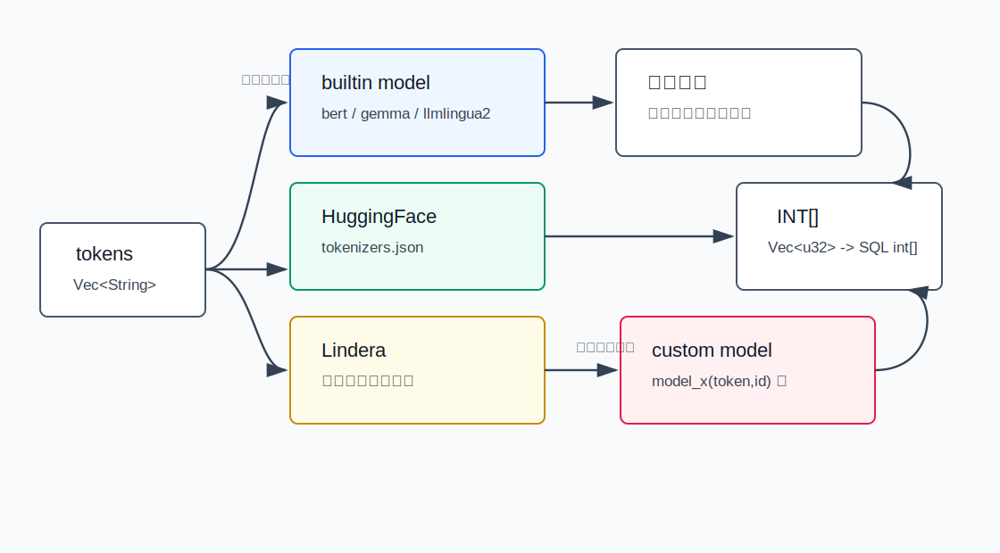
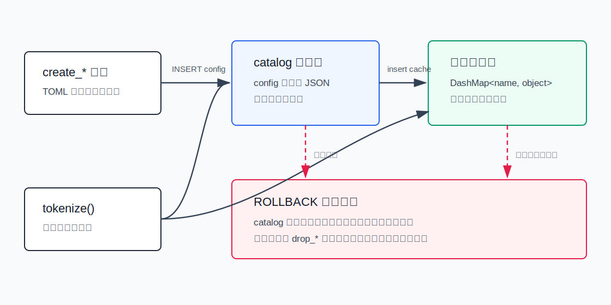
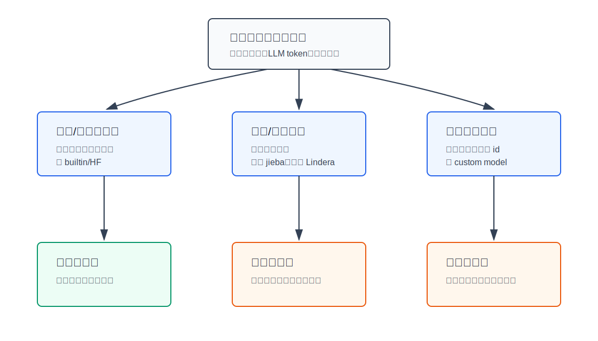

## 数据库筑基课 - pg_tokenizer 词元化
                                                                                            
### 作者                                                                
digoal                                                                
                                                                       
### 日期                                                                     
2026-05-26                                                      
                                                                    
### 标签                                                                  
PostgreSQL , pg_tokenizer , VectorChord , 应用开发者 , DBA , 数据库筑基课 , 数据类型与算子 , 词元化 , 全文检索 , LLM  
                                                                                           
----                                                                    

## 背景


本节属于“数据类型与算子 / 场景实践”基础能力。当前工作区没有发现“数据库筑基课”总纲文件，因此本文先独立成篇。  

数据库里做文本检索、BM25、RAG、提示词压缩、日志聚类，第一步通常不是建索引，而是把“人读的字符串”变成“机器可比较的词元”。如果这一步不稳定，后面再好的索引和排序都会被拖垮：

- 中文“数据库系统”到底是一个词、两个词，还是字粒度 n-gram？
- 英文 `running`、`runs`、`run` 要不要归一到同一个词干？
- 全角字符、大小写、重音符号、标点和 emoji 要不要保留？
- LLM 模型希望看到的是子词 token id，BM25 希望看到的是 term frequency，业务系统又可能需要一套私有词表。
- PostgreSQL 连接里创建、回滚、删除 tokenizer 后，缓存和 catalog 是否一致？

`pg_tokenizer.rs` 的回答是：把词元化拆成两层。第一层 `TextAnalyzer` 负责文本清洗、切分和 token 过滤；第二层 `TokenizerModel` 负责把 token 映射成整数 ID。它不是 PostgreSQL 内置全文检索的简单包装，而是给 VectorChord-bm25、LLM token、私有词表和多语言分词提供一个可配置的 PostgreSQL 扩展。

本文参考本地 `pg_tokenizer.rs` 源码、`CLAUDE.md`、README、docs、sqllogictest、DeepWiki `tensorchord/pg_tokenizer.rs`，以及三类背景资料：Sennrich 等人的 BPE 论文 [Neural Machine Translation of Rare Words with Subword Units](https://aclanthology.org/P16-1162/)、Microsoft 的 [LLMLingua-2](https://arxiv.org/abs/2403.12968) 论文、Büttcher/Clarke/Cormack 的 *Information Retrieval: Implementing and Evaluating Search Engines*。用户给出的 LLMLingua-2 标题写作 “Task-Oriented”，论文正式标题是 “Task-Agnostic Prompt Compression”；本文按正式论文名引用。

## 一、它解决什么问题？

词元化解决的不是“怎么查得快”，而是“什么东西算同一个可检索单元”。数据库场景里这个问题比单机 NLP 脚本更麻烦，因为词元化结果会进入表、索引、触发器、查询计划和线上发布流程。

传统做法有三类：

1. 直接用 PostgreSQL `to_tsvector()`。优点是成熟、稳定、可配 dictionary；缺点是很难直接复用 LLM/HuggingFace 词表，也不方便把结果保存成整数 token id 数组。
2. 在应用层分词后写入数据库。优点是语言生态丰富；缺点是数据库内外词表、版本和触发器一致性容易漂移。
3. 在数据库扩展里统一做。优点是 SQL 内可复现、可和 BM25/向量索引同库协作；代价是扩展要承担模型加载、缓存、事务边界和安全配置。

`pg_tokenizer.rs` 选择第三条路。它把配置存进 `tokenizer_catalog`，把运行对象缓存在进程内，然后用 SQL 函数输出 `INT[]`：

```sql
SELECT tokenizer_catalog.tokenize(
  'PostgreSQL is a powerful database system.',
  'tokenizer1'
);
```

这个 `INT[]` 可以保存到普通列，也可以作为后续 BM25、向量化、提示词压缩或业务召回的中间表示。

## 二、它是什么？

一句话定义：**pg_tokenizer 是一个 PostgreSQL pgrx 扩展，用可配置 TextAnalyzer 生成文本 token，再用 TokenizerModel 把 token 映射为整数 token id。**



图 1 说明：SQL 层负责创建和调用；catalog 表保存 TOML 配置转换后的 JSON；`DashMap` 对象池按名称缓存已构建对象；`TextAnalyzer` 负责文本处理；`TokenizerModel` 负责映射 ID；最终 `tokenize()` 返回 PostgreSQL `INT[]`。

当前源码里的关键入口：

| 模块 | 关键文件 | 作用 |
|---|---|---|
| SQL 接口 | `src/tokenizer.rs`、`sql/install/pg_tokenizer--0.1.1.sql` | `create_tokenizer`、`drop_tokenizer`、`tokenize`。 |
| 文本分析器 | `src/text_analyzer.rs` | 构建并执行 character filter、pre tokenizer、token filter。 |
| 字符过滤 | `src/character_filter/*` | 大小写转换、Unicode 规范化。 |
| 预切分 | `src/pre_tokenizer/*` | regex、Unicode word segmentation、jieba。 |
| token 过滤 | `src/token_filter/*` | stopwords、synonym、stemmer、pg_dict、ngram 等。 |
| 模型层 | `src/model/*` | builtin、custom、HuggingFace、Lindera。 |
| 初始化 | `src/lib.rs`、`src/model/builtin.rs` | `_PG_init()`、预加载模型、PostgreSQL 版本和平台检查。 |

几个术语先统一：

| 术语 | 含义 |
|---|---|
| character filter | 在切词前改写原始字符串，例如小写化、Unicode 规范化。 |
| pre tokenizer | 把字符串切成初始 token，例如正则、Unicode 单词边界、jieba 中文切词。 |
| token filter | 在切词后过滤或改写 token，例如停用词、词干、同义词、ngram。 |
| tokenizer model | 把 token 转成整数 ID 的模型层。 |
| builtin model | 编译时打包的模型，包括 `bert_base_uncased`、`wiki_tocken`、`gemma2b`、`llmlingua2`。 |
| custom model | 在数据库内用业务语料维护 `token -> id` 映射表。 |
| object pool | 每个 PostgreSQL 后端进程里的 `DashMap` 缓存，不是 shared memory catalog。 |

## 三、核心原理

### 3.1 两段式流水线：先定义词边界，再定义 ID 空间

`Tokenizer::tokenize()` 的源码路径很短：

```rust
pub fn tokenize(&self, text: &str) -> Vec<u32> {
    let tokens = self.text_analyzer.apply(text);
    self.model.apply_batch(tokens)
}
```

真正的工程含义在于两层职责分离：

- `TextAnalyzer` 回答“这个字符串应该切成哪些 token”。
- `TokenizerModel` 回答“这些 token 在某个词表里对应哪些整数 ID”。

这和信息检索教材里的基本模型一致：文档先被解析成 terms，之后才进入词典、posting list、权重和评估。BPE 论文解决的是罕见词和开放词表问题：不把所有词都当原子词，而是用高频子词单元组合出未登录词。LLMLingua-2 则把 token 重要性和提示词压缩联系起来：token 不是越多越好，保真、延迟和上下文窗口之间有明确权衡。

数据库里的词元化要把这两条线合起来：检索系统关心 term 的可区分性和统计稳定性，LLM 系统关心模型词表和推理成本，业务系统关心版本可控和 SQL 可复现。

### 3.2 TextAnalyzer：可组合，但顺序很重要



图 2 说明：`TextAnalyzer::apply()` 先按顺序执行 character filters，再用一个可选 pre tokenizer 切出初始 token，最后按顺序执行 token filters。顺序会改变结果，例如先小写再停用词过滤，和先停用词过滤再小写，效果不同。

当前支持的组件如下：

| 层次 | 组件 | 典型用途 |
|---|---|---|
| character filter | `to_lowercase` | 统一英文大小写。 |
| character filter | `unicode_normalization = "nfc/nfd/nfkc/nfkd"` | 统一全角、组合字符、兼容字符等 Unicode 表示。 |
| pre tokenizer | `regex` | 只提取匹配正则的片段。 |
| pre tokenizer | `unicode_segmentation` | 按 Unicode Standard Annex #29 的 word 边界切词。 |
| pre tokenizer | `jieba` | 中文分词，支持 `full`、`precise`、`search` 模式。 |
| token filter | `skip_non_alphanumeric` | 丢弃纯符号 token。 |
| token filter | `stopwords` | 丢弃停用词，内置 `lucene_english`、`nltk_english`、`iso_english`。 |
| token filter | `synonym` | 把同义词归并到每行第一个词。 |
| token filter | `stemmer` | Snowball 词干化，覆盖多种语言。 |
| token filter | `pg_dict` | 调用 PostgreSQL text search dictionary 的 lexize 逻辑。 |
| token filter | `ngram` | 为 token 生成字节切片 n-gram。 |

一个英文分析器例子：

```sql
SELECT tokenizer_catalog.create_text_analyzer('text_analyzer1', $$
pre_tokenizer = "unicode_segmentation"
[[character_filters]]
to_lowercase = {}
[[character_filters]]
unicode_normalization = "nfkd"
[[token_filters]]
skip_non_alphanumeric = {}
[[token_filters]]
stopwords = "nltk_english"
[[token_filters]]
stemmer = "english_porter2"
$$);
```

项目 `tests/sqllogictest/text_analyzer.slt` 给出的期望结果是：

```sql
SELECT tokenizer_catalog.apply_text_analyzer(
  'PostgreSQL is a powerful, open-source object-relational database system. It has over 15 years of active development.',
  'text_analyzer1'
);
-- {postgresql,power,open,sourc,object,relat,databas,system,15,year,activ,develop}
```

这说明流水线已经完成了小写化、停用词过滤和 Porter2 词干化。

### 3.3 Model：同样的 token，不同的 ID 空间



图 3 说明：`TokenizerModel` 的接口只有 `apply(token) -> Vec<u32>` 和默认的 `apply_batch(tokens)`。builtin/HuggingFace/Lindera/custom 的差别不在 SQL 输出形态，而在词表来源和未知词处理方式。

当前源码有四类模型：

| 模型类型 | 配置入口 | 适合场景 | 代价 |
|---|---|---|---|
| builtin | `model = "llmlingua2"` 等 | 快速使用内置词表；和常见模型 token id 对齐。 | 词表固定，模型文件占内存。 |
| HuggingFace | `create_huggingface_model` | 导入 `tokenizers.json`，适合复用外部模型词表。 | 配置和文件管理要严格。 |
| Lindera | `create_lindera_model` | 日文形态分析和 token id 输出。 | 配置复杂，偏日文场景。 |
| custom | `create_custom_model` | 用表内语料生成业务私有 `token -> id`。 | 依赖触发器和 catalog 表，线上变更要管一致性。 |

源码细节值得注意：

- builtin 模型通过 `include_bytes!` 或 `include_str!` 打进扩展，`PRELOAD_MODELS` 默认只有 `llmlingua2`。
- `tokenizers::Tokenizer` 的实现调用 `encode_fast(token, false)`，一个输入 token 可能被拆成多个子词 ID。
- `tocken::Tokenizer` 用于 `wiki_tocken`。
- custom model 的 `apply_batch()` 会用 `WHERE token = ANY($1)` 一次性查 `tokenizer_catalog."model_x"`，再按输入 token 顺序输出找到的 ID；找不到的 token 会被丢弃。

这就是为什么“词元化”不能只看输出是不是 `INT[]`。同一句话用 `bert_base_uncased`、`llmlingua2`、custom 词表得到的 ID 空间完全不同，不能混用。

### 3.4 custom model：把业务语料变成数据库内词表

custom model 的创建过程可以理解为：

1. 先创建一个 text analyzer。
2. 扫描业务表目标列，把文本分析成 token。
3. 创建 `tokenizer_catalog."model_<name>"(id identity, token unique)`。
4. 把已有 distinct token 插入模型表。
5. 在源表上创建触发器，新写入或更新时补充新 token。
6. 可选地创建 tokenizer 和写目标列的触发器。

源码里的组合函数是：

```sql
SELECT tokenizer_catalog.create_custom_model_tokenizer_and_trigger(
    tokenizer_name => 'tokenizer1',
    model_name => 'model1',
    text_analyzer_name => 'text_analyzer1',
    table_name => 'documents',
    source_column => 'passage',
    target_column => 'embedding'
);
```

这个函数不仅创建 custom model 和 tokenizer，还会：

- `UPDATE documents SET embedding = tokenize(passage, 'tokenizer1')` 回填已有行。
- 创建 `BEFORE INSERT OR UPDATE OF passage` 触发器，后续自动写 `embedding`。

如果目标列不是 `INT[]`，触发器会尝试把 `INT[]` 转成目标列类型。这给了集成扩展的空间，也给了类型转换失败的风险。

### 3.5 catalog 与对象缓存：性能换来事务边界



图 4 说明：`create_*` 函数会把 TOML 配置解析、校验、转成 JSON 后写入 catalog，同时把构建好的对象放进 `DashMap` 缓存。`tokenize()` 后续按名称拿对象，优先命中缓存。问题是 catalog 受事务控制，进程内缓存不等价于事务快照。

官方 docs 的 limitation 已经直接说明：对象缓存可能不遵守事务隔离级别。典型例子：

```sql
BEGIN;
SELECT tokenizer_catalog.create_text_analyzer('text_analyzer1', $$
pre_tokenizer = "unicode_segmentation"
$$);
ROLLBACK;

-- catalog 记录已经回滚，但当前连接缓存里可能仍有 text_analyzer1。
-- 需要显式 drop_* 或重连清理。
```

这不是小问题。对 DBA 来说，tokenizer 配置应当像 schema 变更一样发布，而不是在长事务或应用热路径里随手创建、回滚、重建。

### 3.6 启动与预加载：为什么需要 shared_preload_libraries

`src/lib.rs` 的 `_PG_init()` 中有明确检查：如果扩展是在 postmaster 之后的普通后端里加载，会报错要求通过 `shared_preload_libraries` 加载。原因是扩展启动时要初始化 jieba 和 model 预加载目录。

模型预加载路径是 `pg_tokenizer/preload_models/`：

- 第一次初始化时创建目录。
- 默认写入 builtin 预加载模型 `llmlingua2`。
- `add_preload_model(name)` 会校验模型名、加载模型，然后把模型名或配置写入该目录。
- `remove_preload_model(name)` 删除预加载文件。
- `list_preload_models()` 列出目录内容。

这类机制的收益是降低首次查询延迟，代价是数据库启动阶段和内存占用更重。大模型词表不应该在所有实例上无差别预加载。

## 四、横向对比

| 维度 | pg_tokenizer | PostgreSQL 内置 FTS | 应用层分词 | 搜索引擎分词器 |
|---|---|---|---|---|
| 主要目标 | SQL 内生成 token id 数组，服务 BM25/LLM/业务词表。 | 生成 lexeme 和 `tsvector`，服务全文检索。 | 应用内预处理，再写库。 | 服务倒排索引、召回和排序。 |
| 配置位置 | PostgreSQL catalog + TOML。 | text search configuration / dictionary。 | 应用配置、服务配置。 | 搜索引擎 schema/analyzer。 |
| 模型词表 | 支持 builtin、HuggingFace、Lindera、custom。 | 主要是 parser/dictionary 体系。 | 取决于应用库。 | 取决于引擎插件。 |
| 输出 | `INT[]`。 | `tsvector` / `tsquery`。 | 任意格式。 | 内部 term/posting。 |
| 事务一致性 | catalog 有事务，缓存有边界。 | 数据库原生一致性更强。 | 数据库外一致性需自管。 | 跨系统同步需自管。 |
| 适合场景 | 同库 BM25、RAG token、业务词表、LLM token 对齐。 | 传统 SQL 全文检索。 | 复杂 NLP、服务侧统一处理。 | 大规模搜索服务。 |
| 不适合场景 | 只需要简单 `@@` 查询；不能接受扩展预加载和缓存边界。 | 需要 LLM 子词 ID 或私有整数词表。 | 需要完全 SQL 内可复现。 | 强事务内联写入 PostgreSQL。 |

这里没有绝对优劣。内置 FTS 是 PostgreSQL 原生搜索能力的基础；`pg_tokenizer` 更像一个“词元化桥”：把数据库文本、搜索 term、LLM token 和业务词表接到同一套 SQL 管理面里。

## 五、效果如何？

不要把 `pg_tokenizer` 的收益理解成“分词一定更快”。它真正改善的是四件事：

1. **一致性**：分词配置、词表、触发器和输出列都在数据库内声明。
2. **复现性**：同一条 SQL、同一个 tokenizer 名称，能得到同一套 token id 规则。
3. **互操作**：可和 VectorChord-bm25、业务 `INT[]` 列、HuggingFace/LLM 词表接起来。
4. **可治理**：DBA 可以看到 catalog 表、模型名、触发器、预加载目录，而不是完全依赖应用层黑盒。

代价也很明确：

- 模型加载占内存，预加载会影响数据库启动和进程内存。
- custom model 的词表增长受写入触发器影响，写路径会变重。
- 缓存不完全跟随事务隔离，配置发布要有流程。
- `INT[]` 只是 token id，不是天然向量 embedding；不要把 tokenizer 输出误当语义向量。
- 不同模型的 ID 空间不可混用，同一列必须固定 tokenizer 版本。

## 六、实操 DEMO

以下 SQL 参考项目 docs 和 sqllogictest。本文没有在当前会话启动 PostgreSQL/pgrx 实例执行；带结果的输出来自仓库已有测试文件。

### 6.1 使用内置模型

```sql
CREATE EXTENSION pg_tokenizer;

SELECT tokenizer_catalog.create_tokenizer('tokenizer1', $$
model = "llmlingua2"
$$);

SELECT tokenizer_catalog.tokenize(
  'PostgreSQL is a powerful, open-source object-relational database system. It has over 15 years of active development.',
  'tokenizer1'
);
```

这适合快速把文本转成预训练模型对应的 token id。注意：如果模型本身已经包含切词逻辑，可以不配置 `text_analyzer`。

### 6.2 内联 text analyzer + BERT 词表

项目 `tests/sqllogictest/tokenizer.slt` 使用了如下配置：

```sql
SELECT tokenizer_catalog.create_tokenizer('tokenizer1', $$
model = "bert_base_uncased"
pre_tokenizer.regex = '(?u)\b\w\w+\b'
[[character_filters]]
to_lowercase = {}
[[token_filters]]
stopwords = "nltk_english"
[[token_filters]]
stemmer = "english_porter2"
$$);
```

测试期望输出：

```sql
SELECT tokenizer_catalog.tokenize(
  'PostgreSQL is a powerful, open-source object-relational database system. It has over 15 years of active development.',
  'tokenizer1'
);
-- {2695,17603,2015,4160,2140,2373,2330,14768,2278,4874,2128,20051,2951,22083,2291,2321,2095,2552,12848,4503}
```

这个例子说明：前段 analyzer 先把文本清洗成 token，后段 BERT tokenizer 仍可能把一个 token 拆成多个 wordpiece id。

### 6.3 自定义 stopwords 和 synonym

```sql
SELECT tokenizer_catalog.create_stopwords('stop1', $$
it
is
an
$$);

SELECT tokenizer_catalog.create_text_analyzer('test_stopwords', $$
pre_tokenizer = "unicode_segmentation"
[[character_filters]]
to_lowercase = {}
[[token_filters]]
stopwords = "stop1"
$$);

SELECT tokenizer_catalog.apply_text_analyzer('It is an apple.', 'test_stopwords');
-- {apple}
```

同义词例子：

```sql
SELECT tokenizer_catalog.create_synonym('syn1', $$
pgsql postgres postgresql
index indices
$$);

SELECT tokenizer_catalog.create_text_analyzer('test_synonym', $$
pre_tokenizer = "unicode_segmentation"
[[token_filters]]
synonym = "syn1"
$$);

SELECT tokenizer_catalog.apply_text_analyzer('postgresql indices', 'test_synonym');
-- {pgsql,index}
```

### 6.4 custom model 自动维护业务词表

```sql
CREATE TABLE documents (
    id SERIAL PRIMARY KEY,
    passage TEXT,
    embedding INT[]
);

SELECT tokenizer_catalog.create_text_analyzer('text_analyzer1', $$
pre_tokenizer = "unicode_segmentation"
[[character_filters]]
to_lowercase = {}
[[character_filters]]
unicode_normalization = "nfkd"
[[token_filters]]
skip_non_alphanumeric = {}
[[token_filters]]
stopwords = "nltk_english"
[[token_filters]]
stemmer = "english_porter2"
$$);

SELECT tokenizer_catalog.create_custom_model_tokenizer_and_trigger(
    tokenizer_name => 'tokenizer1',
    model_name => 'model1',
    text_analyzer_name => 'text_analyzer1',
    table_name => 'documents',
    source_column => 'passage',
    target_column => 'embedding'
);
```

这会把 `documents.passage` 中出现过的 token 建成 `tokenizer_catalog."model_model1"` 词表，并让后续写入自动更新 `embedding`。适合业务私有词表，但要把触发器写入成本纳入容量评估。

## 七、最佳实践



图 5 说明：先按业务目标选择词表来源，再决定维护边界。英文/多语言 LLM 场景优先 builtin 或 HuggingFace；中文搜索先解决词边界；业务私有召回用 custom model，但要重点治理触发器和缓存。

### 面向数据库架构师

- 把 tokenizer 名称当成 schema 契约。列里保存的是某个 tokenizer 版本的 `INT[]`，不要无版本替换模型。
- 对同一业务列固定 tokenizer，不要把 BERT、LLMLingua、custom model 的 ID 混在一起。
- 明确 `INT[]` 的下游语义：BM25 term id、LLM token id、私有词表 id 不是同一种东西。
- 对 custom model 设计重建路径：新模型名、新目标列、回填、双写校验、切换读路径，再清理旧对象。

### 面向 DBA

- 通过 `shared_preload_libraries` 加载扩展，确认预加载模型目录符合实例内存预算。
- 配置变更不要放在长事务里反复试错；rollback 后当前连接缓存可能仍保留对象。
- 生产发布后检查 `tokenizer_catalog.text_analyzer`、`tokenizer_catalog.model`、`tokenizer_catalog.tokenizer` 和业务表触发器。
- 对 custom model 的源表写入做压测，尤其是高并发 INSERT/UPDATE 和词表增长阶段。
- 升级扩展前备份 catalog 配置和 custom model 表，避免词表 id 漂移不可恢复。

### 面向应用开发者

- 先写最小 SQL 测试固定输出，再把 tokenizer 接进业务写路径。
- 不要在请求路径里动态创建 tokenizer/model；创建是 DDL/配置发布，不是普通查询。
- 中文不要盲目套英文 stemmer；日文优先 Lindera；英文再考虑 stopwords、stemmer 和 synonym。
- 用 HuggingFace/builtin 模型时，应用层和数据库层必须使用同一份模型词表版本。
- 如果使用 ngram，先用真实语料验证短 token、中文 token、emoji 和组合字符，不要只用 ASCII 测试。

## 八、适合与不适合场景

适合：

- PostgreSQL 内要保存文本 token id，并和 BM25、RAG、提示词压缩或召回逻辑协作。
- 需要在数据库内统一管理分词、停用词、同义词、词干化和业务私有词表。
- 需要复用 HuggingFace/LLM tokenizer，让数据库输出和模型词表对齐。
- 需要中文 jieba、日文 Lindera 或 PostgreSQL dictionary 参与同一条 SQL 流水线。

不适合：

- 只需要普通 `to_tsvector @@ tsquery`，且不需要整数 token id。
- 不能接受 PostgreSQL 扩展预加载、模型内存占用和 pgrx 运维复杂度。
- 写入极高频，且不能为 custom model 触发器付出额外开销。
- 需要深度语义向量 embedding。`pg_tokenizer` 输出 token id，不输出神经网络 embedding。
- 需要跨库、跨语言统一 tokenizer 服务，且数据库不应承担 NLP 配置发布。

## 九、常见坑

1. **把 token id 当 embedding**  
   `INT[]` 是离散 ID 序列，不是稠密语义向量。它可以作为 BM25/词表输入，但不能直接替代向量检索 embedding。

2. **混用不同模型输出**  
   `bert_base_uncased` 的 2695 和 custom model 的 2695 没有可比性。列名、注释和约束里最好体现 tokenizer 名称或版本。

3. **事务回滚后缓存残留**  
   docs 已说明对象缓存不完全遵守事务隔离。配置实验失败后，当前连接可能还拿得到已回滚对象。规避方式是显式 `drop_*` 或重连。

4. **custom model 词表 ID 漂移**  
   custom model 用 identity id。重建词表后，即使 token 文本相同，ID 也可能不同。索引、缓存、下游特征都要同步重建。

5. **长 token 被切分**  
   `apply_text_analyzer_for_custom_model()` 对超过 `MAX_TOKEN_LENGTH = 2600` 的 token 会切成多段并 warning。异常长文本、base64、URL、日志堆栈要预清洗。

6. **ngram 对非 ASCII 要谨慎**  
   当前 `ngram` 实现用 `token.len()` 和 `token[i..j]` 做字节级切片。对中文、emoji、组合字符或 token 长度小于 `min_gram` 的情况，应先用测试验证，不要假设它是 Unicode 字符级 n-gram。

7. **drop_stopwords 源码疑点**  
   当前 `src/token_filter/stopwords.rs` 的 `drop_stopwords()` SQL 写的是 `DELETE FROM tokenizer_catalog.Stopwords`，而表名定义是小写 `stopwords`。PostgreSQL 未加引号标识符会折叠为小写，所以通常不影响；但这类大小写细节提醒我们，扩展升级前要跑完整 sqllogictest。

8. **动态创建 tokenizer 影响连接内状态**  
   `create_*` 会同时写 catalog 和对象池，适合作为发布动作，不适合在业务请求里按用户输入动态创建。

## 十、扩展问题

1. 如果同一篇文章既要 BM25，又要 LLM prompt compression，应该共用一套 tokenizer，还是分别维护两套 token 表示？为什么？
2. custom model 的词表 ID 如何做版本化，才能支持灰度发布和回滚？
3. 停用词会降低索引大小，但也可能损失短查询召回。怎么用业务查询日志评估这个取舍？
4. 对中文搜索，jieba search 模式、字粒度 n-gram、领域词典三者如何组合，才能兼顾召回和噪声？
5. 如果 PostgreSQL 里保存的是 LLM token id，模型升级后历史数据应该重算、双写，还是运行时兼容？

## 十一、扩展阅读

- 本地源码：`pg_tokenizer.rs/src/tokenizer.rs`、`src/text_analyzer.rs`、`src/model/*`、`src/token_filter/*`。
- 本地文档：`pg_tokenizer.rs/README.md`、`docs/00-reference.md`、`docs/03-examples.md`、`docs/04-usage.md`、`docs/05-text-analyzer.md`、`docs/07-limitation.md`。
- 本地测试：`pg_tokenizer.rs/tests/sqllogictest/text_analyzer.slt`、`tokenizer.slt`、`custom_model.slt`、`synonym.slt`、`stopwords.slt`、`jieba.slt`。
- DeepWiki：`tensorchord/pg_tokenizer.rs` 架构问答。
- PostgreSQL 官方文档：[Text Search Functions and Operators](https://www.postgresql.org/docs/18/functions-textsearch.html)、[Dictionaries](https://www.postgresql.org/docs/18/textsearch-dictionaries.html)。
- Rico Sennrich, Barry Haddow, Alexandra Birch: [Neural Machine Translation of Rare Words with Subword Units](https://aclanthology.org/P16-1162/)，ACL 2016。
- Huiqiang Jiang 等：[LLMLingua-2: Data Distillation for Efficient and Faithful Task-Agnostic Prompt Compression](https://arxiv.org/abs/2403.12968)，2024。
- Stefan Büttcher, Charles L. A. Clarke, Gordon V. Cormack: *Information Retrieval: Implementing and Evaluating Search Engines*，MIT Press, 2010。

## 附录  
  
1、问 gemini  
```  
pg_tokenizer 相关的论文、开源项目.
```  
  
2、克隆代码  
```  
git clone --depth 1 https://github.com/supervc-stack/pg_tokenizer.rs
```  
  
3、启用 codex, 使用 [数据库筑基课 skill](../skills/README.md).  
````
文章标题: 
  数据库筑基课 - pg_tokenizer 词元化
项目源码(已克隆到当前项目如下目录中):  
  pg_tokenizer.rs
论文: 
  Neural Machine Translation of Rare Words with Subword Units
  LLMLingua-2: Data Distillation for Efficient and Faithful Task-Oriented Prompt Compression
  Information Retrieval: Implementing and Evaluating Search Engines
项目 deepwiki reponame:  
  tensorchord/pg_tokenizer.rs
项目参考信息: 
  pg_tokenizer.rs/CLAUDE.md
````
  
  
#### [PostgreSQL 解决方案集合](../201706/20170601_02.md "40cff096e9ed7122c512b35d8561d9c8")
  
  
#### [德哥 / digoal's Github - 公益是一辈子的事.](https://github.com/digoal/blog/blob/master/README.md "22709685feb7cab07d30f30387f0a9ae")
  
  
#### [About 德哥](https://github.com/digoal/blog/blob/master/me/readme.md "a37735981e7704886ffd590565582dd0")
  
  

  
