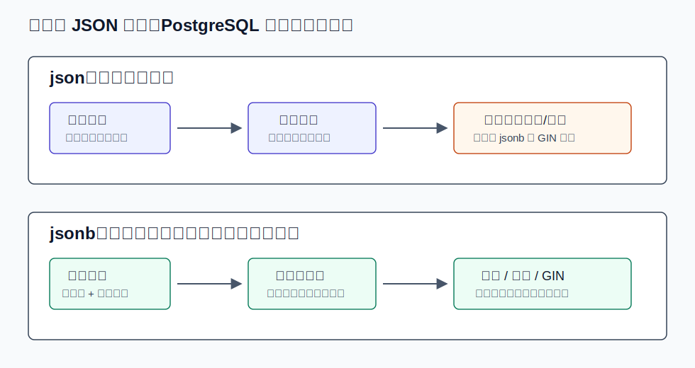
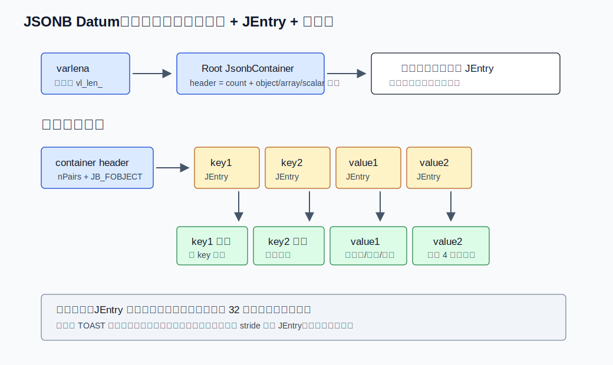
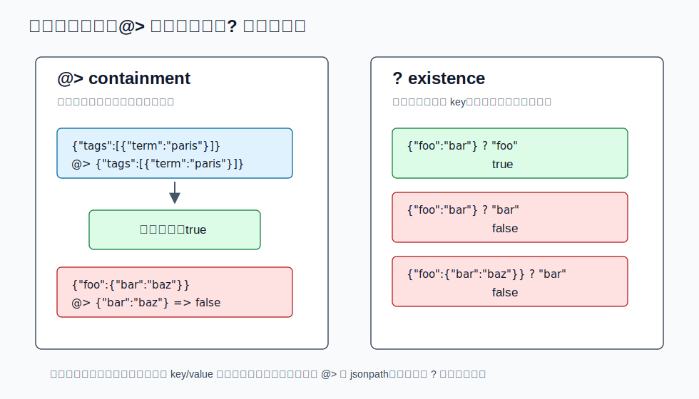
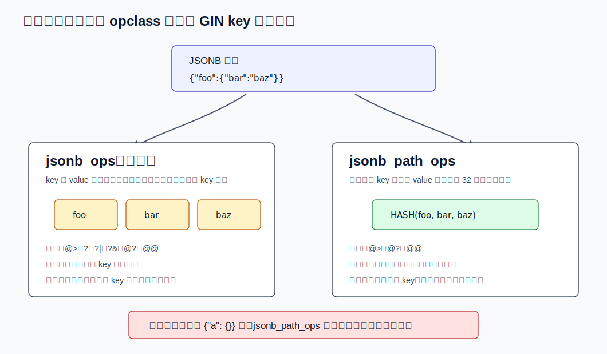
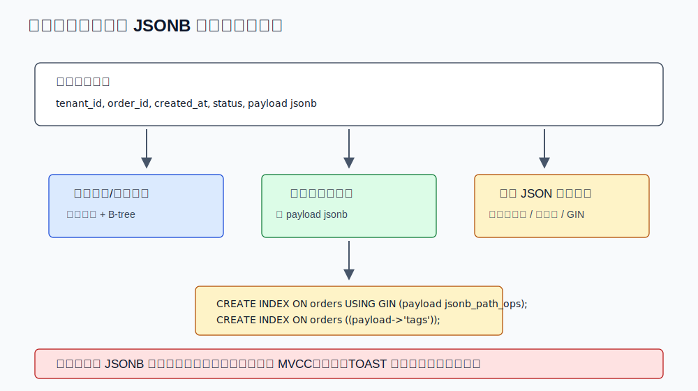

## 数据库筑基课 - JSON 数据类型
                                                                                            
### 作者                                                                
digoal                                                                
                                                                       
### 日期                                                                     
2026-05-26                                                      
                                                                    
### 标签                                                                  
PostgreSQL , 应用开发者 , DBA , 数据库筑基课 , 数据类型与算子 , JSON , JSONB , GIN , jsonpath  
                                                                                           
----                                                                    

## 背景
  

本节属于“数据类型与算子”基础能力。当前工作区没有发现“数据库筑基课”总纲文件，因此本文先独立成篇。

业务系统里，JSON 字段通常不是因为工程师喜欢“反范式”，而是因为业务对象本身在快速变化：

- 第三方接口返回的字段每周变一次，全部拆成列会频繁改表。
- 用户画像、设备属性、风控特征、埋点事件都有大量稀疏属性。
- 订单、工单、审计日志有一部分字段稳定，另一部分字段随行业和租户变化。
- 应用希望在同一个事务里保存原始报文、解析后的核心字段和少量可检索标签。

把这类数据全部放进 `text`，数据库只能保证“它是一段字符串”；把它全部拆成关系表，模型会很硬，迁移成本高。PostgreSQL 的 `json`、`jsonb`、`jsonpath` 把问题变成：**哪些内容需要关系模型的强约束，哪些内容可以作为半结构化文档保存，哪些路径需要被索引和优化器识别。**

本文关键结论以本地 PostgreSQL 源码与文档核对，DeepWiki `postgres/postgres` 仅作为源码导航辅助。本文不制造性能数字；涉及效果时只说明机制带来的方向性收益和代价。

## 一、它解决什么问题？

JSON 数据类型解决的不是“数据库不用建模”的问题，而是“模型变化速度高于表结构变化速度”的问题。

如果没有 JSON 类型，常见做法有三种：

| 做法 | 优点 | 主要问题 |
|---|---|---|
| 全部存 `text` | 写入简单，保留原文 | 数据库不校验 JSON 合法性；查询时每次解析；索引只能依赖表达式或外部处理 |
| EAV 表 | 字段扩展灵活 | 类型、约束、查询、聚合和优化器统计都变复杂；宽对象会拆成大量行 |
| 全部拆列 | 类型和约束清晰 | 字段频繁变化时 DDL、发布、兼容和历史数据成本高 |

PostgreSQL 提供两个层次：

- `json`：校验输入是合法 JSON，并保存输入文本的精确副本。
- `jsonb`：写入时解析成 PostgreSQL 自己的二进制表示，牺牲空白、键顺序和重复键，换取更快处理和索引能力。

代价也必须先讲清楚：`jsonb` 不是局部更新存储。文档放在表的一列里，更新其中一个路径，仍然会走 PostgreSQL 的行级 MVCC 更新、行锁、TOAST 和索引维护路径。官方文档也提醒，虽然可以存大文档，但更新会锁住整行，文档最好代表一个业务上不可再独立拆分的原子 datum。

## 二、它是什么？

PostgreSQL JSON 相关类型有三类。

| 类型 | 定义 | 典型用途 |
|---|---|---|
| `json` | 存储合法 JSON 输入文本的精确副本 | 原始报文归档、需要保留空白/键顺序/重复键的少数场景 |
| `jsonb` | 存储解析后的二进制 JSON 树 | 绝大多数业务查询、索引、包含判断、路径提取 |
| `jsonpath` | 存储解析后的 SQL/JSON path 表达式 | 复杂路径过滤、`@?`、`@@`、SQL/JSON 查询函数 |

官方文档 `postgres/doc/src/sgml/json.sgml` 对 `json` 与 `jsonb` 的差异说得很直接：`json` 保存输入文本，处理函数每次执行都要重新解析；`jsonb` 保存分解后的二进制格式，写入稍慢，但处理更快，并支持索引。



图 1 说明：`json` 的优势是保真，`jsonb` 的优势是进入数据库时完成一次解析和规范化。选择时不要只问“是不是 JSON”，而要问“以后是否要按路径查、按 key/value 判断、建索引、频繁处理”。

`jsonb` 输入还有一些比 JSON 抽象规范更贴近 PostgreSQL 类型系统的限制：

- JSON `number` 映射到 PostgreSQL `numeric`，超出 `numeric` 能表示的范围会被 `jsonb` 拒绝。
- `jsonb` 会更严格处理 Unicode 转义，例如拒绝 `\u0000`，因为 PostgreSQL `text` 不能表示该字符。
- 重复 object key 不会保留，最后出现的值生效。
- 空白和对象键顺序不会保留，输出顺序可能和输入不同。

这些不是 bug，而是 `jsonb` 为了“可比较、可索引、可高效处理”付出的规范化成本。

## 三、核心原理

### 3.1 类型入口：`jsonb_in` 先解析，再构造 JsonbValue

源码入口在 `postgres/src/backend/utils/adt/jsonb.c`：

- `jsonb_in()` 接收文本输入。
- `jsonb_from_cstring()` 设置 JSON parser 的语义动作。
- `jsonb_in_object_start()`、`jsonb_in_object_field_start()`、`jsonb_in_scalar()` 等回调把 token 推入 `JsonbInState`。
- 构造过程先形成内存里的 `JsonbValue`，再由 `JsonbValueToJsonb()` 转成磁盘格式。

这解释了为什么 `jsonb` 写入比 `json` 重：写入阶段已经做了解析、类型映射、对象 key 排序和重复 key 处理。

### 3.2 磁盘表示：varlena + root container + JEntry + 数据区

`postgres/src/include/utils/jsonb.h` 是理解 `jsonb` 的关键文件。源码注释明确区分：

- `Jsonb` 是磁盘表示，是 PostgreSQL varlena datum。
- `JsonbValue` 是内存表示，便于构造、遍历和操作。
- `JsonbContainer` 是数组或对象容器。
- 每个子节点由 `JEntry` 描述类型、长度或偏移，真正的数据放在后面的 variable-length data 区。



图 2 说明：JSONB 不是把 JSON 文本换个编码保存，而是把树摊平成容器、`JEntry` 数组和数据区。对象的 key 先集中存放，value 再按 key 顺序存放。这样 `getKeyJsonValueFromContainer()` 能对对象 key 做二分查找，源码位于 `postgres/src/backend/utils/adt/jsonb_util.c`。

这里有两个重要取舍。

第一，JEntry 不是永远存 offset，也不是永远存 length。源码解释：全部存 offset 随机访问快，但 TOAST 压缩效果差；全部存 length 压缩好，但大数组随机访问会变慢。所以 PostgreSQL 每 `JB_OFFSET_STRIDE` 个子项存一次 offset，其余存 length。当前源码中 `JB_OFFSET_STRIDE` 为 32。这样最多检查一个 stride 内的 JEntry，仍是常数级，同时改善压缩。

第二，对象 key 会排序并去重。`jsonb_util.c` 中 `uniqueifyJsonbObject()` 会对 `JsonbPair` 排序，重复 key 默认保留“最后出现”的值。`jsonb.h` 中 `JsonbPair.order` 的注释也说明，它记录原始顺序，用于以确定方式删除重复 key。

### 3.3 遍历：JsonbIterator 是很多操作的共同底座

`jsonb_util.c` 中的 `JsonbIteratorInit()` 和 `JsonbIteratorNext()` 提供顺序遍历。遍历结果不是直接返回文本，而是返回一串 token：

- `WJB_BEGIN_ARRAY` / `WJB_END_ARRAY`
- `WJB_BEGIN_OBJECT` / `WJB_END_OBJECT`
- `WJB_KEY`
- `WJB_VALUE`
- `WJB_ELEM`

这套 token 被多个功能复用：输出、比较、包含判断、GIN key 抽取、构造新 JSONB。它的意义是把“二进制树”转成一个统一的事件流。

### 3.4 操作符：包含是结构匹配，存在只看顶层

`jsonb` 比 `json` 多出核心语义能力，最常用的是包含和存在。

| 操作 | 含义 | 源码入口 | 选择率函数 |
|---|---|---|---|
| `@>` | 左侧 JSONB 是否包含右侧 JSONB | `jsonb_contains()` | `matchingsel` |
| `<@` | 左侧是否被右侧包含 | `jsonb_contained()` | `matchingsel` |
| `?` | 顶层是否存在某个 key 或字符串数组元素 | `jsonb_exists()` | `matchingsel` |
| `?|` | 顶层是否存在任意一个 key | `jsonb_exists_any()` | `matchingsel` |
| `?&` | 顶层是否存在全部 key | `jsonb_exists_all()` | `matchingsel` |
| `@?` | JSON path 是否返回任意项 | `jsonpath` 执行路径 | `matchingsel` |
| `@@` | JSON path 谓词结果是否为 true | `jsonpath` 执行路径 | `matchingsel` |

这些 operator 在 `postgres/src/include/catalog/pg_operator.dat` 中登记，其中 `@>`、`?`、`?|`、`?&`、`<@` 都使用通用的 `matchingsel` / `matchingjoinsel`。`selfuncs.c` 里的注释说明，`matchingsel` 适合那些标准统计信息可用、默认估计还算合理的匹配型 operator。这意味着优化器能估计，但估计不等于知道 JSON 内部每个路径的真实分布。



图 3 说明：`@>` 是结构匹配，不是“全文搜索”；`?` 只看顶层对象 key 或顶层数组字符串元素，不会递归查找嵌套 key。`jsonb_op.c` 中 `jsonb_exists()` 的注释也明确写着：不递归，只考虑顶层。

### 3.5 GIN 索引：两种 opclass 是两种信息压缩方式

`jsonb` 的工程价值很大一部分来自 GIN。官方文档 `json.sgml` 与源码 `postgres/src/backend/utils/adt/jsonb_gin.c` 都说明 PostgreSQL 提供两个 GIN opclass：

- `jsonb_ops`：默认 opclass，支持 `@>`、`?`、`?|`、`?&`、`@?`、`@@`。
- `jsonb_path_ops`：非默认 opclass，只支持 `@>`、`@?`、`@@`，但索引通常更小，搜索更具体。

catalog 文件也能核对这一点：

- `postgres/src/include/catalog/pg_opclass.dat`：`gin/jsonb_ops` 的 key type 是 `text`，`gin/jsonb_path_ops` 的 key type 是 `int4`，后者不是默认 opclass。
- `postgres/src/include/catalog/pg_amop.dat`：登记两个 opclass 支持的 operator 和 strategy number。
- `postgres/src/include/catalog/pg_amproc.dat`：登记 `gin_extract_jsonb`、`gin_extract_jsonb_path`、`gin_consistent_jsonb`、`gin_consistent_jsonb_path` 等 support function。



图 4 说明：`jsonb_ops` 把 key 和 value 拆成独立索引项；`jsonb_path_ops` 把路径上的 key 和最终 value 合成一个哈希项。前者灵活，后者更专注于包含查询。

源码里的细节值得记住：

- `jsonb.h` 注释说明，`jsonb_ops` 索引 key 和 value，存储格式是带类型标志的 text。字符串数组元素会被标记得像 key 一样，这样才能支持 `?` 把数组字符串元素当成“存在”对象。
- 如果 text 表示超过 `JGIN_MAXLENGTH`，`jsonb_ops` 会存 32 位 hash 的 8 位十六进制表示，并标记 hashed。出现 hashed query item 时需要 recheck。
- `jsonb_gin.c` 顶部注释说明，jsonpath 可抽取的核心形式是 `accessors_chain == const`。`jsonb_ops` 会拆成 `key1 AND key2 ... AND (const_as_value OR const_as_key)`；`jsonb_path_ops` 会变成 `HASH(key1, key2, ..., const)`。
- `jsonb_path_ops` 对 `{"a": {}}` 这种不含 value 的结构不产生索引项。官方文档指出，这类查询可能需要慢的 full-index scan。

### 3.6 jsonpath：路径语言本身也有二进制表示

`jsonpath` 类型实现 SQL/JSON path language。文档 `json.sgml` 说明，它保存解析后的 SQL/JSON path 表达式的二进制表示，供 path engine 和 SQL/JSON 函数使用。源码分布在：

- `postgres/src/backend/utils/adt/jsonpath.c`
- `postgres/src/backend/utils/adt/jsonpath_exec.c`
- `postgres/src/backend/utils/adt/jsonpath_gram.y`
- `postgres/src/backend/utils/adt/jsonpath_scan.l`
- `postgres/src/include/utils/jsonpath.h`

路径语法有几个容易踩坑的点：

- SQL/JSON array 下标从 0 开始，普通 SQL array 默认从 1 开始。
- path 字符串外层是 SQL 字符串，内部字符串使用 JavaScript/ECMAScript 风格双引号。
- `@?` 和 `@@` 会抑制缺字段、类型不匹配、datetime/numeric 错误等几类错误，适合在异构文档上查询。
- GIN 对 jsonpath 不是任意表达式都能加速，只能抽取特定的路径等值条件；无法抽取时需要更多 recheck 或退化。

## 四、横向对比

| 维度 | `json` | `jsonb` | 拆成关系列 | EAV |
|---|---|---|---|---|
| 主要目标 | 保留合法 JSON 原文 | 半结构化数据查询和索引 | 强类型、强约束、强统计 | 高动态属性 |
| 写入代价 | 低，主要做 JSON 合法性检查 | 较高，要解析、规范化、构造二进制 | 中等，取决于列和索引数量 | 高，一条对象可能变多行 |
| 读取代价 | 每次处理要解析 | 直接遍历二进制结构 | 最低，优化器统计最完整 | join/聚合复杂 |
| 空间语义 | 保留空白、键顺序、重复键 | 不保留空白和键顺序，重复键最后值生效 | 固定列 | 属性行膨胀 |
| 索引支持 | 无专用 GIN 能力 | GIN、B-tree、hash、表达式索引 | B-tree、hash、BRIN 等完整能力 | 依赖属性表索引 |
| 约束能力 | JSON 合法性 | JSON 合法性 + 可用 CHECK/表达式 | 最强 | 复杂，需额外约束 |
| 优化器统计 | 对整体值有限 | 对整体值有限，路径统计需表达式/生成列 | 最好 | 分布被拆散 |
| 适合场景 | 原始报文、审计归档 | 稀疏属性、标签、事件 payload | 高频过滤/连接/聚合字段 | 字段极动态且查询模式简单 |
| 不适合场景 | 高频路径查询 | 高频局部更新、强事务约束字段 | 字段变化极快 | 复杂分析和类型安全要求高 |

这张表的核心不是“谁更先进”，而是“代价放在哪里”。`jsonb` 把解析代价前置到写入，把灵活性留给文档，把索引能力交给 opclass；关系列把建模代价前置到 schema，把查询和统计能力最大化；EAV 把 schema 变化转成数据变化，但会把 SQL 和约束复杂度推高。

## 五、效果如何？

从机制上看，`jsonb` 的收益主要来自四点。

第一，处理函数不需要每次重新解析文本。读取路径可以直接遍历 `JsonbContainer`，按 token 流处理。

第二，对象 key 排序后可以二分查找。`getKeyJsonValueFromContainer()` 在对象容器里通过 key 长度/内容比较定位 key，这比每次扫描文本更稳定。

第三，GIN 能把“文档包含 key/value”变成倒排索引查找。`jsonb_ops` 更灵活，`jsonb_path_ops` 更具体。

第四，jsonpath 能表达更复杂的路径条件，并且 `jsonb_gin.c` 能从一部分 jsonpath 谓词中抽取 GIN 查询项。

代价也同样明确。

- 写入更慢：输入要解析和规范化。
- 更新更重：改一个 JSON path 仍是行级更新，相关索引也要维护。
- 索引可能很大：`jsonb_ops` 会抽取大量 key/value；文档越宽，写放大越明显。
- 优化器不知道每个路径的真实分布：没有把路径提成表达式/生成列时，很多选择率只能走通用估计。
- `jsonb_path_ops` 有边界：不能支持 key exists，空对象结构没有 value 可抽取。

## 六、实操 DEMO

下面是一组最小实验脚本。本文写作时没有启动本地 PostgreSQL 实例执行这些 SQL，因此不提供伪造输出；语法和语义参考了 PostgreSQL 文档与 `src/test/regress/sql/jsonb.sql`、`jsonpath.sql`、`jsonb_jsonpath.sql` 中的用例。

```sql
DROP TABLE IF EXISTS api_event;

CREATE TABLE api_event (
  id         bigserial PRIMARY KEY,
  tenant_id  bigint NOT NULL,
  created_at timestamptz NOT NULL DEFAULT now(),
  payload    jsonb NOT NULL
);

INSERT INTO api_event (tenant_id, payload) VALUES
(1, '{"guid":"a1","company":"Magnafone","status":"paid","tags":["postgres","jsonb"],"amount":19.90}'),
(1, '{"guid":"a2","company":"Other","status":"pending","tags":["search"],"amount":7.00}'),
(2, '{"guid":"b1","company":"Magnafone","status":"paid","tags":[{"term":"paris"},{"term":"food"}],"amount":33.20}');
```

### 6.1 验证 jsonb 规范化

```sql
SELECT '{"b":1, "a":2, "a":3}'::jsonb;
```

应观察到：输出不会保留输入空白和键顺序，重复 key `a` 只保留最后值。这一行为来自 `jsonb` 的规范化和 `uniqueifyJsonbObject()`。

### 6.2 包含查询

```sql
SELECT id
FROM api_event
WHERE payload @> '{"company":"Magnafone","status":"paid"}';
```

这个查询适合整列 GIN：

```sql
CREATE INDEX api_event_payload_gin
ON api_event USING GIN (payload);

EXPLAIN
SELECT id
FROM api_event
WHERE payload @> '{"company":"Magnafone","status":"paid"}';
```

预期验证方向：数据量足够大且选择率合适时，计划可能使用 `Bitmap Index Scan` + `Bitmap Heap Scan`。小表上优化器选择顺序扫描也正常。

### 6.3 针对某个路径建表达式索引

```sql
CREATE INDEX api_event_tags_gin
ON api_event USING GIN ((payload -> 'tags'));

EXPLAIN
SELECT id
FROM api_event
WHERE payload -> 'tags' ? 'postgres';
```

整列 GIN 索引不能直接支持 `payload -> 'tags' ? 'postgres'`，因为 indexable operator `?` 不是直接作用在索引列 `payload` 上。文档 `json.sgml` 给出的做法是表达式 GIN 索引。

### 6.4 使用 `jsonb_path_ops`

```sql
CREATE INDEX api_event_payload_path_gin
ON api_event USING GIN (payload jsonb_path_ops);

EXPLAIN
SELECT id
FROM api_event
WHERE payload @> '{"tags":[{"term":"paris"}]}';
```

如果 workload 主要是 `@>` 和可抽取等值条件的 `@?` / `@@`，`jsonb_path_ops` 往往比默认 `jsonb_ops` 更小、更具体。但它不能支持：

```sql
SELECT id
FROM api_event
WHERE payload ? 'company';
```

### 6.5 把高频路径提成列或表达式

```sql
CREATE INDEX api_event_tenant_created_idx
ON api_event (tenant_id, created_at DESC);

CREATE INDEX api_event_status_idx
ON api_event ((payload ->> 'status'));

EXPLAIN
SELECT id
FROM api_event
WHERE tenant_id = 1
  AND payload ->> 'status' = 'paid'
ORDER BY created_at DESC
LIMIT 20;
```

如果 `status` 已经是稳定、高频过滤字段，更推荐把它提升为普通列，或者使用生成列。JSONB 适合变化属性，不适合把所有稳定主查询维度都藏起来。

## 七、最佳实践



图 5 说明：一张表可以同时使用普通列、JSONB、表达式索引和 GIN。关键是按访问路径建模，而不是按“字段是不是灵活”一刀切。

面向数据库架构师：

- 把租户、主状态、时间、外键、金额等强约束和高频 join/filter 字段放普通列。
- 把变化快、稀疏、低频访问的扩展属性放 `jsonb`。
- 对稳定 JSON path 建表达式索引或生成列；不要指望整列 GIN 解决所有路径查询。
- 对文档大小设上限。大 JSONB 更新会放大行版本、TOAST、WAL 和索引维护成本。

面向 DBA：

- 区分 `jsonb_ops` 和 `jsonb_path_ops`。需要 `?`、`?|`、`?&` 时用默认 `jsonb_ops`；主要做 `@>` 时评估 `jsonb_path_ops`。
- 观察 GIN 索引体积、写入延迟、pending list 清理和 autovacuum 压力。
- 用 `EXPLAIN (ANALYZE, BUFFERS)` 验证查询是否真的走了目标索引，以及 recheck 比例是否可接受。
- 对选择率误判明显的路径，考虑表达式统计、生成列统计或更明确的关系列。

面向业务开发者：

- 不要把 JSONB 当“随便塞”的字段。先约定顶层结构、关键路径和类型。
- 使用 `jsonb_build_object()`、`to_jsonb()` 等函数构造 JSONB，减少手写字符串拼接。
- 读标量过滤时注意 `->` 返回 `json/jsonb`，`->>` 返回文本；比较对象和文本时不要混淆。
- `?` 不是递归搜索；嵌套匹配优先用 `@>` 或 jsonpath。
- 更新路径时明确并发语义：更新同一行不同 JSON path 也会争用同一行锁。

## 八、适合与不适合场景

适合：

- 事件、日志、审计、Webhook 原始 payload，同时抽取少量稳定列。
- 用户画像、设备属性、商品扩展属性，字段多、稀疏、变化快。
- 标签、配置、策略条件等需要按 key/value 做包含查询的文档。
- 多租户系统中，每个租户有少量自定义字段，但主查询维度相对稳定。

不适合：

- 高频更新单个小字段，且大量事务会同时更新同一业务对象。
- 强类型、强外键、强唯一约束、复杂 join 的核心交易数据。
- 需要大量按路径聚合、排序、范围过滤，却没有把路径提成列或表达式索引。
- 文档结构完全不受控，查询却要求低延迟和稳定计划。
- 需要保留输入空白、键顺序、重复 key 的归档数据，此时应选 `json` 或同时保存原文。

## 九、常见坑

1. 把 `jsonb` 当成 MongoDB 文档存储替代品。PostgreSQL 仍是行存 MVCC 数据库，JSONB 更新不是文档局部原地更新。

2. 整列 GIN 建完就以为所有 JSON 查询都会变快。只有 operator 和表达式形态能匹配 opclass 时才可能用上。

3. 用 `payload -> 'status' = '"paid"'` 和 `payload ->> 'status' = 'paid'` 混着写。前者比较 JSONB 字符串，后者比较 SQL text，索引设计也不同。

4. 忽略 `jsonb_path_ops` 不支持 `?`。如果业务既有 `@>` 又有 key exists，可能需要默认 opclass、表达式索引，或组合多个索引。

5. 在 `jsonb_path_ops` 上查询空对象结构，例如 `payload @> '{"a":{}}'`。这类结构没有 value 可抽取，可能需要慢扫描。

6. 让 JSONB 文档无限长。单行变大后，TOAST、WAL、vacuum、缓存命中率和复制延迟都会受影响。

7. 忽略路径统计。优化器对 JSONB 内部路径分布没有天然完整统计，热点路径应提成表达式或列，让统计系统看得见。

8. 在应用层拼 JSON 字符串。转义错误、数字精度、null 语义都容易出问题；优先使用参数绑定和 JSON 构造函数。

## 十、扩展问题

1. 如果一个 `jsonb` 字段中有 20 个路径经常被过滤，其中 5 个还参与排序，你会把哪些路径提升为普通列，哪些保留表达式索引，哪些交给 GIN？

2. 一个表既有 `payload @> '{"status":"paid"}'`，又有 `payload ? 'risk'`，还经常查 `payload -> 'tags' ? 'vip'`。你会设计几个索引？为什么？

3. 如果 `jsonb_ops` 索引体积过大，你会先改成 `jsonb_path_ops`，还是先做表达式索引、局部索引或字段提升？需要哪些 workload 证据？

4. `jsonb` 的对象 key 排序和重复 key 去重，对“审计原始报文”意味着什么？是否需要同时保存 `json` 或 `text` 原文？

5. 当 JSONB 查询选择率估计不准时，你有哪些办法让优化器看到更好的统计信息？

## 十一、扩展阅读

- PostgreSQL 文档：`postgres/doc/src/sgml/json.sgml`，JSON/JSONB 类型、设计建议、包含/存在语义、索引、下标、jsonpath。
- PostgreSQL 文档：`postgres/doc/src/sgml/func/func-json.sgml`，JSON/JSONB 操作符、SQL/JSON 函数、jsonpath 函数和 `JSON_TABLE`。
- PostgreSQL 文档：`postgres/doc/src/sgml/gin.sgml`，GIN 内置 opclass 表和 JSONB opclass 差异。
- PostgreSQL 源码：`postgres/src/include/utils/jsonb.h`，JSONB 磁盘结构、`JEntry`、`JsonbContainer`、GIN key 标志。
- PostgreSQL 源码：`postgres/src/backend/utils/adt/jsonb.c`，JSONB 输入输出、构造函数、聚合、类型转换。
- PostgreSQL 源码：`postgres/src/backend/utils/adt/jsonb_util.c`，JSONB 迭代、查找、比较、排序和去重。
- PostgreSQL 源码：`postgres/src/backend/utils/adt/jsonb_op.c`，`@>`、`?`、比较和 hash operator 实现。
- PostgreSQL 源码：`postgres/src/backend/utils/adt/jsonb_gin.c`，`jsonb_ops` 与 `jsonb_path_ops` 的 GIN support function。
- PostgreSQL catalog：`postgres/src/include/catalog/pg_operator.dat`、`pg_opclass.dat`、`pg_amop.dat`、`pg_amproc.dat`，operator、opclass、strategy 和 support function 登记。
- PostgreSQL 回归测试：`postgres/src/test/regress/sql/jsonb.sql`、`jsonpath.sql`、`jsonb_jsonpath.sql`。
- DeepWiki：`postgres/postgres`，用于源码导航；本文关键结论已回到本地源码和文档核对。

---

## 本文校验记录

- 标题、分类、结构已按“数据库筑基课 - JSON 数据类型”整理。
- 主题分类为“数据类型与算子”，覆盖表示、操作符语义、索引支持、选择率/优化器影响和建模模式。
- 主要机制已用 PostgreSQL 本地文档、源码和 catalog 文件核对。
- SQL 示例未在本轮启动 PostgreSQL 实例执行，文中已明确说明，不提供伪造输出。
- SVG 图均为独立文件，使用相对路径引用，不含 JavaScript、`foreignObject`、远程资源或外部 CSS。
  
## 附录  
  
1、克隆代码  
```  
git clone --depth 1 https://github.com/postgres/postgres
```  
  
2、启用 codex, 使用 [数据库筑基课 skill](../skills/README.md).  
````
文章标题: 
  数据库筑基课 - JSON 数据类型
项目源码(已克隆到当前项目如下目录中):  
  postgres
项目 deepwiki reponame:  
  postgres/postgres
项目参考信息: 
  postgres/CLAUDE.md
````
  
  
#### [PostgreSQL 解决方案集合](../201706/20170601_02.md "40cff096e9ed7122c512b35d8561d9c8")
  
  
#### [德哥 / digoal's Github - 公益是一辈子的事.](https://github.com/digoal/blog/blob/master/README.md "22709685feb7cab07d30f30387f0a9ae")
  
  
#### [About 德哥](https://github.com/digoal/blog/blob/master/me/readme.md "a37735981e7704886ffd590565582dd0")
  
  

  
